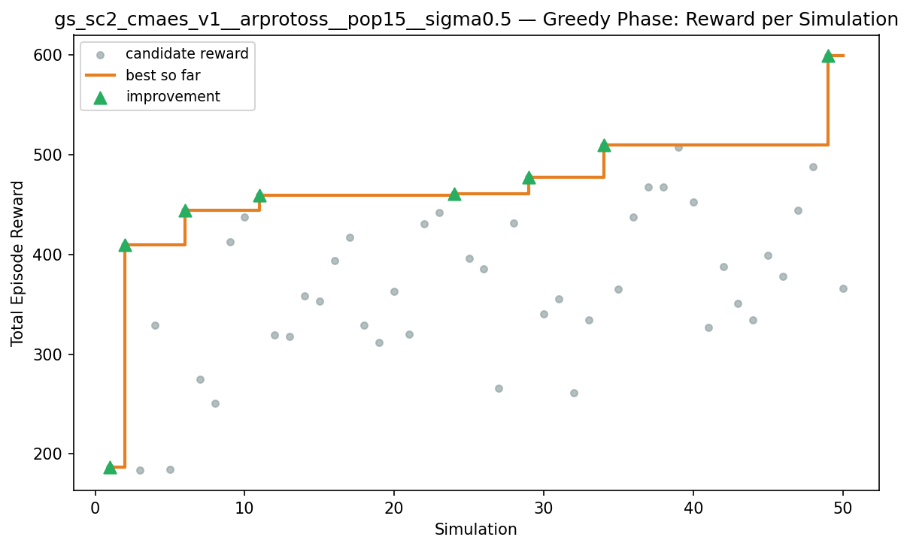
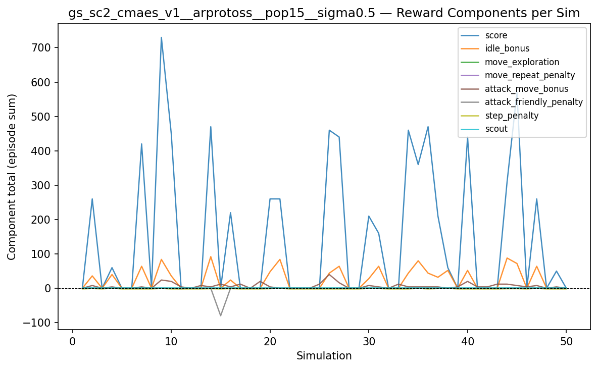
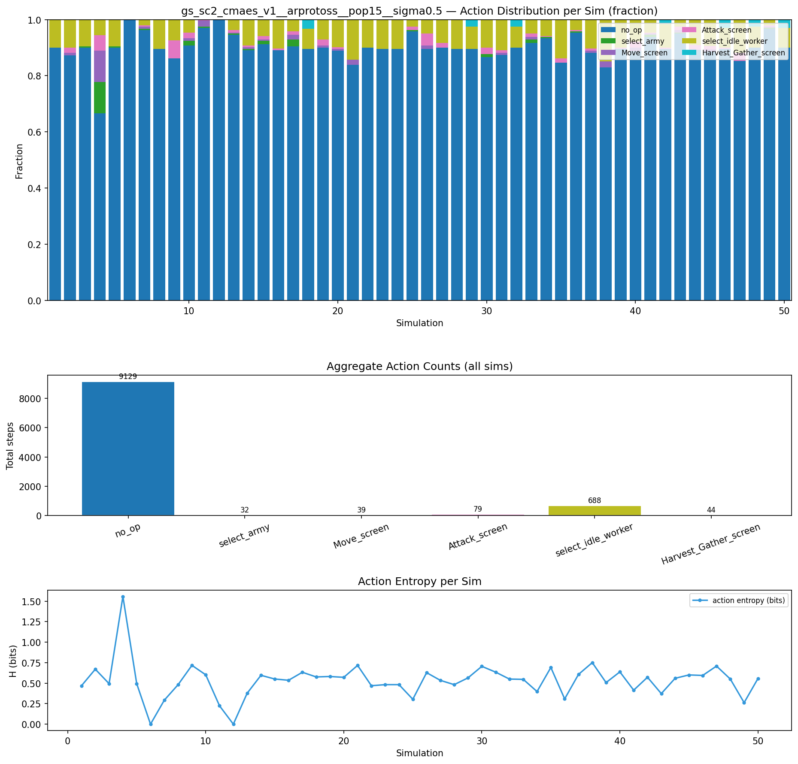
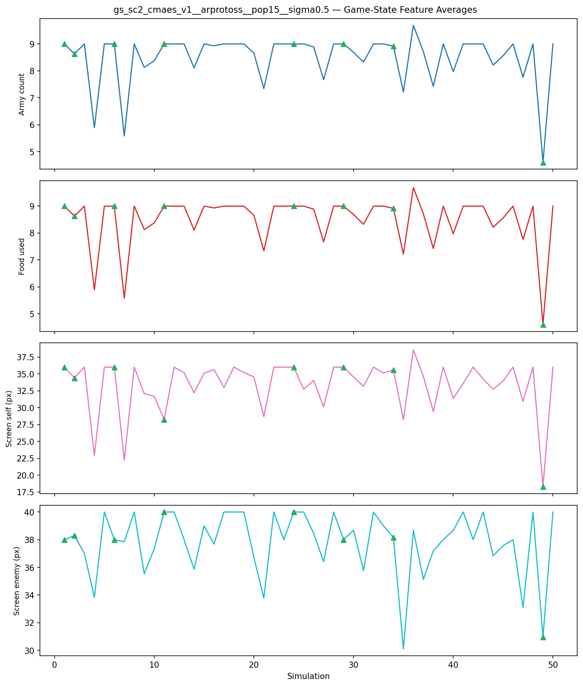
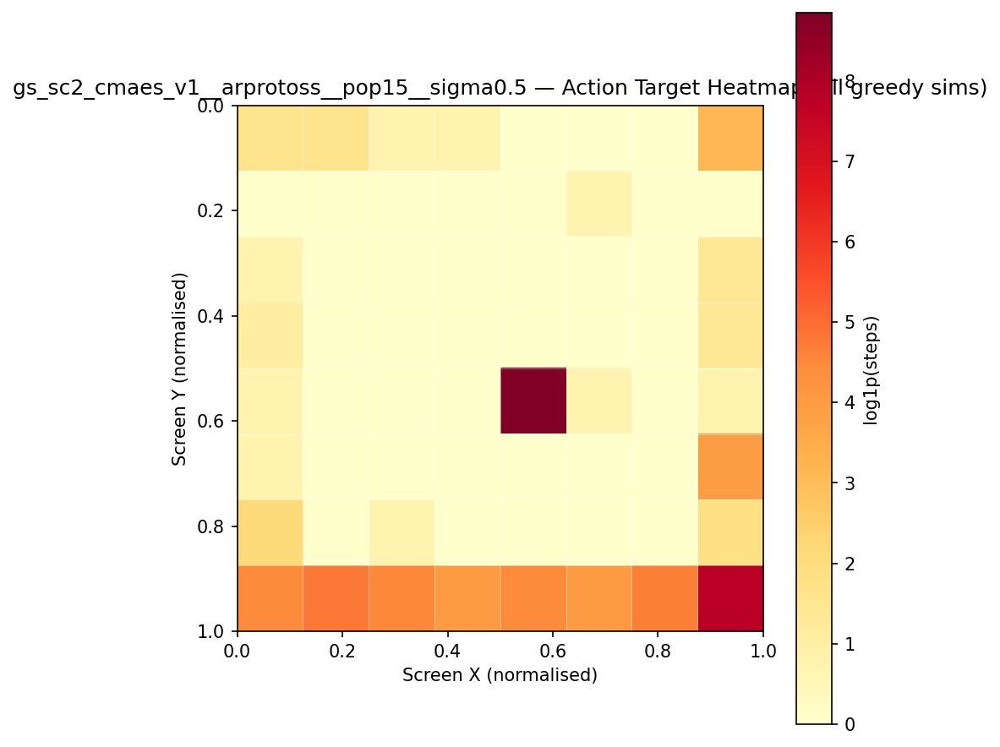
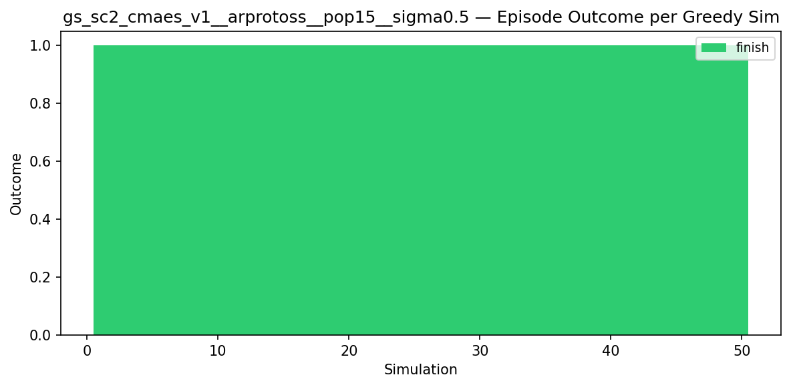
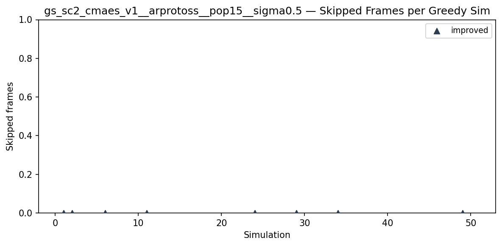
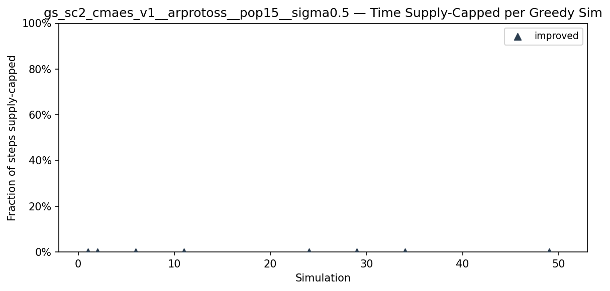
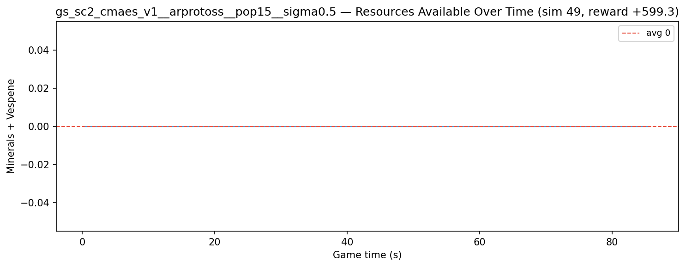
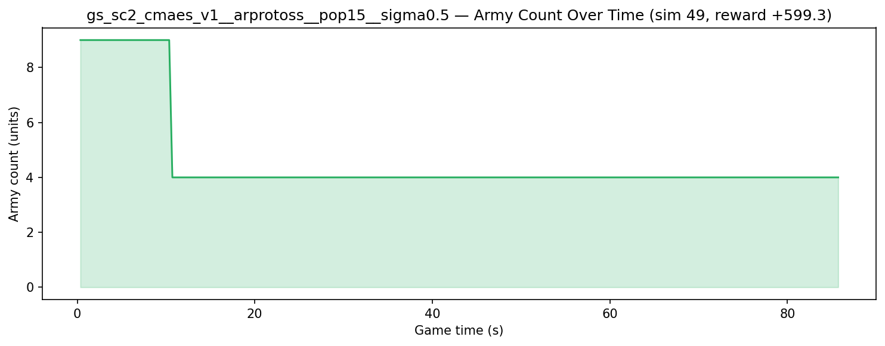

# Experiment: gs_sc2_cmaes_v1__arprotoss__pop15__sigma0.5

**Game:** StarCraft 2

## Timings

- **Start:** 2026-05-14 14:49:42
- **End:** 2026-05-14 18:44:13
- **Total runtime:** 3h 54m 30.7s

| Phase | Duration |
|-------|----------|
| Greedy | 3h 54m 29.7s |

## Run Parameters

### Training

| Parameter | Value |
|-----------|-------|
| track | sc2_DefeatZerglingsAndBanelings |
| map_name | DefeatZerglingsAndBanelings |
| in_game_episode_s | 120.0 |
| step_mul | 8 |
| screen_size | 64 |
| minimap_size | 64 |
| max_apm | 300 |
| agent_race | protoss |
| n_sims | 50 |
| policy_type | cmaes |
| obs_spec_preset | rich |
| enable_belief | True |
| population_size | 15 |
| initial_sigma | 0.5 |
| policy_params | {'eval_episodes': 5, 'population_size': 15, 'initial_sigma': 0.5} |

### Reward Config

| Parameter | Value |
|-----------|-------|
| score_weight | 10.0 |
| win_bonus | 1000.0 |
| loss_penalty | -100.0 |
| step_penalty | -0.001 |
| idle_penalty | 0.0 |
| idle_bonus | 0.5 |
| move_exploration_bonus | 1.0 |
| move_repeat_penalty | -0.05 |
| move_self_penalty | -0.1 |
| attack_move_bonus | 0.5 |
| click_attack_bonus | 1.0 |
| click_attack_cooldown_steps | 8 |
| attack_friendly_penalty | -10.0 |
| economy_weight | 0.001 |

## Greedy Phase

Best reward: **+599.3**

| Sim  | Reward   | Progress | Finish Time | Mean abs lat | Reason       | Result       |
|------|----------|----------|-------------|--------------|--------------|-------------|
|    1 |   +186.7 | 0.000    | —           | —       | finish       | **NEW BEST** |
|    2 |   +409.6 | 0.000    | —           | —       | finish       | **NEW BEST** |
|    3 |   +184.1 | 0.000    | —           | —       | finish       |  |
|    4 |   +329.4 | 0.000    | —           | —       | finish       |  |
|    5 |   +184.7 | 0.000    | —           | —       | finish       |  |
|    6 |   +444.1 | 0.000    | —           | —       | finish       | **NEW BEST** |
|    7 |   +275.2 | 0.000    | —           | —       | finish       |  |
|    8 |   +250.5 | 0.000    | —           | —       | finish       |  |
|    9 |   +413.0 | 0.000    | —           | —       | finish       |  |
|   10 |   +437.1 | 0.000    | —           | —       | finish       |  |
|   11 |   +459.6 | 0.000    | —           | —       | finish       | **NEW BEST** |
|   12 |   +319.5 | 0.000    | —           | —       | finish       |  |
|   13 |   +317.9 | 0.000    | —           | —       | finish       |  |
|   14 |   +358.5 | 0.000    | —           | —       | finish       |  |
|   15 |   +353.3 | 0.000    | —           | —       | finish       |  |
|   16 |   +393.7 | 0.000    | —           | —       | finish       |  |
|   17 |   +417.1 | 0.000    | —           | —       | finish       |  |
|   18 |   +329.3 | 0.000    | —           | —       | finish       |  |
|   19 |   +311.6 | 0.000    | —           | —       | finish       |  |
|   20 |   +363.0 | 0.000    | —           | —       | finish       |  |
|   21 |   +320.3 | 0.000    | —           | —       | finish       |  |
|   22 |   +430.8 | 0.000    | —           | —       | finish       |  |
|   23 |   +442.0 | 0.000    | —           | —       | finish       |  |
|   24 |   +460.9 | 0.000    | —           | —       | finish       | **NEW BEST** |
|   25 |   +395.9 | 0.000    | —           | —       | finish       |  |
|   26 |   +385.6 | 0.000    | —           | —       | finish       |  |
|   27 |   +265.7 | 0.000    | —           | —       | finish       |  |
|   28 |   +431.3 | 0.000    | —           | —       | finish       |  |
|   29 |   +477.4 | 0.000    | —           | —       | finish       | **NEW BEST** |
|   30 |   +340.5 | 0.000    | —           | —       | finish       |  |
|   31 |   +355.7 | 0.000    | —           | —       | finish       |  |
|   32 |   +261.2 | 0.000    | —           | —       | finish       |  |
|   33 |   +334.5 | 0.000    | —           | —       | finish       |  |
|   34 |   +510.1 | 0.000    | —           | —       | finish       | **NEW BEST** |
|   35 |   +365.5 | 0.000    | —           | —       | finish       |  |
|   36 |   +437.7 | 0.000    | —           | —       | finish       |  |
|   37 |   +467.9 | 0.000    | —           | —       | finish       |  |
|   38 |   +467.2 | 0.000    | —           | —       | finish       |  |
|   39 |   +507.5 | 0.000    | —           | —       | finish       |  |
|   40 |   +452.6 | 0.000    | —           | —       | finish       |  |
|   41 |   +326.8 | 0.000    | —           | —       | finish       |  |
|   42 |   +387.9 | 0.000    | —           | —       | finish       |  |
|   43 |   +351.0 | 0.000    | —           | —       | finish       |  |
|   44 |   +334.7 | 0.000    | —           | —       | finish       |  |
|   45 |   +398.9 | 0.000    | —           | —       | finish       |  |
|   46 |   +378.3 | 0.000    | —           | —       | finish       |  |
|   47 |   +444.2 | 0.000    | —           | —       | finish       |  |
|   48 |   +488.3 | 0.000    | —           | —       | finish       |  |
|   49 |   +599.3 | 0.000    | —           | —       | finish       | **NEW BEST** |
|   50 |   +365.9 | 0.000    | —           | —       | finish       |  |

