# Experiment: gs_sc2_cmaes_v1__arprotoss__pop25__sigma0.3

**Game:** StarCraft 2

## Timings

- **Start:** 2026-05-15 00:42:36
- **End:** 2026-05-15 06:46:58
- **Total runtime:** 6h 04m 21.7s

| Phase | Duration |
|-------|----------|
| Greedy | 6h 04m 20.7s |

## Run Parameters

### Training

| Parameter | Value |
|-----------|-------|
| track | sc2_DefeatZerglingsAndBanelings |
| map_name | DefeatZerglingsAndBanelings |
| in_game_episode_s | 120.0 |
| step_mul | 8 |
| screen_size | 64 |
| minimap_size | 64 |
| max_apm | 300 |
| agent_race | protoss |
| n_sims | 50 |
| policy_type | cmaes |
| obs_spec_preset | rich |
| enable_belief | True |
| population_size | 25 |
| initial_sigma | 0.3 |
| policy_params | {'eval_episodes': 5, 'population_size': 25, 'initial_sigma': 0.3} |

### Reward Config

| Parameter | Value |
|-----------|-------|
| score_weight | 10.0 |
| win_bonus | 1000.0 |
| loss_penalty | -100.0 |
| step_penalty | -0.001 |
| idle_penalty | 0.0 |
| idle_bonus | 0.5 |
| move_exploration_bonus | 1.0 |
| move_repeat_penalty | -0.05 |
| move_self_penalty | -0.1 |
| attack_move_bonus | 0.5 |
| click_attack_bonus | 1.0 |
| click_attack_cooldown_steps | 8 |
| attack_friendly_penalty | -10.0 |
| economy_weight | 0.001 |

## Greedy Phase

Best reward: **+754.2**

| Sim  | Reward   | Progress | Finish Time | Mean abs lat | Reason       | Result       |
|------|----------|----------|-------------|--------------|--------------|-------------|
|    1 |   +412.0 | 0.000    | —           | —       | finish       | **NEW BEST** |
|    2 |   +281.1 | 0.000    | —           | —       | finish       |  |
|    3 |   +305.7 | 0.000    | —           | —       | finish       |  |
|    4 |   +383.5 | 0.000    | —           | —       | finish       |  |
|    5 |   +203.3 | 0.000    | —           | —       | finish       |  |
|    6 |   +363.5 | 0.000    | —           | —       | finish       |  |
|    7 |   +406.4 | 0.000    | —           | —       | finish       |  |
|    8 |   +383.9 | 0.000    | —           | —       | finish       |  |
|    9 |   +366.2 | 0.000    | —           | —       | finish       |  |
|   10 |   +375.6 | 0.000    | —           | —       | finish       |  |
|   11 |   +396.5 | 0.000    | —           | —       | finish       |  |
|   12 |   +382.5 | 0.000    | —           | —       | finish       |  |
|   13 |   +262.1 | 0.000    | —           | —       | finish       |  |
|   14 |   +418.4 | 0.000    | —           | —       | finish       | **NEW BEST** |
|   15 |   +350.2 | 0.000    | —           | —       | finish       |  |
|   16 |   +395.9 | 0.000    | —           | —       | finish       |  |
|   17 |   +374.3 | 0.000    | —           | —       | finish       |  |
|   18 |   +464.3 | 0.000    | —           | —       | finish       | **NEW BEST** |
|   19 |   +435.3 | 0.000    | —           | —       | finish       |  |
|   20 |   +349.3 | 0.000    | —           | —       | finish       |  |
|   21 |   +469.3 | 0.000    | —           | —       | finish       | **NEW BEST** |
|   22 |   +468.1 | 0.000    | —           | —       | finish       |  |
|   23 |   +467.2 | 0.000    | —           | —       | finish       |  |
|   24 |   +521.7 | 0.000    | —           | —       | finish       | **NEW BEST** |
|   25 |   +455.8 | 0.000    | —           | —       | finish       |  |
|   26 |   +613.6 | 0.000    | —           | —       | finish       | **NEW BEST** |
|   27 |   +540.7 | 0.000    | —           | —       | finish       |  |
|   28 |   +556.7 | 0.000    | —           | —       | finish       |  |
|   29 |   +582.2 | 0.000    | —           | —       | finish       |  |
|   30 |   +426.0 | 0.000    | —           | —       | finish       |  |
|   31 |   +652.4 | 0.000    | —           | —       | finish       | **NEW BEST** |
|   32 |   +633.2 | 0.000    | —           | —       | finish       |  |
|   33 |   +521.1 | 0.000    | —           | —       | finish       |  |
|   34 |   +610.5 | 0.000    | —           | —       | finish       |  |
|   35 |   +477.3 | 0.000    | —           | —       | finish       |  |
|   36 |   +591.1 | 0.000    | —           | —       | finish       |  |
|   37 |   +447.7 | 0.000    | —           | —       | finish       |  |
|   38 |   +686.0 | 0.000    | —           | —       | finish       | **NEW BEST** |
|   39 |   +498.0 | 0.000    | —           | —       | finish       |  |
|   40 |   +548.9 | 0.000    | —           | —       | finish       |  |
|   41 |   +578.1 | 0.000    | —           | —       | finish       |  |
|   42 |   +754.2 | 0.000    | —           | —       | finish       | **NEW BEST** |
|   43 |   +430.5 | 0.000    | —           | —       | finish       |  |
|   44 |   +514.4 | 0.000    | —           | —       | finish       |  |
|   45 |   +548.2 | 0.000    | —           | —       | finish       |  |
|   46 |   +576.2 | 0.000    | —           | —       | finish       |  |
|   47 |   +485.9 | 0.000    | —           | —       | finish       |  |
|   48 |   +543.3 | 0.000    | —           | —       | finish       |  |
|   49 |   +563.4 | 0.000    | —           | —       | finish       |  |
|   50 |   +743.3 | 0.000    | —           | —       | finish       |  |

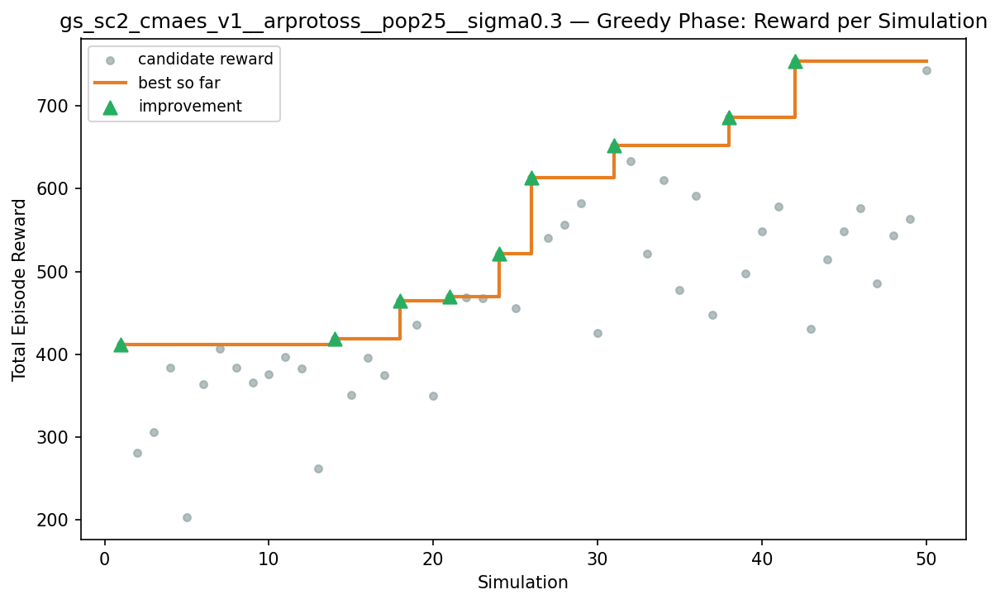

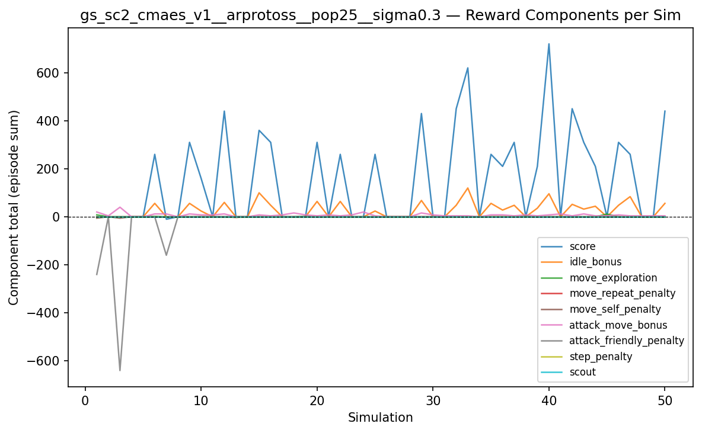

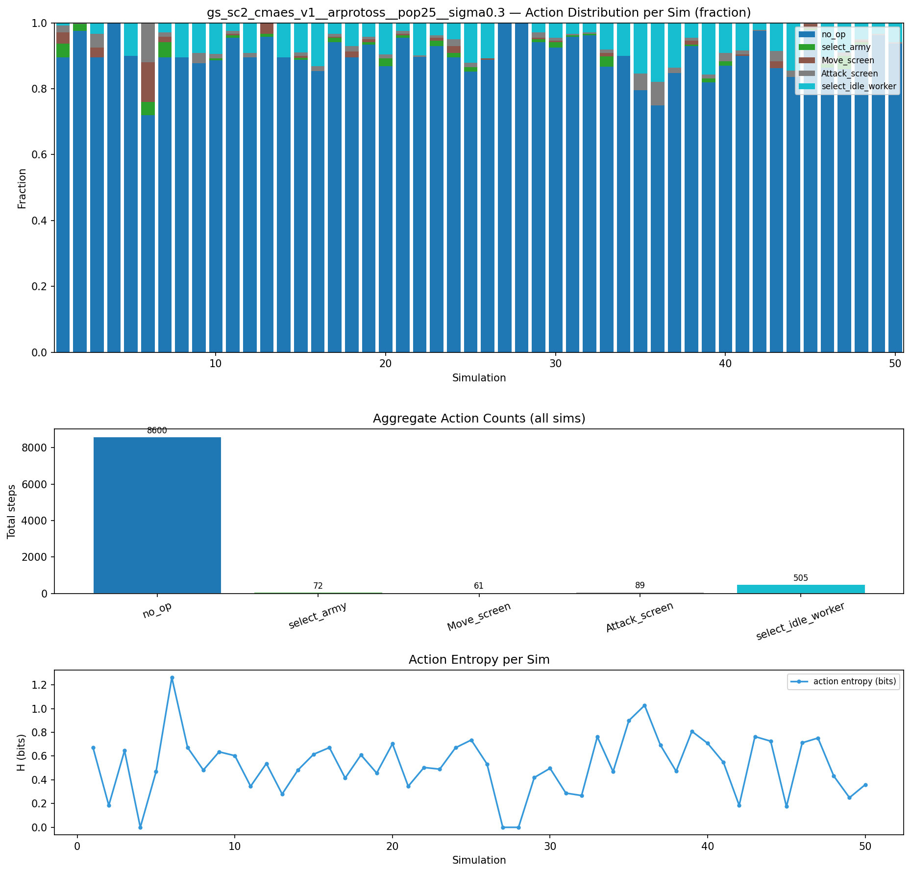

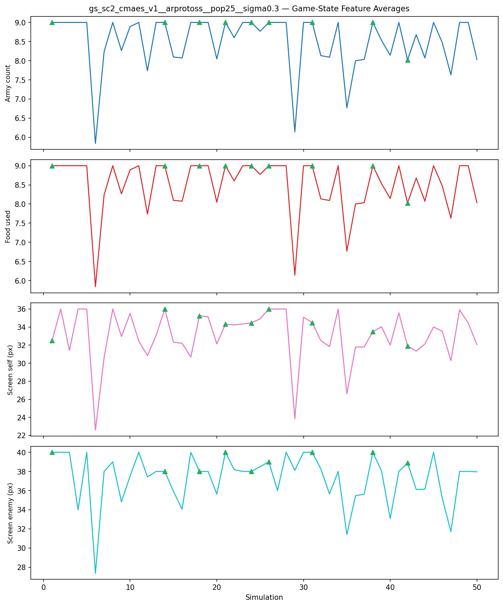

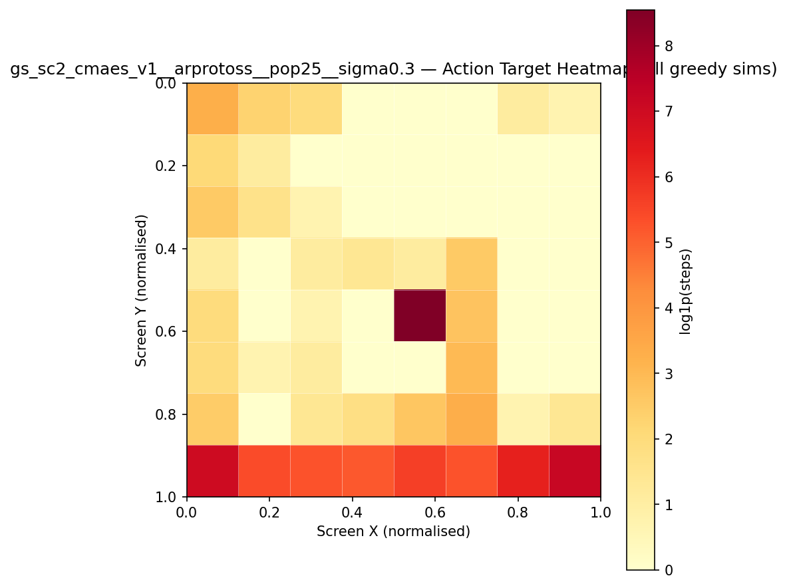

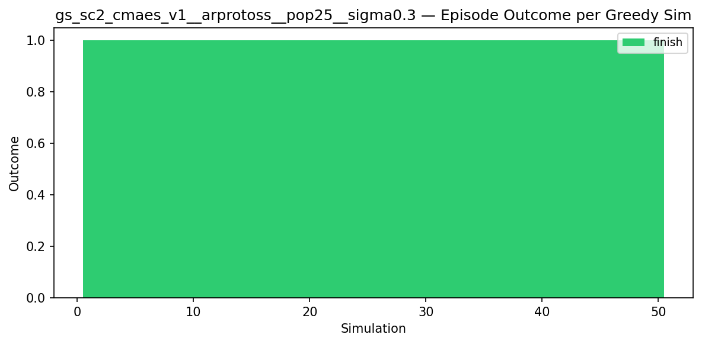

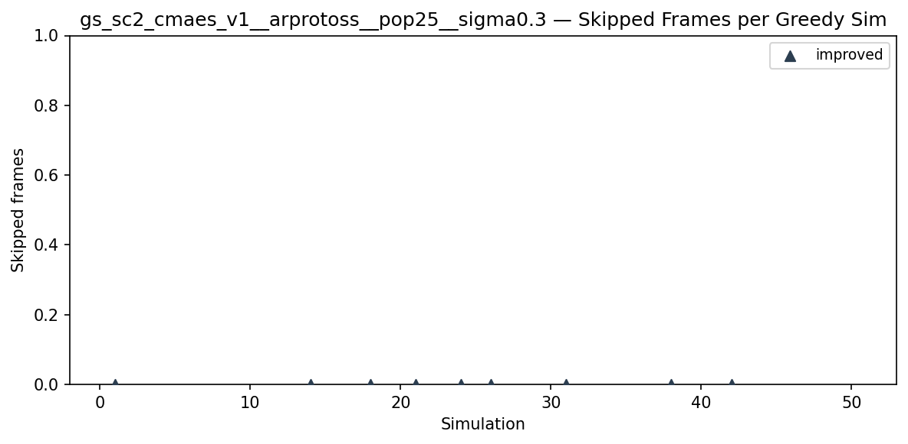

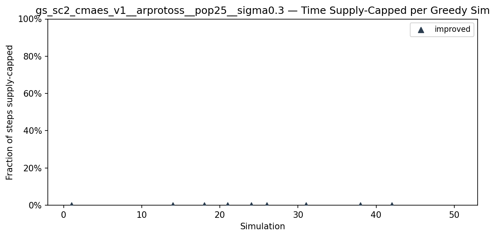

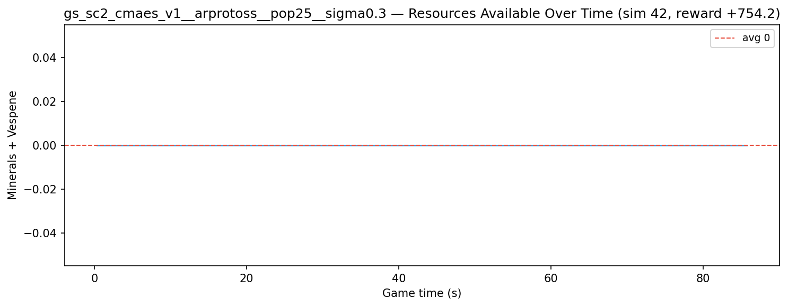

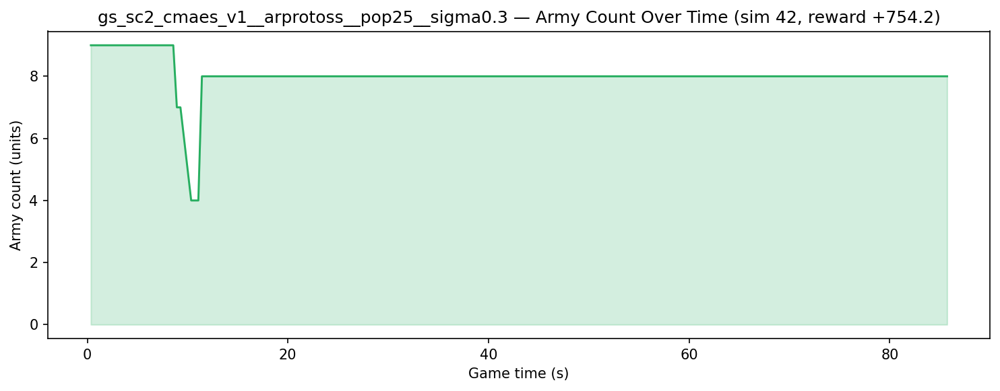

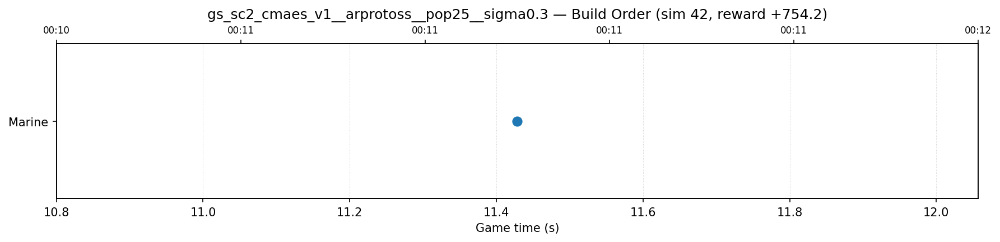

