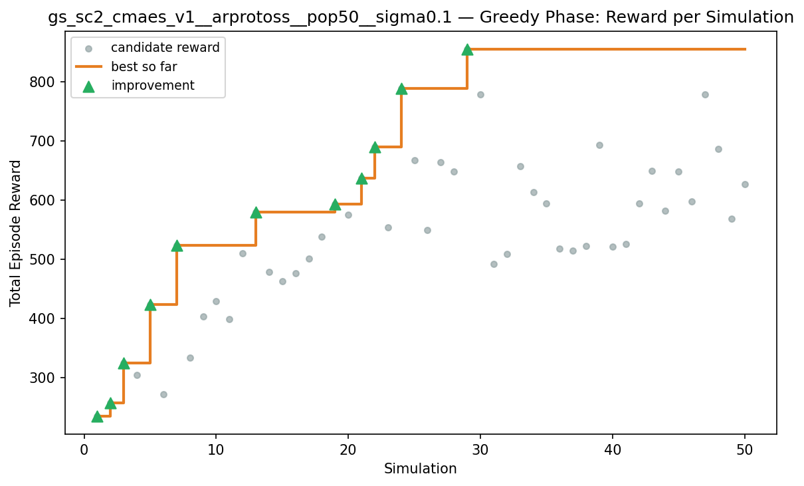
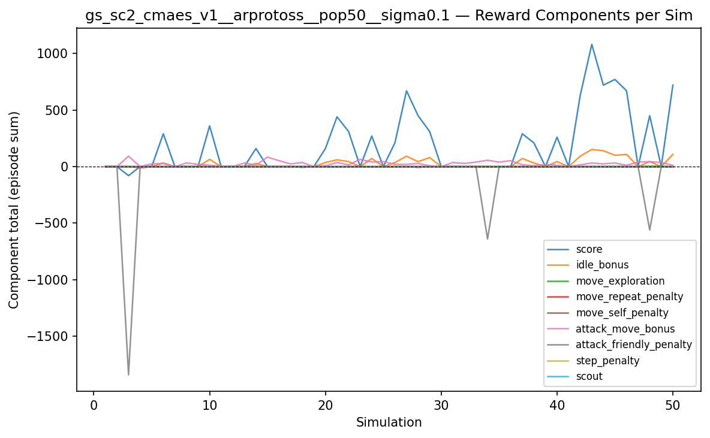
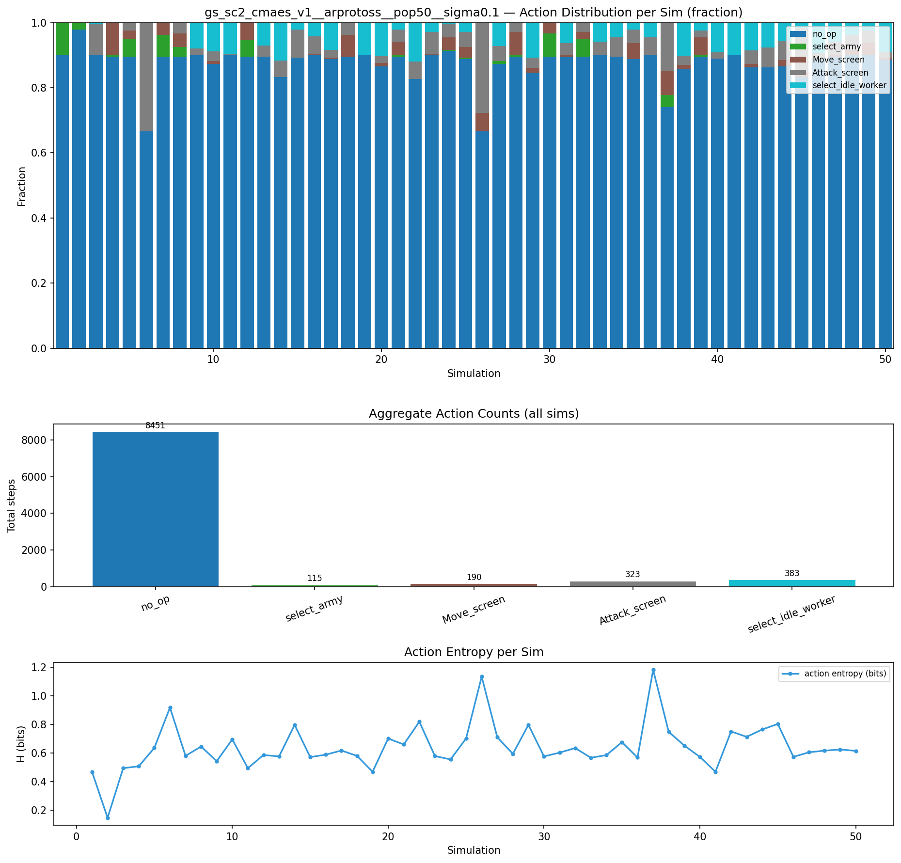
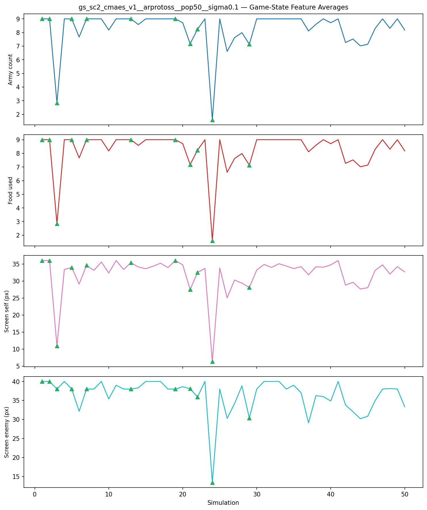
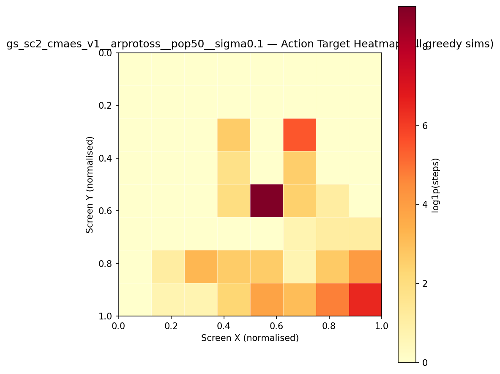
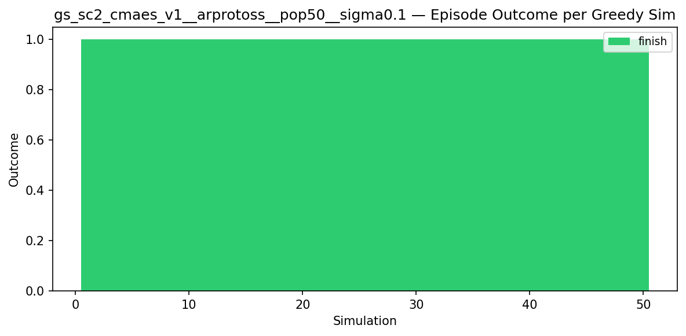
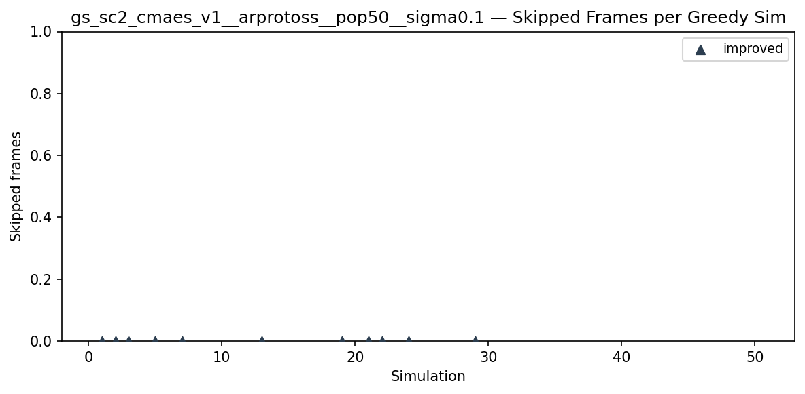
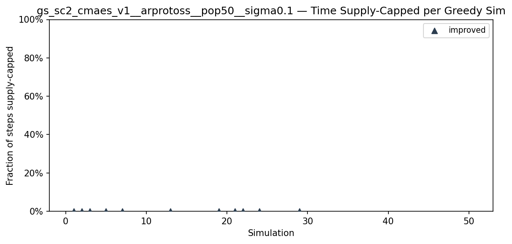
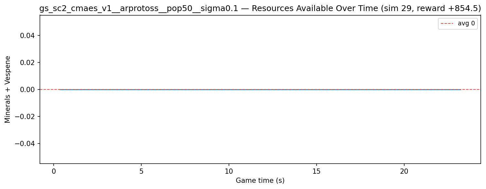
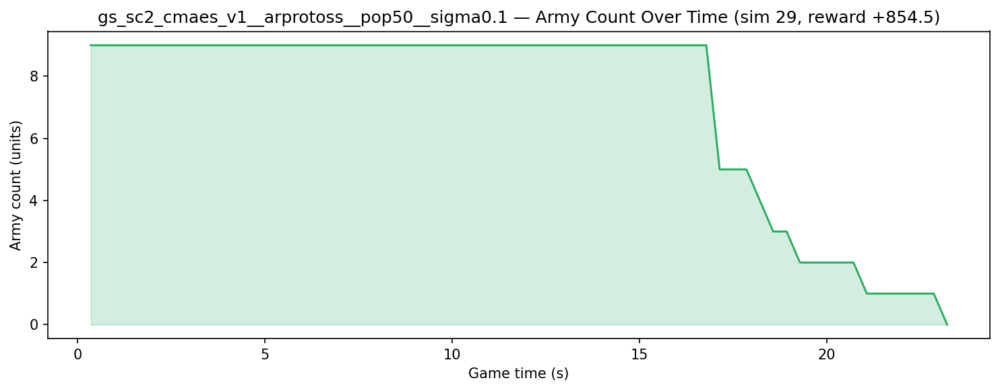

# Experiment: gs_sc2_cmaes_v1__arprotoss__pop50__sigma0.1

**Game:** StarCraft 2

## Timings

- **Start:** 2026-05-15 12:58:50
- **End:** 2026-05-16 00:50:39
- **Total runtime:** 11h 51m 49.1s

| Phase | Duration |
|-------|----------|
| Greedy | 11h 51m 48.0s |

## Run Parameters

### Training

| Parameter | Value |
|-----------|-------|
| track | sc2_DefeatZerglingsAndBanelings |
| map_name | DefeatZerglingsAndBanelings |
| in_game_episode_s | 120.0 |
| step_mul | 8 |
| screen_size | 64 |
| minimap_size | 64 |
| max_apm | 300 |
| agent_race | protoss |
| n_sims | 50 |
| policy_type | cmaes |
| obs_spec_preset | rich |
| enable_belief | True |
| population_size | 50 |
| initial_sigma | 0.1 |
| policy_params | {'eval_episodes': 5, 'population_size': 50, 'initial_sigma': 0.1} |

### Reward Config

| Parameter | Value |
|-----------|-------|
| score_weight | 10.0 |
| win_bonus | 1000.0 |
| loss_penalty | -100.0 |
| step_penalty | -0.001 |
| idle_penalty | 0.0 |
| idle_bonus | 0.5 |
| move_exploration_bonus | 1.0 |
| move_repeat_penalty | -0.05 |
| move_self_penalty | -0.1 |
| attack_move_bonus | 0.5 |
| click_attack_bonus | 1.0 |
| click_attack_cooldown_steps | 8 |
| attack_friendly_penalty | -10.0 |
| economy_weight | 0.001 |

## Greedy Phase

Best reward: **+854.5**

| Sim  | Reward   | Progress | Finish Time | Mean abs lat | Reason       | Result       |
|------|----------|----------|-------------|--------------|--------------|-------------|
|    1 |   +235.0 | 0.000    | —           | —       | finish       | **NEW BEST** |
|    2 |   +257.3 | 0.000    | —           | —       | finish       | **NEW BEST** |
|    3 |   +324.8 | 0.000    | —           | —       | finish       | **NEW BEST** |
|    4 |   +303.9 | 0.000    | —           | —       | finish       |  |
|    5 |   +422.6 | 0.000    | —           | —       | finish       | **NEW BEST** |
|    6 |   +271.0 | 0.000    | —           | —       | finish       |  |
|    7 |   +523.6 | 0.000    | —           | —       | finish       | **NEW BEST** |
|    8 |   +333.5 | 0.000    | —           | —       | finish       |  |
|    9 |   +403.5 | 0.000    | —           | —       | finish       |  |
|   10 |   +428.9 | 0.000    | —           | —       | finish       |  |
|   11 |   +398.2 | 0.000    | —           | —       | finish       |  |
|   12 |   +509.6 | 0.000    | —           | —       | finish       |  |
|   13 |   +579.0 | 0.000    | —           | —       | finish       | **NEW BEST** |
|   14 |   +477.9 | 0.000    | —           | —       | finish       |  |
|   15 |   +462.8 | 0.000    | —           | —       | finish       |  |
|   16 |   +475.8 | 0.000    | —           | —       | finish       |  |
|   17 |   +501.2 | 0.000    | —           | —       | finish       |  |
|   18 |   +538.2 | 0.000    | —           | —       | finish       |  |
|   19 |   +593.0 | 0.000    | —           | —       | finish       | **NEW BEST** |
|   20 |   +575.1 | 0.000    | —           | —       | finish       |  |
|   21 |   +636.2 | 0.000    | —           | —       | finish       | **NEW BEST** |
|   22 |   +689.4 | 0.000    | —           | —       | finish       | **NEW BEST** |
|   23 |   +553.3 | 0.000    | —           | —       | finish       |  |
|   24 |   +787.8 | 0.000    | —           | —       | finish       | **NEW BEST** |
|   25 |   +667.3 | 0.000    | —           | —       | finish       |  |
|   26 |   +548.8 | 0.000    | —           | —       | finish       |  |
|   27 |   +663.6 | 0.000    | —           | —       | finish       |  |
|   28 |   +647.6 | 0.000    | —           | —       | finish       |  |
|   29 |   +854.5 | 0.000    | —           | —       | finish       | **NEW BEST** |
|   30 |   +778.6 | 0.000    | —           | —       | finish       |  |
|   31 |   +491.8 | 0.000    | —           | —       | finish       |  |
|   32 |   +508.5 | 0.000    | —           | —       | finish       |  |
|   33 |   +656.6 | 0.000    | —           | —       | finish       |  |
|   34 |   +613.5 | 0.000    | —           | —       | finish       |  |
|   35 |   +593.5 | 0.000    | —           | —       | finish       |  |
|   36 |   +518.1 | 0.000    | —           | —       | finish       |  |
|   37 |   +514.5 | 0.000    | —           | —       | finish       |  |
|   38 |   +522.0 | 0.000    | —           | —       | finish       |  |
|   39 |   +692.3 | 0.000    | —           | —       | finish       |  |
|   40 |   +520.8 | 0.000    | —           | —       | finish       |  |
|   41 |   +525.5 | 0.000    | —           | —       | finish       |  |
|   42 |   +594.0 | 0.000    | —           | —       | finish       |  |
|   43 |   +649.0 | 0.000    | —           | —       | finish       |  |
|   44 |   +581.3 | 0.000    | —           | —       | finish       |  |
|   45 |   +648.1 | 0.000    | —           | —       | finish       |  |
|   46 |   +596.8 | 0.000    | —           | —       | finish       |  |
|   47 |   +777.9 | 0.000    | —           | —       | finish       |  |
|   48 |   +686.3 | 0.000    | —           | —       | finish       |  |
|   49 |   +568.3 | 0.000    | —           | —       | finish       |  |
|   50 |   +626.1 | 0.000    | —           | —       | finish       |  |

