# Experiment: gs_sc2_cmaes_v1__arterran__pop25__sigma0.1

**Game:** StarCraft 2

## Timings

- **Start:** 2026-05-09 07:47:02
- **End:** 2026-05-09 13:08:41
- **Total runtime:** 5h 21m 38.1s

| Phase | Duration |
|-------|----------|
| Greedy | 5h 21m 37.0s |

## Run Parameters

### Training

| Parameter | Value |
|-----------|-------|
| track | sc2_DefeatZerglingsAndBanelings |
| map_name | DefeatZerglingsAndBanelings |
| in_game_episode_s | 120.0 |
| step_mul | 8 |
| screen_size | 64 |
| minimap_size | 64 |
| max_apm | 300 |
| agent_race | terran |
| n_sims | 50 |
| policy_type | cmaes |
| obs_spec_preset | rich |
| enable_belief | True |
| population_size | 25 |
| initial_sigma | 0.1 |
| policy_params | {'eval_episodes': 5, 'population_size': 25, 'initial_sigma': 0.1} |

### Reward Config

| Parameter | Value |
|-----------|-------|
| score_weight | 10.0 |
| win_bonus | 1000.0 |
| loss_penalty | -100.0 |
| step_penalty | -0.001 |
| idle_penalty | 0.0 |
| idle_bonus | 0.5 |
| move_exploration_bonus | 1.0 |
| move_repeat_penalty | -0.05 |
| move_self_penalty | -0.1 |
| attack_move_bonus | 0.5 |
| click_attack_bonus | 1.0 |
| click_attack_cooldown_steps | 8 |
| attack_friendly_penalty | -10.0 |
| economy_weight | 0.001 |

## Greedy Phase

Best reward: **+584.2**

| Sim  | Reward   | Progress | Finish Time | Mean abs lat | Reason       | Result       |
|------|----------|----------|-------------|--------------|--------------|-------------|
|    1 |   +356.7 | 0.000    | —           | —       | finish       | **NEW BEST** |
|    2 |   +237.4 | 0.000    | —           | —       | finish       |  |
|    3 |   +417.0 | 0.000    | —           | —       | finish       | **NEW BEST** |
|    4 |   +305.9 | 0.000    | —           | —       | finish       |  |
|    5 |   +196.0 | 0.000    | —           | —       | finish       |  |
|    6 |   +120.2 | 0.000    | —           | —       | finish       |  |
|    7 |   +361.4 | 0.000    | —           | —       | finish       |  |
|    8 |   +234.1 | 0.000    | —           | —       | finish       |  |
|    9 |   +299.5 | 0.000    | —           | —       | finish       |  |
|   10 |   +212.5 | 0.000    | —           | —       | finish       |  |
|   11 |   +245.9 | 0.000    | —           | —       | finish       |  |
|   12 |   +248.8 | 0.000    | —           | —       | finish       |  |
|   13 |   +264.2 | 0.000    | —           | —       | finish       |  |
|   14 |   +259.8 | 0.000    | —           | —       | finish       |  |
|   15 |   +198.3 | 0.000    | —           | —       | finish       |  |
|   16 |   +458.2 | 0.000    | —           | —       | finish       | **NEW BEST** |
|   17 |   +375.4 | 0.000    | —           | —       | finish       |  |
|   18 |   +225.1 | 0.000    | —           | —       | finish       |  |
|   19 |   +341.0 | 0.000    | —           | —       | finish       |  |
|   20 |   +525.3 | 0.000    | —           | —       | finish       | **NEW BEST** |
|   21 |   +241.9 | 0.000    | —           | —       | finish       |  |
|   22 |   +414.0 | 0.000    | —           | —       | finish       |  |
|   23 |   +318.2 | 0.000    | —           | —       | finish       |  |
|   24 |   +264.0 | 0.000    | —           | —       | finish       |  |
|   25 |   +260.6 | 0.000    | —           | —       | finish       |  |
|   26 |   +411.6 | 0.000    | —           | —       | finish       |  |
|   27 |   +333.2 | 0.000    | —           | —       | finish       |  |
|   28 |   +584.2 | 0.000    | —           | —       | finish       | **NEW BEST** |
|   29 |   +250.4 | 0.000    | —           | —       | finish       |  |
|   30 |   +307.3 | 0.000    | —           | —       | finish       |  |
|   31 |   +354.2 | 0.000    | —           | —       | finish       |  |
|   32 |   +355.0 | 0.000    | —           | —       | finish       |  |
|   33 |   +364.5 | 0.000    | —           | —       | finish       |  |
|   34 |   +200.6 | 0.000    | —           | —       | finish       |  |
|   35 |   +391.8 | 0.000    | —           | —       | finish       |  |
|   36 |   +564.2 | 0.000    | —           | —       | finish       |  |
|   37 |   +386.2 | 0.000    | —           | —       | finish       |  |
|   38 |   +317.9 | 0.000    | —           | —       | finish       |  |
|   39 |   +313.8 | 0.000    | —           | —       | finish       |  |
|   40 |   +352.2 | 0.000    | —           | —       | finish       |  |
|   41 |   +403.2 | 0.000    | —           | —       | finish       |  |
|   42 |   +376.4 | 0.000    | —           | —       | finish       |  |
|   43 |   +399.0 | 0.000    | —           | —       | finish       |  |
|   44 |   +385.0 | 0.000    | —           | —       | finish       |  |
|   45 |   +342.0 | 0.000    | —           | —       | finish       |  |
|   46 |   +579.1 | 0.000    | —           | —       | finish       |  |
|   47 |   +332.8 | 0.000    | —           | —       | finish       |  |
|   48 |   +452.7 | 0.000    | —           | —       | finish       |  |
|   49 |   +395.8 | 0.000    | —           | —       | finish       |  |
|   50 |   +439.8 | 0.000    | —           | —       | finish       |  |

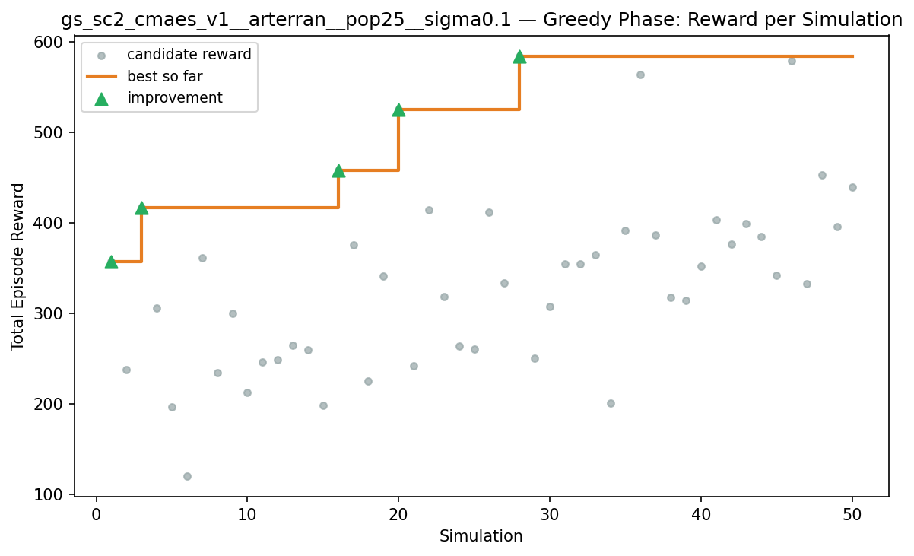

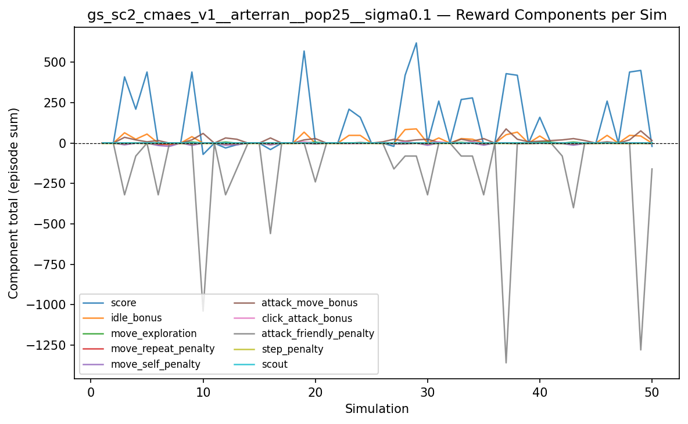

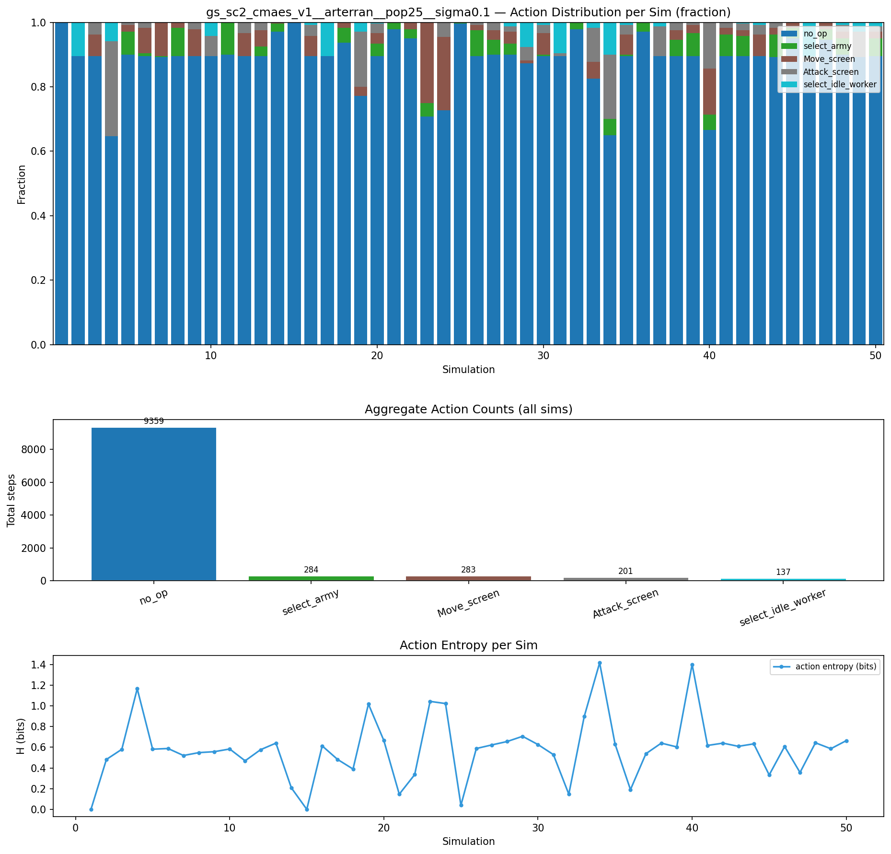

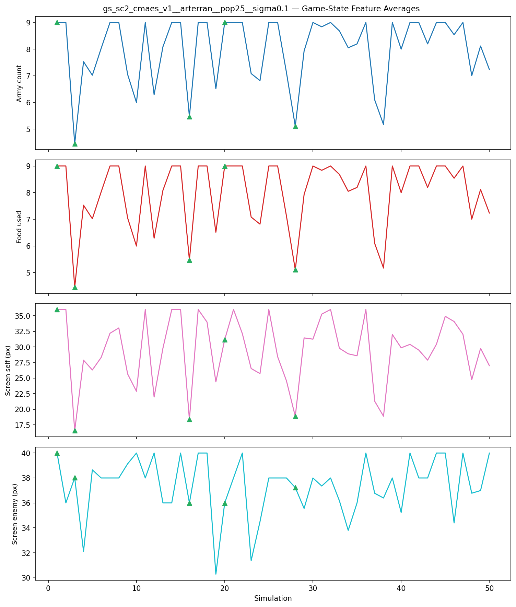

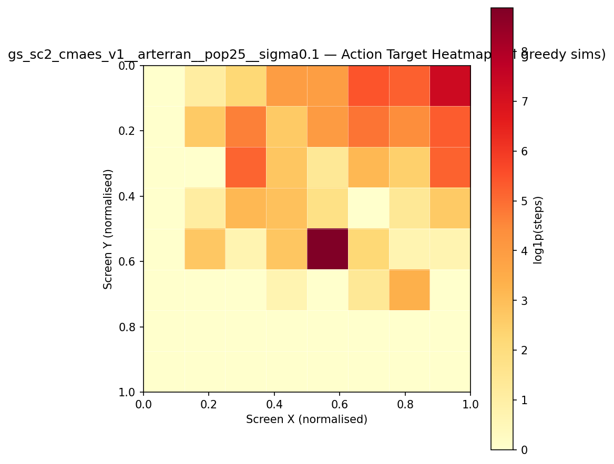

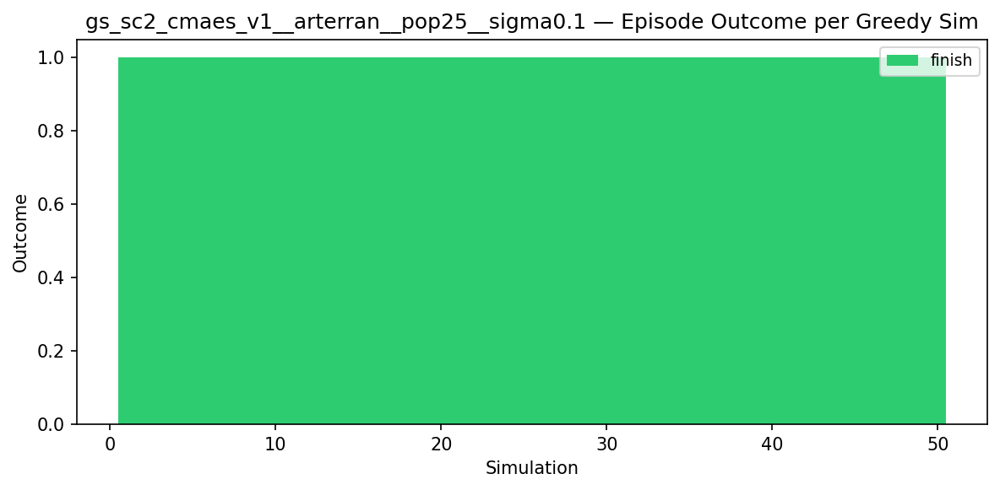

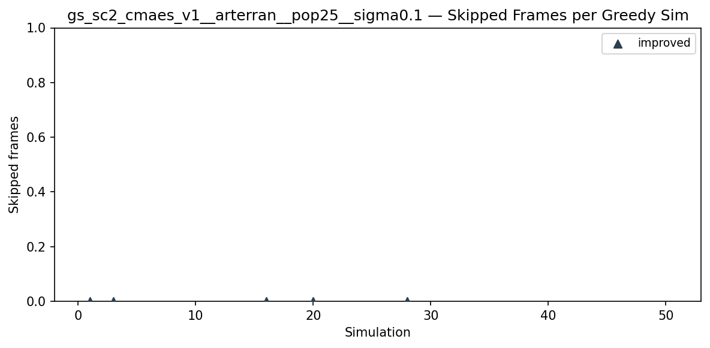

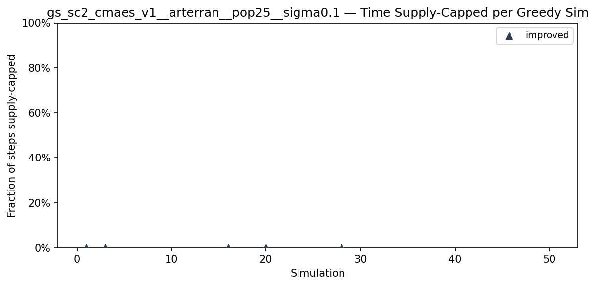

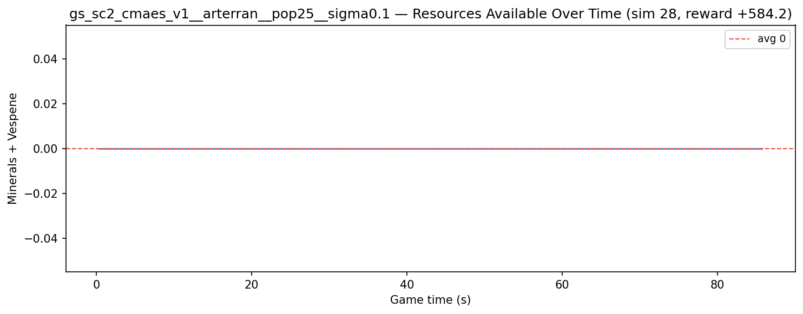

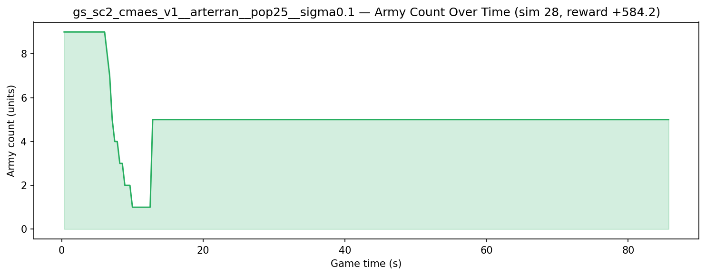

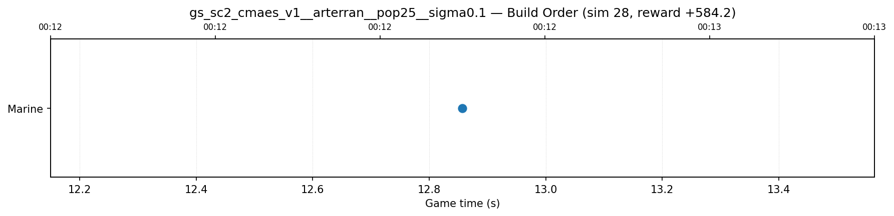

