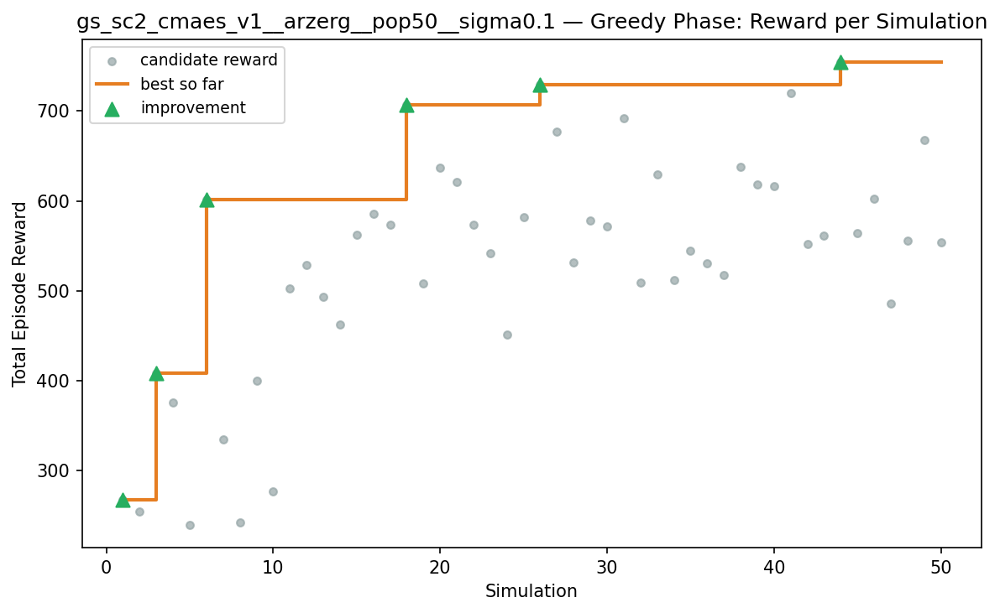
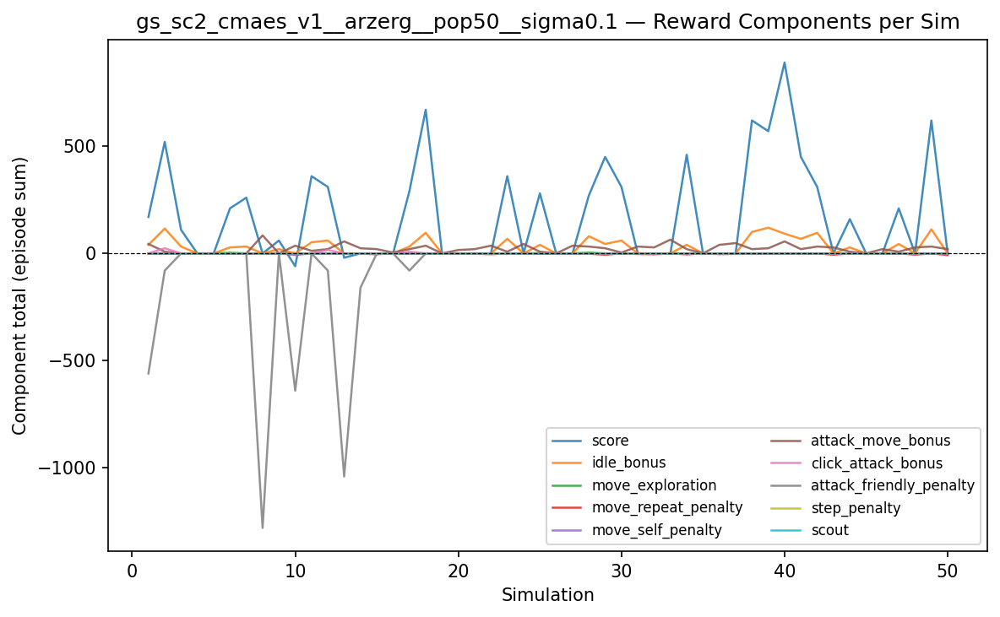
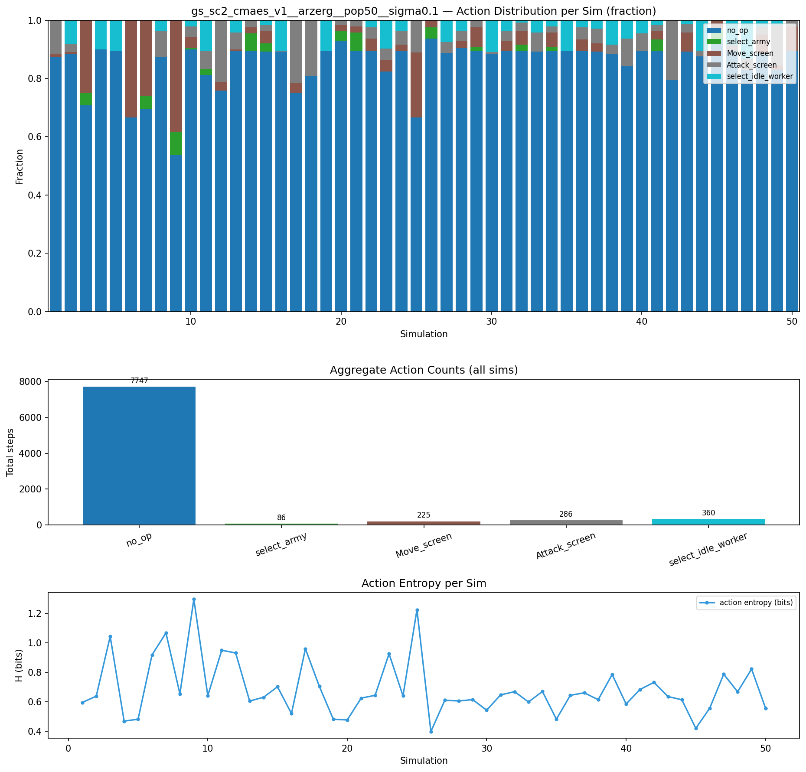
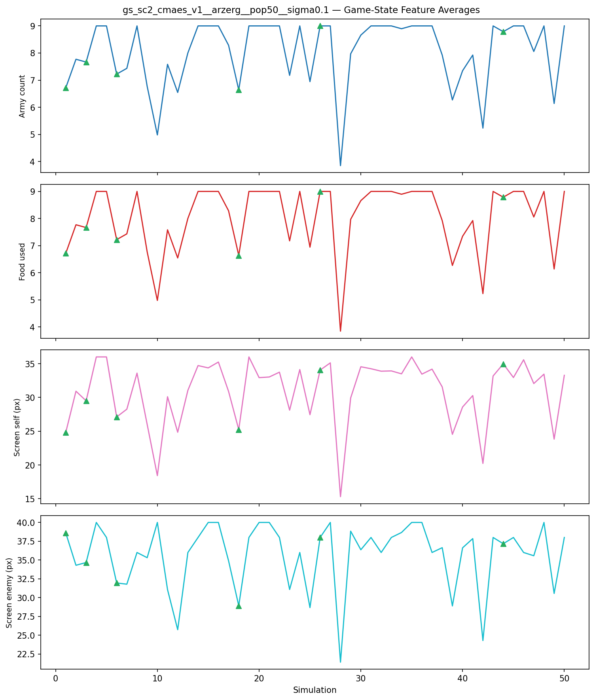
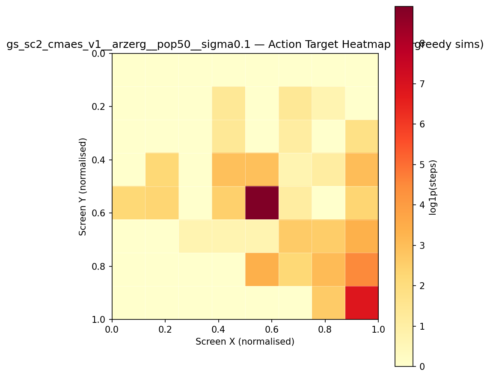
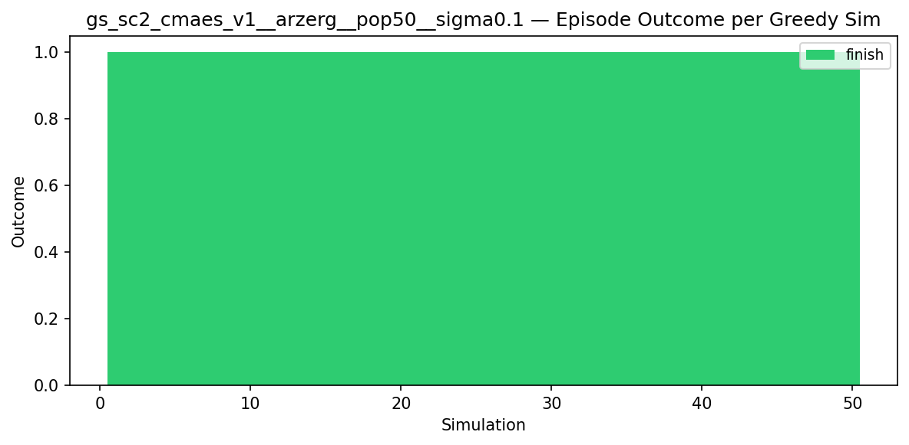
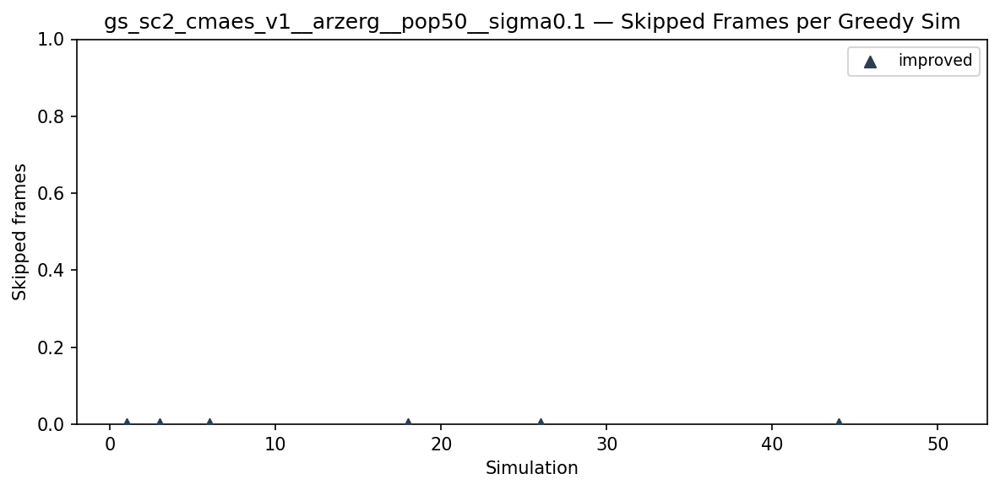
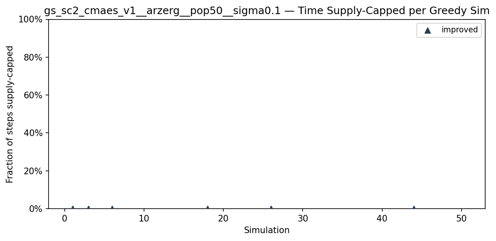
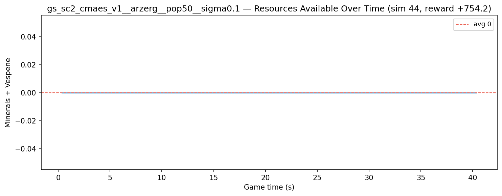
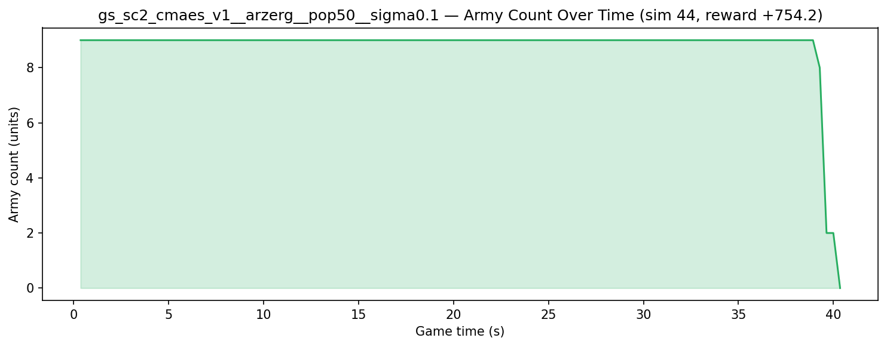

# Experiment: gs_sc2_cmaes_v1__arzerg__pop50__sigma0.1

**Game:** StarCraft 2

## Timings

- **Start:** 2026-05-12 19:33:17
- **End:** 2026-05-13 07:04:40
- **Total runtime:** 11h 31m 22.9s

| Phase | Duration |
|-------|----------|
| Greedy | 11h 31m 21.9s |

## Run Parameters

### Training

| Parameter | Value |
|-----------|-------|
| track | sc2_DefeatZerglingsAndBanelings |
| map_name | DefeatZerglingsAndBanelings |
| in_game_episode_s | 120.0 |
| step_mul | 8 |
| screen_size | 64 |
| minimap_size | 64 |
| max_apm | 300 |
| agent_race | zerg |
| n_sims | 50 |
| policy_type | cmaes |
| obs_spec_preset | rich |
| enable_belief | True |
| population_size | 50 |
| initial_sigma | 0.1 |
| policy_params | {'eval_episodes': 5, 'population_size': 50, 'initial_sigma': 0.1} |

### Reward Config

| Parameter | Value |
|-----------|-------|
| score_weight | 10.0 |
| win_bonus | 1000.0 |
| loss_penalty | -100.0 |
| step_penalty | -0.001 |
| idle_penalty | 0.0 |
| idle_bonus | 0.5 |
| move_exploration_bonus | 1.0 |
| move_repeat_penalty | -0.05 |
| move_self_penalty | -0.1 |
| attack_move_bonus | 0.5 |
| click_attack_bonus | 1.0 |
| click_attack_cooldown_steps | 8 |
| attack_friendly_penalty | -10.0 |
| economy_weight | 0.001 |

## Greedy Phase

Best reward: **+754.2**

| Sim  | Reward   | Progress | Finish Time | Mean abs lat | Reason       | Result       |
|------|----------|----------|-------------|--------------|--------------|-------------|
|    1 |   +267.9 | 0.000    | —           | —       | finish       | **NEW BEST** |
|    2 |   +254.8 | 0.000    | —           | —       | finish       |  |
|    3 |   +408.2 | 0.000    | —           | —       | finish       | **NEW BEST** |
|    4 |   +376.1 | 0.000    | —           | —       | finish       |  |
|    5 |   +240.2 | 0.000    | —           | —       | finish       |  |
|    6 |   +601.0 | 0.000    | —           | —       | finish       | **NEW BEST** |
|    7 |   +334.5 | 0.000    | —           | —       | finish       |  |
|    8 |   +243.0 | 0.000    | —           | —       | finish       |  |
|    9 |   +400.2 | 0.000    | —           | —       | finish       |  |
|   10 |   +277.1 | 0.000    | —           | —       | finish       |  |
|   11 |   +502.7 | 0.000    | —           | —       | finish       |  |
|   12 |   +528.6 | 0.000    | —           | —       | finish       |  |
|   13 |   +493.2 | 0.000    | —           | —       | finish       |  |
|   14 |   +462.2 | 0.000    | —           | —       | finish       |  |
|   15 |   +562.0 | 0.000    | —           | —       | finish       |  |
|   16 |   +585.5 | 0.000    | —           | —       | finish       |  |
|   17 |   +573.7 | 0.000    | —           | —       | finish       |  |
|   18 |   +706.5 | 0.000    | —           | —       | finish       | **NEW BEST** |
|   19 |   +508.2 | 0.000    | —           | —       | finish       |  |
|   20 |   +636.9 | 0.000    | —           | —       | finish       |  |
|   21 |   +620.6 | 0.000    | —           | —       | finish       |  |
|   22 |   +573.9 | 0.000    | —           | —       | finish       |  |
|   23 |   +542.2 | 0.000    | —           | —       | finish       |  |
|   24 |   +451.5 | 0.000    | —           | —       | finish       |  |
|   25 |   +581.7 | 0.000    | —           | —       | finish       |  |
|   26 |   +728.8 | 0.000    | —           | —       | finish       | **NEW BEST** |
|   27 |   +676.4 | 0.000    | —           | —       | finish       |  |
|   28 |   +531.9 | 0.000    | —           | —       | finish       |  |
|   29 |   +578.5 | 0.000    | —           | —       | finish       |  |
|   30 |   +571.2 | 0.000    | —           | —       | finish       |  |
|   31 |   +691.8 | 0.000    | —           | —       | finish       |  |
|   32 |   +509.0 | 0.000    | —           | —       | finish       |  |
|   33 |   +629.6 | 0.000    | —           | —       | finish       |  |
|   34 |   +511.7 | 0.000    | —           | —       | finish       |  |
|   35 |   +544.9 | 0.000    | —           | —       | finish       |  |
|   36 |   +530.4 | 0.000    | —           | —       | finish       |  |
|   37 |   +517.8 | 0.000    | —           | —       | finish       |  |
|   38 |   +637.7 | 0.000    | —           | —       | finish       |  |
|   39 |   +618.4 | 0.000    | —           | —       | finish       |  |
|   40 |   +616.4 | 0.000    | —           | —       | finish       |  |
|   41 |   +719.3 | 0.000    | —           | —       | finish       |  |
|   42 |   +551.8 | 0.000    | —           | —       | finish       |  |
|   43 |   +561.5 | 0.000    | —           | —       | finish       |  |
|   44 |   +754.2 | 0.000    | —           | —       | finish       | **NEW BEST** |
|   45 |   +563.9 | 0.000    | —           | —       | finish       |  |
|   46 |   +602.8 | 0.000    | —           | —       | finish       |  |
|   47 |   +486.0 | 0.000    | —           | —       | finish       |  |
|   48 |   +556.0 | 0.000    | —           | —       | finish       |  |
|   49 |   +667.9 | 0.000    | —           | —       | finish       |  |
|   50 |   +553.5 | 0.000    | —           | —       | finish       |  |

