# Grid Search Summary: gs_sc2_cmaes_v1

27 experiments.

## Rankings by Task Metrics (config-independent)

Ranked by best track progress, then by best reward.

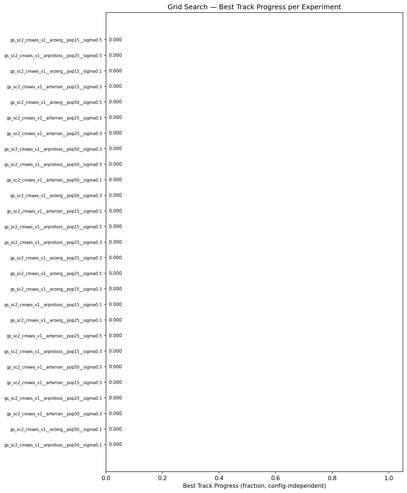

| Rank | Experiment | Best Progress | Finish Rate | Best Finish Time | Best Reward |
|------|-----------|---------------|-------------|-----------------|-------------|
| 1 | gs_sc2_cmaes_v1__arprotoss__pop50__sigma0.1 | 0.0000 | 0.0% | — | +292.2 |
| 2 | gs_sc2_cmaes_v1__arzerg__pop50__sigma0.1 | 0.0000 | 0.0% | — | +236.3 |
| 3 | gs_sc2_cmaes_v1__arterran__pop50__sigma0.3 | 0.0000 | 0.0% | — | +219.9 |
| 4 | gs_sc2_cmaes_v1__arprotoss__pop25__sigma0.1 | 0.0000 | 0.0% | — | +217.6 |
| 5 | gs_sc2_cmaes_v1__arterran__pop15__sigma0.5 | 0.0000 | 0.0% | — | +216.5 |
| 6 | gs_sc2_cmaes_v1__arterran__pop50__sigma0.5 | 0.0000 | 0.0% | — | +216.3 |
| 7 | gs_sc2_cmaes_v1__arprotoss__pop15__sigma0.3 | 0.0000 | 0.0% | — | +215.3 |
| 8 | gs_sc2_cmaes_v1__arterran__pop25__sigma0.5 | 0.0000 | 0.0% | — | +201.4 |
| 9 | gs_sc2_cmaes_v1__arzerg__pop25__sigma0.1 | 0.0000 | 0.0% | — | +198.8 |
| 10 | gs_sc2_cmaes_v1__arprotoss__pop15__sigma0.1 | 0.0000 | 0.0% | — | +196.4 |
| 11 | gs_sc2_cmaes_v1__arzerg__pop15__sigma0.3 | 0.0000 | 0.0% | — | +194.3 |
| 12 | gs_sc2_cmaes_v1__arzerg__pop25__sigma0.5 | 0.0000 | 0.0% | — | +194.0 |
| 13 | gs_sc2_cmaes_v1__arzerg__pop25__sigma0.3 | 0.0000 | 0.0% | — | +192.7 |
| 14 | gs_sc2_cmaes_v1__arprotoss__pop25__sigma0.3 | 0.0000 | 0.0% | — | +186.4 |
| 15 | gs_sc2_cmaes_v1__arprotoss__pop15__sigma0.5 | 0.0000 | 0.0% | — | +181.4 |
| 16 | gs_sc2_cmaes_v1__arterran__pop15__sigma0.1 | 0.0000 | 0.0% | — | +176.6 |
| 17 | gs_sc2_cmaes_v1__arzerg__pop50__sigma0.3 | 0.0000 | 0.0% | — | +172.8 |
| 18 | gs_sc2_cmaes_v1__arterran__pop50__sigma0.1 | 0.0000 | 0.0% | — | +172.3 |
| 19 | gs_sc2_cmaes_v1__arprotoss__pop50__sigma0.5 | 0.0000 | 0.0% | — | +167.9 |
| 20 | gs_sc2_cmaes_v1__arprotoss__pop50__sigma0.3 | 0.0000 | 0.0% | — | +163.9 |
| 21 | gs_sc2_cmaes_v1__arterran__pop25__sigma0.3 | 0.0000 | 0.0% | — | +162.4 |
| 22 | gs_sc2_cmaes_v1__arterran__pop25__sigma0.1 | 0.0000 | 0.0% | — | +162.3 |
| 23 | gs_sc2_cmaes_v1__arzerg__pop50__sigma0.5 | 0.0000 | 0.0% | — | +152.9 |
| 24 | gs_sc2_cmaes_v1__arterran__pop15__sigma0.3 | 0.0000 | 0.0% | — | +147.4 |
| 25 | gs_sc2_cmaes_v1__arzerg__pop15__sigma0.1 | 0.0000 | 0.0% | — | +138.3 |
| 26 | gs_sc2_cmaes_v1__arprotoss__pop25__sigma0.5 | 0.0000 | 0.0% | — | +126.3 |
| 27 | gs_sc2_cmaes_v1__arzerg__pop15__sigma0.5 | 0.0000 | 0.0% | — | +102.7 |

## Rankings by Reward

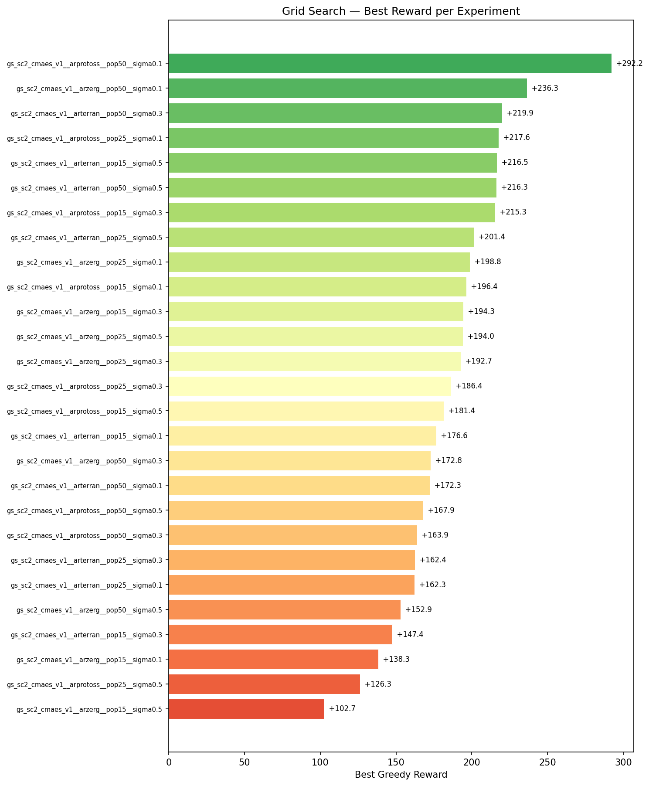

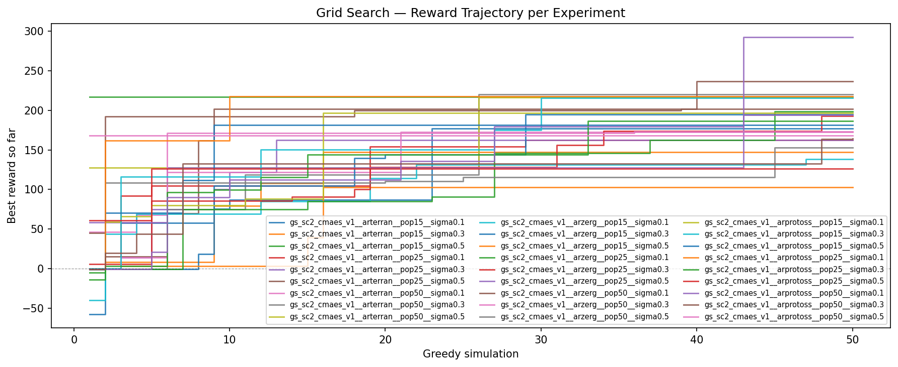

| Rank | Experiment | Best Reward | Improvements | First Improv. Sim | Accel % | Greedy Time |
|------|-----------|-------------|--------------|-------------------|---------|-------------|
| 1 | gs_sc2_cmaes_v1__arprotoss__pop50__sigma0.1 | +292.2 | 11 | 1 | 0% | 11h 51m 48.0s |
| 2 | gs_sc2_cmaes_v1__arzerg__pop50__sigma0.1 | +236.3 | 6 | 1 | 0% | 11h 31m 21.9s |
| 3 | gs_sc2_cmaes_v1__arterran__pop50__sigma0.3 | +219.9 | 5 | 1 | 0% | 12h 20m 49.0s |
| 4 | gs_sc2_cmaes_v1__arprotoss__pop25__sigma0.1 | +217.6 | 7 | 1 | 0% | 5h 57m 56.7s |
| 5 | gs_sc2_cmaes_v1__arterran__pop15__sigma0.5 | +216.5 | 4 | 1 | 0% | 3h 43m 49.8s |
| 6 | gs_sc2_cmaes_v1__arterran__pop50__sigma0.5 | +216.3 | 5 | 1 | 0% | 12h 30m 33.0s |
| 7 | gs_sc2_cmaes_v1__arprotoss__pop15__sigma0.3 | +215.3 | 7 | 1 | 0% | 3h 37m 06.9s |
| 8 | gs_sc2_cmaes_v1__arterran__pop25__sigma0.5 | +201.4 | 5 | 1 | 0% | 6h 14m 01.9s |
| 9 | gs_sc2_cmaes_v1__arzerg__pop25__sigma0.1 | +198.8 | 6 | 1 | 0% | 5h 39m 45.6s |
| 10 | gs_sc2_cmaes_v1__arprotoss__pop15__sigma0.1 | +196.4 | 8 | 1 | 0% | 3h 18m 12.5s |
| 11 | gs_sc2_cmaes_v1__arzerg__pop15__sigma0.3 | +194.3 | 7 | 1 | 0% | 3h 49m 51.4s |
| 12 | gs_sc2_cmaes_v1__arzerg__pop25__sigma0.5 | +194.0 | 5 | 1 | 0% | 6h 15m 44.0s |
| 13 | gs_sc2_cmaes_v1__arzerg__pop25__sigma0.3 | +192.7 | 5 | 1 | 0% | 6h 19m 54.6s |
| 14 | gs_sc2_cmaes_v1__arprotoss__pop25__sigma0.3 | +186.4 | 9 | 1 | 0% | 6h 04m 20.7s |
| 15 | gs_sc2_cmaes_v1__arprotoss__pop15__sigma0.5 | +181.4 | 8 | 1 | 0% | 3h 54m 29.7s |
| 16 | gs_sc2_cmaes_v1__arterran__pop15__sigma0.1 | +176.6 | 12 | 1 | 0% | 3h 22m 21.0s |
| 17 | gs_sc2_cmaes_v1__arzerg__pop50__sigma0.3 | +172.8 | 9 | 1 | 0% | 12h 31m 30.0s |
| 18 | gs_sc2_cmaes_v1__arterran__pop50__sigma0.1 | +172.3 | 7 | 1 | 0% | 11h 48m 14.1s |
| 19 | gs_sc2_cmaes_v1__arprotoss__pop50__sigma0.5 | +167.9 | 7 | 1 | 0% | 12h 32m 59.4s |
| 20 | gs_sc2_cmaes_v1__arprotoss__pop50__sigma0.3 | +163.9 | 5 | 1 | 0% | 12h 34m 45.5s |
| 21 | gs_sc2_cmaes_v1__arterran__pop25__sigma0.3 | +162.4 | 6 | 1 | 0% | 6h 26m 20.7s |
| 22 | gs_sc2_cmaes_v1__arterran__pop25__sigma0.1 | +162.3 | 5 | 1 | 0% | 5h 21m 37.0s |
| 23 | gs_sc2_cmaes_v1__arzerg__pop50__sigma0.5 | +152.9 | 6 | 1 | 0% | 12h 17m 03.3s |
| 24 | gs_sc2_cmaes_v1__arterran__pop15__sigma0.3 | +147.4 | 8 | 1 | 0% | 3h 42m 01.1s |
| 25 | gs_sc2_cmaes_v1__arzerg__pop15__sigma0.1 | +138.3 | 5 | 1 | 0% | 3h 18m 38.8s |
| 26 | gs_sc2_cmaes_v1__arprotoss__pop25__sigma0.5 | +126.3 | 9 | 1 | 0% | 6h 11m 24.5s |
| 27 | gs_sc2_cmaes_v1__arzerg__pop15__sigma0.5 | +102.7 | 5 | 1 | 0% | 3h 37m 50.1s |

---

## 1. gs_sc2_cmaes_v1__arprotoss__pop50__sigma0.1

**Best reward: +292.2** | **Best progress: 0.0000** | **Finish rate: 0.0%**

| Param | Value |
|---|---|
| `agent_race` | protoss |
| `population_size` | 50 |
| `initial_sigma` | 0.1 |

| Stat | Value |
|---|---|
| Best track progress | 0.0000 |
| Finish rate | 0.0% |
| Best finish time | — |
| Greedy improvements | 11 |
| First improvement (sim) | 1 |
| Accel % of best run | 0.0% |
| Greedy runtime | 11h 51m 48.0s |

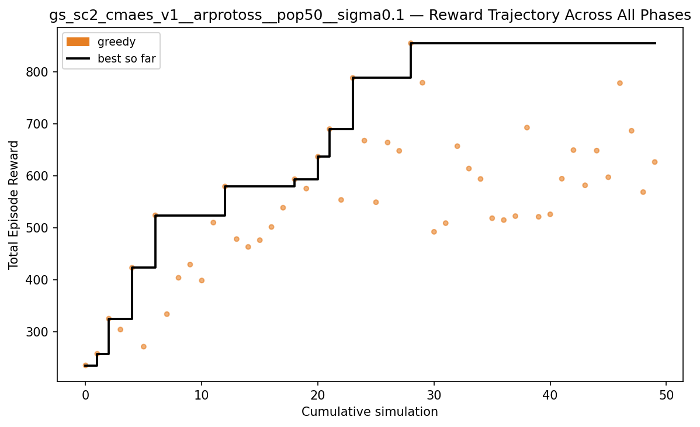

---

## 2. gs_sc2_cmaes_v1__arzerg__pop50__sigma0.1

**Best reward: +236.3** | **Best progress: 0.0000** | **Finish rate: 0.0%**

| Param | Value |
|---|---|
| `agent_race` | zerg |
| `population_size` | 50 |
| `initial_sigma` | 0.1 |

| Stat | Value |
|---|---|
| Best track progress | 0.0000 |
| Finish rate | 0.0% |
| Best finish time | — |
| Greedy improvements | 6 |
| First improvement (sim) | 1 |
| Accel % of best run | 0.0% |
| Greedy runtime | 11h 31m 21.9s |

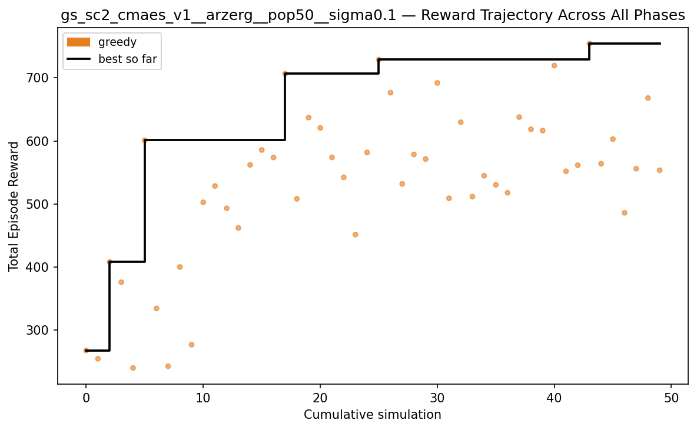

---

## 3. gs_sc2_cmaes_v1__arterran__pop50__sigma0.3

**Best reward: +219.9** | **Best progress: 0.0000** | **Finish rate: 0.0%**

| Param | Value |
|---|---|
| `agent_race` | terran |
| `population_size` | 50 |
| `initial_sigma` | 0.3 |

| Stat | Value |
|---|---|
| Best track progress | 0.0000 |
| Finish rate | 0.0% |
| Best finish time | — |
| Greedy improvements | 5 |
| First improvement (sim) | 1 |
| Accel % of best run | 0.0% |
| Greedy runtime | 12h 20m 49.0s |

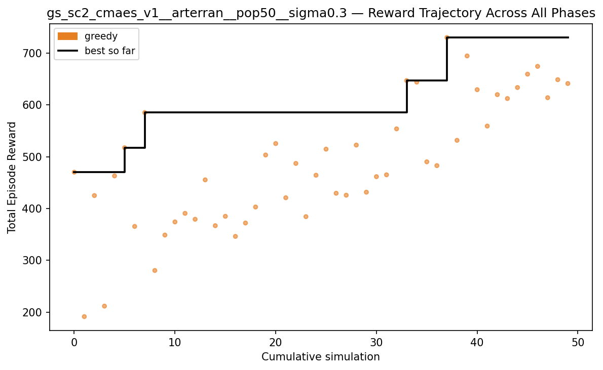

---

## 4. gs_sc2_cmaes_v1__arprotoss__pop25__sigma0.1

**Best reward: +217.6** | **Best progress: 0.0000** | **Finish rate: 0.0%**

| Param | Value |
|---|---|
| `agent_race` | protoss |
| `population_size` | 25 |
| `initial_sigma` | 0.1 |

| Stat | Value |
|---|---|
| Best track progress | 0.0000 |
| Finish rate | 0.0% |
| Best finish time | — |
| Greedy improvements | 7 |
| First improvement (sim) | 1 |
| Accel % of best run | 0.0% |
| Greedy runtime | 5h 57m 56.7s |

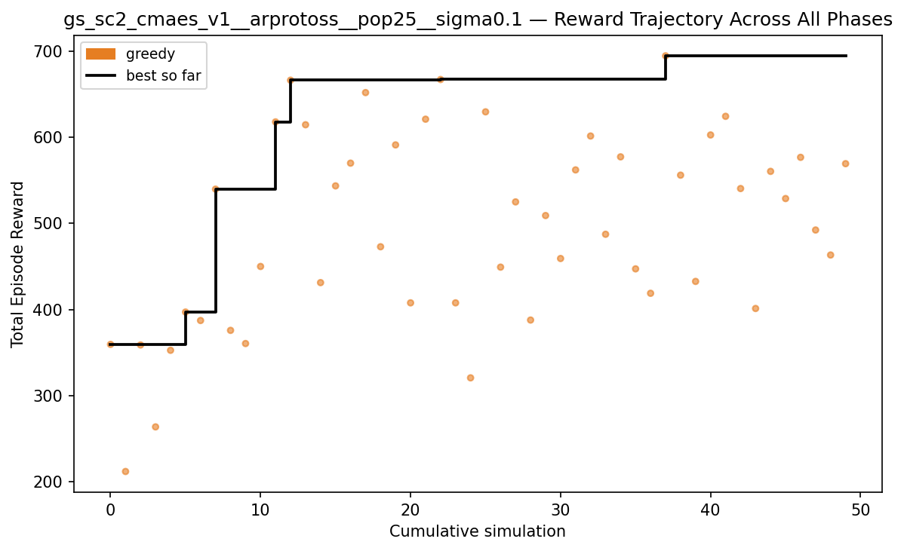

---

## 5. gs_sc2_cmaes_v1__arterran__pop15__sigma0.5

**Best reward: +216.5** | **Best progress: 0.0000** | **Finish rate: 0.0%**

| Param | Value |
|---|---|
| `agent_race` | terran |
| `population_size` | 15 |
| `initial_sigma` | 0.5 |

| Stat | Value |
|---|---|
| Best track progress | 0.0000 |
| Finish rate | 0.0% |
| Best finish time | — |
| Greedy improvements | 4 |
| First improvement (sim) | 1 |
| Accel % of best run | 0.0% |
| Greedy runtime | 3h 43m 49.8s |

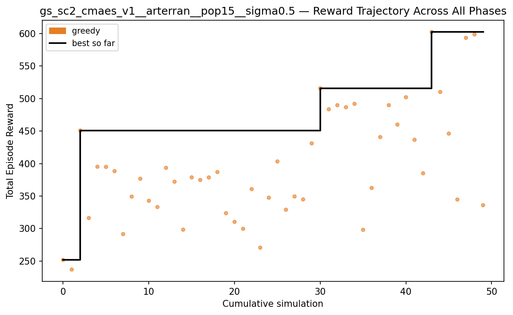

---

## 6. gs_sc2_cmaes_v1__arterran__pop50__sigma0.5

**Best reward: +216.3** | **Best progress: 0.0000** | **Finish rate: 0.0%**

| Param | Value |
|---|---|
| `agent_race` | terran |
| `population_size` | 50 |
| `initial_sigma` | 0.5 |

| Stat | Value |
|---|---|
| Best track progress | 0.0000 |
| Finish rate | 0.0% |
| Best finish time | — |
| Greedy improvements | 5 |
| First improvement (sim) | 1 |
| Accel % of best run | 0.0% |
| Greedy runtime | 12h 30m 33.0s |

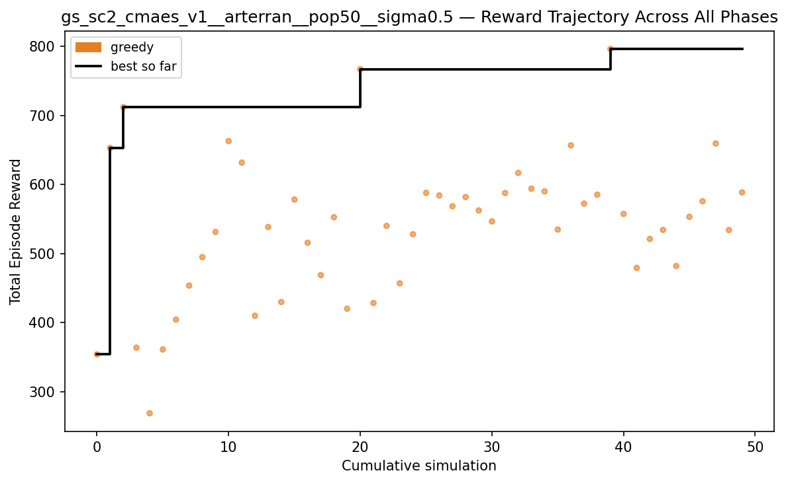

---

## 7. gs_sc2_cmaes_v1__arprotoss__pop15__sigma0.3

**Best reward: +215.3** | **Best progress: 0.0000** | **Finish rate: 0.0%**

| Param | Value |
|---|---|
| `agent_race` | protoss |
| `population_size` | 15 |
| `initial_sigma` | 0.3 |

| Stat | Value |
|---|---|
| Best track progress | 0.0000 |
| Finish rate | 0.0% |
| Best finish time | — |
| Greedy improvements | 7 |
| First improvement (sim) | 1 |
| Accel % of best run | 0.0% |
| Greedy runtime | 3h 37m 06.9s |

---

## 8. gs_sc2_cmaes_v1__arterran__pop25__sigma0.5

**Best reward: +201.4** | **Best progress: 0.0000** | **Finish rate: 0.0%**

| Param | Value |
|---|---|
| `agent_race` | terran |
| `population_size` | 25 |
| `initial_sigma` | 0.5 |

| Stat | Value |
|---|---|
| Best track progress | 0.0000 |
| Finish rate | 0.0% |
| Best finish time | — |
| Greedy improvements | 5 |
| First improvement (sim) | 1 |
| Accel % of best run | 0.0% |
| Greedy runtime | 6h 14m 01.9s |

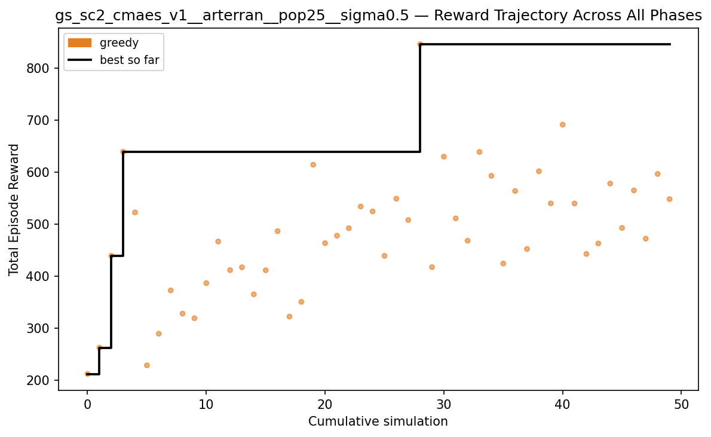

---

## 9. gs_sc2_cmaes_v1__arzerg__pop25__sigma0.1

**Best reward: +198.8** | **Best progress: 0.0000** | **Finish rate: 0.0%**

| Param | Value |
|---|---|
| `agent_race` | zerg |
| `population_size` | 25 |
| `initial_sigma` | 0.1 |

| Stat | Value |
|---|---|
| Best track progress | 0.0000 |
| Finish rate | 0.0% |
| Best finish time | — |
| Greedy improvements | 6 |
| First improvement (sim) | 1 |
| Accel % of best run | 0.0% |
| Greedy runtime | 5h 39m 45.6s |

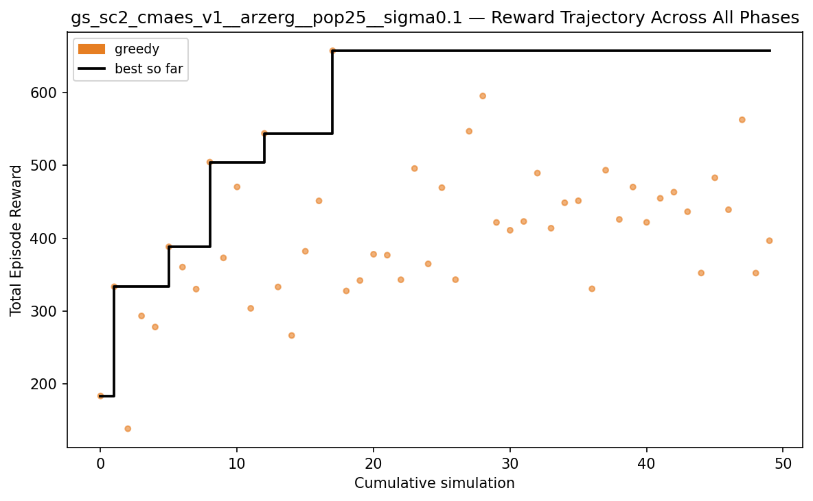

---

## 10. gs_sc2_cmaes_v1__arprotoss__pop15__sigma0.1

**Best reward: +196.4** | **Best progress: 0.0000** | **Finish rate: 0.0%**

| Param | Value |
|---|---|
| `agent_race` | protoss |
| `population_size` | 15 |
| `initial_sigma` | 0.1 |

| Stat | Value |
|---|---|
| Best track progress | 0.0000 |
| Finish rate | 0.0% |
| Best finish time | — |
| Greedy improvements | 8 |
| First improvement (sim) | 1 |
| Accel % of best run | 0.0% |
| Greedy runtime | 3h 18m 12.5s |

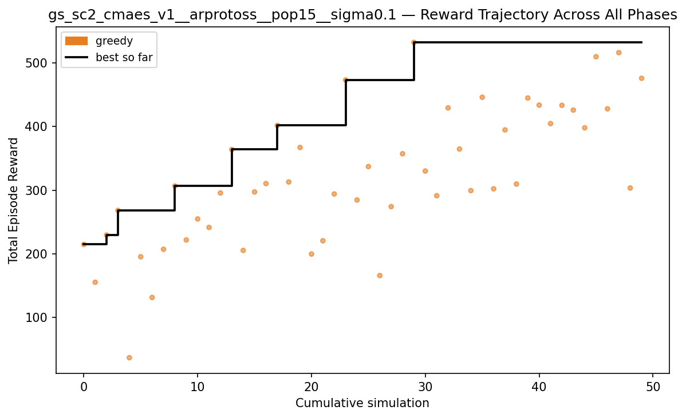

---

## 11. gs_sc2_cmaes_v1__arzerg__pop15__sigma0.3

**Best reward: +194.3** | **Best progress: 0.0000** | **Finish rate: 0.0%**

| Param | Value |
|---|---|
| `agent_race` | zerg |
| `population_size` | 15 |
| `initial_sigma` | 0.3 |

| Stat | Value |
|---|---|
| Best track progress | 0.0000 |
| Finish rate | 0.0% |
| Best finish time | — |
| Greedy improvements | 7 |
| First improvement (sim) | 1 |
| Accel % of best run | 0.0% |
| Greedy runtime | 3h 49m 51.4s |

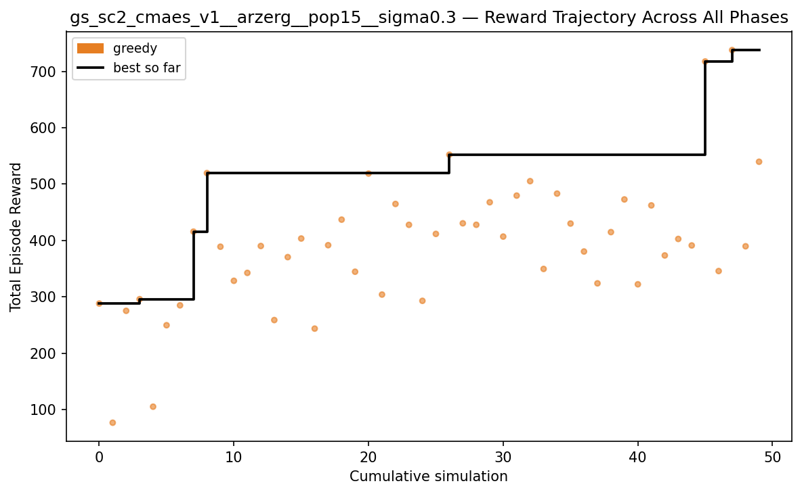

---

## 12. gs_sc2_cmaes_v1__arzerg__pop25__sigma0.5

**Best reward: +194.0** | **Best progress: 0.0000** | **Finish rate: 0.0%**

| Param | Value |
|---|---|
| `agent_race` | zerg |
| `population_size` | 25 |
| `initial_sigma` | 0.5 |

| Stat | Value |
|---|---|
| Best track progress | 0.0000 |
| Finish rate | 0.0% |
| Best finish time | — |
| Greedy improvements | 5 |
| First improvement (sim) | 1 |
| Accel % of best run | 0.0% |
| Greedy runtime | 6h 15m 44.0s |

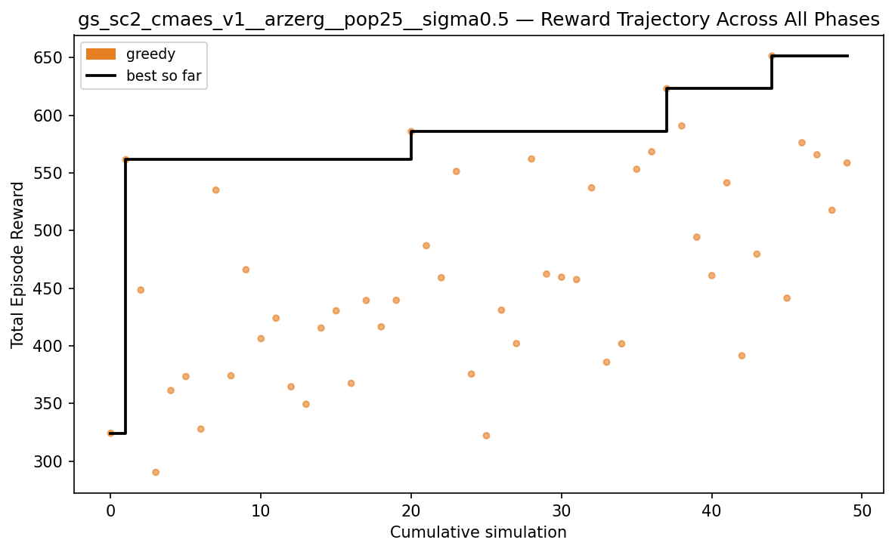

---

## 13. gs_sc2_cmaes_v1__arzerg__pop25__sigma0.3

**Best reward: +192.7** | **Best progress: 0.0000** | **Finish rate: 0.0%**

| Param | Value |
|---|---|
| `agent_race` | zerg |
| `population_size` | 25 |
| `initial_sigma` | 0.3 |

| Stat | Value |
|---|---|
| Best track progress | 0.0000 |
| Finish rate | 0.0% |
| Best finish time | — |
| Greedy improvements | 5 |
| First improvement (sim) | 1 |
| Accel % of best run | 0.0% |
| Greedy runtime | 6h 19m 54.6s |

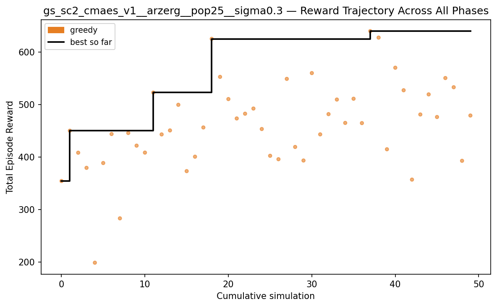

---

## 14. gs_sc2_cmaes_v1__arprotoss__pop25__sigma0.3

**Best reward: +186.4** | **Best progress: 0.0000** | **Finish rate: 0.0%**

| Param | Value |
|---|---|
| `agent_race` | protoss |
| `population_size` | 25 |
| `initial_sigma` | 0.3 |

| Stat | Value |
|---|---|
| Best track progress | 0.0000 |
| Finish rate | 0.0% |
| Best finish time | — |
| Greedy improvements | 9 |
| First improvement (sim) | 1 |
| Accel % of best run | 0.0% |
| Greedy runtime | 6h 04m 20.7s |

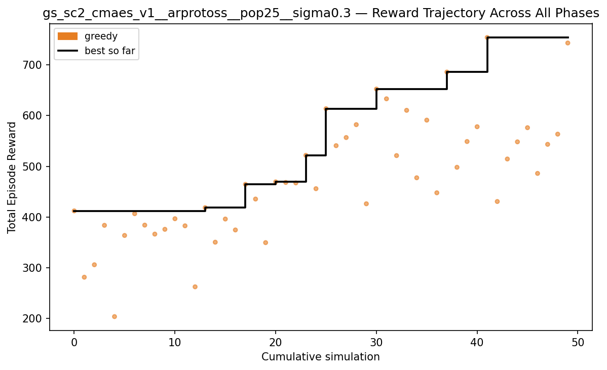

---

## 15. gs_sc2_cmaes_v1__arprotoss__pop15__sigma0.5

**Best reward: +181.4** | **Best progress: 0.0000** | **Finish rate: 0.0%**

| Param | Value |
|---|---|
| `agent_race` | protoss |
| `population_size` | 15 |
| `initial_sigma` | 0.5 |

| Stat | Value |
|---|---|
| Best track progress | 0.0000 |
| Finish rate | 0.0% |
| Best finish time | — |
| Greedy improvements | 8 |
| First improvement (sim) | 1 |
| Accel % of best run | 0.0% |
| Greedy runtime | 3h 54m 29.7s |

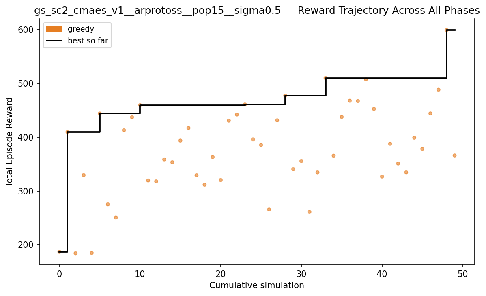

---

## 16. gs_sc2_cmaes_v1__arterran__pop15__sigma0.1

**Best reward: +176.6** | **Best progress: 0.0000** | **Finish rate: 0.0%**

| Param | Value |
|---|---|
| `agent_race` | terran |
| `population_size` | 15 |
| `initial_sigma` | 0.1 |

| Stat | Value |
|---|---|
| Best track progress | 0.0000 |
| Finish rate | 0.0% |
| Best finish time | — |
| Greedy improvements | 12 |
| First improvement (sim) | 1 |
| Accel % of best run | 0.0% |
| Greedy runtime | 3h 22m 21.0s |

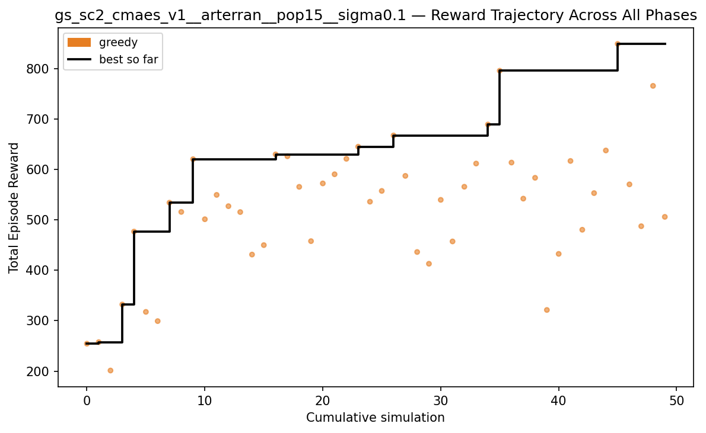

---

## 17. gs_sc2_cmaes_v1__arzerg__pop50__sigma0.3

**Best reward: +172.8** | **Best progress: 0.0000** | **Finish rate: 0.0%**

| Param | Value |
|---|---|
| `agent_race` | zerg |
| `population_size` | 50 |
| `initial_sigma` | 0.3 |

| Stat | Value |
|---|---|
| Best track progress | 0.0000 |
| Finish rate | 0.0% |
| Best finish time | — |
| Greedy improvements | 9 |
| First improvement (sim) | 1 |
| Accel % of best run | 0.0% |
| Greedy runtime | 12h 31m 30.0s |

---

## 18. gs_sc2_cmaes_v1__arterran__pop50__sigma0.1

**Best reward: +172.3** | **Best progress: 0.0000** | **Finish rate: 0.0%**

| Param | Value |
|---|---|
| `agent_race` | terran |
| `population_size` | 50 |
| `initial_sigma` | 0.1 |

| Stat | Value |
|---|---|
| Best track progress | 0.0000 |
| Finish rate | 0.0% |
| Best finish time | — |
| Greedy improvements | 7 |
| First improvement (sim) | 1 |
| Accel % of best run | 0.0% |
| Greedy runtime | 11h 48m 14.1s |

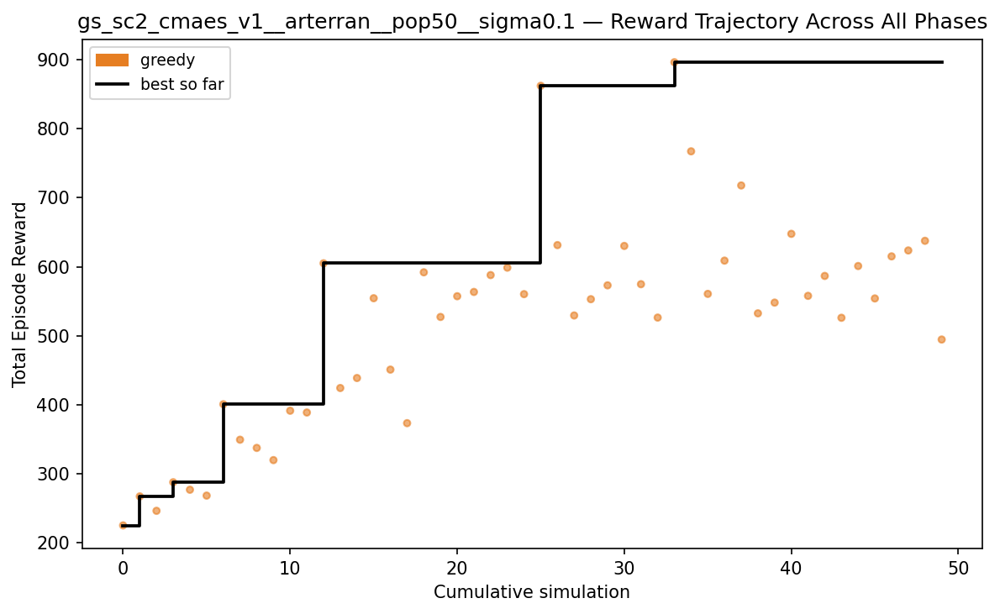

---

## 19. gs_sc2_cmaes_v1__arprotoss__pop50__sigma0.5

**Best reward: +167.9** | **Best progress: 0.0000** | **Finish rate: 0.0%**

| Param | Value |
|---|---|
| `agent_race` | protoss |
| `population_size` | 50 |
| `initial_sigma` | 0.5 |

| Stat | Value |
|---|---|
| Best track progress | 0.0000 |
| Finish rate | 0.0% |
| Best finish time | — |
| Greedy improvements | 7 |
| First improvement (sim) | 1 |
| Accel % of best run | 0.0% |
| Greedy runtime | 12h 32m 59.4s |

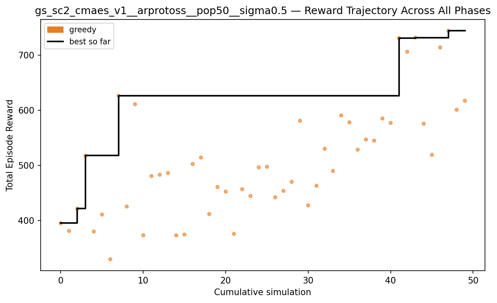

---

## 20. gs_sc2_cmaes_v1__arprotoss__pop50__sigma0.3

**Best reward: +163.9** | **Best progress: 0.0000** | **Finish rate: 0.0%**

| Param | Value |
|---|---|
| `agent_race` | protoss |
| `population_size` | 50 |
| `initial_sigma` | 0.3 |

| Stat | Value |
|---|---|
| Best track progress | 0.0000 |
| Finish rate | 0.0% |
| Best finish time | — |
| Greedy improvements | 5 |
| First improvement (sim) | 1 |
| Accel % of best run | 0.0% |
| Greedy runtime | 12h 34m 45.5s |

---

## 21. gs_sc2_cmaes_v1__arterran__pop25__sigma0.3

**Best reward: +162.4** | **Best progress: 0.0000** | **Finish rate: 0.0%**

| Param | Value |
|---|---|
| `agent_race` | terran |
| `population_size` | 25 |
| `initial_sigma` | 0.3 |

| Stat | Value |
|---|---|
| Best track progress | 0.0000 |
| Finish rate | 0.0% |
| Best finish time | — |
| Greedy improvements | 6 |
| First improvement (sim) | 1 |
| Accel % of best run | 0.0% |
| Greedy runtime | 6h 26m 20.7s |

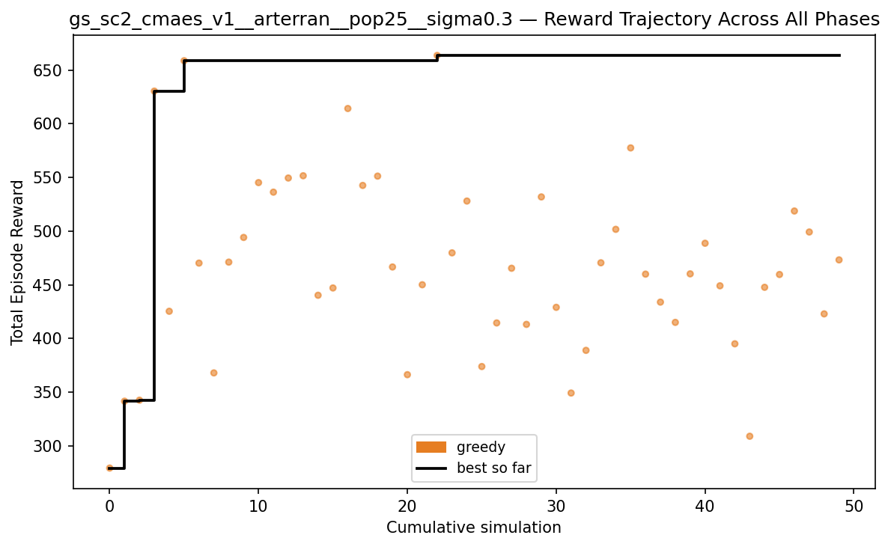

---

## 22. gs_sc2_cmaes_v1__arterran__pop25__sigma0.1

**Best reward: +162.3** | **Best progress: 0.0000** | **Finish rate: 0.0%**

| Param | Value |
|---|---|
| `agent_race` | terran |
| `population_size` | 25 |
| `initial_sigma` | 0.1 |

| Stat | Value |
|---|---|
| Best track progress | 0.0000 |
| Finish rate | 0.0% |
| Best finish time | — |
| Greedy improvements | 5 |
| First improvement (sim) | 1 |
| Accel % of best run | 0.0% |
| Greedy runtime | 5h 21m 37.0s |

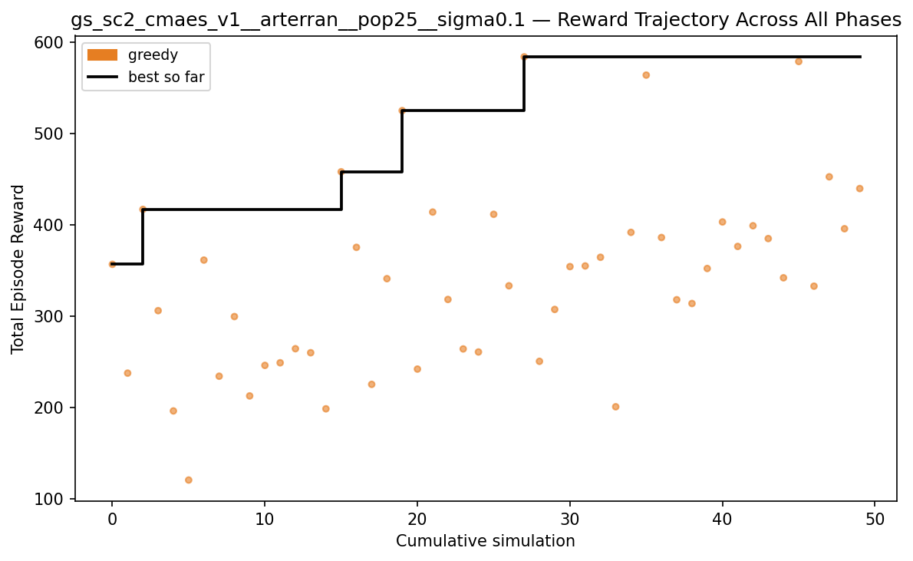

---

## 23. gs_sc2_cmaes_v1__arzerg__pop50__sigma0.5

**Best reward: +152.9** | **Best progress: 0.0000** | **Finish rate: 0.0%**

| Param | Value |
|---|---|
| `agent_race` | zerg |
| `population_size` | 50 |
| `initial_sigma` | 0.5 |

| Stat | Value |
|---|---|
| Best track progress | 0.0000 |
| Finish rate | 0.0% |
| Best finish time | — |
| Greedy improvements | 6 |
| First improvement (sim) | 1 |
| Accel % of best run | 0.0% |
| Greedy runtime | 12h 17m 03.3s |

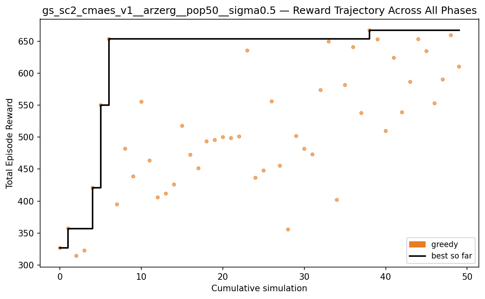

---

## 24. gs_sc2_cmaes_v1__arterran__pop15__sigma0.3

**Best reward: +147.4** | **Best progress: 0.0000** | **Finish rate: 0.0%**

| Param | Value |
|---|---|
| `agent_race` | terran |
| `population_size` | 15 |
| `initial_sigma` | 0.3 |

| Stat | Value |
|---|---|
| Best track progress | 0.0000 |
| Finish rate | 0.0% |
| Best finish time | — |
| Greedy improvements | 8 |
| First improvement (sim) | 1 |
| Accel % of best run | 0.0% |
| Greedy runtime | 3h 42m 01.1s |

---

## 25. gs_sc2_cmaes_v1__arzerg__pop15__sigma0.1

**Best reward: +138.3** | **Best progress: 0.0000** | **Finish rate: 0.0%**

| Param | Value |
|---|---|
| `agent_race` | zerg |
| `population_size` | 15 |
| `initial_sigma` | 0.1 |

| Stat | Value |
|---|---|
| Best track progress | 0.0000 |
| Finish rate | 0.0% |
| Best finish time | — |
| Greedy improvements | 5 |
| First improvement (sim) | 1 |
| Accel % of best run | 0.0% |
| Greedy runtime | 3h 18m 38.8s |

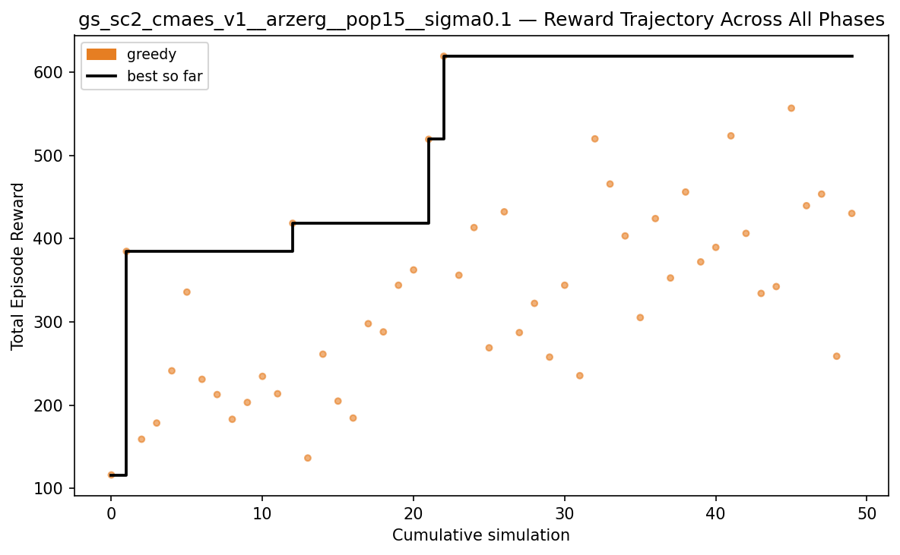

---

## 26. gs_sc2_cmaes_v1__arprotoss__pop25__sigma0.5

**Best reward: +126.3** | **Best progress: 0.0000** | **Finish rate: 0.0%**

| Param | Value |
|---|---|
| `agent_race` | protoss |
| `population_size` | 25 |
| `initial_sigma` | 0.5 |

| Stat | Value |
|---|---|
| Best track progress | 0.0000 |
| Finish rate | 0.0% |
| Best finish time | — |
| Greedy improvements | 9 |
| First improvement (sim) | 1 |
| Accel % of best run | 0.0% |
| Greedy runtime | 6h 11m 24.5s |

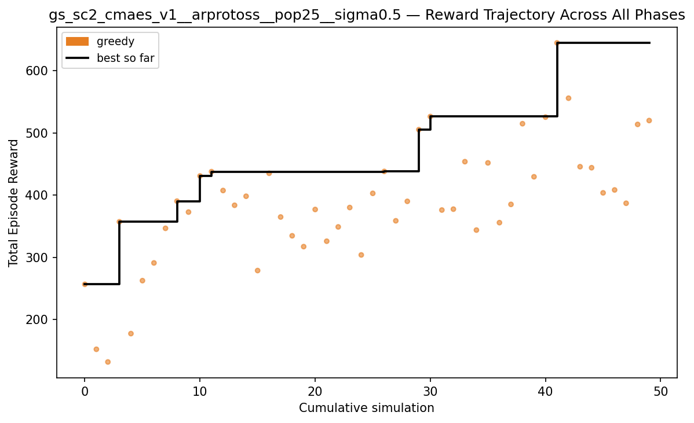

---

## 27. gs_sc2_cmaes_v1__arzerg__pop15__sigma0.5

**Best reward: +102.7** | **Best progress: 0.0000** | **Finish rate: 0.0%**

| Param | Value |
|---|---|
| `agent_race` | zerg |
| `population_size` | 15 |
| `initial_sigma` | 0.5 |

| Stat | Value |
|---|---|
| Best track progress | 0.0000 |
| Finish rate | 0.0% |
| Best finish time | — |
| Greedy improvements | 5 |
| First improvement (sim) | 1 |
| Accel % of best run | 0.0% |
| Greedy runtime | 3h 37m 50.1s |

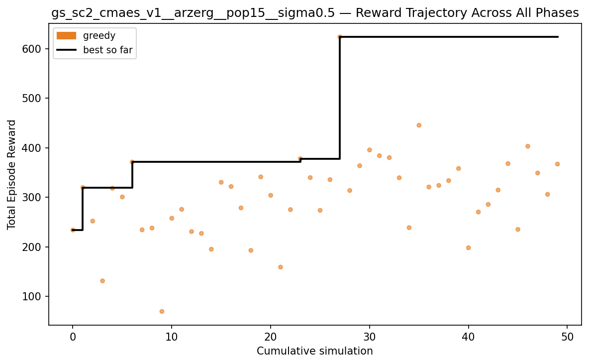

## SC2-specific cross-run charts

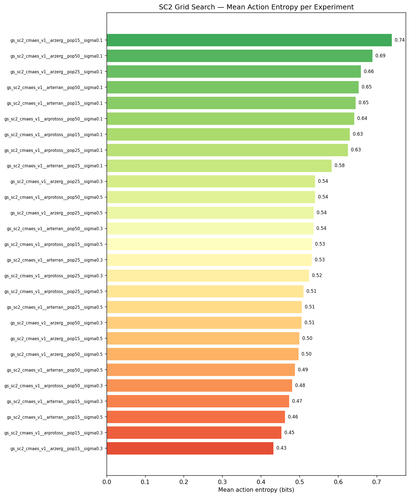

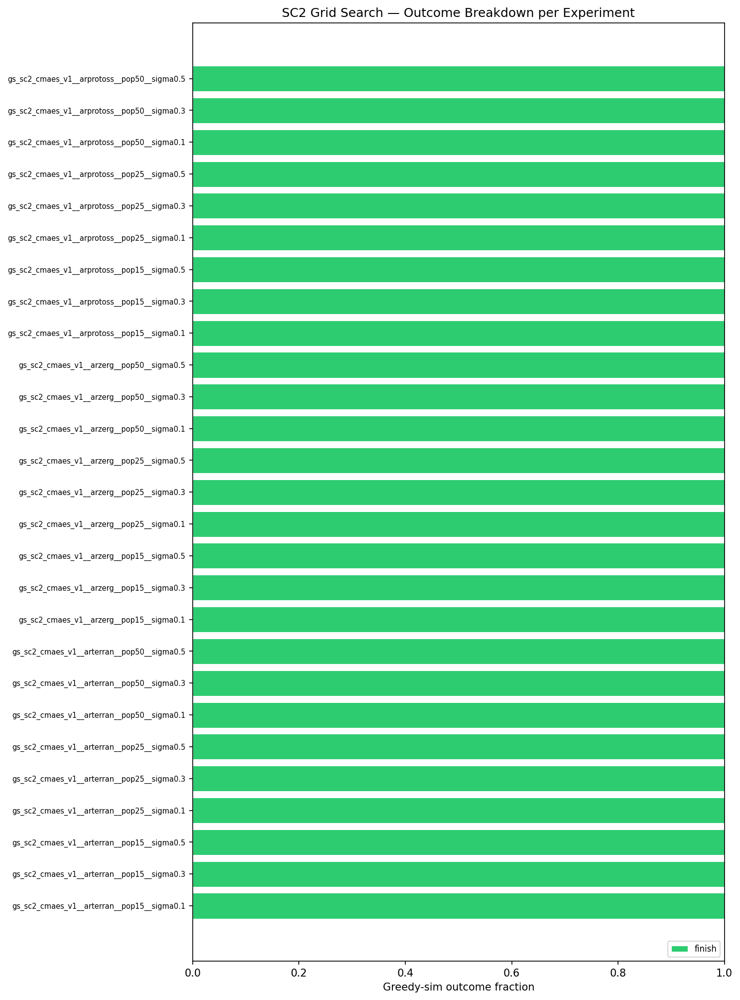

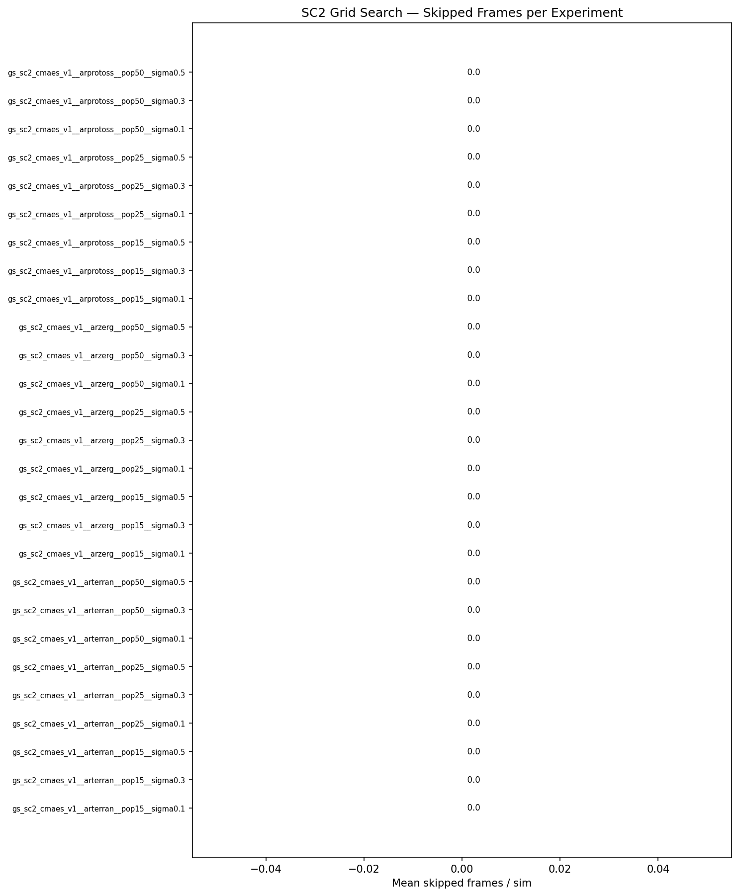

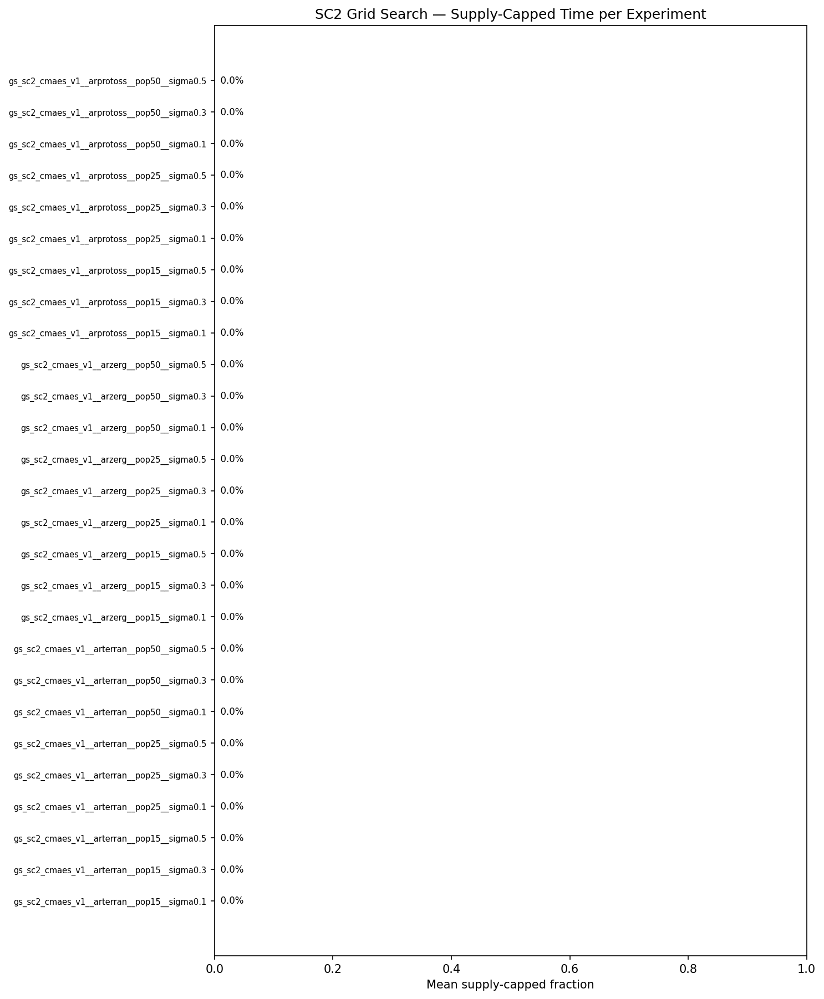

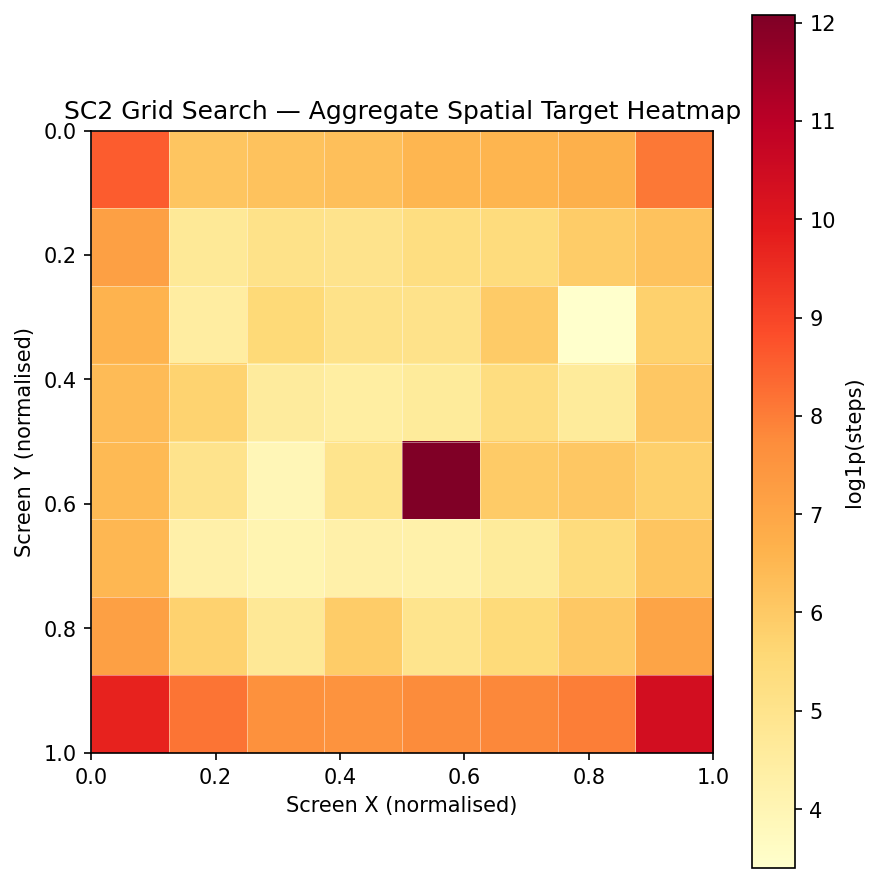

