# Grid Search Summary: gs_sc2_eps_greedy_v2

108 experiments.

## Rankings by Task Metrics (config-independent)

Ranked by best track progress, then by best reward.

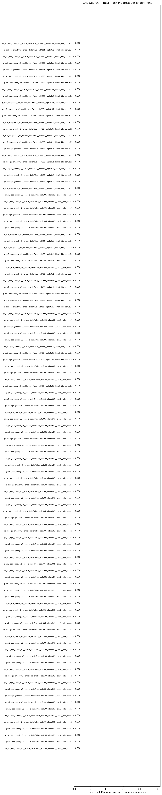

| Rank | Experiment | Best Progress | Finish Rate | Best Finish Time | Best Reward |
|------|-----------|---------------|-------------|-----------------|-------------|
| 1 | gs_sc2_eps_greedy_v2__enable_beliefFalse__ed0.99__alpha0.1__bins2__idle_bonus5 | 0.0000 | 0.0% | — | +4639.6 |
| 2 | gs_sc2_eps_greedy_v2__enable_beliefTrue__ed0.99__alpha0.2__bins2__idle_bonus5 | 0.0000 | 0.0% | — | +4500.4 |
| 3 | gs_sc2_eps_greedy_v2__enable_beliefFalse__ed0.99__alpha0.1__bins4__idle_bonus5 | 0.0000 | 0.0% | — | +4479.2 |
| 4 | gs_sc2_eps_greedy_v2__enable_beliefTrue__ed0.99__alpha0.2__bins3__idle_bonus5 | 0.0000 | 0.0% | — | +4443.3 |
| 5 | gs_sc2_eps_greedy_v2__enable_beliefFalse__ed0.99__alpha0.05__bins3__idle_bonus5 | 0.0000 | 0.0% | — | +4269.7 |
| 6 | gs_sc2_eps_greedy_v2__enable_beliefFalse__ed0.99__alpha0.1__bins3__idle_bonus5 | 0.0000 | 0.0% | — | +4200.0 |
| 7 | gs_sc2_eps_greedy_v2__enable_beliefTrue__ed0.99__alpha0.1__bins3__idle_bonus5 | 0.0000 | 0.0% | — | +4000.6 |
| 8 | gs_sc2_eps_greedy_v2__enable_beliefTrue__ed0.99__alpha0.05__bins2__idle_bonus5 | 0.0000 | 0.0% | — | +3531.3 |
| 9 | gs_sc2_eps_greedy_v2__enable_beliefFalse__ed0.99__alpha0.2__bins3__idle_bonus5 | 0.0000 | 0.0% | — | +3510.0 |
| 10 | gs_sc2_eps_greedy_v2__enable_beliefTrue__ed0.99__alpha0.05__bins4__idle_bonus5 | 0.0000 | 0.0% | — | +3441.3 |
| 11 | gs_sc2_eps_greedy_v2__enable_beliefFalse__ed0.99__alpha0.05__bins2__idle_bonus5 | 0.0000 | 0.0% | — | +3354.1 |
| 12 | gs_sc2_eps_greedy_v2__enable_beliefFalse__ed0.99__alpha0.2__bins4__idle_bonus5 | 0.0000 | 0.0% | — | +3351.1 |
| 13 | gs_sc2_eps_greedy_v2__enable_beliefFalse__ed0.99__alpha0.05__bins4__idle_bonus5 | 0.0000 | 0.0% | — | +3197.1 |
| 14 | gs_sc2_eps_greedy_v2__enable_beliefTrue__ed0.99__alpha0.1__bins2__idle_bonus5 | 0.0000 | 0.0% | — | +3185.8 |
| 15 | gs_sc2_eps_greedy_v2__enable_beliefTrue__ed0.99__alpha0.1__bins4__idle_bonus5 | 0.0000 | 0.0% | — | +2541.3 |
| 16 | gs_sc2_eps_greedy_v2__enable_beliefFalse__ed0.99__alpha0.2__bins2__idle_bonus5 | 0.0000 | 0.0% | — | +2489.3 |
| 17 | gs_sc2_eps_greedy_v2__enable_beliefTrue__ed0.99__alpha0.05__bins3__idle_bonus5 | 0.0000 | 0.0% | — | +2471.6 |
| 18 | gs_sc2_eps_greedy_v2__enable_beliefTrue__ed0.995__alpha0.2__bins2__idle_bonus5 | 0.0000 | 0.0% | — | +2271.2 |
| 19 | gs_sc2_eps_greedy_v2__enable_beliefFalse__ed0.995__alpha0.05__bins3__idle_bonus5 | 0.0000 | 0.0% | — | +2169.9 |
| 20 | gs_sc2_eps_greedy_v2__enable_beliefTrue__ed0.995__alpha0.05__bins3__idle_bonus5 | 0.0000 | 0.0% | — | +2071.4 |
| 21 | gs_sc2_eps_greedy_v2__enable_beliefTrue__ed0.99__alpha0.2__bins4__idle_bonus5 | 0.0000 | 0.0% | — | +2000.5 |
| 22 | gs_sc2_eps_greedy_v2__enable_beliefFalse__ed0.995__alpha0.05__bins2__idle_bonus5 | 0.0000 | 0.0% | — | +1990.2 |
| 23 | gs_sc2_eps_greedy_v2__enable_beliefTrue__ed0.995__alpha0.2__bins4__idle_bonus5 | 0.0000 | 0.0% | — | +1951.6 |
| 24 | gs_sc2_eps_greedy_v2__enable_beliefTrue__ed0.995__alpha0.2__bins3__idle_bonus5 | 0.0000 | 0.0% | — | +1951.3 |
| 25 | gs_sc2_eps_greedy_v2__enable_beliefFalse__ed0.995__alpha0.1__bins3__idle_bonus5 | 0.0000 | 0.0% | — | +1830.1 |
| 26 | gs_sc2_eps_greedy_v2__enable_beliefTrue__ed0.995__alpha0.05__bins4__idle_bonus5 | 0.0000 | 0.0% | — | +1800.5 |
| 27 | gs_sc2_eps_greedy_v2__enable_beliefTrue__ed0.995__alpha0.1__bins2__idle_bonus5 | 0.0000 | 0.0% | — | +1791.1 |
| 28 | gs_sc2_eps_greedy_v2__enable_beliefFalse__ed0.995__alpha0.2__bins3__idle_bonus5 | 0.0000 | 0.0% | — | +1789.5 |
| 29 | gs_sc2_eps_greedy_v2__enable_beliefTrue__ed0.995__alpha0.05__bins2__idle_bonus5 | 0.0000 | 0.0% | — | +1750.8 |
| 30 | gs_sc2_eps_greedy_v2__enable_beliefFalse__ed0.995__alpha0.2__bins2__idle_bonus5 | 0.0000 | 0.0% | — | +1750.3 |
| 31 | gs_sc2_eps_greedy_v2__enable_beliefTrue__ed0.995__alpha0.1__bins3__idle_bonus5 | 0.0000 | 0.0% | — | +1711.1 |
| 32 | gs_sc2_eps_greedy_v2__enable_beliefTrue__ed0.995__alpha0.1__bins4__idle_bonus5 | 0.0000 | 0.0% | — | +1710.4 |
| 33 | gs_sc2_eps_greedy_v2__enable_beliefFalse__ed0.995__alpha0.1__bins2__idle_bonus5 | 0.0000 | 0.0% | — | +1470.5 |
| 34 | gs_sc2_eps_greedy_v2__enable_beliefFalse__ed0.995__alpha0.1__bins4__idle_bonus5 | 0.0000 | 0.0% | — | +1395.1 |
| 35 | gs_sc2_eps_greedy_v2__enable_beliefFalse__ed0.995__alpha0.2__bins4__idle_bonus5 | 0.0000 | 0.0% | — | +1229.7 |
| 36 | gs_sc2_eps_greedy_v2__enable_beliefFalse__ed0.99__alpha0.1__bins2__idle_bonus1 | 0.0000 | 0.0% | — | +1097.3 |
| 37 | gs_sc2_eps_greedy_v2__enable_beliefFalse__ed0.995__alpha0.05__bins4__idle_bonus5 | 0.0000 | 0.0% | — | +1069.2 |
| 38 | gs_sc2_eps_greedy_v2__enable_beliefTrue__ed0.99__alpha0.2__bins3__idle_bonus1 | 0.0000 | 0.0% | — | +1028.5 |
| 39 | gs_sc2_eps_greedy_v2__enable_beliefTrue__ed0.99__alpha0.05__bins4__idle_bonus1 | 0.0000 | 0.0% | — | +948.3 |
| 40 | gs_sc2_eps_greedy_v2__enable_beliefFalse__ed0.99__alpha0.05__bins2__idle_bonus1 | 0.0000 | 0.0% | — | +937.1 |
| 41 | gs_sc2_eps_greedy_v2__enable_beliefFalse__ed0.99__alpha0.2__bins3__idle_bonus1 | 0.0000 | 0.0% | — | +883.1 |
| 42 | gs_sc2_eps_greedy_v2__enable_beliefFalse__ed0.99__alpha0.05__bins4__idle_bonus1 | 0.0000 | 0.0% | — | +856.1 |
| 43 | gs_sc2_eps_greedy_v2__enable_beliefTrue__ed0.99__alpha0.2__bins2__idle_bonus1 | 0.0000 | 0.0% | — | +825.1 |
| 44 | gs_sc2_eps_greedy_v2__enable_beliefFalse__ed0.99__alpha0.1__bins3__idle_bonus1 | 0.0000 | 0.0% | — | +797.7 |
| 45 | gs_sc2_eps_greedy_v2__enable_beliefTrue__ed0.99__alpha0.1__bins4__idle_bonus1 | 0.0000 | 0.0% | — | +791.3 |
| 46 | gs_sc2_eps_greedy_v2__enable_beliefTrue__ed0.99__alpha0.05__bins3__idle_bonus1 | 0.0000 | 0.0% | — | +731.2 |
| 47 | gs_sc2_eps_greedy_v2__enable_beliefTrue__ed0.99__alpha0.1__bins3__idle_bonus1 | 0.0000 | 0.0% | — | +675.3 |
| 48 | gs_sc2_eps_greedy_v2__enable_beliefFalse__ed0.99__alpha0.05__bins3__idle_bonus1 | 0.0000 | 0.0% | — | +659.5 |
| 49 | gs_sc2_eps_greedy_v2__enable_beliefTrue__ed0.995__alpha0.1__bins4__idle_bonus1 | 0.0000 | 0.0% | — | +638.5 |
| 50 | gs_sc2_eps_greedy_v2__enable_beliefTrue__ed0.99__alpha0.1__bins2__idle_bonus1 | 0.0000 | 0.0% | — | +585.0 |
| 51 | gs_sc2_eps_greedy_v2__enable_beliefTrue__ed0.995__alpha0.05__bins3__idle_bonus1 | 0.0000 | 0.0% | — | +576.8 |
| 52 | gs_sc2_eps_greedy_v2__enable_beliefTrue__ed0.99__alpha0.05__bins2__idle_bonus1 | 0.0000 | 0.0% | — | +564.8 |
| 53 | gs_sc2_eps_greedy_v2__enable_beliefFalse__ed0.99__alpha0.2__bins2__idle_bonus1 | 0.0000 | 0.0% | — | +535.7 |
| 54 | gs_sc2_eps_greedy_v2__enable_beliefTrue__ed0.995__alpha0.05__bins2__idle_bonus1 | 0.0000 | 0.0% | — | +518.9 |
| 55 | gs_sc2_eps_greedy_v2__enable_beliefTrue__ed0.99__alpha0.2__bins4__idle_bonus1 | 0.0000 | 0.0% | — | +505.5 |
| 56 | gs_sc2_eps_greedy_v2__enable_beliefFalse__ed0.99__alpha0.05__bins3__idle_bonus0.5 | 0.0000 | 0.0% | — | +493.1 |
| 57 | gs_sc2_eps_greedy_v2__enable_beliefFalse__ed0.99__alpha0.1__bins4__idle_bonus1 | 0.0000 | 0.0% | — | +488.1 |
| 58 | gs_sc2_eps_greedy_v2__enable_beliefFalse__ed0.995__alpha0.2__bins2__idle_bonus1 | 0.0000 | 0.0% | — | +485.5 |
| 59 | gs_sc2_eps_greedy_v2__enable_beliefFalse__ed0.99__alpha0.2__bins4__idle_bonus1 | 0.0000 | 0.0% | — | +485.2 |
| 60 | gs_sc2_eps_greedy_v2__enable_beliefTrue__ed0.99__alpha0.05__bins2__idle_bonus0.5 | 0.0000 | 0.0% | — | +471.3 |
| 61 | gs_sc2_eps_greedy_v2__enable_beliefFalse__ed0.99__alpha0.05__bins2__idle_bonus0.5 | 0.0000 | 0.0% | — | +465.6 |
| 62 | gs_sc2_eps_greedy_v2__enable_beliefTrue__ed0.99__alpha0.1__bins3__idle_bonus0.5 | 0.0000 | 0.0% | — | +459.0 |
| 63 | gs_sc2_eps_greedy_v2__enable_beliefTrue__ed0.995__alpha0.1__bins3__idle_bonus1 | 0.0000 | 0.0% | — | +439.2 |
| 64 | gs_sc2_eps_greedy_v2__enable_beliefTrue__ed0.995__alpha0.05__bins4__idle_bonus1 | 0.0000 | 0.0% | — | +407.0 |
| 65 | gs_sc2_eps_greedy_v2__enable_beliefFalse__ed0.995__alpha0.1__bins3__idle_bonus1 | 0.0000 | 0.0% | — | +405.9 |
| 66 | gs_sc2_eps_greedy_v2__enable_beliefFalse__ed0.995__alpha0.2__bins3__idle_bonus1 | 0.0000 | 0.0% | — | +405.4 |
| 67 | gs_sc2_eps_greedy_v2__enable_beliefFalse__ed0.995__alpha0.05__bins3__idle_bonus1 | 0.0000 | 0.0% | — | +399.7 |
| 68 | gs_sc2_eps_greedy_v2__enable_beliefTrue__ed0.99__alpha0.05__bins3__idle_bonus0.5 | 0.0000 | 0.0% | — | +399.0 |
| 69 | gs_sc2_eps_greedy_v2__enable_beliefFalse__ed0.99__alpha0.2__bins3__idle_bonus0.5 | 0.0000 | 0.0% | — | +398.1 |
| 70 | gs_sc2_eps_greedy_v2__enable_beliefFalse__ed0.99__alpha0.05__bins4__idle_bonus0.5 | 0.0000 | 0.0% | — | +396.1 |
| 71 | gs_sc2_eps_greedy_v2__enable_beliefFalse__ed0.99__alpha0.1__bins3__idle_bonus0.5 | 0.0000 | 0.0% | — | +393.6 |
| 72 | gs_sc2_eps_greedy_v2__enable_beliefFalse__ed0.995__alpha0.05__bins2__idle_bonus1 | 0.0000 | 0.0% | — | +392.1 |
| 73 | gs_sc2_eps_greedy_v2__enable_beliefTrue__ed0.99__alpha0.2__bins4__idle_bonus0.5 | 0.0000 | 0.0% | — | +390.5 |
| 74 | gs_sc2_eps_greedy_v2__enable_beliefTrue__ed0.995__alpha0.1__bins2__idle_bonus1 | 0.0000 | 0.0% | — | +359.2 |
| 75 | gs_sc2_eps_greedy_v2__enable_beliefTrue__ed0.995__alpha0.2__bins2__idle_bonus1 | 0.0000 | 0.0% | — | +350.6 |
| 76 | gs_sc2_eps_greedy_v2__enable_beliefFalse__ed0.99__alpha0.2__bins2__idle_bonus0.5 | 0.0000 | 0.0% | — | +345.8 |
| 77 | gs_sc2_eps_greedy_v2__enable_beliefFalse__ed0.99__alpha0.1__bins2__idle_bonus0.5 | 0.0000 | 0.0% | — | +341.9 |
| 78 | gs_sc2_eps_greedy_v2__enable_beliefTrue__ed0.99__alpha0.1__bins4__idle_bonus0.5 | 0.0000 | 0.0% | — | +331.3 |
| 79 | gs_sc2_eps_greedy_v2__enable_beliefFalse__ed0.99__alpha0.1__bins4__idle_bonus0.5 | 0.0000 | 0.0% | — | +313.5 |
| 80 | gs_sc2_eps_greedy_v2__enable_beliefTrue__ed0.995__alpha0.2__bins3__idle_bonus1 | 0.0000 | 0.0% | — | +310.3 |
| 81 | gs_sc2_eps_greedy_v2__enable_beliefFalse__ed0.995__alpha0.1__bins2__idle_bonus1 | 0.0000 | 0.0% | — | +309.9 |
| 82 | gs_sc2_eps_greedy_v2__enable_beliefFalse__ed0.995__alpha0.05__bins4__idle_bonus1 | 0.0000 | 0.0% | — | +301.4 |
| 83 | gs_sc2_eps_greedy_v2__enable_beliefFalse__ed0.995__alpha0.1__bins4__idle_bonus1 | 0.0000 | 0.0% | — | +253.9 |
| 84 | gs_sc2_eps_greedy_v2__enable_beliefFalse__ed0.995__alpha0.2__bins4__idle_bonus1 | 0.0000 | 0.0% | — | +245.1 |
| 85 | gs_sc2_eps_greedy_v2__enable_beliefTrue__ed0.995__alpha0.2__bins4__idle_bonus1 | 0.0000 | 0.0% | — | +239.4 |
| 86 | gs_sc2_eps_greedy_v2__enable_beliefFalse__ed0.995__alpha0.2__bins4__idle_bonus0.5 | 0.0000 | 0.0% | — | +237.1 |
| 87 | gs_sc2_eps_greedy_v2__enable_beliefTrue__ed0.99__alpha0.1__bins2__idle_bonus0.5 | 0.0000 | 0.0% | — | +231.4 |
| 88 | gs_sc2_eps_greedy_v2__enable_beliefTrue__ed0.99__alpha0.2__bins2__idle_bonus0.5 | 0.0000 | 0.0% | — | +231.3 |
| 89 | gs_sc2_eps_greedy_v2__enable_beliefTrue__ed0.995__alpha0.1__bins3__idle_bonus0.5 | 0.0000 | 0.0% | — | +229.4 |
| 90 | gs_sc2_eps_greedy_v2__enable_beliefTrue__ed0.995__alpha0.2__bins2__idle_bonus0.5 | 0.0000 | 0.0% | — | +223.0 |
| 91 | gs_sc2_eps_greedy_v2__enable_beliefTrue__ed0.995__alpha0.05__bins3__idle_bonus0.5 | 0.0000 | 0.0% | — | +221.4 |
| 92 | gs_sc2_eps_greedy_v2__enable_beliefTrue__ed0.99__alpha0.2__bins3__idle_bonus0.5 | 0.0000 | 0.0% | — | +220.9 |
| 93 | gs_sc2_eps_greedy_v2__enable_beliefFalse__ed0.995__alpha0.1__bins3__idle_bonus0.5 | 0.0000 | 0.0% | — | +214.2 |
| 94 | gs_sc2_eps_greedy_v2__enable_beliefFalse__ed0.995__alpha0.1__bins2__idle_bonus0.5 | 0.0000 | 0.0% | — | +213.9 |
| 95 | gs_sc2_eps_greedy_v2__enable_beliefTrue__ed0.99__alpha0.05__bins4__idle_bonus0.5 | 0.0000 | 0.0% | — | +193.6 |
| 96 | gs_sc2_eps_greedy_v2__enable_beliefFalse__ed0.995__alpha0.2__bins2__idle_bonus0.5 | 0.0000 | 0.0% | — | +188.2 |
| 97 | gs_sc2_eps_greedy_v2__enable_beliefFalse__ed0.995__alpha0.05__bins2__idle_bonus0.5 | 0.0000 | 0.0% | — | +185.1 |
| 98 | gs_sc2_eps_greedy_v2__enable_beliefFalse__ed0.995__alpha0.05__bins4__idle_bonus0.5 | 0.0000 | 0.0% | — | +182.4 |
| 99 | gs_sc2_eps_greedy_v2__enable_beliefFalse__ed0.995__alpha0.05__bins3__idle_bonus0.5 | 0.0000 | 0.0% | — | +179.4 |
| 100 | gs_sc2_eps_greedy_v2__enable_beliefFalse__ed0.995__alpha0.2__bins3__idle_bonus0.5 | 0.0000 | 0.0% | — | +176.3 |
| 101 | gs_sc2_eps_greedy_v2__enable_beliefTrue__ed0.995__alpha0.05__bins2__idle_bonus0.5 | 0.0000 | 0.0% | — | +175.6 |
| 102 | gs_sc2_eps_greedy_v2__enable_beliefFalse__ed0.99__alpha0.2__bins4__idle_bonus0.5 | 0.0000 | 0.0% | — | +172.3 |
| 103 | gs_sc2_eps_greedy_v2__enable_beliefTrue__ed0.995__alpha0.2__bins4__idle_bonus0.5 | 0.0000 | 0.0% | — | +167.3 |
| 104 | gs_sc2_eps_greedy_v2__enable_beliefTrue__ed0.995__alpha0.2__bins3__idle_bonus0.5 | 0.0000 | 0.0% | — | +165.3 |
| 105 | gs_sc2_eps_greedy_v2__enable_beliefFalse__ed0.995__alpha0.1__bins4__idle_bonus0.5 | 0.0000 | 0.0% | — | +161.8 |
| 106 | gs_sc2_eps_greedy_v2__enable_beliefTrue__ed0.995__alpha0.1__bins2__idle_bonus0.5 | 0.0000 | 0.0% | — | +149.2 |
| 107 | gs_sc2_eps_greedy_v2__enable_beliefTrue__ed0.995__alpha0.1__bins4__idle_bonus0.5 | 0.0000 | 0.0% | — | +146.3 |
| 108 | gs_sc2_eps_greedy_v2__enable_beliefTrue__ed0.995__alpha0.05__bins4__idle_bonus0.5 | 0.0000 | 0.0% | — | +106.7 |

## Rankings by Reward

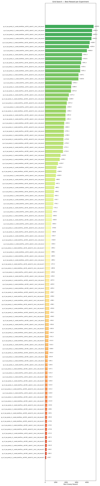

| Rank | Experiment | Best Reward | Improvements | First Improv. Sim | Accel % | Greedy Time |
|------|-----------|-------------|--------------|-------------------|---------|-------------|
| 1 | gs_sc2_eps_greedy_v2__enable_beliefFalse__ed0.99__alpha0.1__bins2__idle_bonus5 | +4639.6 | 17 | 1 | 97% | 8m 43.9s |
| 2 | gs_sc2_eps_greedy_v2__enable_beliefTrue__ed0.99__alpha0.2__bins2__idle_bonus5 | +4500.4 | 21 | 1 | 97% | 6m 26.0s |
| 3 | gs_sc2_eps_greedy_v2__enable_beliefFalse__ed0.99__alpha0.1__bins4__idle_bonus5 | +4479.2 | 22 | 1 | 96% | 9m 15.9s |
| 4 | gs_sc2_eps_greedy_v2__enable_beliefTrue__ed0.99__alpha0.2__bins3__idle_bonus5 | +4443.3 | 19 | 1 | 99% | 9m 09.5s |
| 5 | gs_sc2_eps_greedy_v2__enable_beliefFalse__ed0.99__alpha0.05__bins3__idle_bonus5 | +4269.7 | 22 | 1 | 98% | 10m 17.0s |
| 6 | gs_sc2_eps_greedy_v2__enable_beliefFalse__ed0.99__alpha0.1__bins3__idle_bonus5 | +4200.0 | 23 | 1 | 92% | 9m 24.5s |
| 7 | gs_sc2_eps_greedy_v2__enable_beliefTrue__ed0.99__alpha0.1__bins3__idle_bonus5 | +4000.6 | 17 | 1 | 95% | 10m 32.7s |
| 8 | gs_sc2_eps_greedy_v2__enable_beliefTrue__ed0.99__alpha0.05__bins2__idle_bonus5 | +3531.3 | 22 | 1 | 98% | 8m 35.9s |
| 9 | gs_sc2_eps_greedy_v2__enable_beliefFalse__ed0.99__alpha0.2__bins3__idle_bonus5 | +3510.0 | 22 | 1 | 94% | 9m 35.2s |
| 10 | gs_sc2_eps_greedy_v2__enable_beliefTrue__ed0.99__alpha0.05__bins4__idle_bonus5 | +3441.3 | 20 | 1 | 95% | 8m 09.9s |
| 11 | gs_sc2_eps_greedy_v2__enable_beliefFalse__ed0.99__alpha0.05__bins2__idle_bonus5 | +3354.1 | 19 | 1 | 86% | 8m 05.1s |
| 12 | gs_sc2_eps_greedy_v2__enable_beliefFalse__ed0.99__alpha0.2__bins4__idle_bonus5 | +3351.1 | 20 | 1 | 94% | 9m 26.5s |
| 13 | gs_sc2_eps_greedy_v2__enable_beliefFalse__ed0.99__alpha0.05__bins4__idle_bonus5 | +3197.1 | 23 | 1 | 97% | 10m 34.5s |
| 14 | gs_sc2_eps_greedy_v2__enable_beliefTrue__ed0.99__alpha0.1__bins2__idle_bonus5 | +3185.8 | 18 | 1 | 94% | 9m 03.2s |
| 15 | gs_sc2_eps_greedy_v2__enable_beliefTrue__ed0.99__alpha0.1__bins4__idle_bonus5 | +2541.3 | 15 | 1 | 95% | 11m 17.2s |
| 16 | gs_sc2_eps_greedy_v2__enable_beliefFalse__ed0.99__alpha0.2__bins2__idle_bonus5 | +2489.3 | 13 | 1 | 80% | 9m 17.7s |
| 17 | gs_sc2_eps_greedy_v2__enable_beliefTrue__ed0.99__alpha0.05__bins3__idle_bonus5 | +2471.6 | 17 | 1 | 93% | 9m 22.7s |
| 18 | gs_sc2_eps_greedy_v2__enable_beliefTrue__ed0.995__alpha0.2__bins2__idle_bonus5 | +2271.2 | 22 | 1 | 79% | 8m 56.6s |
| 19 | gs_sc2_eps_greedy_v2__enable_beliefFalse__ed0.995__alpha0.05__bins3__idle_bonus5 | +2169.9 | 24 | 1 | 82% | 7m 44.7s |
| 20 | gs_sc2_eps_greedy_v2__enable_beliefTrue__ed0.995__alpha0.05__bins3__idle_bonus5 | +2071.4 | 21 | 1 | 87% | 7m 14.1s |
| 21 | gs_sc2_eps_greedy_v2__enable_beliefTrue__ed0.99__alpha0.2__bins4__idle_bonus5 | +2000.5 | 17 | 1 | 80% | 9m 24.5s |
| 22 | gs_sc2_eps_greedy_v2__enable_beliefFalse__ed0.995__alpha0.05__bins2__idle_bonus5 | +1990.2 | 27 | 1 | 89% | 7m 48.4s |
| 23 | gs_sc2_eps_greedy_v2__enable_beliefTrue__ed0.995__alpha0.2__bins4__idle_bonus5 | +1951.6 | 17 | 1 | 89% | 8m 52.4s |
| 24 | gs_sc2_eps_greedy_v2__enable_beliefTrue__ed0.995__alpha0.2__bins3__idle_bonus5 | +1951.3 | 19 | 1 | 82% | 9m 26.8s |
| 25 | gs_sc2_eps_greedy_v2__enable_beliefFalse__ed0.995__alpha0.1__bins3__idle_bonus5 | +1830.1 | 22 | 1 | 81% | 8m 02.7s |
| 26 | gs_sc2_eps_greedy_v2__enable_beliefTrue__ed0.995__alpha0.05__bins4__idle_bonus5 | +1800.5 | 25 | 1 | 66% | 9m 58.1s |
| 27 | gs_sc2_eps_greedy_v2__enable_beliefTrue__ed0.995__alpha0.1__bins2__idle_bonus5 | +1791.1 | 21 | 1 | 86% | 8m 57.7s |
| 28 | gs_sc2_eps_greedy_v2__enable_beliefFalse__ed0.995__alpha0.2__bins3__idle_bonus5 | +1789.5 | 21 | 1 | 81% | 7m 58.0s |
| 29 | gs_sc2_eps_greedy_v2__enable_beliefTrue__ed0.995__alpha0.05__bins2__idle_bonus5 | +1750.8 | 17 | 1 | 85% | 8m 27.6s |
| 30 | gs_sc2_eps_greedy_v2__enable_beliefFalse__ed0.995__alpha0.2__bins2__idle_bonus5 | +1750.3 | 21 | 1 | 92% | 8m 50.3s |
| 31 | gs_sc2_eps_greedy_v2__enable_beliefTrue__ed0.995__alpha0.1__bins3__idle_bonus5 | +1711.1 | 17 | 1 | 69% | 8m 13.4s |
| 32 | gs_sc2_eps_greedy_v2__enable_beliefTrue__ed0.995__alpha0.1__bins4__idle_bonus5 | +1710.4 | 13 | 1 | 82% | 9m 59.1s |
| 33 | gs_sc2_eps_greedy_v2__enable_beliefFalse__ed0.995__alpha0.1__bins2__idle_bonus5 | +1470.5 | 12 | 1 | 83% | 8m 16.1s |
| 34 | gs_sc2_eps_greedy_v2__enable_beliefFalse__ed0.995__alpha0.1__bins4__idle_bonus5 | +1395.1 | 11 | 1 | 57% | 8m 59.9s |
| 35 | gs_sc2_eps_greedy_v2__enable_beliefFalse__ed0.995__alpha0.2__bins4__idle_bonus5 | +1229.7 | 19 | 1 | 60% | 8m 29.1s |
| 36 | gs_sc2_eps_greedy_v2__enable_beliefFalse__ed0.99__alpha0.1__bins2__idle_bonus1 | +1097.3 | 22 | 1 | 97% | 8m 35.2s |
| 37 | gs_sc2_eps_greedy_v2__enable_beliefFalse__ed0.995__alpha0.05__bins4__idle_bonus5 | +1069.2 | 13 | 1 | 82% | 8m 51.2s |
| 38 | gs_sc2_eps_greedy_v2__enable_beliefTrue__ed0.99__alpha0.2__bins3__idle_bonus1 | +1028.5 | 21 | 1 | 93% | 8m 57.2s |
| 39 | gs_sc2_eps_greedy_v2__enable_beliefTrue__ed0.99__alpha0.05__bins4__idle_bonus1 | +948.3 | 23 | 1 | 98% | 7m 57.2s |
| 40 | gs_sc2_eps_greedy_v2__enable_beliefFalse__ed0.99__alpha0.05__bins2__idle_bonus1 | +937.1 | 20 | 1 | 96% | 6m 39.2s |
| 41 | gs_sc2_eps_greedy_v2__enable_beliefFalse__ed0.99__alpha0.2__bins3__idle_bonus1 | +883.1 | 21 | 1 | 93% | 8m 40.1s |
| 42 | gs_sc2_eps_greedy_v2__enable_beliefFalse__ed0.99__alpha0.05__bins4__idle_bonus1 | +856.1 | 21 | 1 | 94% | 7m 36.4s |
| 43 | gs_sc2_eps_greedy_v2__enable_beliefTrue__ed0.99__alpha0.2__bins2__idle_bonus1 | +825.1 | 23 | 1 | 99% | 7m 59.8s |
| 44 | gs_sc2_eps_greedy_v2__enable_beliefFalse__ed0.99__alpha0.1__bins3__idle_bonus1 | +797.7 | 17 | 1 | 96% | 11m 16.2s |
| 45 | gs_sc2_eps_greedy_v2__enable_beliefTrue__ed0.99__alpha0.1__bins4__idle_bonus1 | +791.3 | 19 | 1 | 52% | 10m 16.3s |
| 46 | gs_sc2_eps_greedy_v2__enable_beliefTrue__ed0.99__alpha0.05__bins3__idle_bonus1 | +731.2 | 23 | 1 | 88% | 7m 60.0s |
| 47 | gs_sc2_eps_greedy_v2__enable_beliefTrue__ed0.99__alpha0.1__bins3__idle_bonus1 | +675.3 | 17 | 1 | 97% | 8m 50.8s |
| 48 | gs_sc2_eps_greedy_v2__enable_beliefFalse__ed0.99__alpha0.05__bins3__idle_bonus1 | +659.5 | 17 | 1 | 94% | 8m 14.4s |
| 49 | gs_sc2_eps_greedy_v2__enable_beliefTrue__ed0.995__alpha0.1__bins4__idle_bonus1 | +638.5 | 18 | 1 | 61% | 8m 21.9s |
| 50 | gs_sc2_eps_greedy_v2__enable_beliefTrue__ed0.99__alpha0.1__bins2__idle_bonus1 | +585.0 | 21 | 1 | 98% | 8m 31.9s |
| 51 | gs_sc2_eps_greedy_v2__enable_beliefTrue__ed0.995__alpha0.05__bins3__idle_bonus1 | +576.8 | 20 | 1 | 84% | 7m 47.5s |
| 52 | gs_sc2_eps_greedy_v2__enable_beliefTrue__ed0.99__alpha0.05__bins2__idle_bonus1 | +564.8 | 13 | 1 | 95% | 8m 48.8s |
| 53 | gs_sc2_eps_greedy_v2__enable_beliefFalse__ed0.99__alpha0.2__bins2__idle_bonus1 | +535.7 | 16 | 1 | 91% | 7m 52.0s |
| 54 | gs_sc2_eps_greedy_v2__enable_beliefTrue__ed0.995__alpha0.05__bins2__idle_bonus1 | +518.9 | 17 | 1 | 80% | 8m 49.3s |
| 55 | gs_sc2_eps_greedy_v2__enable_beliefTrue__ed0.99__alpha0.2__bins4__idle_bonus1 | +505.5 | 22 | 1 | 97% | 10m 33.2s |
| 56 | gs_sc2_eps_greedy_v2__enable_beliefFalse__ed0.99__alpha0.05__bins3__idle_bonus0.5 | +493.1 | 19 | 1 | 94% | 10m 34.9s |
| 57 | gs_sc2_eps_greedy_v2__enable_beliefFalse__ed0.99__alpha0.1__bins4__idle_bonus1 | +488.1 | 15 | 1 | 98% | 7m 58.7s |
| 58 | gs_sc2_eps_greedy_v2__enable_beliefFalse__ed0.995__alpha0.2__bins2__idle_bonus1 | +485.5 | 11 | 1 | 81% | 8m 38.0s |
| 59 | gs_sc2_eps_greedy_v2__enable_beliefFalse__ed0.99__alpha0.2__bins4__idle_bonus1 | +485.2 | 13 | 1 | 92% | 9m 08.4s |
| 60 | gs_sc2_eps_greedy_v2__enable_beliefTrue__ed0.99__alpha0.05__bins2__idle_bonus0.5 | +471.3 | 19 | 1 | 91% | 6m 51.3s |
| 61 | gs_sc2_eps_greedy_v2__enable_beliefFalse__ed0.99__alpha0.05__bins2__idle_bonus0.5 | +465.6 | 26 | 1 | 97% | 6m 23.3s |
| 62 | gs_sc2_eps_greedy_v2__enable_beliefTrue__ed0.99__alpha0.1__bins3__idle_bonus0.5 | +459.0 | 13 | 1 | 81% | 8m 58.8s |
| 63 | gs_sc2_eps_greedy_v2__enable_beliefTrue__ed0.995__alpha0.1__bins3__idle_bonus1 | +439.2 | 19 | 1 | 80% | 8m 29.9s |
| 64 | gs_sc2_eps_greedy_v2__enable_beliefTrue__ed0.995__alpha0.05__bins4__idle_bonus1 | +407.0 | 13 | 1 | 58% | 8m 20.6s |
| 65 | gs_sc2_eps_greedy_v2__enable_beliefFalse__ed0.995__alpha0.1__bins3__idle_bonus1 | +405.9 | 18 | 1 | 62% | 8m 02.9s |
| 66 | gs_sc2_eps_greedy_v2__enable_beliefFalse__ed0.995__alpha0.2__bins3__idle_bonus1 | +405.4 | 14 | 1 | 80% | 8m 29.9s |
| 67 | gs_sc2_eps_greedy_v2__enable_beliefFalse__ed0.995__alpha0.05__bins3__idle_bonus1 | +399.7 | 16 | 1 | 84% | 7m 42.4s |
| 68 | gs_sc2_eps_greedy_v2__enable_beliefTrue__ed0.99__alpha0.05__bins3__idle_bonus0.5 | +399.0 | 19 | 1 | 97% | 12m 22.4s |
| 69 | gs_sc2_eps_greedy_v2__enable_beliefFalse__ed0.99__alpha0.2__bins3__idle_bonus0.5 | +398.1 | 15 | 1 | 93% | 9m 09.9s |
| 70 | gs_sc2_eps_greedy_v2__enable_beliefFalse__ed0.99__alpha0.05__bins4__idle_bonus0.5 | +396.1 | 19 | 1 | 96% | 8m 20.8s |
| 71 | gs_sc2_eps_greedy_v2__enable_beliefFalse__ed0.99__alpha0.1__bins3__idle_bonus0.5 | +393.6 | 22 | 1 | 93% | 7m 28.5s |
| 72 | gs_sc2_eps_greedy_v2__enable_beliefFalse__ed0.995__alpha0.05__bins2__idle_bonus1 | +392.1 | 19 | 1 | 89% | 8m 39.0s |
| 73 | gs_sc2_eps_greedy_v2__enable_beliefTrue__ed0.99__alpha0.2__bins4__idle_bonus0.5 | +390.5 | 19 | 1 | 91% | 8m 49.7s |
| 74 | gs_sc2_eps_greedy_v2__enable_beliefTrue__ed0.995__alpha0.1__bins2__idle_bonus1 | +359.2 | 14 | 1 | 79% | 8m 44.9s |
| 75 | gs_sc2_eps_greedy_v2__enable_beliefTrue__ed0.995__alpha0.2__bins2__idle_bonus1 | +350.6 | 16 | 1 | 77% | 8m 36.0s |
| 76 | gs_sc2_eps_greedy_v2__enable_beliefFalse__ed0.99__alpha0.2__bins2__idle_bonus0.5 | +345.8 | 24 | 1 | 99% | 8m 51.9s |
| 77 | gs_sc2_eps_greedy_v2__enable_beliefFalse__ed0.99__alpha0.1__bins2__idle_bonus0.5 | +341.9 | 17 | 1 | 94% | 8m 15.6s |
| 78 | gs_sc2_eps_greedy_v2__enable_beliefTrue__ed0.99__alpha0.1__bins4__idle_bonus0.5 | +331.3 | 14 | 1 | 97% | 10m 47.7s |
| 79 | gs_sc2_eps_greedy_v2__enable_beliefFalse__ed0.99__alpha0.1__bins4__idle_bonus0.5 | +313.5 | 19 | 1 | 97% | 7m 41.8s |
| 80 | gs_sc2_eps_greedy_v2__enable_beliefTrue__ed0.995__alpha0.2__bins3__idle_bonus1 | +310.3 | 18 | 1 | 76% | 8m 13.0s |
| 81 | gs_sc2_eps_greedy_v2__enable_beliefFalse__ed0.995__alpha0.1__bins2__idle_bonus1 | +309.9 | 24 | 1 | 69% | 7m 52.1s |
| 82 | gs_sc2_eps_greedy_v2__enable_beliefFalse__ed0.995__alpha0.05__bins4__idle_bonus1 | +301.4 | 10 | 1 | 76% | 8m 55.3s |
| 83 | gs_sc2_eps_greedy_v2__enable_beliefFalse__ed0.995__alpha0.1__bins4__idle_bonus1 | +253.9 | 14 | 1 | 85% | 8m 56.7s |
| 84 | gs_sc2_eps_greedy_v2__enable_beliefFalse__ed0.995__alpha0.2__bins4__idle_bonus1 | +245.1 | 14 | 1 | 68% | 8m 57.1s |
| 85 | gs_sc2_eps_greedy_v2__enable_beliefTrue__ed0.995__alpha0.2__bins4__idle_bonus1 | +239.4 | 13 | 1 | 60% | 9m 21.4s |
| 86 | gs_sc2_eps_greedy_v2__enable_beliefFalse__ed0.995__alpha0.2__bins4__idle_bonus0.5 | +237.1 | 14 | 1 | 83% | 8m 55.7s |
| 87 | gs_sc2_eps_greedy_v2__enable_beliefTrue__ed0.99__alpha0.1__bins2__idle_bonus0.5 | +231.4 | 15 | 1 | 91% | 8m 46.5s |
| 88 | gs_sc2_eps_greedy_v2__enable_beliefTrue__ed0.99__alpha0.2__bins2__idle_bonus0.5 | +231.3 | 14 | 1 | 86% | 9m 08.1s |
| 89 | gs_sc2_eps_greedy_v2__enable_beliefTrue__ed0.995__alpha0.1__bins3__idle_bonus0.5 | +229.4 | 15 | 1 | 68% | 8m 08.8s |
| 90 | gs_sc2_eps_greedy_v2__enable_beliefTrue__ed0.995__alpha0.2__bins2__idle_bonus0.5 | +223.0 | 21 | 1 | 84% | 9m 09.8s |
| 91 | gs_sc2_eps_greedy_v2__enable_beliefTrue__ed0.995__alpha0.05__bins3__idle_bonus0.5 | +221.4 | 15 | 1 | 89% | 7m 51.3s |
| 92 | gs_sc2_eps_greedy_v2__enable_beliefTrue__ed0.99__alpha0.2__bins3__idle_bonus0.5 | +220.9 | 21 | 1 | 93% | 7m 45.9s |
| 93 | gs_sc2_eps_greedy_v2__enable_beliefFalse__ed0.995__alpha0.1__bins3__idle_bonus0.5 | +214.2 | 19 | 1 | 86% | 8m 06.8s |
| 94 | gs_sc2_eps_greedy_v2__enable_beliefFalse__ed0.995__alpha0.1__bins2__idle_bonus0.5 | +213.9 | 14 | 1 | 84% | 8m 35.8s |
| 95 | gs_sc2_eps_greedy_v2__enable_beliefTrue__ed0.99__alpha0.05__bins4__idle_bonus0.5 | +193.6 | 12 | 1 | 81% | 12m 22.8s |
| 96 | gs_sc2_eps_greedy_v2__enable_beliefFalse__ed0.995__alpha0.2__bins2__idle_bonus0.5 | +188.2 | 19 | 1 | 90% | 8m 30.9s |
| 97 | gs_sc2_eps_greedy_v2__enable_beliefFalse__ed0.995__alpha0.05__bins2__idle_bonus0.5 | +185.1 | 18 | 1 | 80% | 8m 05.0s |
| 98 | gs_sc2_eps_greedy_v2__enable_beliefFalse__ed0.995__alpha0.05__bins4__idle_bonus0.5 | +182.4 | 19 | 1 | 85% | 7m 18.9s |
| 99 | gs_sc2_eps_greedy_v2__enable_beliefFalse__ed0.995__alpha0.05__bins3__idle_bonus0.5 | +179.4 | 22 | 1 | 89% | 10m 36.1s |
| 100 | gs_sc2_eps_greedy_v2__enable_beliefFalse__ed0.995__alpha0.2__bins3__idle_bonus0.5 | +176.3 | 19 | 1 | 84% | 8m 49.7s |
| 101 | gs_sc2_eps_greedy_v2__enable_beliefTrue__ed0.995__alpha0.05__bins2__idle_bonus0.5 | +175.6 | 26 | 1 | 89% | 8m 25.0s |
| 102 | gs_sc2_eps_greedy_v2__enable_beliefFalse__ed0.99__alpha0.2__bins4__idle_bonus0.5 | +172.3 | 20 | 1 | 89% | 9m 50.4s |
| 103 | gs_sc2_eps_greedy_v2__enable_beliefTrue__ed0.995__alpha0.2__bins4__idle_bonus0.5 | +167.3 | 16 | 1 | 87% | 10m 04.7s |
| 104 | gs_sc2_eps_greedy_v2__enable_beliefTrue__ed0.995__alpha0.2__bins3__idle_bonus0.5 | +165.3 | 17 | 1 | 90% | 8m 40.4s |
| 105 | gs_sc2_eps_greedy_v2__enable_beliefFalse__ed0.995__alpha0.1__bins4__idle_bonus0.5 | +161.8 | 19 | 1 | 76% | 9m 06.5s |
| 106 | gs_sc2_eps_greedy_v2__enable_beliefTrue__ed0.995__alpha0.1__bins2__idle_bonus0.5 | +149.2 | 12 | 1 | 78% | 8m 06.3s |
| 107 | gs_sc2_eps_greedy_v2__enable_beliefTrue__ed0.995__alpha0.1__bins4__idle_bonus0.5 | +146.3 | 17 | 1 | 91% | 9m 29.0s |
| 108 | gs_sc2_eps_greedy_v2__enable_beliefTrue__ed0.995__alpha0.05__bins4__idle_bonus0.5 | +106.7 | 13 | 1 | 67% | 9m 43.3s |

---

## 1. gs_sc2_eps_greedy_v2__enable_beliefFalse__ed0.99__alpha0.1__bins2__idle_bonus5

**Best reward: +4639.6** | **Best progress: 0.0000** | **Finish rate: 0.0%**

| Param | Value |
|---|---|
| `enable_belief` | False |
| `epsilon_decay` | 0.99 |
| `alpha` | 0.1 |
| `n_bins` | 2 |
| `idle_bonus` | 5.0 |

| Stat | Value |
|---|---|
| Best track progress | 0.0000 |
| Finish rate | 0.0% |
| Best finish time | — |
| Greedy improvements | 17 |
| First improvement (sim) | 1 |
| Accel % of best run | 96.6% |
| Greedy runtime | 8m 43.9s |

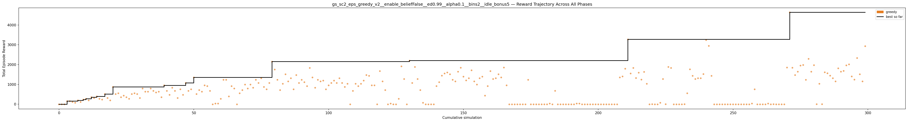

---

## 2. gs_sc2_eps_greedy_v2__enable_beliefTrue__ed0.99__alpha0.2__bins2__idle_bonus5

**Best reward: +4500.4** | **Best progress: 0.0000** | **Finish rate: 0.0%**

| Param | Value |
|---|---|
| `enable_belief` | True |
| `epsilon_decay` | 0.99 |
| `alpha` | 0.2 |
| `n_bins` | 2 |
| `idle_bonus` | 5.0 |

| Stat | Value |
|---|---|
| Best track progress | 0.0000 |
| Finish rate | 0.0% |
| Best finish time | — |
| Greedy improvements | 21 |
| First improvement (sim) | 1 |
| Accel % of best run | 97.4% |
| Greedy runtime | 6m 26.0s |

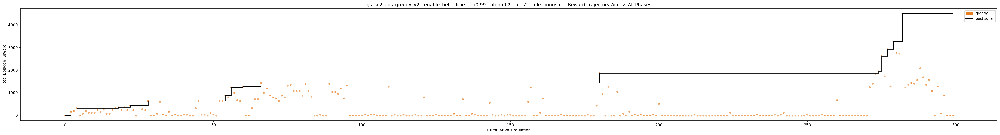

---

## 3. gs_sc2_eps_greedy_v2__enable_beliefFalse__ed0.99__alpha0.1__bins4__idle_bonus5

**Best reward: +4479.2** | **Best progress: 0.0000** | **Finish rate: 0.0%**

| Param | Value |
|---|---|
| `enable_belief` | False |
| `epsilon_decay` | 0.99 |
| `alpha` | 0.1 |
| `n_bins` | 4 |
| `idle_bonus` | 5.0 |

| Stat | Value |
|---|---|
| Best track progress | 0.0000 |
| Finish rate | 0.0% |
| Best finish time | — |
| Greedy improvements | 22 |
| First improvement (sim) | 1 |
| Accel % of best run | 96.0% |
| Greedy runtime | 9m 15.9s |

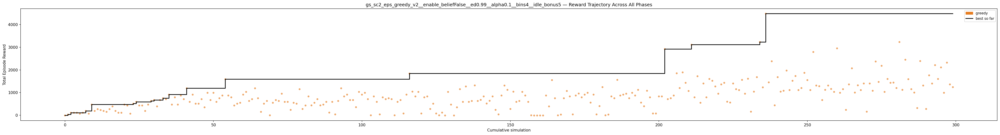

---

## 4. gs_sc2_eps_greedy_v2__enable_beliefTrue__ed0.99__alpha0.2__bins3__idle_bonus5

**Best reward: +4443.3** | **Best progress: 0.0000** | **Finish rate: 0.0%**

| Param | Value |
|---|---|
| `enable_belief` | True |
| `epsilon_decay` | 0.99 |
| `alpha` | 0.2 |
| `n_bins` | 3 |
| `idle_bonus` | 5.0 |

| Stat | Value |
|---|---|
| Best track progress | 0.0000 |
| Finish rate | 0.0% |
| Best finish time | — |
| Greedy improvements | 19 |
| First improvement (sim) | 1 |
| Accel % of best run | 98.8% |
| Greedy runtime | 9m 09.5s |

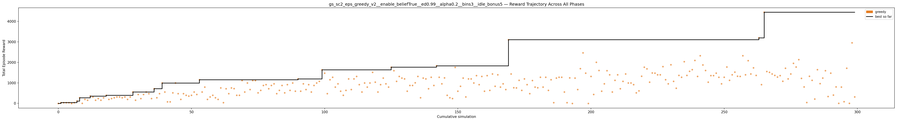

---

## 5. gs_sc2_eps_greedy_v2__enable_beliefFalse__ed0.99__alpha0.05__bins3__idle_bonus5

**Best reward: +4269.7** | **Best progress: 0.0000** | **Finish rate: 0.0%**

| Param | Value |
|---|---|
| `enable_belief` | False |
| `epsilon_decay` | 0.99 |
| `alpha` | 0.05 |
| `n_bins` | 3 |
| `idle_bonus` | 5.0 |

| Stat | Value |
|---|---|
| Best track progress | 0.0000 |
| Finish rate | 0.0% |
| Best finish time | — |
| Greedy improvements | 22 |
| First improvement (sim) | 1 |
| Accel % of best run | 97.6% |
| Greedy runtime | 10m 17.0s |

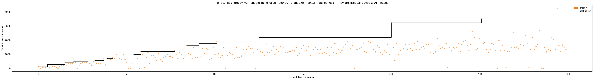

---

## 6. gs_sc2_eps_greedy_v2__enable_beliefFalse__ed0.99__alpha0.1__bins3__idle_bonus5

**Best reward: +4200.0** | **Best progress: 0.0000** | **Finish rate: 0.0%**

| Param | Value |
|---|---|
| `enable_belief` | False |
| `epsilon_decay` | 0.99 |
| `alpha` | 0.1 |
| `n_bins` | 3 |
| `idle_bonus` | 5.0 |

| Stat | Value |
|---|---|
| Best track progress | 0.0000 |
| Finish rate | 0.0% |
| Best finish time | — |
| Greedy improvements | 23 |
| First improvement (sim) | 1 |
| Accel % of best run | 92.1% |
| Greedy runtime | 9m 24.5s |

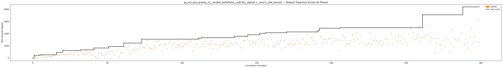

---

## 7. gs_sc2_eps_greedy_v2__enable_beliefTrue__ed0.99__alpha0.1__bins3__idle_bonus5

**Best reward: +4000.6** | **Best progress: 0.0000** | **Finish rate: 0.0%**

| Param | Value |
|---|---|
| `enable_belief` | True |
| `epsilon_decay` | 0.99 |
| `alpha` | 0.1 |
| `n_bins` | 3 |
| `idle_bonus` | 5.0 |

| Stat | Value |
|---|---|
| Best track progress | 0.0000 |
| Finish rate | 0.0% |
| Best finish time | — |
| Greedy improvements | 17 |
| First improvement (sim) | 1 |
| Accel % of best run | 94.9% |
| Greedy runtime | 10m 32.7s |

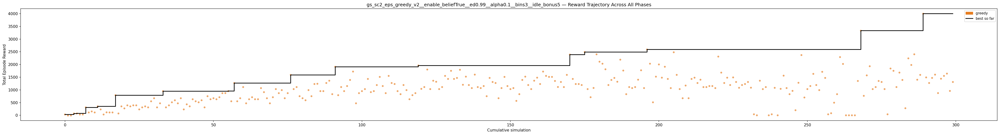

---

## 8. gs_sc2_eps_greedy_v2__enable_beliefTrue__ed0.99__alpha0.05__bins2__idle_bonus5

**Best reward: +3531.3** | **Best progress: 0.0000** | **Finish rate: 0.0%**

| Param | Value |
|---|---|
| `enable_belief` | True |
| `epsilon_decay` | 0.99 |
| `alpha` | 0.05 |
| `n_bins` | 2 |
| `idle_bonus` | 5.0 |

| Stat | Value |
|---|---|
| Best track progress | 0.0000 |
| Finish rate | 0.0% |
| Best finish time | — |
| Greedy improvements | 22 |
| First improvement (sim) | 1 |
| Accel % of best run | 98.3% |
| Greedy runtime | 8m 35.9s |

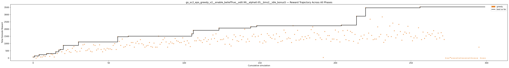

---

## 9. gs_sc2_eps_greedy_v2__enable_beliefFalse__ed0.99__alpha0.2__bins3__idle_bonus5

**Best reward: +3510.0** | **Best progress: 0.0000** | **Finish rate: 0.0%**

| Param | Value |
|---|---|
| `enable_belief` | False |
| `epsilon_decay` | 0.99 |
| `alpha` | 0.2 |
| `n_bins` | 3 |
| `idle_bonus` | 5.0 |

| Stat | Value |
|---|---|
| Best track progress | 0.0000 |
| Finish rate | 0.0% |
| Best finish time | — |
| Greedy improvements | 22 |
| First improvement (sim) | 1 |
| Accel % of best run | 93.8% |
| Greedy runtime | 9m 35.2s |

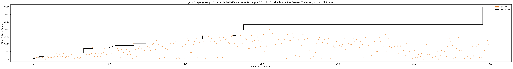

---

## 10. gs_sc2_eps_greedy_v2__enable_beliefTrue__ed0.99__alpha0.05__bins4__idle_bonus5

**Best reward: +3441.3** | **Best progress: 0.0000** | **Finish rate: 0.0%**

| Param | Value |
|---|---|
| `enable_belief` | True |
| `epsilon_decay` | 0.99 |
| `alpha` | 0.05 |
| `n_bins` | 4 |
| `idle_bonus` | 5.0 |

| Stat | Value |
|---|---|
| Best track progress | 0.0000 |
| Finish rate | 0.0% |
| Best finish time | — |
| Greedy improvements | 20 |
| First improvement (sim) | 1 |
| Accel % of best run | 95.0% |
| Greedy runtime | 8m 09.9s |

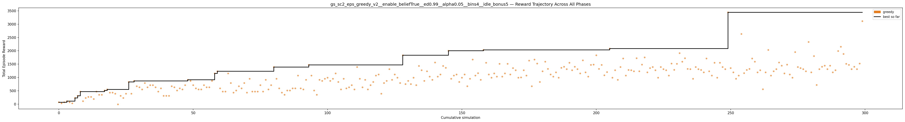

---

## 11. gs_sc2_eps_greedy_v2__enable_beliefFalse__ed0.99__alpha0.05__bins2__idle_bonus5

**Best reward: +3354.1** | **Best progress: 0.0000** | **Finish rate: 0.0%**

| Param | Value |
|---|---|
| `enable_belief` | False |
| `epsilon_decay` | 0.99 |
| `alpha` | 0.05 |
| `n_bins` | 2 |
| `idle_bonus` | 5.0 |

| Stat | Value |
|---|---|
| Best track progress | 0.0000 |
| Finish rate | 0.0% |
| Best finish time | — |
| Greedy improvements | 19 |
| First improvement (sim) | 1 |
| Accel % of best run | 85.8% |
| Greedy runtime | 8m 05.1s |

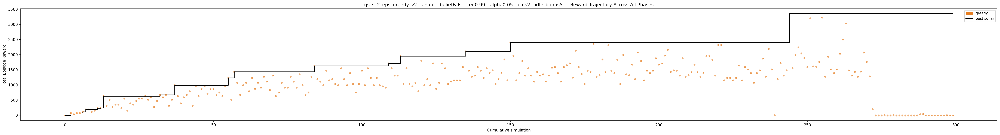

---

## 12. gs_sc2_eps_greedy_v2__enable_beliefFalse__ed0.99__alpha0.2__bins4__idle_bonus5

**Best reward: +3351.1** | **Best progress: 0.0000** | **Finish rate: 0.0%**

| Param | Value |
|---|---|
| `enable_belief` | False |
| `epsilon_decay` | 0.99 |
| `alpha` | 0.2 |
| `n_bins` | 4 |
| `idle_bonus` | 5.0 |

| Stat | Value |
|---|---|
| Best track progress | 0.0000 |
| Finish rate | 0.0% |
| Best finish time | — |
| Greedy improvements | 20 |
| First improvement (sim) | 1 |
| Accel % of best run | 93.8% |
| Greedy runtime | 9m 26.5s |

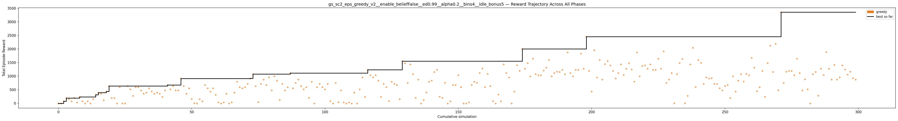

---

## 13. gs_sc2_eps_greedy_v2__enable_beliefFalse__ed0.99__alpha0.05__bins4__idle_bonus5

**Best reward: +3197.1** | **Best progress: 0.0000** | **Finish rate: 0.0%**

| Param | Value |
|---|---|
| `enable_belief` | False |
| `epsilon_decay` | 0.99 |
| `alpha` | 0.05 |
| `n_bins` | 4 |
| `idle_bonus` | 5.0 |

| Stat | Value |
|---|---|
| Best track progress | 0.0000 |
| Finish rate | 0.0% |
| Best finish time | — |
| Greedy improvements | 23 |
| First improvement (sim) | 1 |
| Accel % of best run | 96.7% |
| Greedy runtime | 10m 34.5s |

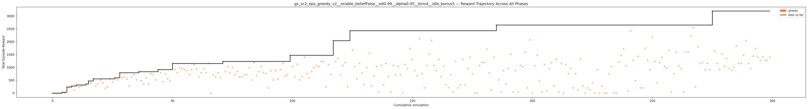

---

## 14. gs_sc2_eps_greedy_v2__enable_beliefTrue__ed0.99__alpha0.1__bins2__idle_bonus5

**Best reward: +3185.8** | **Best progress: 0.0000** | **Finish rate: 0.0%**

| Param | Value |
|---|---|
| `enable_belief` | True |
| `epsilon_decay` | 0.99 |
| `alpha` | 0.1 |
| `n_bins` | 2 |
| `idle_bonus` | 5.0 |

| Stat | Value |
|---|---|
| Best track progress | 0.0000 |
| Finish rate | 0.0% |
| Best finish time | — |
| Greedy improvements | 18 |
| First improvement (sim) | 1 |
| Accel % of best run | 93.8% |
| Greedy runtime | 9m 03.2s |

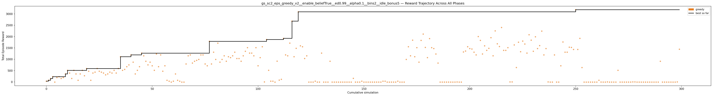

---

## 15. gs_sc2_eps_greedy_v2__enable_beliefTrue__ed0.99__alpha0.1__bins4__idle_bonus5

**Best reward: +2541.3** | **Best progress: 0.0000** | **Finish rate: 0.0%**

| Param | Value |
|---|---|
| `enable_belief` | True |
| `epsilon_decay` | 0.99 |
| `alpha` | 0.1 |
| `n_bins` | 4 |
| `idle_bonus` | 5.0 |

| Stat | Value |
|---|---|
| Best track progress | 0.0000 |
| Finish rate | 0.0% |
| Best finish time | — |
| Greedy improvements | 15 |
| First improvement (sim) | 1 |
| Accel % of best run | 95.4% |
| Greedy runtime | 11m 17.2s |

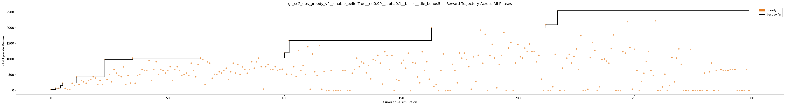

---

## 16. gs_sc2_eps_greedy_v2__enable_beliefFalse__ed0.99__alpha0.2__bins2__idle_bonus5

**Best reward: +2489.3** | **Best progress: 0.0000** | **Finish rate: 0.0%**

| Param | Value |
|---|---|
| `enable_belief` | False |
| `epsilon_decay` | 0.99 |
| `alpha` | 0.2 |
| `n_bins` | 2 |
| `idle_bonus` | 5.0 |

| Stat | Value |
|---|---|
| Best track progress | 0.0000 |
| Finish rate | 0.0% |
| Best finish time | — |
| Greedy improvements | 13 |
| First improvement (sim) | 1 |
| Accel % of best run | 80.3% |
| Greedy runtime | 9m 17.7s |

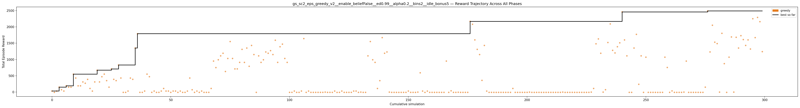

---

## 17. gs_sc2_eps_greedy_v2__enable_beliefTrue__ed0.99__alpha0.05__bins3__idle_bonus5

**Best reward: +2471.6** | **Best progress: 0.0000** | **Finish rate: 0.0%**

| Param | Value |
|---|---|
| `enable_belief` | True |
| `epsilon_decay` | 0.99 |
| `alpha` | 0.05 |
| `n_bins` | 3 |
| `idle_bonus` | 5.0 |

| Stat | Value |
|---|---|
| Best track progress | 0.0000 |
| Finish rate | 0.0% |
| Best finish time | — |
| Greedy improvements | 17 |
| First improvement (sim) | 1 |
| Accel % of best run | 93.2% |
| Greedy runtime | 9m 22.7s |

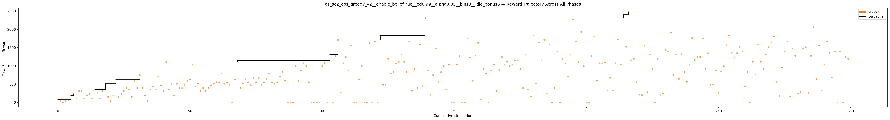

---

## 18. gs_sc2_eps_greedy_v2__enable_beliefTrue__ed0.995__alpha0.2__bins2__idle_bonus5

**Best reward: +2271.2** | **Best progress: 0.0000** | **Finish rate: 0.0%**

| Param | Value |
|---|---|
| `enable_belief` | True |
| `epsilon_decay` | 0.995 |
| `alpha` | 0.2 |
| `n_bins` | 2 |
| `idle_bonus` | 5.0 |

| Stat | Value |
|---|---|
| Best track progress | 0.0000 |
| Finish rate | 0.0% |
| Best finish time | — |
| Greedy improvements | 22 |
| First improvement (sim) | 1 |
| Accel % of best run | 79.2% |
| Greedy runtime | 8m 56.6s |

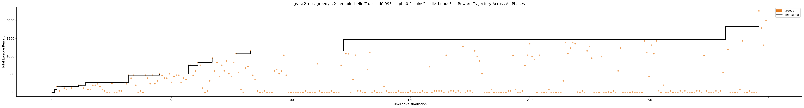

---

## 19. gs_sc2_eps_greedy_v2__enable_beliefFalse__ed0.995__alpha0.05__bins3__idle_bonus5

**Best reward: +2169.9** | **Best progress: 0.0000** | **Finish rate: 0.0%**

| Param | Value |
|---|---|
| `enable_belief` | False |
| `epsilon_decay` | 0.995 |
| `alpha` | 0.05 |
| `n_bins` | 3 |
| `idle_bonus` | 5.0 |

| Stat | Value |
|---|---|
| Best track progress | 0.0000 |
| Finish rate | 0.0% |
| Best finish time | — |
| Greedy improvements | 24 |
| First improvement (sim) | 1 |
| Accel % of best run | 81.7% |
| Greedy runtime | 7m 44.7s |

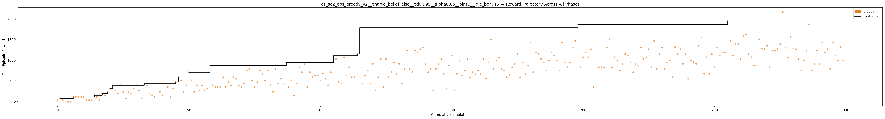

---

## 20. gs_sc2_eps_greedy_v2__enable_beliefTrue__ed0.995__alpha0.05__bins3__idle_bonus5

**Best reward: +2071.4** | **Best progress: 0.0000** | **Finish rate: 0.0%**

| Param | Value |
|---|---|
| `enable_belief` | True |
| `epsilon_decay` | 0.995 |
| `alpha` | 0.05 |
| `n_bins` | 3 |
| `idle_bonus` | 5.0 |

| Stat | Value |
|---|---|
| Best track progress | 0.0000 |
| Finish rate | 0.0% |
| Best finish time | — |
| Greedy improvements | 21 |
| First improvement (sim) | 1 |
| Accel % of best run | 86.6% |
| Greedy runtime | 7m 14.1s |

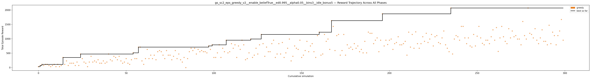

---

## 21. gs_sc2_eps_greedy_v2__enable_beliefTrue__ed0.99__alpha0.2__bins4__idle_bonus5

**Best reward: +2000.5** | **Best progress: 0.0000** | **Finish rate: 0.0%**

| Param | Value |
|---|---|
| `enable_belief` | True |
| `epsilon_decay` | 0.99 |
| `alpha` | 0.2 |
| `n_bins` | 4 |
| `idle_bonus` | 5.0 |

| Stat | Value |
|---|---|
| Best track progress | 0.0000 |
| Finish rate | 0.0% |
| Best finish time | — |
| Greedy improvements | 17 |
| First improvement (sim) | 1 |
| Accel % of best run | 79.8% |
| Greedy runtime | 9m 24.5s |

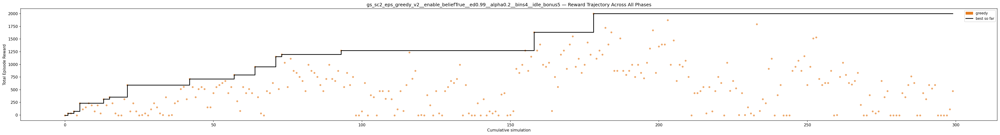

---

## 22. gs_sc2_eps_greedy_v2__enable_beliefFalse__ed0.995__alpha0.05__bins2__idle_bonus5

**Best reward: +1990.2** | **Best progress: 0.0000** | **Finish rate: 0.0%**

| Param | Value |
|---|---|
| `enable_belief` | False |
| `epsilon_decay` | 0.995 |
| `alpha` | 0.05 |
| `n_bins` | 2 |
| `idle_bonus` | 5.0 |

| Stat | Value |
|---|---|
| Best track progress | 0.0000 |
| Finish rate | 0.0% |
| Best finish time | — |
| Greedy improvements | 27 |
| First improvement (sim) | 1 |
| Accel % of best run | 89.1% |
| Greedy runtime | 7m 48.4s |

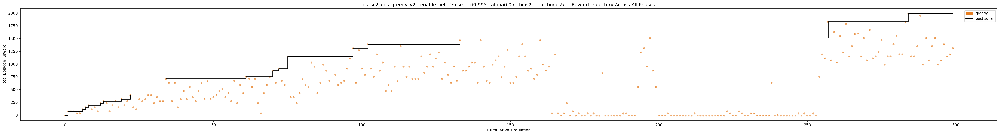

---

## 23. gs_sc2_eps_greedy_v2__enable_beliefTrue__ed0.995__alpha0.2__bins4__idle_bonus5

**Best reward: +1951.6** | **Best progress: 0.0000** | **Finish rate: 0.0%**

| Param | Value |
|---|---|
| `enable_belief` | True |
| `epsilon_decay` | 0.995 |
| `alpha` | 0.2 |
| `n_bins` | 4 |
| `idle_bonus` | 5.0 |

| Stat | Value |
|---|---|
| Best track progress | 0.0000 |
| Finish rate | 0.0% |
| Best finish time | — |
| Greedy improvements | 17 |
| First improvement (sim) | 1 |
| Accel % of best run | 89.5% |
| Greedy runtime | 8m 52.4s |

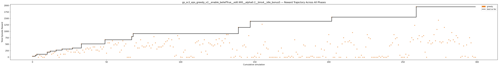

---

## 24. gs_sc2_eps_greedy_v2__enable_beliefTrue__ed0.995__alpha0.2__bins3__idle_bonus5

**Best reward: +1951.3** | **Best progress: 0.0000** | **Finish rate: 0.0%**

| Param | Value |
|---|---|
| `enable_belief` | True |
| `epsilon_decay` | 0.995 |
| `alpha` | 0.2 |
| `n_bins` | 3 |
| `idle_bonus` | 5.0 |

| Stat | Value |
|---|---|
| Best track progress | 0.0000 |
| Finish rate | 0.0% |
| Best finish time | — |
| Greedy improvements | 19 |
| First improvement (sim) | 1 |
| Accel % of best run | 82.3% |
| Greedy runtime | 9m 26.8s |

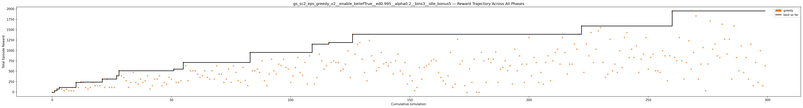

---

## 25. gs_sc2_eps_greedy_v2__enable_beliefFalse__ed0.995__alpha0.1__bins3__idle_bonus5

**Best reward: +1830.1** | **Best progress: 0.0000** | **Finish rate: 0.0%**

| Param | Value |
|---|---|
| `enable_belief` | False |
| `epsilon_decay` | 0.995 |
| `alpha` | 0.1 |
| `n_bins` | 3 |
| `idle_bonus` | 5.0 |

| Stat | Value |
|---|---|
| Best track progress | 0.0000 |
| Finish rate | 0.0% |
| Best finish time | — |
| Greedy improvements | 22 |
| First improvement (sim) | 1 |
| Accel % of best run | 81.3% |
| Greedy runtime | 8m 02.7s |

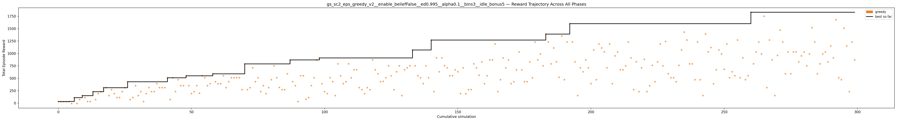

---

## 26. gs_sc2_eps_greedy_v2__enable_beliefTrue__ed0.995__alpha0.05__bins4__idle_bonus5

**Best reward: +1800.5** | **Best progress: 0.0000** | **Finish rate: 0.0%**

| Param | Value |
|---|---|
| `enable_belief` | True |
| `epsilon_decay` | 0.995 |
| `alpha` | 0.05 |
| `n_bins` | 4 |
| `idle_bonus` | 5.0 |

| Stat | Value |
|---|---|
| Best track progress | 0.0000 |
| Finish rate | 0.0% |
| Best finish time | — |
| Greedy improvements | 25 |
| First improvement (sim) | 1 |
| Accel % of best run | 65.6% |
| Greedy runtime | 9m 58.1s |

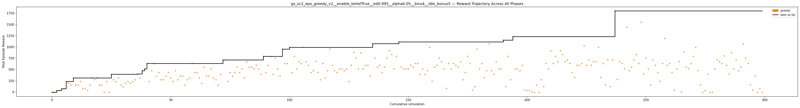

---

## 27. gs_sc2_eps_greedy_v2__enable_beliefTrue__ed0.995__alpha0.1__bins2__idle_bonus5

**Best reward: +1791.1** | **Best progress: 0.0000** | **Finish rate: 0.0%**

| Param | Value |
|---|---|
| `enable_belief` | True |
| `epsilon_decay` | 0.995 |
| `alpha` | 0.1 |
| `n_bins` | 2 |
| `idle_bonus` | 5.0 |

| Stat | Value |
|---|---|
| Best track progress | 0.0000 |
| Finish rate | 0.0% |
| Best finish time | — |
| Greedy improvements | 21 |
| First improvement (sim) | 1 |
| Accel % of best run | 86.0% |
| Greedy runtime | 8m 57.7s |

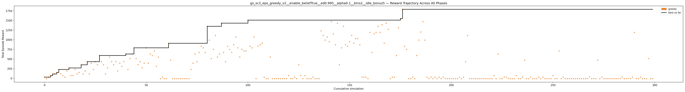

---

## 28. gs_sc2_eps_greedy_v2__enable_beliefFalse__ed0.995__alpha0.2__bins3__idle_bonus5

**Best reward: +1789.5** | **Best progress: 0.0000** | **Finish rate: 0.0%**

| Param | Value |
|---|---|
| `enable_belief` | False |
| `epsilon_decay` | 0.995 |
| `alpha` | 0.2 |
| `n_bins` | 3 |
| `idle_bonus` | 5.0 |

| Stat | Value |
|---|---|
| Best track progress | 0.0000 |
| Finish rate | 0.0% |
| Best finish time | — |
| Greedy improvements | 21 |
| First improvement (sim) | 1 |
| Accel % of best run | 81.0% |
| Greedy runtime | 7m 58.0s |

---

## 29. gs_sc2_eps_greedy_v2__enable_beliefTrue__ed0.995__alpha0.05__bins2__idle_bonus5

**Best reward: +1750.8** | **Best progress: 0.0000** | **Finish rate: 0.0%**

| Param | Value |
|---|---|
| `enable_belief` | True |
| `epsilon_decay` | 0.995 |
| `alpha` | 0.05 |
| `n_bins` | 2 |
| `idle_bonus` | 5.0 |

| Stat | Value |
|---|---|
| Best track progress | 0.0000 |
| Finish rate | 0.0% |
| Best finish time | — |
| Greedy improvements | 17 |
| First improvement (sim) | 1 |
| Accel % of best run | 85.0% |
| Greedy runtime | 8m 27.6s |

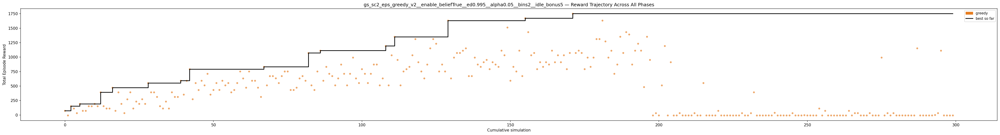

---

## 30. gs_sc2_eps_greedy_v2__enable_beliefFalse__ed0.995__alpha0.2__bins2__idle_bonus5

**Best reward: +1750.3** | **Best progress: 0.0000** | **Finish rate: 0.0%**

| Param | Value |
|---|---|
| `enable_belief` | False |
| `epsilon_decay` | 0.995 |
| `alpha` | 0.2 |
| `n_bins` | 2 |
| `idle_bonus` | 5.0 |

| Stat | Value |
|---|---|
| Best track progress | 0.0000 |
| Finish rate | 0.0% |
| Best finish time | — |
| Greedy improvements | 21 |
| First improvement (sim) | 1 |
| Accel % of best run | 91.6% |
| Greedy runtime | 8m 50.3s |

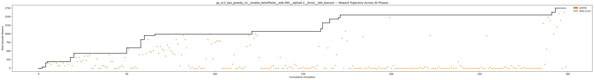

---

## 31. gs_sc2_eps_greedy_v2__enable_beliefTrue__ed0.995__alpha0.1__bins3__idle_bonus5

**Best reward: +1711.1** | **Best progress: 0.0000** | **Finish rate: 0.0%**

| Param | Value |
|---|---|
| `enable_belief` | True |
| `epsilon_decay` | 0.995 |
| `alpha` | 0.1 |
| `n_bins` | 3 |
| `idle_bonus` | 5.0 |

| Stat | Value |
|---|---|
| Best track progress | 0.0000 |
| Finish rate | 0.0% |
| Best finish time | — |
| Greedy improvements | 17 |
| First improvement (sim) | 1 |
| Accel % of best run | 68.7% |
| Greedy runtime | 8m 13.4s |

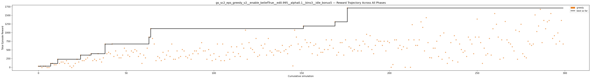

---

## 32. gs_sc2_eps_greedy_v2__enable_beliefTrue__ed0.995__alpha0.1__bins4__idle_bonus5

**Best reward: +1710.4** | **Best progress: 0.0000** | **Finish rate: 0.0%**

| Param | Value |
|---|---|
| `enable_belief` | True |
| `epsilon_decay` | 0.995 |
| `alpha` | 0.1 |
| `n_bins` | 4 |
| `idle_bonus` | 5.0 |

| Stat | Value |
|---|---|
| Best track progress | 0.0000 |
| Finish rate | 0.0% |
| Best finish time | — |
| Greedy improvements | 13 |
| First improvement (sim) | 1 |
| Accel % of best run | 82.2% |
| Greedy runtime | 9m 59.1s |

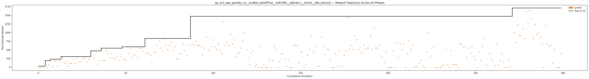

---

## 33. gs_sc2_eps_greedy_v2__enable_beliefFalse__ed0.995__alpha0.1__bins2__idle_bonus5

**Best reward: +1470.5** | **Best progress: 0.0000** | **Finish rate: 0.0%**

| Param | Value |
|---|---|
| `enable_belief` | False |
| `epsilon_decay` | 0.995 |
| `alpha` | 0.1 |
| `n_bins` | 2 |
| `idle_bonus` | 5.0 |

| Stat | Value |
|---|---|
| Best track progress | 0.0000 |
| Finish rate | 0.0% |
| Best finish time | — |
| Greedy improvements | 12 |
| First improvement (sim) | 1 |
| Accel % of best run | 82.5% |
| Greedy runtime | 8m 16.1s |

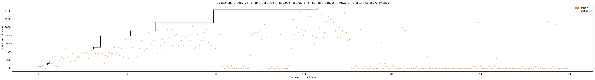

---

## 34. gs_sc2_eps_greedy_v2__enable_beliefFalse__ed0.995__alpha0.1__bins4__idle_bonus5

**Best reward: +1395.1** | **Best progress: 0.0000** | **Finish rate: 0.0%**

| Param | Value |
|---|---|
| `enable_belief` | False |
| `epsilon_decay` | 0.995 |
| `alpha` | 0.1 |
| `n_bins` | 4 |
| `idle_bonus` | 5.0 |

| Stat | Value |
|---|---|
| Best track progress | 0.0000 |
| Finish rate | 0.0% |
| Best finish time | — |
| Greedy improvements | 11 |
| First improvement (sim) | 1 |
| Accel % of best run | 56.7% |
| Greedy runtime | 8m 59.9s |

---

## 35. gs_sc2_eps_greedy_v2__enable_beliefFalse__ed0.995__alpha0.2__bins4__idle_bonus5

**Best reward: +1229.7** | **Best progress: 0.0000** | **Finish rate: 0.0%**

| Param | Value |
|---|---|
| `enable_belief` | False |
| `epsilon_decay` | 0.995 |
| `alpha` | 0.2 |
| `n_bins` | 4 |
| `idle_bonus` | 5.0 |

| Stat | Value |
|---|---|
| Best track progress | 0.0000 |
| Finish rate | 0.0% |
| Best finish time | — |
| Greedy improvements | 19 |
| First improvement (sim) | 1 |
| Accel % of best run | 60.4% |
| Greedy runtime | 8m 29.1s |

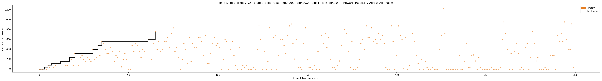

---

## 36. gs_sc2_eps_greedy_v2__enable_beliefFalse__ed0.99__alpha0.1__bins2__idle_bonus1

**Best reward: +1097.3** | **Best progress: 0.0000** | **Finish rate: 0.0%**

| Param | Value |
|---|---|
| `enable_belief` | False |
| `epsilon_decay` | 0.99 |
| `alpha` | 0.1 |
| `n_bins` | 2 |
| `idle_bonus` | 1.0 |

| Stat | Value |
|---|---|
| Best track progress | 0.0000 |
| Finish rate | 0.0% |
| Best finish time | — |
| Greedy improvements | 22 |
| First improvement (sim) | 1 |
| Accel % of best run | 96.8% |
| Greedy runtime | 8m 35.2s |

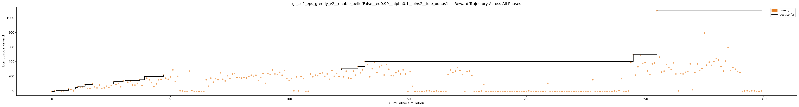

---

## 37. gs_sc2_eps_greedy_v2__enable_beliefFalse__ed0.995__alpha0.05__bins4__idle_bonus5

**Best reward: +1069.2** | **Best progress: 0.0000** | **Finish rate: 0.0%**

| Param | Value |
|---|---|
| `enable_belief` | False |
| `epsilon_decay` | 0.995 |
| `alpha` | 0.05 |
| `n_bins` | 4 |
| `idle_bonus` | 5.0 |

| Stat | Value |
|---|---|
| Best track progress | 0.0000 |
| Finish rate | 0.0% |
| Best finish time | — |
| Greedy improvements | 13 |
| First improvement (sim) | 1 |
| Accel % of best run | 81.7% |
| Greedy runtime | 8m 51.2s |

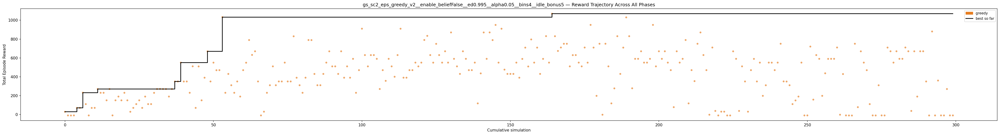

---

## 38. gs_sc2_eps_greedy_v2__enable_beliefTrue__ed0.99__alpha0.2__bins3__idle_bonus1

**Best reward: +1028.5** | **Best progress: 0.0000** | **Finish rate: 0.0%**

| Param | Value |
|---|---|
| `enable_belief` | True |
| `epsilon_decay` | 0.99 |
| `alpha` | 0.2 |
| `n_bins` | 3 |
| `idle_bonus` | 1.0 |

| Stat | Value |
|---|---|
| Best track progress | 0.0000 |
| Finish rate | 0.0% |
| Best finish time | — |
| Greedy improvements | 21 |
| First improvement (sim) | 1 |
| Accel % of best run | 93.4% |
| Greedy runtime | 8m 57.2s |

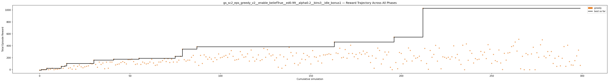

---

## 39. gs_sc2_eps_greedy_v2__enable_beliefTrue__ed0.99__alpha0.05__bins4__idle_bonus1

**Best reward: +948.3** | **Best progress: 0.0000** | **Finish rate: 0.0%**

| Param | Value |
|---|---|
| `enable_belief` | True |
| `epsilon_decay` | 0.99 |
| `alpha` | 0.05 |
| `n_bins` | 4 |
| `idle_bonus` | 1.0 |

| Stat | Value |
|---|---|
| Best track progress | 0.0000 |
| Finish rate | 0.0% |
| Best finish time | — |
| Greedy improvements | 23 |
| First improvement (sim) | 1 |
| Accel % of best run | 98.3% |
| Greedy runtime | 7m 57.2s |

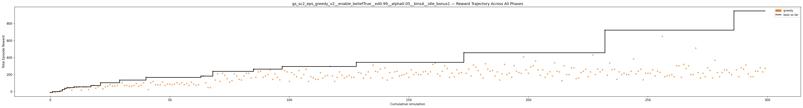

---

## 40. gs_sc2_eps_greedy_v2__enable_beliefFalse__ed0.99__alpha0.05__bins2__idle_bonus1

**Best reward: +937.1** | **Best progress: 0.0000** | **Finish rate: 0.0%**

| Param | Value |
|---|---|
| `enable_belief` | False |
| `epsilon_decay` | 0.99 |
| `alpha` | 0.05 |
| `n_bins` | 2 |
| `idle_bonus` | 1.0 |

| Stat | Value |
|---|---|
| Best track progress | 0.0000 |
| Finish rate | 0.0% |
| Best finish time | — |
| Greedy improvements | 20 |
| First improvement (sim) | 1 |
| Accel % of best run | 96.2% |
| Greedy runtime | 6m 39.2s |

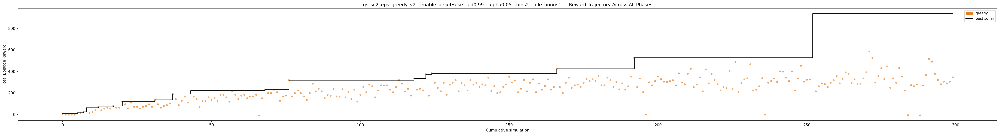

---

## 41. gs_sc2_eps_greedy_v2__enable_beliefFalse__ed0.99__alpha0.2__bins3__idle_bonus1

**Best reward: +883.1** | **Best progress: 0.0000** | **Finish rate: 0.0%**

| Param | Value |
|---|---|
| `enable_belief` | False |
| `epsilon_decay` | 0.99 |
| `alpha` | 0.2 |
| `n_bins` | 3 |
| `idle_bonus` | 1.0 |

| Stat | Value |
|---|---|
| Best track progress | 0.0000 |
| Finish rate | 0.0% |
| Best finish time | — |
| Greedy improvements | 21 |
| First improvement (sim) | 1 |
| Accel % of best run | 92.9% |
| Greedy runtime | 8m 40.1s |

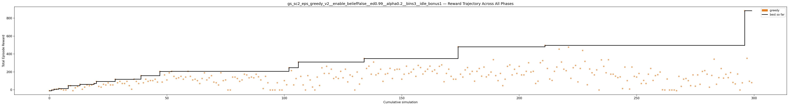

---

## 42. gs_sc2_eps_greedy_v2__enable_beliefFalse__ed0.99__alpha0.05__bins4__idle_bonus1

**Best reward: +856.1** | **Best progress: 0.0000** | **Finish rate: 0.0%**

| Param | Value |
|---|---|
| `enable_belief` | False |
| `epsilon_decay` | 0.99 |
| `alpha` | 0.05 |
| `n_bins` | 4 |
| `idle_bonus` | 1.0 |

| Stat | Value |
|---|---|
| Best track progress | 0.0000 |
| Finish rate | 0.0% |
| Best finish time | — |
| Greedy improvements | 21 |
| First improvement (sim) | 1 |
| Accel % of best run | 94.5% |
| Greedy runtime | 7m 36.4s |

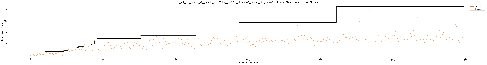

---

## 43. gs_sc2_eps_greedy_v2__enable_beliefTrue__ed0.99__alpha0.2__bins2__idle_bonus1

**Best reward: +825.1** | **Best progress: 0.0000** | **Finish rate: 0.0%**

| Param | Value |
|---|---|
| `enable_belief` | True |
| `epsilon_decay` | 0.99 |
| `alpha` | 0.2 |
| `n_bins` | 2 |
| `idle_bonus` | 1.0 |

| Stat | Value |
|---|---|
| Best track progress | 0.0000 |
| Finish rate | 0.0% |
| Best finish time | — |
| Greedy improvements | 23 |
| First improvement (sim) | 1 |
| Accel % of best run | 98.6% |
| Greedy runtime | 7m 59.8s |

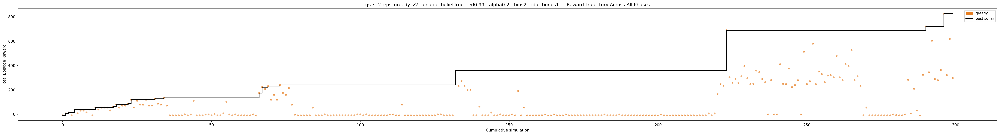

---

## 44. gs_sc2_eps_greedy_v2__enable_beliefFalse__ed0.99__alpha0.1__bins3__idle_bonus1

**Best reward: +797.7** | **Best progress: 0.0000** | **Finish rate: 0.0%**

| Param | Value |
|---|---|
| `enable_belief` | False |
| `epsilon_decay` | 0.99 |
| `alpha` | 0.1 |
| `n_bins` | 3 |
| `idle_bonus` | 1.0 |

| Stat | Value |
|---|---|
| Best track progress | 0.0000 |
| Finish rate | 0.0% |
| Best finish time | — |
| Greedy improvements | 17 |
| First improvement (sim) | 1 |
| Accel % of best run | 96.3% |
| Greedy runtime | 11m 16.2s |

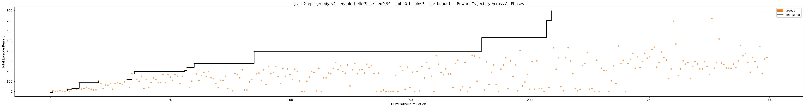

---

## 45. gs_sc2_eps_greedy_v2__enable_beliefTrue__ed0.99__alpha0.1__bins4__idle_bonus1

**Best reward: +791.3** | **Best progress: 0.0000** | **Finish rate: 0.0%**

| Param | Value |
|---|---|
| `enable_belief` | True |
| `epsilon_decay` | 0.99 |
| `alpha` | 0.1 |
| `n_bins` | 4 |
| `idle_bonus` | 1.0 |

| Stat | Value |
|---|---|
| Best track progress | 0.0000 |
| Finish rate | 0.0% |
| Best finish time | — |
| Greedy improvements | 19 |
| First improvement (sim) | 1 |
| Accel % of best run | 52.1% |
| Greedy runtime | 10m 16.3s |

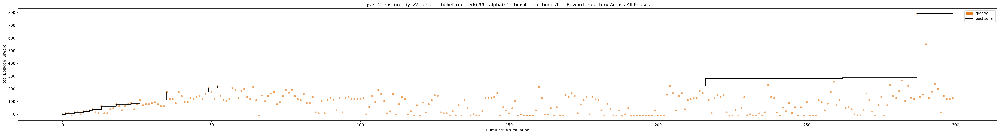

---

## 46. gs_sc2_eps_greedy_v2__enable_beliefTrue__ed0.99__alpha0.05__bins3__idle_bonus1

**Best reward: +731.2** | **Best progress: 0.0000** | **Finish rate: 0.0%**

| Param | Value |
|---|---|
| `enable_belief` | True |
| `epsilon_decay` | 0.99 |
| `alpha` | 0.05 |
| `n_bins` | 3 |
| `idle_bonus` | 1.0 |

| Stat | Value |
|---|---|
| Best track progress | 0.0000 |
| Finish rate | 0.0% |
| Best finish time | — |
| Greedy improvements | 23 |
| First improvement (sim) | 1 |
| Accel % of best run | 87.6% |
| Greedy runtime | 7m 60.0s |

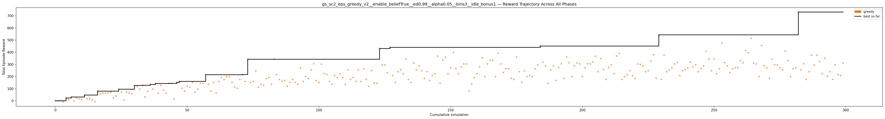

---

## 47. gs_sc2_eps_greedy_v2__enable_beliefTrue__ed0.99__alpha0.1__bins3__idle_bonus1

**Best reward: +675.3** | **Best progress: 0.0000** | **Finish rate: 0.0%**

| Param | Value |
|---|---|
| `enable_belief` | True |
| `epsilon_decay` | 0.99 |
| `alpha` | 0.1 |
| `n_bins` | 3 |
| `idle_bonus` | 1.0 |

| Stat | Value |
|---|---|
| Best track progress | 0.0000 |
| Finish rate | 0.0% |
| Best finish time | — |
| Greedy improvements | 17 |
| First improvement (sim) | 1 |
| Accel % of best run | 96.7% |
| Greedy runtime | 8m 50.8s |

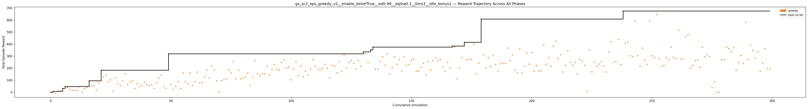

---

## 48. gs_sc2_eps_greedy_v2__enable_beliefFalse__ed0.99__alpha0.05__bins3__idle_bonus1

**Best reward: +659.5** | **Best progress: 0.0000** | **Finish rate: 0.0%**

| Param | Value |
|---|---|
| `enable_belief` | False |
| `epsilon_decay` | 0.99 |
| `alpha` | 0.05 |
| `n_bins` | 3 |
| `idle_bonus` | 1.0 |

| Stat | Value |
|---|---|
| Best track progress | 0.0000 |
| Finish rate | 0.0% |
| Best finish time | — |
| Greedy improvements | 17 |
| First improvement (sim) | 1 |
| Accel % of best run | 94.0% |
| Greedy runtime | 8m 14.4s |

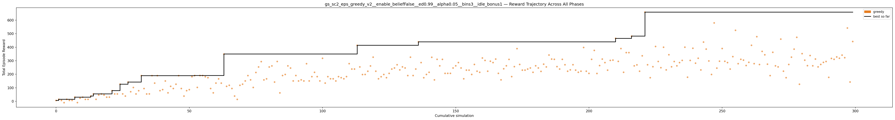

---

## 49. gs_sc2_eps_greedy_v2__enable_beliefTrue__ed0.995__alpha0.1__bins4__idle_bonus1

**Best reward: +638.5** | **Best progress: 0.0000** | **Finish rate: 0.0%**

| Param | Value |
|---|---|
| `enable_belief` | True |
| `epsilon_decay` | 0.995 |
| `alpha` | 0.1 |
| `n_bins` | 4 |
| `idle_bonus` | 1.0 |

| Stat | Value |
|---|---|
| Best track progress | 0.0000 |
| Finish rate | 0.0% |
| Best finish time | — |
| Greedy improvements | 18 |
| First improvement (sim) | 1 |
| Accel % of best run | 60.7% |
| Greedy runtime | 8m 21.9s |

---

## 50. gs_sc2_eps_greedy_v2__enable_beliefTrue__ed0.99__alpha0.1__bins2__idle_bonus1

**Best reward: +585.0** | **Best progress: 0.0000** | **Finish rate: 0.0%**

| Param | Value |
|---|---|
| `enable_belief` | True |
| `epsilon_decay` | 0.99 |
| `alpha` | 0.1 |
| `n_bins` | 2 |
| `idle_bonus` | 1.0 |

| Stat | Value |
|---|---|
| Best track progress | 0.0000 |
| Finish rate | 0.0% |
| Best finish time | — |
| Greedy improvements | 21 |
| First improvement (sim) | 1 |
| Accel % of best run | 98.0% |
| Greedy runtime | 8m 31.9s |

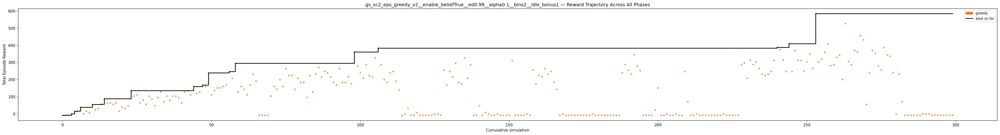

---

## 51. gs_sc2_eps_greedy_v2__enable_beliefTrue__ed0.995__alpha0.05__bins3__idle_bonus1

**Best reward: +576.8** | **Best progress: 0.0000** | **Finish rate: 0.0%**

| Param | Value |
|---|---|
| `enable_belief` | True |
| `epsilon_decay` | 0.995 |
| `alpha` | 0.05 |
| `n_bins` | 3 |
| `idle_bonus` | 1.0 |

| Stat | Value |
|---|---|
| Best track progress | 0.0000 |
| Finish rate | 0.0% |
| Best finish time | — |
| Greedy improvements | 20 |
| First improvement (sim) | 1 |
| Accel % of best run | 84.5% |
| Greedy runtime | 7m 47.5s |

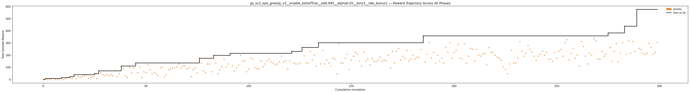

---

## 52. gs_sc2_eps_greedy_v2__enable_beliefTrue__ed0.99__alpha0.05__bins2__idle_bonus1

**Best reward: +564.8** | **Best progress: 0.0000** | **Finish rate: 0.0%**

| Param | Value |
|---|---|
| `enable_belief` | True |
| `epsilon_decay` | 0.99 |
| `alpha` | 0.05 |
| `n_bins` | 2 |
| `idle_bonus` | 1.0 |

| Stat | Value |
|---|---|
| Best track progress | 0.0000 |
| Finish rate | 0.0% |
| Best finish time | — |
| Greedy improvements | 13 |
| First improvement (sim) | 1 |
| Accel % of best run | 95.3% |
| Greedy runtime | 8m 48.8s |

---

## 53. gs_sc2_eps_greedy_v2__enable_beliefFalse__ed0.99__alpha0.2__bins2__idle_bonus1

**Best reward: +535.7** | **Best progress: 0.0000** | **Finish rate: 0.0%**

| Param | Value |
|---|---|
| `enable_belief` | False |
| `epsilon_decay` | 0.99 |
| `alpha` | 0.2 |
| `n_bins` | 2 |
| `idle_bonus` | 1.0 |

| Stat | Value |
|---|---|
| Best track progress | 0.0000 |
| Finish rate | 0.0% |
| Best finish time | — |
| Greedy improvements | 16 |
| First improvement (sim) | 1 |
| Accel % of best run | 91.2% |
| Greedy runtime | 7m 52.0s |

---

## 54. gs_sc2_eps_greedy_v2__enable_beliefTrue__ed0.995__alpha0.05__bins2__idle_bonus1

**Best reward: +518.9** | **Best progress: 0.0000** | **Finish rate: 0.0%**

| Param | Value |
|---|---|
| `enable_belief` | True |
| `epsilon_decay` | 0.995 |
| `alpha` | 0.05 |
| `n_bins` | 2 |
| `idle_bonus` | 1.0 |

| Stat | Value |
|---|---|
| Best track progress | 0.0000 |
| Finish rate | 0.0% |
| Best finish time | — |
| Greedy improvements | 17 |
| First improvement (sim) | 1 |
| Accel % of best run | 79.5% |
| Greedy runtime | 8m 49.3s |

---

## 55. gs_sc2_eps_greedy_v2__enable_beliefTrue__ed0.99__alpha0.2__bins4__idle_bonus1

**Best reward: +505.5** | **Best progress: 0.0000** | **Finish rate: 0.0%**

| Param | Value |
|---|---|
| `enable_belief` | True |
| `epsilon_decay` | 0.99 |
| `alpha` | 0.2 |
| `n_bins` | 4 |
| `idle_bonus` | 1.0 |

| Stat | Value |
|---|---|
| Best track progress | 0.0000 |
| Finish rate | 0.0% |
| Best finish time | — |
| Greedy improvements | 22 |
| First improvement (sim) | 1 |
| Accel % of best run | 96.6% |
| Greedy runtime | 10m 33.2s |

---

## 56. gs_sc2_eps_greedy_v2__enable_beliefFalse__ed0.99__alpha0.05__bins3__idle_bonus0.5

**Best reward: +493.1** | **Best progress: 0.0000** | **Finish rate: 0.0%**

| Param | Value |
|---|---|
| `enable_belief` | False |
| `epsilon_decay` | 0.99 |
| `alpha` | 0.05 |
| `n_bins` | 3 |
| `idle_bonus` | 0.5 |

| Stat | Value |
|---|---|
| Best track progress | 0.0000 |
| Finish rate | 0.0% |
| Best finish time | — |
| Greedy improvements | 19 |
| First improvement (sim) | 1 |
| Accel % of best run | 94.1% |
| Greedy runtime | 10m 34.9s |

---

## 57. gs_sc2_eps_greedy_v2__enable_beliefFalse__ed0.99__alpha0.1__bins4__idle_bonus1

**Best reward: +488.1** | **Best progress: 0.0000** | **Finish rate: 0.0%**

| Param | Value |
|---|---|
| `enable_belief` | False |
| `epsilon_decay` | 0.99 |
| `alpha` | 0.1 |
| `n_bins` | 4 |
| `idle_bonus` | 1.0 |

| Stat | Value |
|---|---|
| Best track progress | 0.0000 |
| Finish rate | 0.0% |
| Best finish time | — |
| Greedy improvements | 15 |
| First improvement (sim) | 1 |
| Accel % of best run | 98.2% |
| Greedy runtime | 7m 58.7s |

---

## 58. gs_sc2_eps_greedy_v2__enable_beliefFalse__ed0.995__alpha0.2__bins2__idle_bonus1

**Best reward: +485.5** | **Best progress: 0.0000** | **Finish rate: 0.0%**

| Param | Value |
|---|---|
| `enable_belief` | False |
| `epsilon_decay` | 0.995 |
| `alpha` | 0.2 |
| `n_bins` | 2 |
| `idle_bonus` | 1.0 |

| Stat | Value |
|---|---|
| Best track progress | 0.0000 |
| Finish rate | 0.0% |
| Best finish time | — |
| Greedy improvements | 11 |
| First improvement (sim) | 1 |
| Accel % of best run | 81.2% |
| Greedy runtime | 8m 38.0s |

---

## 59. gs_sc2_eps_greedy_v2__enable_beliefFalse__ed0.99__alpha0.2__bins4__idle_bonus1

**Best reward: +485.2** | **Best progress: 0.0000** | **Finish rate: 0.0%**

| Param | Value |
|---|---|
| `enable_belief` | False |
| `epsilon_decay` | 0.99 |
| `alpha` | 0.2 |
| `n_bins` | 4 |
| `idle_bonus` | 1.0 |

| Stat | Value |
|---|---|
| Best track progress | 0.0000 |
| Finish rate | 0.0% |
| Best finish time | — |
| Greedy improvements | 13 |
| First improvement (sim) | 1 |
| Accel % of best run | 92.3% |
| Greedy runtime | 9m 08.4s |

---

## 60. gs_sc2_eps_greedy_v2__enable_beliefTrue__ed0.99__alpha0.05__bins2__idle_bonus0.5

**Best reward: +471.3** | **Best progress: 0.0000** | **Finish rate: 0.0%**

| Param | Value |
|---|---|
| `enable_belief` | True |
| `epsilon_decay` | 0.99 |
| `alpha` | 0.05 |
| `n_bins` | 2 |
| `idle_bonus` | 0.5 |

| Stat | Value |
|---|---|
| Best track progress | 0.0000 |
| Finish rate | 0.0% |
| Best finish time | — |
| Greedy improvements | 19 |
| First improvement (sim) | 1 |
| Accel % of best run | 91.2% |
| Greedy runtime | 6m 51.3s |

---

## 61. gs_sc2_eps_greedy_v2__enable_beliefFalse__ed0.99__alpha0.05__bins2__idle_bonus0.5

**Best reward: +465.6** | **Best progress: 0.0000** | **Finish rate: 0.0%**

| Param | Value |
|---|---|
| `enable_belief` | False |
| `epsilon_decay` | 0.99 |
| `alpha` | 0.05 |
| `n_bins` | 2 |
| `idle_bonus` | 0.5 |

| Stat | Value |
|---|---|
| Best track progress | 0.0000 |
| Finish rate | 0.0% |
| Best finish time | — |
| Greedy improvements | 26 |
| First improvement (sim) | 1 |
| Accel % of best run | 96.6% |
| Greedy runtime | 6m 23.3s |

---

## 62. gs_sc2_eps_greedy_v2__enable_beliefTrue__ed0.99__alpha0.1__bins3__idle_bonus0.5

**Best reward: +459.0** | **Best progress: 0.0000** | **Finish rate: 0.0%**

| Param | Value |
|---|---|
| `enable_belief` | True |
| `epsilon_decay` | 0.99 |
| `alpha` | 0.1 |
| `n_bins` | 3 |
| `idle_bonus` | 0.5 |

| Stat | Value |
|---|---|
| Best track progress | 0.0000 |
| Finish rate | 0.0% |
| Best finish time | — |
| Greedy improvements | 13 |
| First improvement (sim) | 1 |
| Accel % of best run | 81.5% |
| Greedy runtime | 8m 58.8s |

---

## 63. gs_sc2_eps_greedy_v2__enable_beliefTrue__ed0.995__alpha0.1__bins3__idle_bonus1

**Best reward: +439.2** | **Best progress: 0.0000** | **Finish rate: 0.0%**

| Param | Value |
|---|---|
| `enable_belief` | True |
| `epsilon_decay` | 0.995 |
| `alpha` | 0.1 |
| `n_bins` | 3 |
| `idle_bonus` | 1.0 |

| Stat | Value |
|---|---|
| Best track progress | 0.0000 |
| Finish rate | 0.0% |
| Best finish time | — |
| Greedy improvements | 19 |
| First improvement (sim) | 1 |
| Accel % of best run | 80.3% |
| Greedy runtime | 8m 29.9s |

---

## 64. gs_sc2_eps_greedy_v2__enable_beliefTrue__ed0.995__alpha0.05__bins4__idle_bonus1

**Best reward: +407.0** | **Best progress: 0.0000** | **Finish rate: 0.0%**

| Param | Value |
|---|---|
| `enable_belief` | True |
| `epsilon_decay` | 0.995 |
| `alpha` | 0.05 |
| `n_bins` | 4 |
| `idle_bonus` | 1.0 |

| Stat | Value |
|---|---|
| Best track progress | 0.0000 |
| Finish rate | 0.0% |
| Best finish time | — |
| Greedy improvements | 13 |
| First improvement (sim) | 1 |
| Accel % of best run | 57.8% |
| Greedy runtime | 8m 20.6s |

---

## 65. gs_sc2_eps_greedy_v2__enable_beliefFalse__ed0.995__alpha0.1__bins3__idle_bonus1

**Best reward: +405.9** | **Best progress: 0.0000** | **Finish rate: 0.0%**

| Param | Value |
|---|---|
| `enable_belief` | False |
| `epsilon_decay` | 0.995 |
| `alpha` | 0.1 |
| `n_bins` | 3 |
| `idle_bonus` | 1.0 |

| Stat | Value |
|---|---|
| Best track progress | 0.0000 |
| Finish rate | 0.0% |
| Best finish time | — |
| Greedy improvements | 18 |
| First improvement (sim) | 1 |
| Accel % of best run | 62.4% |
| Greedy runtime | 8m 02.9s |

---

## 66. gs_sc2_eps_greedy_v2__enable_beliefFalse__ed0.995__alpha0.2__bins3__idle_bonus1

**Best reward: +405.4** | **Best progress: 0.0000** | **Finish rate: 0.0%**

| Param | Value |
|---|---|
| `enable_belief` | False |
| `epsilon_decay` | 0.995 |
| `alpha` | 0.2 |
| `n_bins` | 3 |
| `idle_bonus` | 1.0 |

| Stat | Value |
|---|---|
| Best track progress | 0.0000 |
| Finish rate | 0.0% |
| Best finish time | — |
| Greedy improvements | 14 |
| First improvement (sim) | 1 |
| Accel % of best run | 80.1% |
| Greedy runtime | 8m 29.9s |

---

## 67. gs_sc2_eps_greedy_v2__enable_beliefFalse__ed0.995__alpha0.05__bins3__idle_bonus1

**Best reward: +399.7** | **Best progress: 0.0000** | **Finish rate: 0.0%**

| Param | Value |
|---|---|
| `enable_belief` | False |
| `epsilon_decay` | 0.995 |
| `alpha` | 0.05 |
| `n_bins` | 3 |
| `idle_bonus` | 1.0 |

| Stat | Value |
|---|---|
| Best track progress | 0.0000 |
| Finish rate | 0.0% |
| Best finish time | — |
| Greedy improvements | 16 |
| First improvement (sim) | 1 |
| Accel % of best run | 84.0% |
| Greedy runtime | 7m 42.4s |

---

## 68. gs_sc2_eps_greedy_v2__enable_beliefTrue__ed0.99__alpha0.05__bins3__idle_bonus0.5

**Best reward: +399.0** | **Best progress: 0.0000** | **Finish rate: 0.0%**

| Param | Value |
|---|---|
| `enable_belief` | True |
| `epsilon_decay` | 0.99 |
| `alpha` | 0.05 |
| `n_bins` | 3 |
| `idle_bonus` | 0.5 |

| Stat | Value |
|---|---|
| Best track progress | 0.0000 |
| Finish rate | 0.0% |
| Best finish time | — |
| Greedy improvements | 19 |
| First improvement (sim) | 1 |
| Accel % of best run | 96.6% |
| Greedy runtime | 12m 22.4s |

---

## 69. gs_sc2_eps_greedy_v2__enable_beliefFalse__ed0.99__alpha0.2__bins3__idle_bonus0.5

**Best reward: +398.1** | **Best progress: 0.0000** | **Finish rate: 0.0%**

| Param | Value |
|---|---|
| `enable_belief` | False |
| `epsilon_decay` | 0.99 |
| `alpha` | 0.2 |
| `n_bins` | 3 |
| `idle_bonus` | 0.5 |

| Stat | Value |
|---|---|
| Best track progress | 0.0000 |
| Finish rate | 0.0% |
| Best finish time | — |
| Greedy improvements | 15 |
| First improvement (sim) | 1 |
| Accel % of best run | 92.7% |
| Greedy runtime | 9m 09.9s |

---

## 70. gs_sc2_eps_greedy_v2__enable_beliefFalse__ed0.99__alpha0.05__bins4__idle_bonus0.5

**Best reward: +396.1** | **Best progress: 0.0000** | **Finish rate: 0.0%**

| Param | Value |
|---|---|
| `enable_belief` | False |
| `epsilon_decay` | 0.99 |
| `alpha` | 0.05 |
| `n_bins` | 4 |
| `idle_bonus` | 0.5 |

| Stat | Value |
|---|---|
| Best track progress | 0.0000 |
| Finish rate | 0.0% |
| Best finish time | — |
| Greedy improvements | 19 |
| First improvement (sim) | 1 |
| Accel % of best run | 95.8% |
| Greedy runtime | 8m 20.8s |

---

## 71. gs_sc2_eps_greedy_v2__enable_beliefFalse__ed0.99__alpha0.1__bins3__idle_bonus0.5

**Best reward: +393.6** | **Best progress: 0.0000** | **Finish rate: 0.0%**

| Param | Value |
|---|---|
| `enable_belief` | False |
| `epsilon_decay` | 0.99 |
| `alpha` | 0.1 |
| `n_bins` | 3 |
| `idle_bonus` | 0.5 |

| Stat | Value |
|---|---|
| Best track progress | 0.0000 |
| Finish rate | 0.0% |
| Best finish time | — |
| Greedy improvements | 22 |
| First improvement (sim) | 1 |
| Accel % of best run | 92.7% |
| Greedy runtime | 7m 28.5s |

---

## 72. gs_sc2_eps_greedy_v2__enable_beliefFalse__ed0.995__alpha0.05__bins2__idle_bonus1

**Best reward: +392.1** | **Best progress: 0.0000** | **Finish rate: 0.0%**

| Param | Value |
|---|---|
| `enable_belief` | False |
| `epsilon_decay` | 0.995 |
| `alpha` | 0.05 |
| `n_bins` | 2 |
| `idle_bonus` | 1.0 |

| Stat | Value |
|---|---|
| Best track progress | 0.0000 |
| Finish rate | 0.0% |
| Best finish time | — |
| Greedy improvements | 19 |
| First improvement (sim) | 1 |
| Accel % of best run | 89.4% |
| Greedy runtime | 8m 39.0s |

---

## 73. gs_sc2_eps_greedy_v2__enable_beliefTrue__ed0.99__alpha0.2__bins4__idle_bonus0.5

**Best reward: +390.5** | **Best progress: 0.0000** | **Finish rate: 0.0%**

| Param | Value |
|---|---|
| `enable_belief` | True |
| `epsilon_decay` | 0.99 |
| `alpha` | 0.2 |
| `n_bins` | 4 |
| `idle_bonus` | 0.5 |

| Stat | Value |
|---|---|
| Best track progress | 0.0000 |
| Finish rate | 0.0% |
| Best finish time | — |
| Greedy improvements | 19 |
| First improvement (sim) | 1 |
| Accel % of best run | 91.2% |
| Greedy runtime | 8m 49.7s |

---

## 74. gs_sc2_eps_greedy_v2__enable_beliefTrue__ed0.995__alpha0.1__bins2__idle_bonus1

**Best reward: +359.2** | **Best progress: 0.0000** | **Finish rate: 0.0%**

| Param | Value |
|---|---|
| `enable_belief` | True |
| `epsilon_decay` | 0.995 |
| `alpha` | 0.1 |
| `n_bins` | 2 |
| `idle_bonus` | 1.0 |

| Stat | Value |
|---|---|
| Best track progress | 0.0000 |
| Finish rate | 0.0% |
| Best finish time | — |
| Greedy improvements | 14 |
| First improvement (sim) | 1 |
| Accel % of best run | 78.7% |
| Greedy runtime | 8m 44.9s |

---

## 75. gs_sc2_eps_greedy_v2__enable_beliefTrue__ed0.995__alpha0.2__bins2__idle_bonus1

**Best reward: +350.6** | **Best progress: 0.0000** | **Finish rate: 0.0%**

| Param | Value |
|---|---|
| `enable_belief` | True |
| `epsilon_decay` | 0.995 |
| `alpha` | 0.2 |
| `n_bins` | 2 |
| `idle_bonus` | 1.0 |

| Stat | Value |
|---|---|
| Best track progress | 0.0000 |
| Finish rate | 0.0% |
| Best finish time | — |
| Greedy improvements | 16 |
| First improvement (sim) | 1 |
| Accel % of best run | 76.8% |
| Greedy runtime | 8m 36.0s |

---

## 76. gs_sc2_eps_greedy_v2__enable_beliefFalse__ed0.99__alpha0.2__bins2__idle_bonus0.5

**Best reward: +345.8** | **Best progress: 0.0000** | **Finish rate: 0.0%**

| Param | Value |
|---|---|
| `enable_belief` | False |
| `epsilon_decay` | 0.99 |
| `alpha` | 0.2 |
| `n_bins` | 2 |
| `idle_bonus` | 0.5 |

| Stat | Value |
|---|---|
| Best track progress | 0.0000 |
| Finish rate | 0.0% |
| Best finish time | — |
| Greedy improvements | 24 |
| First improvement (sim) | 1 |
| Accel % of best run | 98.6% |
| Greedy runtime | 8m 51.9s |

---

## 77. gs_sc2_eps_greedy_v2__enable_beliefFalse__ed0.99__alpha0.1__bins2__idle_bonus0.5

**Best reward: +341.9** | **Best progress: 0.0000** | **Finish rate: 0.0%**

| Param | Value |
|---|---|
| `enable_belief` | False |
| `epsilon_decay` | 0.99 |
| `alpha` | 0.1 |
| `n_bins` | 2 |
| `idle_bonus` | 0.5 |

| Stat | Value |
|---|---|
| Best track progress | 0.0000 |
| Finish rate | 0.0% |
| Best finish time | — |
| Greedy improvements | 17 |
| First improvement (sim) | 1 |
| Accel % of best run | 94.1% |
| Greedy runtime | 8m 15.6s |

---

## 78. gs_sc2_eps_greedy_v2__enable_beliefTrue__ed0.99__alpha0.1__bins4__idle_bonus0.5

**Best reward: +331.3** | **Best progress: 0.0000** | **Finish rate: 0.0%**

| Param | Value |
|---|---|
| `enable_belief` | True |
| `epsilon_decay` | 0.99 |
| `alpha` | 0.1 |
| `n_bins` | 4 |
| `idle_bonus` | 0.5 |

| Stat | Value |
|---|---|
| Best track progress | 0.0000 |
| Finish rate | 0.0% |
| Best finish time | — |
| Greedy improvements | 14 |
| First improvement (sim) | 1 |
| Accel % of best run | 96.6% |
| Greedy runtime | 10m 47.7s |

---

## 79. gs_sc2_eps_greedy_v2__enable_beliefFalse__ed0.99__alpha0.1__bins4__idle_bonus0.5

**Best reward: +313.5** | **Best progress: 0.0000** | **Finish rate: 0.0%**

| Param | Value |
|---|---|
| `enable_belief` | False |
| `epsilon_decay` | 0.99 |
| `alpha` | 0.1 |
| `n_bins` | 4 |
| `idle_bonus` | 0.5 |

| Stat | Value |
|---|---|
| Best track progress | 0.0000 |
| Finish rate | 0.0% |
| Best finish time | — |
| Greedy improvements | 19 |
| First improvement (sim) | 1 |
| Accel % of best run | 96.8% |
| Greedy runtime | 7m 41.8s |

---

## 80. gs_sc2_eps_greedy_v2__enable_beliefTrue__ed0.995__alpha0.2__bins3__idle_bonus1

**Best reward: +310.3** | **Best progress: 0.0000** | **Finish rate: 0.0%**

| Param | Value |
|---|---|
| `enable_belief` | True |
| `epsilon_decay` | 0.995 |
| `alpha` | 0.2 |
| `n_bins` | 3 |
| `idle_bonus` | 1.0 |

| Stat | Value |
|---|---|
| Best track progress | 0.0000 |
| Finish rate | 0.0% |
| Best finish time | — |
| Greedy improvements | 18 |
| First improvement (sim) | 1 |
| Accel % of best run | 75.5% |
| Greedy runtime | 8m 13.0s |

---

## 81. gs_sc2_eps_greedy_v2__enable_beliefFalse__ed0.995__alpha0.1__bins2__idle_bonus1

**Best reward: +309.9** | **Best progress: 0.0000** | **Finish rate: 0.0%**

| Param | Value |
|---|---|
| `enable_belief` | False |
| `epsilon_decay` | 0.995 |
| `alpha` | 0.1 |
| `n_bins` | 2 |
| `idle_bonus` | 1.0 |

| Stat | Value |
|---|---|
| Best track progress | 0.0000 |
| Finish rate | 0.0% |
| Best finish time | — |
| Greedy improvements | 24 |
| First improvement (sim) | 1 |
| Accel % of best run | 68.8% |
| Greedy runtime | 7m 52.1s |

---

## 82. gs_sc2_eps_greedy_v2__enable_beliefFalse__ed0.995__alpha0.05__bins4__idle_bonus1

**Best reward: +301.4** | **Best progress: 0.0000** | **Finish rate: 0.0%**

| Param | Value |
|---|---|
| `enable_belief` | False |
| `epsilon_decay` | 0.995 |
| `alpha` | 0.05 |
| `n_bins` | 4 |
| `idle_bonus` | 1.0 |

| Stat | Value |
|---|---|
| Best track progress | 0.0000 |
| Finish rate | 0.0% |
| Best finish time | — |
| Greedy improvements | 10 |
| First improvement (sim) | 1 |
| Accel % of best run | 76.0% |
| Greedy runtime | 8m 55.3s |

---

## 83. gs_sc2_eps_greedy_v2__enable_beliefFalse__ed0.995__alpha0.1__bins4__idle_bonus1

**Best reward: +253.9** | **Best progress: 0.0000** | **Finish rate: 0.0%**

| Param | Value |
|---|---|
| `enable_belief` | False |
| `epsilon_decay` | 0.995 |
| `alpha` | 0.1 |
| `n_bins` | 4 |
| `idle_bonus` | 1.0 |

| Stat | Value |
|---|---|
| Best track progress | 0.0000 |
| Finish rate | 0.0% |
| Best finish time | — |
| Greedy improvements | 14 |
| First improvement (sim) | 1 |
| Accel % of best run | 84.8% |
| Greedy runtime | 8m 56.7s |

---

## 84. gs_sc2_eps_greedy_v2__enable_beliefFalse__ed0.995__alpha0.2__bins4__idle_bonus1

**Best reward: +245.1** | **Best progress: 0.0000** | **Finish rate: 0.0%**

| Param | Value |
|---|---|
| `enable_belief` | False |
| `epsilon_decay` | 0.995 |
| `alpha` | 0.2 |
| `n_bins` | 4 |
| `idle_bonus` | 1.0 |

| Stat | Value |
|---|---|
| Best track progress | 0.0000 |
| Finish rate | 0.0% |
| Best finish time | — |
| Greedy improvements | 14 |
| First improvement (sim) | 1 |
| Accel % of best run | 68.1% |
| Greedy runtime | 8m 57.1s |

---

## 85. gs_sc2_eps_greedy_v2__enable_beliefTrue__ed0.995__alpha0.2__bins4__idle_bonus1

**Best reward: +239.4** | **Best progress: 0.0000** | **Finish rate: 0.0%**

| Param | Value |
|---|---|
| `enable_belief` | True |
| `epsilon_decay` | 0.995 |
| `alpha` | 0.2 |
| `n_bins` | 4 |
| `idle_bonus` | 1.0 |

| Stat | Value |
|---|---|
| Best track progress | 0.0000 |
| Finish rate | 0.0% |
| Best finish time | — |
| Greedy improvements | 13 |
| First improvement (sim) | 1 |
| Accel % of best run | 60.4% |
| Greedy runtime | 9m 21.4s |

---

## 86. gs_sc2_eps_greedy_v2__enable_beliefFalse__ed0.995__alpha0.2__bins4__idle_bonus0.5

**Best reward: +237.1** | **Best progress: 0.0000** | **Finish rate: 0.0%**

| Param | Value |
|---|---|
| `enable_belief` | False |
| `epsilon_decay` | 0.995 |
| `alpha` | 0.2 |
| `n_bins` | 4 |
| `idle_bonus` | 0.5 |

| Stat | Value |
|---|---|
| Best track progress | 0.0000 |
| Finish rate | 0.0% |
| Best finish time | — |
| Greedy improvements | 14 |
| First improvement (sim) | 1 |
| Accel % of best run | 82.6% |
| Greedy runtime | 8m 55.7s |

---

## 87. gs_sc2_eps_greedy_v2__enable_beliefTrue__ed0.99__alpha0.1__bins2__idle_bonus0.5

**Best reward: +231.4** | **Best progress: 0.0000** | **Finish rate: 0.0%**

| Param | Value |
|---|---|
| `enable_belief` | True |
| `epsilon_decay` | 0.99 |
| `alpha` | 0.1 |
| `n_bins` | 2 |
| `idle_bonus` | 0.5 |

| Stat | Value |
|---|---|
| Best track progress | 0.0000 |
| Finish rate | 0.0% |
| Best finish time | — |
| Greedy improvements | 15 |
| First improvement (sim) | 1 |
| Accel % of best run | 90.8% |
| Greedy runtime | 8m 46.5s |

---

## 88. gs_sc2_eps_greedy_v2__enable_beliefTrue__ed0.99__alpha0.2__bins2__idle_bonus0.5

**Best reward: +231.3** | **Best progress: 0.0000** | **Finish rate: 0.0%**

| Param | Value |
|---|---|
| `enable_belief` | True |
| `epsilon_decay` | 0.99 |
| `alpha` | 0.2 |
| `n_bins` | 2 |
| `idle_bonus` | 0.5 |

| Stat | Value |
|---|---|
| Best track progress | 0.0000 |
| Finish rate | 0.0% |
| Best finish time | — |
| Greedy improvements | 14 |
| First improvement (sim) | 1 |
| Accel % of best run | 86.4% |
| Greedy runtime | 9m 08.1s |

---

## 89. gs_sc2_eps_greedy_v2__enable_beliefTrue__ed0.995__alpha0.1__bins3__idle_bonus0.5

**Best reward: +229.4** | **Best progress: 0.0000** | **Finish rate: 0.0%**

| Param | Value |
|---|---|
| `enable_belief` | True |
| `epsilon_decay` | 0.995 |
| `alpha` | 0.1 |
| `n_bins` | 3 |
| `idle_bonus` | 0.5 |

| Stat | Value |
|---|---|
| Best track progress | 0.0000 |
| Finish rate | 0.0% |
| Best finish time | — |
| Greedy improvements | 15 |
| First improvement (sim) | 1 |
| Accel % of best run | 67.9% |
| Greedy runtime | 8m 08.8s |

---

## 90. gs_sc2_eps_greedy_v2__enable_beliefTrue__ed0.995__alpha0.2__bins2__idle_bonus0.5

**Best reward: +223.0** | **Best progress: 0.0000** | **Finish rate: 0.0%**

| Param | Value |
|---|---|
| `enable_belief` | True |
| `epsilon_decay` | 0.995 |
| `alpha` | 0.2 |
| `n_bins` | 2 |
| `idle_bonus` | 0.5 |

| Stat | Value |
|---|---|
| Best track progress | 0.0000 |
| Finish rate | 0.0% |
| Best finish time | — |
| Greedy improvements | 21 |
| First improvement (sim) | 1 |
| Accel % of best run | 84.2% |
| Greedy runtime | 9m 09.8s |

---

## 91. gs_sc2_eps_greedy_v2__enable_beliefTrue__ed0.995__alpha0.05__bins3__idle_bonus0.5

**Best reward: +221.4** | **Best progress: 0.0000** | **Finish rate: 0.0%**

| Param | Value |
|---|---|
| `enable_belief` | True |
| `epsilon_decay` | 0.995 |
| `alpha` | 0.05 |
| `n_bins` | 3 |
| `idle_bonus` | 0.5 |

| Stat | Value |
|---|---|
| Best track progress | 0.0000 |
| Finish rate | 0.0% |
| Best finish time | — |
| Greedy improvements | 15 |
| First improvement (sim) | 1 |
| Accel % of best run | 89.3% |
| Greedy runtime | 7m 51.3s |

---

## 92. gs_sc2_eps_greedy_v2__enable_beliefTrue__ed0.99__alpha0.2__bins3__idle_bonus0.5

**Best reward: +220.9** | **Best progress: 0.0000** | **Finish rate: 0.0%**

| Param | Value |
|---|---|
| `enable_belief` | True |
| `epsilon_decay` | 0.99 |
| `alpha` | 0.2 |
| `n_bins` | 3 |
| `idle_bonus` | 0.5 |

| Stat | Value |
|---|---|
| Best track progress | 0.0000 |
| Finish rate | 0.0% |
| Best finish time | — |
| Greedy improvements | 21 |
| First improvement (sim) | 1 |
| Accel % of best run | 92.6% |
| Greedy runtime | 7m 45.9s |

---

## 93. gs_sc2_eps_greedy_v2__enable_beliefFalse__ed0.995__alpha0.1__bins3__idle_bonus0.5

**Best reward: +214.2** | **Best progress: 0.0000** | **Finish rate: 0.0%**

| Param | Value |
|---|---|
| `enable_belief` | False |
| `epsilon_decay` | 0.995 |
| `alpha` | 0.1 |
| `n_bins` | 3 |
| `idle_bonus` | 0.5 |

| Stat | Value |
|---|---|
| Best track progress | 0.0000 |
| Finish rate | 0.0% |
| Best finish time | — |
| Greedy improvements | 19 |
| First improvement (sim) | 1 |
| Accel % of best run | 86.3% |
| Greedy runtime | 8m 06.8s |

---

## 94. gs_sc2_eps_greedy_v2__enable_beliefFalse__ed0.995__alpha0.1__bins2__idle_bonus0.5

**Best reward: +213.9** | **Best progress: 0.0000** | **Finish rate: 0.0%**

| Param | Value |
|---|---|
| `enable_belief` | False |
| `epsilon_decay` | 0.995 |
| `alpha` | 0.1 |
| `n_bins` | 2 |
| `idle_bonus` | 0.5 |

| Stat | Value |
|---|---|
| Best track progress | 0.0000 |
| Finish rate | 0.0% |
| Best finish time | — |
| Greedy improvements | 14 |
| First improvement (sim) | 1 |
| Accel % of best run | 84.2% |
| Greedy runtime | 8m 35.8s |

---

## 95. gs_sc2_eps_greedy_v2__enable_beliefTrue__ed0.99__alpha0.05__bins4__idle_bonus0.5

**Best reward: +193.6** | **Best progress: 0.0000** | **Finish rate: 0.0%**

| Param | Value |
|---|---|
| `enable_belief` | True |
| `epsilon_decay` | 0.99 |
| `alpha` | 0.05 |
| `n_bins` | 4 |
| `idle_bonus` | 0.5 |

| Stat | Value |
|---|---|
| Best track progress | 0.0000 |
| Finish rate | 0.0% |
| Best finish time | — |
| Greedy improvements | 12 |
| First improvement (sim) | 1 |
| Accel % of best run | 81.2% |
| Greedy runtime | 12m 22.8s |

---

## 96. gs_sc2_eps_greedy_v2__enable_beliefFalse__ed0.995__alpha0.2__bins2__idle_bonus0.5

**Best reward: +188.2** | **Best progress: 0.0000** | **Finish rate: 0.0%**

| Param | Value |
|---|---|
| `enable_belief` | False |
| `epsilon_decay` | 0.995 |
| `alpha` | 0.2 |
| `n_bins` | 2 |
| `idle_bonus` | 0.5 |

| Stat | Value |
|---|---|
| Best track progress | 0.0000 |
| Finish rate | 0.0% |
| Best finish time | — |
| Greedy improvements | 19 |
| First improvement (sim) | 1 |
| Accel % of best run | 89.6% |
| Greedy runtime | 8m 30.9s |

---

## 97. gs_sc2_eps_greedy_v2__enable_beliefFalse__ed0.995__alpha0.05__bins2__idle_bonus0.5

**Best reward: +185.1** | **Best progress: 0.0000** | **Finish rate: 0.0%**

| Param | Value |
|---|---|
| `enable_belief` | False |
| `epsilon_decay` | 0.995 |
| `alpha` | 0.05 |
| `n_bins` | 2 |
| `idle_bonus` | 0.5 |

| Stat | Value |
|---|---|
| Best track progress | 0.0000 |
| Finish rate | 0.0% |
| Best finish time | — |
| Greedy improvements | 18 |
| First improvement (sim) | 1 |
| Accel % of best run | 80.4% |
| Greedy runtime | 8m 05.0s |

---

## 98. gs_sc2_eps_greedy_v2__enable_beliefFalse__ed0.995__alpha0.05__bins4__idle_bonus0.5

**Best reward: +182.4** | **Best progress: 0.0000** | **Finish rate: 0.0%**

| Param | Value |
|---|---|
| `enable_belief` | False |
| `epsilon_decay` | 0.995 |
| `alpha` | 0.05 |
| `n_bins` | 4 |
| `idle_bonus` | 0.5 |

| Stat | Value |
|---|---|
| Best track progress | 0.0000 |
| Finish rate | 0.0% |
| Best finish time | — |
| Greedy improvements | 19 |
| First improvement (sim) | 1 |
| Accel % of best run | 85.3% |
| Greedy runtime | 7m 18.9s |

---

## 99. gs_sc2_eps_greedy_v2__enable_beliefFalse__ed0.995__alpha0.05__bins3__idle_bonus0.5

**Best reward: +179.4** | **Best progress: 0.0000** | **Finish rate: 0.0%**

| Param | Value |
|---|---|
| `enable_belief` | False |
| `epsilon_decay` | 0.995 |
| `alpha` | 0.05 |
| `n_bins` | 3 |
| `idle_bonus` | 0.5 |

| Stat | Value |
|---|---|
| Best track progress | 0.0000 |
| Finish rate | 0.0% |
| Best finish time | — |
| Greedy improvements | 22 |
| First improvement (sim) | 1 |
| Accel % of best run | 88.6% |
| Greedy runtime | 10m 36.1s |

---

## 100. gs_sc2_eps_greedy_v2__enable_beliefFalse__ed0.995__alpha0.2__bins3__idle_bonus0.5

**Best reward: +176.3** | **Best progress: 0.0000** | **Finish rate: 0.0%**

| Param | Value |
|---|---|
| `enable_belief` | False |
| `epsilon_decay` | 0.995 |
| `alpha` | 0.2 |
| `n_bins` | 3 |
| `idle_bonus` | 0.5 |

| Stat | Value |
|---|---|
| Best track progress | 0.0000 |
| Finish rate | 0.0% |
| Best finish time | — |
| Greedy improvements | 19 |
| First improvement (sim) | 1 |
| Accel % of best run | 83.7% |
| Greedy runtime | 8m 49.7s |

---

## 101. gs_sc2_eps_greedy_v2__enable_beliefTrue__ed0.995__alpha0.05__bins2__idle_bonus0.5

**Best reward: +175.6** | **Best progress: 0.0000** | **Finish rate: 0.0%**

| Param | Value |
|---|---|
| `enable_belief` | True |
| `epsilon_decay` | 0.995 |
| `alpha` | 0.05 |
| `n_bins` | 2 |
| `idle_bonus` | 0.5 |

| Stat | Value |
|---|---|
| Best track progress | 0.0000 |
| Finish rate | 0.0% |
| Best finish time | — |
| Greedy improvements | 26 |
| First improvement (sim) | 1 |
| Accel % of best run | 88.7% |
| Greedy runtime | 8m 25.0s |

---

## 102. gs_sc2_eps_greedy_v2__enable_beliefFalse__ed0.99__alpha0.2__bins4__idle_bonus0.5

**Best reward: +172.3** | **Best progress: 0.0000** | **Finish rate: 0.0%**

| Param | Value |
|---|---|
| `enable_belief` | False |
| `epsilon_decay` | 0.99 |
| `alpha` | 0.2 |
| `n_bins` | 4 |
| `idle_bonus` | 0.5 |

| Stat | Value |
|---|---|
| Best track progress | 0.0000 |
| Finish rate | 0.0% |
| Best finish time | — |
| Greedy improvements | 20 |
| First improvement (sim) | 1 |
| Accel % of best run | 89.2% |
| Greedy runtime | 9m 50.4s |

---

## 103. gs_sc2_eps_greedy_v2__enable_beliefTrue__ed0.995__alpha0.2__bins4__idle_bonus0.5

**Best reward: +167.3** | **Best progress: 0.0000** | **Finish rate: 0.0%**

| Param | Value |
|---|---|
| `enable_belief` | True |
| `epsilon_decay` | 0.995 |
| `alpha` | 0.2 |
| `n_bins` | 4 |
| `idle_bonus` | 0.5 |

| Stat | Value |
|---|---|
| Best track progress | 0.0000 |
| Finish rate | 0.0% |
| Best finish time | — |
| Greedy improvements | 16 |
| First improvement (sim) | 1 |
| Accel % of best run | 87.1% |
| Greedy runtime | 10m 04.7s |

---

## 104. gs_sc2_eps_greedy_v2__enable_beliefTrue__ed0.995__alpha0.2__bins3__idle_bonus0.5

**Best reward: +165.3** | **Best progress: 0.0000** | **Finish rate: 0.0%**

| Param | Value |
|---|---|
| `enable_belief` | True |
| `epsilon_decay` | 0.995 |
| `alpha` | 0.2 |
| `n_bins` | 3 |
| `idle_bonus` | 0.5 |

| Stat | Value |
|---|---|
| Best track progress | 0.0000 |
| Finish rate | 0.0% |
| Best finish time | — |
| Greedy improvements | 17 |
| First improvement (sim) | 1 |
| Accel % of best run | 89.7% |
| Greedy runtime | 8m 40.4s |

---

## 105. gs_sc2_eps_greedy_v2__enable_beliefFalse__ed0.995__alpha0.1__bins4__idle_bonus0.5

**Best reward: +161.8** | **Best progress: 0.0000** | **Finish rate: 0.0%**

| Param | Value |
|---|---|
| `enable_belief` | False |
| `epsilon_decay` | 0.995 |
| `alpha` | 0.1 |
| `n_bins` | 4 |
| `idle_bonus` | 0.5 |

| Stat | Value |
|---|---|
| Best track progress | 0.0000 |
| Finish rate | 0.0% |
| Best finish time | — |
| Greedy improvements | 19 |
| First improvement (sim) | 1 |
| Accel % of best run | 76.3% |
| Greedy runtime | 9m 06.5s |

---

## 106. gs_sc2_eps_greedy_v2__enable_beliefTrue__ed0.995__alpha0.1__bins2__idle_bonus0.5

**Best reward: +149.2** | **Best progress: 0.0000** | **Finish rate: 0.0%**

| Param | Value |
|---|---|
| `enable_belief` | True |
| `epsilon_decay` | 0.995 |
| `alpha` | 0.1 |
| `n_bins` | 2 |
| `idle_bonus` | 0.5 |

| Stat | Value |
|---|---|
| Best track progress | 0.0000 |
| Finish rate | 0.0% |
| Best finish time | — |
| Greedy improvements | 12 |
| First improvement (sim) | 1 |
| Accel % of best run | 78.3% |
| Greedy runtime | 8m 06.3s |

---

## 107. gs_sc2_eps_greedy_v2__enable_beliefTrue__ed0.995__alpha0.1__bins4__idle_bonus0.5

**Best reward: +146.3** | **Best progress: 0.0000** | **Finish rate: 0.0%**

| Param | Value |
|---|---|
| `enable_belief` | True |
| `epsilon_decay` | 0.995 |
| `alpha` | 0.1 |
| `n_bins` | 4 |
| `idle_bonus` | 0.5 |

| Stat | Value |
|---|---|
| Best track progress | 0.0000 |
| Finish rate | 0.0% |
| Best finish time | — |
| Greedy improvements | 17 |
| First improvement (sim) | 1 |
| Accel % of best run | 90.8% |
| Greedy runtime | 9m 29.0s |

---

## 108. gs_sc2_eps_greedy_v2__enable_beliefTrue__ed0.995__alpha0.05__bins4__idle_bonus0.5

**Best reward: +106.7** | **Best progress: 0.0000** | **Finish rate: 0.0%**

| Param | Value |
|---|---|
| `enable_belief` | True |
| `epsilon_decay` | 0.995 |
| `alpha` | 0.05 |
| `n_bins` | 4 |
| `idle_bonus` | 0.5 |

| Stat | Value |
|---|---|
| Best track progress | 0.0000 |
| Finish rate | 0.0% |
| Best finish time | — |
| Greedy improvements | 13 |
| First improvement (sim) | 1 |
| Accel % of best run | 67.0% |
| Greedy runtime | 9m 43.3s |

