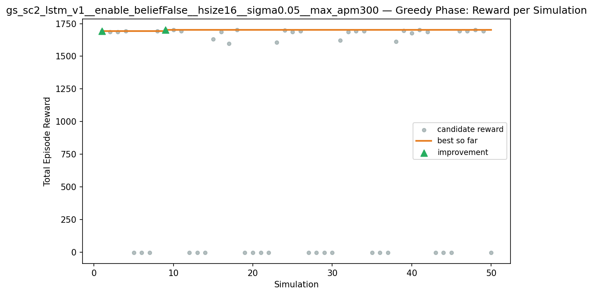
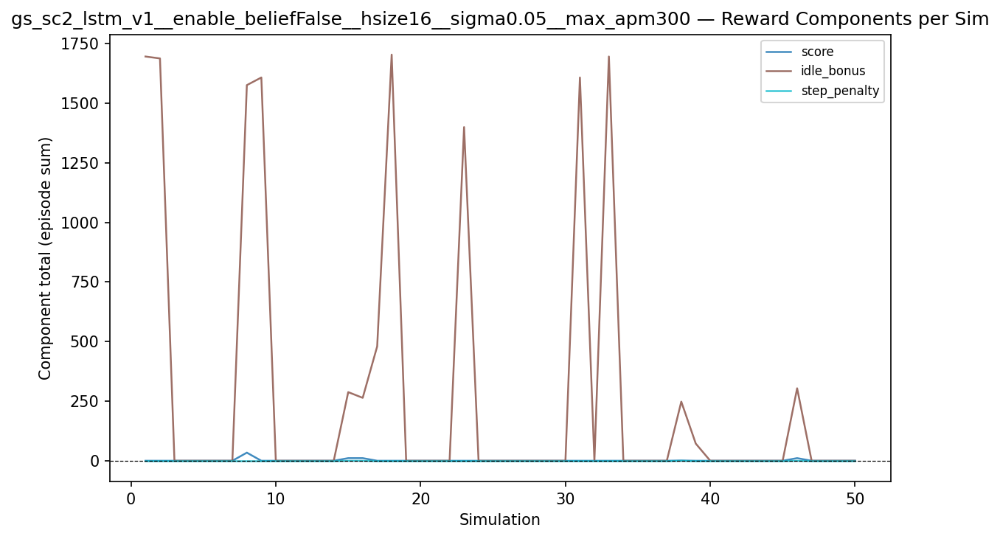
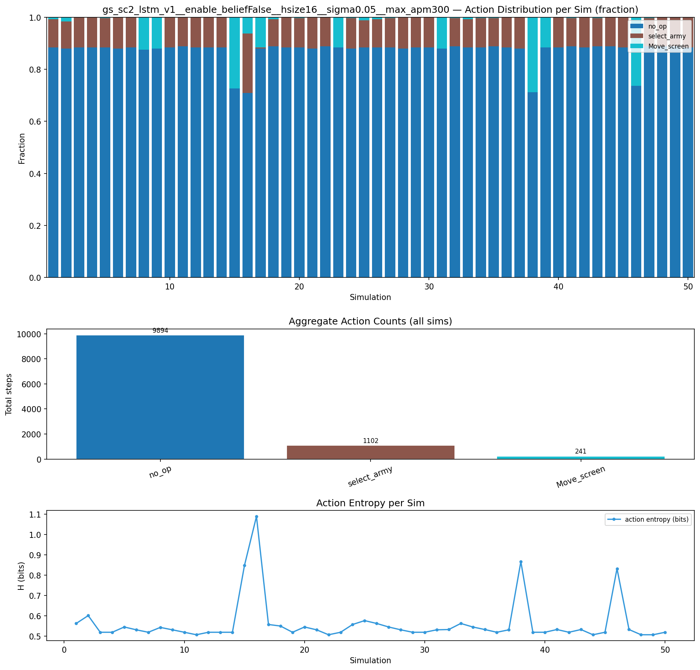
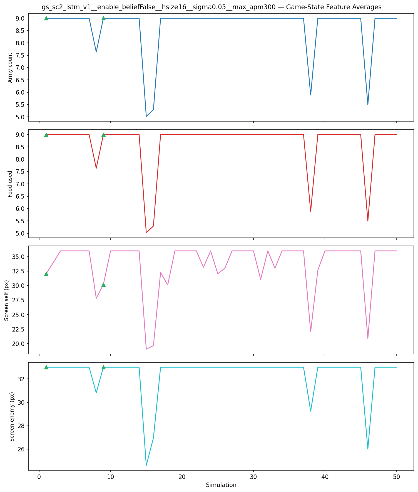
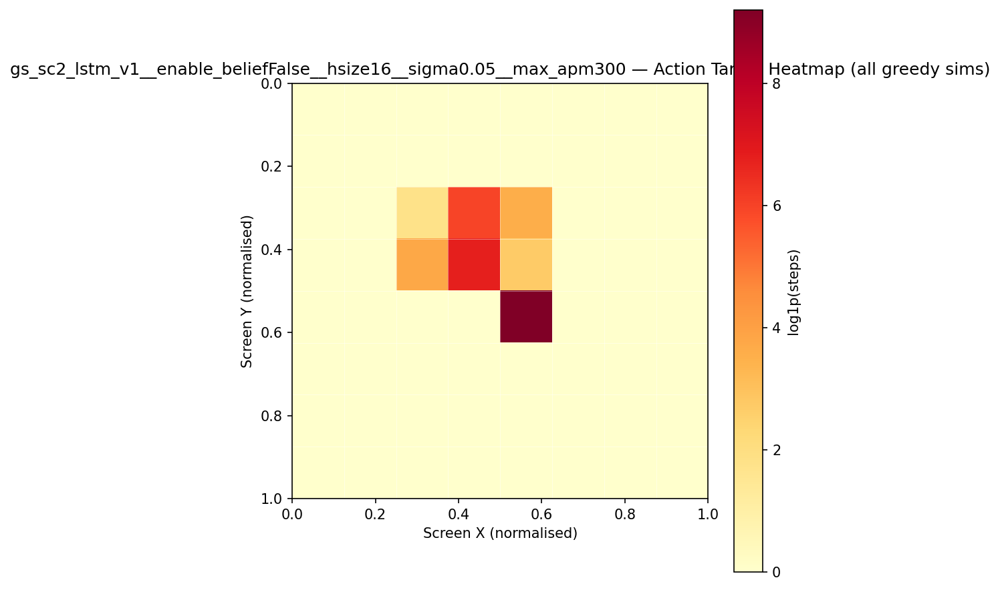
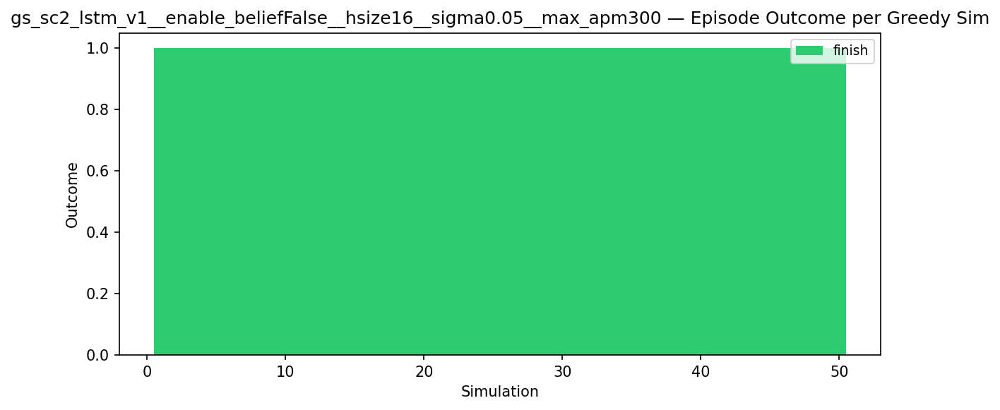
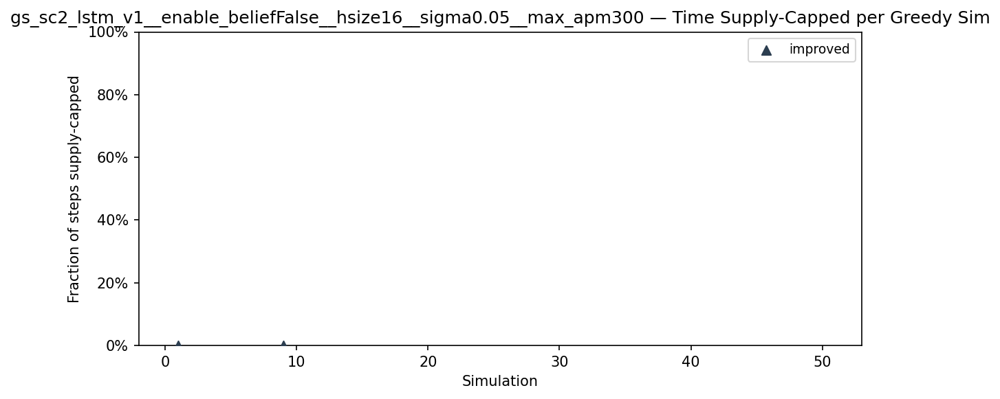
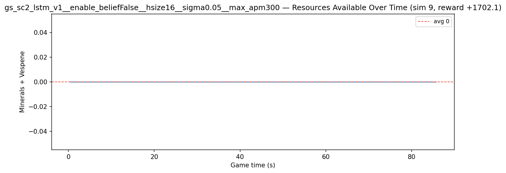
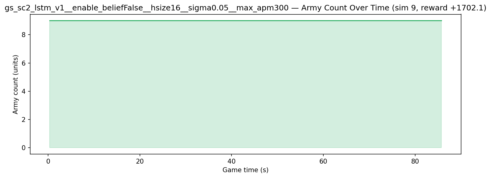
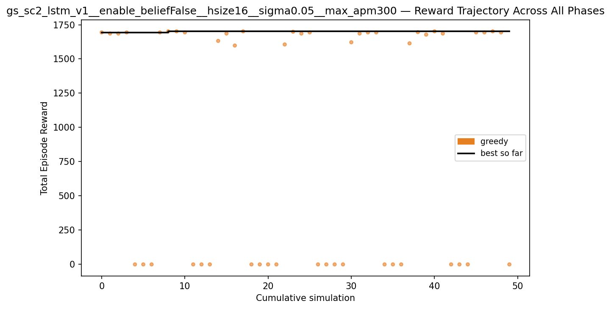

# Experiment: gs_sc2_lstm_v1__enable_beliefFalse__hsize16__sigma0.05__max_apm300

**Game:** StarCraft 2

## Timings

- **Start:** 2026-05-07 09:52:48
- **End:** 2026-05-07 10:50:30
- **Total runtime:** 57m 41.7s

| Phase | Duration |
|-------|----------|
| Greedy | 57m 40.7s |

## Run Parameters

### Training

| Parameter | Value |
|-----------|-------|
| track | sc2_DefeatRoaches |
| map_name | DefeatRoaches |
| in_game_episode_s | 120.0 |
| step_mul | 8 |
| screen_size | 64 |
| minimap_size | 64 |
| agent_race | random |
| n_sims | 50 |
| policy_type | lstm |
| obs_spec_preset | rich |
| enable_belief | False |
| hidden_size | 16 |
| initial_sigma | 0.05 |
| max_apm | 300 |
| policy_params | {'population_size': 20, 'hidden_size': 16, 'initial_sigma': 0.05} |

### Reward Config

| Parameter | Value |
|-----------|-------|
| score_weight | 1.0 |
| win_bonus | 20.0 |
| loss_penalty | 0.0 |
| step_penalty | -0.001 |
| idle_penalty | 0.0 |
| idle_bonus | 1.0 |
| economy_weight | 0.0 |

## Greedy Phase

Best reward: **+1702.1**

| Sim  | Reward   | Progress | Finish Time | Mean abs lat | Reason       | Result       |
|------|----------|----------|-------------|--------------|--------------|-------------|
|    1 |  +1694.1 | 0.000    | —           | —       | finish       | **NEW BEST** |
|    2 |  +1686.1 | 0.000    | —           | —       | finish       |  |
|    3 |  +1686.1 | 0.000    | —           | —       | finish       |  |
|    4 |  +1694.1 | 0.000    | —           | —       | finish       |  |
|    5 |     -1.9 | 0.000    | —           | —       | finish       |  |
|    6 |     -1.9 | 0.000    | —           | —       | finish       |  |
|    7 |     -1.9 | 0.000    | —           | —       | finish       |  |
|    8 |  +1694.1 | 0.000    | —           | —       | finish       |  |
|    9 |  +1702.1 | 0.000    | —           | —       | finish       | **NEW BEST** |
|   10 |  +1702.1 | 0.000    | —           | —       | finish       |  |
|   11 |  +1694.1 | 0.000    | —           | —       | finish       |  |
|   12 |     -1.9 | 0.000    | —           | —       | finish       |  |
|   13 |     -1.9 | 0.000    | —           | —       | finish       |  |
|   14 |     -1.9 | 0.000    | —           | —       | finish       |  |
|   15 |  +1632.1 | 0.000    | —           | —       | finish       |  |
|   16 |  +1686.1 | 0.000    | —           | —       | finish       |  |
|   17 |  +1598.1 | 0.000    | —           | —       | finish       |  |
|   18 |  +1702.1 | 0.000    | —           | —       | finish       |  |
|   19 |     -1.9 | 0.000    | —           | —       | finish       |  |
|   20 |     -1.9 | 0.000    | —           | —       | finish       |  |
|   21 |     -1.9 | 0.000    | —           | —       | finish       |  |
|   22 |     -1.9 | 0.000    | —           | —       | finish       |  |
|   23 |  +1606.1 | 0.000    | —           | —       | finish       |  |
|   24 |  +1699.1 | 0.000    | —           | —       | finish       |  |
|   25 |  +1686.1 | 0.000    | —           | —       | finish       |  |
|   26 |  +1694.1 | 0.000    | —           | —       | finish       |  |
|   27 |     -1.9 | 0.000    | —           | —       | finish       |  |
|   28 |     -1.9 | 0.000    | —           | —       | finish       |  |
|   29 |     -1.9 | 0.000    | —           | —       | finish       |  |
|   30 |     -1.9 | 0.000    | —           | —       | finish       |  |
|   31 |  +1622.1 | 0.000    | —           | —       | finish       |  |
|   32 |  +1686.1 | 0.000    | —           | —       | finish       |  |
|   33 |  +1694.1 | 0.000    | —           | —       | finish       |  |
|   34 |  +1694.1 | 0.000    | —           | —       | finish       |  |
|   35 |     -1.9 | 0.000    | —           | —       | finish       |  |
|   36 |     -1.9 | 0.000    | —           | —       | finish       |  |
|   37 |     -1.9 | 0.000    | —           | —       | finish       |  |
|   38 |  +1614.1 | 0.000    | —           | —       | finish       |  |
|   39 |  +1696.1 | 0.000    | —           | —       | finish       |  |
|   40 |  +1678.1 | 0.000    | —           | —       | finish       |  |
|   41 |  +1702.1 | 0.000    | —           | —       | finish       |  |
|   42 |  +1686.1 | 0.000    | —           | —       | finish       |  |
|   43 |     -1.9 | 0.000    | —           | —       | finish       |  |
|   44 |     -1.9 | 0.000    | —           | —       | finish       |  |
|   45 |     -1.9 | 0.000    | —           | —       | finish       |  |
|   46 |  +1694.1 | 0.000    | —           | —       | finish       |  |
|   47 |  +1694.1 | 0.000    | —           | —       | finish       |  |
|   48 |  +1702.1 | 0.000    | —           | —       | finish       |  |
|   49 |  +1694.1 | 0.000    | —           | —       | finish       |  |
|   50 |     -1.9 | 0.000    | —           | —       | finish       |  |

