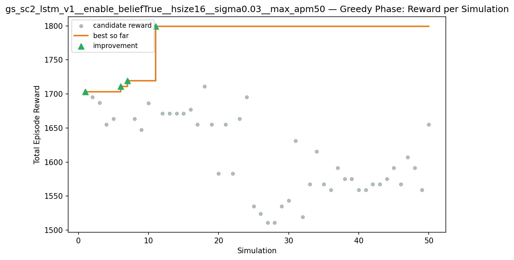
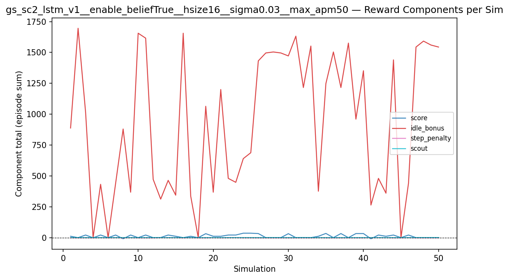
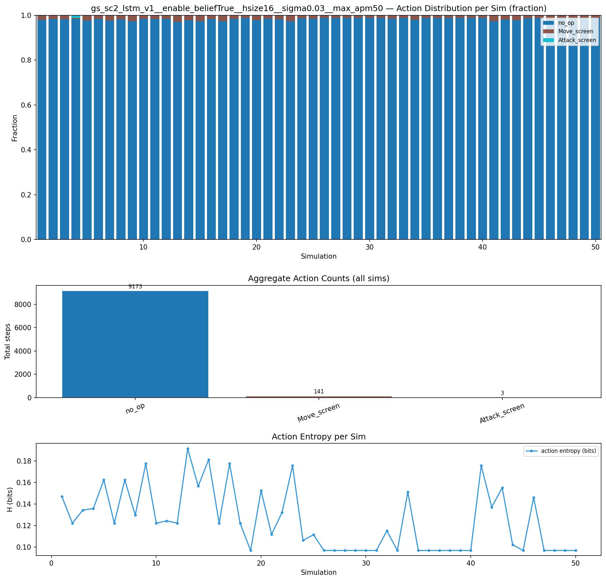
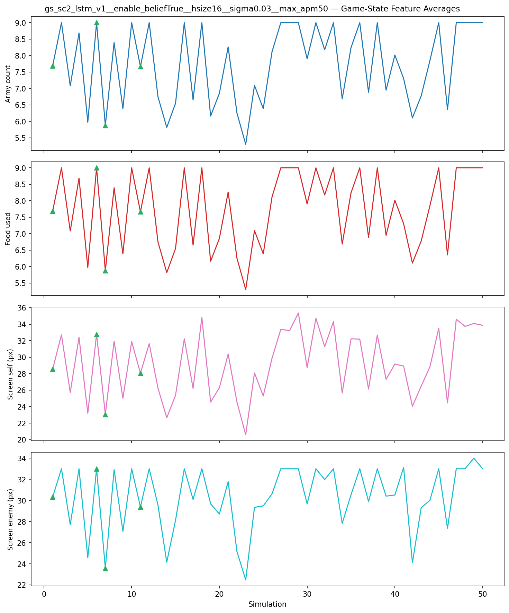
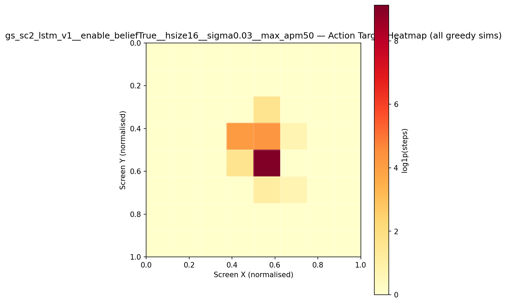
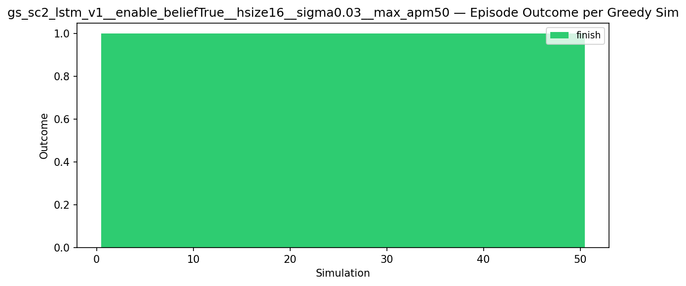
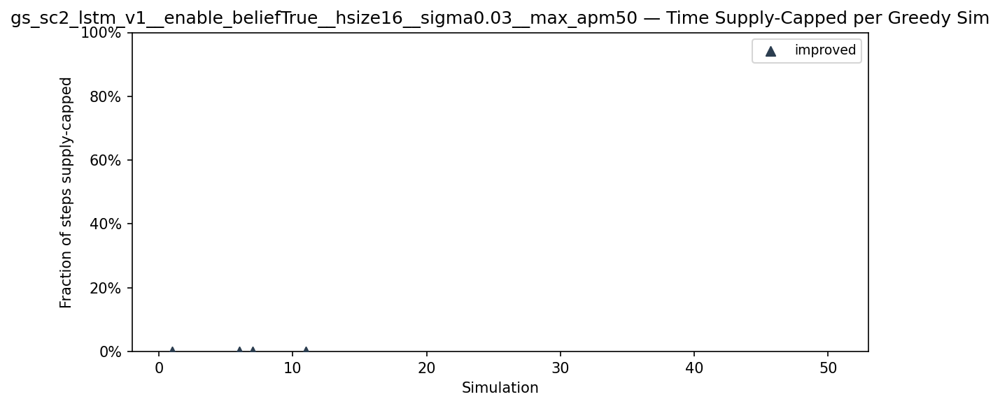
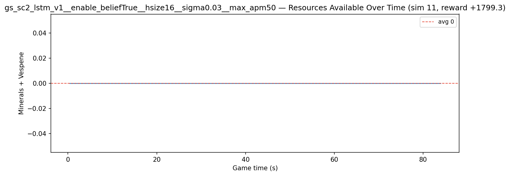
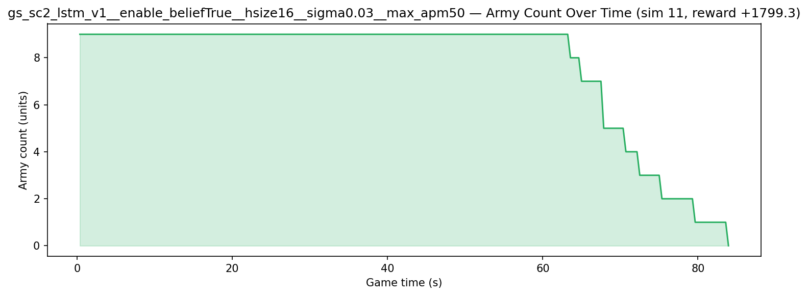
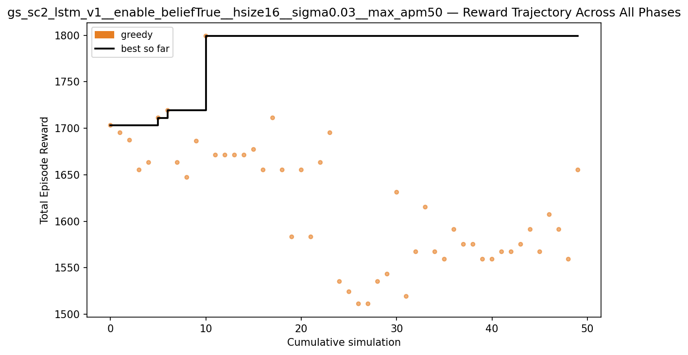

# Experiment: gs_sc2_lstm_v1__enable_beliefTrue__hsize16__sigma0.03__max_apm50

**Game:** StarCraft 2

## Timings

- **Start:** 2026-05-07 16:53:25
- **End:** 2026-05-07 17:32:28
- **Total runtime:** 39m 03.1s

| Phase | Duration |
|-------|----------|
| Greedy | 39m 02.1s |

## Run Parameters

### Training

| Parameter | Value |
|-----------|-------|
| track | sc2_DefeatRoaches |
| map_name | DefeatRoaches |
| in_game_episode_s | 120.0 |
| step_mul | 8 |
| screen_size | 64 |
| minimap_size | 64 |
| agent_race | random |
| n_sims | 50 |
| policy_type | lstm |
| obs_spec_preset | rich |
| enable_belief | True |
| hidden_size | 16 |
| initial_sigma | 0.03 |
| max_apm | 50 |
| policy_params | {'population_size': 20, 'hidden_size': 16, 'initial_sigma': 0.03} |

### Reward Config

| Parameter | Value |
|-----------|-------|
| score_weight | 1.0 |
| win_bonus | 20.0 |
| loss_penalty | 0.0 |
| step_penalty | -0.001 |
| idle_penalty | 0.0 |
| idle_bonus | 1.0 |
| economy_weight | 0.0 |

## Greedy Phase

Best reward: **+1799.3**

| Sim  | Reward   | Progress | Finish Time | Mean abs lat | Reason       | Result       |
|------|----------|----------|-------------|--------------|--------------|-------------|
|    1 |  +1703.3 | 0.000    | —           | —       | finish       | **NEW BEST** |
|    2 |  +1695.3 | 0.000    | —           | —       | finish       |  |
|    3 |  +1687.3 | 0.000    | —           | —       | finish       |  |
|    4 |  +1655.3 | 0.000    | —           | —       | finish       |  |
|    5 |  +1663.3 | 0.000    | —           | —       | finish       |  |
|    6 |  +1711.3 | 0.000    | —           | —       | finish       | **NEW BEST** |
|    7 |  +1719.3 | 0.000    | —           | —       | finish       | **NEW BEST** |
|    8 |  +1663.3 | 0.000    | —           | —       | finish       |  |
|    9 |  +1647.3 | 0.000    | —           | —       | finish       |  |
|   10 |  +1686.3 | 0.000    | —           | —       | finish       |  |
|   11 |  +1799.3 | 0.000    | —           | —       | finish       | **NEW BEST** |
|   12 |  +1671.3 | 0.000    | —           | —       | finish       |  |
|   13 |  +1671.3 | 0.000    | —           | —       | finish       |  |
|   14 |  +1671.3 | 0.000    | —           | —       | finish       |  |
|   15 |  +1671.3 | 0.000    | —           | —       | finish       |  |
|   16 |  +1677.3 | 0.000    | —           | —       | finish       |  |
|   17 |  +1655.3 | 0.000    | —           | —       | finish       |  |
|   18 |  +1711.3 | 0.000    | —           | —       | finish       |  |
|   19 |  +1655.3 | 0.000    | —           | —       | finish       |  |
|   20 |  +1583.3 | 0.000    | —           | —       | finish       |  |
|   21 |  +1655.3 | 0.000    | —           | —       | finish       |  |
|   22 |  +1583.3 | 0.000    | —           | —       | finish       |  |
|   23 |  +1663.3 | 0.000    | —           | —       | finish       |  |
|   24 |  +1695.3 | 0.000    | —           | —       | finish       |  |
|   25 |  +1535.3 | 0.000    | —           | —       | finish       |  |
|   26 |  +1524.3 | 0.000    | —           | —       | finish       |  |
|   27 |  +1511.3 | 0.000    | —           | —       | finish       |  |
|   28 |  +1511.3 | 0.000    | —           | —       | finish       |  |
|   29 |  +1535.3 | 0.000    | —           | —       | finish       |  |
|   30 |  +1543.3 | 0.000    | —           | —       | finish       |  |
|   31 |  +1631.3 | 0.000    | —           | —       | finish       |  |
|   32 |  +1519.3 | 0.000    | —           | —       | finish       |  |
|   33 |  +1567.3 | 0.000    | —           | —       | finish       |  |
|   34 |  +1615.3 | 0.000    | —           | —       | finish       |  |
|   35 |  +1567.3 | 0.000    | —           | —       | finish       |  |
|   36 |  +1559.3 | 0.000    | —           | —       | finish       |  |
|   37 |  +1591.3 | 0.000    | —           | —       | finish       |  |
|   38 |  +1575.3 | 0.000    | —           | —       | finish       |  |
|   39 |  +1575.3 | 0.000    | —           | —       | finish       |  |
|   40 |  +1559.3 | 0.000    | —           | —       | finish       |  |
|   41 |  +1559.3 | 0.000    | —           | —       | finish       |  |
|   42 |  +1567.3 | 0.000    | —           | —       | finish       |  |
|   43 |  +1567.3 | 0.000    | —           | —       | finish       |  |
|   44 |  +1575.3 | 0.000    | —           | —       | finish       |  |
|   45 |  +1591.3 | 0.000    | —           | —       | finish       |  |
|   46 |  +1567.3 | 0.000    | —           | —       | finish       |  |
|   47 |  +1607.3 | 0.000    | —           | —       | finish       |  |
|   48 |  +1591.3 | 0.000    | —           | —       | finish       |  |
|   49 |  +1559.3 | 0.000    | —           | —       | finish       |  |
|   50 |  +1655.3 | 0.000    | —           | —       | finish       |  |

