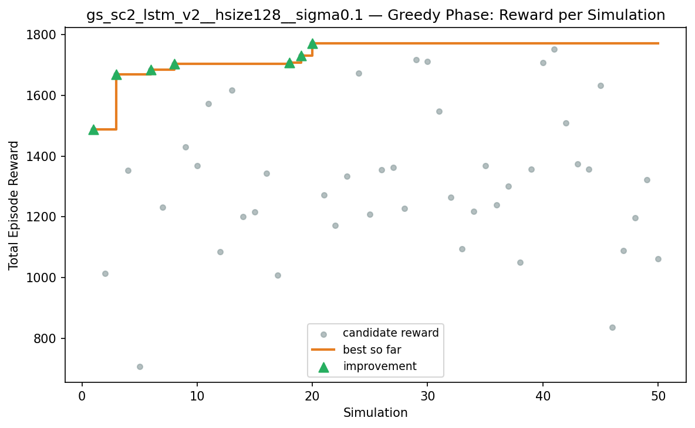
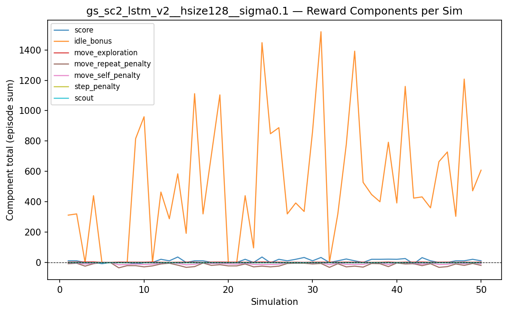
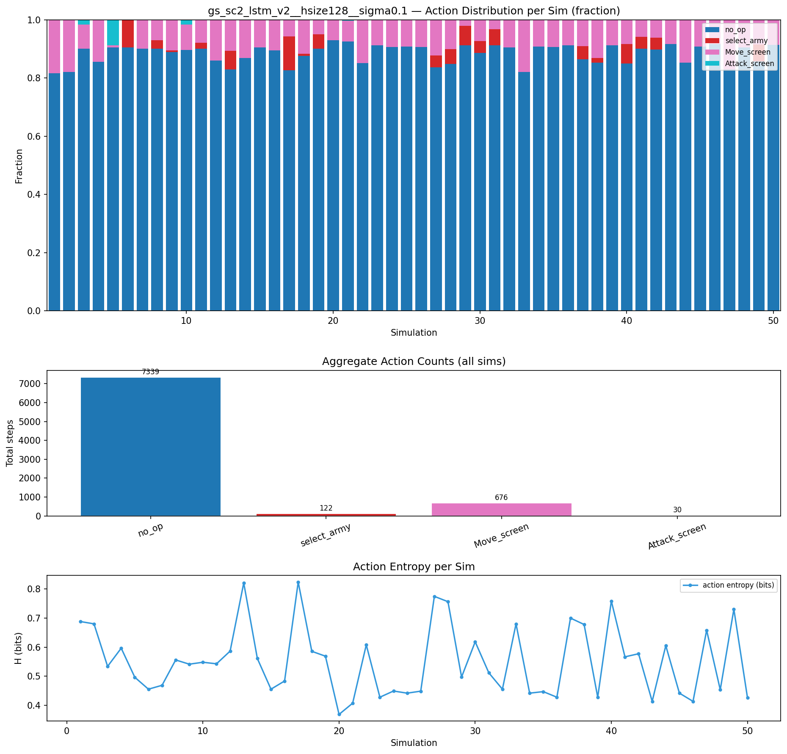
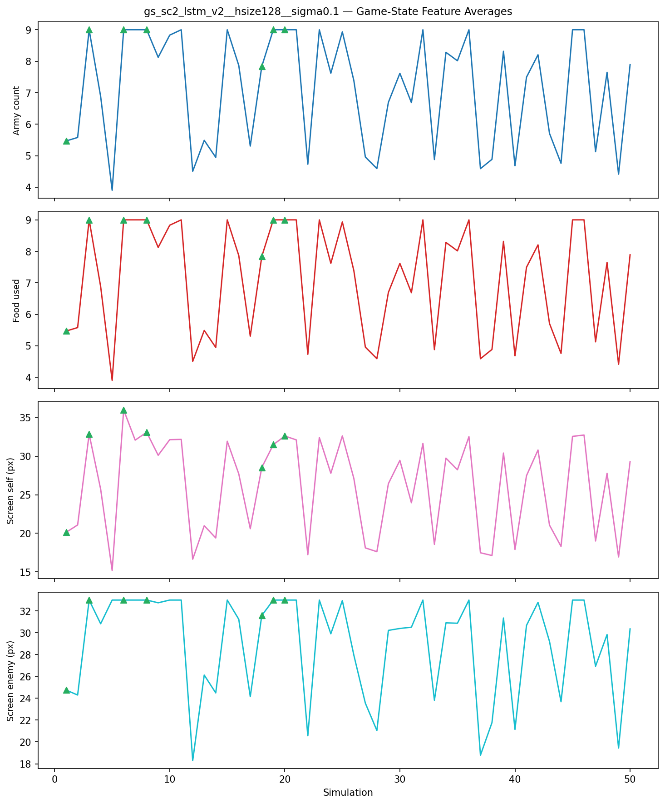
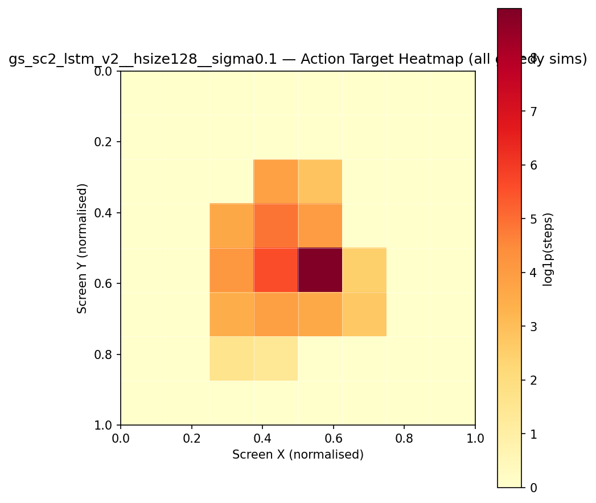
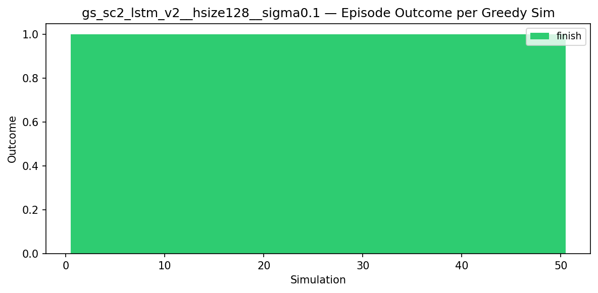
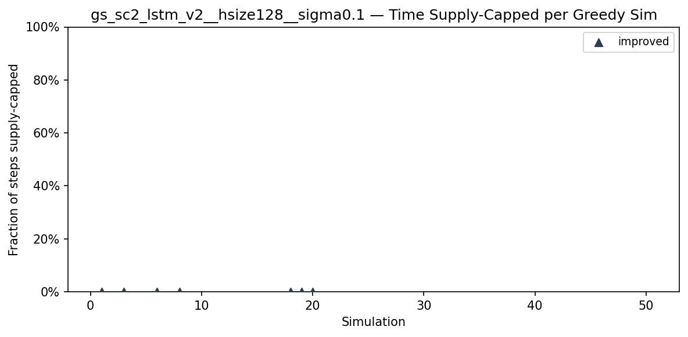
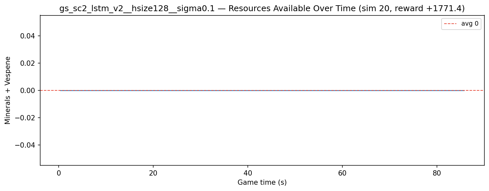
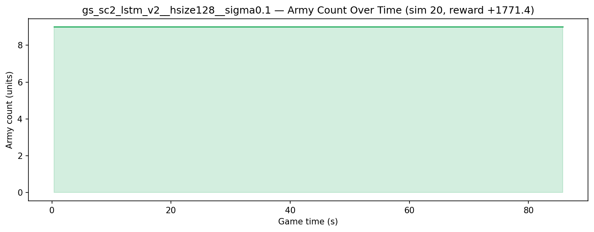

# Experiment: gs_sc2_lstm_v2__hsize128__sigma0.1

**Game:** StarCraft 2

## Timings

- **Start:** 2026-05-07 21:32:37
- **End:** 2026-05-07 22:13:56
- **Total runtime:** 41m 19.3s

| Phase | Duration |
|-------|----------|
| Greedy | 41m 18.2s |

## Run Parameters

### Training

| Parameter | Value |
|-----------|-------|
| track | sc2_DefeatRoaches |
| map_name | DefeatRoaches |
| in_game_episode_s | 120.0 |
| step_mul | 8 |
| screen_size | 64 |
| minimap_size | 64 |
| max_apm | 300 |
| agent_race | random |
| n_sims | 50 |
| policy_type | lstm |
| obs_spec_preset | rich |
| enable_belief | True |
| hidden_size | 128 |
| initial_sigma | 0.1 |
| policy_params | {'population_size': 20, 'hidden_size': 128, 'initial_sigma': 0.1} |

### Reward Config

| Parameter | Value |
|-----------|-------|
| score_weight | 1.0 |
| win_bonus | 20.0 |
| loss_penalty | 0.0 |
| step_penalty | -0.001 |
| idle_penalty | 0.0 |
| idle_bonus | 1.0 |
| move_exploration_bonus | 0.5 |
| move_repeat_penalty | -0.2 |
| move_self_penalty | -0.1 |
| attack_move_bonus | 0.0 |
| click_attack_bonus | 0.0 |
| click_attack_cooldown_steps | 8 |
| economy_weight | 0.0 |

## Greedy Phase

Best reward: **+1771.4**

| Sim  | Reward   | Progress | Finish Time | Mean abs lat | Reason       | Result       |
|------|----------|----------|-------------|--------------|--------------|-------------|
|    1 |  +1487.3 | 0.000    | —           | —       | finish       | **NEW BEST** |
|    2 |  +1012.8 | 0.000    | —           | —       | finish       |  |
|    3 |  +1669.2 | 0.000    | —           | —       | finish       | **NEW BEST** |
|    4 |  +1352.6 | 0.000    | —           | —       | finish       |  |
|    5 |   +707.8 | 0.000    | —           | —       | finish       |  |
|    6 |  +1684.7 | 0.000    | —           | —       | finish       | **NEW BEST** |
|    7 |  +1231.1 | 0.000    | —           | —       | finish       |  |
|    8 |  +1704.1 | 0.000    | —           | —       | finish       | **NEW BEST** |
|    9 |  +1429.9 | 0.000    | —           | —       | finish       |  |
|   10 |  +1367.9 | 0.000    | —           | —       | finish       |  |
|   11 |  +1572.3 | 0.000    | —           | —       | finish       |  |
|   12 |  +1085.3 | 0.000    | —           | —       | finish       |  |
|   13 |  +1618.2 | 0.000    | —           | —       | finish       |  |
|   14 |  +1201.3 | 0.000    | —           | —       | finish       |  |
|   15 |  +1216.0 | 0.000    | —           | —       | finish       |  |
|   16 |  +1342.6 | 0.000    | —           | —       | finish       |  |
|   17 |  +1008.5 | 0.000    | —           | —       | finish       |  |
|   18 |  +1708.7 | 0.000    | —           | —       | finish       | **NEW BEST** |
|   19 |  +1730.6 | 0.000    | —           | —       | finish       | **NEW BEST** |
|   20 |  +1771.4 | 0.000    | —           | —       | finish       | **NEW BEST** |
|   21 |  +1272.7 | 0.000    | —           | —       | finish       |  |
|   22 |  +1171.3 | 0.000    | —           | —       | finish       |  |
|   23 |  +1334.1 | 0.000    | —           | —       | finish       |  |
|   24 |  +1673.9 | 0.000    | —           | —       | finish       |  |
|   25 |  +1208.3 | 0.000    | —           | —       | finish       |  |
|   26 |  +1354.2 | 0.000    | —           | —       | finish       |  |
|   27 |  +1363.3 | 0.000    | —           | —       | finish       |  |
|   28 |  +1227.7 | 0.000    | —           | —       | finish       |  |
|   29 |  +1718.4 | 0.000    | —           | —       | finish       |  |
|   30 |  +1712.2 | 0.000    | —           | —       | finish       |  |
|   31 |  +1547.0 | 0.000    | —           | —       | finish       |  |
|   32 |  +1263.6 | 0.000    | —           | —       | finish       |  |
|   33 |  +1094.0 | 0.000    | —           | —       | finish       |  |
|   34 |  +1217.0 | 0.000    | —           | —       | finish       |  |
|   35 |  +1369.1 | 0.000    | —           | —       | finish       |  |
|   36 |  +1239.1 | 0.000    | —           | —       | finish       |  |
|   37 |  +1300.8 | 0.000    | —           | —       | finish       |  |
|   38 |  +1050.0 | 0.000    | —           | —       | finish       |  |
|   39 |  +1356.4 | 0.000    | —           | —       | finish       |  |
|   40 |  +1707.3 | 0.000    | —           | —       | finish       |  |
|   41 |  +1752.9 | 0.000    | —           | —       | finish       |  |
|   42 |  +1508.9 | 0.000    | —           | —       | finish       |  |
|   43 |  +1375.1 | 0.000    | —           | —       | finish       |  |
|   44 |  +1356.3 | 0.000    | —           | —       | finish       |  |
|   45 |  +1633.4 | 0.000    | —           | —       | finish       |  |
|   46 |   +836.1 | 0.000    | —           | —       | finish       |  |
|   47 |  +1088.3 | 0.000    | —           | —       | finish       |  |
|   48 |  +1197.6 | 0.000    | —           | —       | finish       |  |
|   49 |  +1322.9 | 0.000    | —           | —       | finish       |  |
|   50 |  +1060.9 | 0.000    | —           | —       | finish       |  |

