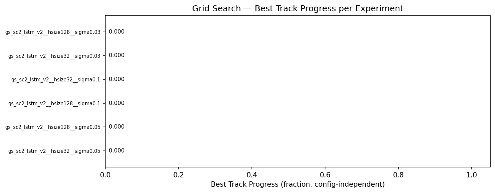
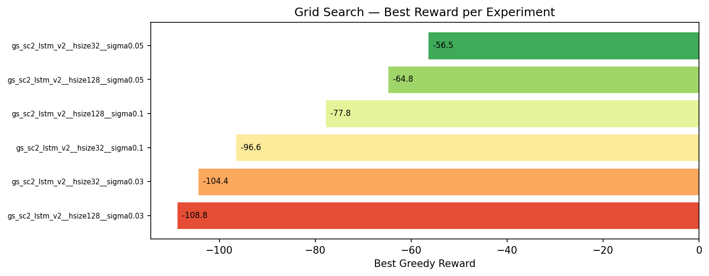
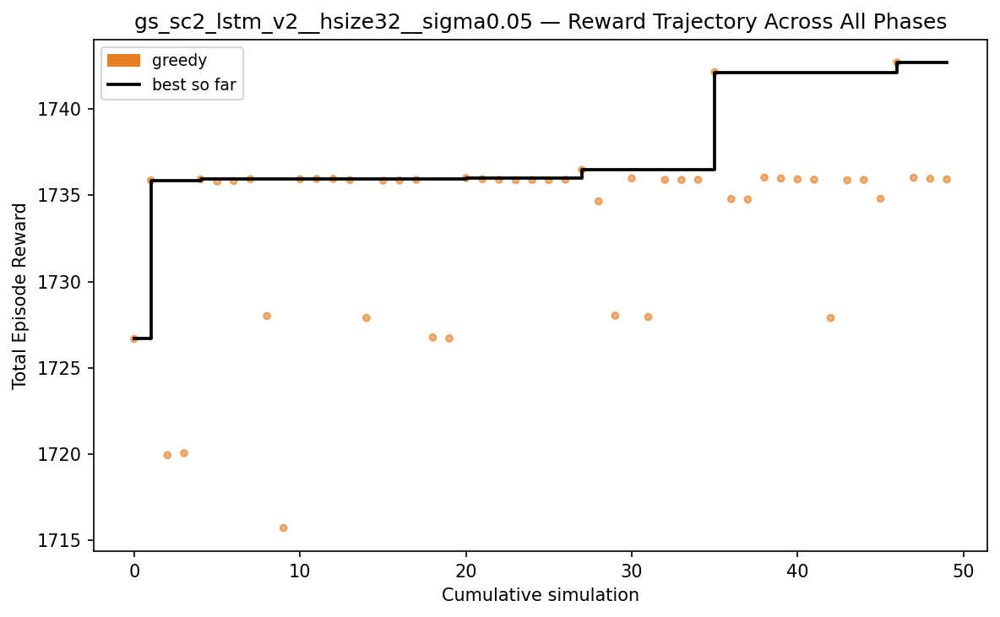
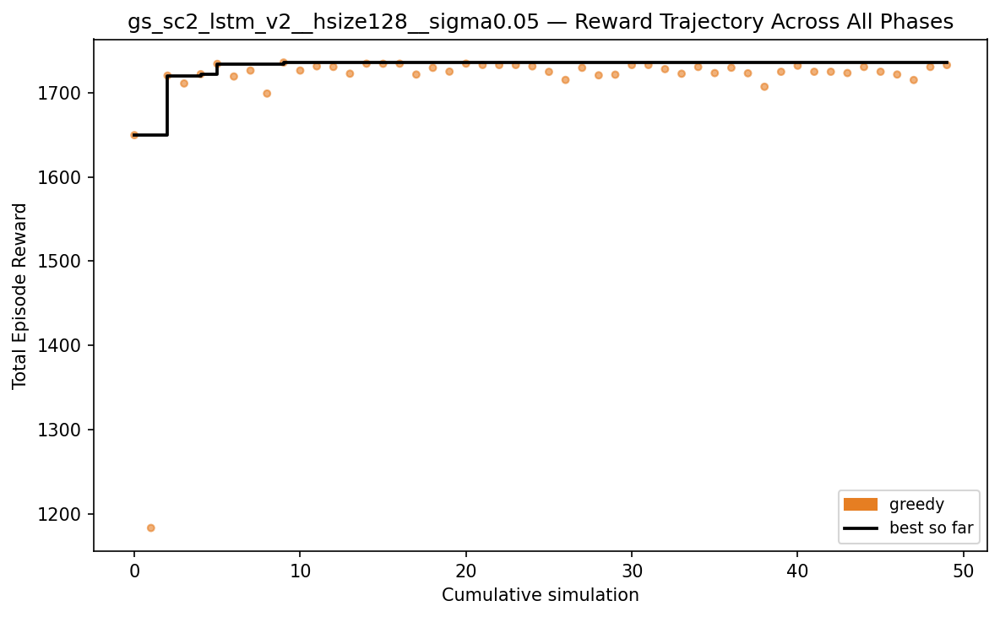
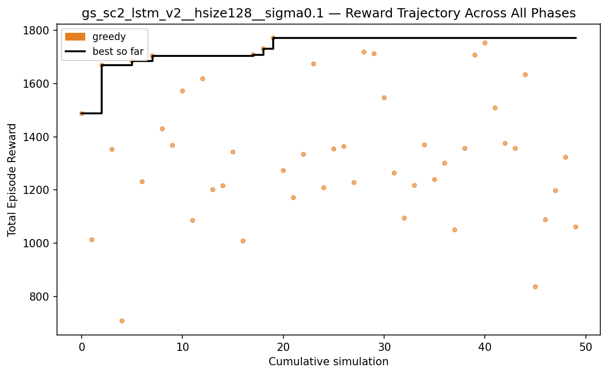
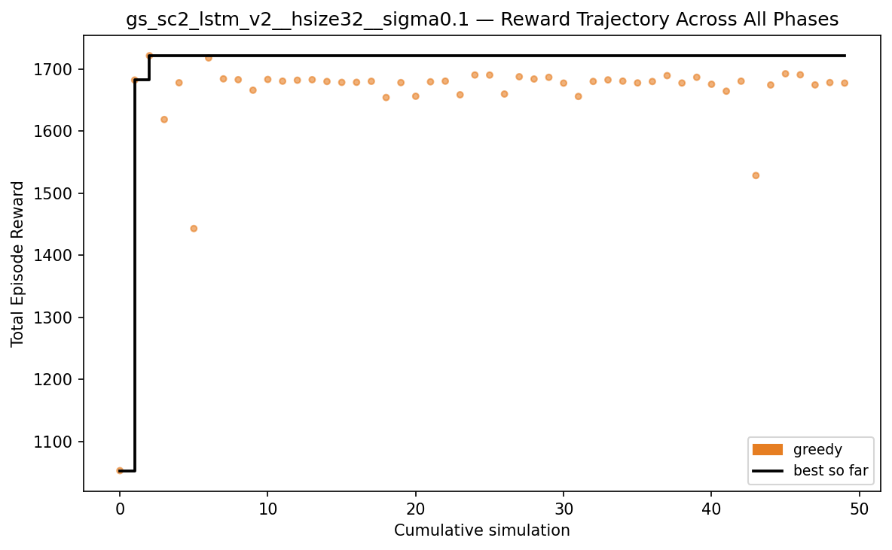
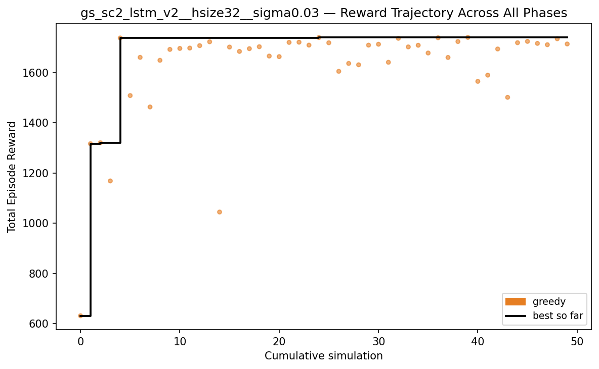

# Grid Search Summary: gs_sc2_lstm_v2_redo

6 experiments.

## Rankings by Task Metrics (config-independent)

Ranked by best track progress, then by best reward.

| Rank | Experiment | Best Progress | Finish Rate | Best Finish Time | Best Reward |
|------|-----------|---------------|-------------|-----------------|-------------|
| 1 | gs_sc2_lstm_v2__hsize32__sigma0.05 | 0.0000 | 0.0% | — | -56.5 |
| 2 | gs_sc2_lstm_v2__hsize128__sigma0.05 | 0.0000 | 0.0% | — | -64.8 |
| 3 | gs_sc2_lstm_v2__hsize128__sigma0.1 | 0.0000 | 0.0% | — | -77.8 |
| 4 | gs_sc2_lstm_v2__hsize32__sigma0.1 | 0.0000 | 0.0% | — | -96.6 |
| 5 | gs_sc2_lstm_v2__hsize32__sigma0.03 | 0.0000 | 0.0% | — | -104.4 |
| 6 | gs_sc2_lstm_v2__hsize128__sigma0.03 | 0.0000 | 0.0% | — | -108.8 |

## Rankings by Reward

| Rank | Experiment | Best Reward | Improvements | First Improv. Sim | Accel % | Greedy Time |
|------|-----------|-------------|--------------|-------------------|---------|-------------|
| 1 | gs_sc2_lstm_v2__hsize32__sigma0.05 | -56.5 | 10 | 1 | 0% | 49m 42.5s |
| 2 | gs_sc2_lstm_v2__hsize128__sigma0.05 | -64.8 | 5 | 1 | 0% | 47m 38.8s |
| 3 | gs_sc2_lstm_v2__hsize128__sigma0.1 | -77.8 | 7 | 1 | 0% | 41m 18.2s |
| 4 | gs_sc2_lstm_v2__hsize32__sigma0.1 | -96.6 | 3 | 1 | 0% | 40m 41.9s |
| 5 | gs_sc2_lstm_v2__hsize32__sigma0.03 | -104.4 | 6 | 1 | 0% | 30m 58.2s |
| 6 | gs_sc2_lstm_v2__hsize128__sigma0.03 | -108.8 | 5 | 1 | 0% | 35m 20.2s |

---

## 1. gs_sc2_lstm_v2__hsize32__sigma0.05

**Best reward: -56.5** | **Best progress: 0.0000** | **Finish rate: 0.0%**

| Param | Value |
|---|---|
| `hidden_size` | 32 |
| `initial_sigma` | 0.05 |
| `policy_params` | {'population_size': 20, 'hidden_size': 32, 'initial_sigma': 0.05} |

| Stat | Value |
|---|---|
| Best track progress | 0.0000 |
| Finish rate | 0.0% |
| Best finish time | — |
| Greedy improvements | 10 |
| First improvement (sim) | 1 |
| Accel % of best run | 0.0% |
| Greedy runtime | 49m 42.5s |

---

## 2. gs_sc2_lstm_v2__hsize128__sigma0.05

**Best reward: -64.8** | **Best progress: 0.0000** | **Finish rate: 0.0%**

| Param | Value |
|---|---|
| `hidden_size` | 128 |
| `initial_sigma` | 0.05 |
| `policy_params` | {'population_size': 20, 'hidden_size': 128, 'initial_sigma': 0.05} |

| Stat | Value |
|---|---|
| Best track progress | 0.0000 |
| Finish rate | 0.0% |
| Best finish time | — |
| Greedy improvements | 5 |
| First improvement (sim) | 1 |
| Accel % of best run | 0.0% |
| Greedy runtime | 47m 38.8s |

---

## 3. gs_sc2_lstm_v2__hsize128__sigma0.1

**Best reward: -77.8** | **Best progress: 0.0000** | **Finish rate: 0.0%**

| Param | Value |
|---|---|
| `hidden_size` | 128 |
| `initial_sigma` | 0.1 |
| `policy_params` | {'population_size': 20, 'hidden_size': 128, 'initial_sigma': 0.1} |

| Stat | Value |
|---|---|
| Best track progress | 0.0000 |
| Finish rate | 0.0% |
| Best finish time | — |
| Greedy improvements | 7 |
| First improvement (sim) | 1 |
| Accel % of best run | 0.0% |
| Greedy runtime | 41m 18.2s |

---

## 4. gs_sc2_lstm_v2__hsize32__sigma0.1

**Best reward: -96.6** | **Best progress: 0.0000** | **Finish rate: 0.0%**

| Param | Value |
|---|---|
| `hidden_size` | 32 |
| `initial_sigma` | 0.1 |
| `policy_params` | {'population_size': 20, 'hidden_size': 32, 'initial_sigma': 0.1} |

| Stat | Value |
|---|---|
| Best track progress | 0.0000 |
| Finish rate | 0.0% |
| Best finish time | — |
| Greedy improvements | 3 |
| First improvement (sim) | 1 |
| Accel % of best run | 0.0% |
| Greedy runtime | 40m 41.9s |

---

## 5. gs_sc2_lstm_v2__hsize32__sigma0.03

**Best reward: -104.4** | **Best progress: 0.0000** | **Finish rate: 0.0%**

| Param | Value |
|---|---|
| `hidden_size` | 32 |
| `initial_sigma` | 0.03 |
| `policy_params` | {'population_size': 20, 'hidden_size': 32, 'initial_sigma': 0.03} |

| Stat | Value |
|---|---|
| Best track progress | 0.0000 |
| Finish rate | 0.0% |
| Best finish time | — |
| Greedy improvements | 6 |
| First improvement (sim) | 1 |
| Accel % of best run | 0.0% |
| Greedy runtime | 30m 58.2s |

---

## 6. gs_sc2_lstm_v2__hsize128__sigma0.03

**Best reward: -108.8** | **Best progress: 0.0000** | **Finish rate: 0.0%**

| Param | Value |
|---|---|
| `hidden_size` | 128 |
| `initial_sigma` | 0.03 |
| `policy_params` | {'population_size': 20, 'hidden_size': 128, 'initial_sigma': 0.03} |

| Stat | Value |
|---|---|
| Best track progress | 0.0000 |
| Finish rate | 0.0% |
| Best finish time | — |
| Greedy improvements | 5 |
| First improvement (sim) | 1 |
| Accel % of best run | 0.0% |
| Greedy runtime | 35m 20.2s |

