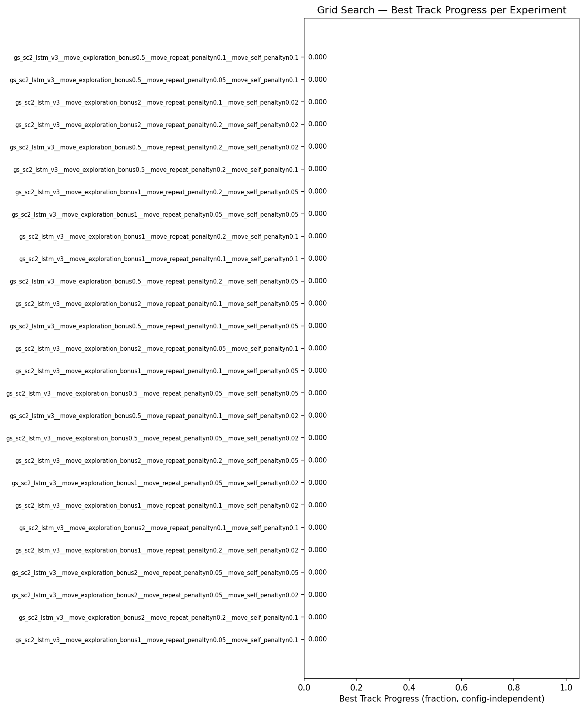
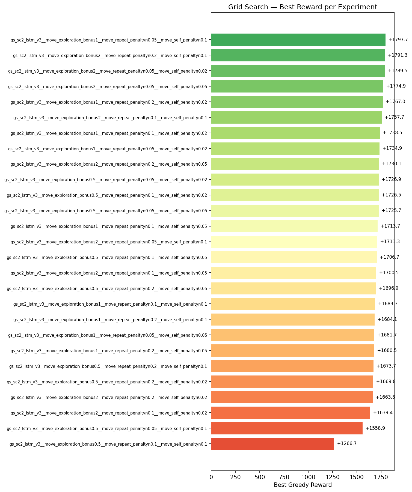
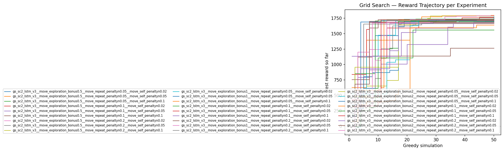
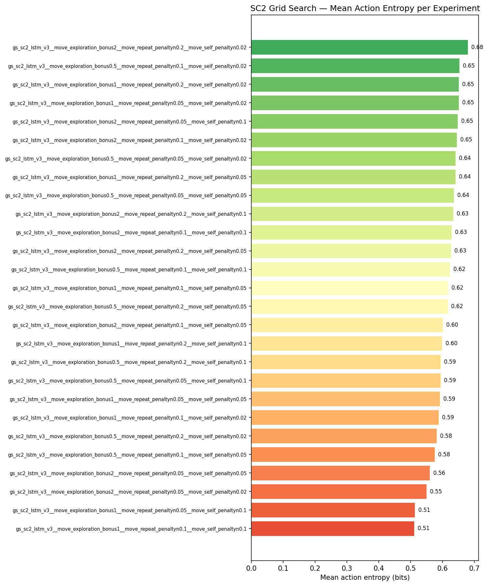
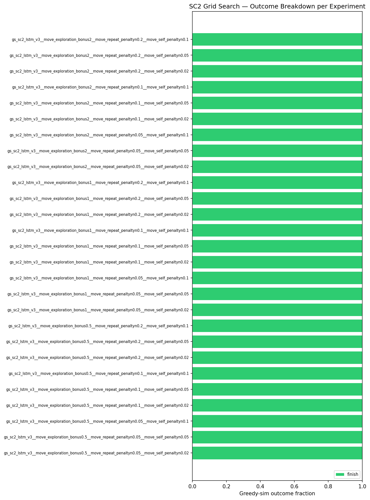

# Grid Search Summary: gs_lstm_v3_redo

27 experiments.

## Rankings by Task Metrics (config-independent)

Ranked by best track progress, then by best reward.

| Rank | Experiment | Best Progress | Finish Rate | Best Finish Time | Best Reward |
|------|-----------|---------------|-------------|-----------------|-------------|
| 1 | gs_sc2_lstm_v3__move_exploration_bonus1__move_repeat_penaltyn0.05__move_self_penaltyn0.1 | 0.0000 | 0.0% | — | +1797.7 |
| 2 | gs_sc2_lstm_v3__move_exploration_bonus2__move_repeat_penaltyn0.2__move_self_penaltyn0.1 | 0.0000 | 0.0% | — | +1791.3 |
| 3 | gs_sc2_lstm_v3__move_exploration_bonus2__move_repeat_penaltyn0.05__move_self_penaltyn0.02 | 0.0000 | 0.0% | — | +1789.5 |
| 4 | gs_sc2_lstm_v3__move_exploration_bonus2__move_repeat_penaltyn0.05__move_self_penaltyn0.05 | 0.0000 | 0.0% | — | +1774.9 |
| 5 | gs_sc2_lstm_v3__move_exploration_bonus1__move_repeat_penaltyn0.2__move_self_penaltyn0.02 | 0.0000 | 0.0% | — | +1767.0 |
| 6 | gs_sc2_lstm_v3__move_exploration_bonus2__move_repeat_penaltyn0.1__move_self_penaltyn0.1 | 0.0000 | 0.0% | — | +1757.7 |
| 7 | gs_sc2_lstm_v3__move_exploration_bonus1__move_repeat_penaltyn0.1__move_self_penaltyn0.02 | 0.0000 | 0.0% | — | +1738.5 |
| 8 | gs_sc2_lstm_v3__move_exploration_bonus1__move_repeat_penaltyn0.05__move_self_penaltyn0.02 | 0.0000 | 0.0% | — | +1734.9 |
| 9 | gs_sc2_lstm_v3__move_exploration_bonus2__move_repeat_penaltyn0.2__move_self_penaltyn0.05 | 0.0000 | 0.0% | — | +1730.1 |
| 10 | gs_sc2_lstm_v3__move_exploration_bonus0.5__move_repeat_penaltyn0.05__move_self_penaltyn0.02 | 0.0000 | 0.0% | — | +1726.9 |
| 11 | gs_sc2_lstm_v3__move_exploration_bonus0.5__move_repeat_penaltyn0.1__move_self_penaltyn0.02 | 0.0000 | 0.0% | — | +1726.5 |
| 12 | gs_sc2_lstm_v3__move_exploration_bonus0.5__move_repeat_penaltyn0.05__move_self_penaltyn0.05 | 0.0000 | 0.0% | — | +1725.7 |
| 13 | gs_sc2_lstm_v3__move_exploration_bonus1__move_repeat_penaltyn0.1__move_self_penaltyn0.05 | 0.0000 | 0.0% | — | +1713.7 |
| 14 | gs_sc2_lstm_v3__move_exploration_bonus2__move_repeat_penaltyn0.05__move_self_penaltyn0.1 | 0.0000 | 0.0% | — | +1711.3 |
| 15 | gs_sc2_lstm_v3__move_exploration_bonus0.5__move_repeat_penaltyn0.1__move_self_penaltyn0.05 | 0.0000 | 0.0% | — | +1706.7 |
| 16 | gs_sc2_lstm_v3__move_exploration_bonus2__move_repeat_penaltyn0.1__move_self_penaltyn0.05 | 0.0000 | 0.0% | — | +1700.5 |
| 17 | gs_sc2_lstm_v3__move_exploration_bonus0.5__move_repeat_penaltyn0.2__move_self_penaltyn0.05 | 0.0000 | 0.0% | — | +1696.9 |
| 18 | gs_sc2_lstm_v3__move_exploration_bonus1__move_repeat_penaltyn0.1__move_self_penaltyn0.1 | 0.0000 | 0.0% | — | +1689.3 |
| 19 | gs_sc2_lstm_v3__move_exploration_bonus1__move_repeat_penaltyn0.2__move_self_penaltyn0.1 | 0.0000 | 0.0% | — | +1684.1 |
| 20 | gs_sc2_lstm_v3__move_exploration_bonus1__move_repeat_penaltyn0.05__move_self_penaltyn0.05 | 0.0000 | 0.0% | — | +1681.7 |
| 21 | gs_sc2_lstm_v3__move_exploration_bonus1__move_repeat_penaltyn0.2__move_self_penaltyn0.05 | 0.0000 | 0.0% | — | +1680.5 |
| 22 | gs_sc2_lstm_v3__move_exploration_bonus0.5__move_repeat_penaltyn0.2__move_self_penaltyn0.1 | 0.0000 | 0.0% | — | +1673.7 |
| 23 | gs_sc2_lstm_v3__move_exploration_bonus0.5__move_repeat_penaltyn0.2__move_self_penaltyn0.02 | 0.0000 | 0.0% | — | +1669.8 |
| 24 | gs_sc2_lstm_v3__move_exploration_bonus2__move_repeat_penaltyn0.2__move_self_penaltyn0.02 | 0.0000 | 0.0% | — | +1663.8 |
| 25 | gs_sc2_lstm_v3__move_exploration_bonus2__move_repeat_penaltyn0.1__move_self_penaltyn0.02 | 0.0000 | 0.0% | — | +1639.4 |
| 26 | gs_sc2_lstm_v3__move_exploration_bonus0.5__move_repeat_penaltyn0.05__move_self_penaltyn0.1 | 0.0000 | 0.0% | — | +1558.9 |
| 27 | gs_sc2_lstm_v3__move_exploration_bonus0.5__move_repeat_penaltyn0.1__move_self_penaltyn0.1 | 0.0000 | 0.0% | — | +1266.7 |

## Rankings by Reward

| Rank | Experiment | Best Reward | Improvements | First Improv. Sim | Accel % | Greedy Time |
|------|-----------|-------------|--------------|-------------------|---------|-------------|
| 1 | gs_sc2_lstm_v3__move_exploration_bonus1__move_repeat_penaltyn0.05__move_self_penaltyn0.1 | +1797.7 | 6 | 1 | 0% | 37m 28.8s |
| 2 | gs_sc2_lstm_v3__move_exploration_bonus2__move_repeat_penaltyn0.2__move_self_penaltyn0.1 | +1791.3 | 10 | 1 | 0% | 39m 17.6s |
| 3 | gs_sc2_lstm_v3__move_exploration_bonus2__move_repeat_penaltyn0.05__move_self_penaltyn0.02 | +1789.5 | 10 | 1 | 0% | 37m 02.2s |
| 4 | gs_sc2_lstm_v3__move_exploration_bonus2__move_repeat_penaltyn0.05__move_self_penaltyn0.05 | +1774.9 | 8 | 1 | 0% | 49m 17.4s |
| 5 | gs_sc2_lstm_v3__move_exploration_bonus1__move_repeat_penaltyn0.2__move_self_penaltyn0.02 | +1767.0 | 2 | 1 | 0% | 41m 12.3s |
| 6 | gs_sc2_lstm_v3__move_exploration_bonus2__move_repeat_penaltyn0.1__move_self_penaltyn0.1 | +1757.7 | 5 | 1 | 0% | 49m 42.5s |
| 7 | gs_sc2_lstm_v3__move_exploration_bonus1__move_repeat_penaltyn0.1__move_self_penaltyn0.02 | +1738.5 | 3 | 1 | 0% | 53m 40.9s |
| 8 | gs_sc2_lstm_v3__move_exploration_bonus1__move_repeat_penaltyn0.05__move_self_penaltyn0.02 | +1734.9 | 6 | 1 | 0% | 46m 19.0s |
| 9 | gs_sc2_lstm_v3__move_exploration_bonus2__move_repeat_penaltyn0.2__move_self_penaltyn0.05 | +1730.1 | 3 | 1 | 0% | 52m 41.3s |
| 10 | gs_sc2_lstm_v3__move_exploration_bonus0.5__move_repeat_penaltyn0.05__move_self_penaltyn0.02 | +1726.9 | 5 | 1 | 0% | 47m 16.0s |
| 11 | gs_sc2_lstm_v3__move_exploration_bonus0.5__move_repeat_penaltyn0.1__move_self_penaltyn0.02 | +1726.5 | 4 | 1 | 0% | 45m 01.1s |
| 12 | gs_sc2_lstm_v3__move_exploration_bonus0.5__move_repeat_penaltyn0.05__move_self_penaltyn0.05 | +1725.7 | 5 | 1 | 0% | 46m 48.4s |
| 13 | gs_sc2_lstm_v3__move_exploration_bonus1__move_repeat_penaltyn0.1__move_self_penaltyn0.05 | +1713.7 | 11 | 1 | 0% | 39m 29.2s |
| 14 | gs_sc2_lstm_v3__move_exploration_bonus2__move_repeat_penaltyn0.05__move_self_penaltyn0.1 | +1711.3 | 6 | 1 | 0% | 44m 36.4s |
| 15 | gs_sc2_lstm_v3__move_exploration_bonus0.5__move_repeat_penaltyn0.1__move_self_penaltyn0.05 | +1706.7 | 4 | 1 | 0% | 54m 34.0s |
| 16 | gs_sc2_lstm_v3__move_exploration_bonus2__move_repeat_penaltyn0.1__move_self_penaltyn0.05 | +1700.5 | 1 | 1 | 0% | 38m 49.8s |
| 17 | gs_sc2_lstm_v3__move_exploration_bonus0.5__move_repeat_penaltyn0.2__move_self_penaltyn0.05 | +1696.9 | 4 | 1 | 0% | 41m 00.4s |
| 18 | gs_sc2_lstm_v3__move_exploration_bonus1__move_repeat_penaltyn0.1__move_self_penaltyn0.1 | +1689.3 | 1 | 1 | 0% | 25m 51.2s |
| 19 | gs_sc2_lstm_v3__move_exploration_bonus1__move_repeat_penaltyn0.2__move_self_penaltyn0.1 | +1684.1 | 5 | 1 | 0% | 46m 23.8s |
| 20 | gs_sc2_lstm_v3__move_exploration_bonus1__move_repeat_penaltyn0.05__move_self_penaltyn0.05 | +1681.7 | 3 | 1 | 0% | 42m 09.4s |
| 21 | gs_sc2_lstm_v3__move_exploration_bonus1__move_repeat_penaltyn0.2__move_self_penaltyn0.05 | +1680.5 | 4 | 1 | 0% | 48m 03.5s |
| 22 | gs_sc2_lstm_v3__move_exploration_bonus0.5__move_repeat_penaltyn0.2__move_self_penaltyn0.1 | +1673.7 | 1 | 1 | 0% | 37m 36.2s |
| 23 | gs_sc2_lstm_v3__move_exploration_bonus0.5__move_repeat_penaltyn0.2__move_self_penaltyn0.02 | +1669.8 | 4 | 1 | 0% | 41m 08.0s |
| 24 | gs_sc2_lstm_v3__move_exploration_bonus2__move_repeat_penaltyn0.2__move_self_penaltyn0.02 | +1663.8 | 6 | 1 | 0% | 42m 49.9s |
| 25 | gs_sc2_lstm_v3__move_exploration_bonus2__move_repeat_penaltyn0.1__move_self_penaltyn0.02 | +1639.4 | 10 | 1 | 0% | 36m 19.4s |
| 26 | gs_sc2_lstm_v3__move_exploration_bonus0.5__move_repeat_penaltyn0.05__move_self_penaltyn0.1 | +1558.9 | 3 | 1 | 0% | 50m 23.0s |
| 27 | gs_sc2_lstm_v3__move_exploration_bonus0.5__move_repeat_penaltyn0.1__move_self_penaltyn0.1 | +1266.7 | 5 | 1 | 0% | 43m 47.6s |

---

## 1. gs_sc2_lstm_v3__move_exploration_bonus1__move_repeat_penaltyn0.05__move_self_penaltyn0.1

**Best reward: +1797.7** | **Best progress: 0.0000** | **Finish rate: 0.0%**

| Param | Value |
|---|---|
| `attack_friendly_penalty` | -10.0 |
| `attack_move_bonus` | 0.5 |
| `click_attack_bonus` | 1.0 |
| `economy_weight` | 0.001 |
| `move_exploration_bonus` | 1.0 |
| `move_repeat_penalty` | -0.05 |
| `move_self_penalty` | -0.1 |

| Stat | Value |
|---|---|
| Best track progress | 0.0000 |
| Finish rate | 0.0% |
| Best finish time | — |
| Greedy improvements | 6 |
| First improvement (sim) | 1 |
| Accel % of best run | 0.0% |
| Greedy runtime | 37m 28.8s |

---

## 2. gs_sc2_lstm_v3__move_exploration_bonus2__move_repeat_penaltyn0.2__move_self_penaltyn0.1

**Best reward: +1791.3** | **Best progress: 0.0000** | **Finish rate: 0.0%**

| Param | Value |
|---|---|
| `attack_friendly_penalty` | -10.0 |
| `attack_move_bonus` | 0.5 |
| `click_attack_bonus` | 1.0 |
| `economy_weight` | 0.001 |
| `move_exploration_bonus` | 2.0 |
| `move_repeat_penalty` | -0.2 |
| `move_self_penalty` | -0.1 |

| Stat | Value |
|---|---|
| Best track progress | 0.0000 |
| Finish rate | 0.0% |
| Best finish time | — |
| Greedy improvements | 10 |
| First improvement (sim) | 1 |
| Accel % of best run | 0.0% |
| Greedy runtime | 39m 17.6s |

---

## 3. gs_sc2_lstm_v3__move_exploration_bonus2__move_repeat_penaltyn0.05__move_self_penaltyn0.02

**Best reward: +1789.5** | **Best progress: 0.0000** | **Finish rate: 0.0%**

| Param | Value |
|---|---|
| `attack_friendly_penalty` | -10.0 |
| `attack_move_bonus` | 0.5 |
| `click_attack_bonus` | 1.0 |
| `economy_weight` | 0.001 |
| `move_exploration_bonus` | 2.0 |
| `move_repeat_penalty` | -0.05 |
| `move_self_penalty` | -0.02 |

| Stat | Value |
|---|---|
| Best track progress | 0.0000 |
| Finish rate | 0.0% |
| Best finish time | — |
| Greedy improvements | 10 |
| First improvement (sim) | 1 |
| Accel % of best run | 0.0% |
| Greedy runtime | 37m 02.2s |

---

## 4. gs_sc2_lstm_v3__move_exploration_bonus2__move_repeat_penaltyn0.05__move_self_penaltyn0.05

**Best reward: +1774.9** | **Best progress: 0.0000** | **Finish rate: 0.0%**

| Param | Value |
|---|---|
| `attack_friendly_penalty` | -10.0 |
| `attack_move_bonus` | 0.5 |
| `click_attack_bonus` | 1.0 |
| `economy_weight` | 0.001 |
| `move_exploration_bonus` | 2.0 |
| `move_repeat_penalty` | -0.05 |
| `move_self_penalty` | -0.05 |

| Stat | Value |
|---|---|
| Best track progress | 0.0000 |
| Finish rate | 0.0% |
| Best finish time | — |
| Greedy improvements | 8 |
| First improvement (sim) | 1 |
| Accel % of best run | 0.0% |
| Greedy runtime | 49m 17.4s |

---

## 5. gs_sc2_lstm_v3__move_exploration_bonus1__move_repeat_penaltyn0.2__move_self_penaltyn0.02

**Best reward: +1767.0** | **Best progress: 0.0000** | **Finish rate: 0.0%**

| Param | Value |
|---|---|
| `attack_friendly_penalty` | -5.0 |
| `attack_move_bonus` | 0.0 |
| `click_attack_bonus` | 0.0 |
| `economy_weight` | 0.0 |
| `move_exploration_bonus` | 1.0 |
| `move_repeat_penalty` | -0.2 |
| `move_self_penalty` | -0.02 |

| Stat | Value |
|---|---|
| Best track progress | 0.0000 |
| Finish rate | 0.0% |
| Best finish time | — |
| Greedy improvements | 2 |
| First improvement (sim) | 1 |
| Accel % of best run | 0.0% |
| Greedy runtime | 41m 12.3s |

---

## 6. gs_sc2_lstm_v3__move_exploration_bonus2__move_repeat_penaltyn0.1__move_self_penaltyn0.1

**Best reward: +1757.7** | **Best progress: 0.0000** | **Finish rate: 0.0%**

| Param | Value |
|---|---|
| `attack_friendly_penalty` | -10.0 |
| `attack_move_bonus` | 0.5 |
| `click_attack_bonus` | 1.0 |
| `economy_weight` | 0.001 |
| `move_exploration_bonus` | 2.0 |
| `move_repeat_penalty` | -0.1 |
| `move_self_penalty` | -0.1 |

| Stat | Value |
|---|---|
| Best track progress | 0.0000 |
| Finish rate | 0.0% |
| Best finish time | — |
| Greedy improvements | 5 |
| First improvement (sim) | 1 |
| Accel % of best run | 0.0% |
| Greedy runtime | 49m 42.5s |

---

## 7. gs_sc2_lstm_v3__move_exploration_bonus1__move_repeat_penaltyn0.1__move_self_penaltyn0.02

**Best reward: +1738.5** | **Best progress: 0.0000** | **Finish rate: 0.0%**

| Param | Value |
|---|---|
| `attack_friendly_penalty` | -10.0 |
| `attack_move_bonus` | 0.5 |
| `click_attack_bonus` | 1.0 |
| `economy_weight` | 0.0 |
| `move_exploration_bonus` | 1.0 |
| `move_repeat_penalty` | -0.1 |
| `move_self_penalty` | -0.02 |

| Stat | Value |
|---|---|
| Best track progress | 0.0000 |
| Finish rate | 0.0% |
| Best finish time | — |
| Greedy improvements | 3 |
| First improvement (sim) | 1 |
| Accel % of best run | 0.0% |
| Greedy runtime | 53m 40.9s |

---

## 8. gs_sc2_lstm_v3__move_exploration_bonus1__move_repeat_penaltyn0.05__move_self_penaltyn0.02

**Best reward: +1734.9** | **Best progress: 0.0000** | **Finish rate: 0.0%**

| Param | Value |
|---|---|
| `attack_friendly_penalty` | -10.0 |
| `attack_move_bonus` | 0.5 |
| `click_attack_bonus` | 1.0 |
| `economy_weight` | 0.001 |
| `move_exploration_bonus` | 1.0 |
| `move_repeat_penalty` | -0.05 |
| `move_self_penalty` | -0.02 |

| Stat | Value |
|---|---|
| Best track progress | 0.0000 |
| Finish rate | 0.0% |
| Best finish time | — |
| Greedy improvements | 6 |
| First improvement (sim) | 1 |
| Accel % of best run | 0.0% |
| Greedy runtime | 46m 19.0s |

---

## 9. gs_sc2_lstm_v3__move_exploration_bonus2__move_repeat_penaltyn0.2__move_self_penaltyn0.05

**Best reward: +1730.1** | **Best progress: 0.0000** | **Finish rate: 0.0%**

| Param | Value |
|---|---|
| `attack_friendly_penalty` | -10.0 |
| `attack_move_bonus` | 0.5 |
| `click_attack_bonus` | 1.0 |
| `economy_weight` | 0.001 |
| `move_exploration_bonus` | 2.0 |
| `move_repeat_penalty` | -0.2 |
| `move_self_penalty` | -0.05 |

| Stat | Value |
|---|---|
| Best track progress | 0.0000 |
| Finish rate | 0.0% |
| Best finish time | — |
| Greedy improvements | 3 |
| First improvement (sim) | 1 |
| Accel % of best run | 0.0% |
| Greedy runtime | 52m 41.3s |

---

## 10. gs_sc2_lstm_v3__move_exploration_bonus0.5__move_repeat_penaltyn0.05__move_self_penaltyn0.02

**Best reward: +1726.9** | **Best progress: 0.0000** | **Finish rate: 0.0%**

| Param | Value |
|---|---|
| `attack_friendly_penalty` | -5.0 |
| `attack_move_bonus` | 0.0 |
| `click_attack_bonus` | 0.0 |
| `economy_weight` | 0.0 |
| `move_exploration_bonus` | 0.5 |
| `move_repeat_penalty` | -0.05 |
| `move_self_penalty` | -0.02 |

| Stat | Value |
|---|---|
| Best track progress | 0.0000 |
| Finish rate | 0.0% |
| Best finish time | — |
| Greedy improvements | 5 |
| First improvement (sim) | 1 |
| Accel % of best run | 0.0% |
| Greedy runtime | 47m 16.0s |

---

## 11. gs_sc2_lstm_v3__move_exploration_bonus0.5__move_repeat_penaltyn0.1__move_self_penaltyn0.02

**Best reward: +1726.5** | **Best progress: 0.0000** | **Finish rate: 0.0%**

| Param | Value |
|---|---|
| `attack_friendly_penalty` | -5.0 |
| `attack_move_bonus` | 0.0 |
| `click_attack_bonus` | 0.0 |
| `economy_weight` | 0.0 |
| `move_exploration_bonus` | 0.5 |
| `move_repeat_penalty` | -0.1 |
| `move_self_penalty` | -0.02 |

| Stat | Value |
|---|---|
| Best track progress | 0.0000 |
| Finish rate | 0.0% |
| Best finish time | — |
| Greedy improvements | 4 |
| First improvement (sim) | 1 |
| Accel % of best run | 0.0% |
| Greedy runtime | 45m 01.1s |

---

## 12. gs_sc2_lstm_v3__move_exploration_bonus0.5__move_repeat_penaltyn0.05__move_self_penaltyn0.05

**Best reward: +1725.7** | **Best progress: 0.0000** | **Finish rate: 0.0%**

| Param | Value |
|---|---|
| `attack_friendly_penalty` | -5.0 |
| `attack_move_bonus` | 0.0 |
| `click_attack_bonus` | 0.0 |
| `economy_weight` | 0.0 |
| `move_exploration_bonus` | 0.5 |
| `move_repeat_penalty` | -0.05 |
| `move_self_penalty` | -0.05 |

| Stat | Value |
|---|---|
| Best track progress | 0.0000 |
| Finish rate | 0.0% |
| Best finish time | — |
| Greedy improvements | 5 |
| First improvement (sim) | 1 |
| Accel % of best run | 0.0% |
| Greedy runtime | 46m 48.4s |

---

## 13. gs_sc2_lstm_v3__move_exploration_bonus1__move_repeat_penaltyn0.1__move_self_penaltyn0.05

**Best reward: +1713.7** | **Best progress: 0.0000** | **Finish rate: 0.0%**

| Param | Value |
|---|---|
| `attack_friendly_penalty` | -10.0 |
| `attack_move_bonus` | 0.5 |
| `click_attack_bonus` | 1.0 |
| `economy_weight` | 0.0 |
| `move_exploration_bonus` | 1.0 |
| `move_repeat_penalty` | -0.1 |
| `move_self_penalty` | -0.05 |

| Stat | Value |
|---|---|
| Best track progress | 0.0000 |
| Finish rate | 0.0% |
| Best finish time | — |
| Greedy improvements | 11 |
| First improvement (sim) | 1 |
| Accel % of best run | 0.0% |
| Greedy runtime | 39m 29.2s |

---

## 14. gs_sc2_lstm_v3__move_exploration_bonus2__move_repeat_penaltyn0.05__move_self_penaltyn0.1

**Best reward: +1711.3** | **Best progress: 0.0000** | **Finish rate: 0.0%**

| Param | Value |
|---|---|
| `attack_friendly_penalty` | -10.0 |
| `attack_move_bonus` | 0.5 |
| `click_attack_bonus` | 1.0 |
| `economy_weight` | 0.001 |
| `move_exploration_bonus` | 2.0 |
| `move_repeat_penalty` | -0.05 |
| `move_self_penalty` | -0.1 |

| Stat | Value |
|---|---|
| Best track progress | 0.0000 |
| Finish rate | 0.0% |
| Best finish time | — |
| Greedy improvements | 6 |
| First improvement (sim) | 1 |
| Accel % of best run | 0.0% |
| Greedy runtime | 44m 36.4s |

---

## 15. gs_sc2_lstm_v3__move_exploration_bonus0.5__move_repeat_penaltyn0.1__move_self_penaltyn0.05

**Best reward: +1706.7** | **Best progress: 0.0000** | **Finish rate: 0.0%**

| Param | Value |
|---|---|
| `attack_friendly_penalty` | -5.0 |
| `attack_move_bonus` | 0.0 |
| `click_attack_bonus` | 0.0 |
| `economy_weight` | 0.0 |
| `move_exploration_bonus` | 0.5 |
| `move_repeat_penalty` | -0.1 |
| `move_self_penalty` | -0.05 |

| Stat | Value |
|---|---|
| Best track progress | 0.0000 |
| Finish rate | 0.0% |
| Best finish time | — |
| Greedy improvements | 4 |
| First improvement (sim) | 1 |
| Accel % of best run | 0.0% |
| Greedy runtime | 54m 34.0s |

---

## 16. gs_sc2_lstm_v3__move_exploration_bonus2__move_repeat_penaltyn0.1__move_self_penaltyn0.05

**Best reward: +1700.5** | **Best progress: 0.0000** | **Finish rate: 0.0%**

| Param | Value |
|---|---|
| `attack_friendly_penalty` | -10.0 |
| `attack_move_bonus` | 0.5 |
| `click_attack_bonus` | 1.0 |
| `economy_weight` | 0.001 |
| `move_exploration_bonus` | 2.0 |
| `move_repeat_penalty` | -0.1 |
| `move_self_penalty` | -0.05 |

| Stat | Value |
|---|---|
| Best track progress | 0.0000 |
| Finish rate | 0.0% |
| Best finish time | — |
| Greedy improvements | 1 |
| First improvement (sim) | 1 |
| Accel % of best run | 0.0% |
| Greedy runtime | 38m 49.8s |

---

## 17. gs_sc2_lstm_v3__move_exploration_bonus0.5__move_repeat_penaltyn0.2__move_self_penaltyn0.05

**Best reward: +1696.9** | **Best progress: 0.0000** | **Finish rate: 0.0%**

| Param | Value |
|---|---|
| `attack_friendly_penalty` | -5.0 |
| `attack_move_bonus` | 0.0 |
| `click_attack_bonus` | 0.0 |
| `economy_weight` | 0.0 |
| `move_exploration_bonus` | 0.5 |
| `move_repeat_penalty` | -0.2 |
| `move_self_penalty` | -0.05 |

| Stat | Value |
|---|---|
| Best track progress | 0.0000 |
| Finish rate | 0.0% |
| Best finish time | — |
| Greedy improvements | 4 |
| First improvement (sim) | 1 |
| Accel % of best run | 0.0% |
| Greedy runtime | 41m 00.4s |

---

## 18. gs_sc2_lstm_v3__move_exploration_bonus1__move_repeat_penaltyn0.1__move_self_penaltyn0.1

**Best reward: +1689.3** | **Best progress: 0.0000** | **Finish rate: 0.0%**

| Param | Value |
|---|---|
| `attack_friendly_penalty` | -5.0 |
| `attack_move_bonus` | 0.0 |
| `click_attack_bonus` | 0.0 |
| `economy_weight` | 0.0 |
| `move_exploration_bonus` | 1.0 |
| `move_repeat_penalty` | -0.1 |
| `move_self_penalty` | -0.1 |

| Stat | Value |
|---|---|
| Best track progress | 0.0000 |
| Finish rate | 0.0% |
| Best finish time | — |
| Greedy improvements | 1 |
| First improvement (sim) | 1 |
| Accel % of best run | 0.0% |
| Greedy runtime | 25m 51.2s |

---

## 19. gs_sc2_lstm_v3__move_exploration_bonus1__move_repeat_penaltyn0.2__move_self_penaltyn0.1

**Best reward: +1684.1** | **Best progress: 0.0000** | **Finish rate: 0.0%**

| Param | Value |
|---|---|
| `attack_friendly_penalty` | -5.0 |
| `attack_move_bonus` | 0.0 |
| `click_attack_bonus` | 0.0 |
| `economy_weight` | 0.0 |
| `move_exploration_bonus` | 1.0 |
| `move_repeat_penalty` | -0.2 |
| `move_self_penalty` | -0.1 |

| Stat | Value |
|---|---|
| Best track progress | 0.0000 |
| Finish rate | 0.0% |
| Best finish time | — |
| Greedy improvements | 5 |
| First improvement (sim) | 1 |
| Accel % of best run | 0.0% |
| Greedy runtime | 46m 23.8s |

---

## 20. gs_sc2_lstm_v3__move_exploration_bonus1__move_repeat_penaltyn0.05__move_self_penaltyn0.05

**Best reward: +1681.7** | **Best progress: 0.0000** | **Finish rate: 0.0%**

| Param | Value |
|---|---|
| `attack_friendly_penalty` | -10.0 |
| `attack_move_bonus` | 0.5 |
| `click_attack_bonus` | 1.0 |
| `economy_weight` | 0.001 |
| `move_exploration_bonus` | 1.0 |
| `move_repeat_penalty` | -0.05 |
| `move_self_penalty` | -0.05 |

| Stat | Value |
|---|---|
| Best track progress | 0.0000 |
| Finish rate | 0.0% |
| Best finish time | — |
| Greedy improvements | 3 |
| First improvement (sim) | 1 |
| Accel % of best run | 0.0% |
| Greedy runtime | 42m 09.4s |

---

## 21. gs_sc2_lstm_v3__move_exploration_bonus1__move_repeat_penaltyn0.2__move_self_penaltyn0.05

**Best reward: +1680.5** | **Best progress: 0.0000** | **Finish rate: 0.0%**

| Param | Value |
|---|---|
| `attack_friendly_penalty` | -5.0 |
| `attack_move_bonus` | 0.0 |
| `click_attack_bonus` | 0.0 |
| `economy_weight` | 0.0 |
| `move_exploration_bonus` | 1.0 |
| `move_repeat_penalty` | -0.2 |
| `move_self_penalty` | -0.05 |

| Stat | Value |
|---|---|
| Best track progress | 0.0000 |
| Finish rate | 0.0% |
| Best finish time | — |
| Greedy improvements | 4 |
| First improvement (sim) | 1 |
| Accel % of best run | 0.0% |
| Greedy runtime | 48m 03.5s |

---

## 22. gs_sc2_lstm_v3__move_exploration_bonus0.5__move_repeat_penaltyn0.2__move_self_penaltyn0.1

**Best reward: +1673.7** | **Best progress: 0.0000** | **Finish rate: 0.0%**

| Param | Value |
|---|---|
| `attack_friendly_penalty` | -5.0 |
| `attack_move_bonus` | 0.0 |
| `click_attack_bonus` | 0.0 |
| `economy_weight` | 0.0 |
| `move_exploration_bonus` | 0.5 |
| `move_repeat_penalty` | -0.2 |
| `move_self_penalty` | -0.1 |

| Stat | Value |
|---|---|
| Best track progress | 0.0000 |
| Finish rate | 0.0% |
| Best finish time | — |
| Greedy improvements | 1 |
| First improvement (sim) | 1 |
| Accel % of best run | 0.0% |
| Greedy runtime | 37m 36.2s |

---

## 23. gs_sc2_lstm_v3__move_exploration_bonus0.5__move_repeat_penaltyn0.2__move_self_penaltyn0.02

**Best reward: +1669.8** | **Best progress: 0.0000** | **Finish rate: 0.0%**

| Param | Value |
|---|---|
| `attack_friendly_penalty` | -5.0 |
| `attack_move_bonus` | 0.0 |
| `click_attack_bonus` | 0.0 |
| `economy_weight` | 0.0 |
| `move_exploration_bonus` | 0.5 |
| `move_repeat_penalty` | -0.2 |
| `move_self_penalty` | -0.02 |

| Stat | Value |
|---|---|
| Best track progress | 0.0000 |
| Finish rate | 0.0% |
| Best finish time | — |
| Greedy improvements | 4 |
| First improvement (sim) | 1 |
| Accel % of best run | 0.0% |
| Greedy runtime | 41m 08.0s |

---

## 24. gs_sc2_lstm_v3__move_exploration_bonus2__move_repeat_penaltyn0.2__move_self_penaltyn0.02

**Best reward: +1663.8** | **Best progress: 0.0000** | **Finish rate: 0.0%**

| Param | Value |
|---|---|
| `attack_friendly_penalty` | -10.0 |
| `attack_move_bonus` | 0.5 |
| `click_attack_bonus` | 1.0 |
| `economy_weight` | 0.001 |
| `move_exploration_bonus` | 2.0 |
| `move_repeat_penalty` | -0.2 |
| `move_self_penalty` | -0.02 |

| Stat | Value |
|---|---|
| Best track progress | 0.0000 |
| Finish rate | 0.0% |
| Best finish time | — |
| Greedy improvements | 6 |
| First improvement (sim) | 1 |
| Accel % of best run | 0.0% |
| Greedy runtime | 42m 49.9s |

---

## 25. gs_sc2_lstm_v3__move_exploration_bonus2__move_repeat_penaltyn0.1__move_self_penaltyn0.02

**Best reward: +1639.4** | **Best progress: 0.0000** | **Finish rate: 0.0%**

| Param | Value |
|---|---|
| `attack_friendly_penalty` | -10.0 |
| `attack_move_bonus` | 0.5 |
| `click_attack_bonus` | 1.0 |
| `economy_weight` | 0.001 |
| `move_exploration_bonus` | 2.0 |
| `move_repeat_penalty` | -0.1 |
| `move_self_penalty` | -0.02 |

| Stat | Value |
|---|---|
| Best track progress | 0.0000 |
| Finish rate | 0.0% |
| Best finish time | — |
| Greedy improvements | 10 |
| First improvement (sim) | 1 |
| Accel % of best run | 0.0% |
| Greedy runtime | 36m 19.4s |

---

## 26. gs_sc2_lstm_v3__move_exploration_bonus0.5__move_repeat_penaltyn0.05__move_self_penaltyn0.1

**Best reward: +1558.9** | **Best progress: 0.0000** | **Finish rate: 0.0%**

| Param | Value |
|---|---|
| `attack_friendly_penalty` | -5.0 |
| `attack_move_bonus` | 0.0 |
| `click_attack_bonus` | 0.0 |
| `economy_weight` | 0.0 |
| `move_exploration_bonus` | 0.5 |
| `move_repeat_penalty` | -0.05 |
| `move_self_penalty` | -0.1 |

| Stat | Value |
|---|---|
| Best track progress | 0.0000 |
| Finish rate | 0.0% |
| Best finish time | — |
| Greedy improvements | 3 |
| First improvement (sim) | 1 |
| Accel % of best run | 0.0% |
| Greedy runtime | 50m 23.0s |

---

## 27. gs_sc2_lstm_v3__move_exploration_bonus0.5__move_repeat_penaltyn0.1__move_self_penaltyn0.1

**Best reward: +1266.7** | **Best progress: 0.0000** | **Finish rate: 0.0%**

| Param | Value |
|---|---|
| `attack_friendly_penalty` | -5.0 |
| `attack_move_bonus` | 0.0 |
| `click_attack_bonus` | 0.0 |
| `economy_weight` | 0.0 |
| `move_exploration_bonus` | 0.5 |
| `move_repeat_penalty` | -0.1 |
| `move_self_penalty` | -0.1 |

| Stat | Value |
|---|---|
| Best track progress | 0.0000 |
| Finish rate | 0.0% |
| Best finish time | — |
| Greedy improvements | 5 |
| First improvement (sim) | 1 |
| Accel % of best run | 0.0% |
| Greedy runtime | 43m 47.6s |

## SC2-specific cross-run charts

