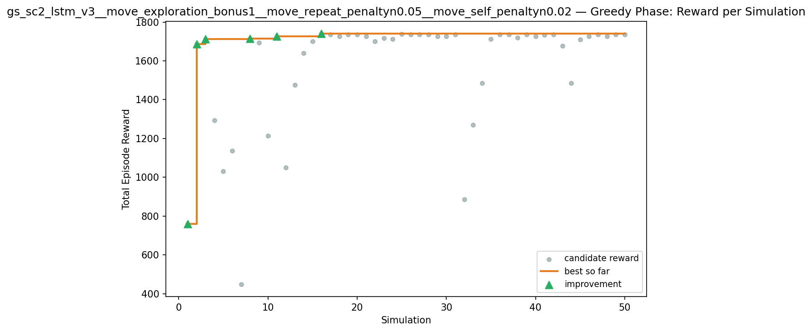
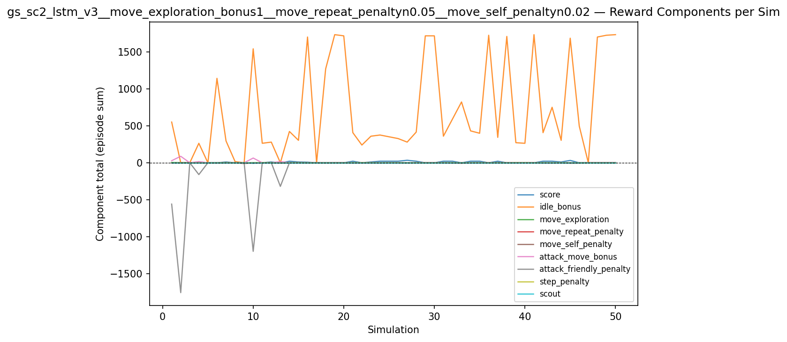
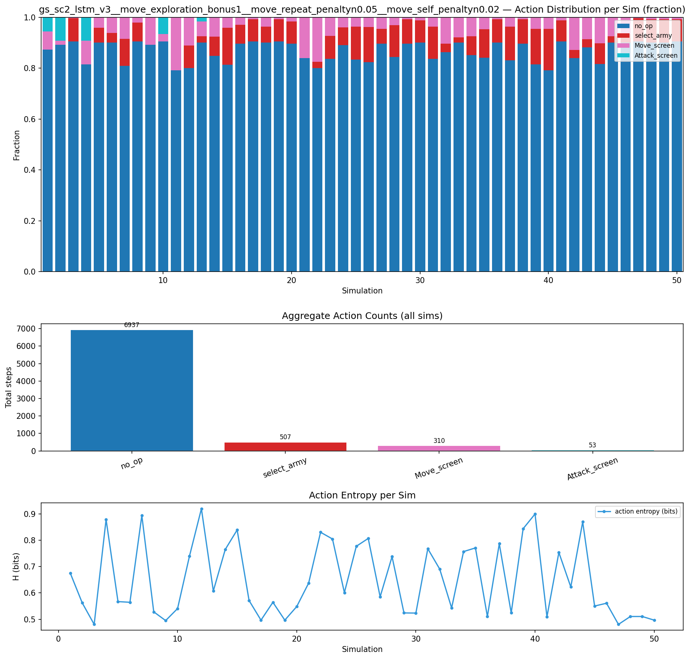
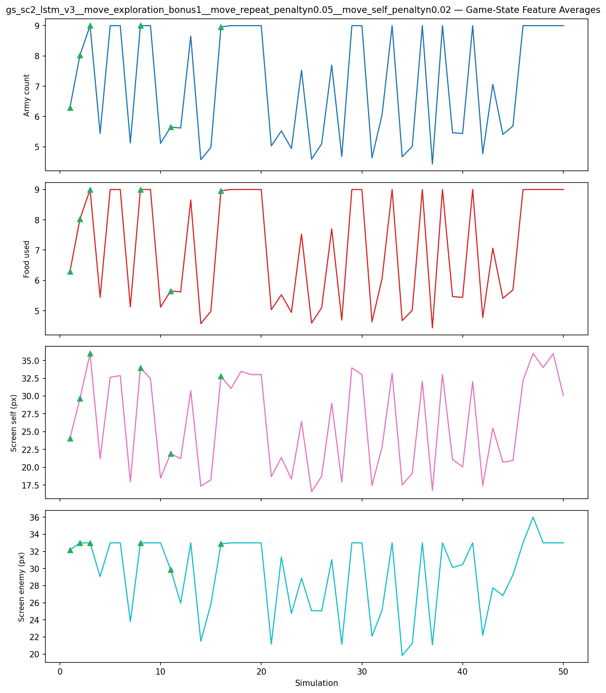
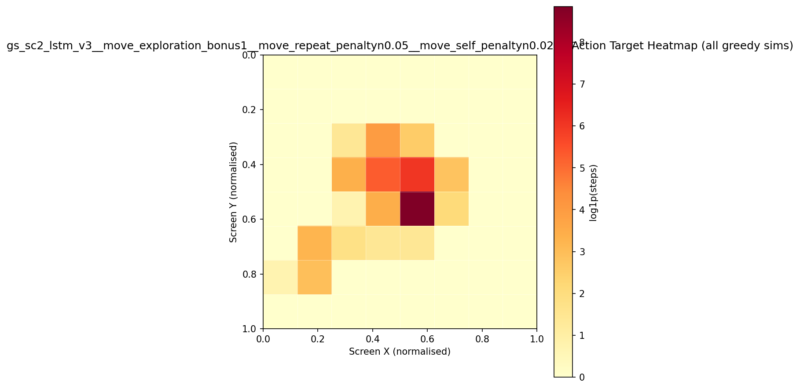
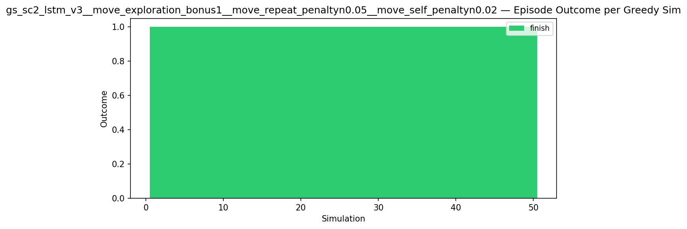
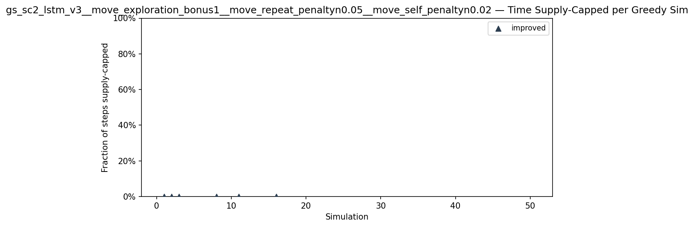
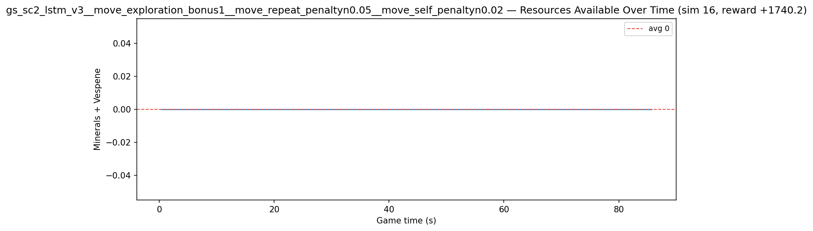
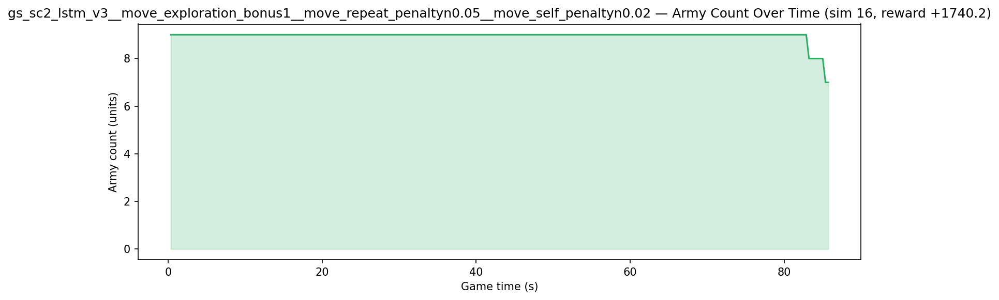

# Experiment: gs_sc2_lstm_v3__move_exploration_bonus1__move_repeat_penaltyn0.05__move_self_penaltyn0.02

**Game:** StarCraft 2

## Timings

- **Start:** 2026-05-08 10:50:44
- **End:** 2026-05-08 11:37:04
- **Total runtime:** 46m 20.0s

| Phase | Duration |
|-------|----------|
| Greedy | 46m 19.0s |

## Run Parameters

### Training

| Parameter | Value |
|-----------|-------|
| track | sc2_DefeatRoaches |
| map_name | DefeatRoaches |
| in_game_episode_s | 120.0 |
| step_mul | 8 |
| screen_size | 64 |
| minimap_size | 64 |
| max_apm | 300 |
| agent_race | random |
| n_sims | 50 |
| policy_type | lstm |
| obs_spec_preset | rich |
| enable_belief | True |
| hidden_size | 128 |
| initial_sigma | 0.1 |
| policy_params | {'population_size': 20, 'hidden_size': 128, 'initial_sigma': 0.1} |

### Reward Config

| Parameter | Value |
|-----------|-------|
| score_weight | 1.0 |
| win_bonus | 20.0 |
| loss_penalty | 0.0 |
| step_penalty | -0.001 |
| idle_penalty | 0.0 |
| idle_bonus | 1.0 |
| move_exploration_bonus | 1.0 |
| move_repeat_penalty | -0.05 |
| move_self_penalty | -0.02 |
| attack_move_bonus | 0.5 |
| click_attack_bonus | 1.0 |
| click_attack_cooldown_steps | 8 |
| attack_friendly_penalty | -10.0 |
| economy_weight | 0.001 |

## Greedy Phase

Best reward: **+1740.2**

| Sim  | Reward   | Progress | Finish Time | Mean abs lat | Reason       | Result       |
|------|----------|----------|-------------|--------------|--------------|-------------|
|    1 |   +760.3 | 0.000    | —           | —       | finish       | **NEW BEST** |
|    2 |  +1687.0 | 0.000    | —           | —       | finish       | **NEW BEST** |
|    3 |  +1712.0 | 0.000    | —           | —       | finish       | **NEW BEST** |
|    4 |  +1293.4 | 0.000    | —           | —       | finish       |  |
|    5 |  +1030.4 | 0.000    | —           | —       | finish       |  |
|    6 |  +1135.8 | 0.000    | —           | —       | finish       |  |
|    7 |   +449.3 | 0.000    | —           | —       | finish       |  |
|    8 |  +1714.7 | 0.000    | —           | —       | finish       | **NEW BEST** |
|    9 |  +1692.7 | 0.000    | —           | —       | finish       |  |
|   10 |  +1212.7 | 0.000    | —           | —       | finish       |  |
|   11 |  +1726.9 | 0.000    | —           | —       | finish       | **NEW BEST** |
|   12 |  +1050.9 | 0.000    | —           | —       | finish       |  |
|   13 |  +1475.8 | 0.000    | —           | —       | finish       |  |
|   14 |  +1639.4 | 0.000    | —           | —       | finish       |  |
|   15 |  +1700.8 | 0.000    | —           | —       | finish       |  |
|   16 |  +1740.2 | 0.000    | —           | —       | finish       | **NEW BEST** |
|   17 |  +1734.9 | 0.000    | —           | —       | finish       |  |
|   18 |  +1726.9 | 0.000    | —           | —       | finish       |  |
|   19 |  +1734.9 | 0.000    | —           | —       | finish       |  |
|   20 |  +1734.9 | 0.000    | —           | —       | finish       |  |
|   21 |  +1726.5 | 0.000    | —           | —       | finish       |  |
|   22 |  +1700.2 | 0.000    | —           | —       | finish       |  |
|   23 |  +1717.9 | 0.000    | —           | —       | finish       |  |
|   24 |  +1712.5 | 0.000    | —           | —       | finish       |  |
|   25 |  +1738.9 | 0.000    | —           | —       | finish       |  |
|   26 |  +1734.9 | 0.000    | —           | —       | finish       |  |
|   27 |  +1734.9 | 0.000    | —           | —       | finish       |  |
|   28 |  +1734.9 | 0.000    | —           | —       | finish       |  |
|   29 |  +1726.9 | 0.000    | —           | —       | finish       |  |
|   30 |  +1726.9 | 0.000    | —           | —       | finish       |  |
|   31 |  +1734.9 | 0.000    | —           | —       | finish       |  |
|   32 |   +884.8 | 0.000    | —           | —       | finish       |  |
|   33 |  +1268.8 | 0.000    | —           | —       | finish       |  |
|   34 |  +1485.4 | 0.000    | —           | —       | finish       |  |
|   35 |  +1711.4 | 0.000    | —           | —       | finish       |  |
|   36 |  +1734.9 | 0.000    | —           | —       | finish       |  |
|   37 |  +1734.9 | 0.000    | —           | —       | finish       |  |
|   38 |  +1718.9 | 0.000    | —           | —       | finish       |  |
|   39 |  +1734.9 | 0.000    | —           | —       | finish       |  |
|   40 |  +1726.9 | 0.000    | —           | —       | finish       |  |
|   41 |  +1734.5 | 0.000    | —           | —       | finish       |  |
|   42 |  +1734.9 | 0.000    | —           | —       | finish       |  |
|   43 |  +1676.4 | 0.000    | —           | —       | finish       |  |
|   44 |  +1485.4 | 0.000    | —           | —       | finish       |  |
|   45 |  +1710.4 | 0.000    | —           | —       | finish       |  |
|   46 |  +1726.9 | 0.000    | —           | —       | finish       |  |
|   47 |  +1734.9 | 0.000    | —           | —       | finish       |  |
|   48 |  +1726.9 | 0.000    | —           | —       | finish       |  |
|   49 |  +1734.9 | 0.000    | —           | —       | finish       |  |
|   50 |  +1734.9 | 0.000    | —           | —       | finish       |  |

