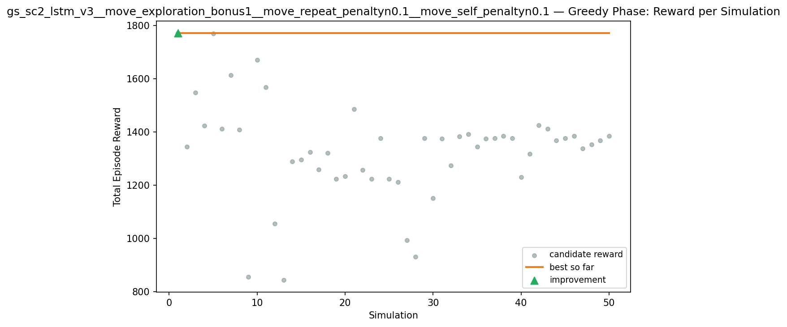
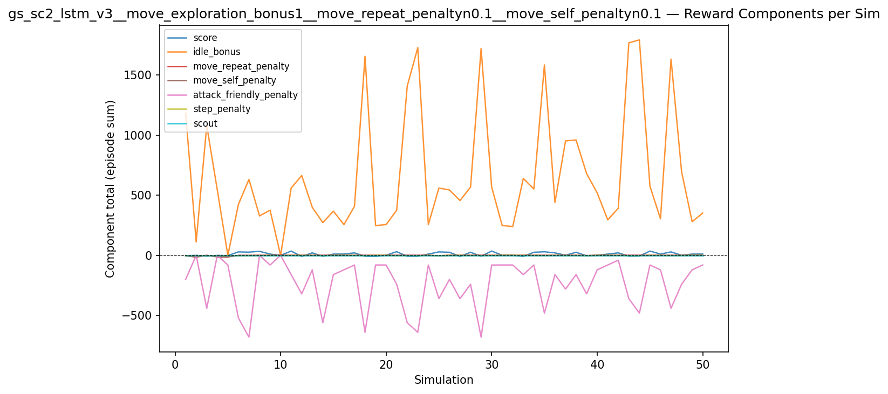
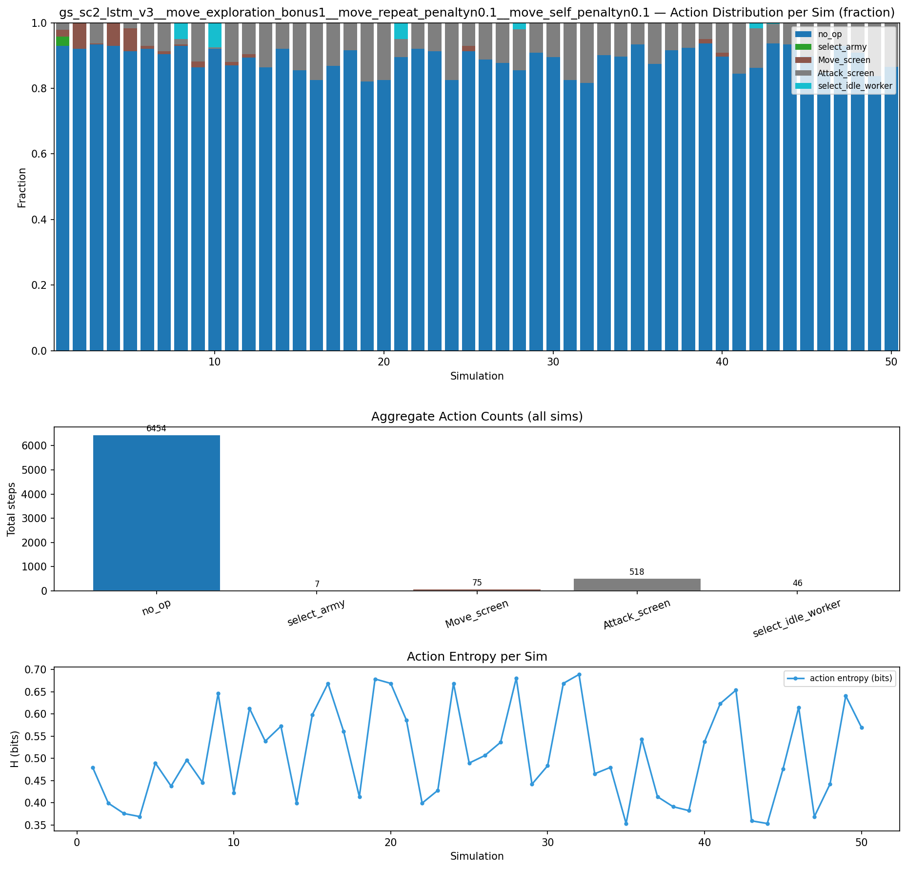
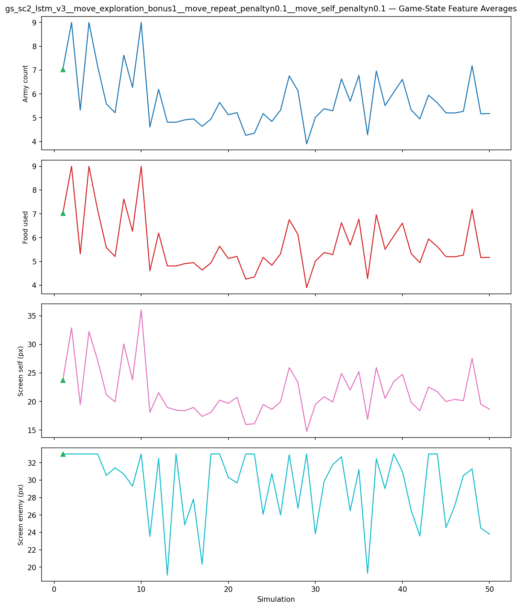
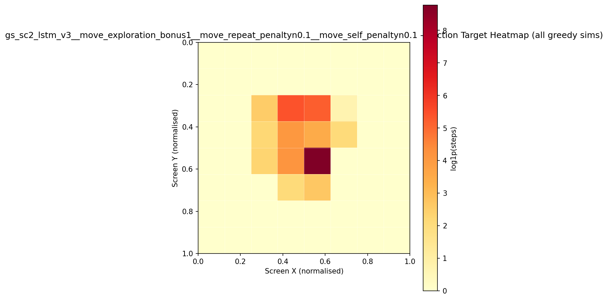
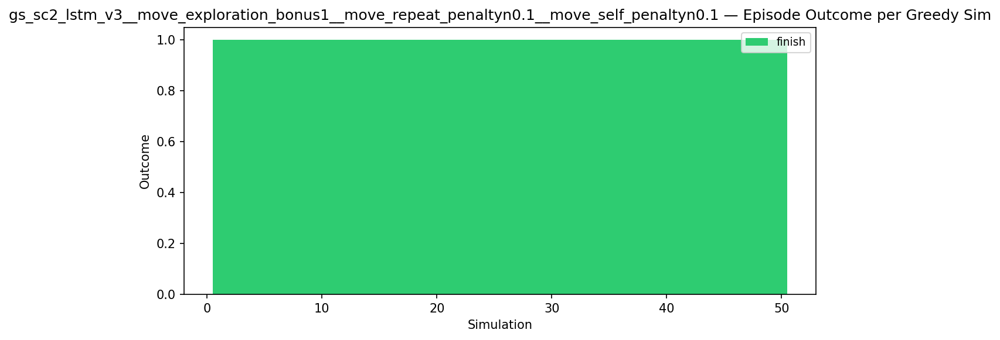
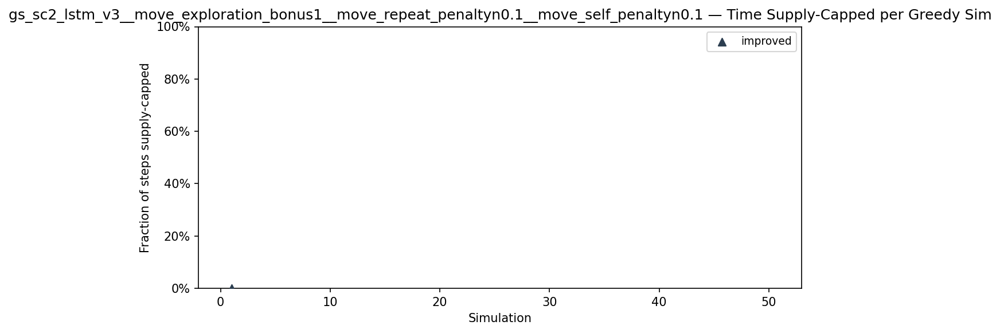
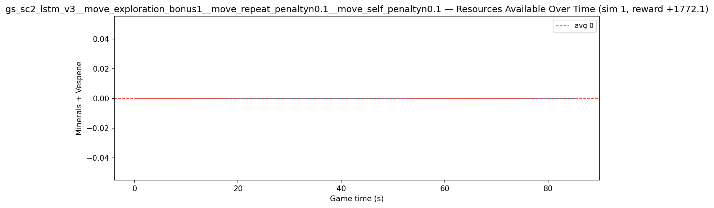
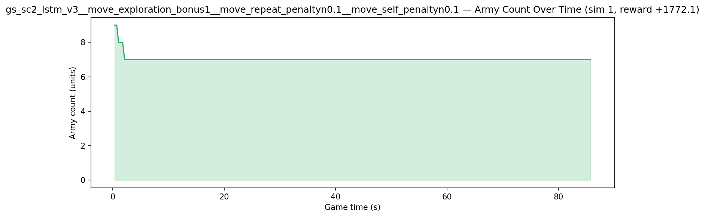
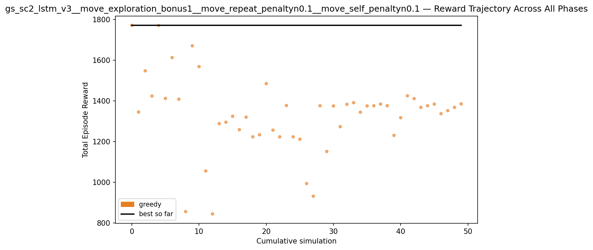

# Experiment: gs_sc2_lstm_v3__move_exploration_bonus1__move_repeat_penaltyn0.1__move_self_penaltyn0.1

**Game:** StarCraft 2

## Timings

- **Start:** 2026-05-08 07:30:58
- **End:** 2026-05-08 07:56:50
- **Total runtime:** 25m 52.2s

| Phase | Duration |
|-------|----------|
| Greedy | 25m 51.2s |

## Run Parameters

### Training

| Parameter | Value |
|-----------|-------|
| track | sc2_DefeatRoaches |
| map_name | DefeatRoaches |
| in_game_episode_s | 120.0 |
| step_mul | 8 |
| screen_size | 64 |
| minimap_size | 64 |
| max_apm | 300 |
| agent_race | random |
| n_sims | 50 |
| policy_type | lstm |
| obs_spec_preset | rich |
| enable_belief | True |
| hidden_size | 128 |
| initial_sigma | 0.1 |
| policy_params | {'population_size': 20, 'hidden_size': 128, 'initial_sigma': 0.1} |

### Reward Config

| Parameter | Value |
|-----------|-------|
| score_weight | 1.0 |
| win_bonus | 20.0 |
| loss_penalty | 0.0 |
| step_penalty | -0.001 |
| idle_penalty | 0.0 |
| idle_bonus | 1.0 |
| move_exploration_bonus | 1.0 |
| move_repeat_penalty | -0.1 |
| move_self_penalty | -0.1 |
| attack_move_bonus | 0.0 |
| click_attack_bonus | 0.0 |
| click_attack_cooldown_steps | 8 |
| attack_friendly_penalty | -5.0 |
| economy_weight | 0.0 |

## Greedy Phase

Best reward: **+1772.1**

| Sim  | Reward   | Progress | Finish Time | Mean abs lat | Reason       | Result       |
|------|----------|----------|-------------|--------------|--------------|-------------|
|    1 |  +1772.1 | 0.000    | —           | —       | finish       | **NEW BEST** |
|    2 |  +1345.4 | 0.000    | —           | —       | finish       |  |
|    3 |  +1548.0 | 0.000    | —           | —       | finish       |  |
|    4 |  +1424.0 | 0.000    | —           | —       | finish       |  |
|    5 |  +1771.3 | 0.000    | —           | —       | finish       |  |
|    6 |  +1412.3 | 0.000    | —           | —       | finish       |  |
|    7 |  +1613.3 | 0.000    | —           | —       | finish       |  |
|    8 |  +1408.5 | 0.000    | —           | —       | finish       |  |
|    9 |   +855.1 | 0.000    | —           | —       | finish       |  |
|   10 |  +1671.3 | 0.000    | —           | —       | finish       |  |
|   11 |  +1569.2 | 0.000    | —           | —       | finish       |  |
|   12 |  +1055.4 | 0.000    | —           | —       | finish       |  |
|   13 |   +843.8 | 0.000    | —           | —       | finish       |  |
|   14 |  +1288.3 | 0.000    | —           | —       | finish       |  |
|   15 |  +1295.3 | 0.000    | —           | —       | finish       |  |
|   16 |  +1324.3 | 0.000    | —           | —       | finish       |  |
|   17 |  +1258.3 | 0.000    | —           | —       | finish       |  |
|   18 |  +1320.3 | 0.000    | —           | —       | finish       |  |
|   19 |  +1223.3 | 0.000    | —           | —       | finish       |  |
|   20 |  +1233.3 | 0.000    | —           | —       | finish       |  |
|   21 |  +1485.3 | 0.000    | —           | —       | finish       |  |
|   22 |  +1256.3 | 0.000    | —           | —       | finish       |  |
|   23 |  +1223.3 | 0.000    | —           | —       | finish       |  |
|   24 |  +1377.3 | 0.000    | —           | —       | finish       |  |
|   25 |  +1223.3 | 0.000    | —           | —       | finish       |  |
|   26 |  +1211.5 | 0.000    | —           | —       | finish       |  |
|   27 |   +993.3 | 0.000    | —           | —       | finish       |  |
|   28 |   +930.9 | 0.000    | —           | —       | finish       |  |
|   29 |  +1376.3 | 0.000    | —           | —       | finish       |  |
|   30 |  +1151.3 | 0.000    | —           | —       | finish       |  |
|   31 |  +1375.3 | 0.000    | —           | —       | finish       |  |
|   32 |  +1273.3 | 0.000    | —           | —       | finish       |  |
|   33 |  +1383.3 | 0.000    | —           | —       | finish       |  |
|   34 |  +1391.3 | 0.000    | —           | —       | finish       |  |
|   35 |  +1344.3 | 0.000    | —           | —       | finish       |  |
|   36 |  +1375.3 | 0.000    | —           | —       | finish       |  |
|   37 |  +1376.3 | 0.000    | —           | —       | finish       |  |
|   38 |  +1384.3 | 0.000    | —           | —       | finish       |  |
|   39 |  +1376.3 | 0.000    | —           | —       | finish       |  |
|   40 |  +1230.3 | 0.000    | —           | —       | finish       |  |
|   41 |  +1317.3 | 0.000    | —           | —       | finish       |  |
|   42 |  +1425.3 | 0.000    | —           | —       | finish       |  |
|   43 |  +1411.3 | 0.000    | —           | —       | finish       |  |
|   44 |  +1368.3 | 0.000    | —           | —       | finish       |  |
|   45 |  +1376.3 | 0.000    | —           | —       | finish       |  |
|   46 |  +1384.3 | 0.000    | —           | —       | finish       |  |
|   47 |  +1337.3 | 0.000    | —           | —       | finish       |  |
|   48 |  +1352.3 | 0.000    | —           | —       | finish       |  |
|   49 |  +1368.3 | 0.000    | —           | —       | finish       |  |
|   50 |  +1385.3 | 0.000    | —           | —       | finish       |  |

