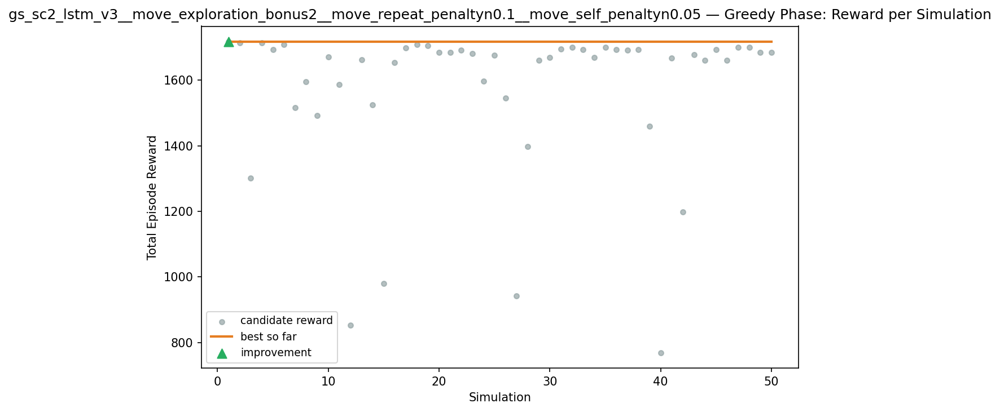
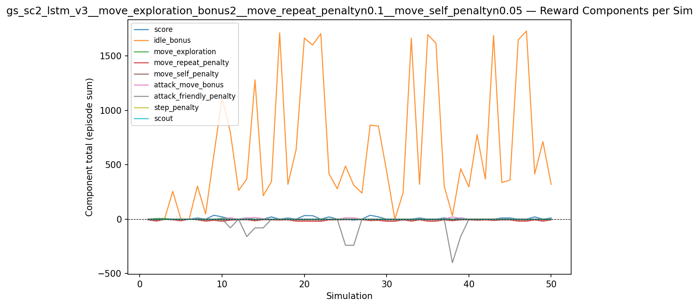
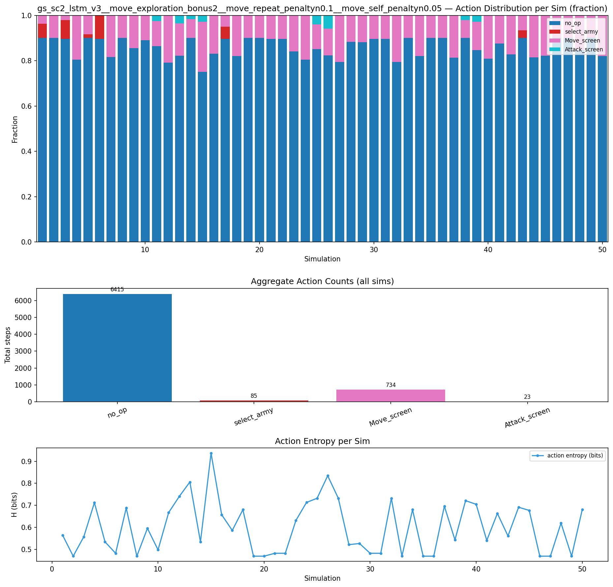
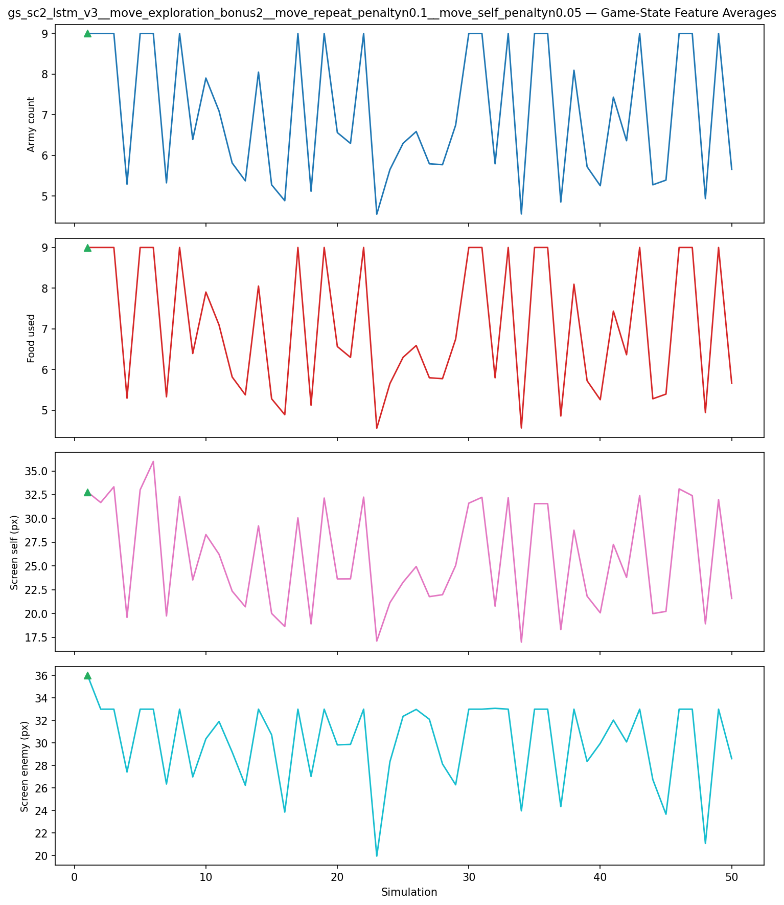
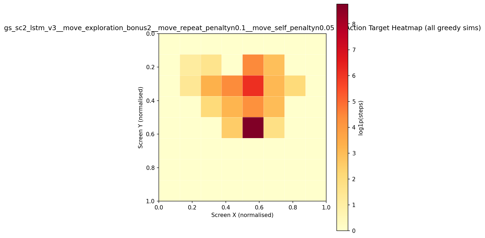
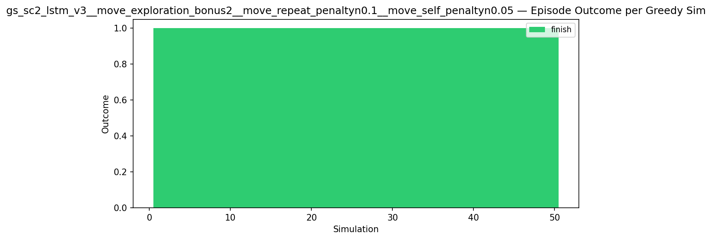
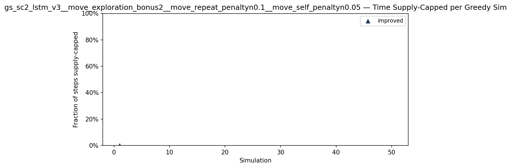
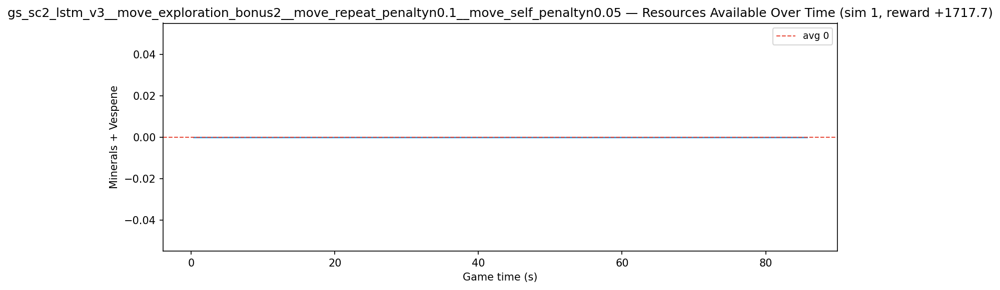
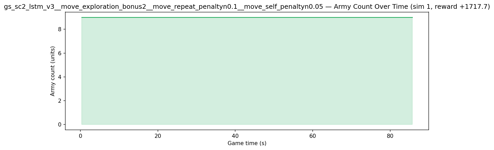
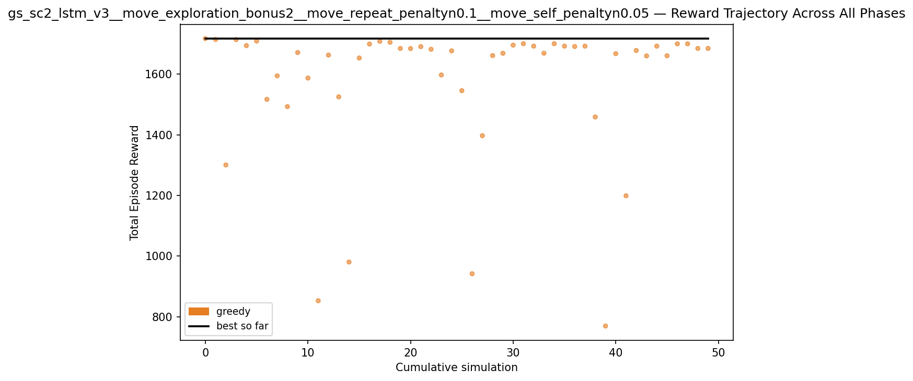

# Experiment: gs_sc2_lstm_v3__move_exploration_bonus2__move_repeat_penaltyn0.1__move_self_penaltyn0.05

**Game:** StarCraft 2

## Timings

- **Start:** 2026-05-08 14:42:43
- **End:** 2026-05-08 15:21:34
- **Total runtime:** 38m 50.8s

| Phase | Duration |
|-------|----------|
| Greedy | 38m 49.8s |

## Run Parameters

### Training

| Parameter | Value |
|-----------|-------|
| track | sc2_DefeatRoaches |
| map_name | DefeatRoaches |
| in_game_episode_s | 120.0 |
| step_mul | 8 |
| screen_size | 64 |
| minimap_size | 64 |
| max_apm | 300 |
| agent_race | random |
| n_sims | 50 |
| policy_type | lstm |
| obs_spec_preset | rich |
| enable_belief | True |
| hidden_size | 128 |
| initial_sigma | 0.1 |
| policy_params | {'population_size': 20, 'hidden_size': 128, 'initial_sigma': 0.1} |

### Reward Config

| Parameter | Value |
|-----------|-------|
| score_weight | 1.0 |
| win_bonus | 20.0 |
| loss_penalty | 0.0 |
| step_penalty | -0.001 |
| idle_penalty | 0.0 |
| idle_bonus | 1.0 |
| move_exploration_bonus | 2.0 |
| move_repeat_penalty | -0.1 |
| move_self_penalty | -0.05 |
| attack_move_bonus | 0.5 |
| click_attack_bonus | 1.0 |
| click_attack_cooldown_steps | 8 |
| attack_friendly_penalty | -10.0 |
| economy_weight | 0.001 |

## Greedy Phase

Best reward: **+1717.7**

| Sim  | Reward   | Progress | Finish Time | Mean abs lat | Reason       | Result       |
|------|----------|----------|-------------|--------------|--------------|-------------|
|    1 |  +1717.7 | 0.000    | —           | —       | finish       | **NEW BEST** |
|    2 |  +1714.9 | 0.000    | —           | —       | finish       |  |
|    3 |  +1300.7 | 0.000    | —           | —       | finish       |  |
|    4 |  +1714.4 | 0.000    | —           | —       | finish       |  |
|    5 |  +1694.5 | 0.000    | —           | —       | finish       |  |
|    6 |  +1709.7 | 0.000    | —           | —       | finish       |  |
|    7 |  +1517.3 | 0.000    | —           | —       | finish       |  |
|    8 |  +1594.9 | 0.000    | —           | —       | finish       |  |
|    9 |  +1493.3 | 0.000    | —           | —       | finish       |  |
|   10 |  +1671.7 | 0.000    | —           | —       | finish       |  |
|   11 |  +1587.6 | 0.000    | —           | —       | finish       |  |
|   12 |   +852.5 | 0.000    | —           | —       | finish       |  |
|   13 |  +1663.3 | 0.000    | —           | —       | finish       |  |
|   14 |  +1525.5 | 0.000    | —           | —       | finish       |  |
|   15 |   +980.3 | 0.000    | —           | —       | finish       |  |
|   16 |  +1653.7 | 0.000    | —           | —       | finish       |  |
|   17 |  +1699.7 | 0.000    | —           | —       | finish       |  |
|   18 |  +1708.9 | 0.000    | —           | —       | finish       |  |
|   19 |  +1705.7 | 0.000    | —           | —       | finish       |  |
|   20 |  +1685.3 | 0.000    | —           | —       | finish       |  |
|   21 |  +1684.9 | 0.000    | —           | —       | finish       |  |
|   22 |  +1691.3 | 0.000    | —           | —       | finish       |  |
|   23 |  +1682.5 | 0.000    | —           | —       | finish       |  |
|   24 |  +1597.7 | 0.000    | —           | —       | finish       |  |
|   25 |  +1677.3 | 0.000    | —           | —       | finish       |  |
|   26 |  +1545.9 | 0.000    | —           | —       | finish       |  |
|   27 |   +941.7 | 0.000    | —           | —       | finish       |  |
|   28 |  +1397.3 | 0.000    | —           | —       | finish       |  |
|   29 |  +1661.7 | 0.000    | —           | —       | finish       |  |
|   30 |  +1669.3 | 0.000    | —           | —       | finish       |  |
|   31 |  +1696.1 | 0.000    | —           | —       | finish       |  |
|   32 |  +1700.9 | 0.000    | —           | —       | finish       |  |
|   33 |  +1692.9 | 0.000    | —           | —       | finish       |  |
|   34 |  +1669.5 | 0.000    | —           | —       | finish       |  |
|   35 |  +1700.9 | 0.000    | —           | —       | finish       |  |
|   36 |  +1692.9 | 0.000    | —           | —       | finish       |  |
|   37 |  +1691.7 | 0.000    | —           | —       | finish       |  |
|   38 |  +1692.9 | 0.000    | —           | —       | finish       |  |
|   39 |  +1459.1 | 0.000    | —           | —       | finish       |  |
|   40 |   +769.1 | 0.000    | —           | —       | finish       |  |
|   41 |  +1668.1 | 0.000    | —           | —       | finish       |  |
|   42 |  +1199.0 | 0.000    | —           | —       | finish       |  |
|   43 |  +1678.5 | 0.000    | —           | —       | finish       |  |
|   44 |  +1660.5 | 0.000    | —           | —       | finish       |  |
|   45 |  +1692.9 | 0.000    | —           | —       | finish       |  |
|   46 |  +1661.1 | 0.000    | —           | —       | finish       |  |
|   47 |  +1700.5 | 0.000    | —           | —       | finish       |  |
|   48 |  +1700.5 | 0.000    | —           | —       | finish       |  |
|   49 |  +1685.3 | 0.000    | —           | —       | finish       |  |
|   50 |  +1685.3 | 0.000    | —           | —       | finish       |  |

