# Grid Search Summary: gs_sc2_lstm_v3

27 experiments.

## Rankings by Task Metrics (config-independent)

Ranked by best track progress, then by best reward.

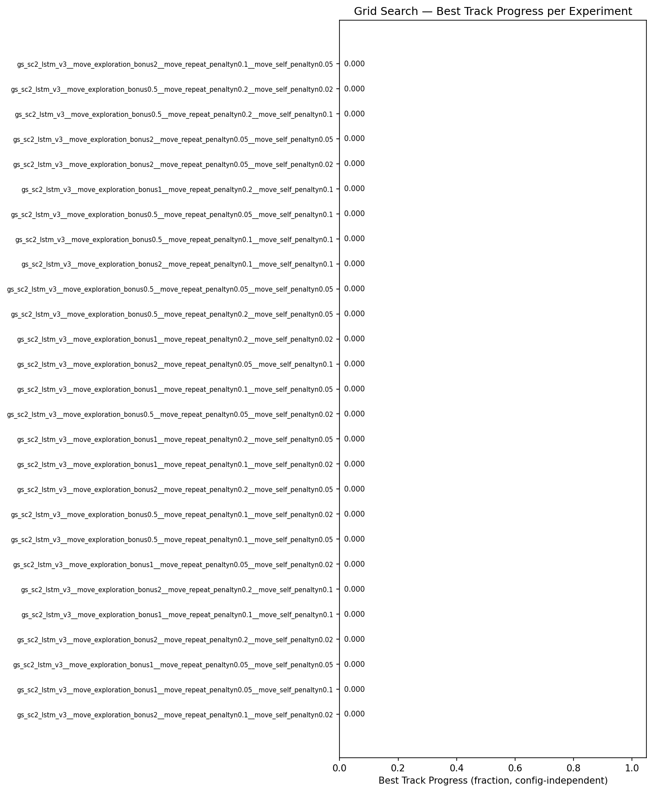

| Rank | Experiment | Best Progress | Finish Rate | Best Finish Time | Best Reward |
|------|-----------|---------------|-------------|-----------------|-------------|
| 1 | gs_sc2_lstm_v3__move_exploration_bonus2__move_repeat_penaltyn0.1__move_self_penaltyn0.02 | 0.0000 | 0.0% | — | -11.8 |
| 2 | gs_sc2_lstm_v3__move_exploration_bonus1__move_repeat_penaltyn0.05__move_self_penaltyn0.1 | 0.0000 | 0.0% | — | -17.8 |
| 3 | gs_sc2_lstm_v3__move_exploration_bonus1__move_repeat_penaltyn0.05__move_self_penaltyn0.05 | 0.0000 | 0.0% | — | -35.8 |
| 4 | gs_sc2_lstm_v3__move_exploration_bonus2__move_repeat_penaltyn0.2__move_self_penaltyn0.02 | 0.0000 | 0.0% | — | -57.8 |
| 5 | gs_sc2_lstm_v3__move_exploration_bonus1__move_repeat_penaltyn0.1__move_self_penaltyn0.1 | 0.0000 | 0.0% | — | -57.8 |
| 6 | gs_sc2_lstm_v3__move_exploration_bonus2__move_repeat_penaltyn0.2__move_self_penaltyn0.1 | 0.0000 | 0.0% | — | -57.8 |
| 7 | gs_sc2_lstm_v3__move_exploration_bonus1__move_repeat_penaltyn0.05__move_self_penaltyn0.02 | 0.0000 | 0.0% | — | -65.8 |
| 8 | gs_sc2_lstm_v3__move_exploration_bonus0.5__move_repeat_penaltyn0.1__move_self_penaltyn0.05 | 0.0000 | 0.0% | — | -65.8 |
| 9 | gs_sc2_lstm_v3__move_exploration_bonus0.5__move_repeat_penaltyn0.1__move_self_penaltyn0.02 | 0.0000 | 0.0% | — | -65.8 |
| 10 | gs_sc2_lstm_v3__move_exploration_bonus2__move_repeat_penaltyn0.2__move_self_penaltyn0.05 | 0.0000 | 0.0% | — | -65.8 |
| 11 | gs_sc2_lstm_v3__move_exploration_bonus1__move_repeat_penaltyn0.1__move_self_penaltyn0.02 | 0.0000 | 0.0% | — | -67.8 |
| 12 | gs_sc2_lstm_v3__move_exploration_bonus1__move_repeat_penaltyn0.2__move_self_penaltyn0.05 | 0.0000 | 0.0% | — | -73.8 |
| 13 | gs_sc2_lstm_v3__move_exploration_bonus0.5__move_repeat_penaltyn0.05__move_self_penaltyn0.02 | 0.0000 | 0.0% | — | -75.8 |
| 14 | gs_sc2_lstm_v3__move_exploration_bonus1__move_repeat_penaltyn0.1__move_self_penaltyn0.05 | 0.0000 | 0.0% | — | -75.8 |
| 15 | gs_sc2_lstm_v3__move_exploration_bonus2__move_repeat_penaltyn0.05__move_self_penaltyn0.1 | 0.0000 | 0.0% | — | -75.8 |
| 16 | gs_sc2_lstm_v3__move_exploration_bonus1__move_repeat_penaltyn0.2__move_self_penaltyn0.02 | 0.0000 | 0.0% | — | -81.8 |
| 17 | gs_sc2_lstm_v3__move_exploration_bonus0.5__move_repeat_penaltyn0.2__move_self_penaltyn0.05 | 0.0000 | 0.0% | — | -87.8 |
| 18 | gs_sc2_lstm_v3__move_exploration_bonus0.5__move_repeat_penaltyn0.05__move_self_penaltyn0.05 | 0.0000 | 0.0% | — | -89.8 |
| 19 | gs_sc2_lstm_v3__move_exploration_bonus2__move_repeat_penaltyn0.1__move_self_penaltyn0.1 | 0.0000 | 0.0% | — | -89.8 |
| 20 | gs_sc2_lstm_v3__move_exploration_bonus0.5__move_repeat_penaltyn0.1__move_self_penaltyn0.1 | 0.0000 | 0.0% | — | -99.8 |
| 21 | gs_sc2_lstm_v3__move_exploration_bonus0.5__move_repeat_penaltyn0.05__move_self_penaltyn0.1 | 0.0000 | 0.0% | — | -99.8 |
| 22 | gs_sc2_lstm_v3__move_exploration_bonus1__move_repeat_penaltyn0.2__move_self_penaltyn0.1 | 0.0000 | 0.0% | — | -99.8 |
| 23 | gs_sc2_lstm_v3__move_exploration_bonus2__move_repeat_penaltyn0.05__move_self_penaltyn0.02 | 0.0000 | 0.0% | — | -99.8 |
| 24 | gs_sc2_lstm_v3__move_exploration_bonus2__move_repeat_penaltyn0.05__move_self_penaltyn0.05 | 0.0000 | 0.0% | — | -111.8 |
| 25 | gs_sc2_lstm_v3__move_exploration_bonus0.5__move_repeat_penaltyn0.2__move_self_penaltyn0.1 | 0.0000 | 0.0% | — | -121.8 |
| 26 | gs_sc2_lstm_v3__move_exploration_bonus0.5__move_repeat_penaltyn0.2__move_self_penaltyn0.02 | 0.0000 | 0.0% | — | -131.8 |
| 27 | gs_sc2_lstm_v3__move_exploration_bonus2__move_repeat_penaltyn0.1__move_self_penaltyn0.05 | 0.0000 | 0.0% | — | -131.8 |

## Rankings by Reward

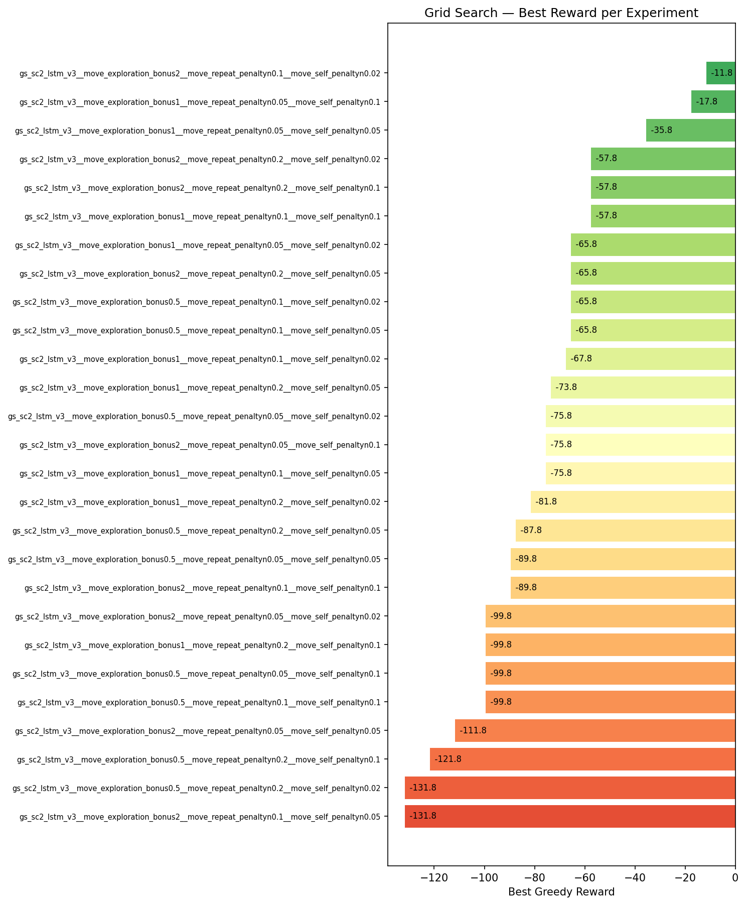

| Rank | Experiment | Best Reward | Improvements | First Improv. Sim | Accel % | Greedy Time |
|------|-----------|-------------|--------------|-------------------|---------|-------------|
| 1 | gs_sc2_lstm_v3__move_exploration_bonus2__move_repeat_penaltyn0.1__move_self_penaltyn0.02 | -11.8 | 10 | 1 | 0% | 36m 19.4s |
| 2 | gs_sc2_lstm_v3__move_exploration_bonus1__move_repeat_penaltyn0.05__move_self_penaltyn0.1 | -17.8 | 6 | 1 | 0% | 37m 28.8s |
| 3 | gs_sc2_lstm_v3__move_exploration_bonus1__move_repeat_penaltyn0.05__move_self_penaltyn0.05 | -35.8 | 3 | 1 | 0% | 42m 09.4s |
| 4 | gs_sc2_lstm_v3__move_exploration_bonus2__move_repeat_penaltyn0.2__move_self_penaltyn0.02 | -57.8 | 6 | 1 | 0% | 42m 49.9s |
| 5 | gs_sc2_lstm_v3__move_exploration_bonus1__move_repeat_penaltyn0.1__move_self_penaltyn0.1 | -57.8 | 1 | 1 | 0% | 25m 51.2s |
| 6 | gs_sc2_lstm_v3__move_exploration_bonus2__move_repeat_penaltyn0.2__move_self_penaltyn0.1 | -57.8 | 10 | 1 | 0% | 39m 17.6s |
| 7 | gs_sc2_lstm_v3__move_exploration_bonus1__move_repeat_penaltyn0.05__move_self_penaltyn0.02 | -65.8 | 6 | 1 | 0% | 46m 19.0s |
| 8 | gs_sc2_lstm_v3__move_exploration_bonus0.5__move_repeat_penaltyn0.1__move_self_penaltyn0.05 | -65.8 | 4 | 1 | 0% | 54m 34.0s |
| 9 | gs_sc2_lstm_v3__move_exploration_bonus0.5__move_repeat_penaltyn0.1__move_self_penaltyn0.02 | -65.8 | 4 | 1 | 0% | 45m 01.1s |
| 10 | gs_sc2_lstm_v3__move_exploration_bonus2__move_repeat_penaltyn0.2__move_self_penaltyn0.05 | -65.8 | 3 | 1 | 0% | 52m 41.3s |
| 11 | gs_sc2_lstm_v3__move_exploration_bonus1__move_repeat_penaltyn0.1__move_self_penaltyn0.02 | -67.8 | 3 | 1 | 0% | 53m 40.9s |
| 12 | gs_sc2_lstm_v3__move_exploration_bonus1__move_repeat_penaltyn0.2__move_self_penaltyn0.05 | -73.8 | 4 | 1 | 0% | 48m 03.5s |
| 13 | gs_sc2_lstm_v3__move_exploration_bonus0.5__move_repeat_penaltyn0.05__move_self_penaltyn0.02 | -75.8 | 5 | 1 | 0% | 47m 16.0s |
| 14 | gs_sc2_lstm_v3__move_exploration_bonus1__move_repeat_penaltyn0.1__move_self_penaltyn0.05 | -75.8 | 11 | 1 | 0% | 39m 29.2s |
| 15 | gs_sc2_lstm_v3__move_exploration_bonus2__move_repeat_penaltyn0.05__move_self_penaltyn0.1 | -75.8 | 6 | 1 | 0% | 44m 36.4s |
| 16 | gs_sc2_lstm_v3__move_exploration_bonus1__move_repeat_penaltyn0.2__move_self_penaltyn0.02 | -81.8 | 2 | 1 | 0% | 41m 12.3s |
| 17 | gs_sc2_lstm_v3__move_exploration_bonus0.5__move_repeat_penaltyn0.2__move_self_penaltyn0.05 | -87.8 | 4 | 1 | 0% | 41m 00.4s |
| 18 | gs_sc2_lstm_v3__move_exploration_bonus0.5__move_repeat_penaltyn0.05__move_self_penaltyn0.05 | -89.8 | 5 | 1 | 0% | 46m 48.4s |
| 19 | gs_sc2_lstm_v3__move_exploration_bonus2__move_repeat_penaltyn0.1__move_self_penaltyn0.1 | -89.8 | 5 | 1 | 0% | 49m 42.5s |
| 20 | gs_sc2_lstm_v3__move_exploration_bonus0.5__move_repeat_penaltyn0.1__move_self_penaltyn0.1 | -99.8 | 5 | 1 | 0% | 43m 47.6s |
| 21 | gs_sc2_lstm_v3__move_exploration_bonus0.5__move_repeat_penaltyn0.05__move_self_penaltyn0.1 | -99.8 | 3 | 1 | 0% | 50m 23.0s |
| 22 | gs_sc2_lstm_v3__move_exploration_bonus1__move_repeat_penaltyn0.2__move_self_penaltyn0.1 | -99.8 | 5 | 1 | 0% | 46m 23.8s |
| 23 | gs_sc2_lstm_v3__move_exploration_bonus2__move_repeat_penaltyn0.05__move_self_penaltyn0.02 | -99.8 | 10 | 1 | 0% | 37m 02.2s |
| 24 | gs_sc2_lstm_v3__move_exploration_bonus2__move_repeat_penaltyn0.05__move_self_penaltyn0.05 | -111.8 | 8 | 1 | 0% | 49m 17.4s |
| 25 | gs_sc2_lstm_v3__move_exploration_bonus0.5__move_repeat_penaltyn0.2__move_self_penaltyn0.1 | -121.8 | 1 | 1 | 0% | 37m 36.2s |
| 26 | gs_sc2_lstm_v3__move_exploration_bonus0.5__move_repeat_penaltyn0.2__move_self_penaltyn0.02 | -131.8 | 4 | 1 | 0% | 41m 08.0s |
| 27 | gs_sc2_lstm_v3__move_exploration_bonus2__move_repeat_penaltyn0.1__move_self_penaltyn0.05 | -131.8 | 1 | 1 | 0% | 38m 49.8s |

---

## 1. gs_sc2_lstm_v3__move_exploration_bonus2__move_repeat_penaltyn0.1__move_self_penaltyn0.02

**Best reward: -11.8** | **Best progress: 0.0000** | **Finish rate: 0.0%**

| Param | Value |
|---|---|
| `move_exploration_bonus` | 2.0 |
| `move_repeat_penalty` | -0.1 |
| `move_self_penalty` | -0.02 |

| Stat | Value |
|---|---|
| Best track progress | 0.0000 |
| Finish rate | 0.0% |
| Best finish time | — |
| Greedy improvements | 10 |
| First improvement (sim) | 1 |
| Accel % of best run | 0.0% |
| Greedy runtime | 36m 19.4s |

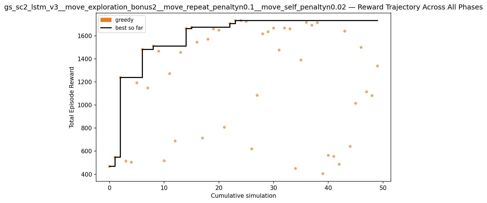

---

## 2. gs_sc2_lstm_v3__move_exploration_bonus1__move_repeat_penaltyn0.05__move_self_penaltyn0.1

**Best reward: -17.8** | **Best progress: 0.0000** | **Finish rate: 0.0%**

| Param | Value |
|---|---|
| `move_exploration_bonus` | 1.0 |
| `move_repeat_penalty` | -0.05 |
| `move_self_penalty` | -0.1 |

| Stat | Value |
|---|---|
| Best track progress | 0.0000 |
| Finish rate | 0.0% |
| Best finish time | — |
| Greedy improvements | 6 |
| First improvement (sim) | 1 |
| Accel % of best run | 0.0% |
| Greedy runtime | 37m 28.8s |

---

## 3. gs_sc2_lstm_v3__move_exploration_bonus1__move_repeat_penaltyn0.05__move_self_penaltyn0.05

**Best reward: -35.8** | **Best progress: 0.0000** | **Finish rate: 0.0%**

| Param | Value |
|---|---|
| `move_exploration_bonus` | 1.0 |
| `move_repeat_penalty` | -0.05 |
| `move_self_penalty` | -0.05 |

| Stat | Value |
|---|---|
| Best track progress | 0.0000 |
| Finish rate | 0.0% |
| Best finish time | — |
| Greedy improvements | 3 |
| First improvement (sim) | 1 |
| Accel % of best run | 0.0% |
| Greedy runtime | 42m 09.4s |

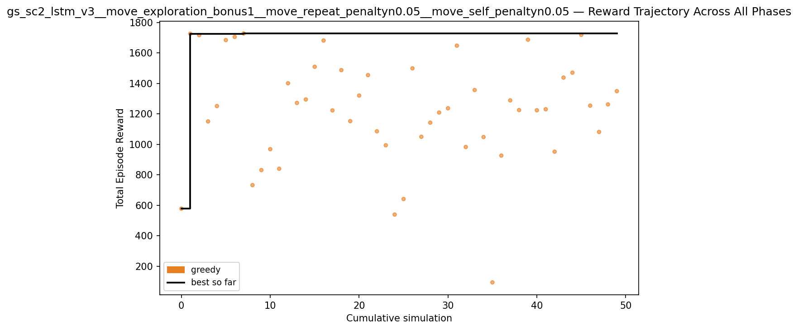

---

## 4. gs_sc2_lstm_v3__move_exploration_bonus2__move_repeat_penaltyn0.2__move_self_penaltyn0.02

**Best reward: -57.8** | **Best progress: 0.0000** | **Finish rate: 0.0%**

| Param | Value |
|---|---|
| `move_exploration_bonus` | 2.0 |
| `move_repeat_penalty` | -0.2 |
| `move_self_penalty` | -0.02 |

| Stat | Value |
|---|---|
| Best track progress | 0.0000 |
| Finish rate | 0.0% |
| Best finish time | — |
| Greedy improvements | 6 |
| First improvement (sim) | 1 |
| Accel % of best run | 0.0% |
| Greedy runtime | 42m 49.9s |

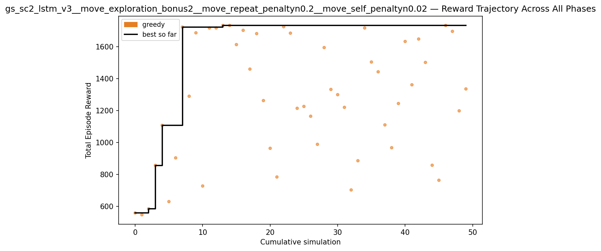

---

## 5. gs_sc2_lstm_v3__move_exploration_bonus1__move_repeat_penaltyn0.1__move_self_penaltyn0.1

**Best reward: -57.8** | **Best progress: 0.0000** | **Finish rate: 0.0%**

| Param | Value |
|---|---|
| `move_exploration_bonus` | 1.0 |
| `move_repeat_penalty` | -0.1 |
| `move_self_penalty` | -0.1 |

| Stat | Value |
|---|---|
| Best track progress | 0.0000 |
| Finish rate | 0.0% |
| Best finish time | — |
| Greedy improvements | 1 |
| First improvement (sim) | 1 |
| Accel % of best run | 0.0% |
| Greedy runtime | 25m 51.2s |

---

## 6. gs_sc2_lstm_v3__move_exploration_bonus2__move_repeat_penaltyn0.2__move_self_penaltyn0.1

**Best reward: -57.8** | **Best progress: 0.0000** | **Finish rate: 0.0%**

| Param | Value |
|---|---|
| `move_exploration_bonus` | 2.0 |
| `move_repeat_penalty` | -0.2 |
| `move_self_penalty` | -0.1 |

| Stat | Value |
|---|---|
| Best track progress | 0.0000 |
| Finish rate | 0.0% |
| Best finish time | — |
| Greedy improvements | 10 |
| First improvement (sim) | 1 |
| Accel % of best run | 0.0% |
| Greedy runtime | 39m 17.6s |

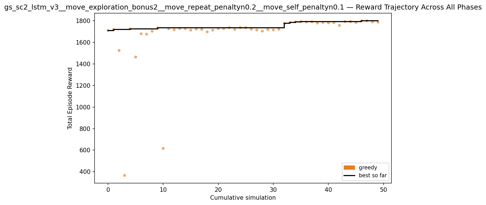

---

## 7. gs_sc2_lstm_v3__move_exploration_bonus1__move_repeat_penaltyn0.05__move_self_penaltyn0.02

**Best reward: -65.8** | **Best progress: 0.0000** | **Finish rate: 0.0%**

| Param | Value |
|---|---|
| `move_exploration_bonus` | 1.0 |
| `move_repeat_penalty` | -0.05 |
| `move_self_penalty` | -0.02 |

| Stat | Value |
|---|---|
| Best track progress | 0.0000 |
| Finish rate | 0.0% |
| Best finish time | — |
| Greedy improvements | 6 |
| First improvement (sim) | 1 |
| Accel % of best run | 0.0% |
| Greedy runtime | 46m 19.0s |

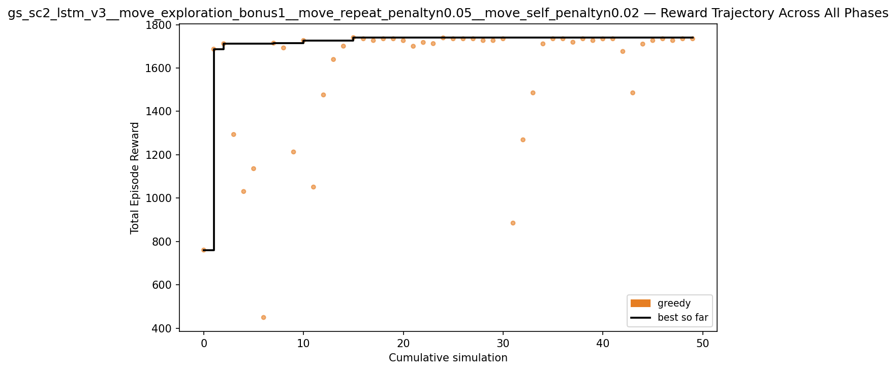

---

## 8. gs_sc2_lstm_v3__move_exploration_bonus0.5__move_repeat_penaltyn0.1__move_self_penaltyn0.05

**Best reward: -65.8** | **Best progress: 0.0000** | **Finish rate: 0.0%**

| Param | Value |
|---|---|
| `move_exploration_bonus` | 0.5 |
| `move_repeat_penalty` | -0.1 |
| `move_self_penalty` | -0.05 |

| Stat | Value |
|---|---|
| Best track progress | 0.0000 |
| Finish rate | 0.0% |
| Best finish time | — |
| Greedy improvements | 4 |
| First improvement (sim) | 1 |
| Accel % of best run | 0.0% |
| Greedy runtime | 54m 34.0s |

---

## 9. gs_sc2_lstm_v3__move_exploration_bonus0.5__move_repeat_penaltyn0.1__move_self_penaltyn0.02

**Best reward: -65.8** | **Best progress: 0.0000** | **Finish rate: 0.0%**

| Param | Value |
|---|---|
| `move_exploration_bonus` | 0.5 |
| `move_repeat_penalty` | -0.1 |
| `move_self_penalty` | -0.02 |

| Stat | Value |
|---|---|
| Best track progress | 0.0000 |
| Finish rate | 0.0% |
| Best finish time | — |
| Greedy improvements | 4 |
| First improvement (sim) | 1 |
| Accel % of best run | 0.0% |
| Greedy runtime | 45m 01.1s |

---

## 10. gs_sc2_lstm_v3__move_exploration_bonus2__move_repeat_penaltyn0.2__move_self_penaltyn0.05

**Best reward: -65.8** | **Best progress: 0.0000** | **Finish rate: 0.0%**

| Param | Value |
|---|---|
| `move_exploration_bonus` | 2.0 |
| `move_repeat_penalty` | -0.2 |
| `move_self_penalty` | -0.05 |

| Stat | Value |
|---|---|
| Best track progress | 0.0000 |
| Finish rate | 0.0% |
| Best finish time | — |
| Greedy improvements | 3 |
| First improvement (sim) | 1 |
| Accel % of best run | 0.0% |
| Greedy runtime | 52m 41.3s |

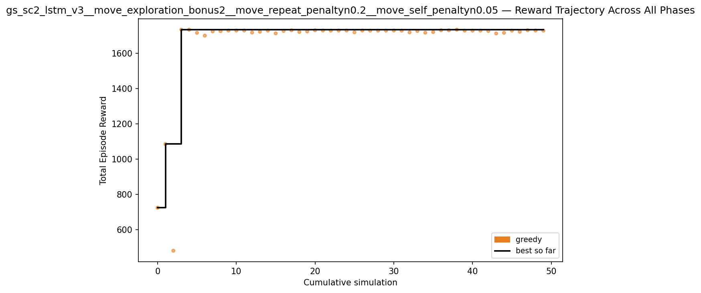

---

## 11. gs_sc2_lstm_v3__move_exploration_bonus1__move_repeat_penaltyn0.1__move_self_penaltyn0.02

**Best reward: -67.8** | **Best progress: 0.0000** | **Finish rate: 0.0%**

| Param | Value |
|---|---|
| `move_exploration_bonus` | 1.0 |
| `move_repeat_penalty` | -0.1 |
| `move_self_penalty` | -0.02 |

| Stat | Value |
|---|---|
| Best track progress | 0.0000 |
| Finish rate | 0.0% |
| Best finish time | — |
| Greedy improvements | 3 |
| First improvement (sim) | 1 |
| Accel % of best run | 0.0% |
| Greedy runtime | 53m 40.9s |

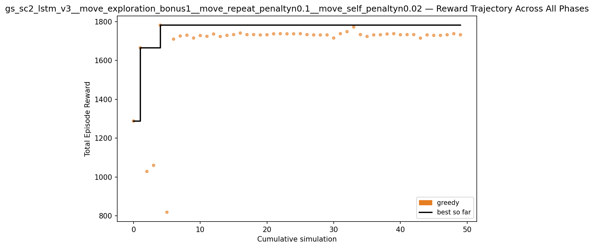

---

## 12. gs_sc2_lstm_v3__move_exploration_bonus1__move_repeat_penaltyn0.2__move_self_penaltyn0.05

**Best reward: -73.8** | **Best progress: 0.0000** | **Finish rate: 0.0%**

| Param | Value |
|---|---|
| `move_exploration_bonus` | 1.0 |
| `move_repeat_penalty` | -0.2 |
| `move_self_penalty` | -0.05 |

| Stat | Value |
|---|---|
| Best track progress | 0.0000 |
| Finish rate | 0.0% |
| Best finish time | — |
| Greedy improvements | 4 |
| First improvement (sim) | 1 |
| Accel % of best run | 0.0% |
| Greedy runtime | 48m 03.5s |

---

## 13. gs_sc2_lstm_v3__move_exploration_bonus0.5__move_repeat_penaltyn0.05__move_self_penaltyn0.02

**Best reward: -75.8** | **Best progress: 0.0000** | **Finish rate: 0.0%**

| Param | Value |
|---|---|
| `move_exploration_bonus` | 0.5 |
| `move_repeat_penalty` | -0.05 |
| `move_self_penalty` | -0.02 |

| Stat | Value |
|---|---|
| Best track progress | 0.0000 |
| Finish rate | 0.0% |
| Best finish time | — |
| Greedy improvements | 5 |
| First improvement (sim) | 1 |
| Accel % of best run | 0.0% |
| Greedy runtime | 47m 16.0s |

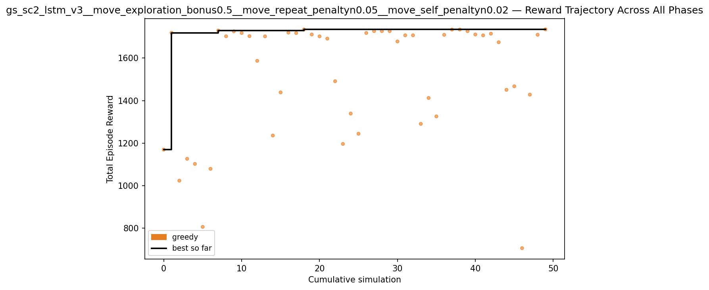

---

## 14. gs_sc2_lstm_v3__move_exploration_bonus1__move_repeat_penaltyn0.1__move_self_penaltyn0.05

**Best reward: -75.8** | **Best progress: 0.0000** | **Finish rate: 0.0%**

| Param | Value |
|---|---|
| `move_exploration_bonus` | 1.0 |
| `move_repeat_penalty` | -0.1 |
| `move_self_penalty` | -0.05 |

| Stat | Value |
|---|---|
| Best track progress | 0.0000 |
| Finish rate | 0.0% |
| Best finish time | — |
| Greedy improvements | 11 |
| First improvement (sim) | 1 |
| Accel % of best run | 0.0% |
| Greedy runtime | 39m 29.2s |

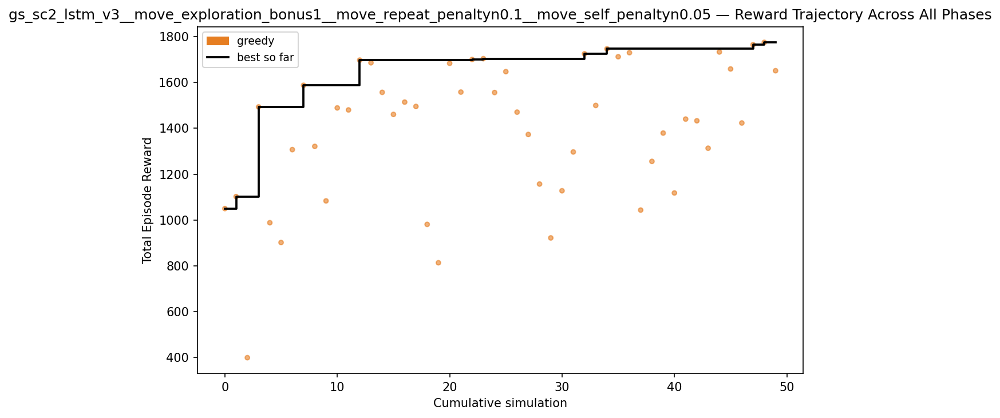

---

## 15. gs_sc2_lstm_v3__move_exploration_bonus2__move_repeat_penaltyn0.05__move_self_penaltyn0.1

**Best reward: -75.8** | **Best progress: 0.0000** | **Finish rate: 0.0%**

| Param | Value |
|---|---|
| `move_exploration_bonus` | 2.0 |
| `move_repeat_penalty` | -0.05 |
| `move_self_penalty` | -0.1 |

| Stat | Value |
|---|---|
| Best track progress | 0.0000 |
| Finish rate | 0.0% |
| Best finish time | — |
| Greedy improvements | 6 |
| First improvement (sim) | 1 |
| Accel % of best run | 0.0% |
| Greedy runtime | 44m 36.4s |

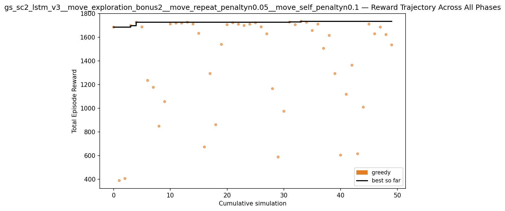

---

## 16. gs_sc2_lstm_v3__move_exploration_bonus1__move_repeat_penaltyn0.2__move_self_penaltyn0.02

**Best reward: -81.8** | **Best progress: 0.0000** | **Finish rate: 0.0%**

| Param | Value |
|---|---|
| `move_exploration_bonus` | 1.0 |
| `move_repeat_penalty` | -0.2 |
| `move_self_penalty` | -0.02 |

| Stat | Value |
|---|---|
| Best track progress | 0.0000 |
| Finish rate | 0.0% |
| Best finish time | — |
| Greedy improvements | 2 |
| First improvement (sim) | 1 |
| Accel % of best run | 0.0% |
| Greedy runtime | 41m 12.3s |

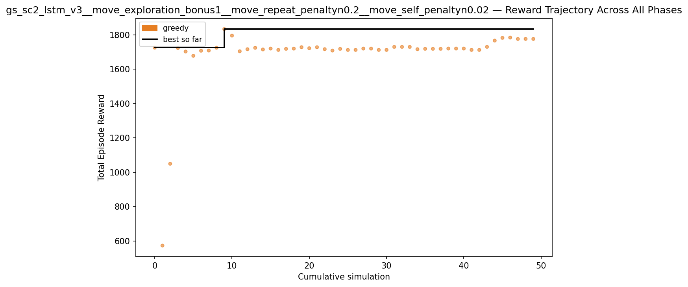

---

## 17. gs_sc2_lstm_v3__move_exploration_bonus0.5__move_repeat_penaltyn0.2__move_self_penaltyn0.05

**Best reward: -87.8** | **Best progress: 0.0000** | **Finish rate: 0.0%**

| Param | Value |
|---|---|
| `move_exploration_bonus` | 0.5 |
| `move_repeat_penalty` | -0.2 |
| `move_self_penalty` | -0.05 |

| Stat | Value |
|---|---|
| Best track progress | 0.0000 |
| Finish rate | 0.0% |
| Best finish time | — |
| Greedy improvements | 4 |
| First improvement (sim) | 1 |
| Accel % of best run | 0.0% |
| Greedy runtime | 41m 00.4s |

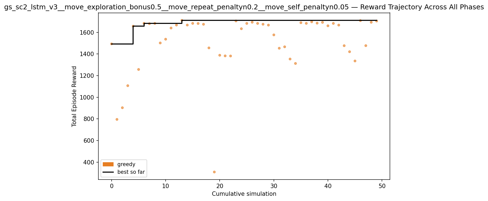

---

## 18. gs_sc2_lstm_v3__move_exploration_bonus0.5__move_repeat_penaltyn0.05__move_self_penaltyn0.05

**Best reward: -89.8** | **Best progress: 0.0000** | **Finish rate: 0.0%**

| Param | Value |
|---|---|
| `move_exploration_bonus` | 0.5 |
| `move_repeat_penalty` | -0.05 |
| `move_self_penalty` | -0.05 |

| Stat | Value |
|---|---|
| Best track progress | 0.0000 |
| Finish rate | 0.0% |
| Best finish time | — |
| Greedy improvements | 5 |
| First improvement (sim) | 1 |
| Accel % of best run | 0.0% |
| Greedy runtime | 46m 48.4s |

---

## 19. gs_sc2_lstm_v3__move_exploration_bonus2__move_repeat_penaltyn0.1__move_self_penaltyn0.1

**Best reward: -89.8** | **Best progress: 0.0000** | **Finish rate: 0.0%**

| Param | Value |
|---|---|
| `move_exploration_bonus` | 2.0 |
| `move_repeat_penalty` | -0.1 |
| `move_self_penalty` | -0.1 |

| Stat | Value |
|---|---|
| Best track progress | 0.0000 |
| Finish rate | 0.0% |
| Best finish time | — |
| Greedy improvements | 5 |
| First improvement (sim) | 1 |
| Accel % of best run | 0.0% |
| Greedy runtime | 49m 42.5s |

---

## 20. gs_sc2_lstm_v3__move_exploration_bonus0.5__move_repeat_penaltyn0.1__move_self_penaltyn0.1

**Best reward: -99.8** | **Best progress: 0.0000** | **Finish rate: 0.0%**

| Param | Value |
|---|---|
| `move_exploration_bonus` | 0.5 |
| `move_repeat_penalty` | -0.1 |
| `move_self_penalty` | -0.1 |

| Stat | Value |
|---|---|
| Best track progress | 0.0000 |
| Finish rate | 0.0% |
| Best finish time | — |
| Greedy improvements | 5 |
| First improvement (sim) | 1 |
| Accel % of best run | 0.0% |
| Greedy runtime | 43m 47.6s |

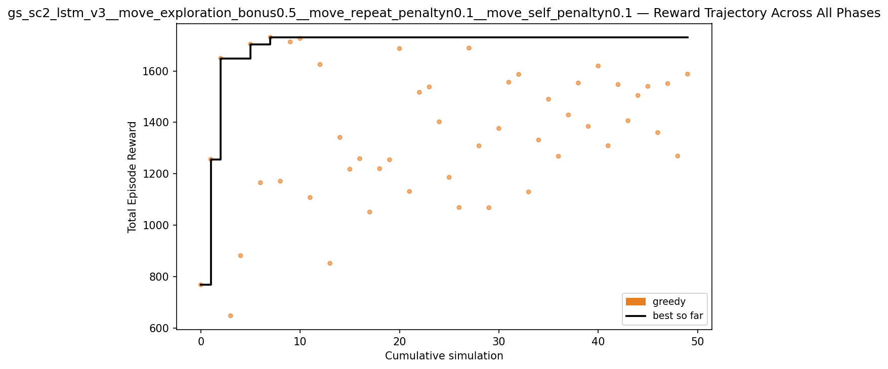

---

## 21. gs_sc2_lstm_v3__move_exploration_bonus0.5__move_repeat_penaltyn0.05__move_self_penaltyn0.1

**Best reward: -99.8** | **Best progress: 0.0000** | **Finish rate: 0.0%**

| Param | Value |
|---|---|
| `move_exploration_bonus` | 0.5 |
| `move_repeat_penalty` | -0.05 |
| `move_self_penalty` | -0.1 |

| Stat | Value |
|---|---|
| Best track progress | 0.0000 |
| Finish rate | 0.0% |
| Best finish time | — |
| Greedy improvements | 3 |
| First improvement (sim) | 1 |
| Accel % of best run | 0.0% |
| Greedy runtime | 50m 23.0s |

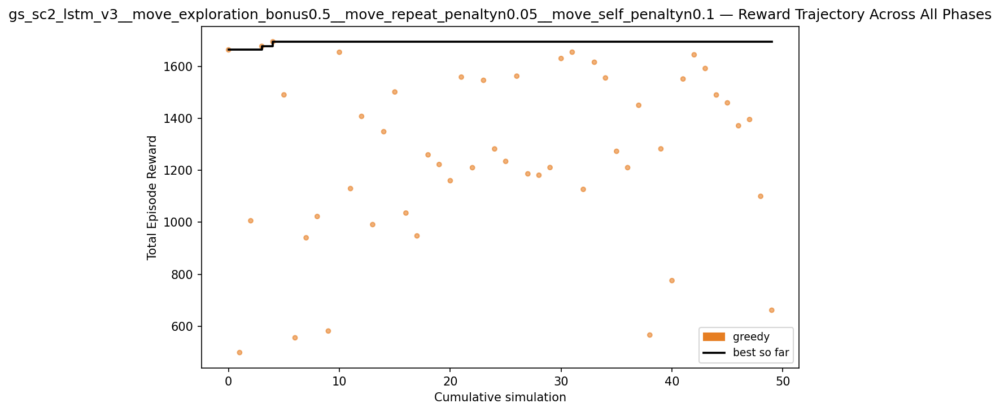

---

## 22. gs_sc2_lstm_v3__move_exploration_bonus1__move_repeat_penaltyn0.2__move_self_penaltyn0.1

**Best reward: -99.8** | **Best progress: 0.0000** | **Finish rate: 0.0%**

| Param | Value |
|---|---|
| `move_exploration_bonus` | 1.0 |
| `move_repeat_penalty` | -0.2 |
| `move_self_penalty` | -0.1 |

| Stat | Value |
|---|---|
| Best track progress | 0.0000 |
| Finish rate | 0.0% |
| Best finish time | — |
| Greedy improvements | 5 |
| First improvement (sim) | 1 |
| Accel % of best run | 0.0% |
| Greedy runtime | 46m 23.8s |

---

## 23. gs_sc2_lstm_v3__move_exploration_bonus2__move_repeat_penaltyn0.05__move_self_penaltyn0.02

**Best reward: -99.8** | **Best progress: 0.0000** | **Finish rate: 0.0%**

| Param | Value |
|---|---|
| `move_exploration_bonus` | 2.0 |
| `move_repeat_penalty` | -0.05 |
| `move_self_penalty` | -0.02 |

| Stat | Value |
|---|---|
| Best track progress | 0.0000 |
| Finish rate | 0.0% |
| Best finish time | — |
| Greedy improvements | 10 |
| First improvement (sim) | 1 |
| Accel % of best run | 0.0% |
| Greedy runtime | 37m 02.2s |

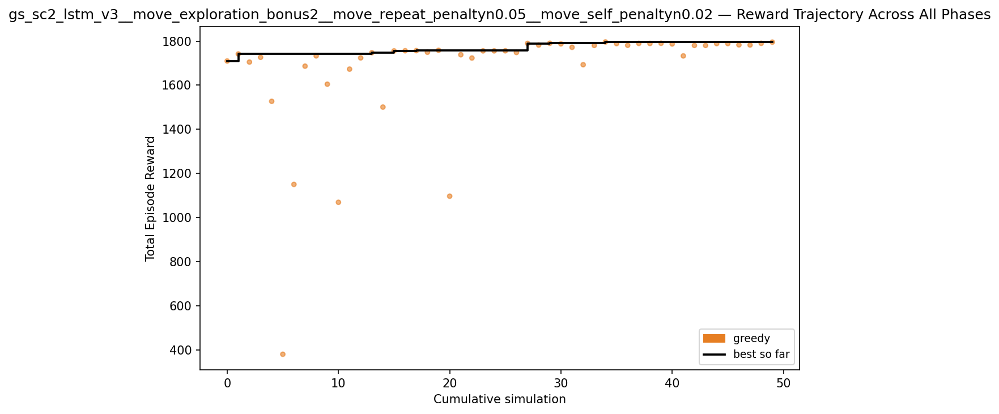

---

## 24. gs_sc2_lstm_v3__move_exploration_bonus2__move_repeat_penaltyn0.05__move_self_penaltyn0.05

**Best reward: -111.8** | **Best progress: 0.0000** | **Finish rate: 0.0%**

| Param | Value |
|---|---|
| `move_exploration_bonus` | 2.0 |
| `move_repeat_penalty` | -0.05 |
| `move_self_penalty` | -0.05 |

| Stat | Value |
|---|---|
| Best track progress | 0.0000 |
| Finish rate | 0.0% |
| Best finish time | — |
| Greedy improvements | 8 |
| First improvement (sim) | 1 |
| Accel % of best run | 0.0% |
| Greedy runtime | 49m 17.4s |

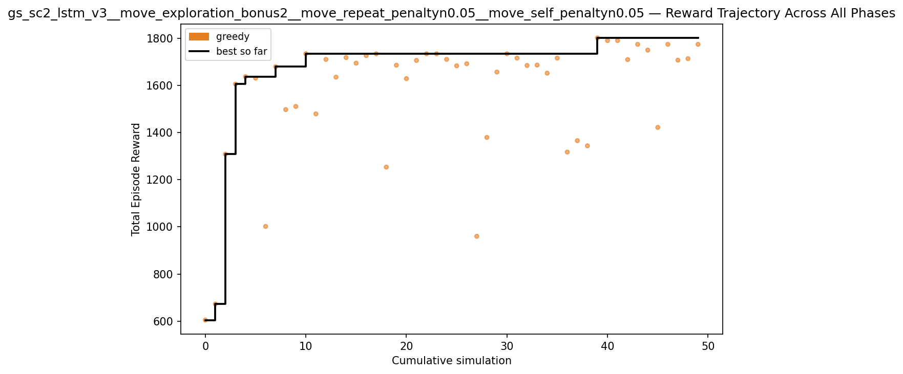

---

## 25. gs_sc2_lstm_v3__move_exploration_bonus0.5__move_repeat_penaltyn0.2__move_self_penaltyn0.1

**Best reward: -121.8** | **Best progress: 0.0000** | **Finish rate: 0.0%**

| Param | Value |
|---|---|
| `move_exploration_bonus` | 0.5 |
| `move_repeat_penalty` | -0.2 |
| `move_self_penalty` | -0.1 |

| Stat | Value |
|---|---|
| Best track progress | 0.0000 |
| Finish rate | 0.0% |
| Best finish time | — |
| Greedy improvements | 1 |
| First improvement (sim) | 1 |
| Accel % of best run | 0.0% |
| Greedy runtime | 37m 36.2s |

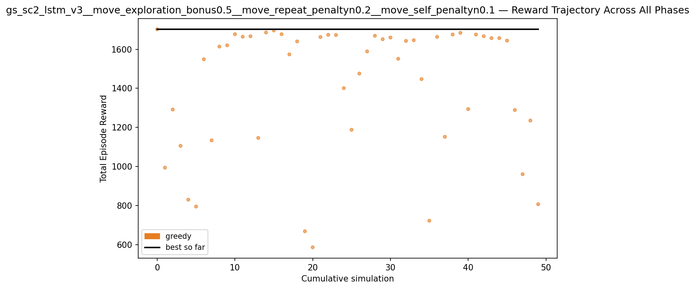

---

## 26. gs_sc2_lstm_v3__move_exploration_bonus0.5__move_repeat_penaltyn0.2__move_self_penaltyn0.02

**Best reward: -131.8** | **Best progress: 0.0000** | **Finish rate: 0.0%**

| Param | Value |
|---|---|
| `move_exploration_bonus` | 0.5 |
| `move_repeat_penalty` | -0.2 |
| `move_self_penalty` | -0.02 |

| Stat | Value |
|---|---|
| Best track progress | 0.0000 |
| Finish rate | 0.0% |
| Best finish time | — |
| Greedy improvements | 4 |
| First improvement (sim) | 1 |
| Accel % of best run | 0.0% |
| Greedy runtime | 41m 08.0s |

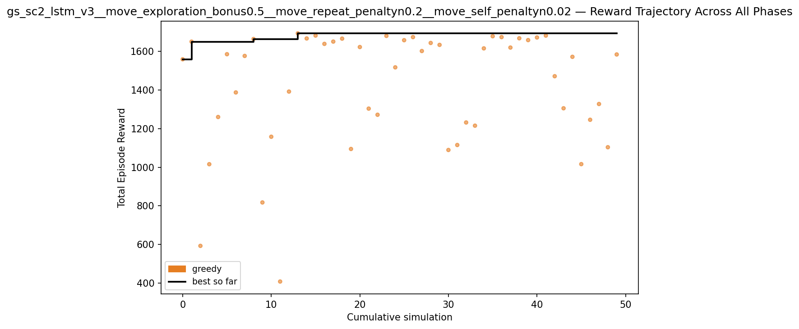

---

## 27. gs_sc2_lstm_v3__move_exploration_bonus2__move_repeat_penaltyn0.1__move_self_penaltyn0.05

**Best reward: -131.8** | **Best progress: 0.0000** | **Finish rate: 0.0%**

| Param | Value |
|---|---|
| `move_exploration_bonus` | 2.0 |
| `move_repeat_penalty` | -0.1 |
| `move_self_penalty` | -0.05 |

| Stat | Value |
|---|---|
| Best track progress | 0.0000 |
| Finish rate | 0.0% |
| Best finish time | — |
| Greedy improvements | 1 |
| First improvement (sim) | 1 |
| Accel % of best run | 0.0% |
| Greedy runtime | 38m 49.8s |

## SC2-specific cross-run charts

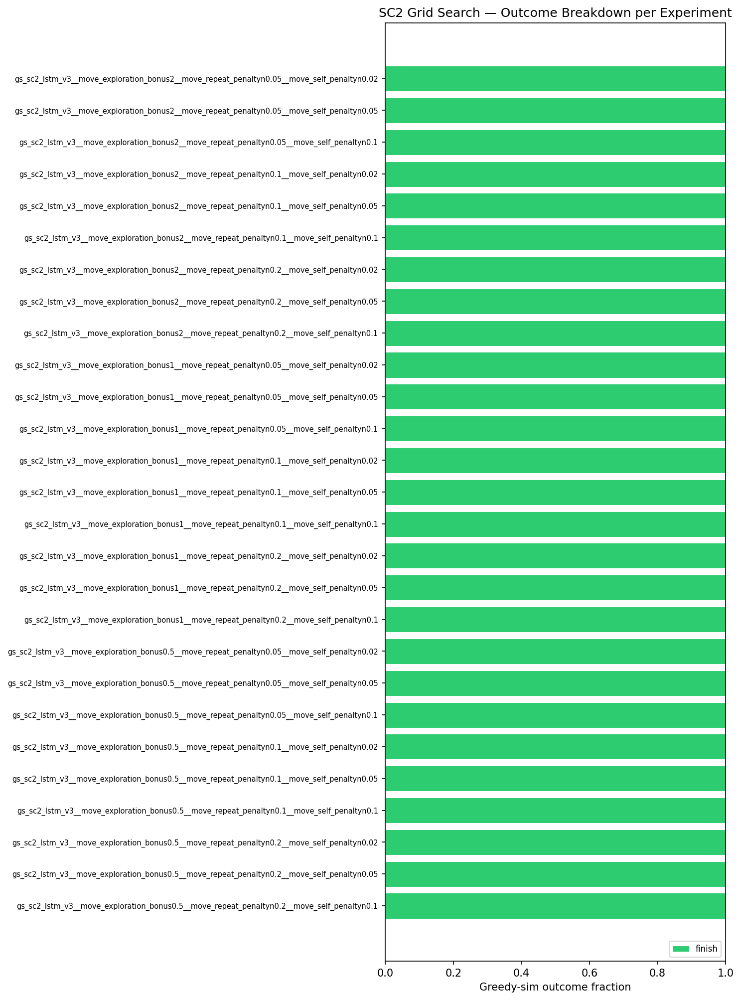

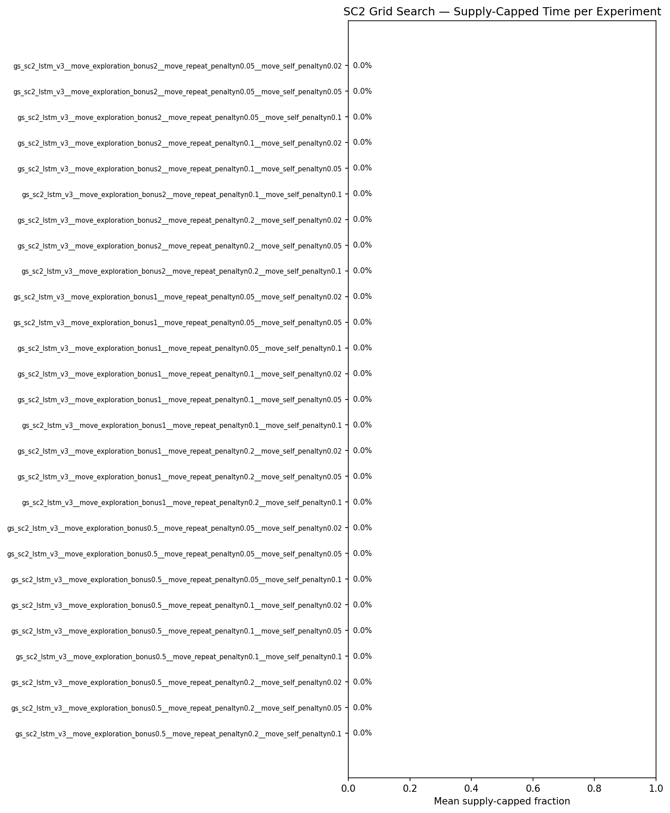

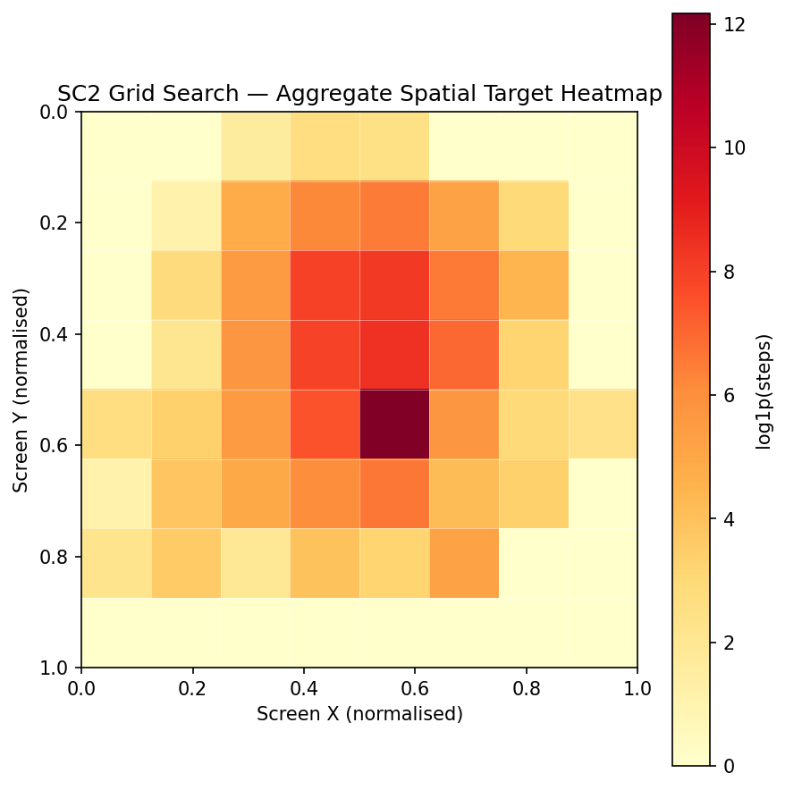

