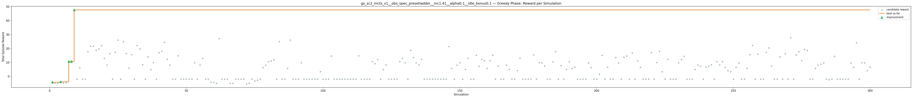
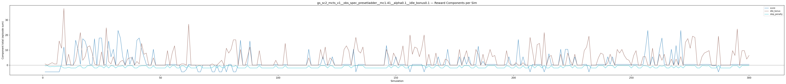
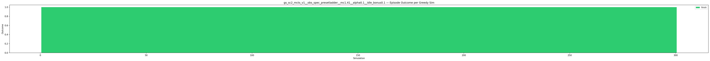
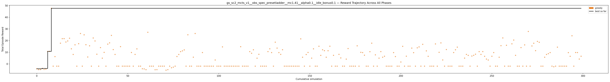

# Experiment: gs_sc2_mcts_v1__obs_spec_presetladder__mc1.41__alpha0.1__idle_bonus0.1

**Game:** StarCraft 2

## Timings

- **Start:** 2026-05-06 00:28:34
- **End:** 2026-05-06 00:42:24
- **Total runtime:** 13m 50.4s

| Phase | Duration |
|-------|----------|
| Greedy | 13m 49.4s |

## Run Parameters

### Training

| Parameter | Value |
|-----------|-------|
| track | sc2_DefeatRoaches |
| obs_spec_preset | ladder |
| enable_belief | False |
| map_name | DefeatRoaches |
| in_game_episode_s | 120.0 |
| step_mul | 8 |
| screen_size | 64 |
| minimap_size | 64 |
| agent_race | random |
| n_sims | 300 |
| policy_type | mcts |
| mcts_c | 1.41 |
| alpha | 0.1 |
| policy_params | {'n_bins': 3, 'gamma': 0.99, 'alpha': 0.1, 'c': 1.41} |

### Reward Config

| Parameter | Value |
|-----------|-------|
| score_weight | 0.5 |
| win_bonus | 0.0 |
| loss_penalty | 0.0 |
| step_penalty | -0.001 |
| idle_penalty | 0.0 |
| idle_bonus | 0.1 |
| economy_weight | 0.0 |

## Greedy Phase

Best reward: **+47.7**

| Sim  | Reward   | Progress | Finish Time | Mean abs lat | Reason       | Result       |
|------|----------|----------|-------------|--------------|--------------|-------------|
|    1 |     -4.2 | 0.000    | —           | —       | finish       | **NEW BEST** |
|    2 |     -4.9 | 0.000    | —           | —       | finish       |  |
|    3 |     -4.8 | 0.000    | —           | —       | finish       |  |
|    4 |     -3.8 | 0.000    | —           | —       | finish       | **NEW BEST** |
|    5 |     -4.7 | 0.000    | —           | —       | finish       |  |
|    6 |     -4.5 | 0.000    | —           | —       | finish       |  |
|    7 |    +10.7 | 0.000    | —           | —       | finish       | **NEW BEST** |
|    8 |    +10.8 | 0.000    | —           | —       | finish       | **NEW BEST** |
|    9 |    +47.7 | 0.000    | —           | —       | finish       | **NEW BEST** |
|   10 |     -1.9 | 0.000    | —           | —       | finish       |  |
|   11 |     +6.3 | 0.000    | —           | —       | finish       |  |
|   12 |     -1.9 | 0.000    | —           | —       | finish       |  |
|   13 |     -1.9 | 0.000    | —           | —       | finish       |  |
|   14 |    +17.8 | 0.000    | —           | —       | finish       |  |
|   15 |    +21.7 | 0.000    | —           | —       | finish       |  |
|   16 |    +21.7 | 0.000    | —           | —       | finish       |  |
|   17 |    +18.8 | 0.000    | —           | —       | finish       |  |
|   18 |    +19.7 | 0.000    | —           | —       | finish       |  |
|   19 |    +22.0 | 0.000    | —           | —       | finish       |  |
|   20 |    +12.9 | 0.000    | —           | —       | finish       |  |
|   21 |     +8.1 | 0.000    | —           | —       | finish       |  |
|   22 |    +16.4 | 0.000    | —           | —       | finish       |  |
|   23 |     -1.9 | 0.000    | —           | —       | finish       |  |
|   24 |    +17.3 | 0.000    | —           | —       | finish       |  |
|   25 |    +26.1 | 0.000    | —           | —       | finish       |  |
|   26 |     -1.9 | 0.000    | —           | —       | finish       |  |
|   27 |    +24.9 | 0.000    | —           | —       | finish       |  |
|   28 |    +16.5 | 0.000    | —           | —       | finish       |  |
|   29 |     +5.9 | 0.000    | —           | —       | finish       |  |
|   30 |    +15.5 | 0.000    | —           | —       | finish       |  |
|   31 |     -1.9 | 0.000    | —           | —       | finish       |  |
|   32 |    +22.2 | 0.000    | —           | —       | finish       |  |
|   33 |    +19.7 | 0.000    | —           | —       | finish       |  |
|   34 |     +8.3 | 0.000    | —           | —       | finish       |  |
|   35 |     -1.9 | 0.000    | —           | —       | finish       |  |
|   36 |    +14.0 | 0.000    | —           | —       | finish       |  |
|   37 |     +4.9 | 0.000    | —           | —       | finish       |  |
|   38 |     +9.9 | 0.000    | —           | —       | finish       |  |
|   39 |     -1.9 | 0.000    | —           | —       | finish       |  |
|   40 |    +17.0 | 0.000    | —           | —       | finish       |  |
|   41 |    +18.0 | 0.000    | —           | —       | finish       |  |
|   42 |    +24.5 | 0.000    | —           | —       | finish       |  |
|   43 |    +12.3 | 0.000    | —           | —       | finish       |  |
|   44 |     +8.1 | 0.000    | —           | —       | finish       |  |
|   45 |     -1.9 | 0.000    | —           | —       | finish       |  |
|   46 |     -1.9 | 0.000    | —           | —       | finish       |  |
|   47 |    +14.8 | 0.000    | —           | —       | finish       |  |
|   48 |     -1.9 | 0.000    | —           | —       | finish       |  |
|   49 |     -1.9 | 0.000    | —           | —       | finish       |  |
|   50 |     -1.9 | 0.000    | —           | —       | finish       |  |
|   51 |     -1.9 | 0.000    | —           | —       | finish       |  |
|   52 |     -1.9 | 0.000    | —           | —       | finish       |  |
|   53 |     +9.8 | 0.000    | —           | —       | finish       |  |
|   54 |     -1.9 | 0.000    | —           | —       | finish       |  |
|   55 |     +8.1 | 0.000    | —           | —       | finish       |  |
|   56 |    +12.9 | 0.000    | —           | —       | finish       |  |
|   57 |     -1.9 | 0.000    | —           | —       | finish       |  |
|   58 |     -1.9 | 0.000    | —           | —       | finish       |  |
|   59 |     -4.1 | 0.000    | —           | —       | finish       |  |
|   60 |     -4.3 | 0.000    | —           | —       | finish       |  |
|   61 |     -4.9 | 0.000    | —           | —       | finish       |  |
|   62 |    +27.1 | 0.000    | —           | —       | finish       |  |
|   63 |     -1.9 | 0.000    | —           | —       | finish       |  |
|   64 |     -1.9 | 0.000    | —           | —       | finish       |  |
|   65 |     -1.9 | 0.000    | —           | —       | finish       |  |
|   66 |     -5.0 | 0.000    | —           | —       | finish       |  |
|   67 |     -4.9 | 0.000    | —           | —       | finish       |  |
|   68 |     -1.9 | 0.000    | —           | —       | finish       |  |
|   69 |     -1.9 | 0.000    | —           | —       | finish       |  |
|   70 |     -1.9 | 0.000    | —           | —       | finish       |  |
|   71 |     -1.9 | 0.000    | —           | —       | finish       |  |
|   72 |     -5.3 | 0.000    | —           | —       | finish       |  |
|   73 |     -4.9 | 0.000    | —           | —       | finish       |  |
|   74 |     -1.9 | 0.000    | —           | —       | finish       |  |
|   75 |     -3.3 | 0.000    | —           | —       | finish       |  |
|   76 |     -2.7 | 0.000    | —           | —       | finish       |  |
|   77 |     -1.9 | 0.000    | —           | —       | finish       |  |
|   78 |     +6.4 | 0.000    | —           | —       | finish       |  |
|   79 |     +8.1 | 0.000    | —           | —       | finish       |  |
|   80 |    +10.5 | 0.000    | —           | —       | finish       |  |
|   81 |    +11.2 | 0.000    | —           | —       | finish       |  |
|   82 |    +12.0 | 0.000    | —           | —       | finish       |  |
|   83 |     -1.9 | 0.000    | —           | —       | finish       |  |
|   84 |    +25.0 | 0.000    | —           | —       | finish       |  |
|   85 |     -1.9 | 0.000    | —           | —       | finish       |  |
|   86 |     -1.9 | 0.000    | —           | —       | finish       |  |
|   87 |     +5.8 | 0.000    | —           | —       | finish       |  |
|   88 |    +26.1 | 0.000    | —           | —       | finish       |  |
|   89 |     -1.9 | 0.000    | —           | —       | finish       |  |
|   90 |     -1.9 | 0.000    | —           | —       | finish       |  |
|   91 |     -1.9 | 0.000    | —           | —       | finish       |  |
|   92 |     +9.8 | 0.000    | —           | —       | finish       |  |
|   93 |     -1.9 | 0.000    | —           | —       | finish       |  |
|   94 |     -1.9 | 0.000    | —           | —       | finish       |  |
|   95 |     -1.9 | 0.000    | —           | —       | finish       |  |
|   96 |     -1.9 | 0.000    | —           | —       | finish       |  |
|   97 |     -1.9 | 0.000    | —           | —       | finish       |  |
|   98 |     -1.9 | 0.000    | —           | —       | finish       |  |
|   99 |     +3.4 | 0.000    | —           | —       | finish       |  |
|  100 |     -1.9 | 0.000    | —           | —       | finish       |  |
|  101 |     -1.9 | 0.000    | —           | —       | finish       |  |
|  102 |     -1.9 | 0.000    | —           | —       | finish       |  |
|  103 |    +14.6 | 0.000    | —           | —       | finish       |  |
|  104 |     -1.9 | 0.000    | —           | —       | finish       |  |
|  105 |     -1.9 | 0.000    | —           | —       | finish       |  |
|  106 |     -1.9 | 0.000    | —           | —       | finish       |  |
|  107 |     -1.9 | 0.000    | —           | —       | finish       |  |
|  108 |     -1.9 | 0.000    | —           | —       | finish       |  |
|  109 |     -1.9 | 0.000    | —           | —       | finish       |  |
|  110 |     -1.9 | 0.000    | —           | —       | finish       |  |
|  111 |     -1.9 | 0.000    | —           | —       | finish       |  |
|  112 |     -1.9 | 0.000    | —           | —       | finish       |  |
|  113 |    +14.8 | 0.000    | —           | —       | finish       |  |
|  114 |     -1.9 | 0.000    | —           | —       | finish       |  |
|  115 |     -1.9 | 0.000    | —           | —       | finish       |  |
|  116 |     -1.9 | 0.000    | —           | —       | finish       |  |
|  117 |     -1.9 | 0.000    | —           | —       | finish       |  |
|  118 |    +10.6 | 0.000    | —           | —       | finish       |  |
|  119 |     +9.2 | 0.000    | —           | —       | finish       |  |
|  120 |    +12.1 | 0.000    | —           | —       | finish       |  |
|  121 |     -1.9 | 0.000    | —           | —       | finish       |  |
|  122 |     +4.9 | 0.000    | —           | —       | finish       |  |
|  123 |     +8.2 | 0.000    | —           | —       | finish       |  |
|  124 |     -1.9 | 0.000    | —           | —       | finish       |  |
|  125 |     -1.9 | 0.000    | —           | —       | finish       |  |
|  126 |     -1.9 | 0.000    | —           | —       | finish       |  |
|  127 |     -1.9 | 0.000    | —           | —       | finish       |  |
|  128 |    +10.6 | 0.000    | —           | —       | finish       |  |
|  129 |    +13.0 | 0.000    | —           | —       | finish       |  |
|  130 |     +9.7 | 0.000    | —           | —       | finish       |  |
|  131 |     -1.9 | 0.000    | —           | —       | finish       |  |
|  132 |    +18.6 | 0.000    | —           | —       | finish       |  |
|  133 |    +13.6 | 0.000    | —           | —       | finish       |  |
|  134 |     +9.7 | 0.000    | —           | —       | finish       |  |
|  135 |     +8.2 | 0.000    | —           | —       | finish       |  |
|  136 |    +12.2 | 0.000    | —           | —       | finish       |  |
|  137 |     -1.9 | 0.000    | —           | —       | finish       |  |
|  138 |     -1.9 | 0.000    | —           | —       | finish       |  |
|  139 |     -1.9 | 0.000    | —           | —       | finish       |  |
|  140 |     -1.9 | 0.000    | —           | —       | finish       |  |
|  141 |     -1.9 | 0.000    | —           | —       | finish       |  |
|  142 |     -1.9 | 0.000    | —           | —       | finish       |  |
|  143 |     -1.9 | 0.000    | —           | —       | finish       |  |
|  144 |     -1.9 | 0.000    | —           | —       | finish       |  |
|  145 |     -1.9 | 0.000    | —           | —       | finish       |  |
|  146 |    +21.5 | 0.000    | —           | —       | finish       |  |
|  147 |     +5.7 | 0.000    | —           | —       | finish       |  |
|  148 |     -1.9 | 0.000    | —           | —       | finish       |  |
|  149 |     +8.1 | 0.000    | —           | —       | finish       |  |
|  150 |     +9.8 | 0.000    | —           | —       | finish       |  |
|  151 |     -1.9 | 0.000    | —           | —       | finish       |  |
|  152 |     +5.0 | 0.000    | —           | —       | finish       |  |
|  153 |    +12.9 | 0.000    | —           | —       | finish       |  |
|  154 |     -1.9 | 0.000    | —           | —       | finish       |  |
|  155 |     -1.9 | 0.000    | —           | —       | finish       |  |
|  156 |    +15.1 | 0.000    | —           | —       | finish       |  |
|  157 |     +7.3 | 0.000    | —           | —       | finish       |  |
|  158 |    +12.1 | 0.000    | —           | —       | finish       |  |
|  159 |    +11.4 | 0.000    | —           | —       | finish       |  |
|  160 |     +5.7 | 0.000    | —           | —       | finish       |  |
|  161 |    +11.3 | 0.000    | —           | —       | finish       |  |
|  162 |    +15.2 | 0.000    | —           | —       | finish       |  |
|  163 |     -1.9 | 0.000    | —           | —       | finish       |  |
|  164 |     +7.4 | 0.000    | —           | —       | finish       |  |
|  165 |     -1.9 | 0.000    | —           | —       | finish       |  |
|  166 |     -1.9 | 0.000    | —           | —       | finish       |  |
|  167 |     +8.2 | 0.000    | —           | —       | finish       |  |
|  168 |     +5.1 | 0.000    | —           | —       | finish       |  |
|  169 |     -1.9 | 0.000    | —           | —       | finish       |  |
|  170 |     -1.9 | 0.000    | —           | —       | finish       |  |
|  171 |     +4.1 | 0.000    | —           | —       | finish       |  |
|  172 |    +13.2 | 0.000    | —           | —       | finish       |  |
|  173 |     -1.9 | 0.000    | —           | —       | finish       |  |
|  174 |     -1.9 | 0.000    | —           | —       | finish       |  |
|  175 |     -1.9 | 0.000    | —           | —       | finish       |  |
|  176 |     -1.9 | 0.000    | —           | —       | finish       |  |
|  177 |    +15.5 | 0.000    | —           | —       | finish       |  |
|  178 |     -1.9 | 0.000    | —           | —       | finish       |  |
|  179 |     +9.9 | 0.000    | —           | —       | finish       |  |
|  180 |     +9.7 | 0.000    | —           | —       | finish       |  |
|  181 |     +7.5 | 0.000    | —           | —       | finish       |  |
|  182 |     -1.9 | 0.000    | —           | —       | finish       |  |
|  183 |     -1.9 | 0.000    | —           | —       | finish       |  |
|  184 |    +10.5 | 0.000    | —           | —       | finish       |  |
|  185 |    +17.8 | 0.000    | —           | —       | finish       |  |
|  186 |     -1.9 | 0.000    | —           | —       | finish       |  |
|  187 |     +7.8 | 0.000    | —           | —       | finish       |  |
|  188 |     -1.9 | 0.000    | —           | —       | finish       |  |
|  189 |     +5.0 | 0.000    | —           | —       | finish       |  |
|  190 |    +10.6 | 0.000    | —           | —       | finish       |  |
|  191 |     +5.8 | 0.000    | —           | —       | finish       |  |
|  192 |     +6.6 | 0.000    | —           | —       | finish       |  |
|  193 |     -1.9 | 0.000    | —           | —       | finish       |  |
|  194 |     -1.9 | 0.000    | —           | —       | finish       |  |
|  195 |     -1.9 | 0.000    | —           | —       | finish       |  |
|  196 |     -1.9 | 0.000    | —           | —       | finish       |  |
|  197 |     +9.7 | 0.000    | —           | —       | finish       |  |
|  198 |     +6.3 | 0.000    | —           | —       | finish       |  |
|  199 |     -1.9 | 0.000    | —           | —       | finish       |  |
|  200 |     -1.9 | 0.000    | —           | —       | finish       |  |
|  201 |     +1.6 | 0.000    | —           | —       | finish       |  |
|  202 |    +15.1 | 0.000    | —           | —       | finish       |  |
|  203 |     -1.9 | 0.000    | —           | —       | finish       |  |
|  204 |     +6.6 | 0.000    | —           | —       | finish       |  |
|  205 |     -1.9 | 0.000    | —           | —       | finish       |  |
|  206 |     -1.9 | 0.000    | —           | —       | finish       |  |
|  207 |    +13.6 | 0.000    | —           | —       | finish       |  |
|  208 |     +9.7 | 0.000    | —           | —       | finish       |  |
|  209 |     -1.9 | 0.000    | —           | —       | finish       |  |
|  210 |    +13.8 | 0.000    | —           | —       | finish       |  |
|  211 |    +14.6 | 0.000    | —           | —       | finish       |  |
|  212 |     -1.9 | 0.000    | —           | —       | finish       |  |
|  213 |    +16.8 | 0.000    | —           | —       | finish       |  |
|  214 |     -1.9 | 0.000    | —           | —       | finish       |  |
|  215 |    +11.2 | 0.000    | —           | —       | finish       |  |
|  216 |     +6.5 | 0.000    | —           | —       | finish       |  |
|  217 |     -1.9 | 0.000    | —           | —       | finish       |  |
|  218 |     -1.9 | 0.000    | —           | —       | finish       |  |
|  219 |     -1.9 | 0.000    | —           | —       | finish       |  |
|  220 |    +17.1 | 0.000    | —           | —       | finish       |  |
|  221 |     -1.9 | 0.000    | —           | —       | finish       |  |
|  222 |    +10.0 | 0.000    | —           | —       | finish       |  |
|  223 |    +18.0 | 0.000    | —           | —       | finish       |  |
|  224 |     +3.4 | 0.000    | —           | —       | finish       |  |
|  225 |     -1.9 | 0.000    | —           | —       | finish       |  |
|  226 |    +12.3 | 0.000    | —           | —       | finish       |  |
|  227 |     -1.9 | 0.000    | —           | —       | finish       |  |
|  228 |     -1.9 | 0.000    | —           | —       | finish       |  |
|  229 |     -1.9 | 0.000    | —           | —       | finish       |  |
|  230 |     +9.7 | 0.000    | —           | —       | finish       |  |
|  231 |    +12.1 | 0.000    | —           | —       | finish       |  |
|  232 |    +14.4 | 0.000    | —           | —       | finish       |  |
|  233 |     -1.9 | 0.000    | —           | —       | finish       |  |
|  234 |     -1.9 | 0.000    | —           | —       | finish       |  |
|  235 |     -1.9 | 0.000    | —           | —       | finish       |  |
|  236 |     +5.0 | 0.000    | —           | —       | finish       |  |
|  237 |     +8.1 | 0.000    | —           | —       | finish       |  |
|  238 |     +7.3 | 0.000    | —           | —       | finish       |  |
|  239 |     -1.9 | 0.000    | —           | —       | finish       |  |
|  240 |     +6.8 | 0.000    | —           | —       | finish       |  |
|  241 |     +7.4 | 0.000    | —           | —       | finish       |  |
|  242 |     +8.3 | 0.000    | —           | —       | finish       |  |
|  243 |     -1.9 | 0.000    | —           | —       | finish       |  |
|  244 |    +10.6 | 0.000    | —           | —       | finish       |  |
|  245 |     +8.2 | 0.000    | —           | —       | finish       |  |
|  246 |    +10.6 | 0.000    | —           | —       | finish       |  |
|  247 |     +6.5 | 0.000    | —           | —       | finish       |  |
|  248 |     +4.2 | 0.000    | —           | —       | finish       |  |
|  249 |     +3.3 | 0.000    | —           | —       | finish       |  |
|  250 |     -1.9 | 0.000    | —           | —       | finish       |  |
|  251 |     +6.6 | 0.000    | —           | —       | finish       |  |
|  252 |     +9.7 | 0.000    | —           | —       | finish       |  |
|  253 |     -1.9 | 0.000    | —           | —       | finish       |  |
|  254 |     -1.9 | 0.000    | —           | —       | finish       |  |
|  255 |     +5.7 | 0.000    | —           | —       | finish       |  |
|  256 |    +15.6 | 0.000    | —           | —       | finish       |  |
|  257 |    +22.3 | 0.000    | —           | —       | finish       |  |
|  258 |     -1.9 | 0.000    | —           | —       | finish       |  |
|  259 |    +16.0 | 0.000    | —           | —       | finish       |  |
|  260 |     -1.9 | 0.000    | —           | —       | finish       |  |
|  261 |     -1.9 | 0.000    | —           | —       | finish       |  |
|  262 |    +17.2 | 0.000    | —           | —       | finish       |  |
|  263 |    +20.5 | 0.000    | —           | —       | finish       |  |
|  264 |     +7.4 | 0.000    | —           | —       | finish       |  |
|  265 |     -1.9 | 0.000    | —           | —       | finish       |  |
|  266 |     -1.9 | 0.000    | —           | —       | finish       |  |
|  267 |    +14.0 | 0.000    | —           | —       | finish       |  |
|  268 |     -1.9 | 0.000    | —           | —       | finish       |  |
|  269 |    +16.3 | 0.000    | —           | —       | finish       |  |
|  270 |     -1.9 | 0.000    | —           | —       | finish       |  |
|  271 |    +27.8 | 0.000    | —           | —       | finish       |  |
|  272 |     -1.9 | 0.000    | —           | —       | finish       |  |
|  273 |    +15.4 | 0.000    | —           | —       | finish       |  |
|  274 |    +17.7 | 0.000    | —           | —       | finish       |  |
|  275 |    +11.4 | 0.000    | —           | —       | finish       |  |
|  276 |    +19.3 | 0.000    | —           | —       | finish       |  |
|  277 |    +18.6 | 0.000    | —           | —       | finish       |  |
|  278 |     -1.9 | 0.000    | —           | —       | finish       |  |
|  279 |     -1.9 | 0.000    | —           | —       | finish       |  |
|  280 |     +5.7 | 0.000    | —           | —       | finish       |  |
|  281 |     +8.1 | 0.000    | —           | —       | finish       |  |
|  282 |     +8.8 | 0.000    | —           | —       | finish       |  |
|  283 |     +9.7 | 0.000    | —           | —       | finish       |  |
|  284 |     -1.9 | 0.000    | —           | —       | finish       |  |
|  285 |     -2.4 | 0.000    | —           | —       | finish       |  |
|  286 |     -1.9 | 0.000    | —           | —       | finish       |  |
|  287 |    +14.4 | 0.000    | —           | —       | finish       |  |
|  288 |     -1.9 | 0.000    | —           | —       | finish       |  |
|  289 |     -1.9 | 0.000    | —           | —       | finish       |  |
|  290 |     -1.9 | 0.000    | —           | —       | finish       |  |
|  291 |     -1.9 | 0.000    | —           | —       | finish       |  |
|  292 |     -1.9 | 0.000    | —           | —       | finish       |  |
|  293 |     +9.7 | 0.000    | —           | —       | finish       |  |
|  294 |     +6.5 | 0.000    | —           | —       | finish       |  |
|  295 |    +24.1 | 0.000    | —           | —       | finish       |  |
|  296 |     -1.9 | 0.000    | —           | —       | finish       |  |
|  297 |     +9.8 | 0.000    | —           | —       | finish       |  |
|  298 |     +9.7 | 0.000    | —           | —       | finish       |  |
|  299 |     +4.2 | 0.000    | —           | —       | finish       |  |
|  300 |     +6.6 | 0.000    | —           | —       | finish       |  |

