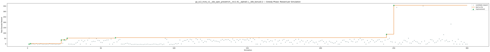
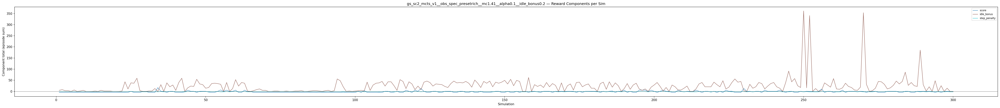
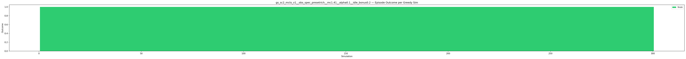
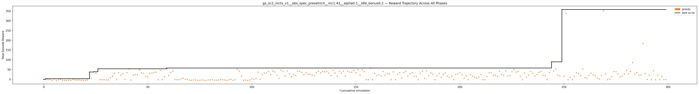

# Experiment: gs_sc2_mcts_v1__obs_spec_presetrich__mc1.41__alpha0.1__idle_bonus0.2

**Game:** StarCraft 2

## Timings

- **Start:** 2026-05-06 06:24:20
- **End:** 2026-05-06 06:33:58
- **Total runtime:** 9m 37.7s

| Phase | Duration |
|-------|----------|
| Greedy | 9m 36.7s |

## Run Parameters

### Training

| Parameter | Value |
|-----------|-------|
| track | sc2_DefeatRoaches |
| obs_spec_preset | rich |
| enable_belief | False |
| map_name | DefeatRoaches |
| in_game_episode_s | 120.0 |
| step_mul | 8 |
| screen_size | 64 |
| minimap_size | 64 |
| agent_race | random |
| n_sims | 300 |
| policy_type | mcts |
| mcts_c | 1.41 |
| alpha | 0.1 |
| policy_params | {'n_bins': 3, 'gamma': 0.99, 'alpha': 0.1, 'c': 1.41} |

### Reward Config

| Parameter | Value |
|-----------|-------|
| score_weight | 0.5 |
| win_bonus | 0.0 |
| loss_penalty | 0.0 |
| step_penalty | -0.001 |
| idle_penalty | 0.0 |
| idle_bonus | 0.2 |
| economy_weight | 0.0 |

## Greedy Phase

Best reward: **+358.2**

| Sim  | Reward   | Progress | Finish Time | Mean abs lat | Reason       | Result       |
|------|----------|----------|-------------|--------------|--------------|-------------|
|    1 |     -0.2 | 0.000    | —           | —       | finish       | **NEW BEST** |
|    2 |     +3.1 | 0.000    | —           | —       | finish       | **NEW BEST** |
|    3 |     -1.8 | 0.000    | —           | —       | finish       |  |
|    4 |     -1.7 | 0.000    | —           | —       | finish       |  |
|    5 |     -5.0 | 0.000    | —           | —       | finish       |  |
|    6 |     +1.3 | 0.000    | —           | —       | finish       |  |
|    7 |     -5.7 | 0.000    | —           | —       | finish       |  |
|    8 |     -3.3 | 0.000    | —           | —       | finish       |  |
|    9 |     -0.6 | 0.000    | —           | —       | finish       |  |
|   10 |     -5.1 | 0.000    | —           | —       | finish       |  |
|   11 |     -5.1 | 0.000    | —           | —       | finish       |  |
|   12 |     -5.7 | 0.000    | —           | —       | finish       |  |
|   13 |     -4.0 | 0.000    | —           | —       | finish       |  |
|   14 |     -5.5 | 0.000    | —           | —       | finish       |  |
|   15 |     -0.4 | 0.000    | —           | —       | finish       |  |
|   16 |     -3.3 | 0.000    | —           | —       | finish       |  |
|   17 |     -3.5 | 0.000    | —           | —       | finish       |  |
|   18 |     -3.4 | 0.000    | —           | —       | finish       |  |
|   19 |     -4.9 | 0.000    | —           | —       | finish       |  |
|   20 |     -5.0 | 0.000    | —           | —       | finish       |  |
|   21 |     -5.4 | 0.000    | —           | —       | finish       |  |
|   22 |     -3.7 | 0.000    | —           | —       | finish       |  |
|   23 |    +37.5 | 0.000    | —           | —       | finish       | **NEW BEST** |
|   24 |     +6.3 | 0.000    | —           | —       | finish       |  |
|   25 |    +38.5 | 0.000    | —           | —       | finish       | **NEW BEST** |
|   26 |    +31.4 | 0.000    | —           | —       | finish       |  |
|   27 |    +54.2 | 0.000    | —           | —       | finish       | **NEW BEST** |
|   28 |     -1.8 | 0.000    | —           | —       | finish       |  |
|   29 |     -1.9 | 0.000    | —           | —       | finish       |  |
|   30 |     -1.9 | 0.000    | —           | —       | finish       |  |
|   31 |     -3.3 | 0.000    | —           | —       | finish       |  |
|   32 |     -3.6 | 0.000    | —           | —       | finish       |  |
|   33 |     +7.6 | 0.000    | —           | —       | finish       |  |
|   34 |    +15.1 | 0.000    | —           | —       | finish       |  |
|   35 |    +30.4 | 0.000    | —           | —       | finish       |  |
|   36 |     -1.9 | 0.000    | —           | —       | finish       |  |
|   37 |    +33.5 | 0.000    | —           | —       | finish       |  |
|   38 |    +20.9 | 0.000    | —           | —       | finish       |  |
|   39 |    +28.7 | 0.000    | —           | —       | finish       |  |
|   40 |     -0.2 | 0.000    | —           | —       | finish       |  |
|   41 |    +34.9 | 0.000    | —           | —       | finish       |  |
|   42 |    +53.6 | 0.000    | —           | —       | finish       |  |
|   43 |     -3.9 | 0.000    | —           | —       | finish       |  |
|   44 |    +21.0 | 0.000    | —           | —       | finish       |  |
|   45 |    +24.1 | 0.000    | —           | —       | finish       |  |
|   46 |    +22.5 | 0.000    | —           | —       | finish       |  |
|   47 |    +49.3 | 0.000    | —           | —       | finish       |  |
|   48 |    +33.1 | 0.000    | —           | —       | finish       |  |
|   49 |    +30.4 | 0.000    | —           | —       | finish       |  |
|   50 |    +14.5 | 0.000    | —           | —       | finish       |  |
|   51 |    +12.7 | 0.000    | —           | —       | finish       |  |
|   52 |    +30.2 | 0.000    | —           | —       | finish       |  |
|   53 |    +31.8 | 0.000    | —           | —       | finish       |  |
|   54 |    +35.3 | 0.000    | —           | —       | finish       |  |
|   55 |    +36.6 | 0.000    | —           | —       | finish       |  |
|   56 |     -1.9 | 0.000    | —           | —       | finish       |  |
|   57 |    +45.1 | 0.000    | —           | —       | finish       |  |
|   58 |     -1.9 | 0.000    | —           | —       | finish       |  |
|   59 |    +12.9 | 0.000    | —           | —       | finish       |  |
|   60 |    +57.9 | 0.000    | —           | —       | finish       | **NEW BEST** |
|   61 |    +19.1 | 0.000    | —           | —       | finish       |  |
|   62 |    +35.1 | 0.000    | —           | —       | finish       |  |
|   63 |    +41.7 | 0.000    | —           | —       | finish       |  |
|   64 |     -1.3 | 0.000    | —           | —       | finish       |  |
|   65 |     -1.9 | 0.000    | —           | —       | finish       |  |
|   66 |     -1.8 | 0.000    | —           | —       | finish       |  |
|   67 |     +3.1 | 0.000    | —           | —       | finish       |  |
|   68 |     +6.3 | 0.000    | —           | —       | finish       |  |
|   69 |     -0.2 | 0.000    | —           | —       | finish       |  |
|   70 |     -0.1 | 0.000    | —           | —       | finish       |  |
|   71 |     -5.0 | 0.000    | —           | —       | finish       |  |
|   72 |     -5.0 | 0.000    | —           | —       | finish       |  |
|   73 |     -3.3 | 0.000    | —           | —       | finish       |  |
|   74 |     -3.5 | 0.000    | —           | —       | finish       |  |
|   75 |     -4.9 | 0.000    | —           | —       | finish       |  |
|   76 |     -5.0 | 0.000    | —           | —       | finish       |  |
|   77 |     -3.3 | 0.000    | —           | —       | finish       |  |
|   78 |     -4.9 | 0.000    | —           | —       | finish       |  |
|   79 |     -5.5 | 0.000    | —           | —       | finish       |  |
|   80 |     -3.3 | 0.000    | —           | —       | finish       |  |
|   81 |     -3.4 | 0.000    | —           | —       | finish       |  |
|   82 |     -2.1 | 0.000    | —           | —       | finish       |  |
|   83 |     -4.9 | 0.000    | —           | —       | finish       |  |
|   84 |     -4.7 | 0.000    | —           | —       | finish       |  |
|   85 |     -3.8 | 0.000    | —           | —       | finish       |  |
|   86 |     -1.7 | 0.000    | —           | —       | finish       |  |
|   87 |     -2.3 | 0.000    | —           | —       | finish       |  |
|   88 |     -3.3 | 0.000    | —           | —       | finish       |  |
|   89 |     -5.8 | 0.000    | —           | —       | finish       |  |
|   90 |     -2.4 | 0.000    | —           | —       | finish       |  |
|   91 |     -0.1 | 0.000    | —           | —       | finish       |  |
|   92 |     -5.8 | 0.000    | —           | —       | finish       |  |
|   93 |     -2.0 | 0.000    | —           | —       | finish       |  |
|   94 |    +50.8 | 0.000    | —           | —       | finish       |  |
|   95 |    +42.5 | 0.000    | —           | —       | finish       |  |
|   96 |    +15.9 | 0.000    | —           | —       | finish       |  |
|   97 |     -5.4 | 0.000    | —           | —       | finish       |  |
|   98 |     -3.4 | 0.000    | —           | —       | finish       |  |
|   99 |     -5.7 | 0.000    | —           | —       | finish       |  |
|  100 |     -3.6 | 0.000    | —           | —       | finish       |  |
|  101 |     +2.5 | 0.000    | —           | —       | finish       |  |
|  102 |     -0.1 | 0.000    | —           | —       | finish       |  |
|  103 |     +3.7 | 0.000    | —           | —       | finish       |  |
|  104 |    +36.4 | 0.000    | —           | —       | finish       |  |
|  105 |     -0.1 | 0.000    | —           | —       | finish       |  |
|  106 |    +23.7 | 0.000    | —           | —       | finish       |  |
|  107 |    +31.9 | 0.000    | —           | —       | finish       |  |
|  108 |    +32.3 | 0.000    | —           | —       | finish       |  |
|  109 |    +39.9 | 0.000    | —           | —       | finish       |  |
|  110 |    +24.1 | 0.000    | —           | —       | finish       |  |
|  111 |    +43.0 | 0.000    | —           | —       | finish       |  |
|  112 |    +38.3 | 0.000    | —           | —       | finish       |  |
|  113 |    +20.7 | 0.000    | —           | —       | finish       |  |
|  114 |     +4.7 | 0.000    | —           | —       | finish       |  |
|  115 |    +47.9 | 0.000    | —           | —       | finish       |  |
|  116 |    +39.9 | 0.000    | —           | —       | finish       |  |
|  117 |    +17.3 | 0.000    | —           | —       | finish       |  |
|  118 |    +43.3 | 0.000    | —           | —       | finish       |  |
|  119 |    +28.7 | 0.000    | —           | —       | finish       |  |
|  120 |    +13.0 | 0.000    | —           | —       | finish       |  |
|  121 |    +24.1 | 0.000    | —           | —       | finish       |  |
|  122 |    +19.3 | 0.000    | —           | —       | finish       |  |
|  123 |    +41.5 | 0.000    | —           | —       | finish       |  |
|  124 |    +41.6 | 0.000    | —           | —       | finish       |  |
|  125 |    +35.5 | 0.000    | —           | —       | finish       |  |
|  126 |    +24.1 | 0.000    | —           | —       | finish       |  |
|  127 |    +33.7 | 0.000    | —           | —       | finish       |  |
|  128 |    +26.1 | 0.000    | —           | —       | finish       |  |
|  129 |    +25.5 | 0.000    | —           | —       | finish       |  |
|  130 |    +22.6 | 0.000    | —           | —       | finish       |  |
|  131 |    +17.4 | 0.000    | —           | —       | finish       |  |
|  132 |    +34.9 | 0.000    | —           | —       | finish       |  |
|  133 |    +41.5 | 0.000    | —           | —       | finish       |  |
|  134 |    +33.5 | 0.000    | —           | —       | finish       |  |
|  135 |    +39.3 | 0.000    | —           | —       | finish       |  |
|  136 |    +38.5 | 0.000    | —           | —       | finish       |  |
|  137 |    +39.9 | 0.000    | —           | —       | finish       |  |
|  138 |    +31.9 | 0.000    | —           | —       | finish       |  |
|  139 |    +19.2 | 0.000    | —           | —       | finish       |  |
|  140 |    +46.2 | 0.000    | —           | —       | finish       |  |
|  141 |    +32.0 | 0.000    | —           | —       | finish       |  |
|  142 |    +16.6 | 0.000    | —           | —       | finish       |  |
|  143 |    +40.0 | 0.000    | —           | —       | finish       |  |
|  144 |    +31.5 | 0.000    | —           | —       | finish       |  |
|  145 |    +41.5 | 0.000    | —           | —       | finish       |  |
|  146 |    +16.9 | 0.000    | —           | —       | finish       |  |
|  147 |    +41.5 | 0.000    | —           | —       | finish       |  |
|  148 |    +36.8 | 0.000    | —           | —       | finish       |  |
|  149 |    +36.7 | 0.000    | —           | —       | finish       |  |
|  150 |    +44.6 | 0.000    | —           | —       | finish       |  |
|  151 |    +33.4 | 0.000    | —           | —       | finish       |  |
|  152 |    +49.5 | 0.000    | —           | —       | finish       |  |
|  153 |    +20.8 | 0.000    | —           | —       | finish       |  |
|  154 |    +49.7 | 0.000    | —           | —       | finish       |  |
|  155 |    +39.9 | 0.000    | —           | —       | finish       |  |
|  156 |     -1.9 | 0.000    | —           | —       | finish       |  |
|  157 |     -1.9 | 0.000    | —           | —       | finish       |  |
|  158 |    +57.4 | 0.000    | —           | —       | finish       |  |
|  159 |     -1.9 | 0.000    | —           | —       | finish       |  |
|  160 |    +30.4 | 0.000    | —           | —       | finish       |  |
|  161 |    +18.5 | 0.000    | —           | —       | finish       |  |
|  162 |    +23.9 | 0.000    | —           | —       | finish       |  |
|  163 |    +17.7 | 0.000    | —           | —       | finish       |  |
|  164 |    +40.0 | 0.000    | —           | —       | finish       |  |
|  165 |    +20.7 | 0.000    | —           | —       | finish       |  |
|  166 |    +30.4 | 0.000    | —           | —       | finish       |  |
|  167 |    +27.2 | 0.000    | —           | —       | finish       |  |
|  168 |     -1.9 | 0.000    | —           | —       | finish       |  |
|  169 |    +38.3 | 0.000    | —           | —       | finish       |  |
|  170 |     -1.9 | 0.000    | —           | —       | finish       |  |
|  171 |    +25.4 | 0.000    | —           | —       | finish       |  |
|  172 |    +33.6 | 0.000    | —           | —       | finish       |  |
|  173 |     +5.6 | 0.000    | —           | —       | finish       |  |
|  174 |    +34.9 | 0.000    | —           | —       | finish       |  |
|  175 |    +41.7 | 0.000    | —           | —       | finish       |  |
|  176 |    +15.9 | 0.000    | —           | —       | finish       |  |
|  177 |    +28.9 | 0.000    | —           | —       | finish       |  |
|  178 |    +33.7 | 0.000    | —           | —       | finish       |  |
|  179 |    +14.2 | 0.000    | —           | —       | finish       |  |
|  180 |    +14.4 | 0.000    | —           | —       | finish       |  |
|  181 |     -1.9 | 0.000    | —           | —       | finish       |  |
|  182 |    +30.3 | 0.000    | —           | —       | finish       |  |
|  183 |    +41.7 | 0.000    | —           | —       | finish       |  |
|  184 |     +5.7 | 0.000    | —           | —       | finish       |  |
|  185 |    +43.2 | 0.000    | —           | —       | finish       |  |
|  186 |    +19.3 | 0.000    | —           | —       | finish       |  |
|  187 |    +33.2 | 0.000    | —           | —       | finish       |  |
|  188 |    +25.8 | 0.000    | —           | —       | finish       |  |
|  189 |     -1.9 | 0.000    | —           | —       | finish       |  |
|  190 |    +17.7 | 0.000    | —           | —       | finish       |  |
|  191 |    +30.3 | 0.000    | —           | —       | finish       |  |
|  192 |     +9.6 | 0.000    | —           | —       | finish       |  |
|  193 |    +23.9 | 0.000    | —           | —       | finish       |  |
|  194 |    +31.9 | 0.000    | —           | —       | finish       |  |
|  195 |    +16.3 | 0.000    | —           | —       | finish       |  |
|  196 |     +9.9 | 0.000    | —           | —       | finish       |  |
|  197 |    +16.2 | 0.000    | —           | —       | finish       |  |
|  198 |     -1.9 | 0.000    | —           | —       | finish       |  |
|  199 |    +24.2 | 0.000    | —           | —       | finish       |  |
|  200 |    +29.0 | 0.000    | —           | —       | finish       |  |
|  201 |    +35.0 | 0.000    | —           | —       | finish       |  |
|  202 |    +22.5 | 0.000    | —           | —       | finish       |  |
|  203 |     +6.7 | 0.000    | —           | —       | finish       |  |
|  204 |    +17.7 | 0.000    | —           | —       | finish       |  |
|  205 |     -1.9 | 0.000    | —           | —       | finish       |  |
|  206 |    +24.0 | 0.000    | —           | —       | finish       |  |
|  207 |    +16.0 | 0.000    | —           | —       | finish       |  |
|  208 |    +10.8 | 0.000    | —           | —       | finish       |  |
|  209 |     +6.3 | 0.000    | —           | —       | finish       |  |
|  210 |    +10.5 | 0.000    | —           | —       | finish       |  |
|  211 |    +24.1 | 0.000    | —           | —       | finish       |  |
|  212 |     -1.9 | 0.000    | —           | —       | finish       |  |
|  213 |     -1.9 | 0.000    | —           | —       | finish       |  |
|  214 |    +14.8 | 0.000    | —           | —       | finish       |  |
|  215 |    +33.7 | 0.000    | —           | —       | finish       |  |
|  216 |    +35.1 | 0.000    | —           | —       | finish       |  |
|  217 |    +20.9 | 0.000    | —           | —       | finish       |  |
|  218 |    +21.0 | 0.000    | —           | —       | finish       |  |
|  219 |    +15.9 | 0.000    | —           | —       | finish       |  |
|  220 |    +41.7 | 0.000    | —           | —       | finish       |  |
|  221 |    +25.5 | 0.000    | —           | —       | finish       |  |
|  222 |    +20.9 | 0.000    | —           | —       | finish       |  |
|  223 |    +43.1 | 0.000    | —           | —       | finish       |  |
|  224 |    +16.3 | 0.000    | —           | —       | finish       |  |
|  225 |    +19.3 | 0.000    | —           | —       | finish       |  |
|  226 |    +39.1 | 0.000    | —           | —       | finish       |  |
|  227 |    +51.1 | 0.000    | —           | —       | finish       |  |
|  228 |    +36.8 | 0.000    | —           | —       | finish       |  |
|  229 |    +39.9 | 0.000    | —           | —       | finish       |  |
|  230 |    +15.5 | 0.000    | —           | —       | finish       |  |
|  231 |     -1.9 | 0.000    | —           | —       | finish       |  |
|  232 |    +32.0 | 0.000    | —           | —       | finish       |  |
|  233 |    +10.5 | 0.000    | —           | —       | finish       |  |
|  234 |    +20.9 | 0.000    | —           | —       | finish       |  |
|  235 |    +40.1 | 0.000    | —           | —       | finish       |  |
|  236 |    +30.3 | 0.000    | —           | —       | finish       |  |
|  237 |    +16.3 | 0.000    | —           | —       | finish       |  |
|  238 |    +24.0 | 0.000    | —           | —       | finish       |  |
|  239 |    +35.3 | 0.000    | —           | —       | finish       |  |
|  240 |    +40.1 | 0.000    | —           | —       | finish       |  |
|  241 |    +20.9 | 0.000    | —           | —       | finish       |  |
|  242 |    +19.4 | 0.000    | —           | —       | finish       |  |
|  243 |     -1.9 | 0.000    | —           | —       | finish       |  |
|  244 |    +35.0 | 0.000    | —           | —       | finish       |  |
|  245 |    +89.3 | 0.000    | —           | —       | finish       | **NEW BEST** |
|  246 |    +43.0 | 0.000    | —           | —       | finish       |  |
|  247 |    +52.7 | 0.000    | —           | —       | finish       |  |
|  248 |    +20.7 | 0.000    | —           | —       | finish       |  |
|  249 |    +17.7 | 0.000    | —           | —       | finish       |  |
|  250 |   +358.2 | 0.000    | —           | —       | finish       | **NEW BEST** |
|  251 |    +15.7 | 0.000    | —           | —       | finish       |  |
|  252 |   +338.9 | 0.000    | —           | —       | finish       |  |
|  253 |     -1.9 | 0.000    | —           | —       | finish       |  |
|  254 |     +9.4 | 0.000    | —           | —       | finish       |  |
|  255 |     -1.9 | 0.000    | —           | —       | finish       |  |
|  256 |    +14.8 | 0.000    | —           | —       | finish       |  |
|  257 |    +33.5 | 0.000    | —           | —       | finish       |  |
|  258 |    +28.9 | 0.000    | —           | —       | finish       |  |
|  259 |    +19.4 | 0.000    | —           | —       | finish       |  |
|  260 |    +52.7 | 0.000    | —           | —       | finish       |  |
|  261 |     +7.8 | 0.000    | —           | —       | finish       |  |
|  262 |     +6.2 | 0.000    | —           | —       | finish       |  |
|  263 |    +21.1 | 0.000    | —           | —       | finish       |  |
|  264 |    +32.0 | 0.000    | —           | —       | finish       |  |
|  265 |    +22.5 | 0.000    | —           | —       | finish       |  |
|  266 |    +17.7 | 0.000    | —           | —       | finish       |  |
|  267 |     +6.6 | 0.000    | —           | —       | finish       |  |
|  268 |     +1.9 | 0.000    | —           | —       | finish       |  |
|  269 |    +19.3 | 0.000    | —           | —       | finish       |  |
|  270 |   +351.7 | 0.000    | —           | —       | finish       |  |
|  271 |    +27.1 | 0.000    | —           | —       | finish       |  |
|  272 |     -1.9 | 0.000    | —           | —       | finish       |  |
|  273 |     +1.3 | 0.000    | —           | —       | finish       |  |
|  274 |    +14.5 | 0.000    | —           | —       | finish       |  |
|  275 |    +39.9 | 0.000    | —           | —       | finish       |  |
|  276 |    +38.3 | 0.000    | —           | —       | finish       |  |
|  277 |    +27.2 | 0.000    | —           | —       | finish       |  |
|  278 |    +11.3 | 0.000    | —           | —       | finish       |  |
|  279 |    +16.1 | 0.000    | —           | —       | finish       |  |
|  280 |    +27.3 | 0.000    | —           | —       | finish       |  |
|  281 |    +46.5 | 0.000    | —           | —       | finish       |  |
|  282 |    +28.8 | 0.000    | —           | —       | finish       |  |
|  283 |    +40.0 | 0.000    | —           | —       | finish       |  |
|  284 |    +85.9 | 0.000    | —           | —       | finish       |  |
|  285 |    +27.3 | 0.000    | —           | —       | finish       |  |
|  286 |    +35.0 | 0.000    | —           | —       | finish       |  |
|  287 |    +20.8 | 0.000    | —           | —       | finish       |  |
|  288 |    +22.5 | 0.000    | —           | —       | finish       |  |
|  289 |   +183.7 | 0.000    | —           | —       | finish       |  |
|  290 |    +30.4 | 0.000    | —           | —       | finish       |  |
|  291 |     -0.3 | 0.000    | —           | —       | finish       |  |
|  292 |    +20.8 | 0.000    | —           | —       | finish       |  |
|  293 |     -1.9 | 0.000    | —           | —       | finish       |  |
|  294 |    +43.1 | 0.000    | —           | —       | finish       |  |
|  295 |     -1.9 | 0.000    | —           | —       | finish       |  |
|  296 |    +20.7 | 0.000    | —           | —       | finish       |  |
|  297 |     -1.9 | 0.000    | —           | —       | finish       |  |
|  298 |    +14.1 | 0.000    | —           | —       | finish       |  |
|  299 |     -1.9 | 0.000    | —           | —       | finish       |  |
|  300 |     -1.9 | 0.000    | —           | —       | finish       |  |

