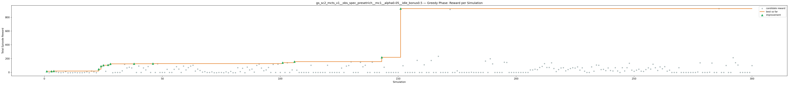
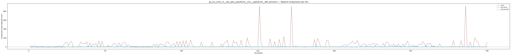
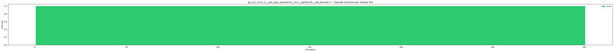
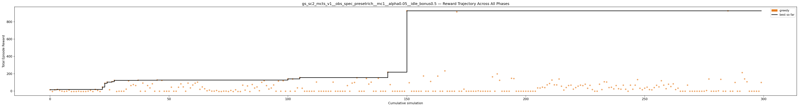

# Experiment: gs_sc2_mcts_v1__obs_spec_presetrich__mc1__alpha0.05__idle_bonus0.5

**Game:** StarCraft 2

## Timings

- **Start:** 2026-05-06 04:21:32
- **End:** 2026-05-06 04:34:04
- **Total runtime:** 12m 32.0s

| Phase | Duration |
|-------|----------|
| Greedy | 12m 31.0s |

## Run Parameters

### Training

| Parameter | Value |
|-----------|-------|
| track | sc2_DefeatRoaches |
| obs_spec_preset | rich |
| enable_belief | False |
| map_name | DefeatRoaches |
| in_game_episode_s | 120.0 |
| step_mul | 8 |
| screen_size | 64 |
| minimap_size | 64 |
| agent_race | random |
| n_sims | 300 |
| policy_type | mcts |
| mcts_c | 1.0 |
| alpha | 0.05 |
| policy_params | {'n_bins': 3, 'gamma': 0.99, 'alpha': 0.05, 'c': 1.0} |

### Reward Config

| Parameter | Value |
|-----------|-------|
| score_weight | 0.5 |
| win_bonus | 0.0 |
| loss_penalty | 0.0 |
| step_penalty | -0.001 |
| idle_penalty | 0.0 |
| idle_bonus | 0.5 |
| economy_weight | 0.0 |

## Greedy Phase

Best reward: **+926.1**

| Sim  | Reward   | Progress | Finish Time | Mean abs lat | Reason       | Result       |
|------|----------|----------|-------------|--------------|--------------|-------------|
|    1 |    +14.8 | 0.000    | —           | —       | finish       | **NEW BEST** |
|    2 |     -4.9 | 0.000    | —           | —       | finish       |  |
|    3 |    +14.9 | 0.000    | —           | —       | finish       | **NEW BEST** |
|    4 |    +18.9 | 0.000    | —           | —       | finish       | **NEW BEST** |
|    5 |     +6.6 | 0.000    | —           | —       | finish       |  |
|    6 |     -1.2 | 0.000    | —           | —       | finish       |  |
|    7 |     -4.9 | 0.000    | —           | —       | finish       |  |
|    8 |     -1.4 | 0.000    | —           | —       | finish       |  |
|    9 |    +11.1 | 0.000    | —           | —       | finish       |  |
|   10 |     -5.7 | 0.000    | —           | —       | finish       |  |
|   11 |     -5.0 | 0.000    | —           | —       | finish       |  |
|   12 |     -4.9 | 0.000    | —           | —       | finish       |  |
|   13 |     -1.6 | 0.000    | —           | —       | finish       |  |
|   14 |     -5.0 | 0.000    | —           | —       | finish       |  |
|   15 |     -4.9 | 0.000    | —           | —       | finish       |  |
|   16 |     -4.9 | 0.000    | —           | —       | finish       |  |
|   17 |     -1.0 | 0.000    | —           | —       | finish       |  |
|   18 |     +7.1 | 0.000    | —           | —       | finish       |  |
|   19 |     -5.2 | 0.000    | —           | —       | finish       |  |
|   20 |    +18.6 | 0.000    | —           | —       | finish       |  |
|   21 |     +7.1 | 0.000    | —           | —       | finish       |  |
|   22 |     -5.0 | 0.000    | —           | —       | finish       |  |
|   23 |    +46.4 | 0.000    | —           | —       | finish       | **NEW BEST** |
|   24 |    +90.2 | 0.000    | —           | —       | finish       | **NEW BEST** |
|   25 |   +103.6 | 0.000    | —           | —       | finish       | **NEW BEST** |
|   26 |    +14.8 | 0.000    | —           | —       | finish       |  |
|   27 |   +107.9 | 0.000    | —           | —       | finish       | **NEW BEST** |
|   28 |   +123.1 | 0.000    | —           | —       | finish       | **NEW BEST** |
|   29 |     -5.0 | 0.000    | —           | —       | finish       |  |
|   30 |     -1.9 | 0.000    | —           | —       | finish       |  |
|   31 |     -1.9 | 0.000    | —           | —       | finish       |  |
|   32 |     -1.9 | 0.000    | —           | —       | finish       |  |
|   33 |    +22.1 | 0.000    | —           | —       | finish       |  |
|   34 |   +117.1 | 0.000    | —           | —       | finish       |  |
|   35 |    +63.8 | 0.000    | —           | —       | finish       |  |
|   36 |    +74.7 | 0.000    | —           | —       | finish       |  |
|   37 |    +63.9 | 0.000    | —           | —       | finish       |  |
|   38 |   +125.1 | 0.000    | —           | —       | finish       | **NEW BEST** |
|   39 |     -1.9 | 0.000    | —           | —       | finish       |  |
|   40 |    +92.2 | 0.000    | —           | —       | finish       |  |
|   41 |     -1.9 | 0.000    | —           | —       | finish       |  |
|   42 |    +63.9 | 0.000    | —           | —       | finish       |  |
|   43 |    +36.2 | 0.000    | —           | —       | finish       |  |
|   44 |    +84.1 | 0.000    | —           | —       | finish       |  |
|   45 |     -1.9 | 0.000    | —           | —       | finish       |  |
|   46 |   +127.1 | 0.000    | —           | —       | finish       | **NEW BEST** |
|   47 |     -1.9 | 0.000    | —           | —       | finish       |  |
|   48 |   +123.0 | 0.000    | —           | —       | finish       |  |
|   49 |     -1.9 | 0.000    | —           | —       | finish       |  |
|   50 |     -1.9 | 0.000    | —           | —       | finish       |  |
|   51 |     -1.9 | 0.000    | —           | —       | finish       |  |
|   52 |    +44.6 | 0.000    | —           | —       | finish       |  |
|   53 |     -1.9 | 0.000    | —           | —       | finish       |  |
|   54 |     -1.9 | 0.000    | —           | —       | finish       |  |
|   55 |    +44.1 | 0.000    | —           | —       | finish       |  |
|   56 |    +83.1 | 0.000    | —           | —       | finish       |  |
|   57 |    +47.9 | 0.000    | —           | —       | finish       |  |
|   58 |     -1.9 | 0.000    | —           | —       | finish       |  |
|   59 |    +91.9 | 0.000    | —           | —       | finish       |  |
|   60 |    +36.3 | 0.000    | —           | —       | finish       |  |
|   61 |    +69.8 | 0.000    | —           | —       | finish       |  |
|   62 |    +91.1 | 0.000    | —           | —       | finish       |  |
|   63 |   +103.1 | 0.000    | —           | —       | finish       |  |
|   64 |    +19.6 | 0.000    | —           | —       | finish       |  |
|   65 |    +47.8 | 0.000    | —           | —       | finish       |  |
|   66 |    +26.7 | 0.000    | —           | —       | finish       |  |
|   67 |     +3.5 | 0.000    | —           | —       | finish       |  |
|   68 |    +10.8 | 0.000    | —           | —       | finish       |  |
|   69 |     -0.8 | 0.000    | —           | —       | finish       |  |
|   70 |     -1.0 | 0.000    | —           | —       | finish       |  |
|   71 |     +6.5 | 0.000    | —           | —       | finish       |  |
|   72 |     -4.9 | 0.000    | —           | —       | finish       |  |
|   73 |     -5.1 | 0.000    | —           | —       | finish       |  |
|   74 |     -0.9 | 0.000    | —           | —       | finish       |  |
|   75 |     -1.1 | 0.000    | —           | —       | finish       |  |
|   76 |     -4.9 | 0.000    | —           | —       | finish       |  |
|   77 |     +7.0 | 0.000    | —           | —       | finish       |  |
|   78 |     -5.1 | 0.000    | —           | —       | finish       |  |
|   79 |    +14.5 | 0.000    | —           | —       | finish       |  |
|   80 |     -5.0 | 0.000    | —           | —       | finish       |  |
|   81 |     -5.4 | 0.000    | —           | —       | finish       |  |
|   82 |    +67.9 | 0.000    | —           | —       | finish       |  |
|   83 |    +10.9 | 0.000    | —           | —       | finish       |  |
|   84 |    +59.0 | 0.000    | —           | —       | finish       |  |
|   85 |     -5.5 | 0.000    | —           | —       | finish       |  |
|   86 |    +75.5 | 0.000    | —           | —       | finish       |  |
|   87 |    +34.9 | 0.000    | —           | —       | finish       |  |
|   88 |    +47.5 | 0.000    | —           | —       | finish       |  |
|   89 |     +3.9 | 0.000    | —           | —       | finish       |  |
|   90 |   +101.1 | 0.000    | —           | —       | finish       |  |
|   91 |   +119.6 | 0.000    | —           | —       | finish       |  |
|   92 |    +63.1 | 0.000    | —           | —       | finish       |  |
|   93 |    +23.1 | 0.000    | —           | —       | finish       |  |
|   94 |    +35.1 | 0.000    | —           | —       | finish       |  |
|   95 |    +70.5 | 0.000    | —           | —       | finish       |  |
|   96 |     -1.9 | 0.000    | —           | —       | finish       |  |
|   97 |   +114.9 | 0.000    | —           | —       | finish       |  |
|   98 |     -1.9 | 0.000    | —           | —       | finish       |  |
|   99 |   +118.8 | 0.000    | —           | —       | finish       |  |
|  100 |     -1.9 | 0.000    | —           | —       | finish       |  |
|  101 |   +140.0 | 0.000    | —           | —       | finish       | **NEW BEST** |
|  102 |     -1.9 | 0.000    | —           | —       | finish       |  |
|  103 |   +139.1 | 0.000    | —           | —       | finish       |  |
|  104 |     -1.9 | 0.000    | —           | —       | finish       |  |
|  105 |    +36.6 | 0.000    | —           | —       | finish       |  |
|  106 |   +156.0 | 0.000    | —           | —       | finish       | **NEW BEST** |
|  107 |    +32.6 | 0.000    | —           | —       | finish       |  |
|  108 |     -1.9 | 0.000    | —           | —       | finish       |  |
|  109 |     -1.9 | 0.000    | —           | —       | finish       |  |
|  110 |     -1.9 | 0.000    | —           | —       | finish       |  |
|  111 |     -1.9 | 0.000    | —           | —       | finish       |  |
|  112 |     -1.9 | 0.000    | —           | —       | finish       |  |
|  113 |   +104.0 | 0.000    | —           | —       | finish       |  |
|  114 |     -1.9 | 0.000    | —           | —       | finish       |  |
|  115 |     -1.9 | 0.000    | —           | —       | finish       |  |
|  116 |     -1.9 | 0.000    | —           | —       | finish       |  |
|  117 |     -1.9 | 0.000    | —           | —       | finish       |  |
|  118 |     -1.9 | 0.000    | —           | —       | finish       |  |
|  119 |     -1.9 | 0.000    | —           | —       | finish       |  |
|  120 |   +103.1 | 0.000    | —           | —       | finish       |  |
|  121 |     -1.9 | 0.000    | —           | —       | finish       |  |
|  122 |     -1.9 | 0.000    | —           | —       | finish       |  |
|  123 |     -1.9 | 0.000    | —           | —       | finish       |  |
|  124 |     -1.9 | 0.000    | —           | —       | finish       |  |
|  125 |     -1.9 | 0.000    | —           | —       | finish       |  |
|  126 |    +63.1 | 0.000    | —           | —       | finish       |  |
|  127 |     -1.9 | 0.000    | —           | —       | finish       |  |
|  128 |    +91.9 | 0.000    | —           | —       | finish       |  |
|  129 |    +99.3 | 0.000    | —           | —       | finish       |  |
|  130 |   +153.1 | 0.000    | —           | —       | finish       |  |
|  131 |     -1.9 | 0.000    | —           | —       | finish       |  |
|  132 |     -1.9 | 0.000    | —           | —       | finish       |  |
|  133 |     -1.9 | 0.000    | —           | —       | finish       |  |
|  134 |   +145.1 | 0.000    | —           | —       | finish       |  |
|  135 |    +80.6 | 0.000    | —           | —       | finish       |  |
|  136 |   +102.8 | 0.000    | —           | —       | finish       |  |
|  137 |     -1.9 | 0.000    | —           | —       | finish       |  |
|  138 |     -1.9 | 0.000    | —           | —       | finish       |  |
|  139 |   +147.1 | 0.000    | —           | —       | finish       |  |
|  140 |     -1.9 | 0.000    | —           | —       | finish       |  |
|  141 |     -1.9 | 0.000    | —           | —       | finish       |  |
|  142 |     -1.9 | 0.000    | —           | —       | finish       |  |
|  143 |   +218.1 | 0.000    | —           | —       | finish       | **NEW BEST** |
|  144 |    +74.4 | 0.000    | —           | —       | finish       |  |
|  145 |     -1.9 | 0.000    | —           | —       | finish       |  |
|  146 |     -1.9 | 0.000    | —           | —       | finish       |  |
|  147 |     -1.9 | 0.000    | —           | —       | finish       |  |
|  148 |     -1.9 | 0.000    | —           | —       | finish       |  |
|  149 |     -1.9 | 0.000    | —           | —       | finish       |  |
|  150 |     -1.9 | 0.000    | —           | —       | finish       |  |
|  151 |   +926.1 | 0.000    | —           | —       | finish       | **NEW BEST** |
|  152 |    +96.1 | 0.000    | —           | —       | finish       |  |
|  153 |     -1.9 | 0.000    | —           | —       | finish       |  |
|  154 |     -1.9 | 0.000    | —           | —       | finish       |  |
|  155 |     -1.9 | 0.000    | —           | —       | finish       |  |
|  156 |     -1.9 | 0.000    | —           | —       | finish       |  |
|  157 |     -1.9 | 0.000    | —           | —       | finish       |  |
|  158 |   +174.0 | 0.000    | —           | —       | finish       |  |
|  159 |     -1.9 | 0.000    | —           | —       | finish       |  |
|  160 |     -1.9 | 0.000    | —           | —       | finish       |  |
|  161 |   +110.9 | 0.000    | —           | —       | finish       |  |
|  162 |     -1.9 | 0.000    | —           | —       | finish       |  |
|  163 |     -1.9 | 0.000    | —           | —       | finish       |  |
|  164 |   +172.7 | 0.000    | —           | —       | finish       |  |
|  165 |     -1.9 | 0.000    | —           | —       | finish       |  |
|  166 |     -1.9 | 0.000    | —           | —       | finish       |  |
|  167 |   +232.9 | 0.000    | —           | —       | finish       |  |
|  168 |     -1.9 | 0.000    | —           | —       | finish       |  |
|  169 |     -1.9 | 0.000    | —           | —       | finish       |  |
|  170 |     -1.9 | 0.000    | —           | —       | finish       |  |
|  171 |     -1.9 | 0.000    | —           | —       | finish       |  |
|  172 |   +914.1 | 0.000    | —           | —       | finish       |  |
|  173 |     -1.9 | 0.000    | —           | —       | finish       |  |
|  174 |     -1.9 | 0.000    | —           | —       | finish       |  |
|  175 |    +22.1 | 0.000    | —           | —       | finish       |  |
|  176 |     -1.9 | 0.000    | —           | —       | finish       |  |
|  177 |     -1.9 | 0.000    | —           | —       | finish       |  |
|  178 |     -1.9 | 0.000    | —           | —       | finish       |  |
|  179 |     -1.9 | 0.000    | —           | —       | finish       |  |
|  180 |     -1.9 | 0.000    | —           | —       | finish       |  |
|  181 |     +2.1 | 0.000    | —           | —       | finish       |  |
|  182 |     -1.9 | 0.000    | —           | —       | finish       |  |
|  183 |     -1.9 | 0.000    | —           | —       | finish       |  |
|  184 |     -1.9 | 0.000    | —           | —       | finish       |  |
|  185 |     -1.9 | 0.000    | —           | —       | finish       |  |
|  186 |     -1.9 | 0.000    | —           | —       | finish       |  |
|  187 |   +164.1 | 0.000    | —           | —       | finish       |  |
|  188 |     -1.9 | 0.000    | —           | —       | finish       |  |
|  189 |   +198.0 | 0.000    | —           | —       | finish       |  |
|  190 |   +124.2 | 0.000    | —           | —       | finish       |  |
|  191 |     -1.9 | 0.000    | —           | —       | finish       |  |
|  192 |     -1.9 | 0.000    | —           | —       | finish       |  |
|  193 |     -1.9 | 0.000    | —           | —       | finish       |  |
|  194 |     -1.9 | 0.000    | —           | —       | finish       |  |
|  195 |   +147.1 | 0.000    | —           | —       | finish       |  |
|  196 |   +144.1 | 0.000    | —           | —       | finish       |  |
|  197 |     -1.9 | 0.000    | —           | —       | finish       |  |
|  198 |     -1.9 | 0.000    | —           | —       | finish       |  |
|  199 |     -1.9 | 0.000    | —           | —       | finish       |  |
|  200 |     -1.9 | 0.000    | —           | —       | finish       |  |
|  201 |     -1.9 | 0.000    | —           | —       | finish       |  |
|  202 |     -1.9 | 0.000    | —           | —       | finish       |  |
|  203 |     -1.9 | 0.000    | —           | —       | finish       |  |
|  204 |     -1.9 | 0.000    | —           | —       | finish       |  |
|  205 |     -1.9 | 0.000    | —           | —       | finish       |  |
|  206 |    +36.1 | 0.000    | —           | —       | finish       |  |
|  207 |    +35.1 | 0.000    | —           | —       | finish       |  |
|  208 |    +45.1 | 0.000    | —           | —       | finish       |  |
|  209 |    +39.9 | 0.000    | —           | —       | finish       |  |
|  210 |    +71.7 | 0.000    | —           | —       | finish       |  |
|  211 |    +87.1 | 0.000    | —           | —       | finish       |  |
|  212 |   +127.1 | 0.000    | —           | —       | finish       |  |
|  213 |    +71.9 | 0.000    | —           | —       | finish       |  |
|  214 |    +71.1 | 0.000    | —           | —       | finish       |  |
|  215 |   +139.1 | 0.000    | —           | —       | finish       |  |
|  216 |    +56.0 | 0.000    | —           | —       | finish       |  |
|  217 |    +11.6 | 0.000    | —           | —       | finish       |  |
|  218 |    +41.0 | 0.000    | —           | —       | finish       |  |
|  219 |    +64.1 | 0.000    | —           | —       | finish       |  |
|  220 |    +68.1 | 0.000    | —           | —       | finish       |  |
|  221 |    +22.0 | 0.000    | —           | —       | finish       |  |
|  222 |    +40.1 | 0.000    | —           | —       | finish       |  |
|  223 |    +56.8 | 0.000    | —           | —       | finish       |  |
|  224 |    +68.2 | 0.000    | —           | —       | finish       |  |
|  225 |    +63.1 | 0.000    | —           | —       | finish       |  |
|  226 |    +79.1 | 0.000    | —           | —       | finish       |  |
|  227 |    +32.2 | 0.000    | —           | —       | finish       |  |
|  228 |    +66.1 | 0.000    | —           | —       | finish       |  |
|  229 |    +17.1 | 0.000    | —           | —       | finish       |  |
|  230 |     -1.9 | 0.000    | —           | —       | finish       |  |
|  231 |     -1.9 | 0.000    | —           | —       | finish       |  |
|  232 |    +79.1 | 0.000    | —           | —       | finish       |  |
|  233 |    +17.1 | 0.000    | —           | —       | finish       |  |
|  234 |   +107.1 | 0.000    | —           | —       | finish       |  |
|  235 |   +104.1 | 0.000    | —           | —       | finish       |  |
|  236 |    +40.3 | 0.000    | —           | —       | finish       |  |
|  237 |    +43.9 | 0.000    | —           | —       | finish       |  |
|  238 |    +25.1 | 0.000    | —           | —       | finish       |  |
|  239 |    +63.9 | 0.000    | —           | —       | finish       |  |
|  240 |    +27.0 | 0.000    | —           | —       | finish       |  |
|  241 |    +21.3 | 0.000    | —           | —       | finish       |  |
|  242 |    +67.8 | 0.000    | —           | —       | finish       |  |
|  243 |    +21.0 | 0.000    | —           | —       | finish       |  |
|  244 |     -1.9 | 0.000    | —           | —       | finish       |  |
|  245 |    +67.8 | 0.000    | —           | —       | finish       |  |
|  246 |    +21.1 | 0.000    | —           | —       | finish       |  |
|  247 |    +68.0 | 0.000    | —           | —       | finish       |  |
|  248 |   +132.1 | 0.000    | —           | —       | finish       |  |
|  249 |    +32.0 | 0.000    | —           | —       | finish       |  |
|  250 |    +15.1 | 0.000    | —           | —       | finish       |  |
|  251 |    +33.1 | 0.000    | —           | —       | finish       |  |
|  252 |    +45.0 | 0.000    | —           | —       | finish       |  |
|  253 |    +17.0 | 0.000    | —           | —       | finish       |  |
|  254 |    +13.9 | 0.000    | —           | —       | finish       |  |
|  255 |    +40.0 | 0.000    | —           | —       | finish       |  |
|  256 |    +66.6 | 0.000    | —           | —       | finish       |  |
|  257 |    +48.1 | 0.000    | —           | —       | finish       |  |
|  258 |   +119.1 | 0.000    | —           | —       | finish       |  |
|  259 |    +68.0 | 0.000    | —           | —       | finish       |  |
|  260 |    +27.2 | 0.000    | —           | —       | finish       |  |
|  261 |    +79.0 | 0.000    | —           | —       | finish       |  |
|  262 |    +52.2 | 0.000    | —           | —       | finish       |  |
|  263 |    +83.1 | 0.000    | —           | —       | finish       |  |
|  264 |    +17.3 | 0.000    | —           | —       | finish       |  |
|  265 |    +33.1 | 0.000    | —           | —       | finish       |  |
|  266 |     -1.9 | 0.000    | —           | —       | finish       |  |
|  267 |     -1.9 | 0.000    | —           | —       | finish       |  |
|  268 |     -1.9 | 0.000    | —           | —       | finish       |  |
|  269 |    +68.6 | 0.000    | —           | —       | finish       |  |
|  270 |     -1.9 | 0.000    | —           | —       | finish       |  |
|  271 |     -1.9 | 0.000    | —           | —       | finish       |  |
|  272 |     -1.9 | 0.000    | —           | —       | finish       |  |
|  273 |     -1.9 | 0.000    | —           | —       | finish       |  |
|  274 |     -1.9 | 0.000    | —           | —       | finish       |  |
|  275 |     -1.9 | 0.000    | —           | —       | finish       |  |
|  276 |     -1.9 | 0.000    | —           | —       | finish       |  |
|  277 |     +6.1 | 0.000    | —           | —       | finish       |  |
|  278 |   +139.1 | 0.000    | —           | —       | finish       |  |
|  279 |     -1.9 | 0.000    | —           | —       | finish       |  |
|  280 |     -1.9 | 0.000    | —           | —       | finish       |  |
|  281 |     -1.9 | 0.000    | —           | —       | finish       |  |
|  282 |     +2.1 | 0.000    | —           | —       | finish       |  |
|  283 |   +135.1 | 0.000    | —           | —       | finish       |  |
|  284 |     -1.9 | 0.000    | —           | —       | finish       |  |
|  285 |     -1.9 | 0.000    | —           | —       | finish       |  |
|  286 |   +926.1 | 0.000    | —           | —       | finish       |  |
|  287 |     -1.9 | 0.000    | —           | —       | finish       |  |
|  288 |     -1.9 | 0.000    | —           | —       | finish       |  |
|  289 |    +99.2 | 0.000    | —           | —       | finish       |  |
|  290 |     -1.9 | 0.000    | —           | —       | finish       |  |
|  291 |     -1.9 | 0.000    | —           | —       | finish       |  |
|  292 |   +212.8 | 0.000    | —           | —       | finish       |  |
|  293 |   +140.1 | 0.000    | —           | —       | finish       |  |
|  294 |   +107.1 | 0.000    | —           | —       | finish       |  |
|  295 |     -1.9 | 0.000    | —           | —       | finish       |  |
|  296 |     -1.9 | 0.000    | —           | —       | finish       |  |
|  297 |     -1.9 | 0.000    | —           | —       | finish       |  |
|  298 |     -1.9 | 0.000    | —           | —       | finish       |  |
|  299 |     -1.9 | 0.000    | —           | —       | finish       |  |
|  300 |    +99.0 | 0.000    | —           | —       | finish       |  |

