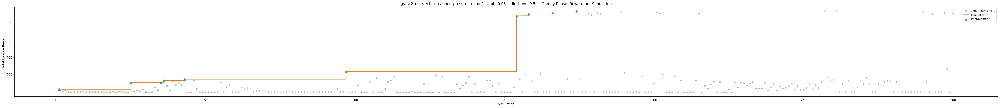
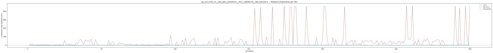
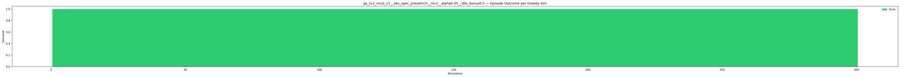
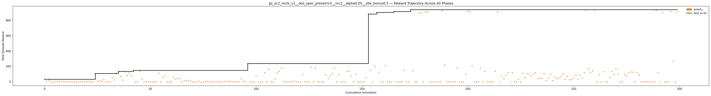

# Experiment: gs_sc2_mcts_v1__obs_spec_presetrich__mc2__alpha0.05__idle_bonus0.5

**Game:** StarCraft 2

## Timings

- **Start:** 2026-05-06 07:33:11
- **End:** 2026-05-06 07:45:23
- **Total runtime:** 12m 11.9s

| Phase | Duration |
|-------|----------|
| Greedy | 12m 10.9s |

## Run Parameters

### Training

| Parameter | Value |
|-----------|-------|
| track | sc2_DefeatRoaches |
| obs_spec_preset | rich |
| enable_belief | False |
| map_name | DefeatRoaches |
| in_game_episode_s | 120.0 |
| step_mul | 8 |
| screen_size | 64 |
| minimap_size | 64 |
| agent_race | random |
| n_sims | 300 |
| policy_type | mcts |
| mcts_c | 2.0 |
| alpha | 0.05 |
| policy_params | {'n_bins': 3, 'gamma': 0.99, 'alpha': 0.05, 'c': 2.0} |

### Reward Config

| Parameter | Value |
|-----------|-------|
| score_weight | 0.5 |
| win_bonus | 0.0 |
| loss_penalty | 0.0 |
| step_penalty | -0.001 |
| idle_penalty | 0.0 |
| idle_bonus | 0.5 |
| economy_weight | 0.0 |

## Greedy Phase

Best reward: **+938.1**

| Sim  | Reward   | Progress | Finish Time | Mean abs lat | Reason       | Result       |
|------|----------|----------|-------------|--------------|--------------|-------------|
|    1 |    +30.8 | 0.000    | —           | —       | finish       | **NEW BEST** |
|    2 |     +2.9 | 0.000    | —           | —       | finish       |  |
|    3 |    +19.0 | 0.000    | —           | —       | finish       |  |
|    4 |     -0.9 | 0.000    | —           | —       | finish       |  |
|    5 |     -5.1 | 0.000    | —           | —       | finish       |  |
|    6 |     -1.0 | 0.000    | —           | —       | finish       |  |
|    7 |     -1.0 | 0.000    | —           | —       | finish       |  |
|    8 |     -1.0 | 0.000    | —           | —       | finish       |  |
|    9 |     +7.1 | 0.000    | —           | —       | finish       |  |
|   10 |     -1.0 | 0.000    | —           | —       | finish       |  |
|   11 |     -1.2 | 0.000    | —           | —       | finish       |  |
|   12 |     -1.7 | 0.000    | —           | —       | finish       |  |
|   13 |     -0.9 | 0.000    | —           | —       | finish       |  |
|   14 |     -1.2 | 0.000    | —           | —       | finish       |  |
|   15 |     -1.0 | 0.000    | —           | —       | finish       |  |
|   16 |     -4.9 | 0.000    | —           | —       | finish       |  |
|   17 |     -5.1 | 0.000    | —           | —       | finish       |  |
|   18 |     -0.9 | 0.000    | —           | —       | finish       |  |
|   19 |     +3.0 | 0.000    | —           | —       | finish       |  |
|   20 |     -4.8 | 0.000    | —           | —       | finish       |  |
|   21 |     +2.8 | 0.000    | —           | —       | finish       |  |
|   22 |     +3.1 | 0.000    | —           | —       | finish       |  |
|   23 |     -4.9 | 0.000    | —           | —       | finish       |  |
|   24 |     -5.0 | 0.000    | —           | —       | finish       |  |
|   25 |   +106.9 | 0.000    | —           | —       | finish       | **NEW BEST** |
|   26 |     +1.6 | 0.000    | —           | —       | finish       |  |
|   27 |    +13.9 | 0.000    | —           | —       | finish       |  |
|   28 |     +3.0 | 0.000    | —           | —       | finish       |  |
|   29 |    +26.5 | 0.000    | —           | —       | finish       |  |
|   30 |     -0.9 | 0.000    | —           | —       | finish       |  |
|   31 |     -5.0 | 0.000    | —           | —       | finish       |  |
|   32 |     -1.2 | 0.000    | —           | —       | finish       |  |
|   33 |    +55.1 | 0.000    | —           | —       | finish       |  |
|   34 |    +23.0 | 0.000    | —           | —       | finish       |  |
|   35 |   +109.7 | 0.000    | —           | —       | finish       | **NEW BEST** |
|   36 |   +134.8 | 0.000    | —           | —       | finish       | **NEW BEST** |
|   37 |    +70.9 | 0.000    | —           | —       | finish       |  |
|   38 |    +19.7 | 0.000    | —           | —       | finish       |  |
|   39 |   +127.7 | 0.000    | —           | —       | finish       |  |
|   40 |    +82.6 | 0.000    | —           | —       | finish       |  |
|   41 |   +111.1 | 0.000    | —           | —       | finish       |  |
|   42 |    +78.6 | 0.000    | —           | —       | finish       |  |
|   43 |   +148.1 | 0.000    | —           | —       | finish       | **NEW BEST** |
|   44 |     -1.9 | 0.000    | —           | —       | finish       |  |
|   45 |     -1.9 | 0.000    | —           | —       | finish       |  |
|   46 |   +135.8 | 0.000    | —           | —       | finish       |  |
|   47 |    +35.1 | 0.000    | —           | —       | finish       |  |
|   48 |     -1.9 | 0.000    | —           | —       | finish       |  |
|   49 |     -1.9 | 0.000    | —           | —       | finish       |  |
|   50 |     -1.9 | 0.000    | —           | —       | finish       |  |
|   51 |     -1.9 | 0.000    | —           | —       | finish       |  |
|   52 |     -1.9 | 0.000    | —           | —       | finish       |  |
|   53 |     -1.9 | 0.000    | —           | —       | finish       |  |
|   54 |     -1.9 | 0.000    | —           | —       | finish       |  |
|   55 |   +110.6 | 0.000    | —           | —       | finish       |  |
|   56 |     -1.9 | 0.000    | —           | —       | finish       |  |
|   57 |    +55.1 | 0.000    | —           | —       | finish       |  |
|   58 |    +79.1 | 0.000    | —           | —       | finish       |  |
|   59 |     -1.9 | 0.000    | —           | —       | finish       |  |
|   60 |     -1.9 | 0.000    | —           | —       | finish       |  |
|   61 |     -1.9 | 0.000    | —           | —       | finish       |  |
|   62 |    +54.3 | 0.000    | —           | —       | finish       |  |
|   63 |    +32.1 | 0.000    | —           | —       | finish       |  |
|   64 |    +44.1 | 0.000    | —           | —       | finish       |  |
|   65 |    +40.1 | 0.000    | —           | —       | finish       |  |
|   66 |     -1.9 | 0.000    | —           | —       | finish       |  |
|   67 |    +15.1 | 0.000    | —           | —       | finish       |  |
|   68 |     +9.7 | 0.000    | —           | —       | finish       |  |
|   69 |    +18.8 | 0.000    | —           | —       | finish       |  |
|   70 |     +7.1 | 0.000    | —           | —       | finish       |  |
|   71 |     -1.0 | 0.000    | —           | —       | finish       |  |
|   72 |     -5.3 | 0.000    | —           | —       | finish       |  |
|   73 |     -1.1 | 0.000    | —           | —       | finish       |  |
|   74 |     +6.9 | 0.000    | —           | —       | finish       |  |
|   75 |     -5.1 | 0.000    | —           | —       | finish       |  |
|   76 |     -4.9 | 0.000    | —           | —       | finish       |  |
|   77 |     -0.9 | 0.000    | —           | —       | finish       |  |
|   78 |     +7.0 | 0.000    | —           | —       | finish       |  |
|   79 |     -1.0 | 0.000    | —           | —       | finish       |  |
|   80 |     -5.3 | 0.000    | —           | —       | finish       |  |
|   81 |     -0.9 | 0.000    | —           | —       | finish       |  |
|   82 |     -1.2 | 0.000    | —           | —       | finish       |  |
|   83 |     +2.5 | 0.000    | —           | —       | finish       |  |
|   84 |     -4.9 | 0.000    | —           | —       | finish       |  |
|   85 |     -5.1 | 0.000    | —           | —       | finish       |  |
|   86 |     +2.3 | 0.000    | —           | —       | finish       |  |
|   87 |     +6.9 | 0.000    | —           | —       | finish       |  |
|   88 |     -1.4 | 0.000    | —           | —       | finish       |  |
|   89 |     +3.1 | 0.000    | —           | —       | finish       |  |
|   90 |     -1.1 | 0.000    | —           | —       | finish       |  |
|   91 |     -1.0 | 0.000    | —           | —       | finish       |  |
|   92 |     -1.2 | 0.000    | —           | —       | finish       |  |
|   93 |     -4.9 | 0.000    | —           | —       | finish       |  |
|   94 |    +34.4 | 0.000    | —           | —       | finish       |  |
|   95 |     +3.1 | 0.000    | —           | —       | finish       |  |
|   96 |     +3.0 | 0.000    | —           | —       | finish       |  |
|   97 |   +236.1 | 0.000    | —           | —       | finish       | **NEW BEST** |
|   98 |     -5.1 | 0.000    | —           | —       | finish       |  |
|   99 |     -1.9 | 0.000    | —           | —       | finish       |  |
|  100 |     -5.2 | 0.000    | —           | —       | finish       |  |
|  101 |    +75.1 | 0.000    | —           | —       | finish       |  |
|  102 |     -0.9 | 0.000    | —           | —       | finish       |  |
|  103 |     -5.0 | 0.000    | —           | —       | finish       |  |
|  104 |     -1.9 | 0.000    | —           | —       | finish       |  |
|  105 |   +118.9 | 0.000    | —           | —       | finish       |  |
|  106 |     -1.9 | 0.000    | —           | —       | finish       |  |
|  107 |   +164.0 | 0.000    | —           | —       | finish       |  |
|  108 |     -1.9 | 0.000    | —           | —       | finish       |  |
|  109 |     -1.9 | 0.000    | —           | —       | finish       |  |
|  110 |    +34.9 | 0.000    | —           | —       | finish       |  |
|  111 |   +114.7 | 0.000    | —           | —       | finish       |  |
|  112 |   +136.1 | 0.000    | —           | —       | finish       |  |
|  113 |   +177.0 | 0.000    | —           | —       | finish       |  |
|  114 |     -1.9 | 0.000    | —           | —       | finish       |  |
|  115 |     -1.9 | 0.000    | —           | —       | finish       |  |
|  116 |     -1.9 | 0.000    | —           | —       | finish       |  |
|  117 |     -1.9 | 0.000    | —           | —       | finish       |  |
|  118 |     -1.9 | 0.000    | —           | —       | finish       |  |
|  119 |     +5.6 | 0.000    | —           | —       | finish       |  |
|  120 |     -1.9 | 0.000    | —           | —       | finish       |  |
|  121 |     -1.9 | 0.000    | —           | —       | finish       |  |
|  122 |     -1.9 | 0.000    | —           | —       | finish       |  |
|  123 |    +95.2 | 0.000    | —           | —       | finish       |  |
|  124 |     -1.9 | 0.000    | —           | —       | finish       |  |
|  125 |     -1.9 | 0.000    | —           | —       | finish       |  |
|  126 |     -1.9 | 0.000    | —           | —       | finish       |  |
|  127 |   +190.6 | 0.000    | —           | —       | finish       |  |
|  128 |     -1.9 | 0.000    | —           | —       | finish       |  |
|  129 |   +177.1 | 0.000    | —           | —       | finish       |  |
|  130 |     -1.9 | 0.000    | —           | —       | finish       |  |
|  131 |     -1.9 | 0.000    | —           | —       | finish       |  |
|  132 |     -1.9 | 0.000    | —           | —       | finish       |  |
|  133 |     -1.9 | 0.000    | —           | —       | finish       |  |
|  134 |    +92.1 | 0.000    | —           | —       | finish       |  |
|  135 |    +39.8 | 0.000    | —           | —       | finish       |  |
|  136 |    +80.1 | 0.000    | —           | —       | finish       |  |
|  137 |   +103.0 | 0.000    | —           | —       | finish       |  |
|  138 |   +175.1 | 0.000    | —           | —       | finish       |  |
|  139 |     -1.9 | 0.000    | —           | —       | finish       |  |
|  140 |    +91.6 | 0.000    | —           | —       | finish       |  |
|  141 |     -1.9 | 0.000    | —           | —       | finish       |  |
|  142 |     +2.1 | 0.000    | —           | —       | finish       |  |
|  143 |     -1.9 | 0.000    | —           | —       | finish       |  |
|  144 |   +135.0 | 0.000    | —           | —       | finish       |  |
|  145 |   +136.1 | 0.000    | —           | —       | finish       |  |
|  146 |    +70.5 | 0.000    | —           | —       | finish       |  |
|  147 |     -1.9 | 0.000    | —           | —       | finish       |  |
|  148 |    +96.0 | 0.000    | —           | —       | finish       |  |
|  149 |     -1.9 | 0.000    | —           | —       | finish       |  |
|  150 |     -1.9 | 0.000    | —           | —       | finish       |  |
|  151 |     -1.9 | 0.000    | —           | —       | finish       |  |
|  152 |     -1.9 | 0.000    | —           | —       | finish       |  |
|  153 |    +50.1 | 0.000    | —           | —       | finish       |  |
|  154 |   +882.1 | 0.000    | —           | —       | finish       | **NEW BEST** |
|  155 |   +147.0 | 0.000    | —           | —       | finish       |  |
|  156 |     -1.9 | 0.000    | —           | —       | finish       |  |
|  157 |   +202.0 | 0.000    | —           | —       | finish       |  |
|  158 |   +902.1 | 0.000    | —           | —       | finish       | **NEW BEST** |
|  159 |   +123.1 | 0.000    | —           | —       | finish       |  |
|  160 |     -1.9 | 0.000    | —           | —       | finish       |  |
|  161 |     -1.9 | 0.000    | —           | —       | finish       |  |
|  162 |   +209.6 | 0.000    | —           | —       | finish       |  |
|  163 |     -1.9 | 0.000    | —           | —       | finish       |  |
|  164 |     -1.9 | 0.000    | —           | —       | finish       |  |
|  165 |     -1.9 | 0.000    | —           | —       | finish       |  |
|  166 |   +914.1 | 0.000    | —           | —       | finish       | **NEW BEST** |
|  167 |     -1.9 | 0.000    | —           | —       | finish       |  |
|  168 |     -1.9 | 0.000    | —           | —       | finish       |  |
|  169 |     -1.9 | 0.000    | —           | —       | finish       |  |
|  170 |     -1.9 | 0.000    | —           | —       | finish       |  |
|  171 |   +149.1 | 0.000    | —           | —       | finish       |  |
|  172 |     -1.9 | 0.000    | —           | —       | finish       |  |
|  173 |     -1.9 | 0.000    | —           | —       | finish       |  |
|  174 |   +938.1 | 0.000    | —           | —       | finish       | **NEW BEST** |
|  175 |   +144.1 | 0.000    | —           | —       | finish       |  |
|  176 |     -1.9 | 0.000    | —           | —       | finish       |  |
|  177 |     -1.9 | 0.000    | —           | —       | finish       |  |
|  178 |   +902.1 | 0.000    | —           | —       | finish       |  |
|  179 |   +894.1 | 0.000    | —           | —       | finish       |  |
|  180 |     -1.9 | 0.000    | —           | —       | finish       |  |
|  181 |   +914.1 | 0.000    | —           | —       | finish       |  |
|  182 |   +906.1 | 0.000    | —           | —       | finish       |  |
|  183 |     -1.9 | 0.000    | —           | —       | finish       |  |
|  184 |     +2.1 | 0.000    | —           | —       | finish       |  |
|  185 |     -1.9 | 0.000    | —           | —       | finish       |  |
|  186 |     -1.9 | 0.000    | —           | —       | finish       |  |
|  187 |     -1.9 | 0.000    | —           | —       | finish       |  |
|  188 |     -1.9 | 0.000    | —           | —       | finish       |  |
|  189 |   +922.1 | 0.000    | —           | —       | finish       |  |
|  190 |   +218.0 | 0.000    | —           | —       | finish       |  |
|  191 |     -1.9 | 0.000    | —           | —       | finish       |  |
|  192 |     -1.9 | 0.000    | —           | —       | finish       |  |
|  193 |     -1.9 | 0.000    | —           | —       | finish       |  |
|  194 |     +2.1 | 0.000    | —           | —       | finish       |  |
|  195 |     -1.9 | 0.000    | —           | —       | finish       |  |
|  196 |   +181.1 | 0.000    | —           | —       | finish       |  |
|  197 |     -1.9 | 0.000    | —           | —       | finish       |  |
|  198 |     -1.9 | 0.000    | —           | —       | finish       |  |
|  199 |     -1.9 | 0.000    | —           | —       | finish       |  |
|  200 |    +99.1 | 0.000    | —           | —       | finish       |  |
|  201 |   +922.1 | 0.000    | —           | —       | finish       |  |
|  202 |   +910.1 | 0.000    | —           | —       | finish       |  |
|  203 |   +201.0 | 0.000    | —           | —       | finish       |  |
|  204 |     -1.9 | 0.000    | —           | —       | finish       |  |
|  205 |     -1.9 | 0.000    | —           | —       | finish       |  |
|  206 |     -1.9 | 0.000    | —           | —       | finish       |  |
|  207 |   +180.1 | 0.000    | —           | —       | finish       |  |
|  208 |     -1.9 | 0.000    | —           | —       | finish       |  |
|  209 |   +136.1 | 0.000    | —           | —       | finish       |  |
|  210 |     -1.9 | 0.000    | —           | —       | finish       |  |
|  211 |     -1.9 | 0.000    | —           | —       | finish       |  |
|  212 |     -1.9 | 0.000    | —           | —       | finish       |  |
|  213 |     -1.9 | 0.000    | —           | —       | finish       |  |
|  214 |   +135.1 | 0.000    | —           | —       | finish       |  |
|  215 |   +906.1 | 0.000    | —           | —       | finish       |  |
|  216 |     -1.9 | 0.000    | —           | —       | finish       |  |
|  217 |    +70.1 | 0.000    | —           | —       | finish       |  |
|  218 |    +39.8 | 0.000    | —           | —       | finish       |  |
|  219 |    +87.1 | 0.000    | —           | —       | finish       |  |
|  220 |   +119.1 | 0.000    | —           | —       | finish       |  |
|  221 |     -1.9 | 0.000    | —           | —       | finish       |  |
|  222 |   +115.1 | 0.000    | —           | —       | finish       |  |
|  223 |     -1.9 | 0.000    | —           | —       | finish       |  |
|  224 |     -1.9 | 0.000    | —           | —       | finish       |  |
|  225 |    +32.1 | 0.000    | —           | —       | finish       |  |
|  226 |     -1.9 | 0.000    | —           | —       | finish       |  |
|  227 |   +108.0 | 0.000    | —           | —       | finish       |  |
|  228 |    +55.1 | 0.000    | —           | —       | finish       |  |
|  229 |   +106.8 | 0.000    | —           | —       | finish       |  |
|  230 |    +99.1 | 0.000    | —           | —       | finish       |  |
|  231 |    +76.1 | 0.000    | —           | —       | finish       |  |
|  232 |   +100.0 | 0.000    | —           | —       | finish       |  |
|  233 |   +115.1 | 0.000    | —           | —       | finish       |  |
|  234 |    +39.1 | 0.000    | —           | —       | finish       |  |
|  235 |    +43.6 | 0.000    | —           | —       | finish       |  |
|  236 |    +44.1 | 0.000    | —           | —       | finish       |  |
|  237 |   +107.0 | 0.000    | —           | —       | finish       |  |
|  238 |    +17.1 | 0.000    | —           | —       | finish       |  |
|  239 |    +51.1 | 0.000    | —           | —       | finish       |  |
|  240 |    +94.8 | 0.000    | —           | —       | finish       |  |
|  241 |    +16.1 | 0.000    | —           | —       | finish       |  |
|  242 |    +63.1 | 0.000    | —           | —       | finish       |  |
|  243 |    +42.1 | 0.000    | —           | —       | finish       |  |
|  244 |    +48.0 | 0.000    | —           | —       | finish       |  |
|  245 |    +67.1 | 0.000    | —           | —       | finish       |  |
|  246 |    +99.0 | 0.000    | —           | —       | finish       |  |
|  247 |    +29.1 | 0.000    | —           | —       | finish       |  |
|  248 |    +71.1 | 0.000    | —           | —       | finish       |  |
|  249 |    +26.1 | 0.000    | —           | —       | finish       |  |
|  250 |    +26.9 | 0.000    | —           | —       | finish       |  |
|  251 |    +47.2 | 0.000    | —           | —       | finish       |  |
|  252 |    +87.1 | 0.000    | —           | —       | finish       |  |
|  253 |    +29.1 | 0.000    | —           | —       | finish       |  |
|  254 |    +83.2 | 0.000    | —           | —       | finish       |  |
|  255 |    +48.0 | 0.000    | —           | —       | finish       |  |
|  256 |   +119.0 | 0.000    | —           | —       | finish       |  |
|  257 |   +934.1 | 0.000    | —           | —       | finish       |  |
|  258 |   +167.9 | 0.000    | —           | —       | finish       |  |
|  259 |   +123.0 | 0.000    | —           | —       | finish       |  |
|  260 |   +142.1 | 0.000    | —           | —       | finish       |  |
|  261 |   +934.1 | 0.000    | —           | —       | finish       |  |
|  262 |     -1.9 | 0.000    | —           | —       | finish       |  |
|  263 |    +91.6 | 0.000    | —           | —       | finish       |  |
|  264 |     -1.9 | 0.000    | —           | —       | finish       |  |
|  265 |   +131.1 | 0.000    | —           | —       | finish       |  |
|  266 |     -1.9 | 0.000    | —           | —       | finish       |  |
|  267 |     -1.9 | 0.000    | —           | —       | finish       |  |
|  268 |    +53.1 | 0.000    | —           | —       | finish       |  |
|  269 |   +131.9 | 0.000    | —           | —       | finish       |  |
|  270 |    +91.2 | 0.000    | —           | —       | finish       |  |
|  271 |   +165.0 | 0.000    | —           | —       | finish       |  |
|  272 |    +96.1 | 0.000    | —           | —       | finish       |  |
|  273 |     -1.9 | 0.000    | —           | —       | finish       |  |
|  274 |     -1.9 | 0.000    | —           | —       | finish       |  |
|  275 |    +95.1 | 0.000    | —           | —       | finish       |  |
|  276 |    +75.1 | 0.000    | —           | —       | finish       |  |
|  277 |   +115.2 | 0.000    | —           | —       | finish       |  |
|  278 |   +128.0 | 0.000    | —           | —       | finish       |  |
|  279 |   +123.0 | 0.000    | —           | —       | finish       |  |
|  280 |     -1.9 | 0.000    | —           | —       | finish       |  |
|  281 |   +115.1 | 0.000    | —           | —       | finish       |  |
|  282 |    +87.1 | 0.000    | —           | —       | finish       |  |
|  283 |     -1.9 | 0.000    | —           | —       | finish       |  |
|  284 |     +2.1 | 0.000    | —           | —       | finish       |  |
|  285 |     -1.9 | 0.000    | —           | —       | finish       |  |
|  286 |     -1.9 | 0.000    | —           | —       | finish       |  |
|  287 |     -1.9 | 0.000    | —           | —       | finish       |  |
|  288 |     -1.9 | 0.000    | —           | —       | finish       |  |
|  289 |     -1.9 | 0.000    | —           | —       | finish       |  |
|  290 |   +930.1 | 0.000    | —           | —       | finish       |  |
|  291 |   +115.1 | 0.000    | —           | —       | finish       |  |
|  292 |     -1.9 | 0.000    | —           | —       | finish       |  |
|  293 |   +902.1 | 0.000    | —           | —       | finish       |  |
|  294 |     -1.9 | 0.000    | —           | —       | finish       |  |
|  295 |     -1.9 | 0.000    | —           | —       | finish       |  |
|  296 |     -1.9 | 0.000    | —           | —       | finish       |  |
|  297 |   +914.1 | 0.000    | —           | —       | finish       |  |
|  298 |   +265.9 | 0.000    | —           | —       | finish       |  |
|  299 |     -1.9 | 0.000    | —           | —       | finish       |  |
|  300 |   +910.1 | 0.000    | —           | —       | finish       |  |

