# Grid Search Summary: gs_sc2_mcts_v1

54 experiments.

## Rankings by Task Metrics (config-independent)

Ranked by best track progress, then by best reward.

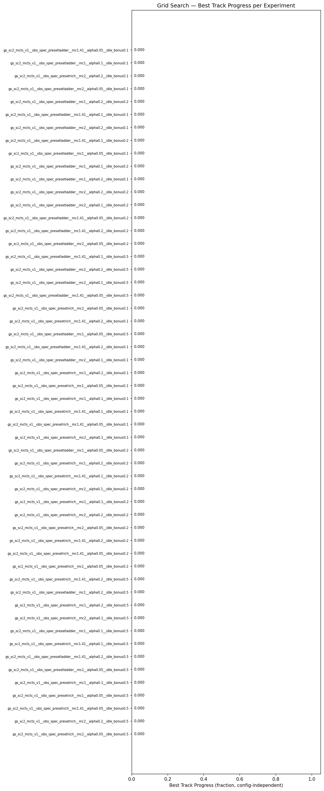

| Rank | Experiment | Best Progress | Finish Rate | Best Finish Time | Best Reward |
|------|-----------|---------------|-------------|-----------------|-------------|
| 1 | gs_sc2_mcts_v1__obs_spec_presetrich__mc2__alpha0.05__idle_bonus0.5 | 0.0000 | 0.0% | — | +938.1 |
| 2 | gs_sc2_mcts_v1__obs_spec_presetrich__mc2__alpha0.2__idle_bonus0.5 | 0.0000 | 0.0% | — | +938.1 |
| 3 | gs_sc2_mcts_v1__obs_spec_presetrich__mc1.41__alpha0.05__idle_bonus0.5 | 0.0000 | 0.0% | — | +930.1 |
| 4 | gs_sc2_mcts_v1__obs_spec_presetrich__mc1__alpha0.05__idle_bonus0.5 | 0.0000 | 0.0% | — | +926.1 |
| 5 | gs_sc2_mcts_v1__obs_spec_presetrich__mc1__alpha0.1__idle_bonus0.5 | 0.0000 | 0.0% | — | +926.1 |
| 6 | gs_sc2_mcts_v1__obs_spec_presetladder__mc2__alpha0.05__idle_bonus0.5 | 0.0000 | 0.0% | — | +914.1 |
| 7 | gs_sc2_mcts_v1__obs_spec_presetladder__mc1.41__alpha0.2__idle_bonus0.5 | 0.0000 | 0.0% | — | +913.1 |
| 8 | gs_sc2_mcts_v1__obs_spec_presetrich__mc1.41__alpha0.1__idle_bonus0.5 | 0.0000 | 0.0% | — | +893.6 |
| 9 | gs_sc2_mcts_v1__obs_spec_presetladder__mc1__alpha0.1__idle_bonus0.5 | 0.0000 | 0.0% | — | +877.6 |
| 10 | gs_sc2_mcts_v1__obs_spec_presetrich__mc2__alpha0.1__idle_bonus0.5 | 0.0000 | 0.0% | — | +854.6 |
| 11 | gs_sc2_mcts_v1__obs_spec_presetrich__mc1__alpha0.2__idle_bonus0.5 | 0.0000 | 0.0% | — | +842.1 |
| 12 | gs_sc2_mcts_v1__obs_spec_presetladder__mc1__alpha0.2__idle_bonus0.5 | 0.0000 | 0.0% | — | +651.1 |
| 13 | gs_sc2_mcts_v1__obs_spec_presetrich__mc1.41__alpha0.2__idle_bonus0.5 | 0.0000 | 0.0% | — | +455.1 |
| 14 | gs_sc2_mcts_v1__obs_spec_presetrich__mc1__alpha0.05__idle_bonus0.2 | 0.0000 | 0.0% | — | +372.5 |
| 15 | gs_sc2_mcts_v1__obs_spec_presetrich__mc1.41__alpha0.05__idle_bonus0.2 | 0.0000 | 0.0% | — | +372.5 |
| 16 | gs_sc2_mcts_v1__obs_spec_presetrich__mc1.41__alpha0.2__idle_bonus0.2 | 0.0000 | 0.0% | — | +372.5 |
| 17 | gs_sc2_mcts_v1__obs_spec_presetrich__mc2__alpha0.05__idle_bonus0.2 | 0.0000 | 0.0% | — | +369.3 |
| 18 | gs_sc2_mcts_v1__obs_spec_presetrich__mc2__alpha0.2__idle_bonus0.2 | 0.0000 | 0.0% | — | +369.3 |
| 19 | gs_sc2_mcts_v1__obs_spec_presetrich__mc1__alpha0.1__idle_bonus0.2 | 0.0000 | 0.0% | — | +367.7 |
| 20 | gs_sc2_mcts_v1__obs_spec_presetrich__mc2__alpha0.1__idle_bonus0.2 | 0.0000 | 0.0% | — | +367.7 |
| 21 | gs_sc2_mcts_v1__obs_spec_presetrich__mc1.41__alpha0.1__idle_bonus0.2 | 0.0000 | 0.0% | — | +358.2 |
| 22 | gs_sc2_mcts_v1__obs_spec_presetrich__mc1__alpha0.2__idle_bonus0.2 | 0.0000 | 0.0% | — | +352.9 |
| 23 | gs_sc2_mcts_v1__obs_spec_presetladder__mc1__alpha0.05__idle_bonus0.2 | 0.0000 | 0.0% | — | +348.5 |
| 24 | gs_sc2_mcts_v1__obs_spec_presetrich__mc2__alpha0.1__idle_bonus0.1 | 0.0000 | 0.0% | — | +182.9 |
| 25 | gs_sc2_mcts_v1__obs_spec_presetrich__mc1.41__alpha0.05__idle_bonus0.1 | 0.0000 | 0.0% | — | +180.5 |
| 26 | gs_sc2_mcts_v1__obs_spec_presetrich__mc1.41__alpha0.1__idle_bonus0.1 | 0.0000 | 0.0% | — | +178.1 |
| 27 | gs_sc2_mcts_v1__obs_spec_presetrich__mc1__alpha0.1__idle_bonus0.1 | 0.0000 | 0.0% | — | +177.1 |
| 28 | gs_sc2_mcts_v1__obs_spec_presetrich__mc1__alpha0.05__idle_bonus0.1 | 0.0000 | 0.0% | — | +175.7 |
| 29 | gs_sc2_mcts_v1__obs_spec_presetrich__mc1__alpha0.2__idle_bonus0.1 | 0.0000 | 0.0% | — | +173.7 |
| 30 | gs_sc2_mcts_v1__obs_spec_presetladder__mc2__alpha0.1__idle_bonus0.1 | 0.0000 | 0.0% | — | +173.6 |
| 31 | gs_sc2_mcts_v1__obs_spec_presetladder__mc1.41__alpha0.2__idle_bonus0.1 | 0.0000 | 0.0% | — | +169.6 |
| 32 | gs_sc2_mcts_v1__obs_spec_presetladder__mc1__alpha0.05__idle_bonus0.5 | 0.0000 | 0.0% | — | +159.8 |
| 33 | gs_sc2_mcts_v1__obs_spec_presetrich__mc1.41__alpha0.2__idle_bonus0.1 | 0.0000 | 0.0% | — | +156.6 |
| 34 | gs_sc2_mcts_v1__obs_spec_presetrich__mc2__alpha0.05__idle_bonus0.1 | 0.0000 | 0.0% | — | +152.6 |
| 35 | gs_sc2_mcts_v1__obs_spec_presetladder__mc1.41__alpha0.05__idle_bonus0.5 | 0.0000 | 0.0% | — | +148.0 |
| 36 | gs_sc2_mcts_v1__obs_spec_presetladder__mc2__alpha0.1__idle_bonus0.5 | 0.0000 | 0.0% | — | +147.9 |
| 37 | gs_sc2_mcts_v1__obs_spec_presetladder__mc2__alpha0.2__idle_bonus0.5 | 0.0000 | 0.0% | — | +111.2 |
| 38 | gs_sc2_mcts_v1__obs_spec_presetladder__mc1.41__alpha0.1__idle_bonus0.5 | 0.0000 | 0.0% | — | +107.2 |
| 39 | gs_sc2_mcts_v1__obs_spec_presetladder__mc2__alpha0.05__idle_bonus0.2 | 0.0000 | 0.0% | — | +106.0 |
| 40 | gs_sc2_mcts_v1__obs_spec_presetladder__mc1.41__alpha0.2__idle_bonus0.2 | 0.0000 | 0.0% | — | +87.1 |
| 41 | gs_sc2_mcts_v1__obs_spec_presetladder__mc1.41__alpha0.05__idle_bonus0.2 | 0.0000 | 0.0% | — | +77.5 |
| 42 | gs_sc2_mcts_v1__obs_spec_presetladder__mc2__alpha0.1__idle_bonus0.2 | 0.0000 | 0.0% | — | +69.0 |
| 43 | gs_sc2_mcts_v1__obs_spec_presetladder__mc2__alpha0.2__idle_bonus0.2 | 0.0000 | 0.0% | — | +65.7 |
| 44 | gs_sc2_mcts_v1__obs_spec_presetladder__mc1__alpha0.2__idle_bonus0.1 | 0.0000 | 0.0% | — | +63.0 |
| 45 | gs_sc2_mcts_v1__obs_spec_presetladder__mc1__alpha0.1__idle_bonus0.2 | 0.0000 | 0.0% | — | +61.1 |
| 46 | gs_sc2_mcts_v1__obs_spec_presetladder__mc1__alpha0.05__idle_bonus0.1 | 0.0000 | 0.0% | — | +57.3 |
| 47 | gs_sc2_mcts_v1__obs_spec_presetladder__mc1.41__alpha0.1__idle_bonus0.2 | 0.0000 | 0.0% | — | +49.6 |
| 48 | gs_sc2_mcts_v1__obs_spec_presetladder__mc2__alpha0.2__idle_bonus0.1 | 0.0000 | 0.0% | — | +49.2 |
| 49 | gs_sc2_mcts_v1__obs_spec_presetladder__mc1.41__alpha0.1__idle_bonus0.1 | 0.0000 | 0.0% | — | +47.7 |
| 50 | gs_sc2_mcts_v1__obs_spec_presetladder__mc1__alpha0.2__idle_bonus0.2 | 0.0000 | 0.0% | — | +43.1 |
| 51 | gs_sc2_mcts_v1__obs_spec_presetladder__mc2__alpha0.05__idle_bonus0.1 | 0.0000 | 0.0% | — | +33.7 |
| 52 | gs_sc2_mcts_v1__obs_spec_presetrich__mc2__alpha0.2__idle_bonus0.1 | 0.0000 | 0.0% | — | +27.8 |
| 53 | gs_sc2_mcts_v1__obs_spec_presetladder__mc1__alpha0.1__idle_bonus0.1 | 0.0000 | 0.0% | — | +27.2 |
| 54 | gs_sc2_mcts_v1__obs_spec_presetladder__mc1.41__alpha0.05__idle_bonus0.1 | 0.0000 | 0.0% | — | +26.5 |

## Rankings by Reward

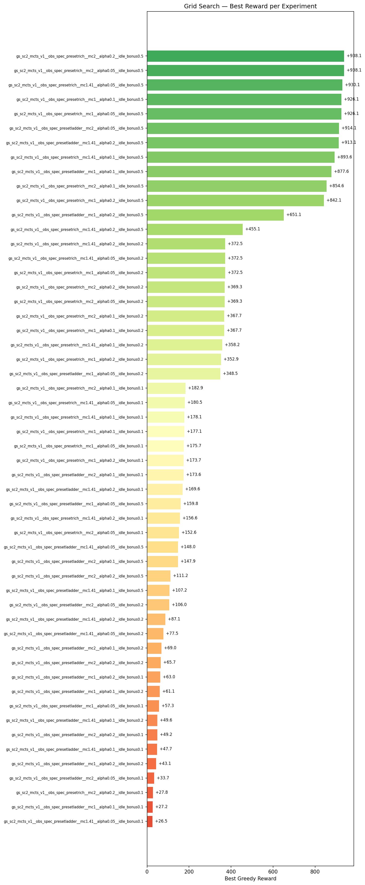

| Rank | Experiment | Best Reward | Improvements | First Improv. Sim | Accel % | Greedy Time |
|------|-----------|-------------|--------------|-------------------|---------|-------------|
| 1 | gs_sc2_mcts_v1__obs_spec_presetrich__mc2__alpha0.05__idle_bonus0.5 | +938.1 | 10 | 1 | 100% | 12m 10.9s |
| 2 | gs_sc2_mcts_v1__obs_spec_presetrich__mc2__alpha0.2__idle_bonus0.5 | +938.1 | 7 | 1 | 100% | 8m 55.2s |
| 3 | gs_sc2_mcts_v1__obs_spec_presetrich__mc1.41__alpha0.05__idle_bonus0.5 | +930.1 | 7 | 1 | 99% | 14m 29.4s |
| 4 | gs_sc2_mcts_v1__obs_spec_presetrich__mc1__alpha0.05__idle_bonus0.5 | +926.1 | 14 | 1 | 100% | 12m 31.0s |
| 5 | gs_sc2_mcts_v1__obs_spec_presetrich__mc1__alpha0.1__idle_bonus0.5 | +926.1 | 10 | 1 | 100% | 12m 08.7s |
| 6 | gs_sc2_mcts_v1__obs_spec_presetladder__mc2__alpha0.05__idle_bonus0.5 | +914.1 | 7 | 1 | 100% | 14m 35.4s |
| 7 | gs_sc2_mcts_v1__obs_spec_presetladder__mc1.41__alpha0.2__idle_bonus0.5 | +913.1 | 6 | 1 | 95% | 14m 43.5s |
| 8 | gs_sc2_mcts_v1__obs_spec_presetrich__mc1.41__alpha0.1__idle_bonus0.5 | +893.6 | 8 | 1 | 98% | 10m 09.6s |
| 9 | gs_sc2_mcts_v1__obs_spec_presetladder__mc1__alpha0.1__idle_bonus0.5 | +877.6 | 5 | 1 | 100% | 14m 30.2s |
| 10 | gs_sc2_mcts_v1__obs_spec_presetrich__mc2__alpha0.1__idle_bonus0.5 | +854.6 | 9 | 1 | 94% | 9m 20.8s |
| 11 | gs_sc2_mcts_v1__obs_spec_presetrich__mc1__alpha0.2__idle_bonus0.5 | +842.1 | 3 | 1 | 93% | 9m 32.7s |
| 12 | gs_sc2_mcts_v1__obs_spec_presetladder__mc1__alpha0.2__idle_bonus0.5 | +651.1 | 2 | 1 | 85% | 14m 58.4s |
| 13 | gs_sc2_mcts_v1__obs_spec_presetrich__mc1.41__alpha0.2__idle_bonus0.5 | +455.1 | 9 | 1 | 74% | 8m 57.4s |
| 14 | gs_sc2_mcts_v1__obs_spec_presetrich__mc1__alpha0.05__idle_bonus0.2 | +372.5 | 9 | 1 | 100% | 11m 57.0s |
| 15 | gs_sc2_mcts_v1__obs_spec_presetrich__mc1.41__alpha0.05__idle_bonus0.2 | +372.5 | 7 | 1 | 99% | 11m 24.5s |
| 16 | gs_sc2_mcts_v1__obs_spec_presetrich__mc1.41__alpha0.2__idle_bonus0.2 | +372.5 | 8 | 1 | 98% | 8m 44.5s |
| 17 | gs_sc2_mcts_v1__obs_spec_presetrich__mc2__alpha0.05__idle_bonus0.2 | +369.3 | 8 | 1 | 98% | 11m 03.9s |
| 18 | gs_sc2_mcts_v1__obs_spec_presetrich__mc2__alpha0.2__idle_bonus0.2 | +369.3 | 7 | 1 | 97% | 8m 20.7s |
| 19 | gs_sc2_mcts_v1__obs_spec_presetrich__mc1__alpha0.1__idle_bonus0.2 | +367.7 | 7 | 1 | 99% | 9m 57.2s |
| 20 | gs_sc2_mcts_v1__obs_spec_presetrich__mc2__alpha0.1__idle_bonus0.2 | +367.7 | 9 | 1 | 98% | 9m 09.5s |
| 21 | gs_sc2_mcts_v1__obs_spec_presetrich__mc1.41__alpha0.1__idle_bonus0.2 | +358.2 | 8 | 1 | 100% | 9m 36.7s |
| 22 | gs_sc2_mcts_v1__obs_spec_presetrich__mc1__alpha0.2__idle_bonus0.2 | +352.9 | 10 | 1 | 98% | 9m 44.1s |
| 23 | gs_sc2_mcts_v1__obs_spec_presetladder__mc1__alpha0.05__idle_bonus0.2 | +348.5 | 5 | 1 | 97% | 13m 55.0s |
| 24 | gs_sc2_mcts_v1__obs_spec_presetrich__mc2__alpha0.1__idle_bonus0.1 | +182.9 | 5 | 1 | 99% | 9m 50.4s |
| 25 | gs_sc2_mcts_v1__obs_spec_presetrich__mc1.41__alpha0.05__idle_bonus0.1 | +180.5 | 10 | 1 | 99% | 11m 12.1s |
| 26 | gs_sc2_mcts_v1__obs_spec_presetrich__mc1.41__alpha0.1__idle_bonus0.1 | +178.1 | 5 | 1 | 97% | 8m 31.1s |
| 27 | gs_sc2_mcts_v1__obs_spec_presetrich__mc1__alpha0.1__idle_bonus0.1 | +177.1 | 10 | 1 | 94% | 10m 54.3s |
| 28 | gs_sc2_mcts_v1__obs_spec_presetrich__mc1__alpha0.05__idle_bonus0.1 | +175.7 | 8 | 1 | 96% | 10m 10.7s |
| 29 | gs_sc2_mcts_v1__obs_spec_presetrich__mc1__alpha0.2__idle_bonus0.1 | +173.7 | 6 | 1 | 93% | 10m 07.8s |
| 30 | gs_sc2_mcts_v1__obs_spec_presetladder__mc2__alpha0.1__idle_bonus0.1 | +173.6 | 6 | 1 | 100% | 14m 13.1s |
| 31 | gs_sc2_mcts_v1__obs_spec_presetladder__mc1.41__alpha0.2__idle_bonus0.1 | +169.6 | 5 | 1 | 95% | 13m 58.8s |
| 32 | gs_sc2_mcts_v1__obs_spec_presetladder__mc1__alpha0.05__idle_bonus0.5 | +159.8 | 8 | 1 | 94% | 14m 43.6s |
| 33 | gs_sc2_mcts_v1__obs_spec_presetrich__mc1.41__alpha0.2__idle_bonus0.1 | +156.6 | 9 | 1 | 92% | 9m 18.0s |
| 34 | gs_sc2_mcts_v1__obs_spec_presetrich__mc2__alpha0.05__idle_bonus0.1 | +152.6 | 8 | 1 | 91% | 9m 35.5s |
| 35 | gs_sc2_mcts_v1__obs_spec_presetladder__mc1.41__alpha0.05__idle_bonus0.5 | +148.0 | 3 | 1 | 81% | 13m 58.9s |
| 36 | gs_sc2_mcts_v1__obs_spec_presetladder__mc2__alpha0.1__idle_bonus0.5 | +147.9 | 6 | 1 | 75% | 13m 12.9s |
| 37 | gs_sc2_mcts_v1__obs_spec_presetladder__mc2__alpha0.2__idle_bonus0.5 | +111.2 | 4 | 1 | 100% | 14m 07.9s |
| 38 | gs_sc2_mcts_v1__obs_spec_presetladder__mc1.41__alpha0.1__idle_bonus0.5 | +107.2 | 7 | 1 | 67% | 13m 31.6s |
| 39 | gs_sc2_mcts_v1__obs_spec_presetladder__mc2__alpha0.05__idle_bonus0.2 | +106.0 | 8 | 1 | 97% | 12m 27.6s |
| 40 | gs_sc2_mcts_v1__obs_spec_presetladder__mc1.41__alpha0.2__idle_bonus0.2 | +87.1 | 11 | 1 | 92% | 12m 59.3s |
| 41 | gs_sc2_mcts_v1__obs_spec_presetladder__mc1.41__alpha0.05__idle_bonus0.2 | +77.5 | 7 | 1 | 64% | 12m 26.2s |
| 42 | gs_sc2_mcts_v1__obs_spec_presetladder__mc2__alpha0.1__idle_bonus0.2 | +69.0 | 6 | 1 | 93% | 13m 57.0s |
| 43 | gs_sc2_mcts_v1__obs_spec_presetladder__mc2__alpha0.2__idle_bonus0.2 | +65.7 | 4 | 1 | 100% | 14m 01.0s |
| 44 | gs_sc2_mcts_v1__obs_spec_presetladder__mc1__alpha0.2__idle_bonus0.1 | +63.0 | 8 | 1 | 67% | 15m 27.1s |
| 45 | gs_sc2_mcts_v1__obs_spec_presetladder__mc1__alpha0.1__idle_bonus0.2 | +61.1 | 9 | 1 | 35% | 13m 52.9s |
| 46 | gs_sc2_mcts_v1__obs_spec_presetladder__mc1__alpha0.05__idle_bonus0.1 | +57.3 | 5 | 1 | 72% | 12m 13.2s |
| 47 | gs_sc2_mcts_v1__obs_spec_presetladder__mc1.41__alpha0.1__idle_bonus0.2 | +49.6 | 6 | 1 | 78% | 13m 44.7s |
| 48 | gs_sc2_mcts_v1__obs_spec_presetladder__mc2__alpha0.2__idle_bonus0.1 | +49.2 | 7 | 1 | 91% | 15m 00.0s |
| 49 | gs_sc2_mcts_v1__obs_spec_presetladder__mc1.41__alpha0.1__idle_bonus0.1 | +47.7 | 5 | 1 | 97% | 13m 49.4s |
| 50 | gs_sc2_mcts_v1__obs_spec_presetladder__mc1__alpha0.2__idle_bonus0.2 | +43.1 | 6 | 1 | 100% | 14m 20.1s |
| 51 | gs_sc2_mcts_v1__obs_spec_presetladder__mc2__alpha0.05__idle_bonus0.1 | +33.7 | 9 | 1 | 79% | 12m 59.0s |
| 52 | gs_sc2_mcts_v1__obs_spec_presetrich__mc2__alpha0.2__idle_bonus0.1 | +27.8 | 4 | 1 | 75% | 9m 35.7s |
| 53 | gs_sc2_mcts_v1__obs_spec_presetladder__mc1__alpha0.1__idle_bonus0.1 | +27.2 | 8 | 1 | 0% | 13m 14.3s |
| 54 | gs_sc2_mcts_v1__obs_spec_presetladder__mc1.41__alpha0.05__idle_bonus0.1 | +26.5 | 4 | 1 | 83% | 14m 17.2s |

---

## 1. gs_sc2_mcts_v1__obs_spec_presetrich__mc2__alpha0.05__idle_bonus0.5

**Best reward: +938.1** | **Best progress: 0.0000** | **Finish rate: 0.0%**

| Param | Value |
|---|---|
| `obs_spec_preset` | rich |
| `mcts_c` | 2.0 |
| `alpha` | 0.05 |
| `idle_bonus` | 0.5 |

| Stat | Value |
|---|---|
| Best track progress | 0.0000 |
| Finish rate | 0.0% |
| Best finish time | — |
| Greedy improvements | 10 |
| First improvement (sim) | 1 |
| Accel % of best run | 99.6% |
| Greedy runtime | 12m 10.9s |

---

## 2. gs_sc2_mcts_v1__obs_spec_presetrich__mc2__alpha0.2__idle_bonus0.5

**Best reward: +938.1** | **Best progress: 0.0000** | **Finish rate: 0.0%**

| Param | Value |
|---|---|
| `obs_spec_preset` | rich |
| `mcts_c` | 2.0 |
| `alpha` | 0.2 |
| `idle_bonus` | 0.5 |

| Stat | Value |
|---|---|
| Best track progress | 0.0000 |
| Finish rate | 0.0% |
| Best finish time | — |
| Greedy improvements | 7 |
| First improvement (sim) | 1 |
| Accel % of best run | 99.6% |
| Greedy runtime | 8m 55.2s |

---

## 3. gs_sc2_mcts_v1__obs_spec_presetrich__mc1.41__alpha0.05__idle_bonus0.5

**Best reward: +930.1** | **Best progress: 0.0000** | **Finish rate: 0.0%**

| Param | Value |
|---|---|
| `obs_spec_preset` | rich |
| `mcts_c` | 1.41 |
| `alpha` | 0.05 |
| `idle_bonus` | 0.5 |

| Stat | Value |
|---|---|
| Best track progress | 0.0000 |
| Finish rate | 0.0% |
| Best finish time | — |
| Greedy improvements | 7 |
| First improvement (sim) | 1 |
| Accel % of best run | 98.8% |
| Greedy runtime | 14m 29.4s |

---

## 4. gs_sc2_mcts_v1__obs_spec_presetrich__mc1__alpha0.05__idle_bonus0.5

**Best reward: +926.1** | **Best progress: 0.0000** | **Finish rate: 0.0%**

| Param | Value |
|---|---|
| `obs_spec_preset` | rich |
| `mcts_c` | 1.0 |
| `alpha` | 0.05 |
| `idle_bonus` | 0.5 |

| Stat | Value |
|---|---|
| Best track progress | 0.0000 |
| Finish rate | 0.0% |
| Best finish time | — |
| Greedy improvements | 14 |
| First improvement (sim) | 1 |
| Accel % of best run | 100.0% |
| Greedy runtime | 12m 31.0s |

---

## 5. gs_sc2_mcts_v1__obs_spec_presetrich__mc1__alpha0.1__idle_bonus0.5

**Best reward: +926.1** | **Best progress: 0.0000** | **Finish rate: 0.0%**

| Param | Value |
|---|---|
| `obs_spec_preset` | rich |
| `mcts_c` | 1.0 |
| `alpha` | 0.1 |
| `idle_bonus` | 0.5 |

| Stat | Value |
|---|---|
| Best track progress | 0.0000 |
| Finish rate | 0.0% |
| Best finish time | — |
| Greedy improvements | 10 |
| First improvement (sim) | 1 |
| Accel % of best run | 99.6% |
| Greedy runtime | 12m 08.7s |

---

## 6. gs_sc2_mcts_v1__obs_spec_presetladder__mc2__alpha0.05__idle_bonus0.5

**Best reward: +914.1** | **Best progress: 0.0000** | **Finish rate: 0.0%**

| Param | Value |
|---|---|
| `obs_spec_preset` | ladder |
| `mcts_c` | 2.0 |
| `alpha` | 0.05 |
| `idle_bonus` | 0.5 |

| Stat | Value |
|---|---|
| Best track progress | 0.0000 |
| Finish rate | 0.0% |
| Best finish time | — |
| Greedy improvements | 7 |
| First improvement (sim) | 1 |
| Accel % of best run | 99.6% |
| Greedy runtime | 14m 35.4s |

---

## 7. gs_sc2_mcts_v1__obs_spec_presetladder__mc1.41__alpha0.2__idle_bonus0.5

**Best reward: +913.1** | **Best progress: 0.0000** | **Finish rate: 0.0%**

| Param | Value |
|---|---|
| `obs_spec_preset` | ladder |
| `mcts_c` | 1.41 |
| `alpha` | 0.2 |
| `idle_bonus` | 0.5 |

| Stat | Value |
|---|---|
| Best track progress | 0.0000 |
| Finish rate | 0.0% |
| Best finish time | — |
| Greedy improvements | 6 |
| First improvement (sim) | 1 |
| Accel % of best run | 95.4% |
| Greedy runtime | 14m 43.5s |

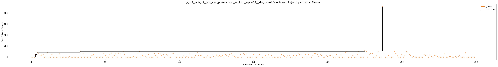

---

## 8. gs_sc2_mcts_v1__obs_spec_presetrich__mc1.41__alpha0.1__idle_bonus0.5

**Best reward: +893.6** | **Best progress: 0.0000** | **Finish rate: 0.0%**

| Param | Value |
|---|---|
| `obs_spec_preset` | rich |
| `mcts_c` | 1.41 |
| `alpha` | 0.1 |
| `idle_bonus` | 0.5 |

| Stat | Value |
|---|---|
| Best track progress | 0.0000 |
| Finish rate | 0.0% |
| Best finish time | — |
| Greedy improvements | 8 |
| First improvement (sim) | 1 |
| Accel % of best run | 97.5% |
| Greedy runtime | 10m 09.6s |

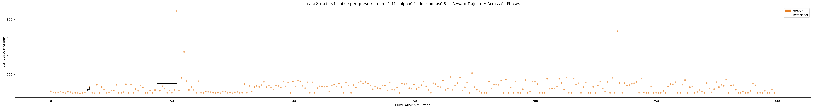

---

## 9. gs_sc2_mcts_v1__obs_spec_presetladder__mc1__alpha0.1__idle_bonus0.5

**Best reward: +877.6** | **Best progress: 0.0000** | **Finish rate: 0.0%**

| Param | Value |
|---|---|
| `obs_spec_preset` | ladder |
| `mcts_c` | 1.0 |
| `alpha` | 0.1 |
| `idle_bonus` | 0.5 |

| Stat | Value |
|---|---|
| Best track progress | 0.0000 |
| Finish rate | 0.0% |
| Best finish time | — |
| Greedy improvements | 5 |
| First improvement (sim) | 1 |
| Accel % of best run | 100.0% |
| Greedy runtime | 14m 30.2s |

---

## 10. gs_sc2_mcts_v1__obs_spec_presetrich__mc2__alpha0.1__idle_bonus0.5

**Best reward: +854.6** | **Best progress: 0.0000** | **Finish rate: 0.0%**

| Param | Value |
|---|---|
| `obs_spec_preset` | rich |
| `mcts_c` | 2.0 |
| `alpha` | 0.1 |
| `idle_bonus` | 0.5 |

| Stat | Value |
|---|---|
| Best track progress | 0.0000 |
| Finish rate | 0.0% |
| Best finish time | — |
| Greedy improvements | 9 |
| First improvement (sim) | 1 |
| Accel % of best run | 94.2% |
| Greedy runtime | 9m 20.8s |

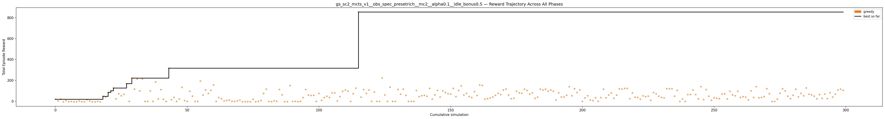

---

## 11. gs_sc2_mcts_v1__obs_spec_presetrich__mc1__alpha0.2__idle_bonus0.5

**Best reward: +842.1** | **Best progress: 0.0000** | **Finish rate: 0.0%**

| Param | Value |
|---|---|
| `obs_spec_preset` | rich |
| `mcts_c` | 1.0 |
| `alpha` | 0.2 |
| `idle_bonus` | 0.5 |

| Stat | Value |
|---|---|
| Best track progress | 0.0000 |
| Finish rate | 0.0% |
| Best finish time | — |
| Greedy improvements | 3 |
| First improvement (sim) | 1 |
| Accel % of best run | 93.3% |
| Greedy runtime | 9m 32.7s |

---

## 12. gs_sc2_mcts_v1__obs_spec_presetladder__mc1__alpha0.2__idle_bonus0.5

**Best reward: +651.1** | **Best progress: 0.0000** | **Finish rate: 0.0%**

| Param | Value |
|---|---|
| `obs_spec_preset` | ladder |
| `mcts_c` | 1.0 |
| `alpha` | 0.2 |
| `idle_bonus` | 0.5 |

| Stat | Value |
|---|---|
| Best track progress | 0.0000 |
| Finish rate | 0.0% |
| Best finish time | — |
| Greedy improvements | 2 |
| First improvement (sim) | 1 |
| Accel % of best run | 84.6% |
| Greedy runtime | 14m 58.4s |

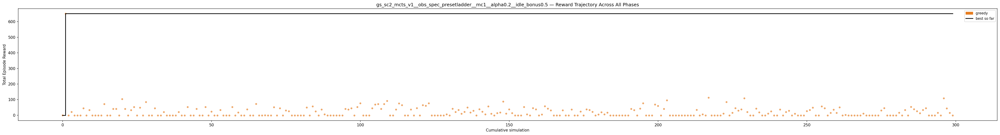

---

## 13. gs_sc2_mcts_v1__obs_spec_presetrich__mc1.41__alpha0.2__idle_bonus0.5

**Best reward: +455.1** | **Best progress: 0.0000** | **Finish rate: 0.0%**

| Param | Value |
|---|---|
| `obs_spec_preset` | rich |
| `mcts_c` | 1.41 |
| `alpha` | 0.2 |
| `idle_bonus` | 0.5 |

| Stat | Value |
|---|---|
| Best track progress | 0.0000 |
| Finish rate | 0.0% |
| Best finish time | — |
| Greedy improvements | 9 |
| First improvement (sim) | 1 |
| Accel % of best run | 74.2% |
| Greedy runtime | 8m 57.4s |

---

## 14. gs_sc2_mcts_v1__obs_spec_presetrich__mc1__alpha0.05__idle_bonus0.2

**Best reward: +372.5** | **Best progress: 0.0000** | **Finish rate: 0.0%**

| Param | Value |
|---|---|
| `obs_spec_preset` | rich |
| `mcts_c` | 1.0 |
| `alpha` | 0.05 |
| `idle_bonus` | 0.2 |

| Stat | Value |
|---|---|
| Best track progress | 0.0000 |
| Finish rate | 0.0% |
| Best finish time | — |
| Greedy improvements | 9 |
| First improvement (sim) | 1 |
| Accel % of best run | 99.6% |
| Greedy runtime | 11m 57.0s |

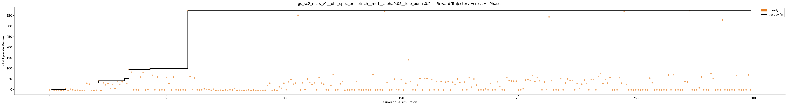

---

## 15. gs_sc2_mcts_v1__obs_spec_presetrich__mc1.41__alpha0.05__idle_bonus0.2

**Best reward: +372.5** | **Best progress: 0.0000** | **Finish rate: 0.0%**

| Param | Value |
|---|---|
| `obs_spec_preset` | rich |
| `mcts_c` | 1.41 |
| `alpha` | 0.05 |
| `idle_bonus` | 0.2 |

| Stat | Value |
|---|---|
| Best track progress | 0.0000 |
| Finish rate | 0.0% |
| Best finish time | — |
| Greedy improvements | 7 |
| First improvement (sim) | 1 |
| Accel % of best run | 98.8% |
| Greedy runtime | 11m 24.5s |

---

## 16. gs_sc2_mcts_v1__obs_spec_presetrich__mc1.41__alpha0.2__idle_bonus0.2

**Best reward: +372.5** | **Best progress: 0.0000** | **Finish rate: 0.0%**

| Param | Value |
|---|---|
| `obs_spec_preset` | rich |
| `mcts_c` | 1.41 |
| `alpha` | 0.2 |
| `idle_bonus` | 0.2 |

| Stat | Value |
|---|---|
| Best track progress | 0.0000 |
| Finish rate | 0.0% |
| Best finish time | — |
| Greedy improvements | 8 |
| First improvement (sim) | 1 |
| Accel % of best run | 97.9% |
| Greedy runtime | 8m 44.5s |

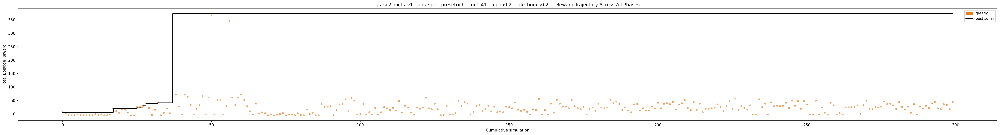

---

## 17. gs_sc2_mcts_v1__obs_spec_presetrich__mc2__alpha0.05__idle_bonus0.2

**Best reward: +369.3** | **Best progress: 0.0000** | **Finish rate: 0.0%**

| Param | Value |
|---|---|
| `obs_spec_preset` | rich |
| `mcts_c` | 2.0 |
| `alpha` | 0.05 |
| `idle_bonus` | 0.2 |

| Stat | Value |
|---|---|
| Best track progress | 0.0000 |
| Finish rate | 0.0% |
| Best finish time | — |
| Greedy improvements | 8 |
| First improvement (sim) | 1 |
| Accel % of best run | 97.5% |
| Greedy runtime | 11m 03.9s |

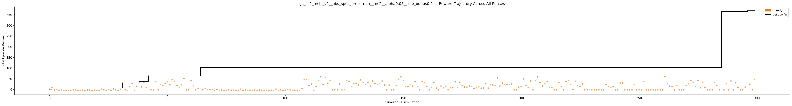

---

## 18. gs_sc2_mcts_v1__obs_spec_presetrich__mc2__alpha0.2__idle_bonus0.2

**Best reward: +369.3** | **Best progress: 0.0000** | **Finish rate: 0.0%**

| Param | Value |
|---|---|
| `obs_spec_preset` | rich |
| `mcts_c` | 2.0 |
| `alpha` | 0.2 |
| `idle_bonus` | 0.2 |

| Stat | Value |
|---|---|
| Best track progress | 0.0000 |
| Finish rate | 0.0% |
| Best finish time | — |
| Greedy improvements | 7 |
| First improvement (sim) | 1 |
| Accel % of best run | 97.1% |
| Greedy runtime | 8m 20.7s |

---

## 19. gs_sc2_mcts_v1__obs_spec_presetrich__mc1__alpha0.1__idle_bonus0.2

**Best reward: +367.7** | **Best progress: 0.0000** | **Finish rate: 0.0%**

| Param | Value |
|---|---|
| `obs_spec_preset` | rich |
| `mcts_c` | 1.0 |
| `alpha` | 0.1 |
| `idle_bonus` | 0.2 |

| Stat | Value |
|---|---|
| Best track progress | 0.0000 |
| Finish rate | 0.0% |
| Best finish time | — |
| Greedy improvements | 7 |
| First improvement (sim) | 1 |
| Accel % of best run | 98.8% |
| Greedy runtime | 9m 57.2s |

---

## 20. gs_sc2_mcts_v1__obs_spec_presetrich__mc2__alpha0.1__idle_bonus0.2

**Best reward: +367.7** | **Best progress: 0.0000** | **Finish rate: 0.0%**

| Param | Value |
|---|---|
| `obs_spec_preset` | rich |
| `mcts_c` | 2.0 |
| `alpha` | 0.1 |
| `idle_bonus` | 0.2 |

| Stat | Value |
|---|---|
| Best track progress | 0.0000 |
| Finish rate | 0.0% |
| Best finish time | — |
| Greedy improvements | 9 |
| First improvement (sim) | 1 |
| Accel % of best run | 97.5% |
| Greedy runtime | 9m 09.5s |

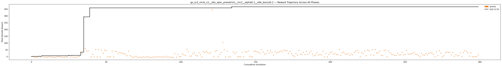

---

## 21. gs_sc2_mcts_v1__obs_spec_presetrich__mc1.41__alpha0.1__idle_bonus0.2

**Best reward: +358.2** | **Best progress: 0.0000** | **Finish rate: 0.0%**

| Param | Value |
|---|---|
| `obs_spec_preset` | rich |
| `mcts_c` | 1.41 |
| `alpha` | 0.1 |
| `idle_bonus` | 0.2 |

| Stat | Value |
|---|---|
| Best track progress | 0.0000 |
| Finish rate | 0.0% |
| Best finish time | — |
| Greedy improvements | 8 |
| First improvement (sim) | 1 |
| Accel % of best run | 99.6% |
| Greedy runtime | 9m 36.7s |

---

## 22. gs_sc2_mcts_v1__obs_spec_presetrich__mc1__alpha0.2__idle_bonus0.2

**Best reward: +352.9** | **Best progress: 0.0000** | **Finish rate: 0.0%**

| Param | Value |
|---|---|
| `obs_spec_preset` | rich |
| `mcts_c` | 1.0 |
| `alpha` | 0.2 |
| `idle_bonus` | 0.2 |

| Stat | Value |
|---|---|
| Best track progress | 0.0000 |
| Finish rate | 0.0% |
| Best finish time | — |
| Greedy improvements | 10 |
| First improvement (sim) | 1 |
| Accel % of best run | 97.9% |
| Greedy runtime | 9m 44.1s |

---

## 23. gs_sc2_mcts_v1__obs_spec_presetladder__mc1__alpha0.05__idle_bonus0.2

**Best reward: +348.5** | **Best progress: 0.0000** | **Finish rate: 0.0%**

| Param | Value |
|---|---|
| `obs_spec_preset` | ladder |
| `mcts_c` | 1.0 |
| `alpha` | 0.05 |
| `idle_bonus` | 0.2 |

| Stat | Value |
|---|---|
| Best track progress | 0.0000 |
| Finish rate | 0.0% |
| Best finish time | — |
| Greedy improvements | 5 |
| First improvement (sim) | 1 |
| Accel % of best run | 96.7% |
| Greedy runtime | 13m 55.0s |

---

## 24. gs_sc2_mcts_v1__obs_spec_presetrich__mc2__alpha0.1__idle_bonus0.1

**Best reward: +182.9** | **Best progress: 0.0000** | **Finish rate: 0.0%**

| Param | Value |
|---|---|
| `obs_spec_preset` | rich |
| `mcts_c` | 2.0 |
| `alpha` | 0.1 |
| `idle_bonus` | 0.1 |

| Stat | Value |
|---|---|
| Best track progress | 0.0000 |
| Finish rate | 0.0% |
| Best finish time | — |
| Greedy improvements | 5 |
| First improvement (sim) | 1 |
| Accel % of best run | 99.2% |
| Greedy runtime | 9m 50.4s |

---

## 25. gs_sc2_mcts_v1__obs_spec_presetrich__mc1.41__alpha0.05__idle_bonus0.1

**Best reward: +180.5** | **Best progress: 0.0000** | **Finish rate: 0.0%**

| Param | Value |
|---|---|
| `obs_spec_preset` | rich |
| `mcts_c` | 1.41 |
| `alpha` | 0.05 |
| `idle_bonus` | 0.1 |

| Stat | Value |
|---|---|
| Best track progress | 0.0000 |
| Finish rate | 0.0% |
| Best finish time | — |
| Greedy improvements | 10 |
| First improvement (sim) | 1 |
| Accel % of best run | 98.8% |
| Greedy runtime | 11m 12.1s |

---

## 26. gs_sc2_mcts_v1__obs_spec_presetrich__mc1.41__alpha0.1__idle_bonus0.1

**Best reward: +178.1** | **Best progress: 0.0000** | **Finish rate: 0.0%**

| Param | Value |
|---|---|
| `obs_spec_preset` | rich |
| `mcts_c` | 1.41 |
| `alpha` | 0.1 |
| `idle_bonus` | 0.1 |

| Stat | Value |
|---|---|
| Best track progress | 0.0000 |
| Finish rate | 0.0% |
| Best finish time | — |
| Greedy improvements | 5 |
| First improvement (sim) | 1 |
| Accel % of best run | 97.1% |
| Greedy runtime | 8m 31.1s |

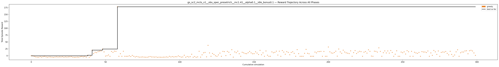

---

## 27. gs_sc2_mcts_v1__obs_spec_presetrich__mc1__alpha0.1__idle_bonus0.1

**Best reward: +177.1** | **Best progress: 0.0000** | **Finish rate: 0.0%**

| Param | Value |
|---|---|
| `obs_spec_preset` | rich |
| `mcts_c` | 1.0 |
| `alpha` | 0.1 |
| `idle_bonus` | 0.1 |

| Stat | Value |
|---|---|
| Best track progress | 0.0000 |
| Finish rate | 0.0% |
| Best finish time | — |
| Greedy improvements | 10 |
| First improvement (sim) | 1 |
| Accel % of best run | 94.2% |
| Greedy runtime | 10m 54.3s |

---

## 28. gs_sc2_mcts_v1__obs_spec_presetrich__mc1__alpha0.05__idle_bonus0.1

**Best reward: +175.7** | **Best progress: 0.0000** | **Finish rate: 0.0%**

| Param | Value |
|---|---|
| `obs_spec_preset` | rich |
| `mcts_c` | 1.0 |
| `alpha` | 0.05 |
| `idle_bonus` | 0.1 |

| Stat | Value |
|---|---|
| Best track progress | 0.0000 |
| Finish rate | 0.0% |
| Best finish time | — |
| Greedy improvements | 8 |
| First improvement (sim) | 1 |
| Accel % of best run | 96.2% |
| Greedy runtime | 10m 10.7s |

---

## 29. gs_sc2_mcts_v1__obs_spec_presetrich__mc1__alpha0.2__idle_bonus0.1

**Best reward: +173.7** | **Best progress: 0.0000** | **Finish rate: 0.0%**

| Param | Value |
|---|---|
| `obs_spec_preset` | rich |
| `mcts_c` | 1.0 |
| `alpha` | 0.2 |
| `idle_bonus` | 0.1 |

| Stat | Value |
|---|---|
| Best track progress | 0.0000 |
| Finish rate | 0.0% |
| Best finish time | — |
| Greedy improvements | 6 |
| First improvement (sim) | 1 |
| Accel % of best run | 92.9% |
| Greedy runtime | 10m 07.8s |

---

## 30. gs_sc2_mcts_v1__obs_spec_presetladder__mc2__alpha0.1__idle_bonus0.1

**Best reward: +173.6** | **Best progress: 0.0000** | **Finish rate: 0.0%**

| Param | Value |
|---|---|
| `obs_spec_preset` | ladder |
| `mcts_c` | 2.0 |
| `alpha` | 0.1 |
| `idle_bonus` | 0.1 |

| Stat | Value |
|---|---|
| Best track progress | 0.0000 |
| Finish rate | 0.0% |
| Best finish time | — |
| Greedy improvements | 6 |
| First improvement (sim) | 1 |
| Accel % of best run | 100.0% |
| Greedy runtime | 14m 13.1s |

---

## 31. gs_sc2_mcts_v1__obs_spec_presetladder__mc1.41__alpha0.2__idle_bonus0.1

**Best reward: +169.6** | **Best progress: 0.0000** | **Finish rate: 0.0%**

| Param | Value |
|---|---|
| `obs_spec_preset` | ladder |
| `mcts_c` | 1.41 |
| `alpha` | 0.2 |
| `idle_bonus` | 0.1 |

| Stat | Value |
|---|---|
| Best track progress | 0.0000 |
| Finish rate | 0.0% |
| Best finish time | — |
| Greedy improvements | 5 |
| First improvement (sim) | 1 |
| Accel % of best run | 95.0% |
| Greedy runtime | 13m 58.8s |

---

## 32. gs_sc2_mcts_v1__obs_spec_presetladder__mc1__alpha0.05__idle_bonus0.5

**Best reward: +159.8** | **Best progress: 0.0000** | **Finish rate: 0.0%**

| Param | Value |
|---|---|
| `obs_spec_preset` | ladder |
| `mcts_c` | 1.0 |
| `alpha` | 0.05 |
| `idle_bonus` | 0.5 |

| Stat | Value |
|---|---|
| Best track progress | 0.0000 |
| Finish rate | 0.0% |
| Best finish time | — |
| Greedy improvements | 8 |
| First improvement (sim) | 1 |
| Accel % of best run | 93.9% |
| Greedy runtime | 14m 43.6s |

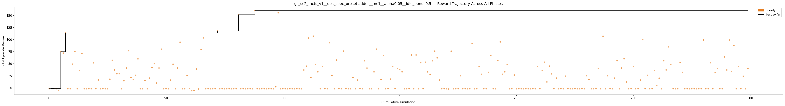

---

## 33. gs_sc2_mcts_v1__obs_spec_presetrich__mc1.41__alpha0.2__idle_bonus0.1

**Best reward: +156.6** | **Best progress: 0.0000** | **Finish rate: 0.0%**

| Param | Value |
|---|---|
| `obs_spec_preset` | rich |
| `mcts_c` | 1.41 |
| `alpha` | 0.2 |
| `idle_bonus` | 0.1 |

| Stat | Value |
|---|---|
| Best track progress | 0.0000 |
| Finish rate | 0.0% |
| Best finish time | — |
| Greedy improvements | 9 |
| First improvement (sim) | 1 |
| Accel % of best run | 92.1% |
| Greedy runtime | 9m 18.0s |

---

## 34. gs_sc2_mcts_v1__obs_spec_presetrich__mc2__alpha0.05__idle_bonus0.1

**Best reward: +152.6** | **Best progress: 0.0000** | **Finish rate: 0.0%**

| Param | Value |
|---|---|
| `obs_spec_preset` | rich |
| `mcts_c` | 2.0 |
| `alpha` | 0.05 |
| `idle_bonus` | 0.1 |

| Stat | Value |
|---|---|
| Best track progress | 0.0000 |
| Finish rate | 0.0% |
| Best finish time | — |
| Greedy improvements | 8 |
| First improvement (sim) | 1 |
| Accel % of best run | 91.2% |
| Greedy runtime | 9m 35.5s |

---

## 35. gs_sc2_mcts_v1__obs_spec_presetladder__mc1.41__alpha0.05__idle_bonus0.5

**Best reward: +148.0** | **Best progress: 0.0000** | **Finish rate: 0.0%**

| Param | Value |
|---|---|
| `obs_spec_preset` | ladder |
| `mcts_c` | 1.41 |
| `alpha` | 0.05 |
| `idle_bonus` | 0.5 |

| Stat | Value |
|---|---|
| Best track progress | 0.0000 |
| Finish rate | 0.0% |
| Best finish time | — |
| Greedy improvements | 3 |
| First improvement (sim) | 1 |
| Accel % of best run | 80.6% |
| Greedy runtime | 13m 58.9s |

---

## 36. gs_sc2_mcts_v1__obs_spec_presetladder__mc2__alpha0.1__idle_bonus0.5

**Best reward: +147.9** | **Best progress: 0.0000** | **Finish rate: 0.0%**

| Param | Value |
|---|---|
| `obs_spec_preset` | ladder |
| `mcts_c` | 2.0 |
| `alpha` | 0.1 |
| `idle_bonus` | 0.5 |

| Stat | Value |
|---|---|
| Best track progress | 0.0000 |
| Finish rate | 0.0% |
| Best finish time | — |
| Greedy improvements | 6 |
| First improvement (sim) | 1 |
| Accel % of best run | 75.0% |
| Greedy runtime | 13m 12.9s |

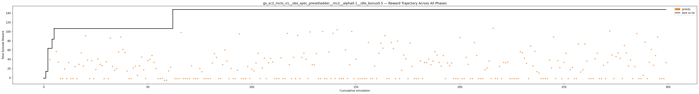

---

## 37. gs_sc2_mcts_v1__obs_spec_presetladder__mc2__alpha0.2__idle_bonus0.5

**Best reward: +111.2** | **Best progress: 0.0000** | **Finish rate: 0.0%**

| Param | Value |
|---|---|
| `obs_spec_preset` | ladder |
| `mcts_c` | 2.0 |
| `alpha` | 0.2 |
| `idle_bonus` | 0.5 |

| Stat | Value |
|---|---|
| Best track progress | 0.0000 |
| Finish rate | 0.0% |
| Best finish time | — |
| Greedy improvements | 4 |
| First improvement (sim) | 1 |
| Accel % of best run | 100.0% |
| Greedy runtime | 14m 07.9s |

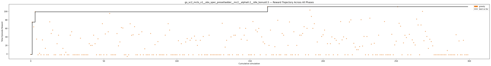

---

## 38. gs_sc2_mcts_v1__obs_spec_presetladder__mc1.41__alpha0.1__idle_bonus0.5

**Best reward: +107.2** | **Best progress: 0.0000** | **Finish rate: 0.0%**

| Param | Value |
|---|---|
| `obs_spec_preset` | ladder |
| `mcts_c` | 1.41 |
| `alpha` | 0.1 |
| `idle_bonus` | 0.5 |

| Stat | Value |
|---|---|
| Best track progress | 0.0000 |
| Finish rate | 0.0% |
| Best finish time | — |
| Greedy improvements | 7 |
| First improvement (sim) | 1 |
| Accel % of best run | 67.4% |
| Greedy runtime | 13m 31.6s |

---

## 39. gs_sc2_mcts_v1__obs_spec_presetladder__mc2__alpha0.05__idle_bonus0.2

**Best reward: +106.0** | **Best progress: 0.0000** | **Finish rate: 0.0%**

| Param | Value |
|---|---|
| `obs_spec_preset` | ladder |
| `mcts_c` | 2.0 |
| `alpha` | 0.05 |
| `idle_bonus` | 0.2 |

| Stat | Value |
|---|---|
| Best track progress | 0.0000 |
| Finish rate | 0.0% |
| Best finish time | — |
| Greedy improvements | 8 |
| First improvement (sim) | 1 |
| Accel % of best run | 97.1% |
| Greedy runtime | 12m 27.6s |

---

## 40. gs_sc2_mcts_v1__obs_spec_presetladder__mc1.41__alpha0.2__idle_bonus0.2

**Best reward: +87.1** | **Best progress: 0.0000** | **Finish rate: 0.0%**

| Param | Value |
|---|---|
| `obs_spec_preset` | ladder |
| `mcts_c` | 1.41 |
| `alpha` | 0.2 |
| `idle_bonus` | 0.2 |

| Stat | Value |
|---|---|
| Best track progress | 0.0000 |
| Finish rate | 0.0% |
| Best finish time | — |
| Greedy improvements | 11 |
| First improvement (sim) | 1 |
| Accel % of best run | 92.1% |
| Greedy runtime | 12m 59.3s |

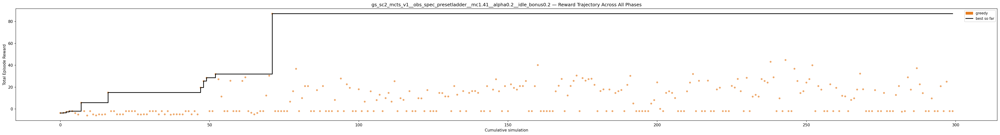

---

## 41. gs_sc2_mcts_v1__obs_spec_presetladder__mc1.41__alpha0.05__idle_bonus0.2

**Best reward: +77.5** | **Best progress: 0.0000** | **Finish rate: 0.0%**

| Param | Value |
|---|---|
| `obs_spec_preset` | ladder |
| `mcts_c` | 1.41 |
| `alpha` | 0.05 |
| `idle_bonus` | 0.2 |

| Stat | Value |
|---|---|
| Best track progress | 0.0000 |
| Finish rate | 0.0% |
| Best finish time | — |
| Greedy improvements | 7 |
| First improvement (sim) | 1 |
| Accel % of best run | 64.2% |
| Greedy runtime | 12m 26.2s |

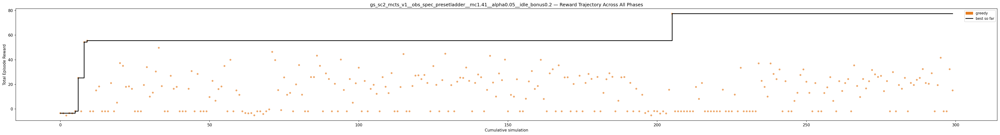

---

## 42. gs_sc2_mcts_v1__obs_spec_presetladder__mc2__alpha0.1__idle_bonus0.2

**Best reward: +69.0** | **Best progress: 0.0000** | **Finish rate: 0.0%**

| Param | Value |
|---|---|
| `obs_spec_preset` | ladder |
| `mcts_c` | 2.0 |
| `alpha` | 0.1 |
| `idle_bonus` | 0.2 |

| Stat | Value |
|---|---|
| Best track progress | 0.0000 |
| Finish rate | 0.0% |
| Best finish time | — |
| Greedy improvements | 6 |
| First improvement (sim) | 1 |
| Accel % of best run | 93.0% |
| Greedy runtime | 13m 57.0s |

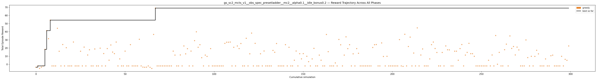

---

## 43. gs_sc2_mcts_v1__obs_spec_presetladder__mc2__alpha0.2__idle_bonus0.2

**Best reward: +65.7** | **Best progress: 0.0000** | **Finish rate: 0.0%**

| Param | Value |
|---|---|
| `obs_spec_preset` | ladder |
| `mcts_c` | 2.0 |
| `alpha` | 0.2 |
| `idle_bonus` | 0.2 |

| Stat | Value |
|---|---|
| Best track progress | 0.0000 |
| Finish rate | 0.0% |
| Best finish time | — |
| Greedy improvements | 4 |
| First improvement (sim) | 1 |
| Accel % of best run | 100.0% |
| Greedy runtime | 14m 01.0s |

---

## 44. gs_sc2_mcts_v1__obs_spec_presetladder__mc1__alpha0.2__idle_bonus0.1

**Best reward: +63.0** | **Best progress: 0.0000** | **Finish rate: 0.0%**

| Param | Value |
|---|---|
| `obs_spec_preset` | ladder |
| `mcts_c` | 1.0 |
| `alpha` | 0.2 |
| `idle_bonus` | 0.1 |

| Stat | Value |
|---|---|
| Best track progress | 0.0000 |
| Finish rate | 0.0% |
| Best finish time | — |
| Greedy improvements | 8 |
| First improvement (sim) | 1 |
| Accel % of best run | 66.7% |
| Greedy runtime | 15m 27.1s |

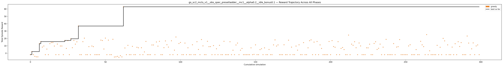

---

## 45. gs_sc2_mcts_v1__obs_spec_presetladder__mc1__alpha0.1__idle_bonus0.2

**Best reward: +61.1** | **Best progress: 0.0000** | **Finish rate: 0.0%**

| Param | Value |
|---|---|
| `obs_spec_preset` | ladder |
| `mcts_c` | 1.0 |
| `alpha` | 0.1 |
| `idle_bonus` | 0.2 |

| Stat | Value |
|---|---|
| Best track progress | 0.0000 |
| Finish rate | 0.0% |
| Best finish time | — |
| Greedy improvements | 9 |
| First improvement (sim) | 1 |
| Accel % of best run | 35.4% |
| Greedy runtime | 13m 52.9s |

---

## 46. gs_sc2_mcts_v1__obs_spec_presetladder__mc1__alpha0.05__idle_bonus0.1

**Best reward: +57.3** | **Best progress: 0.0000** | **Finish rate: 0.0%**

| Param | Value |
|---|---|
| `obs_spec_preset` | ladder |
| `mcts_c` | 1.0 |
| `alpha` | 0.05 |
| `idle_bonus` | 0.1 |

| Stat | Value |
|---|---|
| Best track progress | 0.0000 |
| Finish rate | 0.0% |
| Best finish time | — |
| Greedy improvements | 5 |
| First improvement (sim) | 1 |
| Accel % of best run | 72.4% |
| Greedy runtime | 12m 13.2s |

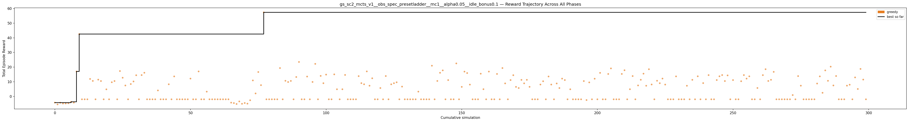

---

## 47. gs_sc2_mcts_v1__obs_spec_presetladder__mc1.41__alpha0.1__idle_bonus0.2

**Best reward: +49.6** | **Best progress: 0.0000** | **Finish rate: 0.0%**

| Param | Value |
|---|---|
| `obs_spec_preset` | ladder |
| `mcts_c` | 1.41 |
| `alpha` | 0.1 |
| `idle_bonus` | 0.2 |

| Stat | Value |
|---|---|
| Best track progress | 0.0000 |
| Finish rate | 0.0% |
| Best finish time | — |
| Greedy improvements | 6 |
| First improvement (sim) | 1 |
| Accel % of best run | 78.1% |
| Greedy runtime | 13m 44.7s |

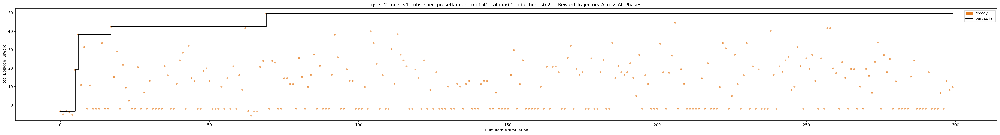

---

## 48. gs_sc2_mcts_v1__obs_spec_presetladder__mc2__alpha0.2__idle_bonus0.1

**Best reward: +49.2** | **Best progress: 0.0000** | **Finish rate: 0.0%**

| Param | Value |
|---|---|
| `obs_spec_preset` | ladder |
| `mcts_c` | 2.0 |
| `alpha` | 0.2 |
| `idle_bonus` | 0.1 |

| Stat | Value |
|---|---|
| Best track progress | 0.0000 |
| Finish rate | 0.0% |
| Best finish time | — |
| Greedy improvements | 7 |
| First improvement (sim) | 1 |
| Accel % of best run | 91.4% |
| Greedy runtime | 15m 00.0s |

---

## 49. gs_sc2_mcts_v1__obs_spec_presetladder__mc1.41__alpha0.1__idle_bonus0.1

**Best reward: +47.7** | **Best progress: 0.0000** | **Finish rate: 0.0%**

| Param | Value |
|---|---|
| `obs_spec_preset` | ladder |
| `mcts_c` | 1.41 |
| `alpha` | 0.1 |
| `idle_bonus` | 0.1 |

| Stat | Value |
|---|---|
| Best track progress | 0.0000 |
| Finish rate | 0.0% |
| Best finish time | — |
| Greedy improvements | 5 |
| First improvement (sim) | 1 |
| Accel % of best run | 96.7% |
| Greedy runtime | 13m 49.4s |

---

## 50. gs_sc2_mcts_v1__obs_spec_presetladder__mc1__alpha0.2__idle_bonus0.2

**Best reward: +43.1** | **Best progress: 0.0000** | **Finish rate: 0.0%**

| Param | Value |
|---|---|
| `obs_spec_preset` | ladder |
| `mcts_c` | 1.0 |
| `alpha` | 0.2 |
| `idle_bonus` | 0.2 |

| Stat | Value |
|---|---|
| Best track progress | 0.0000 |
| Finish rate | 0.0% |
| Best finish time | — |
| Greedy improvements | 6 |
| First improvement (sim) | 1 |
| Accel % of best run | 100.0% |
| Greedy runtime | 14m 20.1s |

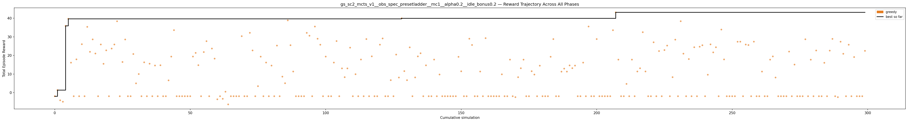

---

## 51. gs_sc2_mcts_v1__obs_spec_presetladder__mc2__alpha0.05__idle_bonus0.1

**Best reward: +33.7** | **Best progress: 0.0000** | **Finish rate: 0.0%**

| Param | Value |
|---|---|
| `obs_spec_preset` | ladder |
| `mcts_c` | 2.0 |
| `alpha` | 0.05 |
| `idle_bonus` | 0.1 |

| Stat | Value |
|---|---|
| Best track progress | 0.0000 |
| Finish rate | 0.0% |
| Best finish time | — |
| Greedy improvements | 9 |
| First improvement (sim) | 1 |
| Accel % of best run | 78.9% |
| Greedy runtime | 12m 59.0s |

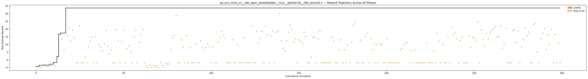

---

## 52. gs_sc2_mcts_v1__obs_spec_presetrich__mc2__alpha0.2__idle_bonus0.1

**Best reward: +27.8** | **Best progress: 0.0000** | **Finish rate: 0.0%**

| Param | Value |
|---|---|
| `obs_spec_preset` | rich |
| `mcts_c` | 2.0 |
| `alpha` | 0.2 |
| `idle_bonus` | 0.1 |

| Stat | Value |
|---|---|
| Best track progress | 0.0000 |
| Finish rate | 0.0% |
| Best finish time | — |
| Greedy improvements | 4 |
| First improvement (sim) | 1 |
| Accel % of best run | 74.7% |
| Greedy runtime | 9m 35.7s |

---

## 53. gs_sc2_mcts_v1__obs_spec_presetladder__mc1__alpha0.1__idle_bonus0.1

**Best reward: +27.2** | **Best progress: 0.0000** | **Finish rate: 0.0%**

| Param | Value |
|---|---|
| `obs_spec_preset` | ladder |
| `mcts_c` | 1.0 |
| `alpha` | 0.1 |
| `idle_bonus` | 0.1 |

| Stat | Value |
|---|---|
| Best track progress | 0.0000 |
| Finish rate | 0.0% |
| Best finish time | — |
| Greedy improvements | 8 |
| First improvement (sim) | 1 |
| Accel % of best run | 0.0% |
| Greedy runtime | 13m 14.3s |

---

## 54. gs_sc2_mcts_v1__obs_spec_presetladder__mc1.41__alpha0.05__idle_bonus0.1

**Best reward: +26.5** | **Best progress: 0.0000** | **Finish rate: 0.0%**

| Param | Value |
|---|---|
| `obs_spec_preset` | ladder |
| `mcts_c` | 1.41 |
| `alpha` | 0.05 |
| `idle_bonus` | 0.1 |

| Stat | Value |
|---|---|
| Best track progress | 0.0000 |
| Finish rate | 0.0% |
| Best finish time | — |
| Greedy improvements | 4 |
| First improvement (sim) | 1 |
| Accel % of best run | 83.0% |
| Greedy runtime | 14m 17.2s |

