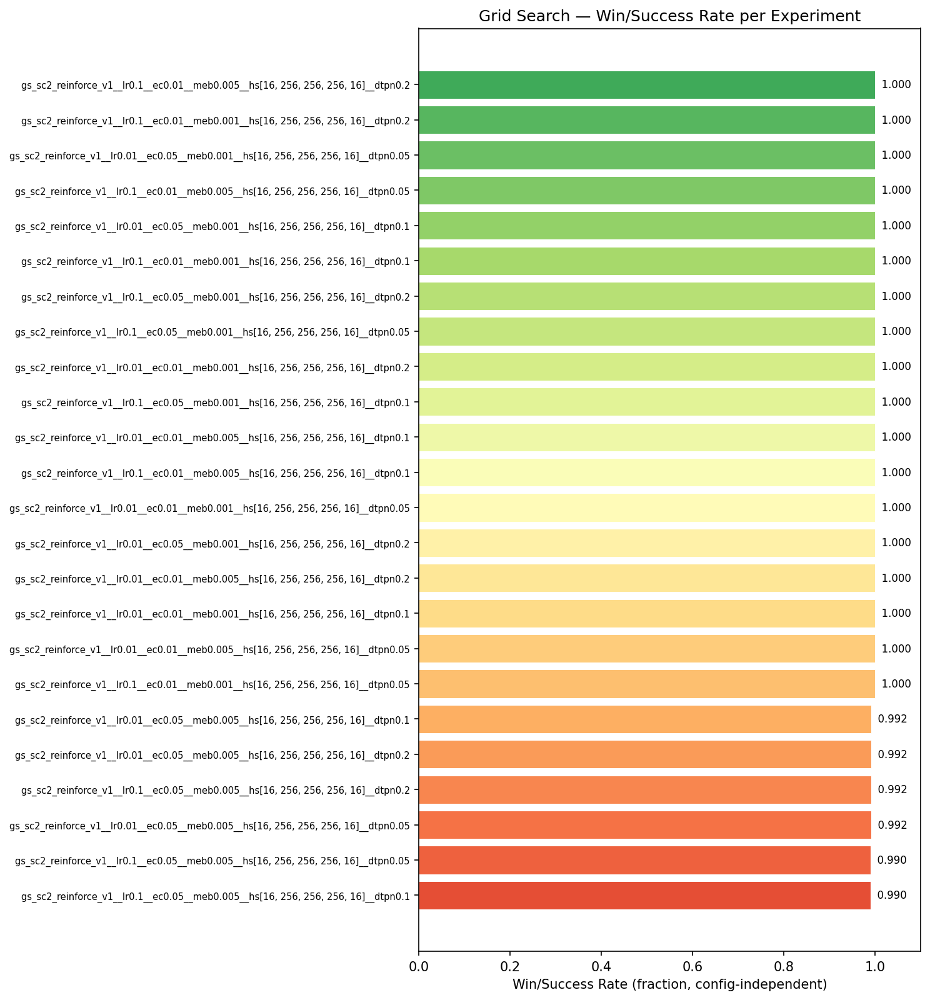
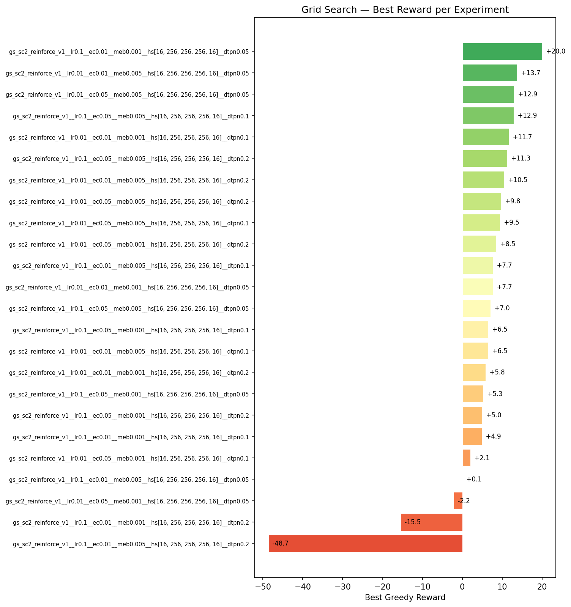
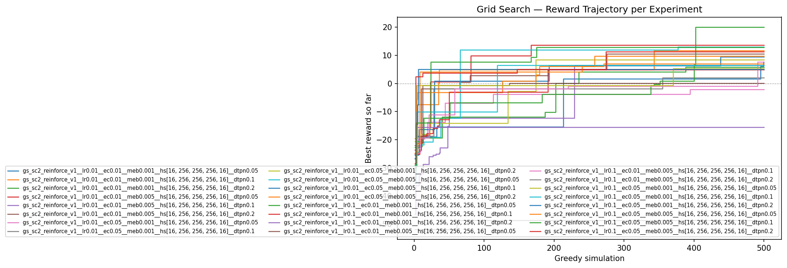
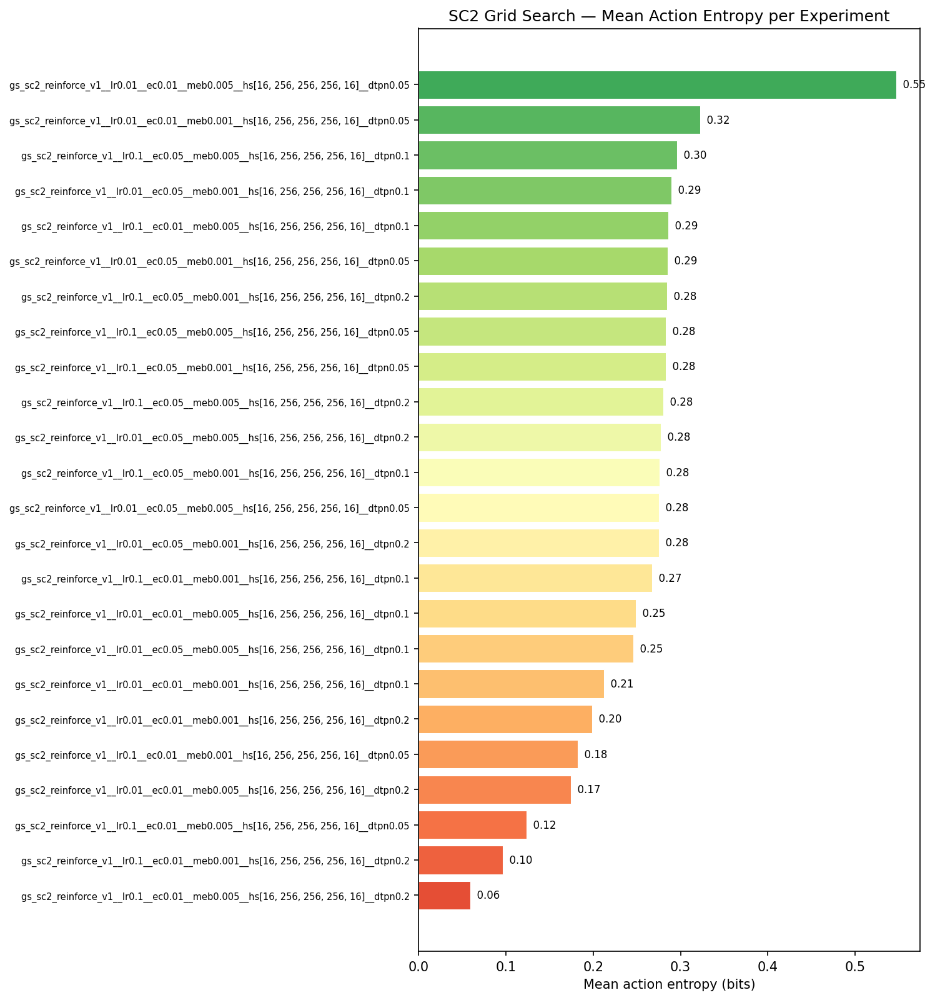
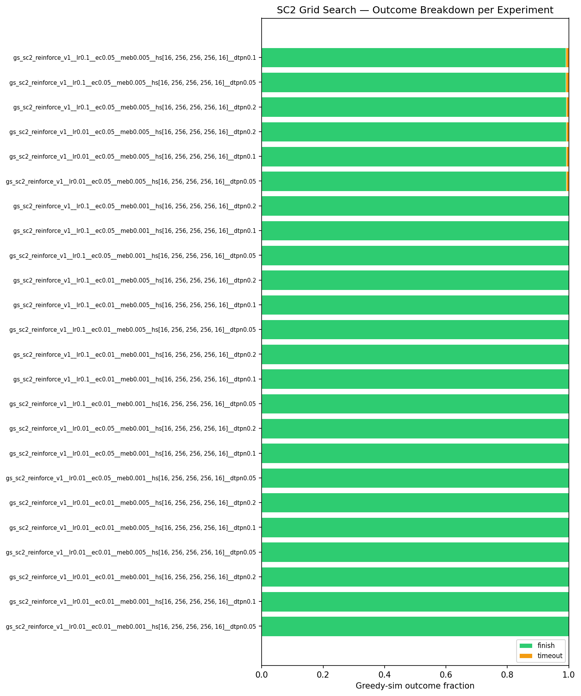
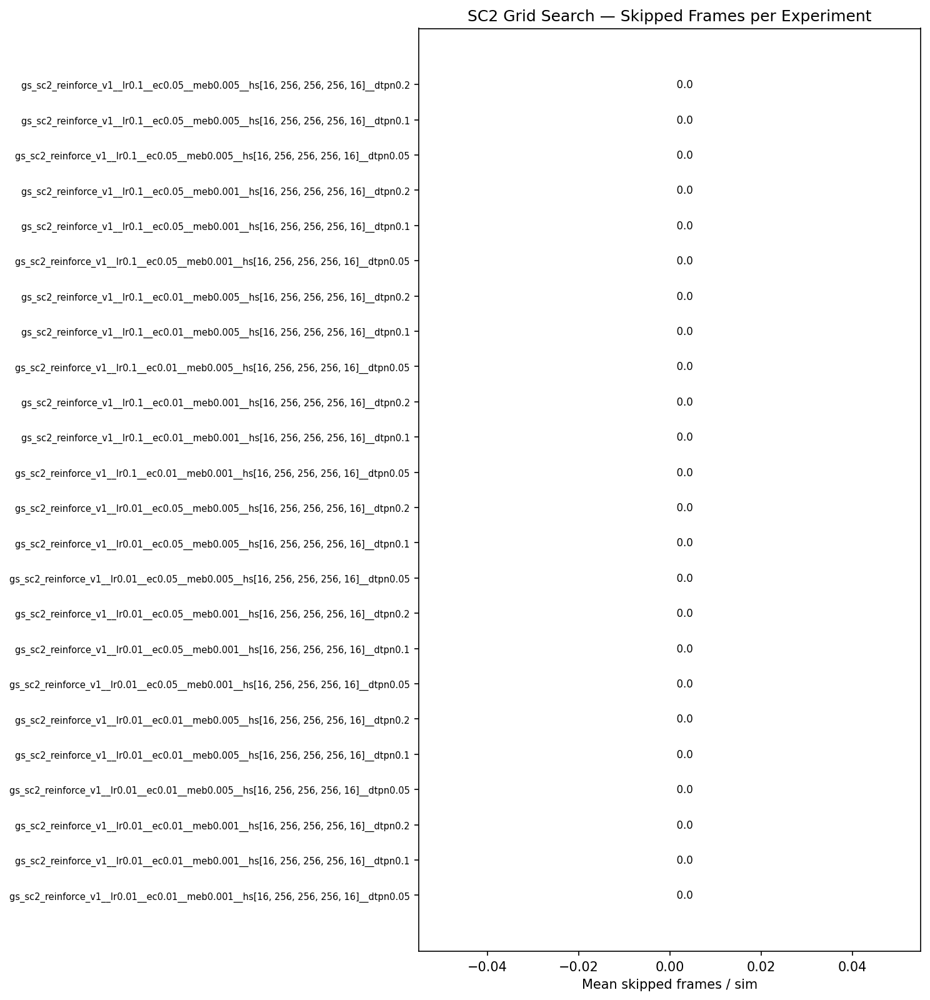
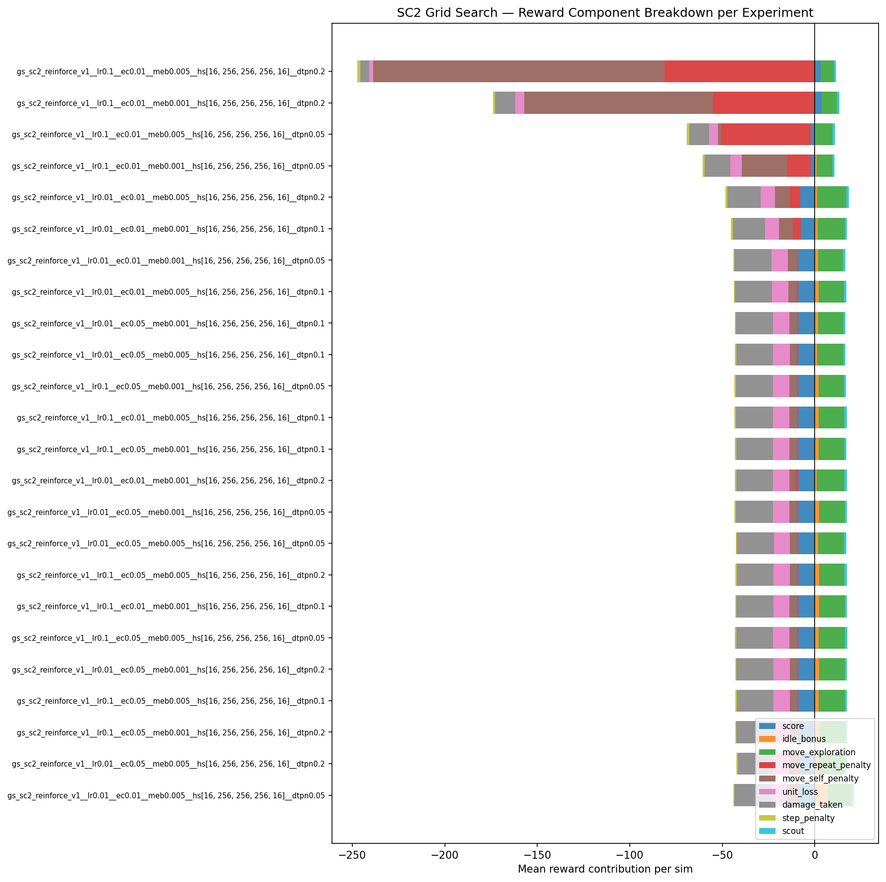

# Grid Search Summary: redo-v1

24 experiments.

## Rankings by Task Metrics (config-independent)

Ranked by Win/Success Rate, then by best reward.

| Rank | Experiment | Win/Success Rate | Finish Rate | Best Finish Time | Best Reward |
|------|-----------|---------------|-------------|-----------------|-------------|
| 1 | gs_sc2_reinforce_v1__lr0.1__ec0.01__meb0.001__hs[16, 256, 256, 256, 16]__dtpn0.05 | 100.0% | 0.0% | — | +20.0 |
| 2 | gs_sc2_reinforce_v1__lr0.01__ec0.01__meb0.005__hs[16, 256, 256, 256, 16]__dtpn0.05 | 100.0% | 0.0% | — | +13.7 |
| 3 | gs_sc2_reinforce_v1__lr0.01__ec0.01__meb0.001__hs[16, 256, 256, 256, 16]__dtpn0.1 | 100.0% | 0.0% | — | +11.7 |
| 4 | gs_sc2_reinforce_v1__lr0.01__ec0.01__meb0.005__hs[16, 256, 256, 256, 16]__dtpn0.2 | 100.0% | 0.0% | — | +10.5 |
| 5 | gs_sc2_reinforce_v1__lr0.01__ec0.05__meb0.001__hs[16, 256, 256, 256, 16]__dtpn0.2 | 100.0% | 0.0% | — | +8.5 |
| 6 | gs_sc2_reinforce_v1__lr0.01__ec0.01__meb0.001__hs[16, 256, 256, 256, 16]__dtpn0.05 | 100.0% | 0.0% | — | +7.7 |
| 7 | gs_sc2_reinforce_v1__lr0.1__ec0.01__meb0.005__hs[16, 256, 256, 256, 16]__dtpn0.1 | 100.0% | 0.0% | — | +7.7 |
| 8 | gs_sc2_reinforce_v1__lr0.01__ec0.01__meb0.005__hs[16, 256, 256, 256, 16]__dtpn0.1 | 100.0% | 0.0% | — | +6.5 |
| 9 | gs_sc2_reinforce_v1__lr0.1__ec0.05__meb0.001__hs[16, 256, 256, 256, 16]__dtpn0.1 | 100.0% | 0.0% | — | +6.5 |
| 10 | gs_sc2_reinforce_v1__lr0.01__ec0.01__meb0.001__hs[16, 256, 256, 256, 16]__dtpn0.2 | 100.0% | 0.0% | — | +5.8 |
| 11 | gs_sc2_reinforce_v1__lr0.1__ec0.05__meb0.001__hs[16, 256, 256, 256, 16]__dtpn0.05 | 100.0% | 0.0% | — | +5.3 |
| 12 | gs_sc2_reinforce_v1__lr0.1__ec0.05__meb0.001__hs[16, 256, 256, 256, 16]__dtpn0.2 | 100.0% | 0.0% | — | +5.0 |
| 13 | gs_sc2_reinforce_v1__lr0.1__ec0.01__meb0.001__hs[16, 256, 256, 256, 16]__dtpn0.1 | 100.0% | 0.0% | — | +4.9 |
| 14 | gs_sc2_reinforce_v1__lr0.01__ec0.05__meb0.001__hs[16, 256, 256, 256, 16]__dtpn0.1 | 100.0% | 0.0% | — | +2.1 |
| 15 | gs_sc2_reinforce_v1__lr0.1__ec0.01__meb0.005__hs[16, 256, 256, 256, 16]__dtpn0.05 | 100.0% | 0.0% | — | +0.1 |
| 16 | gs_sc2_reinforce_v1__lr0.01__ec0.05__meb0.001__hs[16, 256, 256, 256, 16]__dtpn0.05 | 100.0% | 0.0% | — | -2.2 |
| 17 | gs_sc2_reinforce_v1__lr0.1__ec0.01__meb0.001__hs[16, 256, 256, 256, 16]__dtpn0.2 | 100.0% | 0.0% | — | -15.5 |
| 18 | gs_sc2_reinforce_v1__lr0.1__ec0.01__meb0.005__hs[16, 256, 256, 256, 16]__dtpn0.2 | 100.0% | 0.0% | — | -48.7 |
| 19 | gs_sc2_reinforce_v1__lr0.01__ec0.05__meb0.005__hs[16, 256, 256, 256, 16]__dtpn0.05 | 99.2% | 0.0% | — | +12.9 |
| 20 | gs_sc2_reinforce_v1__lr0.1__ec0.05__meb0.005__hs[16, 256, 256, 256, 16]__dtpn0.2 | 99.2% | 0.0% | — | +11.3 |
| 21 | gs_sc2_reinforce_v1__lr0.01__ec0.05__meb0.005__hs[16, 256, 256, 256, 16]__dtpn0.2 | 99.2% | 0.0% | — | +9.8 |
| 22 | gs_sc2_reinforce_v1__lr0.01__ec0.05__meb0.005__hs[16, 256, 256, 256, 16]__dtpn0.1 | 99.2% | 0.0% | — | +9.5 |
| 23 | gs_sc2_reinforce_v1__lr0.1__ec0.05__meb0.005__hs[16, 256, 256, 256, 16]__dtpn0.1 | 99.0% | 0.0% | — | +12.9 |
| 24 | gs_sc2_reinforce_v1__lr0.1__ec0.05__meb0.005__hs[16, 256, 256, 256, 16]__dtpn0.05 | 99.0% | 0.0% | — | +7.0 |

## Rankings by Reward

| Rank | Experiment | Best Reward | Improvements | First Improv. Sim | Accel % | Greedy Time |
|------|-----------|-------------|--------------|-------------------|---------|-------------|
| 1 | gs_sc2_reinforce_v1__lr0.1__ec0.01__meb0.001__hs[16, 256, 256, 256, 16]__dtpn0.05 | +20.0 | 15 | 1 | 99% | 22m 28.4s |
| 2 | gs_sc2_reinforce_v1__lr0.01__ec0.01__meb0.005__hs[16, 256, 256, 256, 16]__dtpn0.05 | +13.7 | 10 | 1 | 54% | 20m 31.2s |
| 3 | gs_sc2_reinforce_v1__lr0.01__ec0.05__meb0.005__hs[16, 256, 256, 256, 16]__dtpn0.05 | +12.9 | 10 | 1 | 42% | 49m 22.8s |
| 4 | gs_sc2_reinforce_v1__lr0.1__ec0.05__meb0.005__hs[16, 256, 256, 256, 16]__dtpn0.1 | +12.9 | 5 | 1 | 50% | 49m 18.2s |
| 5 | gs_sc2_reinforce_v1__lr0.01__ec0.01__meb0.001__hs[16, 256, 256, 256, 16]__dtpn0.1 | +11.7 | 6 | 1 | 50% | 23m 01.5s |
| 6 | gs_sc2_reinforce_v1__lr0.1__ec0.05__meb0.005__hs[16, 256, 256, 256, 16]__dtpn0.2 | +11.3 | 4 | 1 | 40% | 52m 01.8s |
| 7 | gs_sc2_reinforce_v1__lr0.01__ec0.01__meb0.005__hs[16, 256, 256, 256, 16]__dtpn0.2 | +10.5 | 7 | 1 | 41% | 28m 57.4s |
| 8 | gs_sc2_reinforce_v1__lr0.01__ec0.05__meb0.005__hs[16, 256, 256, 256, 16]__dtpn0.2 | +9.8 | 8 | 1 | 67% | 57m 22.3s |
| 9 | gs_sc2_reinforce_v1__lr0.01__ec0.05__meb0.005__hs[16, 256, 256, 256, 16]__dtpn0.1 | +9.5 | 8 | 1 | 51% | 55m 15.1s |
| 10 | gs_sc2_reinforce_v1__lr0.01__ec0.05__meb0.001__hs[16, 256, 256, 256, 16]__dtpn0.2 | +8.5 | 9 | 1 | 47% | 31m 34.5s |
| 11 | gs_sc2_reinforce_v1__lr0.01__ec0.01__meb0.001__hs[16, 256, 256, 256, 16]__dtpn0.05 | +7.7 | 6 | 1 | 50% | 17m 32.7s |
| 12 | gs_sc2_reinforce_v1__lr0.1__ec0.01__meb0.005__hs[16, 256, 256, 256, 16]__dtpn0.1 | +7.7 | 7 | 1 | 48% | 19m 25.7s |
| 13 | gs_sc2_reinforce_v1__lr0.1__ec0.05__meb0.005__hs[16, 256, 256, 256, 16]__dtpn0.05 | +7.0 | 6 | 1 | 42% | 45m 47.9s |
| 14 | gs_sc2_reinforce_v1__lr0.01__ec0.01__meb0.005__hs[16, 256, 256, 256, 16]__dtpn0.1 | +6.5 | 13 | 1 | 46% | 22m 44.5s |
| 15 | gs_sc2_reinforce_v1__lr0.1__ec0.05__meb0.001__hs[16, 256, 256, 256, 16]__dtpn0.1 | +6.5 | 6 | 1 | 58% | 28m 18.5s |
| 16 | gs_sc2_reinforce_v1__lr0.01__ec0.01__meb0.001__hs[16, 256, 256, 256, 16]__dtpn0.2 | +5.8 | 7 | 1 | 50% | 18m 09.5s |
| 17 | gs_sc2_reinforce_v1__lr0.1__ec0.05__meb0.001__hs[16, 256, 256, 256, 16]__dtpn0.05 | +5.3 | 4 | 1 | 45% | 25m 57.3s |
| 18 | gs_sc2_reinforce_v1__lr0.1__ec0.05__meb0.001__hs[16, 256, 256, 256, 16]__dtpn0.2 | +5.0 | 4 | 1 | 88% | 25m 31.2s |
| 19 | gs_sc2_reinforce_v1__lr0.1__ec0.01__meb0.001__hs[16, 256, 256, 256, 16]__dtpn0.1 | +4.9 | 15 | 1 | 47% | 15m 48.2s |
| 20 | gs_sc2_reinforce_v1__lr0.01__ec0.05__meb0.001__hs[16, 256, 256, 256, 16]__dtpn0.1 | +2.1 | 4 | 1 | 41% | 27m 04.8s |
| 21 | gs_sc2_reinforce_v1__lr0.1__ec0.01__meb0.005__hs[16, 256, 256, 256, 16]__dtpn0.05 | +0.1 | 8 | 1 | 66% | 30m 08.7s |
| 22 | gs_sc2_reinforce_v1__lr0.01__ec0.05__meb0.001__hs[16, 256, 256, 256, 16]__dtpn0.05 | -2.2 | 9 | 1 | 45% | 26m 09.2s |
| 23 | gs_sc2_reinforce_v1__lr0.1__ec0.01__meb0.001__hs[16, 256, 256, 256, 16]__dtpn0.2 | -15.5 | 6 | 1 | 70% | 26m 33.9s |
| 24 | gs_sc2_reinforce_v1__lr0.1__ec0.01__meb0.005__hs[16, 256, 256, 256, 16]__dtpn0.2 | -48.7 | 8 | 1 | 100% | 45m 18.5s |

---

## 1. gs_sc2_reinforce_v1__lr0.1__ec0.01__meb0.001__hs[16, 256, 256, 256, 16]__dtpn0.05

**Best reward: +20.0** | **Win/Success Rate: 100.0%** | **Finish rate: 0.0%**

| Param | Value |
|---|---|
| `damage_taken_penalty` | -0.05 |
| `entropy_coeff` | 0.01 |
| `learning_rate` | 0.1 |
| `move_exploration_bonus` | 0.2 |
| `policy_params` | {'gamma': 0.99, 'baseline': 'running_mean', 'hidden_sizes': [16, 256, 256, 256, 16], 'learning_rate': 0.1, 'entropy_coeff': 0.01} |

| Stat | Value |
|---|---|
| Win/Success Rate | 100.0% |
| Finish rate | 0.0% |
| Best finish time | — |
| Greedy improvements | 15 |
| First improvement (sim) | 1 |
| Accel % of best run | 98.8% |
| Greedy runtime | 22m 28.4s |

---

## 2. gs_sc2_reinforce_v1__lr0.01__ec0.01__meb0.005__hs[16, 256, 256, 256, 16]__dtpn0.05

**Best reward: +13.7** | **Win/Success Rate: 100.0%** | **Finish rate: 0.0%**

| Param | Value |
|---|---|
| `damage_taken_penalty` | -0.05 |
| `entropy_coeff` | 0.01 |
| `learning_rate` | 0.01 |
| `move_exploration_bonus` | 0.2 |
| `policy_params` | {'gamma': 0.99, 'baseline': 'running_mean', 'hidden_sizes': [16, 256, 256, 256, 16], 'learning_rate': 0.01, 'entropy_coeff': 0.01} |

| Stat | Value |
|---|---|
| Win/Success Rate | 100.0% |
| Finish rate | 0.0% |
| Best finish time | — |
| Greedy improvements | 10 |
| First improvement (sim) | 1 |
| Accel % of best run | 54.4% |
| Greedy runtime | 20m 31.2s |

---

## 3. gs_sc2_reinforce_v1__lr0.01__ec0.01__meb0.001__hs[16, 256, 256, 256, 16]__dtpn0.1

**Best reward: +11.7** | **Win/Success Rate: 100.0%** | **Finish rate: 0.0%**

| Param | Value |
|---|---|
| `damage_taken_penalty` | -0.05 |
| `entropy_coeff` | 0.01 |
| `learning_rate` | 0.01 |
| `move_exploration_bonus` | 0.2 |
| `policy_params` | {'gamma': 0.99, 'baseline': 'running_mean', 'hidden_sizes': [16, 256, 256, 256, 16], 'learning_rate': 0.01, 'entropy_coeff': 0.01} |

| Stat | Value |
|---|---|
| Win/Success Rate | 100.0% |
| Finish rate | 0.0% |
| Best finish time | — |
| Greedy improvements | 6 |
| First improvement (sim) | 1 |
| Accel % of best run | 49.6% |
| Greedy runtime | 23m 01.5s |

---

## 4. gs_sc2_reinforce_v1__lr0.01__ec0.01__meb0.005__hs[16, 256, 256, 256, 16]__dtpn0.2

**Best reward: +10.5** | **Win/Success Rate: 100.0%** | **Finish rate: 0.0%**

| Param | Value |
|---|---|
| `damage_taken_penalty` | -0.05 |
| `entropy_coeff` | 0.01 |
| `learning_rate` | 0.01 |
| `move_exploration_bonus` | 0.2 |
| `policy_params` | {'gamma': 0.99, 'baseline': 'running_mean', 'hidden_sizes': [16, 256, 256, 256, 16], 'learning_rate': 0.01, 'entropy_coeff': 0.01} |

| Stat | Value |
|---|---|
| Win/Success Rate | 100.0% |
| Finish rate | 0.0% |
| Best finish time | — |
| Greedy improvements | 7 |
| First improvement (sim) | 1 |
| Accel % of best run | 41.2% |
| Greedy runtime | 28m 57.4s |

---

## 5. gs_sc2_reinforce_v1__lr0.01__ec0.05__meb0.001__hs[16, 256, 256, 256, 16]__dtpn0.2

**Best reward: +8.5** | **Win/Success Rate: 100.0%** | **Finish rate: 0.0%**

| Param | Value |
|---|---|
| `damage_taken_penalty` | -0.05 |
| `entropy_coeff` | 0.05 |
| `learning_rate` | 0.01 |
| `move_exploration_bonus` | 0.2 |
| `policy_params` | {'gamma': 0.99, 'baseline': 'running_mean', 'hidden_sizes': [16, 256, 256, 256, 16], 'learning_rate': 0.01, 'entropy_coeff': 0.05} |

| Stat | Value |
|---|---|
| Win/Success Rate | 100.0% |
| Finish rate | 0.0% |
| Best finish time | — |
| Greedy improvements | 9 |
| First improvement (sim) | 1 |
| Accel % of best run | 47.1% |
| Greedy runtime | 31m 34.5s |

---

## 6. gs_sc2_reinforce_v1__lr0.01__ec0.01__meb0.001__hs[16, 256, 256, 256, 16]__dtpn0.05

**Best reward: +7.7** | **Win/Success Rate: 100.0%** | **Finish rate: 0.0%**

| Param | Value |
|---|---|
| `damage_taken_penalty` | -0.05 |
| `entropy_coeff` | 0.01 |
| `learning_rate` | 0.01 |
| `move_exploration_bonus` | 0.2 |
| `policy_params` | {'gamma': 0.99, 'baseline': 'running_mean', 'hidden_sizes': [16, 256, 256, 256, 16], 'learning_rate': 0.01, 'entropy_coeff': 0.01} |

| Stat | Value |
|---|---|
| Win/Success Rate | 100.0% |
| Finish rate | 0.0% |
| Best finish time | — |
| Greedy improvements | 6 |
| First improvement (sim) | 1 |
| Accel % of best run | 49.6% |
| Greedy runtime | 17m 32.7s |

---

## 7. gs_sc2_reinforce_v1__lr0.1__ec0.01__meb0.005__hs[16, 256, 256, 256, 16]__dtpn0.1

**Best reward: +7.7** | **Win/Success Rate: 100.0%** | **Finish rate: 0.0%**

| Param | Value |
|---|---|
| `damage_taken_penalty` | -0.05 |
| `entropy_coeff` | 0.01 |
| `learning_rate` | 0.1 |
| `move_exploration_bonus` | 0.2 |
| `policy_params` | {'gamma': 0.99, 'baseline': 'running_mean', 'hidden_sizes': [16, 256, 256, 256, 16], 'learning_rate': 0.1, 'entropy_coeff': 0.01} |

| Stat | Value |
|---|---|
| Win/Success Rate | 100.0% |
| Finish rate | 0.0% |
| Best finish time | — |
| Greedy improvements | 7 |
| First improvement (sim) | 1 |
| Accel % of best run | 47.9% |
| Greedy runtime | 19m 25.7s |

---

## 8. gs_sc2_reinforce_v1__lr0.01__ec0.01__meb0.005__hs[16, 256, 256, 256, 16]__dtpn0.1

**Best reward: +6.5** | **Win/Success Rate: 100.0%** | **Finish rate: 0.0%**

| Param | Value |
|---|---|
| `damage_taken_penalty` | -0.05 |
| `entropy_coeff` | 0.01 |
| `learning_rate` | 0.01 |
| `move_exploration_bonus` | 0.2 |
| `policy_params` | {'gamma': 0.99, 'baseline': 'running_mean', 'hidden_sizes': [16, 256, 256, 256, 16], 'learning_rate': 0.01, 'entropy_coeff': 0.01} |

| Stat | Value |
|---|---|
| Win/Success Rate | 100.0% |
| Finish rate | 0.0% |
| Best finish time | — |
| Greedy improvements | 13 |
| First improvement (sim) | 1 |
| Accel % of best run | 45.8% |
| Greedy runtime | 22m 44.5s |

---

## 9. gs_sc2_reinforce_v1__lr0.1__ec0.05__meb0.001__hs[16, 256, 256, 256, 16]__dtpn0.1

**Best reward: +6.5** | **Win/Success Rate: 100.0%** | **Finish rate: 0.0%**

| Param | Value |
|---|---|
| `damage_taken_penalty` | -0.05 |
| `entropy_coeff` | 0.05 |
| `learning_rate` | 0.1 |
| `move_exploration_bonus` | 0.2 |
| `policy_params` | {'gamma': 0.99, 'baseline': 'running_mean', 'hidden_sizes': [16, 256, 256, 256, 16], 'learning_rate': 0.1, 'entropy_coeff': 0.05} |

| Stat | Value |
|---|---|
| Win/Success Rate | 100.0% |
| Finish rate | 0.0% |
| Best finish time | — |
| Greedy improvements | 6 |
| First improvement (sim) | 1 |
| Accel % of best run | 57.5% |
| Greedy runtime | 28m 18.5s |

---

## 10. gs_sc2_reinforce_v1__lr0.01__ec0.01__meb0.001__hs[16, 256, 256, 256, 16]__dtpn0.2

**Best reward: +5.8** | **Win/Success Rate: 100.0%** | **Finish rate: 0.0%**

| Param | Value |
|---|---|
| `damage_taken_penalty` | -0.05 |
| `entropy_coeff` | 0.01 |
| `learning_rate` | 0.01 |
| `move_exploration_bonus` | 0.2 |
| `policy_params` | {'gamma': 0.99, 'baseline': 'running_mean', 'hidden_sizes': [16, 256, 256, 256, 16], 'learning_rate': 0.01, 'entropy_coeff': 0.01} |

| Stat | Value |
|---|---|
| Win/Success Rate | 100.0% |
| Finish rate | 0.0% |
| Best finish time | — |
| Greedy improvements | 7 |
| First improvement (sim) | 1 |
| Accel % of best run | 50.4% |
| Greedy runtime | 18m 09.5s |

---

## 11. gs_sc2_reinforce_v1__lr0.1__ec0.05__meb0.001__hs[16, 256, 256, 256, 16]__dtpn0.05

**Best reward: +5.3** | **Win/Success Rate: 100.0%** | **Finish rate: 0.0%**

| Param | Value |
|---|---|
| `damage_taken_penalty` | -0.05 |
| `entropy_coeff` | 0.05 |
| `learning_rate` | 0.1 |
| `move_exploration_bonus` | 0.2 |
| `policy_params` | {'gamma': 0.99, 'baseline': 'running_mean', 'hidden_sizes': [16, 256, 256, 256, 16], 'learning_rate': 0.1, 'entropy_coeff': 0.05} |

| Stat | Value |
|---|---|
| Win/Success Rate | 100.0% |
| Finish rate | 0.0% |
| Best finish time | — |
| Greedy improvements | 4 |
| First improvement (sim) | 1 |
| Accel % of best run | 45.4% |
| Greedy runtime | 25m 57.3s |

---

## 12. gs_sc2_reinforce_v1__lr0.1__ec0.05__meb0.001__hs[16, 256, 256, 256, 16]__dtpn0.2

**Best reward: +5.0** | **Win/Success Rate: 100.0%** | **Finish rate: 0.0%**

| Param | Value |
|---|---|
| `damage_taken_penalty` | -0.05 |
| `entropy_coeff` | 0.05 |
| `learning_rate` | 0.1 |
| `move_exploration_bonus` | 0.2 |
| `policy_params` | {'gamma': 0.99, 'baseline': 'running_mean', 'hidden_sizes': [16, 256, 256, 256, 16], 'learning_rate': 0.1, 'entropy_coeff': 0.05} |

| Stat | Value |
|---|---|
| Win/Success Rate | 100.0% |
| Finish rate | 0.0% |
| Best finish time | — |
| Greedy improvements | 4 |
| First improvement (sim) | 1 |
| Accel % of best run | 87.8% |
| Greedy runtime | 25m 31.2s |

---

## 13. gs_sc2_reinforce_v1__lr0.1__ec0.01__meb0.001__hs[16, 256, 256, 256, 16]__dtpn0.1

**Best reward: +4.9** | **Win/Success Rate: 100.0%** | **Finish rate: 0.0%**

| Param | Value |
|---|---|
| `damage_taken_penalty` | -0.05 |
| `entropy_coeff` | 0.01 |
| `learning_rate` | 0.1 |
| `move_exploration_bonus` | 0.2 |
| `policy_params` | {'gamma': 0.99, 'baseline': 'running_mean', 'hidden_sizes': [16, 256, 256, 256, 16], 'learning_rate': 0.1, 'entropy_coeff': 0.01} |

| Stat | Value |
|---|---|
| Win/Success Rate | 100.0% |
| Finish rate | 0.0% |
| Best finish time | — |
| Greedy improvements | 15 |
| First improvement (sim) | 1 |
| Accel % of best run | 47.1% |
| Greedy runtime | 15m 48.2s |

---

## 14. gs_sc2_reinforce_v1__lr0.01__ec0.05__meb0.001__hs[16, 256, 256, 256, 16]__dtpn0.1

**Best reward: +2.1** | **Win/Success Rate: 100.0%** | **Finish rate: 0.0%**

| Param | Value |
|---|---|
| `damage_taken_penalty` | -0.05 |
| `entropy_coeff` | 0.05 |
| `learning_rate` | 0.01 |
| `move_exploration_bonus` | 0.2 |
| `policy_params` | {'gamma': 0.99, 'baseline': 'running_mean', 'hidden_sizes': [16, 256, 256, 256, 16], 'learning_rate': 0.01, 'entropy_coeff': 0.05} |

| Stat | Value |
|---|---|
| Win/Success Rate | 100.0% |
| Finish rate | 0.0% |
| Best finish time | — |
| Greedy improvements | 4 |
| First improvement (sim) | 1 |
| Accel % of best run | 41.2% |
| Greedy runtime | 27m 04.8s |

---

## 15. gs_sc2_reinforce_v1__lr0.1__ec0.01__meb0.005__hs[16, 256, 256, 256, 16]__dtpn0.05

**Best reward: +0.1** | **Win/Success Rate: 100.0%** | **Finish rate: 0.0%**

| Param | Value |
|---|---|
| `damage_taken_penalty` | -0.05 |
| `entropy_coeff` | 0.01 |
| `learning_rate` | 0.1 |
| `move_exploration_bonus` | 0.2 |
| `policy_params` | {'gamma': 0.99, 'baseline': 'running_mean', 'hidden_sizes': [16, 256, 256, 256, 16], 'learning_rate': 0.1, 'entropy_coeff': 0.01} |

| Stat | Value |
|---|---|
| Win/Success Rate | 100.0% |
| Finish rate | 0.0% |
| Best finish time | — |
| Greedy improvements | 8 |
| First improvement (sim) | 1 |
| Accel % of best run | 66.2% |
| Greedy runtime | 30m 08.7s |

---

## 16. gs_sc2_reinforce_v1__lr0.01__ec0.05__meb0.001__hs[16, 256, 256, 256, 16]__dtpn0.05

**Best reward: -2.2** | **Win/Success Rate: 100.0%** | **Finish rate: 0.0%**

| Param | Value |
|---|---|
| `damage_taken_penalty` | -0.05 |
| `entropy_coeff` | 0.05 |
| `learning_rate` | 0.01 |
| `move_exploration_bonus` | 0.2 |
| `policy_params` | {'gamma': 0.99, 'baseline': 'running_mean', 'hidden_sizes': [16, 256, 256, 256, 16], 'learning_rate': 0.01, 'entropy_coeff': 0.05} |

| Stat | Value |
|---|---|
| Win/Success Rate | 100.0% |
| Finish rate | 0.0% |
| Best finish time | — |
| Greedy improvements | 9 |
| First improvement (sim) | 1 |
| Accel % of best run | 45.0% |
| Greedy runtime | 26m 09.2s |

---

## 17. gs_sc2_reinforce_v1__lr0.1__ec0.01__meb0.001__hs[16, 256, 256, 256, 16]__dtpn0.2

**Best reward: -15.5** | **Win/Success Rate: 100.0%** | **Finish rate: 0.0%**

| Param | Value |
|---|---|
| `damage_taken_penalty` | -0.05 |
| `entropy_coeff` | 0.01 |
| `learning_rate` | 0.1 |
| `move_exploration_bonus` | 0.2 |
| `policy_params` | {'gamma': 0.99, 'baseline': 'running_mean', 'hidden_sizes': [16, 256, 256, 256, 16], 'learning_rate': 0.1, 'entropy_coeff': 0.01} |

| Stat | Value |
|---|---|
| Win/Success Rate | 100.0% |
| Finish rate | 0.0% |
| Best finish time | — |
| Greedy improvements | 6 |
| First improvement (sim) | 1 |
| Accel % of best run | 70.4% |
| Greedy runtime | 26m 33.9s |

---

## 18. gs_sc2_reinforce_v1__lr0.1__ec0.01__meb0.005__hs[16, 256, 256, 256, 16]__dtpn0.2

**Best reward: -48.7** | **Win/Success Rate: 100.0%** | **Finish rate: 0.0%**

| Param | Value |
|---|---|
| `damage_taken_penalty` | -0.05 |
| `entropy_coeff` | 0.01 |
| `learning_rate` | 0.1 |
| `move_exploration_bonus` | 0.2 |
| `policy_params` | {'gamma': 0.99, 'baseline': 'running_mean', 'hidden_sizes': [16, 256, 256, 256, 16], 'learning_rate': 0.1, 'entropy_coeff': 0.01} |

| Stat | Value |
|---|---|
| Win/Success Rate | 100.0% |
| Finish rate | 0.0% |
| Best finish time | — |
| Greedy improvements | 8 |
| First improvement (sim) | 1 |
| Accel % of best run | 100.0% |
| Greedy runtime | 45m 18.5s |

---

## 19. gs_sc2_reinforce_v1__lr0.01__ec0.05__meb0.005__hs[16, 256, 256, 256, 16]__dtpn0.05

**Best reward: +12.9** | **Win/Success Rate: 99.2%** | **Finish rate: 0.0%**

| Param | Value |
|---|---|
| `damage_taken_penalty` | -0.05 |
| `entropy_coeff` | 0.05 |
| `learning_rate` | 0.01 |
| `move_exploration_bonus` | 0.2 |
| `policy_params` | {'gamma': 0.99, 'baseline': 'running_mean', 'hidden_sizes': [16, 256, 256, 256, 16], 'learning_rate': 0.01, 'entropy_coeff': 0.05} |

| Stat | Value |
|---|---|
| Win/Success Rate | 99.2% |
| Finish rate | 0.0% |
| Best finish time | — |
| Greedy improvements | 10 |
| First improvement (sim) | 1 |
| Accel % of best run | 42.4% |
| Greedy runtime | 49m 22.8s |

---

## 20. gs_sc2_reinforce_v1__lr0.1__ec0.05__meb0.005__hs[16, 256, 256, 256, 16]__dtpn0.2

**Best reward: +11.3** | **Win/Success Rate: 99.2%** | **Finish rate: 0.0%**

| Param | Value |
|---|---|
| `damage_taken_penalty` | -0.05 |
| `entropy_coeff` | 0.05 |
| `learning_rate` | 0.1 |
| `move_exploration_bonus` | 0.2 |
| `policy_params` | {'gamma': 0.99, 'baseline': 'running_mean', 'hidden_sizes': [16, 256, 256, 256, 16], 'learning_rate': 0.1, 'entropy_coeff': 0.05} |

| Stat | Value |
|---|---|
| Win/Success Rate | 99.2% |
| Finish rate | 0.0% |
| Best finish time | — |
| Greedy improvements | 4 |
| First improvement (sim) | 1 |
| Accel % of best run | 40.0% |
| Greedy runtime | 52m 01.8s |

---

## 21. gs_sc2_reinforce_v1__lr0.01__ec0.05__meb0.005__hs[16, 256, 256, 256, 16]__dtpn0.2

**Best reward: +9.8** | **Win/Success Rate: 99.2%** | **Finish rate: 0.0%**

| Param | Value |
|---|---|
| `damage_taken_penalty` | -0.05 |
| `entropy_coeff` | 0.05 |
| `learning_rate` | 0.01 |
| `move_exploration_bonus` | 0.2 |
| `policy_params` | {'gamma': 0.99, 'baseline': 'running_mean', 'hidden_sizes': [16, 256, 256, 256, 16], 'learning_rate': 0.01, 'entropy_coeff': 0.05} |

| Stat | Value |
|---|---|
| Win/Success Rate | 99.2% |
| Finish rate | 0.0% |
| Best finish time | — |
| Greedy improvements | 8 |
| First improvement (sim) | 1 |
| Accel % of best run | 67.1% |
| Greedy runtime | 57m 22.3s |

---

## 22. gs_sc2_reinforce_v1__lr0.01__ec0.05__meb0.005__hs[16, 256, 256, 256, 16]__dtpn0.1

**Best reward: +9.5** | **Win/Success Rate: 99.2%** | **Finish rate: 0.0%**

| Param | Value |
|---|---|
| `damage_taken_penalty` | -0.05 |
| `entropy_coeff` | 0.05 |
| `learning_rate` | 0.01 |
| `move_exploration_bonus` | 0.2 |
| `policy_params` | {'gamma': 0.99, 'baseline': 'running_mean', 'hidden_sizes': [16, 256, 256, 256, 16], 'learning_rate': 0.01, 'entropy_coeff': 0.05} |

| Stat | Value |
|---|---|
| Win/Success Rate | 99.2% |
| Finish rate | 0.0% |
| Best finish time | — |
| Greedy improvements | 8 |
| First improvement (sim) | 1 |
| Accel % of best run | 50.9% |
| Greedy runtime | 55m 15.1s |

---

## 23. gs_sc2_reinforce_v1__lr0.1__ec0.05__meb0.005__hs[16, 256, 256, 256, 16]__dtpn0.1

**Best reward: +12.9** | **Win/Success Rate: 99.0%** | **Finish rate: 0.0%**

| Param | Value |
|---|---|
| `damage_taken_penalty` | -0.05 |
| `entropy_coeff` | 0.05 |
| `learning_rate` | 0.1 |
| `move_exploration_bonus` | 0.2 |
| `policy_params` | {'gamma': 0.99, 'baseline': 'running_mean', 'hidden_sizes': [16, 256, 256, 256, 16], 'learning_rate': 0.1, 'entropy_coeff': 0.05} |

| Stat | Value |
|---|---|
| Win/Success Rate | 99.0% |
| Finish rate | 0.0% |
| Best finish time | — |
| Greedy improvements | 5 |
| First improvement (sim) | 1 |
| Accel % of best run | 49.6% |
| Greedy runtime | 49m 18.2s |

---

## 24. gs_sc2_reinforce_v1__lr0.1__ec0.05__meb0.005__hs[16, 256, 256, 256, 16]__dtpn0.05

**Best reward: +7.0** | **Win/Success Rate: 99.0%** | **Finish rate: 0.0%**

| Param | Value |
|---|---|
| `damage_taken_penalty` | -0.05 |
| `entropy_coeff` | 0.05 |
| `learning_rate` | 0.1 |
| `move_exploration_bonus` | 0.2 |
| `policy_params` | {'gamma': 0.99, 'baseline': 'running_mean', 'hidden_sizes': [16, 256, 256, 256, 16], 'learning_rate': 0.1, 'entropy_coeff': 0.05} |

| Stat | Value |
|---|---|
| Win/Success Rate | 99.0% |
| Finish rate | 0.0% |
| Best finish time | — |
| Greedy improvements | 6 |
| First improvement (sim) | 1 |
| Accel % of best run | 42.1% |
| Greedy runtime | 45m 47.9s |

## SC2-specific cross-run charts

