# Experiment: gs_sc2_neural_net_massive_v1__meb0.01__dtpn0.1__hs[64, 64]

**Game:** StarCraft 2

## Timings

- **Start:** 2026-05-22 10:43:42
- **End:** 2026-05-22 11:58:42
- **Total runtime:** 1h 14m 59.9s

| Phase | Duration |
|-------|----------|
| Greedy | 1h 14m 58.7s |

## Run Parameters

### Code Version

`0.2.13+g6da33c8.dirty`

### Training

| Parameter | Value |
|-----------|-------|
| track | sc2_Simple64 |
| map_name | Simple64 |
| in_game_episode_s | 600.0 |
| step_mul | 4 |
| obs_spec_preset | rich |
| enable_belief | True |
| policy_type | sc2_neural_net |
| n_sims | 50 |
| max_apm | 300 |
| agent_race | terran |
| economy_weight | 0.5 |
| move_exploration_bonus | 0.01 |
| damage_taken_penalty | -0.1 |
| hidden_sizes | [64, 64] |
| live_gui | True |
| policy_params | {'hidden_sizes': [64, 64], '_agent_race': 'terran'} |

### Reward Config

| Parameter | Value |
|-----------|-------|
| score_weight | 1.0 |
| win_bonus | 1000.0 |
| loss_penalty | -100.0 |
| step_penalty | -0.001 |
| idle_penalty | -0.5 |
| idle_bonus | -0.5 |
| move_exploration_bonus | 0.15 |
| move_exploration_grid_size | 8 |
| move_exploration_decay_steps | 120 |
| move_repeat_penalty | -0.05 |
| move_self_penalty | -0.1 |
| attack_move_bonus | 0.5 |
| click_attack_bonus | 1.0 |
| attack_bonus | 0.5 |
| click_attack_cooldown_steps | 8 |
| attack_friendly_penalty | -10.0 |
| unit_loss_penalty | -3.0 |
| damage_taken_penalty | -0.05 |
| small_selection_bonus | 0.0 |
| economy_weight | 0.001 |
| early_random_action_bonus | 10.0 |
| early_random_action_window_steps | 300 |

## Greedy Phase

Best reward: **+768.2**

| Sim  | Reward   | Progress | Finish Time | Mean abs lat | Reason       | Result       |
|------|----------|----------|-------------|--------------|--------------|-------------|
|    1 |   +239.9 | 0.000    | —           | —       | loss         | **NEW BEST** |
|    2 |   +260.2 | 0.000    | —           | —       | loss         | **NEW BEST** |
|    3 |   +207.0 | 0.000    | —           | —       | loss         |  |
|    4 |   +268.2 | 0.000    | —           | —       | loss         | **NEW BEST** |
|    5 |   +768.2 | 0.000    | —           | —       | timeout      | **NEW BEST** |
|    6 |   +294.7 | 0.000    | —           | —       | loss         |  |
|    7 |   +273.0 | 0.000    | —           | —       | loss         |  |
|    8 |   +696.3 | 0.000    | —           | —       | timeout      |  |
|    9 |   +311.1 | 0.000    | —           | —       | loss         |  |
|   10 |   +266.0 | 0.000    | —           | —       | loss         |  |
|   11 |   +209.8 | 0.000    | —           | —       | loss         |  |
|   12 |   -304.6 | 0.000    | —           | —       | loss         |  |
|   13 |   +219.2 | 0.000    | —           | —       | loss         |  |
|   14 |   +320.7 | 0.000    | —           | —       | loss         |  |
|   15 |   +322.2 | 0.000    | —           | —       | loss         |  |
|   16 |   +237.0 | 0.000    | —           | —       | loss         |  |
|   17 |   +310.8 | 0.000    | —           | —       | loss         |  |
|   18 |   +225.1 | 0.000    | —           | —       | loss         |  |
|   19 |   +309.1 | 0.000    | —           | —       | loss         |  |
|   20 |   +234.2 | 0.000    | —           | —       | loss         |  |
|   21 |   +233.0 | 0.000    | —           | —       | loss         |  |
|   22 |   +181.2 | 0.000    | —           | —       | loss         |  |
|   23 |   +255.2 | 0.000    | —           | —       | loss         |  |
|   24 |   +201.3 | 0.000    | —           | —       | loss         |  |
|   25 |   +179.8 | 0.000    | —           | —       | loss         |  |
|   26 |   +256.1 | 0.000    | —           | —       | loss         |  |
|   27 |    -38.9 | 0.000    | —           | —       | loss         |  |
|   28 |   +283.1 | 0.000    | —           | —       | loss         |  |
|   29 |   +236.8 | 0.000    | —           | —       | loss         |  |
|   30 |   +228.2 | 0.000    | —           | —       | loss         |  |
|   31 |   +182.2 | 0.000    | —           | —       | loss         |  |
|   32 |   +192.8 | 0.000    | —           | —       | loss         |  |
|   33 |   +182.1 | 0.000    | —           | —       | loss         |  |
|   34 |   +302.0 | 0.000    | —           | —       | loss         |  |
|   35 |   +314.9 | 0.000    | —           | —       | loss         |  |
|   36 |   +233.8 | 0.000    | —           | —       | loss         |  |
|   37 |   +191.2 | 0.000    | —           | —       | loss         |  |
|   38 |   +192.2 | 0.000    | —           | —       | loss         |  |
|   39 |   +186.9 | 0.000    | —           | —       | loss         |  |
|   40 |   +182.0 | 0.000    | —           | —       | loss         |  |
|   41 |   +258.9 | 0.000    | —           | —       | loss         |  |
|   42 |   +352.7 | 0.000    | —           | —       | loss         |  |
|   43 |   +216.2 | 0.000    | —           | —       | loss         |  |
|   44 |   +185.6 | 0.000    | —           | —       | loss         |  |
|   45 |   +200.8 | 0.000    | —           | —       | loss         |  |
|   46 |   +353.0 | 0.000    | —           | —       | loss         |  |
|   47 |   +181.1 | 0.000    | —           | —       | loss         |  |
|   48 |   +197.0 | 0.000    | —           | —       | loss         |  |
|   49 |   +233.7 | 0.000    | —           | —       | loss         |  |
|   50 |   +229.2 | 0.000    | —           | —       | loss         |  |

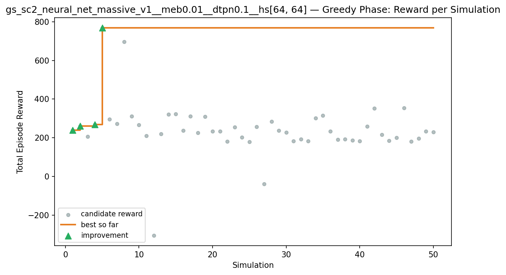

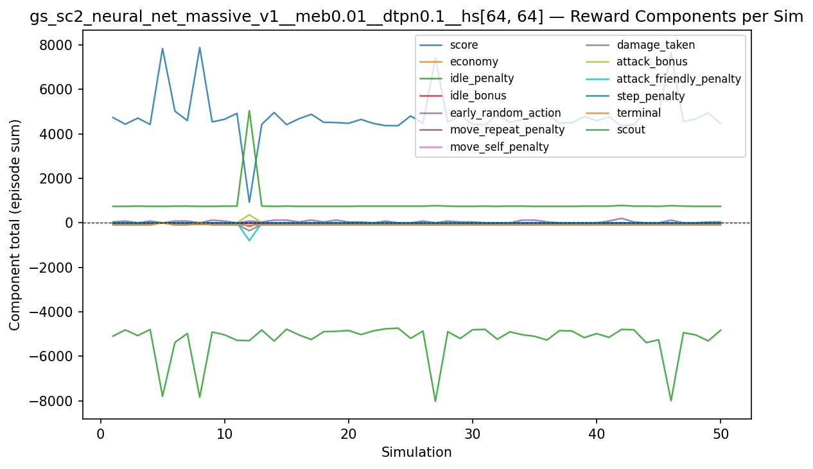

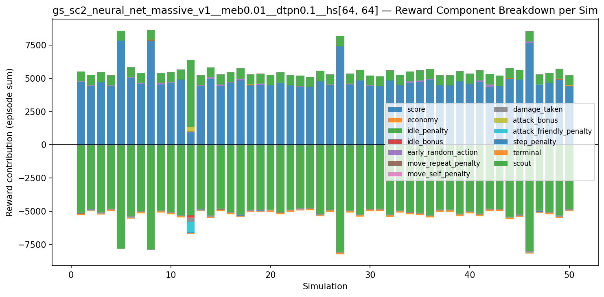

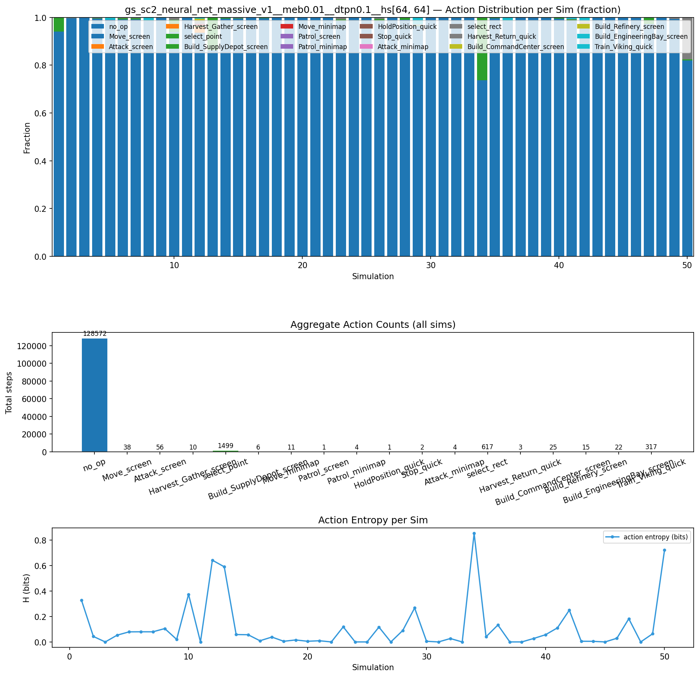

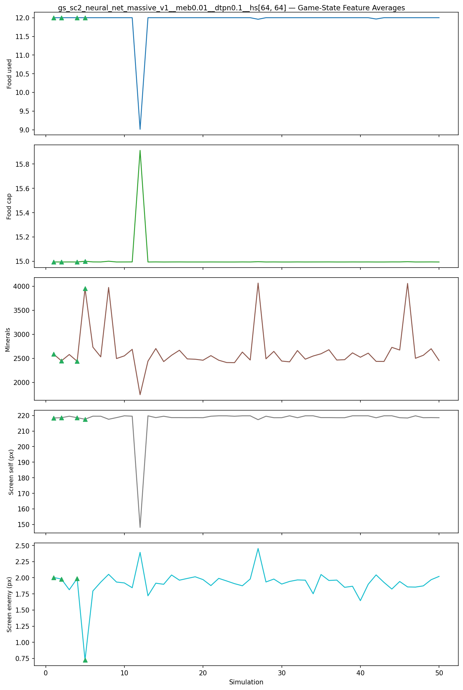

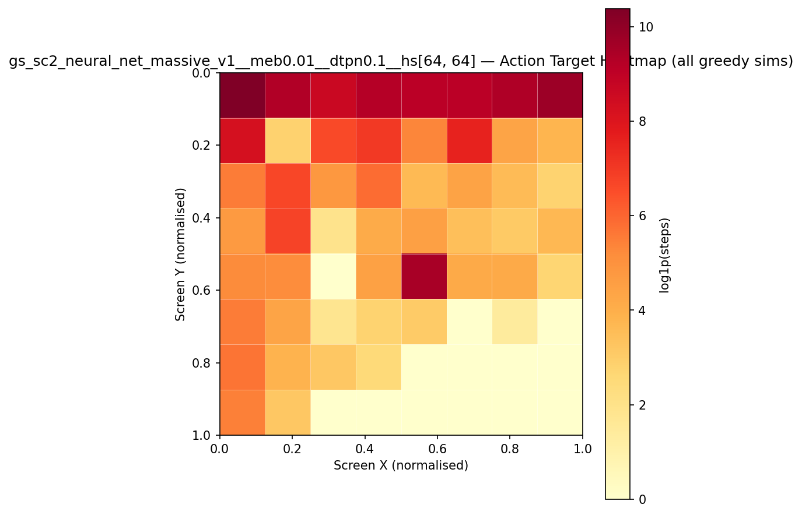

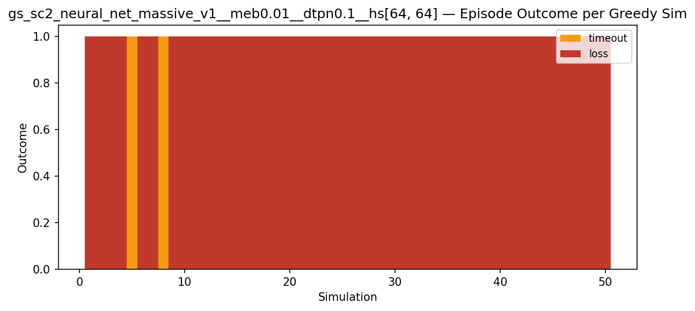

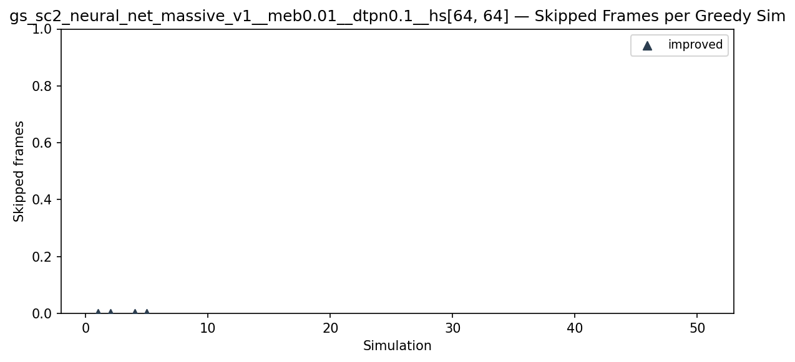

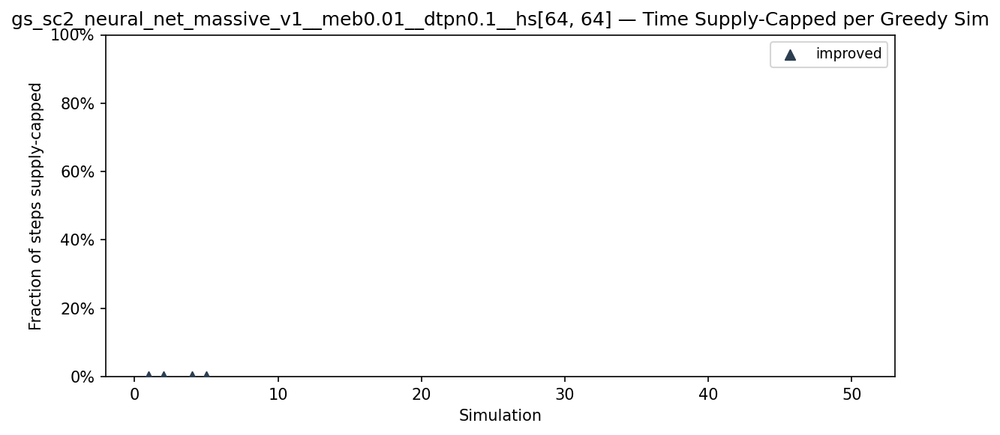

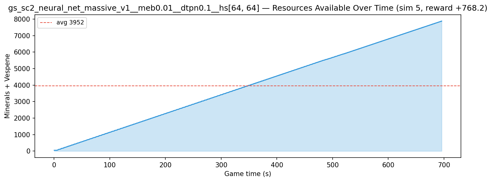

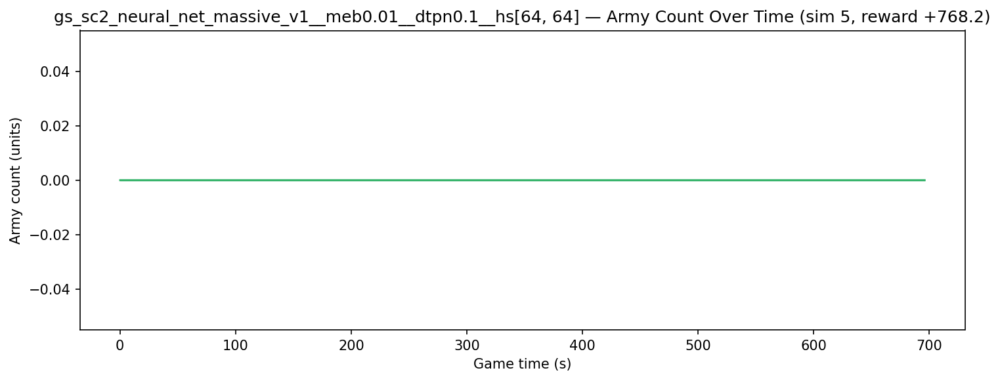

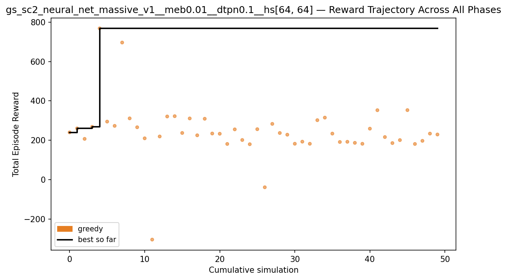
