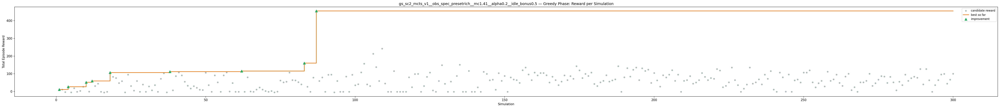
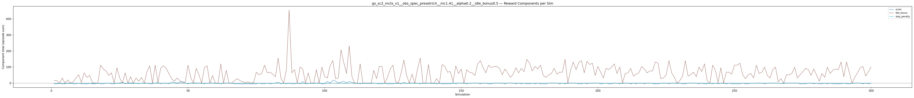
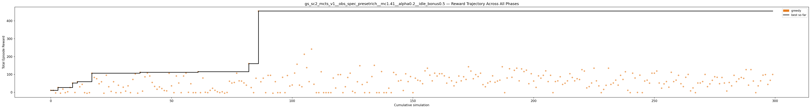

# Experiment: gs_sc2_mcts_v1__obs_spec_presetrich__mc1.41__alpha0.2__idle_bonus0.5

**Game:** StarCraft 2

## Timings

- **Start:** 2026-05-06 07:02:57
- **End:** 2026-05-06 07:11:56
- **Total runtime:** 8m 58.4s

| Phase | Duration |
|-------|----------|
| Greedy | 8m 57.4s |

## Run Parameters

### Training

| Parameter | Value |
|-----------|-------|
| track | sc2_DefeatRoaches |
| obs_spec_preset | rich |
| enable_belief | False |
| map_name | DefeatRoaches |
| in_game_episode_s | 120.0 |
| step_mul | 8 |
| screen_size | 64 |
| minimap_size | 64 |
| agent_race | random |
| n_sims | 300 |
| policy_type | mcts |
| mcts_c | 1.41 |
| alpha | 0.2 |
| policy_params | {'n_bins': 3, 'gamma': 0.99, 'alpha': 0.2, 'c': 1.41} |

### Reward Config

| Parameter | Value |
|-----------|-------|
| score_weight | 0.5 |
| win_bonus | 0.0 |
| loss_penalty | 0.0 |
| step_penalty | -0.001 |
| idle_penalty | 0.0 |
| idle_bonus | 0.5 |
| economy_weight | 0.0 |

## Greedy Phase

Best reward: **+455.1**

| Sim  | Reward   | Progress | Finish Time | Mean abs lat | Reason       | Result       |
|------|----------|----------|-------------|--------------|--------------|-------------|
|    1 |    +11.0 | 0.000    | —           | —       | finish       | **NEW BEST** |
|    2 |    +11.0 | 0.000    | —           | —       | finish       |  |
|    3 |     -3.4 | 0.000    | —           | —       | finish       |  |
|    4 |    +27.0 | 0.000    | —           | —       | finish       | **NEW BEST** |
|    5 |     -4.9 | 0.000    | —           | —       | finish       |  |
|    6 |    +18.1 | 0.000    | —           | —       | finish       |  |
|    7 |     -1.9 | 0.000    | —           | —       | finish       |  |
|    8 |     +3.0 | 0.000    | —           | —       | finish       |  |
|    9 |    +26.9 | 0.000    | —           | —       | finish       |  |
|   10 |    +51.8 | 0.000    | —           | —       | finish       | **NEW BEST** |
|   11 |     -1.0 | 0.000    | —           | —       | finish       |  |
|   12 |    +58.9 | 0.000    | —           | —       | finish       | **NEW BEST** |
|   13 |    +30.8 | 0.000    | —           | —       | finish       |  |
|   14 |    +44.6 | 0.000    | —           | —       | finish       |  |
|   15 |     -2.0 | 0.000    | —           | —       | finish       |  |
|   16 |     -5.4 | 0.000    | —           | —       | finish       |  |
|   17 |     -1.9 | 0.000    | —           | —       | finish       |  |
|   18 |   +106.7 | 0.000    | —           | —       | finish       | **NEW BEST** |
|   19 |    +83.1 | 0.000    | —           | —       | finish       |  |
|   20 |    +76.1 | 0.000    | —           | —       | finish       |  |
|   21 |    +48.0 | 0.000    | —           | —       | finish       |  |
|   22 |    +58.9 | 0.000    | —           | —       | finish       |  |
|   23 |     -5.2 | 0.000    | —           | —       | finish       |  |
|   24 |    +95.6 | 0.000    | —           | —       | finish       |  |
|   25 |    +31.1 | 0.000    | —           | —       | finish       |  |
|   26 |     +5.0 | 0.000    | —           | —       | finish       |  |
|   27 |    +59.2 | 0.000    | —           | —       | finish       |  |
|   28 |     -1.9 | 0.000    | —           | —       | finish       |  |
|   29 |    +39.6 | 0.000    | —           | —       | finish       |  |
|   30 |     -1.9 | 0.000    | —           | —       | finish       |  |
|   31 |    +28.6 | 0.000    | —           | —       | finish       |  |
|   32 |     +6.6 | 0.000    | —           | —       | finish       |  |
|   33 |    +36.2 | 0.000    | —           | —       | finish       |  |
|   34 |     -1.9 | 0.000    | —           | —       | finish       |  |
|   35 |    +72.0 | 0.000    | —           | —       | finish       |  |
|   36 |   +103.1 | 0.000    | —           | —       | finish       |  |
|   37 |     -4.8 | 0.000    | —           | —       | finish       |  |
|   38 |   +112.1 | 0.000    | —           | —       | finish       | **NEW BEST** |
|   39 |     +6.6 | 0.000    | —           | —       | finish       |  |
|   40 |    +86.7 | 0.000    | —           | —       | finish       |  |
|   41 |   +108.1 | 0.000    | —           | —       | finish       |  |
|   42 |    +91.3 | 0.000    | —           | —       | finish       |  |
|   43 |    +55.1 | 0.000    | —           | —       | finish       |  |
|   44 |    +32.9 | 0.000    | —           | —       | finish       |  |
|   45 |    +17.1 | 0.000    | —           | —       | finish       |  |
|   46 |    +30.1 | 0.000    | —           | —       | finish       |  |
|   47 |    +21.1 | 0.000    | —           | —       | finish       |  |
|   48 |    +10.0 | 0.000    | —           | —       | finish       |  |
|   49 |     +8.1 | 0.000    | —           | —       | finish       |  |
|   50 |   +106.3 | 0.000    | —           | —       | finish       |  |
|   51 |    +36.1 | 0.000    | —           | —       | finish       |  |
|   52 |     -1.9 | 0.000    | —           | —       | finish       |  |
|   53 |    +91.2 | 0.000    | —           | —       | finish       |  |
|   54 |    +52.0 | 0.000    | —           | —       | finish       |  |
|   55 |     -1.9 | 0.000    | —           | —       | finish       |  |
|   56 |    +91.1 | 0.000    | —           | —       | finish       |  |
|   57 |   +107.6 | 0.000    | —           | —       | finish       |  |
|   58 |     -0.2 | 0.000    | —           | —       | finish       |  |
|   59 |    +47.9 | 0.000    | —           | —       | finish       |  |
|   60 |     -1.9 | 0.000    | —           | —       | finish       |  |
|   61 |     -1.9 | 0.000    | —           | —       | finish       |  |
|   62 |   +115.1 | 0.000    | —           | —       | finish       | **NEW BEST** |
|   63 |     -1.9 | 0.000    | —           | —       | finish       |  |
|   64 |    +80.0 | 0.000    | —           | —       | finish       |  |
|   65 |     +0.1 | 0.000    | —           | —       | finish       |  |
|   66 |     -1.9 | 0.000    | —           | —       | finish       |  |
|   67 |    +10.9 | 0.000    | —           | —       | finish       |  |
|   68 |    +22.6 | 0.000    | —           | —       | finish       |  |
|   69 |    +11.0 | 0.000    | —           | —       | finish       |  |
|   70 |     +2.9 | 0.000    | —           | —       | finish       |  |
|   71 |     -1.6 | 0.000    | —           | —       | finish       |  |
|   72 |     +2.7 | 0.000    | —           | —       | finish       |  |
|   73 |     -5.0 | 0.000    | —           | —       | finish       |  |
|   74 |     -0.9 | 0.000    | —           | —       | finish       |  |
|   75 |    +62.0 | 0.000    | —           | —       | finish       |  |
|   76 |    +51.9 | 0.000    | —           | —       | finish       |  |
|   77 |    +55.1 | 0.000    | —           | —       | finish       |  |
|   78 |   +106.9 | 0.000    | —           | —       | finish       |  |
|   79 |    +64.0 | 0.000    | —           | —       | finish       |  |
|   80 |    +62.9 | 0.000    | —           | —       | finish       |  |
|   81 |    +52.6 | 0.000    | —           | —       | finish       |  |
|   82 |    +39.7 | 0.000    | —           | —       | finish       |  |
|   83 |   +160.8 | 0.000    | —           | —       | finish       | **NEW BEST** |
|   84 |    +26.6 | 0.000    | —           | —       | finish       |  |
|   85 |     -1.9 | 0.000    | —           | —       | finish       |  |
|   86 |    +78.7 | 0.000    | —           | —       | finish       |  |
|   87 |   +455.1 | 0.000    | —           | —       | finish       | **NEW BEST** |
|   88 |    +59.0 | 0.000    | —           | —       | finish       |  |
|   89 |    +79.1 | 0.000    | —           | —       | finish       |  |
|   90 |     -1.9 | 0.000    | —           | —       | finish       |  |
|   91 |    +94.8 | 0.000    | —           | —       | finish       |  |
|   92 |    +95.1 | 0.000    | —           | —       | finish       |  |
|   93 |     -5.1 | 0.000    | —           | —       | finish       |  |
|   94 |    +59.6 | 0.000    | —           | —       | finish       |  |
|   95 |     -1.9 | 0.000    | —           | —       | finish       |  |
|   96 |     -1.9 | 0.000    | —           | —       | finish       |  |
|   97 |    +84.0 | 0.000    | —           | —       | finish       |  |
|   98 |     -1.9 | 0.000    | —           | —       | finish       |  |
|   99 |    +94.0 | 0.000    | —           | —       | finish       |  |
|  100 |    +35.1 | 0.000    | —           | —       | finish       |  |
|  101 |    +40.9 | 0.000    | —           | —       | finish       |  |
|  102 |   +107.7 | 0.000    | —           | —       | finish       |  |
|  103 |   +157.2 | 0.000    | —           | —       | finish       |  |
|  104 |    +40.2 | 0.000    | —           | —       | finish       |  |
|  105 |    +31.2 | 0.000    | —           | —       | finish       |  |
|  106 |   +213.0 | 0.000    | —           | —       | finish       |  |
|  107 |   +138.1 | 0.000    | —           | —       | finish       |  |
|  108 |    +59.7 | 0.000    | —           | —       | finish       |  |
|  109 |   +241.9 | 0.000    | —           | —       | finish       |  |
|  110 |    +45.1 | 0.000    | —           | —       | finish       |  |
|  111 |     -1.9 | 0.000    | —           | —       | finish       |  |
|  112 |     -1.9 | 0.000    | —           | —       | finish       |  |
|  113 |   +115.0 | 0.000    | —           | —       | finish       |  |
|  114 |     -1.9 | 0.000    | —           | —       | finish       |  |
|  115 |     -1.9 | 0.000    | —           | —       | finish       |  |
|  116 |     -1.9 | 0.000    | —           | —       | finish       |  |
|  117 |     -1.9 | 0.000    | —           | —       | finish       |  |
|  118 |    +80.0 | 0.000    | —           | —       | finish       |  |
|  119 |    +24.1 | 0.000    | —           | —       | finish       |  |
|  120 |    +98.8 | 0.000    | —           | —       | finish       |  |
|  121 |    +99.1 | 0.000    | —           | —       | finish       |  |
|  122 |     -1.9 | 0.000    | —           | —       | finish       |  |
|  123 |    +31.1 | 0.000    | —           | —       | finish       |  |
|  124 |    +83.1 | 0.000    | —           | —       | finish       |  |
|  125 |   +107.1 | 0.000    | —           | —       | finish       |  |
|  126 |     +5.6 | 0.000    | —           | —       | finish       |  |
|  127 |     -1.9 | 0.000    | —           | —       | finish       |  |
|  128 |    +59.1 | 0.000    | —           | —       | finish       |  |
|  129 |   +148.8 | 0.000    | —           | —       | finish       |  |
|  130 |    +43.6 | 0.000    | —           | —       | finish       |  |
|  131 |     -1.9 | 0.000    | —           | —       | finish       |  |
|  132 |    +56.0 | 0.000    | —           | —       | finish       |  |
|  133 |     -1.9 | 0.000    | —           | —       | finish       |  |
|  134 |    +88.1 | 0.000    | —           | —       | finish       |  |
|  135 |   +151.0 | 0.000    | —           | —       | finish       |  |
|  136 |     -1.9 | 0.000    | —           | —       | finish       |  |
|  137 |     -1.9 | 0.000    | —           | —       | finish       |  |
|  138 |   +116.1 | 0.000    | —           | —       | finish       |  |
|  139 |     -1.9 | 0.000    | —           | —       | finish       |  |
|  140 |     -1.9 | 0.000    | —           | —       | finish       |  |
|  141 |    +23.2 | 0.000    | —           | —       | finish       |  |
|  142 |     -1.9 | 0.000    | —           | —       | finish       |  |
|  143 |   +111.1 | 0.000    | —           | —       | finish       |  |
|  144 |    +99.1 | 0.000    | —           | —       | finish       |  |
|  145 |    +63.1 | 0.000    | —           | —       | finish       |  |
|  146 |    +66.9 | 0.000    | —           | —       | finish       |  |
|  147 |    +10.1 | 0.000    | —           | —       | finish       |  |
|  148 |   +103.5 | 0.000    | —           | —       | finish       |  |
|  149 |    +59.9 | 0.000    | —           | —       | finish       |  |
|  150 |    +88.1 | 0.000    | —           | —       | finish       |  |
|  151 |     -1.9 | 0.000    | —           | —       | finish       |  |
|  152 |    +79.1 | 0.000    | —           | —       | finish       |  |
|  153 |    +67.8 | 0.000    | —           | —       | finish       |  |
|  154 |    +64.2 | 0.000    | —           | —       | finish       |  |
|  155 |    +48.2 | 0.000    | —           | —       | finish       |  |
|  156 |   +120.1 | 0.000    | —           | —       | finish       |  |
|  157 |   +135.0 | 0.000    | —           | —       | finish       |  |
|  158 |    +96.0 | 0.000    | —           | —       | finish       |  |
|  159 |    +64.1 | 0.000    | —           | —       | finish       |  |
|  160 |   +107.1 | 0.000    | —           | —       | finish       |  |
|  161 |    +91.2 | 0.000    | —           | —       | finish       |  |
|  162 |   +104.0 | 0.000    | —           | —       | finish       |  |
|  163 |   +104.2 | 0.000    | —           | —       | finish       |  |
|  164 |    +92.2 | 0.000    | —           | —       | finish       |  |
|  165 |    +51.3 | 0.000    | —           | —       | finish       |  |
|  166 |    +83.2 | 0.000    | —           | —       | finish       |  |
|  167 |    +64.1 | 0.000    | —           | —       | finish       |  |
|  168 |    +36.1 | 0.000    | —           | —       | finish       |  |
|  169 |    +55.9 | 0.000    | —           | —       | finish       |  |
|  170 |    +91.2 | 0.000    | —           | —       | finish       |  |
|  171 |    +64.1 | 0.000    | —           | —       | finish       |  |
|  172 |    +87.1 | 0.000    | —           | —       | finish       |  |
|  173 |    +72.0 | 0.000    | —           | —       | finish       |  |
|  174 |   +143.1 | 0.000    | —           | —       | finish       |  |
|  175 |   +119.1 | 0.000    | —           | —       | finish       |  |
|  176 |    +76.1 | 0.000    | —           | —       | finish       |  |
|  177 |    +99.1 | 0.000    | —           | —       | finish       |  |
|  178 |    +88.1 | 0.000    | —           | —       | finish       |  |
|  179 |   +107.1 | 0.000    | —           | —       | finish       |  |
|  180 |    +43.0 | 0.000    | —           | —       | finish       |  |
|  181 |    +31.1 | 0.000    | —           | —       | finish       |  |
|  182 |    +52.1 | 0.000    | —           | —       | finish       |  |
|  183 |    +60.1 | 0.000    | —           | —       | finish       |  |
|  184 |    +92.1 | 0.000    | —           | —       | finish       |  |
|  185 |    +56.1 | 0.000    | —           | —       | finish       |  |
|  186 |    +63.0 | 0.000    | —           | —       | finish       |  |
|  187 |    +68.1 | 0.000    | —           | —       | finish       |  |
|  188 |   +143.1 | 0.000    | —           | —       | finish       |  |
|  189 |     -1.9 | 0.000    | —           | —       | finish       |  |
|  190 |    +80.1 | 0.000    | —           | —       | finish       |  |
|  191 |   +132.0 | 0.000    | —           | —       | finish       |  |
|  192 |    +84.1 | 0.000    | —           | —       | finish       |  |
|  193 |   +123.1 | 0.000    | —           | —       | finish       |  |
|  194 |   +135.1 | 0.000    | —           | —       | finish       |  |
|  195 |    +64.1 | 0.000    | —           | —       | finish       |  |
|  196 |   +131.0 | 0.000    | —           | —       | finish       |  |
|  197 |   +116.1 | 0.000    | —           | —       | finish       |  |
|  198 |   +124.0 | 0.000    | —           | —       | finish       |  |
|  199 |    +48.1 | 0.000    | —           | —       | finish       |  |
|  200 |   +104.1 | 0.000    | —           | —       | finish       |  |
|  201 |    +63.1 | 0.000    | —           | —       | finish       |  |
|  202 |    +27.6 | 0.000    | —           | —       | finish       |  |
|  203 |    +92.1 | 0.000    | —           | —       | finish       |  |
|  204 |    +79.1 | 0.000    | —           | —       | finish       |  |
|  205 |    +95.2 | 0.000    | —           | —       | finish       |  |
|  206 |   +120.0 | 0.000    | —           | —       | finish       |  |
|  207 |    +60.1 | 0.000    | —           | —       | finish       |  |
|  208 |    +95.1 | 0.000    | —           | —       | finish       |  |
|  209 |     -1.9 | 0.000    | —           | —       | finish       |  |
|  210 |    +60.2 | 0.000    | —           | —       | finish       |  |
|  211 |    +64.0 | 0.000    | —           | —       | finish       |  |
|  212 |    +87.1 | 0.000    | —           | —       | finish       |  |
|  213 |    +44.1 | 0.000    | —           | —       | finish       |  |
|  214 |    +50.9 | 0.000    | —           | —       | finish       |  |
|  215 |    +64.1 | 0.000    | —           | —       | finish       |  |
|  216 |   +104.1 | 0.000    | —           | —       | finish       |  |
|  217 |    +82.9 | 0.000    | —           | —       | finish       |  |
|  218 |    +64.1 | 0.000    | —           | —       | finish       |  |
|  219 |    +76.1 | 0.000    | —           | —       | finish       |  |
|  220 |    +71.6 | 0.000    | —           | —       | finish       |  |
|  221 |   +126.8 | 0.000    | —           | —       | finish       |  |
|  222 |   +119.0 | 0.000    | —           | —       | finish       |  |
|  223 |    +24.6 | 0.000    | —           | —       | finish       |  |
|  224 |    +31.9 | 0.000    | —           | —       | finish       |  |
|  225 |    +52.1 | 0.000    | —           | —       | finish       |  |
|  226 |   +135.0 | 0.000    | —           | —       | finish       |  |
|  227 |    +64.1 | 0.000    | —           | —       | finish       |  |
|  228 |    +35.9 | 0.000    | —           | —       | finish       |  |
|  229 |     -1.9 | 0.000    | —           | —       | finish       |  |
|  230 |    +16.1 | 0.000    | —           | —       | finish       |  |
|  231 |    +39.2 | 0.000    | —           | —       | finish       |  |
|  232 |   +135.1 | 0.000    | —           | —       | finish       |  |
|  233 |    +44.1 | 0.000    | —           | —       | finish       |  |
|  234 |    +52.2 | 0.000    | —           | —       | finish       |  |
|  235 |    +68.1 | 0.000    | —           | —       | finish       |  |
|  236 |    +40.1 | 0.000    | —           | —       | finish       |  |
|  237 |    +95.1 | 0.000    | —           | —       | finish       |  |
|  238 |    +72.0 | 0.000    | —           | —       | finish       |  |
|  239 |   +115.1 | 0.000    | —           | —       | finish       |  |
|  240 |    +11.1 | 0.000    | —           | —       | finish       |  |
|  241 |     -1.9 | 0.000    | —           | —       | finish       |  |
|  242 |   +107.0 | 0.000    | —           | —       | finish       |  |
|  243 |    +80.1 | 0.000    | —           | —       | finish       |  |
|  244 |     -0.9 | 0.000    | —           | —       | finish       |  |
|  245 |    +96.0 | 0.000    | —           | —       | finish       |  |
|  246 |     -1.9 | 0.000    | —           | —       | finish       |  |
|  247 |    +63.0 | 0.000    | —           | —       | finish       |  |
|  248 |    +68.0 | 0.000    | —           | —       | finish       |  |
|  249 |    +51.2 | 0.000    | —           | —       | finish       |  |
|  250 |   +107.1 | 0.000    | —           | —       | finish       |  |
|  251 |   +107.1 | 0.000    | —           | —       | finish       |  |
|  252 |   +119.0 | 0.000    | —           | —       | finish       |  |
|  253 |    +52.1 | 0.000    | —           | —       | finish       |  |
|  254 |    +23.1 | 0.000    | —           | —       | finish       |  |
|  255 |    +47.2 | 0.000    | —           | —       | finish       |  |
|  256 |    +60.2 | 0.000    | —           | —       | finish       |  |
|  257 |    +28.6 | 0.000    | —           | —       | finish       |  |
|  258 |   +112.1 | 0.000    | —           | —       | finish       |  |
|  259 |    +59.9 | 0.000    | —           | —       | finish       |  |
|  260 |    +68.1 | 0.000    | —           | —       | finish       |  |
|  261 |    +95.1 | 0.000    | —           | —       | finish       |  |
|  262 |    +48.1 | 0.000    | —           | —       | finish       |  |
|  263 |    +31.9 | 0.000    | —           | —       | finish       |  |
|  264 |    +84.0 | 0.000    | —           | —       | finish       |  |
|  265 |   +100.1 | 0.000    | —           | —       | finish       |  |
|  266 |     +8.0 | 0.000    | —           | —       | finish       |  |
|  267 |    +24.6 | 0.000    | —           | —       | finish       |  |
|  268 |     -1.9 | 0.000    | —           | —       | finish       |  |
|  269 |    +52.1 | 0.000    | —           | —       | finish       |  |
|  270 |    +52.1 | 0.000    | —           | —       | finish       |  |
|  271 |    +60.2 | 0.000    | —           | —       | finish       |  |
|  272 |   +100.1 | 0.000    | —           | —       | finish       |  |
|  273 |    +31.8 | 0.000    | —           | —       | finish       |  |
|  274 |    +47.2 | 0.000    | —           | —       | finish       |  |
|  275 |    +67.1 | 0.000    | —           | —       | finish       |  |
|  276 |    +87.2 | 0.000    | —           | —       | finish       |  |
|  277 |    +84.0 | 0.000    | —           | —       | finish       |  |
|  278 |    +48.2 | 0.000    | —           | —       | finish       |  |
|  279 |    +83.0 | 0.000    | —           | —       | finish       |  |
|  280 |    +52.0 | 0.000    | —           | —       | finish       |  |
|  281 |     +7.1 | 0.000    | —           | —       | finish       |  |
|  282 |    +55.0 | 0.000    | —           | —       | finish       |  |
|  283 |    +36.1 | 0.000    | —           | —       | finish       |  |
|  284 |    +95.1 | 0.000    | —           | —       | finish       |  |
|  285 |    +59.9 | 0.000    | —           | —       | finish       |  |
|  286 |    +75.1 | 0.000    | —           | —       | finish       |  |
|  287 |    +83.2 | 0.000    | —           | —       | finish       |  |
|  288 |    +78.1 | 0.000    | —           | —       | finish       |  |
|  289 |   +127.0 | 0.000    | —           | —       | finish       |  |
|  290 |    +40.1 | 0.000    | —           | —       | finish       |  |
|  291 |   +127.1 | 0.000    | —           | —       | finish       |  |
|  292 |    +63.1 | 0.000    | —           | —       | finish       |  |
|  293 |     -1.9 | 0.000    | —           | —       | finish       |  |
|  294 |    +36.1 | 0.000    | —           | —       | finish       |  |
|  295 |    +64.1 | 0.000    | —           | —       | finish       |  |
|  296 |    +96.0 | 0.000    | —           | —       | finish       |  |
|  297 |    +99.1 | 0.000    | —           | —       | finish       |  |
|  298 |    +44.2 | 0.000    | —           | —       | finish       |  |
|  299 |    +67.1 | 0.000    | —           | —       | finish       |  |
|  300 |    +99.9 | 0.000    | —           | —       | finish       |  |

