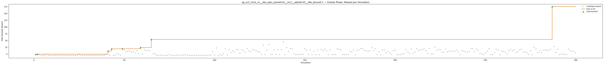
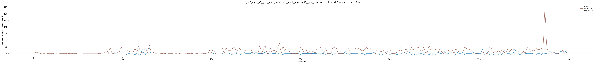
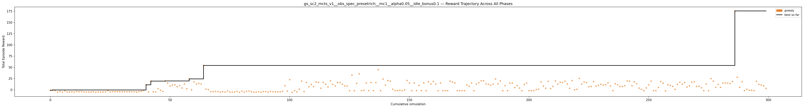

# Experiment: gs_sc2_mcts_v1__obs_spec_presetrich__mc1__alpha0.05__idle_bonus0.1

**Game:** StarCraft 2

## Timings

- **Start:** 2026-05-06 03:59:00
- **End:** 2026-05-06 04:09:12
- **Total runtime:** 10m 11.7s

| Phase | Duration |
|-------|----------|
| Greedy | 10m 10.7s |

## Run Parameters

### Training

| Parameter | Value |
|-----------|-------|
| track | sc2_DefeatRoaches |
| obs_spec_preset | rich |
| enable_belief | False |
| map_name | DefeatRoaches |
| in_game_episode_s | 120.0 |
| step_mul | 8 |
| screen_size | 64 |
| minimap_size | 64 |
| agent_race | random |
| n_sims | 300 |
| policy_type | mcts |
| mcts_c | 1.0 |
| alpha | 0.05 |
| policy_params | {'n_bins': 3, 'gamma': 0.99, 'alpha': 0.05, 'c': 1.0} |

### Reward Config

| Parameter | Value |
|-----------|-------|
| score_weight | 0.5 |
| win_bonus | 0.0 |
| loss_penalty | 0.0 |
| step_penalty | -0.001 |
| idle_penalty | 0.0 |
| idle_bonus | 0.1 |
| economy_weight | 0.0 |

## Greedy Phase

Best reward: **+175.7**

| Sim  | Reward   | Progress | Finish Time | Mean abs lat | Reason       | Result       |
|------|----------|----------|-------------|--------------|--------------|-------------|
|    1 |     -1.1 | 0.000    | —           | —       | finish       | **NEW BEST** |
|    2 |     -0.3 | 0.000    | —           | —       | finish       | **NEW BEST** |
|    3 |     -1.8 | 0.000    | —           | —       | finish       |  |
|    4 |     -5.2 | 0.000    | —           | —       | finish       |  |
|    5 |     -3.3 | 0.000    | —           | —       | finish       |  |
|    6 |     -5.5 | 0.000    | —           | —       | finish       |  |
|    7 |     -2.1 | 0.000    | —           | —       | finish       |  |
|    8 |     -4.9 | 0.000    | —           | —       | finish       |  |
|    9 |     -5.0 | 0.000    | —           | —       | finish       |  |
|   10 |     -4.6 | 0.000    | —           | —       | finish       |  |
|   11 |     -5.1 | 0.000    | —           | —       | finish       |  |
|   12 |     -3.6 | 0.000    | —           | —       | finish       |  |
|   13 |     -4.5 | 0.000    | —           | —       | finish       |  |
|   14 |     -3.5 | 0.000    | —           | —       | finish       |  |
|   15 |     -5.0 | 0.000    | —           | —       | finish       |  |
|   16 |     -5.1 | 0.000    | —           | —       | finish       |  |
|   17 |     -5.0 | 0.000    | —           | —       | finish       |  |
|   18 |     -5.0 | 0.000    | —           | —       | finish       |  |
|   19 |     -4.4 | 0.000    | —           | —       | finish       |  |
|   20 |     -5.5 | 0.000    | —           | —       | finish       |  |
|   21 |     -4.8 | 0.000    | —           | —       | finish       |  |
|   22 |     -5.1 | 0.000    | —           | —       | finish       |  |
|   23 |     -4.9 | 0.000    | —           | —       | finish       |  |
|   24 |     -5.0 | 0.000    | —           | —       | finish       |  |
|   25 |     -2.0 | 0.000    | —           | —       | finish       |  |
|   26 |     -4.8 | 0.000    | —           | —       | finish       |  |
|   27 |     -4.2 | 0.000    | —           | —       | finish       |  |
|   28 |     -4.2 | 0.000    | —           | —       | finish       |  |
|   29 |     -4.2 | 0.000    | —           | —       | finish       |  |
|   30 |     -4.3 | 0.000    | —           | —       | finish       |  |
|   31 |     -4.4 | 0.000    | —           | —       | finish       |  |
|   32 |     -4.2 | 0.000    | —           | —       | finish       |  |
|   33 |     -4.6 | 0.000    | —           | —       | finish       |  |
|   34 |     -4.3 | 0.000    | —           | —       | finish       |  |
|   35 |     -4.3 | 0.000    | —           | —       | finish       |  |
|   36 |     -4.5 | 0.000    | —           | —       | finish       |  |
|   37 |     -4.9 | 0.000    | —           | —       | finish       |  |
|   38 |     -4.2 | 0.000    | —           | —       | finish       |  |
|   39 |     -3.3 | 0.000    | —           | —       | finish       |  |
|   40 |     -1.5 | 0.000    | —           | —       | finish       |  |
|   41 |    +11.2 | 0.000    | —           | —       | finish       | **NEW BEST** |
|   42 |     -4.9 | 0.000    | —           | —       | finish       |  |
|   43 |    +19.4 | 0.000    | —           | —       | finish       | **NEW BEST** |
|   44 |     -4.3 | 0.000    | —           | —       | finish       |  |
|   45 |     -4.8 | 0.000    | —           | —       | finish       |  |
|   46 |     +2.4 | 0.000    | —           | —       | finish       |  |
|   47 |     -0.9 | 0.000    | —           | —       | finish       |  |
|   48 |     -3.7 | 0.000    | —           | —       | finish       |  |
|   49 |    +19.6 | 0.000    | —           | —       | finish       | **NEW BEST** |
|   50 |    +15.0 | 0.000    | —           | —       | finish       |  |
|   51 |     +8.5 | 0.000    | —           | —       | finish       |  |
|   52 |    +10.3 | 0.000    | —           | —       | finish       |  |
|   53 |    +11.1 | 0.000    | —           | —       | finish       |  |
|   54 |     +7.0 | 0.000    | —           | —       | finish       |  |
|   55 |     +9.5 | 0.000    | —           | —       | finish       |  |
|   56 |     +4.0 | 0.000    | —           | —       | finish       |  |
|   57 |    +12.9 | 0.000    | —           | —       | finish       |  |
|   58 |     +2.3 | 0.000    | —           | —       | finish       |  |
|   59 |    +24.3 | 0.000    | —           | —       | finish       | **NEW BEST** |
|   60 |     -0.1 | 0.000    | —           | —       | finish       |  |
|   61 |    +17.8 | 0.000    | —           | —       | finish       |  |
|   62 |    +12.9 | 0.000    | —           | —       | finish       |  |
|   63 |    +14.4 | 0.000    | —           | —       | finish       |  |
|   64 |    +13.2 | 0.000    | —           | —       | finish       |  |
|   65 |    +54.2 | 0.000    | —           | —       | finish       | **NEW BEST** |
|   66 |     +1.5 | 0.000    | —           | —       | finish       |  |
|   67 |     +0.4 | 0.000    | —           | —       | finish       |  |
|   68 |     -4.3 | 0.000    | —           | —       | finish       |  |
|   69 |     -4.2 | 0.000    | —           | —       | finish       |  |
|   70 |     -3.5 | 0.000    | —           | —       | finish       |  |
|   71 |     -4.1 | 0.000    | —           | —       | finish       |  |
|   72 |     -5.2 | 0.000    | —           | —       | finish       |  |
|   73 |     -4.2 | 0.000    | —           | —       | finish       |  |
|   74 |     -5.1 | 0.000    | —           | —       | finish       |  |
|   75 |     -2.6 | 0.000    | —           | —       | finish       |  |
|   76 |     -5.1 | 0.000    | —           | —       | finish       |  |
|   77 |     -5.1 | 0.000    | —           | —       | finish       |  |
|   78 |     -4.8 | 0.000    | —           | —       | finish       |  |
|   79 |     -3.0 | 0.000    | —           | —       | finish       |  |
|   80 |     -5.6 | 0.000    | —           | —       | finish       |  |
|   81 |     -2.7 | 0.000    | —           | —       | finish       |  |
|   82 |     -5.0 | 0.000    | —           | —       | finish       |  |
|   83 |     -3.6 | 0.000    | —           | —       | finish       |  |
|   84 |     -2.7 | 0.000    | —           | —       | finish       |  |
|   85 |     -4.5 | 0.000    | —           | —       | finish       |  |
|   86 |     -5.2 | 0.000    | —           | —       | finish       |  |
|   87 |     -5.0 | 0.000    | —           | —       | finish       |  |
|   88 |     -4.4 | 0.000    | —           | —       | finish       |  |
|   89 |     -5.2 | 0.000    | —           | —       | finish       |  |
|   90 |     -3.9 | 0.000    | —           | —       | finish       |  |
|   91 |     -4.2 | 0.000    | —           | —       | finish       |  |
|   92 |     -5.1 | 0.000    | —           | —       | finish       |  |
|   93 |     -3.4 | 0.000    | —           | —       | finish       |  |
|   94 |     -4.4 | 0.000    | —           | —       | finish       |  |
|   95 |     -4.4 | 0.000    | —           | —       | finish       |  |
|   96 |     -4.8 | 0.000    | —           | —       | finish       |  |
|   97 |     -4.3 | 0.000    | —           | —       | finish       |  |
|   98 |     -3.4 | 0.000    | —           | —       | finish       |  |
|   99 |     +9.1 | 0.000    | —           | —       | finish       |  |
|  100 |     -2.9 | 0.000    | —           | —       | finish       |  |
|  101 |    +22.5 | 0.000    | —           | —       | finish       |  |
|  102 |     -5.8 | 0.000    | —           | —       | finish       |  |
|  103 |     -2.0 | 0.000    | —           | —       | finish       |  |
|  104 |     -4.7 | 0.000    | —           | —       | finish       |  |
|  105 |     +1.3 | 0.000    | —           | —       | finish       |  |
|  106 |    +19.3 | 0.000    | —           | —       | finish       |  |
|  107 |     -4.1 | 0.000    | —           | —       | finish       |  |
|  108 |    +16.3 | 0.000    | —           | —       | finish       |  |
|  109 |     +6.9 | 0.000    | —           | —       | finish       |  |
|  110 |    +12.0 | 0.000    | —           | —       | finish       |  |
|  111 |     +7.1 | 0.000    | —           | —       | finish       |  |
|  112 |    +17.5 | 0.000    | —           | —       | finish       |  |
|  113 |    +16.8 | 0.000    | —           | —       | finish       |  |
|  114 |     +3.6 | 0.000    | —           | —       | finish       |  |
|  115 |    +16.6 | 0.000    | —           | —       | finish       |  |
|  116 |    +12.5 | 0.000    | —           | —       | finish       |  |
|  117 |     +6.3 | 0.000    | —           | —       | finish       |  |
|  118 |    +20.0 | 0.000    | —           | —       | finish       |  |
|  119 |    +12.0 | 0.000    | —           | —       | finish       |  |
|  120 |     +8.5 | 0.000    | —           | —       | finish       |  |
|  121 |    +16.0 | 0.000    | —           | —       | finish       |  |
|  122 |    +16.2 | 0.000    | —           | —       | finish       |  |
|  123 |    +12.4 | 0.000    | —           | —       | finish       |  |
|  124 |     +8.7 | 0.000    | —           | —       | finish       |  |
|  125 |     +8.3 | 0.000    | —           | —       | finish       |  |
|  126 |     -1.9 | 0.000    | —           | —       | finish       |  |
|  127 |    +32.7 | 0.000    | —           | —       | finish       |  |
|  128 |     -1.9 | 0.000    | —           | —       | finish       |  |
|  129 |    +14.3 | 0.000    | —           | —       | finish       |  |
|  130 |    +35.3 | 0.000    | —           | —       | finish       |  |
|  131 |     -1.9 | 0.000    | —           | —       | finish       |  |
|  132 |     -1.1 | 0.000    | —           | —       | finish       |  |
|  133 |    +15.2 | 0.000    | —           | —       | finish       |  |
|  134 |     -1.9 | 0.000    | —           | —       | finish       |  |
|  135 |    +16.1 | 0.000    | —           | —       | finish       |  |
|  136 |     -1.9 | 0.000    | —           | —       | finish       |  |
|  137 |    +16.0 | 0.000    | —           | —       | finish       |  |
|  138 |    +44.9 | 0.000    | —           | —       | finish       |  |
|  139 |     -1.9 | 0.000    | —           | —       | finish       |  |
|  140 |    +23.9 | 0.000    | —           | —       | finish       |  |
|  141 |    +10.5 | 0.000    | —           | —       | finish       |  |
|  142 |    +20.5 | 0.000    | —           | —       | finish       |  |
|  143 |    +19.2 | 0.000    | —           | —       | finish       |  |
|  144 |     +1.3 | 0.000    | —           | —       | finish       |  |
|  145 |     -1.9 | 0.000    | —           | —       | finish       |  |
|  146 |     -1.9 | 0.000    | —           | —       | finish       |  |
|  147 |     -1.1 | 0.000    | —           | —       | finish       |  |
|  148 |     -1.9 | 0.000    | —           | —       | finish       |  |
|  149 |     -0.3 | 0.000    | —           | —       | finish       |  |
|  150 |    +20.7 | 0.000    | —           | —       | finish       |  |
|  151 |    +15.1 | 0.000    | —           | —       | finish       |  |
|  152 |     -1.9 | 0.000    | —           | —       | finish       |  |
|  153 |    +15.3 | 0.000    | —           | —       | finish       |  |
|  154 |     -1.9 | 0.000    | —           | —       | finish       |  |
|  155 |     +9.7 | 0.000    | —           | —       | finish       |  |
|  156 |     -1.9 | 0.000    | —           | —       | finish       |  |
|  157 |    +15.2 | 0.000    | —           | —       | finish       |  |
|  158 |     -1.9 | 0.000    | —           | —       | finish       |  |
|  159 |    +17.7 | 0.000    | —           | —       | finish       |  |
|  160 |    +12.7 | 0.000    | —           | —       | finish       |  |
|  161 |    +18.3 | 0.000    | —           | —       | finish       |  |
|  162 |    +12.9 | 0.000    | —           | —       | finish       |  |
|  163 |     -1.9 | 0.000    | —           | —       | finish       |  |
|  164 |    +15.1 | 0.000    | —           | —       | finish       |  |
|  165 |     -1.9 | 0.000    | —           | —       | finish       |  |
|  166 |     -1.9 | 0.000    | —           | —       | finish       |  |
|  167 |     -1.9 | 0.000    | —           | —       | finish       |  |
|  168 |    +19.1 | 0.000    | —           | —       | finish       |  |
|  169 |    +17.5 | 0.000    | —           | —       | finish       |  |
|  170 |    +15.1 | 0.000    | —           | —       | finish       |  |
|  171 |     -1.9 | 0.000    | —           | —       | finish       |  |
|  172 |     -1.9 | 0.000    | —           | —       | finish       |  |
|  173 |     -1.9 | 0.000    | —           | —       | finish       |  |
|  174 |     -1.9 | 0.000    | —           | —       | finish       |  |
|  175 |    +10.9 | 0.000    | —           | —       | finish       |  |
|  176 |     +7.9 | 0.000    | —           | —       | finish       |  |
|  177 |    +15.1 | 0.000    | —           | —       | finish       |  |
|  178 |     -1.9 | 0.000    | —           | —       | finish       |  |
|  179 |    +12.7 | 0.000    | —           | —       | finish       |  |
|  180 |    +16.0 | 0.000    | —           | —       | finish       |  |
|  181 |    +20.1 | 0.000    | —           | —       | finish       |  |
|  182 |    +20.0 | 0.000    | —           | —       | finish       |  |
|  183 |    +13.3 | 0.000    | —           | —       | finish       |  |
|  184 |    +12.2 | 0.000    | —           | —       | finish       |  |
|  185 |    +10.4 | 0.000    | —           | —       | finish       |  |
|  186 |    +12.6 | 0.000    | —           | —       | finish       |  |
|  187 |    +24.1 | 0.000    | —           | —       | finish       |  |
|  188 |    +13.3 | 0.000    | —           | —       | finish       |  |
|  189 |    +19.9 | 0.000    | —           | —       | finish       |  |
|  190 |     -1.9 | 0.000    | —           | —       | finish       |  |
|  191 |     +9.1 | 0.000    | —           | —       | finish       |  |
|  192 |     -1.9 | 0.000    | —           | —       | finish       |  |
|  193 |    +14.9 | 0.000    | —           | —       | finish       |  |
|  194 |    +15.1 | 0.000    | —           | —       | finish       |  |
|  195 |     +4.9 | 0.000    | —           | —       | finish       |  |
|  196 |     +9.5 | 0.000    | —           | —       | finish       |  |
|  197 |     +3.9 | 0.000    | —           | —       | finish       |  |
|  198 |     -1.9 | 0.000    | —           | —       | finish       |  |
|  199 |    +12.0 | 0.000    | —           | —       | finish       |  |
|  200 |    +15.1 | 0.000    | —           | —       | finish       |  |
|  201 |     -1.9 | 0.000    | —           | —       | finish       |  |
|  202 |     -1.9 | 0.000    | —           | —       | finish       |  |
|  203 |     -1.9 | 0.000    | —           | —       | finish       |  |
|  204 |     +0.6 | 0.000    | —           | —       | finish       |  |
|  205 |     +1.4 | 0.000    | —           | —       | finish       |  |
|  206 |    +17.5 | 0.000    | —           | —       | finish       |  |
|  207 |     +8.2 | 0.000    | —           | —       | finish       |  |
|  208 |     +3.4 | 0.000    | —           | —       | finish       |  |
|  209 |    +19.0 | 0.000    | —           | —       | finish       |  |
|  210 |     +2.7 | 0.000    | —           | —       | finish       |  |
|  211 |     +7.7 | 0.000    | —           | —       | finish       |  |
|  212 |    +19.8 | 0.000    | —           | —       | finish       |  |
|  213 |    +12.6 | 0.000    | —           | —       | finish       |  |
|  214 |    +16.7 | 0.000    | —           | —       | finish       |  |
|  215 |    +16.2 | 0.000    | —           | —       | finish       |  |
|  216 |    +19.1 | 0.000    | —           | —       | finish       |  |
|  217 |    +12.8 | 0.000    | —           | —       | finish       |  |
|  218 |     +3.4 | 0.000    | —           | —       | finish       |  |
|  219 |    +20.5 | 0.000    | —           | —       | finish       |  |
|  220 |     +0.3 | 0.000    | —           | —       | finish       |  |
|  221 |     +1.2 | 0.000    | —           | —       | finish       |  |
|  222 |    +25.5 | 0.000    | —           | —       | finish       |  |
|  223 |    +12.9 | 0.000    | —           | —       | finish       |  |
|  224 |    +17.5 | 0.000    | —           | —       | finish       |  |
|  225 |    +15.9 | 0.000    | —           | —       | finish       |  |
|  226 |     +6.6 | 0.000    | —           | —       | finish       |  |
|  227 |     +7.4 | 0.000    | —           | —       | finish       |  |
|  228 |    +18.5 | 0.000    | —           | —       | finish       |  |
|  229 |     +8.1 | 0.000    | —           | —       | finish       |  |
|  230 |    +10.0 | 0.000    | —           | —       | finish       |  |
|  231 |    +12.3 | 0.000    | —           | —       | finish       |  |
|  232 |    +10.3 | 0.000    | —           | —       | finish       |  |
|  233 |    +11.3 | 0.000    | —           | —       | finish       |  |
|  234 |    +15.5 | 0.000    | —           | —       | finish       |  |
|  235 |     +8.4 | 0.000    | —           | —       | finish       |  |
|  236 |     -1.9 | 0.000    | —           | —       | finish       |  |
|  237 |    +13.5 | 0.000    | —           | —       | finish       |  |
|  238 |    +11.4 | 0.000    | —           | —       | finish       |  |
|  239 |     +7.3 | 0.000    | —           | —       | finish       |  |
|  240 |     +7.3 | 0.000    | —           | —       | finish       |  |
|  241 |     +9.0 | 0.000    | —           | —       | finish       |  |
|  242 |    +19.9 | 0.000    | —           | —       | finish       |  |
|  243 |    +19.3 | 0.000    | —           | —       | finish       |  |
|  244 |     +8.9 | 0.000    | —           | —       | finish       |  |
|  245 |    +17.6 | 0.000    | —           | —       | finish       |  |
|  246 |    +13.7 | 0.000    | —           | —       | finish       |  |
|  247 |     +3.7 | 0.000    | —           | —       | finish       |  |
|  248 |     +0.8 | 0.000    | —           | —       | finish       |  |
|  249 |     -1.9 | 0.000    | —           | —       | finish       |  |
|  250 |     +4.1 | 0.000    | —           | —       | finish       |  |
|  251 |    +11.0 | 0.000    | —           | —       | finish       |  |
|  252 |    +19.4 | 0.000    | —           | —       | finish       |  |
|  253 |     -2.0 | 0.000    | —           | —       | finish       |  |
|  254 |     -1.9 | 0.000    | —           | —       | finish       |  |
|  255 |     +5.2 | 0.000    | —           | —       | finish       |  |
|  256 |    +18.3 | 0.000    | —           | —       | finish       |  |
|  257 |    +14.8 | 0.000    | —           | —       | finish       |  |
|  258 |     -2.5 | 0.000    | —           | —       | finish       |  |
|  259 |    +11.2 | 0.000    | —           | —       | finish       |  |
|  260 |     +9.7 | 0.000    | —           | —       | finish       |  |
|  261 |     +7.6 | 0.000    | —           | —       | finish       |  |
|  262 |     +1.1 | 0.000    | —           | —       | finish       |  |
|  263 |    +11.9 | 0.000    | —           | —       | finish       |  |
|  264 |    +16.8 | 0.000    | —           | —       | finish       |  |
|  265 |    +12.3 | 0.000    | —           | —       | finish       |  |
|  266 |    +16.1 | 0.000    | —           | —       | finish       |  |
|  267 |     +6.3 | 0.000    | —           | —       | finish       |  |
|  268 |     +8.7 | 0.000    | —           | —       | finish       |  |
|  269 |    +16.8 | 0.000    | —           | —       | finish       |  |
|  270 |    +18.0 | 0.000    | —           | —       | finish       |  |
|  271 |     +7.4 | 0.000    | —           | —       | finish       |  |
|  272 |     +8.1 | 0.000    | —           | —       | finish       |  |
|  273 |     +4.6 | 0.000    | —           | —       | finish       |  |
|  274 |     -1.9 | 0.000    | —           | —       | finish       |  |
|  275 |    +13.0 | 0.000    | —           | —       | finish       |  |
|  276 |     -1.9 | 0.000    | —           | —       | finish       |  |
|  277 |    +24.9 | 0.000    | —           | —       | finish       |  |
|  278 |    +19.2 | 0.000    | —           | —       | finish       |  |
|  279 |     +5.4 | 0.000    | —           | —       | finish       |  |
|  280 |    +12.0 | 0.000    | —           | —       | finish       |  |
|  281 |     +5.4 | 0.000    | —           | —       | finish       |  |
|  282 |    +14.9 | 0.000    | —           | —       | finish       |  |
|  283 |    +15.3 | 0.000    | —           | —       | finish       |  |
|  284 |    +14.8 | 0.000    | —           | —       | finish       |  |
|  285 |    +13.9 | 0.000    | —           | —       | finish       |  |
|  286 |    +18.4 | 0.000    | —           | —       | finish       |  |
|  287 |   +175.7 | 0.000    | —           | —       | finish       | **NEW BEST** |
|  288 |    +28.2 | 0.000    | —           | —       | finish       |  |
|  289 |     +5.6 | 0.000    | —           | —       | finish       |  |
|  290 |    +17.9 | 0.000    | —           | —       | finish       |  |
|  291 |     -1.9 | 0.000    | —           | —       | finish       |  |
|  292 |     +1.2 | 0.000    | —           | —       | finish       |  |
|  293 |     -1.1 | 0.000    | —           | —       | finish       |  |
|  294 |     -1.1 | 0.000    | —           | —       | finish       |  |
|  295 |     -1.9 | 0.000    | —           | —       | finish       |  |
|  296 |    +18.8 | 0.000    | —           | —       | finish       |  |
|  297 |    +12.1 | 0.000    | —           | —       | finish       |  |
|  298 |    +10.8 | 0.000    | —           | —       | finish       |  |
|  299 |     +8.8 | 0.000    | —           | —       | finish       |  |
|  300 |     +3.1 | 0.000    | —           | —       | finish       |  |

