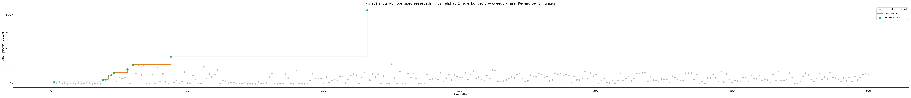
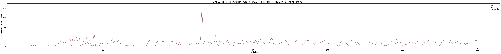

# Experiment: gs_sc2_mcts_v1__obs_spec_presetrich__mc2__alpha0.1__idle_bonus0.5

**Game:** StarCraft 2

## Timings

- **Start:** 2026-05-06 08:04:59
- **End:** 2026-05-06 08:14:21
- **Total runtime:** 9m 21.8s

| Phase | Duration |
|-------|----------|
| Greedy | 9m 20.8s |

## Run Parameters

### Training

| Parameter | Value |
|-----------|-------|
| track | sc2_DefeatRoaches |
| obs_spec_preset | rich |
| enable_belief | False |
| map_name | DefeatRoaches |
| in_game_episode_s | 120.0 |
| step_mul | 8 |
| screen_size | 64 |
| minimap_size | 64 |
| agent_race | random |
| n_sims | 300 |
| policy_type | mcts |
| mcts_c | 2.0 |
| alpha | 0.1 |
| policy_params | {'n_bins': 3, 'gamma': 0.99, 'alpha': 0.1, 'c': 2.0} |

### Reward Config

| Parameter | Value |
|-----------|-------|
| score_weight | 0.5 |
| win_bonus | 0.0 |
| loss_penalty | 0.0 |
| step_penalty | -0.001 |
| idle_penalty | 0.0 |
| idle_bonus | 0.5 |
| economy_weight | 0.0 |

## Greedy Phase

Best reward: **+854.6**

| Sim  | Reward   | Progress | Finish Time | Mean abs lat | Reason       | Result       |
|------|----------|----------|-------------|--------------|--------------|-------------|
|    1 |    +19.1 | 0.000    | —           | —       | finish       | **NEW BEST** |
|    2 |     +2.5 | 0.000    | —           | —       | finish       |  |
|    3 |    +19.0 | 0.000    | —           | —       | finish       |  |
|    4 |     -5.6 | 0.000    | —           | —       | finish       |  |
|    5 |     +6.6 | 0.000    | —           | —       | finish       |  |
|    6 |     -5.0 | 0.000    | —           | —       | finish       |  |
|    7 |     -2.0 | 0.000    | —           | —       | finish       |  |
|    8 |     -5.0 | 0.000    | —           | —       | finish       |  |
|    9 |     -5.4 | 0.000    | —           | —       | finish       |  |
|   10 |     +3.1 | 0.000    | —           | —       | finish       |  |
|   11 |     -4.8 | 0.000    | —           | —       | finish       |  |
|   12 |     -5.4 | 0.000    | —           | —       | finish       |  |
|   13 |    +14.0 | 0.000    | —           | —       | finish       |  |
|   14 |     +2.5 | 0.000    | —           | —       | finish       |  |
|   15 |     -5.8 | 0.000    | —           | —       | finish       |  |
|   16 |     -5.3 | 0.000    | —           | —       | finish       |  |
|   17 |     -1.1 | 0.000    | —           | —       | finish       |  |
|   18 |     -4.9 | 0.000    | —           | —       | finish       |  |
|   19 |    +46.7 | 0.000    | —           | —       | finish       | **NEW BEST** |
|   20 |    +39.1 | 0.000    | —           | —       | finish       |  |
|   21 |    +84.1 | 0.000    | —           | —       | finish       | **NEW BEST** |
|   22 |   +100.0 | 0.000    | —           | —       | finish       | **NEW BEST** |
|   23 |   +126.7 | 0.000    | —           | —       | finish       | **NEW BEST** |
|   24 |    +22.8 | 0.000    | —           | —       | finish       |  |
|   25 |    +70.8 | 0.000    | —           | —       | finish       |  |
|   26 |    +52.0 | 0.000    | —           | —       | finish       |  |
|   27 |    +67.0 | 0.000    | —           | —       | finish       |  |
|   28 |   +168.0 | 0.000    | —           | —       | finish       | **NEW BEST** |
|   29 |     -1.9 | 0.000    | —           | —       | finish       |  |
|   30 |   +221.0 | 0.000    | —           | —       | finish       | **NEW BEST** |
|   31 |   +116.0 | 0.000    | —           | —       | finish       |  |
|   32 |   +213.0 | 0.000    | —           | —       | finish       |  |
|   33 |    +98.6 | 0.000    | —           | —       | finish       |  |
|   34 |   +213.0 | 0.000    | —           | —       | finish       |  |
|   35 |     -1.9 | 0.000    | —           | —       | finish       |  |
|   36 |     -1.9 | 0.000    | —           | —       | finish       |  |
|   37 |    +99.0 | 0.000    | —           | —       | finish       |  |
|   38 |     -1.9 | 0.000    | —           | —       | finish       |  |
|   39 |   +185.1 | 0.000    | —           | —       | finish       |  |
|   40 |    +21.1 | 0.000    | —           | —       | finish       |  |
|   41 |   +110.9 | 0.000    | —           | —       | finish       |  |
|   42 |    +18.1 | 0.000    | —           | —       | finish       |  |
|   43 |     -1.9 | 0.000    | —           | —       | finish       |  |
|   44 |   +316.9 | 0.000    | —           | —       | finish       | **NEW BEST** |
|   45 |    +14.6 | 0.000    | —           | —       | finish       |  |
|   46 |    +36.1 | 0.000    | —           | —       | finish       |  |
|   47 |     -1.9 | 0.000    | —           | —       | finish       |  |
|   48 |    +20.1 | 0.000    | —           | —       | finish       |  |
|   49 |   +132.2 | 0.000    | —           | —       | finish       |  |
|   50 |     +6.1 | 0.000    | —           | —       | finish       |  |
|   51 |     -1.9 | 0.000    | —           | —       | finish       |  |
|   52 |    +95.1 | 0.000    | —           | —       | finish       |  |
|   53 |    +48.2 | 0.000    | —           | —       | finish       |  |
|   54 |     -1.9 | 0.000    | —           | —       | finish       |  |
|   55 |     -1.9 | 0.000    | —           | —       | finish       |  |
|   56 |   +193.0 | 0.000    | —           | —       | finish       |  |
|   57 |    +59.1 | 0.000    | —           | —       | finish       |  |
|   58 |   +108.1 | 0.000    | —           | —       | finish       |  |
|   59 |    +75.1 | 0.000    | —           | —       | finish       |  |
|   60 |   +104.1 | 0.000    | —           | —       | finish       |  |
|   61 |   +156.1 | 0.000    | —           | —       | finish       |  |
|   62 |     -1.9 | 0.000    | —           | —       | finish       |  |
|   63 |    +35.1 | 0.000    | —           | —       | finish       |  |
|   64 |    +23.1 | 0.000    | —           | —       | finish       |  |
|   65 |     +3.0 | 0.000    | —           | —       | finish       |  |
|   66 |     +7.1 | 0.000    | —           | —       | finish       |  |
|   67 |    +10.5 | 0.000    | —           | —       | finish       |  |
|   68 |     -0.9 | 0.000    | —           | —       | finish       |  |
|   69 |     -2.0 | 0.000    | —           | —       | finish       |  |
|   70 |     +2.9 | 0.000    | —           | —       | finish       |  |
|   71 |    +10.8 | 0.000    | —           | —       | finish       |  |
|   72 |     -5.3 | 0.000    | —           | —       | finish       |  |
|   73 |     -5.1 | 0.000    | —           | —       | finish       |  |
|   74 |     -5.0 | 0.000    | —           | —       | finish       |  |
|   75 |     -4.9 | 0.000    | —           | —       | finish       |  |
|   76 |    +19.1 | 0.000    | —           | —       | finish       |  |
|   77 |     -5.1 | 0.000    | —           | —       | finish       |  |
|   78 |     -1.6 | 0.000    | —           | —       | finish       |  |
|   79 |     +6.9 | 0.000    | —           | —       | finish       |  |
|   80 |    +74.6 | 0.000    | —           | —       | finish       |  |
|   81 |   +114.9 | 0.000    | —           | —       | finish       |  |
|   82 |     -1.9 | 0.000    | —           | —       | finish       |  |
|   83 |     -5.0 | 0.000    | —           | —       | finish       |  |
|   84 |     +3.1 | 0.000    | —           | —       | finish       |  |
|   85 |     -0.9 | 0.000    | —           | —       | finish       |  |
|   86 |   +112.1 | 0.000    | —           | —       | finish       |  |
|   87 |    +60.6 | 0.000    | —           | —       | finish       |  |
|   88 |     -5.1 | 0.000    | —           | —       | finish       |  |
|   89 |     -5.1 | 0.000    | —           | —       | finish       |  |
|   90 |   +150.1 | 0.000    | —           | —       | finish       |  |
|   91 |     -1.9 | 0.000    | —           | —       | finish       |  |
|   92 |     -1.9 | 0.000    | —           | —       | finish       |  |
|   93 |     -4.9 | 0.000    | —           | —       | finish       |  |
|   94 |     -1.9 | 0.000    | —           | —       | finish       |  |
|   95 |    +34.7 | 0.000    | —           | —       | finish       |  |
|   96 |   +111.9 | 0.000    | —           | —       | finish       |  |
|   97 |    +58.7 | 0.000    | —           | —       | finish       |  |
|   98 |    +54.9 | 0.000    | —           | —       | finish       |  |
|   99 |    +55.9 | 0.000    | —           | —       | finish       |  |
|  100 |     -1.9 | 0.000    | —           | —       | finish       |  |
|  101 |    +74.6 | 0.000    | —           | —       | finish       |  |
|  102 |     +7.2 | 0.000    | —           | —       | finish       |  |
|  103 |    +34.9 | 0.000    | —           | —       | finish       |  |
|  104 |    +47.6 | 0.000    | —           | —       | finish       |  |
|  105 |    +35.1 | 0.000    | —           | —       | finish       |  |
|  106 |    +79.8 | 0.000    | —           | —       | finish       |  |
|  107 |    +79.1 | 0.000    | —           | —       | finish       |  |
|  108 |     +2.9 | 0.000    | —           | —       | finish       |  |
|  109 |    +43.0 | 0.000    | —           | —       | finish       |  |
|  110 |    +94.8 | 0.000    | —           | —       | finish       |  |
|  111 |   +107.0 | 0.000    | —           | —       | finish       |  |
|  112 |    +96.0 | 0.000    | —           | —       | finish       |  |
|  113 |     -1.9 | 0.000    | —           | —       | finish       |  |
|  114 |    +71.7 | 0.000    | —           | —       | finish       |  |
|  115 |   +124.8 | 0.000    | —           | —       | finish       |  |
|  116 |   +854.6 | 0.000    | —           | —       | finish       | **NEW BEST** |
|  117 |    +39.1 | 0.000    | —           | —       | finish       |  |
|  118 |   +111.1 | 0.000    | —           | —       | finish       |  |
|  119 |    +74.9 | 0.000    | —           | —       | finish       |  |
|  120 |   +107.1 | 0.000    | —           | —       | finish       |  |
|  121 |     -1.9 | 0.000    | —           | —       | finish       |  |
|  122 |    +87.1 | 0.000    | —           | —       | finish       |  |
|  123 |     -1.9 | 0.000    | —           | —       | finish       |  |
|  124 |     -1.9 | 0.000    | —           | —       | finish       |  |
|  125 |   +223.8 | 0.000    | —           | —       | finish       |  |
|  126 |    +59.9 | 0.000    | —           | —       | finish       |  |
|  127 |     -1.9 | 0.000    | —           | —       | finish       |  |
|  128 |   +135.1 | 0.000    | —           | —       | finish       |  |
|  129 |     -1.9 | 0.000    | —           | —       | finish       |  |
|  130 |     -1.9 | 0.000    | —           | —       | finish       |  |
|  131 |   +112.0 | 0.000    | —           | —       | finish       |  |
|  132 |    +67.1 | 0.000    | —           | —       | finish       |  |
|  133 |   +115.1 | 0.000    | —           | —       | finish       |  |
|  134 |    +55.2 | 0.000    | —           | —       | finish       |  |
|  135 |     -1.9 | 0.000    | —           | —       | finish       |  |
|  136 |     -1.9 | 0.000    | —           | —       | finish       |  |
|  137 |     -1.9 | 0.000    | —           | —       | finish       |  |
|  138 |   +102.9 | 0.000    | —           | —       | finish       |  |
|  139 |    +43.1 | 0.000    | —           | —       | finish       |  |
|  140 |    +52.2 | 0.000    | —           | —       | finish       |  |
|  141 |    +56.1 | 0.000    | —           | —       | finish       |  |
|  142 |    +47.2 | 0.000    | —           | —       | finish       |  |
|  143 |   +123.0 | 0.000    | —           | —       | finish       |  |
|  144 |    +19.9 | 0.000    | —           | —       | finish       |  |
|  145 |    +60.2 | 0.000    | —           | —       | finish       |  |
|  146 |   +103.1 | 0.000    | —           | —       | finish       |  |
|  147 |    +39.9 | 0.000    | —           | —       | finish       |  |
|  148 |    +99.2 | 0.000    | —           | —       | finish       |  |
|  149 |    +83.2 | 0.000    | —           | —       | finish       |  |
|  150 |    +71.1 | 0.000    | —           | —       | finish       |  |
|  151 |    +68.1 | 0.000    | —           | —       | finish       |  |
|  152 |   +123.1 | 0.000    | —           | —       | finish       |  |
|  153 |    +43.9 | 0.000    | —           | —       | finish       |  |
|  154 |   +103.1 | 0.000    | —           | —       | finish       |  |
|  155 |   +147.0 | 0.000    | —           | —       | finish       |  |
|  156 |    +60.1 | 0.000    | —           | —       | finish       |  |
|  157 |    +75.2 | 0.000    | —           | —       | finish       |  |
|  158 |    +44.1 | 0.000    | —           | —       | finish       |  |
|  159 |    +35.9 | 0.000    | —           | —       | finish       |  |
|  160 |    +91.2 | 0.000    | —           | —       | finish       |  |
|  161 |    +55.1 | 0.000    | —           | —       | finish       |  |
|  162 |   +155.1 | 0.000    | —           | —       | finish       |  |
|  163 |   +151.1 | 0.000    | —           | —       | finish       |  |
|  164 |    +19.6 | 0.000    | —           | —       | finish       |  |
|  165 |    +24.1 | 0.000    | —           | —       | finish       |  |
|  166 |    +31.1 | 0.000    | —           | —       | finish       |  |
|  167 |    +40.0 | 0.000    | —           | —       | finish       |  |
|  168 |    +56.2 | 0.000    | —           | —       | finish       |  |
|  169 |    +76.2 | 0.000    | —           | —       | finish       |  |
|  170 |    +64.0 | 0.000    | —           | —       | finish       |  |
|  171 |   +107.1 | 0.000    | —           | —       | finish       |  |
|  172 |   +116.1 | 0.000    | —           | —       | finish       |  |
|  173 |    +59.1 | 0.000    | —           | —       | finish       |  |
|  174 |    +23.9 | 0.000    | —           | —       | finish       |  |
|  175 |    +28.6 | 0.000    | —           | —       | finish       |  |
|  176 |    +96.1 | 0.000    | —           | —       | finish       |  |
|  177 |    +80.1 | 0.000    | —           | —       | finish       |  |
|  178 |    +76.1 | 0.000    | —           | —       | finish       |  |
|  179 |   +115.1 | 0.000    | —           | —       | finish       |  |
|  180 |   +103.1 | 0.000    | —           | —       | finish       |  |
|  181 |    +68.1 | 0.000    | —           | —       | finish       |  |
|  182 |    +79.1 | 0.000    | —           | —       | finish       |  |
|  183 |    +27.6 | 0.000    | —           | —       | finish       |  |
|  184 |    +39.2 | 0.000    | —           | —       | finish       |  |
|  185 |   +115.1 | 0.000    | —           | —       | finish       |  |
|  186 |   +107.1 | 0.000    | —           | —       | finish       |  |
|  187 |   +115.1 | 0.000    | —           | —       | finish       |  |
|  188 |    +95.1 | 0.000    | —           | —       | finish       |  |
|  189 |   +107.1 | 0.000    | —           | —       | finish       |  |
|  190 |    +95.1 | 0.000    | —           | —       | finish       |  |
|  191 |    +12.6 | 0.000    | —           | —       | finish       |  |
|  192 |    +80.1 | 0.000    | —           | —       | finish       |  |
|  193 |    +40.1 | 0.000    | —           | —       | finish       |  |
|  194 |    +39.9 | 0.000    | —           | —       | finish       |  |
|  195 |    +56.1 | 0.000    | —           | —       | finish       |  |
|  196 |   +139.1 | 0.000    | —           | —       | finish       |  |
|  197 |    +52.1 | 0.000    | —           | —       | finish       |  |
|  198 |   +119.0 | 0.000    | —           | —       | finish       |  |
|  199 |    +84.0 | 0.000    | —           | —       | finish       |  |
|  200 |   +108.0 | 0.000    | —           | —       | finish       |  |
|  201 |     -1.9 | 0.000    | —           | —       | finish       |  |
|  202 |    +31.9 | 0.000    | —           | —       | finish       |  |
|  203 |    +52.1 | 0.000    | —           | —       | finish       |  |
|  204 |    +12.1 | 0.000    | —           | —       | finish       |  |
|  205 |     +5.1 | 0.000    | —           | —       | finish       |  |
|  206 |    +33.1 | 0.000    | —           | —       | finish       |  |
|  207 |     -0.5 | 0.000    | —           | —       | finish       |  |
|  208 |    +34.0 | 0.000    | —           | —       | finish       |  |
|  209 |   +115.1 | 0.000    | —           | —       | finish       |  |
|  210 |    +32.0 | 0.000    | —           | —       | finish       |  |
|  211 |    +60.2 | 0.000    | —           | —       | finish       |  |
|  212 |    +79.1 | 0.000    | —           | —       | finish       |  |
|  213 |    +28.2 | 0.000    | —           | —       | finish       |  |
|  214 |    +57.9 | 0.000    | —           | —       | finish       |  |
|  215 |   +118.8 | 0.000    | —           | —       | finish       |  |
|  216 |   +116.0 | 0.000    | —           | —       | finish       |  |
|  217 |   +123.1 | 0.000    | —           | —       | finish       |  |
|  218 |   +123.0 | 0.000    | —           | —       | finish       |  |
|  219 |    +24.0 | 0.000    | —           | —       | finish       |  |
|  220 |    +79.2 | 0.000    | —           | —       | finish       |  |
|  221 |    +37.9 | 0.000    | —           | —       | finish       |  |
|  222 |    +36.1 | 0.000    | —           | —       | finish       |  |
|  223 |    +19.6 | 0.000    | —           | —       | finish       |  |
|  224 |    +51.6 | 0.000    | —           | —       | finish       |  |
|  225 |    +44.2 | 0.000    | —           | —       | finish       |  |
|  226 |    +48.1 | 0.000    | —           | —       | finish       |  |
|  227 |     +9.0 | 0.000    | —           | —       | finish       |  |
|  228 |    +83.1 | 0.000    | —           | —       | finish       |  |
|  229 |    +70.1 | 0.000    | —           | —       | finish       |  |
|  230 |    +48.1 | 0.000    | —           | —       | finish       |  |
|  231 |    +36.1 | 0.000    | —           | —       | finish       |  |
|  232 |    +32.1 | 0.000    | —           | —       | finish       |  |
|  233 |   +119.8 | 0.000    | —           | —       | finish       |  |
|  234 |   +119.1 | 0.000    | —           | —       | finish       |  |
|  235 |   +119.0 | 0.000    | —           | —       | finish       |  |
|  236 |    +48.1 | 0.000    | —           | —       | finish       |  |
|  237 |   +103.2 | 0.000    | —           | —       | finish       |  |
|  238 |     -1.9 | 0.000    | —           | —       | finish       |  |
|  239 |    +21.1 | 0.000    | —           | —       | finish       |  |
|  240 |     -2.4 | 0.000    | —           | —       | finish       |  |
|  241 |    +64.0 | 0.000    | —           | —       | finish       |  |
|  242 |    +64.2 | 0.000    | —           | —       | finish       |  |
|  243 |   +107.1 | 0.000    | —           | —       | finish       |  |
|  244 |    +64.0 | 0.000    | —           | —       | finish       |  |
|  245 |    +22.8 | 0.000    | —           | —       | finish       |  |
|  246 |   +139.0 | 0.000    | —           | —       | finish       |  |
|  247 |    +16.1 | 0.000    | —           | —       | finish       |  |
|  248 |   +111.1 | 0.000    | —           | —       | finish       |  |
|  249 |    +48.1 | 0.000    | —           | —       | finish       |  |
|  250 |     +9.1 | 0.000    | —           | —       | finish       |  |
|  251 |    +33.0 | 0.000    | —           | —       | finish       |  |
|  252 |    +28.1 | 0.000    | —           | —       | finish       |  |
|  253 |    +24.6 | 0.000    | —           | —       | finish       |  |
|  254 |    +68.2 | 0.000    | —           | —       | finish       |  |
|  255 |    +71.2 | 0.000    | —           | —       | finish       |  |
|  256 |    +21.6 | 0.000    | —           | —       | finish       |  |
|  257 |    +95.1 | 0.000    | —           | —       | finish       |  |
|  258 |    +59.7 | 0.000    | —           | —       | finish       |  |
|  259 |    +51.9 | 0.000    | —           | —       | finish       |  |
|  260 |    +95.1 | 0.000    | —           | —       | finish       |  |
|  261 |    +36.1 | 0.000    | —           | —       | finish       |  |
|  262 |    +43.7 | 0.000    | —           | —       | finish       |  |
|  263 |    +39.8 | 0.000    | —           | —       | finish       |  |
|  264 |    +13.1 | 0.000    | —           | —       | finish       |  |
|  265 |    +99.1 | 0.000    | —           | —       | finish       |  |
|  266 |    +36.1 | 0.000    | —           | —       | finish       |  |
|  267 |   +138.9 | 0.000    | —           | —       | finish       |  |
|  268 |    +32.1 | 0.000    | —           | —       | finish       |  |
|  269 |    +35.9 | 0.000    | —           | —       | finish       |  |
|  270 |    +44.2 | 0.000    | —           | —       | finish       |  |
|  271 |   +120.0 | 0.000    | —           | —       | finish       |  |
|  272 |    +72.0 | 0.000    | —           | —       | finish       |  |
|  273 |     -1.9 | 0.000    | —           | —       | finish       |  |
|  274 |     -1.9 | 0.000    | —           | —       | finish       |  |
|  275 |    +19.8 | 0.000    | —           | —       | finish       |  |
|  276 |    +76.1 | 0.000    | —           | —       | finish       |  |
|  277 |   +119.1 | 0.000    | —           | —       | finish       |  |
|  278 |    +99.1 | 0.000    | —           | —       | finish       |  |
|  279 |    +48.1 | 0.000    | —           | —       | finish       |  |
|  280 |    +24.9 | 0.000    | —           | —       | finish       |  |
|  281 |    +56.1 | 0.000    | —           | —       | finish       |  |
|  282 |   +115.0 | 0.000    | —           | —       | finish       |  |
|  283 |    +41.0 | 0.000    | —           | —       | finish       |  |
|  284 |    +75.0 | 0.000    | —           | —       | finish       |  |
|  285 |    +52.1 | 0.000    | —           | —       | finish       |  |
|  286 |   +127.0 | 0.000    | —           | —       | finish       |  |
|  287 |    +67.0 | 0.000    | —           | —       | finish       |  |
|  288 |    +60.1 | 0.000    | —           | —       | finish       |  |
|  289 |    +48.1 | 0.000    | —           | —       | finish       |  |
|  290 |    +23.3 | 0.000    | —           | —       | finish       |  |
|  291 |    +63.7 | 0.000    | —           | —       | finish       |  |
|  292 |    +27.6 | 0.000    | —           | —       | finish       |  |
|  293 |    +68.1 | 0.000    | —           | —       | finish       |  |
|  294 |    +25.0 | 0.000    | —           | —       | finish       |  |
|  295 |    +80.1 | 0.000    | —           | —       | finish       |  |
|  296 |    +40.1 | 0.000    | —           | —       | finish       |  |
|  297 |    +67.1 | 0.000    | —           | —       | finish       |  |
|  298 |   +107.1 | 0.000    | —           | —       | finish       |  |
|  299 |   +115.0 | 0.000    | —           | —       | finish       |  |
|  300 |   +103.8 | 0.000    | —           | —       | finish       |  |

