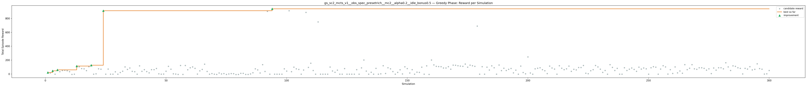
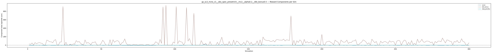
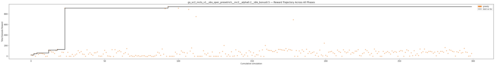

# Experiment: gs_sc2_mcts_v1__obs_spec_presetrich__mc2__alpha0.2__idle_bonus0.5

**Game:** StarCraft 2

## Timings

- **Start:** 2026-05-06 08:32:53
- **End:** 2026-05-06 08:41:49
- **Total runtime:** 8m 56.2s

| Phase | Duration |
|-------|----------|
| Greedy | 8m 55.2s |

## Run Parameters

### Training

| Parameter | Value |
|-----------|-------|
| track | sc2_DefeatRoaches |
| obs_spec_preset | rich |
| enable_belief | False |
| map_name | DefeatRoaches |
| in_game_episode_s | 120.0 |
| step_mul | 8 |
| screen_size | 64 |
| minimap_size | 64 |
| agent_race | random |
| n_sims | 300 |
| policy_type | mcts |
| mcts_c | 2.0 |
| alpha | 0.2 |
| policy_params | {'n_bins': 3, 'gamma': 0.99, 'alpha': 0.2, 'c': 2.0} |

### Reward Config

| Parameter | Value |
|-----------|-------|
| score_weight | 0.5 |
| win_bonus | 0.0 |
| loss_penalty | 0.0 |
| step_penalty | -0.001 |
| idle_penalty | 0.0 |
| idle_bonus | 0.5 |
| economy_weight | 0.0 |

## Greedy Phase

Best reward: **+938.1**

| Sim  | Reward   | Progress | Finish Time | Mean abs lat | Reason       | Result       |
|------|----------|----------|-------------|--------------|--------------|-------------|
|    1 |    +22.4 | 0.000    | —           | —       | finish       | **NEW BEST** |
|    2 |    +15.0 | 0.000    | —           | —       | finish       |  |
|    3 |    +47.1 | 0.000    | —           | —       | finish       | **NEW BEST** |
|    4 |     -1.3 | 0.000    | —           | —       | finish       |  |
|    5 |    +60.1 | 0.000    | —           | —       | finish       | **NEW BEST** |
|    6 |    +34.7 | 0.000    | —           | —       | finish       |  |
|    7 |    +52.1 | 0.000    | —           | —       | finish       |  |
|    8 |    +55.0 | 0.000    | —           | —       | finish       |  |
|    9 |    +47.8 | 0.000    | —           | —       | finish       |  |
|   10 |    +35.1 | 0.000    | —           | —       | finish       |  |
|   11 |     -4.9 | 0.000    | —           | —       | finish       |  |
|   12 |     -1.2 | 0.000    | —           | —       | finish       |  |
|   13 |   +114.6 | 0.000    | —           | —       | finish       | **NEW BEST** |
|   14 |   +104.0 | 0.000    | —           | —       | finish       |  |
|   15 |    +79.7 | 0.000    | —           | —       | finish       |  |
|   16 |    +74.9 | 0.000    | —           | —       | finish       |  |
|   17 |    +50.6 | 0.000    | —           | —       | finish       |  |
|   18 |   +107.0 | 0.000    | —           | —       | finish       |  |
|   19 |   +127.0 | 0.000    | —           | —       | finish       | **NEW BEST** |
|   20 |     -1.9 | 0.000    | —           | —       | finish       |  |
|   21 |     +3.0 | 0.000    | —           | —       | finish       |  |
|   22 |    +75.1 | 0.000    | —           | —       | finish       |  |
|   23 |    +71.1 | 0.000    | —           | —       | finish       |  |
|   24 |   +910.1 | 0.000    | —           | —       | finish       | **NEW BEST** |
|   25 |     -1.9 | 0.000    | —           | —       | finish       |  |
|   26 |    +72.8 | 0.000    | —           | —       | finish       |  |
|   27 |     -1.9 | 0.000    | —           | —       | finish       |  |
|   28 |     -1.9 | 0.000    | —           | —       | finish       |  |
|   29 |    +33.5 | 0.000    | —           | —       | finish       |  |
|   30 |     -1.9 | 0.000    | —           | —       | finish       |  |
|   31 |    +22.6 | 0.000    | —           | —       | finish       |  |
|   32 |    +41.5 | 0.000    | —           | —       | finish       |  |
|   33 |   +103.1 | 0.000    | —           | —       | finish       |  |
|   34 |    +67.2 | 0.000    | —           | —       | finish       |  |
|   35 |    +88.0 | 0.000    | —           | —       | finish       |  |
|   36 |    +40.0 | 0.000    | —           | —       | finish       |  |
|   37 |    +33.9 | 0.000    | —           | —       | finish       |  |
|   38 |     -1.9 | 0.000    | —           | —       | finish       |  |
|   39 |   +119.1 | 0.000    | —           | —       | finish       |  |
|   40 |    +39.1 | 0.000    | —           | —       | finish       |  |
|   41 |    +64.1 | 0.000    | —           | —       | finish       |  |
|   42 |    +36.6 | 0.000    | —           | —       | finish       |  |
|   43 |    +17.0 | 0.000    | —           | —       | finish       |  |
|   44 |    +63.2 | 0.000    | —           | —       | finish       |  |
|   45 |    +64.0 | 0.000    | —           | —       | finish       |  |
|   46 |    +80.0 | 0.000    | —           | —       | finish       |  |
|   47 |     +3.1 | 0.000    | —           | —       | finish       |  |
|   48 |     -1.9 | 0.000    | —           | —       | finish       |  |
|   49 |     +0.1 | 0.000    | —           | —       | finish       |  |
|   50 |    +41.1 | 0.000    | —           | —       | finish       |  |
|   51 |   +111.1 | 0.000    | —           | —       | finish       |  |
|   52 |    +71.1 | 0.000    | —           | —       | finish       |  |
|   53 |     +4.1 | 0.000    | —           | —       | finish       |  |
|   54 |     +0.1 | 0.000    | —           | —       | finish       |  |
|   55 |     -4.9 | 0.000    | —           | —       | finish       |  |
|   56 |   +123.0 | 0.000    | —           | —       | finish       |  |
|   57 |     -5.4 | 0.000    | —           | —       | finish       |  |
|   58 |   +123.0 | 0.000    | —           | —       | finish       |  |
|   59 |    +62.5 | 0.000    | —           | —       | finish       |  |
|   60 |    +91.2 | 0.000    | —           | —       | finish       |  |
|   61 |   +103.1 | 0.000    | —           | —       | finish       |  |
|   62 |    +83.1 | 0.000    | —           | —       | finish       |  |
|   63 |     +0.1 | 0.000    | —           | —       | finish       |  |
|   64 |    +47.1 | 0.000    | —           | —       | finish       |  |
|   65 |    +67.1 | 0.000    | —           | —       | finish       |  |
|   66 |   +142.9 | 0.000    | —           | —       | finish       |  |
|   67 |    +38.4 | 0.000    | —           | —       | finish       |  |
|   68 |     -0.9 | 0.000    | —           | —       | finish       |  |
|   69 |     +7.1 | 0.000    | —           | —       | finish       |  |
|   70 |     -1.6 | 0.000    | —           | —       | finish       |  |
|   71 |     -4.8 | 0.000    | —           | —       | finish       |  |
|   72 |    +15.1 | 0.000    | —           | —       | finish       |  |
|   73 |     +2.2 | 0.000    | —           | —       | finish       |  |
|   74 |     +6.8 | 0.000    | —           | —       | finish       |  |
|   75 |     -5.1 | 0.000    | —           | —       | finish       |  |
|   76 |     +2.6 | 0.000    | —           | —       | finish       |  |
|   77 |     +6.7 | 0.000    | —           | —       | finish       |  |
|   78 |     +6.1 | 0.000    | —           | —       | finish       |  |
|   79 |     -5.7 | 0.000    | —           | —       | finish       |  |
|   80 |     -5.3 | 0.000    | —           | —       | finish       |  |
|   81 |    +11.0 | 0.000    | —           | —       | finish       |  |
|   82 |    +10.2 | 0.000    | —           | —       | finish       |  |
|   83 |     -5.0 | 0.000    | —           | —       | finish       |  |
|   84 |     -5.0 | 0.000    | —           | —       | finish       |  |
|   85 |     +1.7 | 0.000    | —           | —       | finish       |  |
|   86 |    +18.7 | 0.000    | —           | —       | finish       |  |
|   87 |    +74.9 | 0.000    | —           | —       | finish       |  |
|   88 |    +59.8 | 0.000    | —           | —       | finish       |  |
|   89 |    +15.5 | 0.000    | —           | —       | finish       |  |
|   90 |   +135.8 | 0.000    | —           | —       | finish       |  |
|   91 |    +38.0 | 0.000    | —           | —       | finish       |  |
|   92 |   +902.1 | 0.000    | —           | —       | finish       |  |
|   93 |     -1.9 | 0.000    | —           | —       | finish       |  |
|   94 |   +938.1 | 0.000    | —           | —       | finish       | **NEW BEST** |
|   95 |     -1.9 | 0.000    | —           | —       | finish       |  |
|   96 |     -1.9 | 0.000    | —           | —       | finish       |  |
|   97 |     -1.9 | 0.000    | —           | —       | finish       |  |
|   98 |     -1.9 | 0.000    | —           | —       | finish       |  |
|   99 |    +75.9 | 0.000    | —           | —       | finish       |  |
|  100 |    +43.1 | 0.000    | —           | —       | finish       |  |
|  101 |   +910.1 | 0.000    | —           | —       | finish       |  |
|  102 |    +35.0 | 0.000    | —           | —       | finish       |  |
|  103 |    +99.1 | 0.000    | —           | —       | finish       |  |
|  104 |    +75.1 | 0.000    | —           | —       | finish       |  |
|  105 |    +67.0 | 0.000    | —           | —       | finish       |  |
|  106 |     -1.9 | 0.000    | —           | —       | finish       |  |
|  107 |    +59.2 | 0.000    | —           | —       | finish       |  |
|  108 |   +886.1 | 0.000    | —           | —       | finish       |  |
|  109 |    +96.1 | 0.000    | —           | —       | finish       |  |
|  110 |   +155.8 | 0.000    | —           | —       | finish       |  |
|  111 |    +51.2 | 0.000    | —           | —       | finish       |  |
|  112 |     -1.9 | 0.000    | —           | —       | finish       |  |
|  113 |   +750.1 | 0.000    | —           | —       | finish       |  |
|  114 |     -1.9 | 0.000    | —           | —       | finish       |  |
|  115 |     -1.9 | 0.000    | —           | —       | finish       |  |
|  116 |     -1.9 | 0.000    | —           | —       | finish       |  |
|  117 |     -1.9 | 0.000    | —           | —       | finish       |  |
|  118 |   +102.2 | 0.000    | —           | —       | finish       |  |
|  119 |    +44.5 | 0.000    | —           | —       | finish       |  |
|  120 |    +25.2 | 0.000    | —           | —       | finish       |  |
|  121 |    +56.1 | 0.000    | —           | —       | finish       |  |
|  122 |     -1.9 | 0.000    | —           | —       | finish       |  |
|  123 |     -1.9 | 0.000    | —           | —       | finish       |  |
|  124 |    +79.2 | 0.000    | —           | —       | finish       |  |
|  125 |     -1.9 | 0.000    | —           | —       | finish       |  |
|  126 |     -1.9 | 0.000    | —           | —       | finish       |  |
|  127 |     -1.9 | 0.000    | —           | —       | finish       |  |
|  128 |     -1.9 | 0.000    | —           | —       | finish       |  |
|  129 |    +63.2 | 0.000    | —           | —       | finish       |  |
|  130 |     -1.9 | 0.000    | —           | —       | finish       |  |
|  131 |    +90.2 | 0.000    | —           | —       | finish       |  |
|  132 |   +202.6 | 0.000    | —           | —       | finish       |  |
|  133 |    +43.6 | 0.000    | —           | —       | finish       |  |
|  134 |     -1.9 | 0.000    | —           | —       | finish       |  |
|  135 |    +26.1 | 0.000    | —           | —       | finish       |  |
|  136 |     -1.9 | 0.000    | —           | —       | finish       |  |
|  137 |    +83.1 | 0.000    | —           | —       | finish       |  |
|  138 |     -1.9 | 0.000    | —           | —       | finish       |  |
|  139 |     +3.2 | 0.000    | —           | —       | finish       |  |
|  140 |   +120.0 | 0.000    | —           | —       | finish       |  |
|  141 |     +9.1 | 0.000    | —           | —       | finish       |  |
|  142 |    +91.1 | 0.000    | —           | —       | finish       |  |
|  143 |    +75.1 | 0.000    | —           | —       | finish       |  |
|  144 |    +36.1 | 0.000    | —           | —       | finish       |  |
|  145 |     -1.9 | 0.000    | —           | —       | finish       |  |
|  146 |    +23.9 | 0.000    | —           | —       | finish       |  |
|  147 |    +62.3 | 0.000    | —           | —       | finish       |  |
|  148 |     +2.1 | 0.000    | —           | —       | finish       |  |
|  149 |   +104.1 | 0.000    | —           | —       | finish       |  |
|  150 |    +79.7 | 0.000    | —           | —       | finish       |  |
|  151 |    +15.8 | 0.000    | —           | —       | finish       |  |
|  152 |    +63.1 | 0.000    | —           | —       | finish       |  |
|  153 |     -1.9 | 0.000    | —           | —       | finish       |  |
|  154 |    +27.7 | 0.000    | —           | —       | finish       |  |
|  155 |    +23.9 | 0.000    | —           | —       | finish       |  |
|  156 |    +99.9 | 0.000    | —           | —       | finish       |  |
|  157 |     -1.9 | 0.000    | —           | —       | finish       |  |
|  158 |   +119.1 | 0.000    | —           | —       | finish       |  |
|  159 |     -4.9 | 0.000    | —           | —       | finish       |  |
|  160 |   +202.1 | 0.000    | —           | —       | finish       |  |
|  161 |   +131.6 | 0.000    | —           | —       | finish       |  |
|  162 |   +111.1 | 0.000    | —           | —       | finish       |  |
|  163 |   +108.0 | 0.000    | —           | —       | finish       |  |
|  164 |   +107.0 | 0.000    | —           | —       | finish       |  |
|  165 |    +87.6 | 0.000    | —           | —       | finish       |  |
|  166 |    +88.0 | 0.000    | —           | —       | finish       |  |
|  167 |   +107.0 | 0.000    | —           | —       | finish       |  |
|  168 |    +71.2 | 0.000    | —           | —       | finish       |  |
|  169 |   +128.0 | 0.000    | —           | —       | finish       |  |
|  170 |   +127.1 | 0.000    | —           | —       | finish       |  |
|  171 |   +120.0 | 0.000    | —           | —       | finish       |  |
|  172 |   +115.1 | 0.000    | —           | —       | finish       |  |
|  173 |   +111.0 | 0.000    | —           | —       | finish       |  |
|  174 |   +143.6 | 0.000    | —           | —       | finish       |  |
|  175 |   +100.1 | 0.000    | —           | —       | finish       |  |
|  176 |   +128.0 | 0.000    | —           | —       | finish       |  |
|  177 |   +120.0 | 0.000    | —           | —       | finish       |  |
|  178 |   +112.2 | 0.000    | —           | —       | finish       |  |
|  179 |   +690.1 | 0.000    | —           | —       | finish       |  |
|  180 |     -1.9 | 0.000    | —           | —       | finish       |  |
|  181 |   +107.1 | 0.000    | —           | —       | finish       |  |
|  182 |     -1.9 | 0.000    | —           | —       | finish       |  |
|  183 |    +99.1 | 0.000    | —           | —       | finish       |  |
|  184 |    +59.1 | 0.000    | —           | —       | finish       |  |
|  185 |   +119.1 | 0.000    | —           | —       | finish       |  |
|  186 |    +91.1 | 0.000    | —           | —       | finish       |  |
|  187 |     -1.9 | 0.000    | —           | —       | finish       |  |
|  188 |   +131.1 | 0.000    | —           | —       | finish       |  |
|  189 |    +50.8 | 0.000    | —           | —       | finish       |  |
|  190 |    +84.1 | 0.000    | —           | —       | finish       |  |
|  191 |    +51.6 | 0.000    | —           | —       | finish       |  |
|  192 |    +68.0 | 0.000    | —           | —       | finish       |  |
|  193 |    +80.0 | 0.000    | —           | —       | finish       |  |
|  194 |    +17.1 | 0.000    | —           | —       | finish       |  |
|  195 |    +56.2 | 0.000    | —           | —       | finish       |  |
|  196 |     -1.9 | 0.000    | —           | —       | finish       |  |
|  197 |   +115.1 | 0.000    | —           | —       | finish       |  |
|  198 |    +23.2 | 0.000    | —           | —       | finish       |  |
|  199 |     +4.1 | 0.000    | —           | —       | finish       |  |
|  200 |   +246.6 | 0.000    | —           | —       | finish       |  |
|  201 |    +16.0 | 0.000    | —           | —       | finish       |  |
|  202 |     -1.9 | 0.000    | —           | —       | finish       |  |
|  203 |    +76.1 | 0.000    | —           | —       | finish       |  |
|  204 |    +84.0 | 0.000    | —           | —       | finish       |  |
|  205 |    +91.1 | 0.000    | —           | —       | finish       |  |
|  206 |    +62.9 | 0.000    | —           | —       | finish       |  |
|  207 |    +48.0 | 0.000    | —           | —       | finish       |  |
|  208 |     +7.7 | 0.000    | —           | —       | finish       |  |
|  209 |   +115.1 | 0.000    | —           | —       | finish       |  |
|  210 |    +88.1 | 0.000    | —           | —       | finish       |  |
|  211 |    +72.0 | 0.000    | —           | —       | finish       |  |
|  212 |     -1.9 | 0.000    | —           | —       | finish       |  |
|  213 |   +120.0 | 0.000    | —           | —       | finish       |  |
|  214 |    +83.9 | 0.000    | —           | —       | finish       |  |
|  215 |    +63.1 | 0.000    | —           | —       | finish       |  |
|  216 |    +76.0 | 0.000    | —           | —       | finish       |  |
|  217 |   +115.1 | 0.000    | —           | —       | finish       |  |
|  218 |    +39.7 | 0.000    | —           | —       | finish       |  |
|  219 |    +67.9 | 0.000    | —           | —       | finish       |  |
|  220 |    +60.0 | 0.000    | —           | —       | finish       |  |
|  221 |    +95.2 | 0.000    | —           | —       | finish       |  |
|  222 |    +95.2 | 0.000    | —           | —       | finish       |  |
|  223 |   +123.1 | 0.000    | —           | —       | finish       |  |
|  224 |    +11.7 | 0.000    | —           | —       | finish       |  |
|  225 |     +5.1 | 0.000    | —           | —       | finish       |  |
|  226 |    +48.1 | 0.000    | —           | —       | finish       |  |
|  227 |    +63.2 | 0.000    | —           | —       | finish       |  |
|  228 |   +124.1 | 0.000    | —           | —       | finish       |  |
|  229 |   +103.1 | 0.000    | —           | —       | finish       |  |
|  230 |    +71.1 | 0.000    | —           | —       | finish       |  |
|  231 |    +23.8 | 0.000    | —           | —       | finish       |  |
|  232 |    +51.1 | 0.000    | —           | —       | finish       |  |
|  233 |     -1.9 | 0.000    | —           | —       | finish       |  |
|  234 |   +135.1 | 0.000    | —           | —       | finish       |  |
|  235 |    +96.1 | 0.000    | —           | —       | finish       |  |
|  236 |    +51.2 | 0.000    | —           | —       | finish       |  |
|  237 |    +83.1 | 0.000    | —           | —       | finish       |  |
|  238 |     -1.9 | 0.000    | —           | —       | finish       |  |
|  239 |     -1.9 | 0.000    | —           | —       | finish       |  |
|  240 |    +91.1 | 0.000    | —           | —       | finish       |  |
|  241 |    +52.0 | 0.000    | —           | —       | finish       |  |
|  242 |    +71.2 | 0.000    | —           | —       | finish       |  |
|  243 |    +88.1 | 0.000    | —           | —       | finish       |  |
|  244 |    +67.9 | 0.000    | —           | —       | finish       |  |
|  245 |    +40.1 | 0.000    | —           | —       | finish       |  |
|  246 |    +99.1 | 0.000    | —           | —       | finish       |  |
|  247 |    +72.1 | 0.000    | —           | —       | finish       |  |
|  248 |    +88.1 | 0.000    | —           | —       | finish       |  |
|  249 |    +75.2 | 0.000    | —           | —       | finish       |  |
|  250 |     -1.9 | 0.000    | —           | —       | finish       |  |
|  251 |    +91.1 | 0.000    | —           | —       | finish       |  |
|  252 |   +106.9 | 0.000    | —           | —       | finish       |  |
|  253 |    +99.1 | 0.000    | —           | —       | finish       |  |
|  254 |     -1.9 | 0.000    | —           | —       | finish       |  |
|  255 |    +71.8 | 0.000    | —           | —       | finish       |  |
|  256 |   +119.9 | 0.000    | —           | —       | finish       |  |
|  257 |   +103.1 | 0.000    | —           | —       | finish       |  |
|  258 |     +1.1 | 0.000    | —           | —       | finish       |  |
|  259 |    +63.2 | 0.000    | —           | —       | finish       |  |
|  260 |     +9.1 | 0.000    | —           | —       | finish       |  |
|  261 |   +103.1 | 0.000    | —           | —       | finish       |  |
|  262 |    +17.6 | 0.000    | —           | —       | finish       |  |
|  263 |    +44.0 | 0.000    | —           | —       | finish       |  |
|  264 |    +11.6 | 0.000    | —           | —       | finish       |  |
|  265 |   +135.1 | 0.000    | —           | —       | finish       |  |
|  266 |    +64.0 | 0.000    | —           | —       | finish       |  |
|  267 |    +84.1 | 0.000    | —           | —       | finish       |  |
|  268 |   +135.0 | 0.000    | —           | —       | finish       |  |
|  269 |    +76.0 | 0.000    | —           | —       | finish       |  |
|  270 |    +68.1 | 0.000    | —           | —       | finish       |  |
|  271 |    +91.1 | 0.000    | —           | —       | finish       |  |
|  272 |    +91.1 | 0.000    | —           | —       | finish       |  |
|  273 |    +83.1 | 0.000    | —           | —       | finish       |  |
|  274 |    +56.1 | 0.000    | —           | —       | finish       |  |
|  275 |    +75.8 | 0.000    | —           | —       | finish       |  |
|  276 |     +6.6 | 0.000    | —           | —       | finish       |  |
|  277 |    +88.1 | 0.000    | —           | —       | finish       |  |
|  278 |    +56.0 | 0.000    | —           | —       | finish       |  |
|  279 |    +91.2 | 0.000    | —           | —       | finish       |  |
|  280 |    +91.1 | 0.000    | —           | —       | finish       |  |
|  281 |    +75.0 | 0.000    | —           | —       | finish       |  |
|  282 |   +163.0 | 0.000    | —           | —       | finish       |  |
|  283 |   +103.1 | 0.000    | —           | —       | finish       |  |
|  284 |    +52.1 | 0.000    | —           | —       | finish       |  |
|  285 |   +119.1 | 0.000    | —           | —       | finish       |  |
|  286 |   +111.1 | 0.000    | —           | —       | finish       |  |
|  287 |    +91.7 | 0.000    | —           | —       | finish       |  |
|  288 |    +83.1 | 0.000    | —           | —       | finish       |  |
|  289 |     +1.6 | 0.000    | —           | —       | finish       |  |
|  290 |    +83.1 | 0.000    | —           | —       | finish       |  |
|  291 |    +72.1 | 0.000    | —           | —       | finish       |  |
|  292 |   +107.0 | 0.000    | —           | —       | finish       |  |
|  293 |    +59.8 | 0.000    | —           | —       | finish       |  |
|  294 |    +68.1 | 0.000    | —           | —       | finish       |  |
|  295 |   +147.0 | 0.000    | —           | —       | finish       |  |
|  296 |    +79.1 | 0.000    | —           | —       | finish       |  |
|  297 |    +71.1 | 0.000    | —           | —       | finish       |  |
|  298 |     +0.2 | 0.000    | —           | —       | finish       |  |
|  299 |     +3.2 | 0.000    | —           | —       | finish       |  |
|  300 |    +51.1 | 0.000    | —           | —       | finish       |  |

