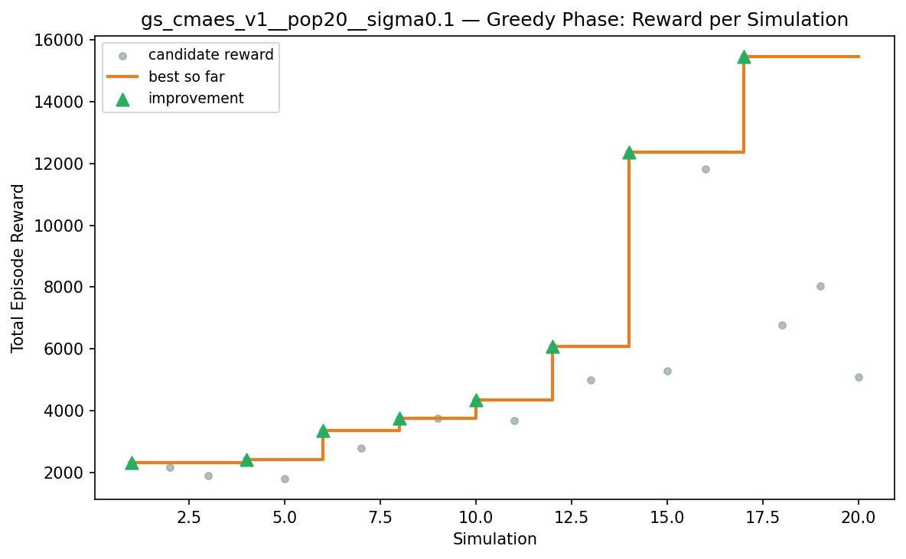
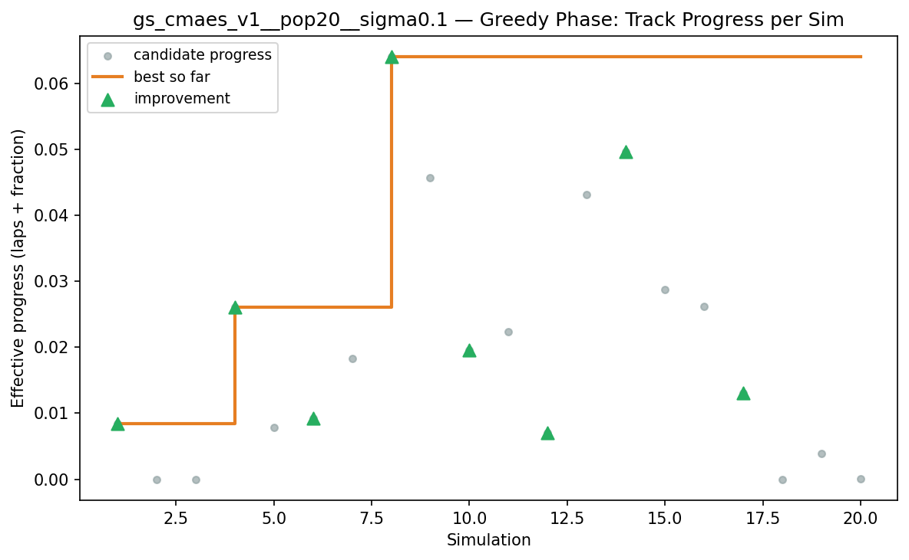
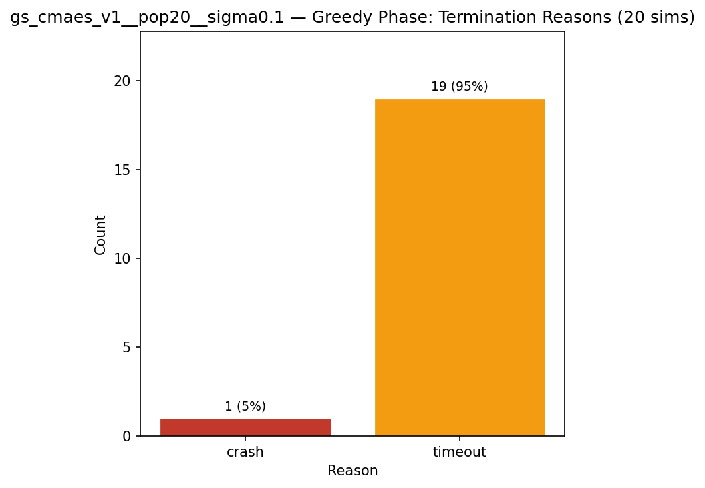
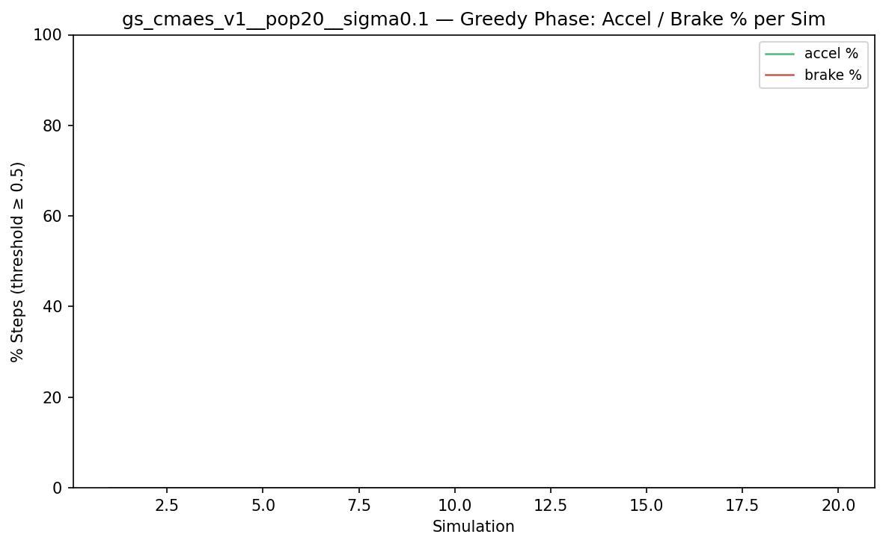
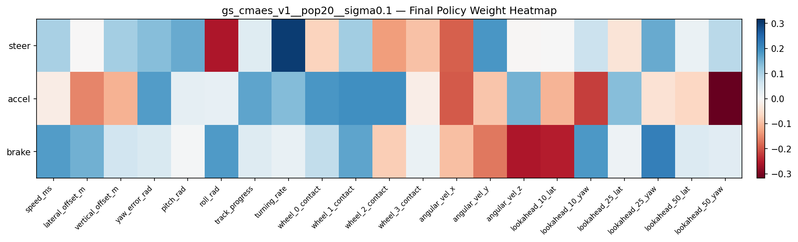

# Experiment: gs_cmaes_v1__pop20__sigma0.1

**Track:** a03_centerline

## Timings

- **Start:** 2026-04-29 01:22:26
- **End:** 2026-04-29 01:59:23
- **Total runtime:** 36m 57.4s

| Phase | Duration |
|-------|----------|
| Greedy | 36m 56.3s |

## Run Parameters

### Training

| Parameter | Value |
|-----------|-------|
| track | a03_centerline |
| track | a03_centerline |
| speed | 10.0 |
| n_sims | 20 |
| in_game_episode_s | 90.0 |
| probe_s | 8.0 |
| n_lidar_rays | 8 |
| policy_type | cmaes |
| population_size | 20 |
| initial_sigma | 0.1 |

### Reward Config

| Parameter | Value |
|-----------|-------|
| progress_weight | 10000.0 |
| centerline_weight | 0.0 |
| centerline_exp | 0.0 |
| speed_weight | 0.042 |
| step_penalty | -0.05 |
| finish_bonus | 5000.0 |
| finish_time_weight | -5.0 |
| par_time_s | 60.0 |
| accel_bonus | 0.5 |
| airborne_penalty | -0.83 |
| lidar_wall_weight | -5.0 |
| crash_threshold_m | 25.0 |
| track_name | a03_centerline |
| centerline_path | games/tmnf/tracks/a03_centerline.npy |

## Greedy Phase

Best reward: **+15459.9**

| Sim  | Reward   | Reason       | Result       |
|------|----------|--------------|-------------|
|    1 |  +2325.3 | timeout      | **NEW BEST** |
|    2 |  +2174.8 | crash        |  |
|    3 |  +1894.0 | timeout      |  |
|    4 |  +2418.7 | timeout      | **NEW BEST** |
|    5 |  +1806.1 | timeout      |  |
|    6 |  +3344.9 | timeout      | **NEW BEST** |
|    7 |  +2791.8 | timeout      |  |
|    8 |  +3747.7 | timeout      | **NEW BEST** |
|    9 |  +3745.1 | timeout      |  |
|   10 |  +4350.7 | timeout      | **NEW BEST** |
|   11 |  +3664.9 | timeout      |  |
|   12 |  +6069.7 | timeout      | **NEW BEST** |
|   13 |  +4988.1 | timeout      |  |
|   14 | +12375.3 | timeout      | **NEW BEST** |
|   15 |  +5287.8 | timeout      |  |
|   16 | +11822.9 | timeout      |  |
|   17 | +15459.9 | timeout      | **NEW BEST** |
|   18 |  +6783.0 | timeout      |  |
|   19 |  +8026.2 | timeout      |  |
|   20 |  +5082.5 | timeout      |  |

## Additional Plots

