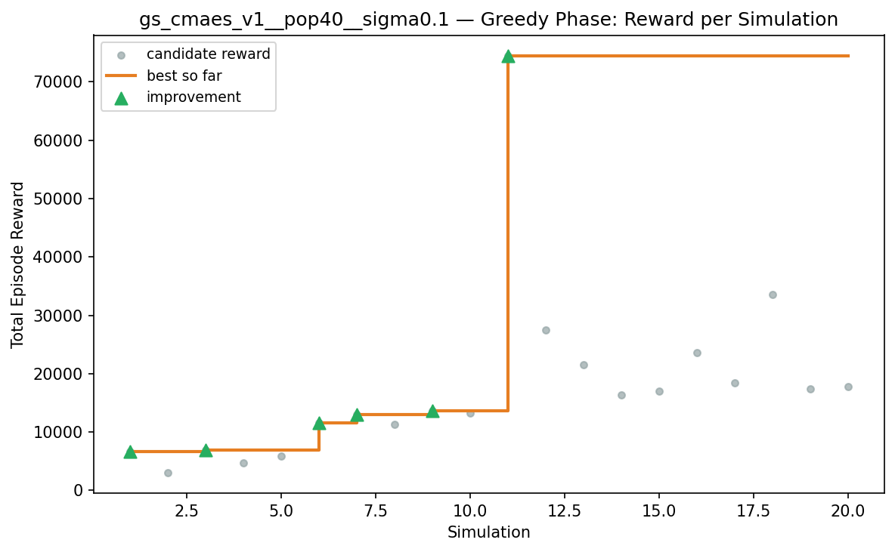
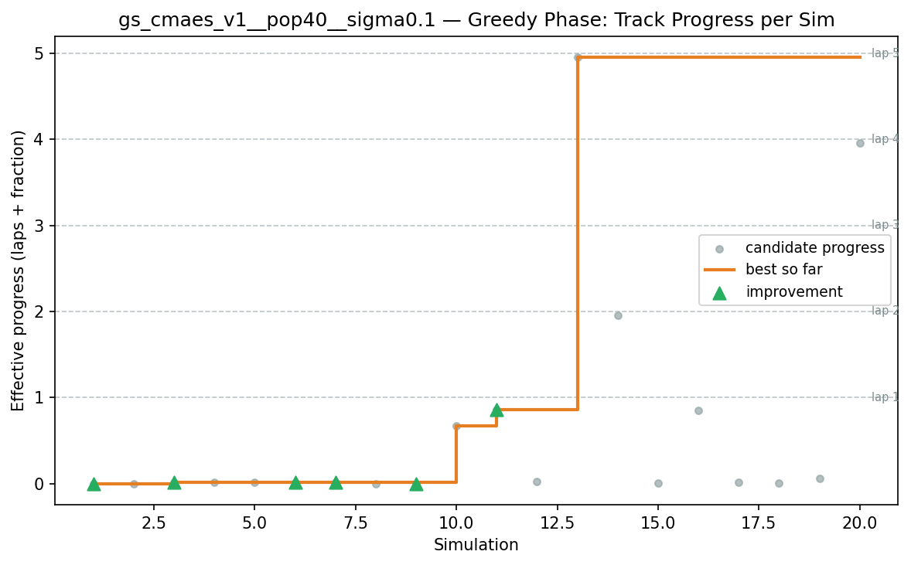
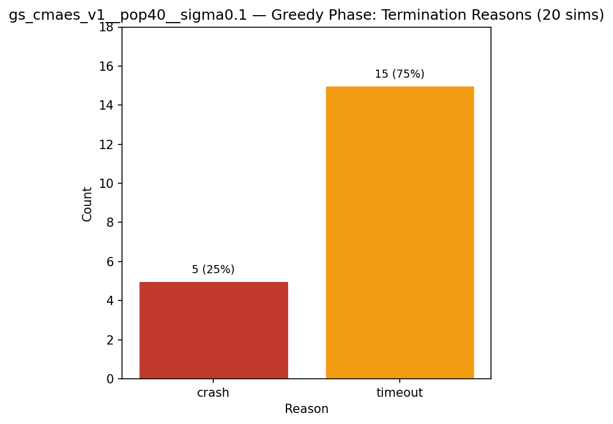
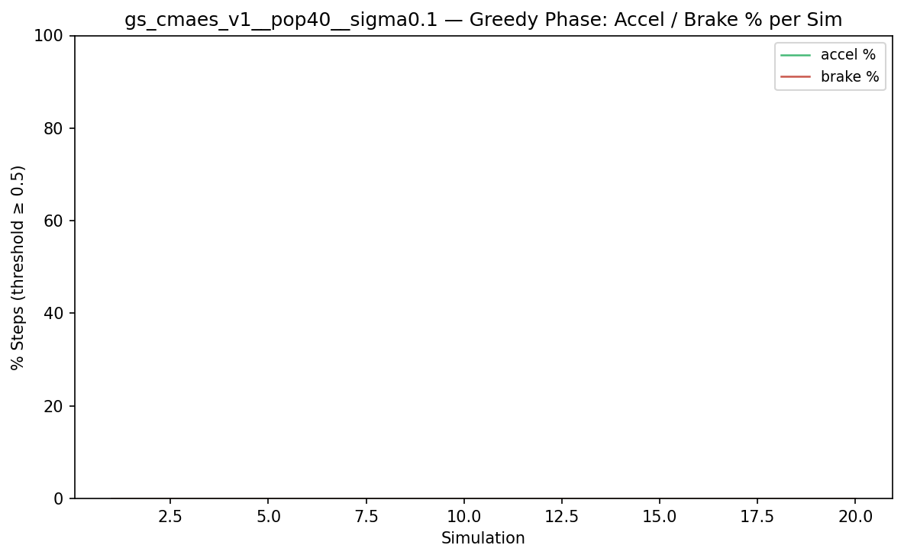
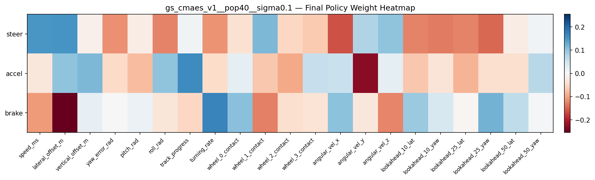

# Experiment: gs_cmaes_v1__pop40__sigma0.1

**Track:** a03_centerline

## Timings

- **Start:** 2026-04-29 02:32:16
- **End:** 2026-04-29 03:36:39
- **Total runtime:** 1h 04m 23.0s

| Phase | Duration |
|-------|----------|
| Greedy | 1h 04m 22.0s |

## Run Parameters

### Training

| Parameter | Value |
|-----------|-------|
| track | a03_centerline |
| track | a03_centerline |
| speed | 10.0 |
| n_sims | 20 |
| in_game_episode_s | 90.0 |
| probe_s | 8.0 |
| n_lidar_rays | 8 |
| policy_type | cmaes |
| population_size | 40 |
| initial_sigma | 0.1 |

### Reward Config

| Parameter | Value |
|-----------|-------|
| progress_weight | 10000.0 |
| centerline_weight | 0.0 |
| centerline_exp | 0.0 |
| speed_weight | 0.042 |
| step_penalty | -0.05 |
| finish_bonus | 5000.0 |
| finish_time_weight | -5.0 |
| par_time_s | 60.0 |
| accel_bonus | 0.5 |
| airborne_penalty | -0.83 |
| lidar_wall_weight | -5.0 |
| crash_threshold_m | 25.0 |
| track_name | a03_centerline |
| centerline_path | games/tmnf/tracks/a03_centerline.npy |

## Greedy Phase

Best reward: **+74434.2**

| Sim  | Reward   | Reason       | Result       |
|------|----------|--------------|-------------|
|    1 |  +6646.3 | timeout      | **NEW BEST** |
|    2 |  +3097.6 | timeout      |  |
|    3 |  +6869.4 | timeout      | **NEW BEST** |
|    4 |  +4680.0 | timeout      |  |
|    5 |  +5843.2 | timeout      |  |
|    6 | +11565.0 | timeout      | **NEW BEST** |
|    7 | +13040.5 | timeout      | **NEW BEST** |
|    8 | +11289.2 | crash        |  |
|    9 | +13609.3 | crash        | **NEW BEST** |
|   10 | +13271.8 | timeout      |  |
|   11 | +74434.2 | timeout      | **NEW BEST** |
|   12 | +27476.7 | timeout      |  |
|   13 | +21525.2 | crash        |  |
|   14 | +16413.5 | crash        |  |
|   15 | +16986.5 | timeout      |  |
|   16 | +23624.1 | timeout      |  |
|   17 | +18399.0 | timeout      |  |
|   18 | +33598.3 | timeout      |  |
|   19 | +17436.3 | timeout      |  |
|   20 | +17832.9 | crash        |  |

## Additional Plots

