# Grid Search Summary: gs_cmaes_v1

6 experiments, ranked by best greedy reward.

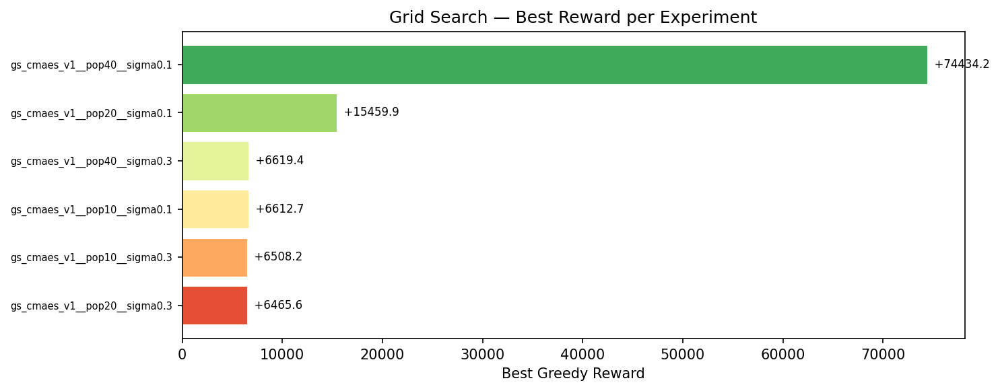

## Rankings

| Rank | Experiment | Best Reward | Improvements | First Improv. Sim | Accel % | Greedy Time |
|------|-----------|-------------|--------------|-------------------|---------|-------------|
| 1 | gs_cmaes_v1__pop40__sigma0.1 | +74434.2 | 6 | 1 | 0% | 1h 04m 22.0s |
| 2 | gs_cmaes_v1__pop20__sigma0.1 | +15459.9 | 8 | 1 | 0% | 36m 56.3s |
| 3 | gs_cmaes_v1__pop40__sigma0.3 | +6619.4 | 5 | 1 | 0% | 1h 05m 32.0s |
| 4 | gs_cmaes_v1__pop10__sigma0.1 | +6612.7 | 11 | 1 | 0% | 17m 05.1s |
| 5 | gs_cmaes_v1__pop10__sigma0.3 | +6508.2 | 11 | 1 | 0% | 16m 25.0s |
| 6 | gs_cmaes_v1__pop20__sigma0.3 | +6465.6 | 13 | 1 | 0% | 32m 29.1s |

---

## 1. gs_cmaes_v1__pop40__sigma0.1

**Best reward: +74434.2**

| Param | Value |
|---|---|
| `population_size` | 40 |
| `initial_sigma` | 0.1 |

| Stat | Value |
|---|---|
| Greedy improvements | 6 |
| First improvement (sim) | 1 |
| Accel % of best run | 0.0% |
| Greedy runtime | 1h 04m 22.0s |

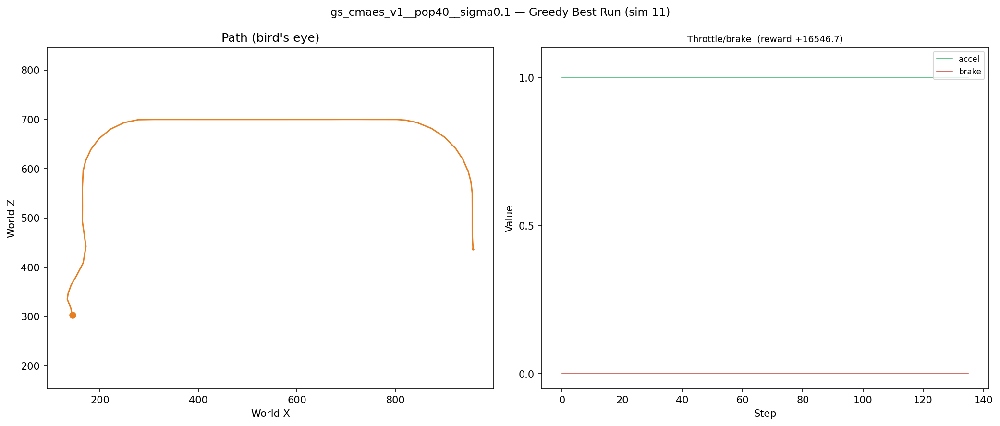

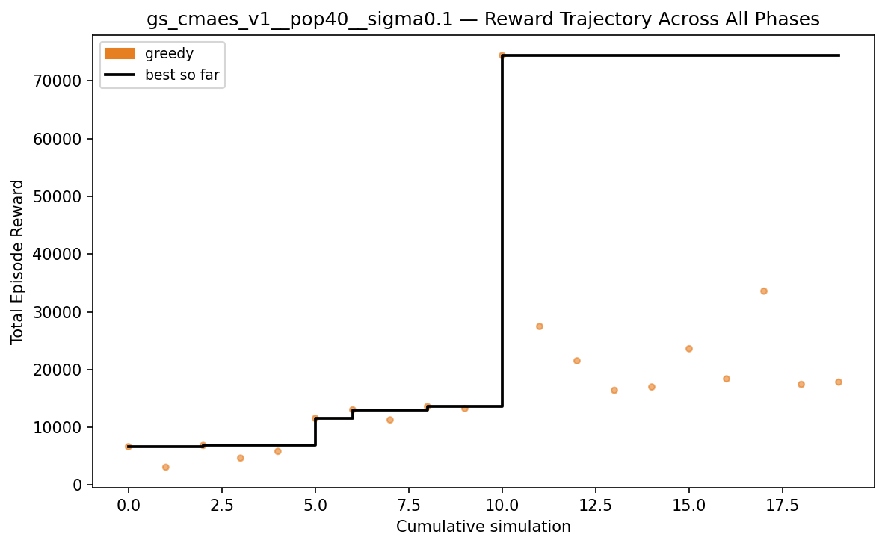

---

## 2. gs_cmaes_v1__pop20__sigma0.1

**Best reward: +15459.9**

| Param | Value |
|---|---|
| `population_size` | 20 |
| `initial_sigma` | 0.1 |

| Stat | Value |
|---|---|
| Greedy improvements | 8 |
| First improvement (sim) | 1 |
| Accel % of best run | 0.0% |
| Greedy runtime | 36m 56.3s |

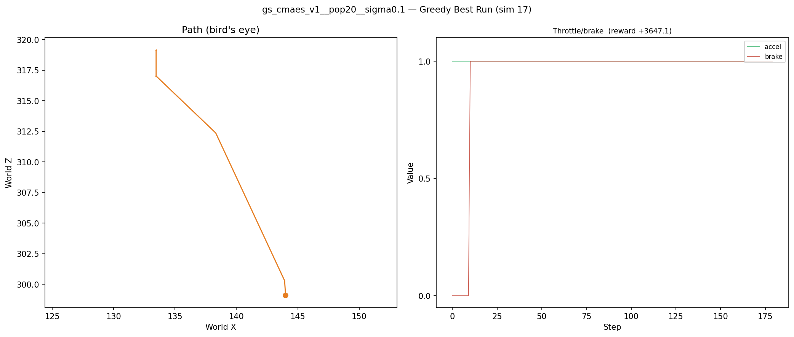

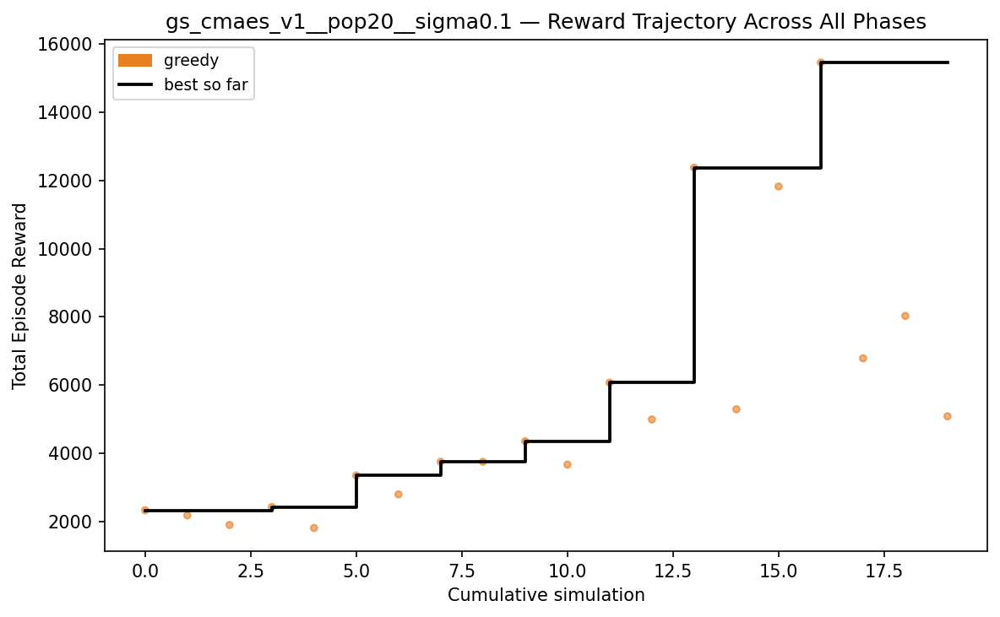

---

## 3. gs_cmaes_v1__pop40__sigma0.3

**Best reward: +6619.4**

| Param | Value |
|---|---|
| `population_size` | 40 |
| `initial_sigma` | 0.3 |

| Stat | Value |
|---|---|
| Greedy improvements | 5 |
| First improvement (sim) | 1 |
| Accel % of best run | 0.0% |
| Greedy runtime | 1h 05m 32.0s |

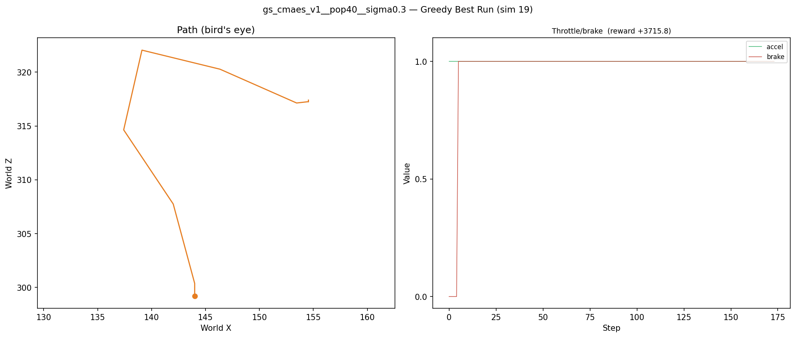

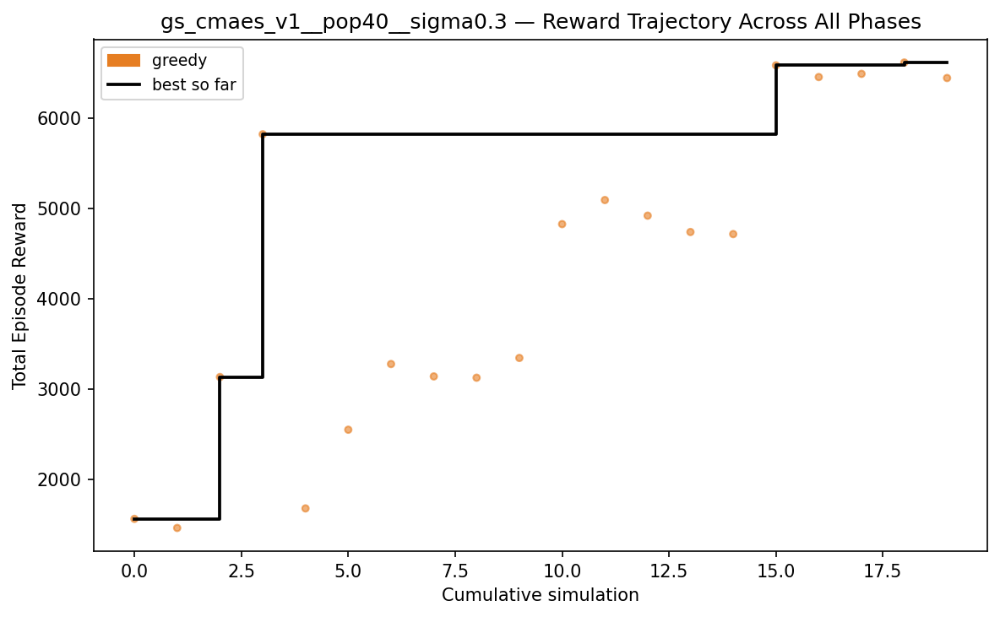

---

## 4. gs_cmaes_v1__pop10__sigma0.1

**Best reward: +6612.7**

| Param | Value |
|---|---|
| `population_size` | 10 |
| `initial_sigma` | 0.1 |

| Stat | Value |
|---|---|
| Greedy improvements | 11 |
| First improvement (sim) | 1 |
| Accel % of best run | 0.0% |
| Greedy runtime | 17m 05.1s |

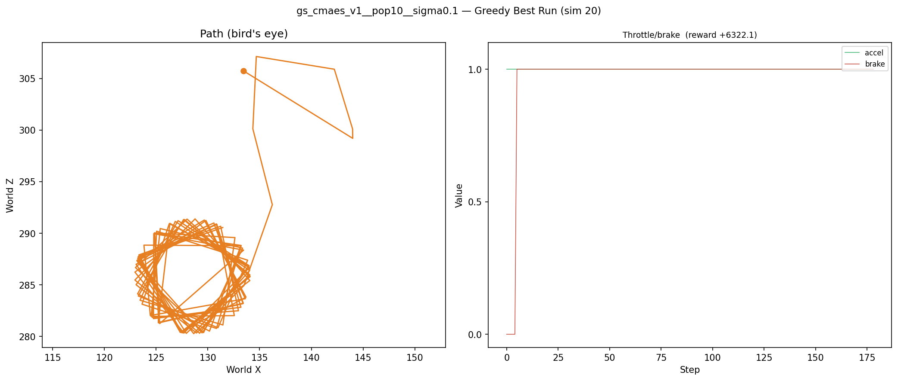

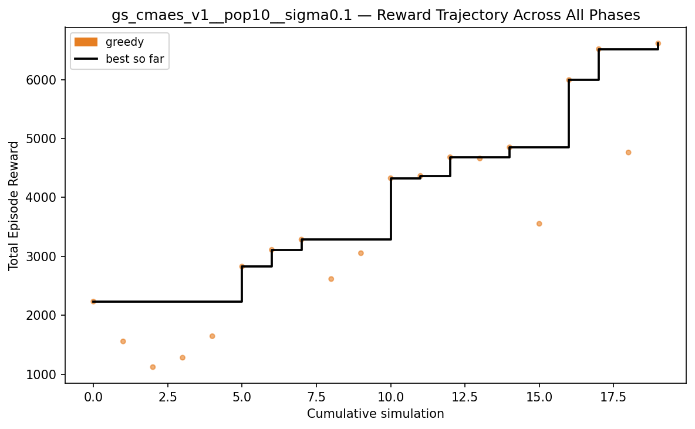

---

## 5. gs_cmaes_v1__pop10__sigma0.3

**Best reward: +6508.2**

| Param | Value |
|---|---|
| `population_size` | 10 |
| `initial_sigma` | 0.3 |

| Stat | Value |
|---|---|
| Greedy improvements | 11 |
| First improvement (sim) | 1 |
| Accel % of best run | 0.0% |
| Greedy runtime | 16m 25.0s |

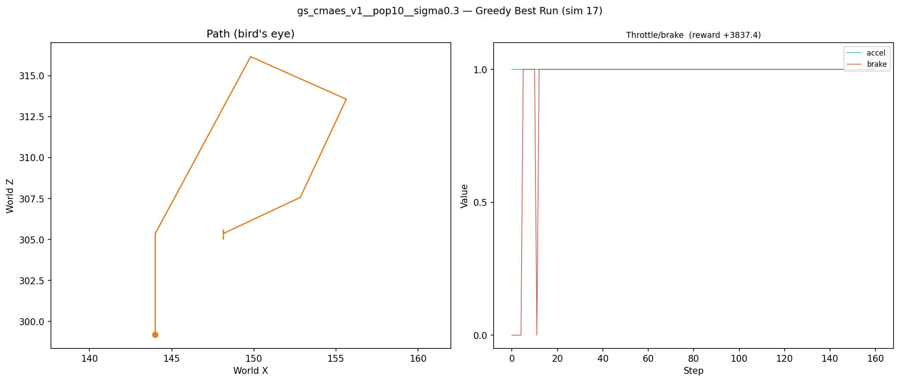

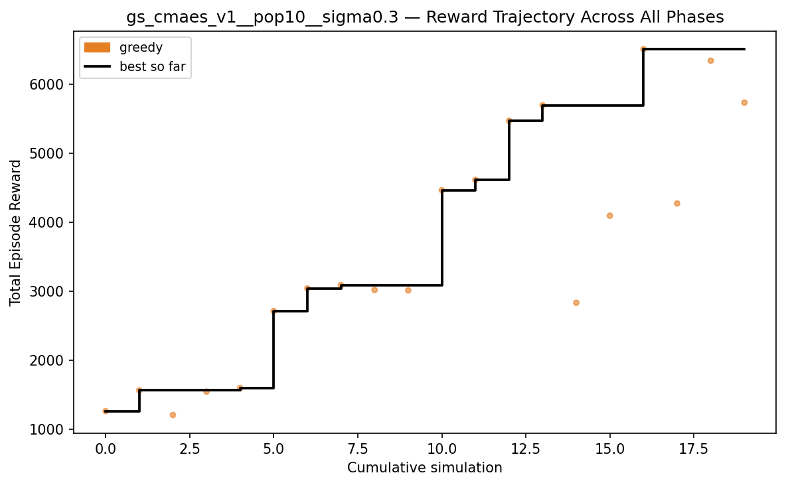

---

## 6. gs_cmaes_v1__pop20__sigma0.3

**Best reward: +6465.6**

| Param | Value |
|---|---|
| `population_size` | 20 |
| `initial_sigma` | 0.3 |

| Stat | Value |
|---|---|
| Greedy improvements | 13 |
| First improvement (sim) | 1 |
| Accel % of best run | 0.0% |
| Greedy runtime | 32m 29.1s |

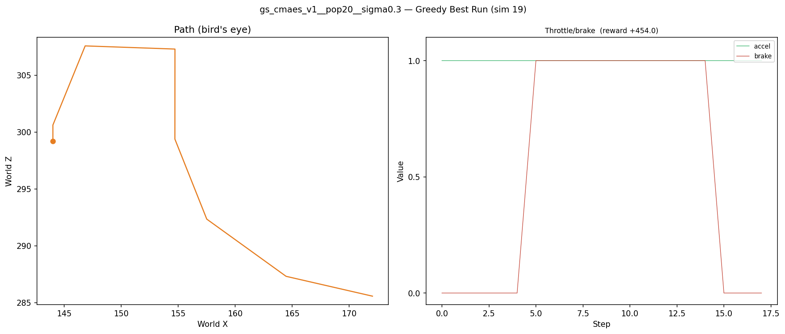

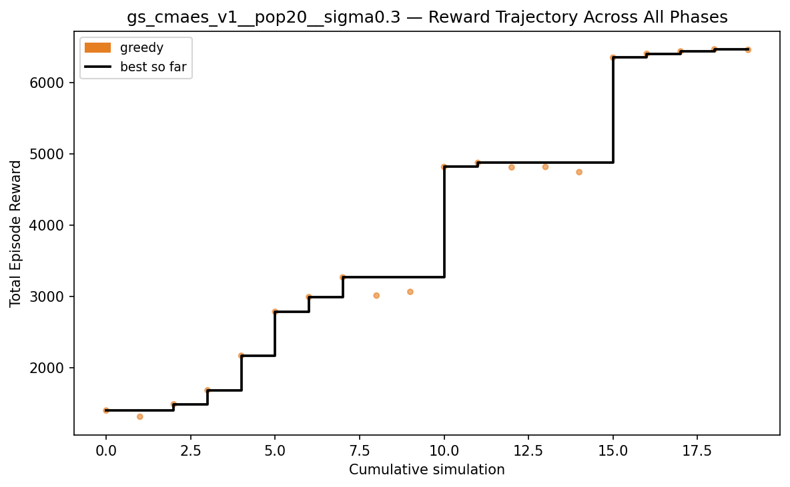

