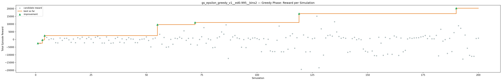
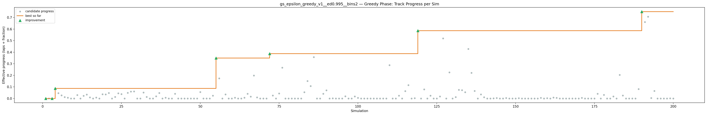
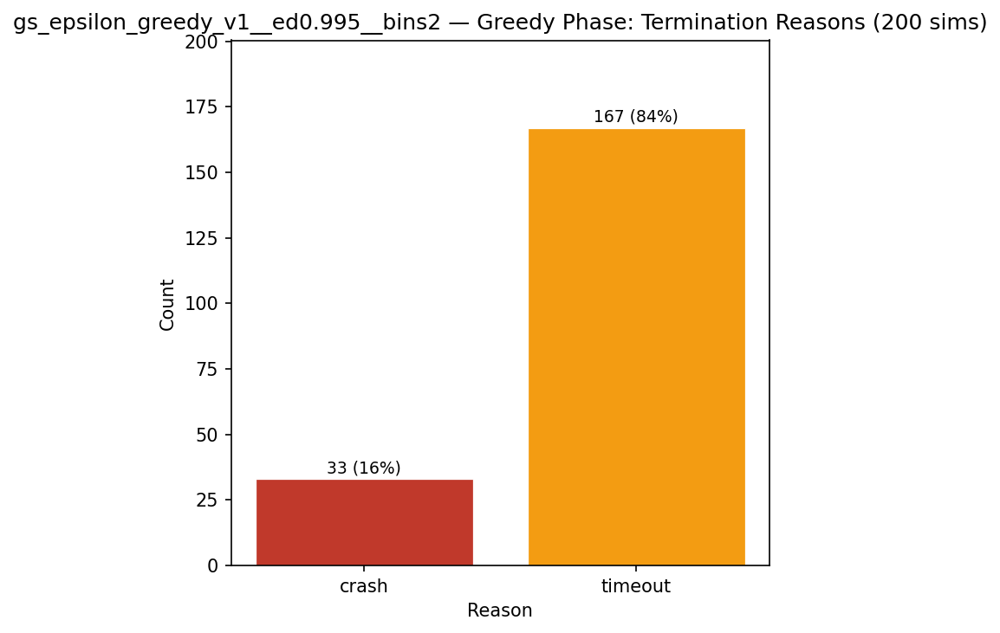
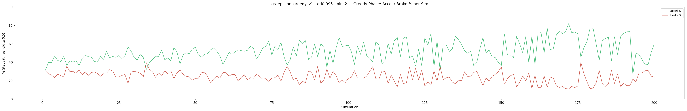

# Experiment: gs_epsilon_greedy_v1__ed0.995__bins2

**Track:** a03_centerline

## Timings

- **Start:** 2026-04-28 18:18:32
- **End:** 2026-04-28 18:55:38
- **Total runtime:** 37m 06.7s

| Phase | Duration |
|-------|----------|
| Greedy | 37m 05.7s |

## Run Parameters

### Training

| Parameter | Value |
|-----------|-------|
| track | a03_centerline |
| speed | 5.0 |
| n_sims | 200 |
| in_game_episode_s | 100.0 |
| mutation_scale | 0.05 |
| probe_s | 8.0 |
| cold_restarts | 1 |
| cold_sims | 1 |
| n_lidar_rays | 8 |
| policy_type | epsilon_greedy |
| alpha | 0.1 |
| gamma | 0.99 |
| epsilon | 0.95 |
| epsilon_min | 0.05 |
| epsilon_decay | 0.995 |
| n_bins | 2 |

### Reward Config

| Parameter | Value |
|-----------|-------|
| progress_weight | 20000.0 |
| centerline_weight | 0.0 |
| centerline_exp | 0.0 |
| speed_weight | 0.05 |
| step_penalty | -0.05 |
| finish_bonus | 5000.0 |
| finish_time_weight | -5.0 |
| par_time_s | 60.0 |
| accel_bonus | 0.5 |
| airborne_penalty | -1.0 |
| lidar_wall_weight | -5.0 |
| crash_threshold_m | 25.0 |
| track_name | a03_centerline |
| centerline_path | games/tmnf/tracks/a03_centerline.npy |

## Greedy Phase

Best reward: **+20293.0**

| Sim  | Reward   | Reason       | Result       |
|------|----------|--------------|-------------|
|    1 |  -2411.5 | timeout      | **NEW BEST** |
|    2 |  -2447.7 | timeout      |  |
|    3 |   -288.6 | timeout      | **NEW BEST** |
|    4 |  +2547.4 | timeout      | **NEW BEST** |
|    5 |  +1398.1 | timeout      |  |
|    6 |    -38.2 | timeout      |  |
|    7 |   +506.2 | timeout      |  |
|    8 |   +264.0 | timeout      |  |
|    9 |  -2108.5 | timeout      |  |
|   10 |  -2223.7 | timeout      |  |
|   11 |   +920.4 | timeout      |  |
|   12 |   -604.3 | timeout      |  |
|   13 |   +697.0 | timeout      |  |
|   14 |   +757.7 | timeout      |  |
|   15 |   -242.2 | timeout      |  |
|   16 |  -1850.0 | timeout      |  |
|   17 |   +303.6 | timeout      |  |
|   18 |  -2056.3 | timeout      |  |
|   19 |  +1185.8 | timeout      |  |
|   20 |   +400.4 | timeout      |  |
|   21 |  +1476.2 | timeout      |  |
|   22 |  -2132.6 | timeout      |  |
|   23 |   +560.7 | timeout      |  |
|   24 |  +1462.2 | timeout      |  |
|   25 |   +257.5 | timeout      |  |
|   26 |  -2011.1 | timeout      |  |
|   27 |  +1465.4 | timeout      |  |
|   28 |  +1913.2 | timeout      |  |
|   29 |   +781.5 | timeout      |  |
|   30 |  -2297.9 | timeout      |  |
|   31 |  -2297.0 | timeout      |  |
|   32 |  +1655.2 | timeout      |  |
|   33 |   -520.5 | timeout      |  |
|   34 |  -2426.4 | timeout      |  |
|   35 |  -2240.6 | timeout      |  |
|   36 |   +613.5 | timeout      |  |
|   37 |  +1438.8 | timeout      |  |
|   38 |  -1789.7 | timeout      |  |
|   39 |   +420.7 | timeout      |  |
|   40 |  -2187.1 | timeout      |  |
|   41 |    -85.5 | crash        |  |
|   42 |  +1133.5 | timeout      |  |
|   43 |   +375.0 | crash        |  |
|   44 |   +203.2 | timeout      |  |
|   45 |  -2015.6 | timeout      |  |
|   46 |  -2073.7 | timeout      |  |
|   47 |    -66.9 | timeout      |  |
|   48 |   +200.0 | timeout      |  |
|   49 |   +327.7 | timeout      |  |
|   50 |  +1686.3 | timeout      |  |
|   51 |   -635.8 | timeout      |  |
|   52 |  -4799.8 | timeout      |  |
|   53 |   +431.8 | crash        |  |
|   54 |   +958.8 | timeout      |  |
|   55 |  +9626.6 | timeout      | **NEW BEST** |
|   56 |  +3418.1 | timeout      |  |
|   57 |  -2999.1 | crash        |  |
|   58 |  +1328.3 | timeout      |  |
|   59 |  -5044.4 | timeout      |  |
|   60 |  -4826.6 | timeout      |  |
|   61 |    +66.1 | timeout      |  |
|   62 |  -3064.0 | timeout      |  |
|   63 |   +759.5 | timeout      |  |
|   64 |   +601.0 | timeout      |  |
|   65 |  +1477.9 | timeout      |  |
|   66 |   +741.3 | timeout      |  |
|   67 |  +5628.5 | timeout      |  |
|   68 |   -555.6 | timeout      |  |
|   69 |   +724.2 | timeout      |  |
|   70 |  -3120.1 | timeout      |  |
|   71 |   +903.1 | timeout      |  |
|   72 | +11026.9 | timeout      | **NEW BEST** |
|   73 |  -3623.4 | timeout      |  |
|   74 |     +8.2 | crash        |  |
|   75 |  +1799.7 | timeout      |  |
|   76 |  +7673.4 | timeout      |  |
|   77 |  -2412.1 | timeout      |  |
|   78 |   +386.0 | crash        |  |
|   79 |   -213.1 | timeout      |  |
|   80 |  -5321.4 | timeout      |  |
|   81 |  -5078.2 | timeout      |  |
|   82 |   +988.7 | timeout      |  |
|   83 |  +1714.7 | timeout      |  |
|   84 |  +4912.9 | timeout      |  |
|   85 |  +3427.8 | timeout      |  |
|   86 |  +9494.0 | timeout      |  |
|   87 | -12315.8 | timeout      |  |
|   88 |   -271.7 | timeout      |  |
|   89 |  +1685.6 | timeout      |  |
|   90 |  +2595.2 | timeout      |  |
|   91 |  +1017.5 | crash        |  |
|   92 |   +572.6 | timeout      |  |
|   93 |  -5024.0 | timeout      |  |
|   94 |    -72.9 | crash        |  |
|   95 |  -5227.5 | timeout      |  |
|   96 |   +894.7 | timeout      |  |
|   97 |    +81.8 | crash        |  |
|   98 |   +921.5 | crash        |  |
|   99 |  +1048.2 | timeout      |  |
|  100 |   +586.7 | timeout      |  |
|  101 |     +6.1 | crash        |  |
|  102 |  -7898.7 | timeout      |  |
|  103 |   +594.2 | crash        |  |
|  104 |  -3244.8 | timeout      |  |
|  105 |   +149.0 | crash        |  |
|  106 |  -7396.1 | timeout      |  |
|  107 |  -7836.3 | timeout      |  |
|  108 |  -7842.3 | timeout      |  |
|  109 |   -517.1 | timeout      |  |
|  110 |  +8729.4 | timeout      |  |
|  111 |  -8012.8 | timeout      |  |
|  112 |  -7958.0 | timeout      |  |
|  113 |  +1251.7 | timeout      |  |
|  114 |  -6362.4 | timeout      |  |
|  115 |  +2379.2 | timeout      |  |
|  116 |  +3729.7 | timeout      |  |
|  117 |  -5707.8 | timeout      |  |
|  118 |  +1177.7 | timeout      |  |
|  119 | +16753.3 | timeout      | **NEW BEST** |
|  120 | -19398.1 | timeout      |  |
|  121 |  +2934.4 | timeout      |  |
|  122 |  -8060.3 | timeout      |  |
|  123 |  +1347.2 | timeout      |  |
|  124 |  -7884.4 | timeout      |  |
|  125 |   +506.3 | crash        |  |
|  126 |   +870.0 | timeout      |  |
|  127 | +15110.0 | timeout      |  |
|  128 | -18323.2 | timeout      |  |
|  129 |  +6938.2 | timeout      |  |
|  130 | -10176.2 | timeout      |  |
|  131 |  +1011.6 | timeout      |  |
|  132 |  +2572.1 | timeout      |  |
|  133 |  +2862.8 | timeout      |  |
|  134 |  +2132.4 | timeout      |  |
|  135 | +11514.3 | timeout      |  |
|  136 |  +4874.8 | timeout      |  |
|  137 |  +1962.9 | timeout      |  |
|  138 |   +756.8 | crash        |  |
|  139 |  +1258.0 | timeout      |  |
|  140 |   +821.0 | timeout      |  |
|  141 |  -8318.1 | timeout      |  |
|  142 |  -7932.5 | timeout      |  |
|  143 |   +595.3 | timeout      |  |
|  144 |  +1374.1 | timeout      |  |
|  145 |   -134.1 | timeout      |  |
|  146 |   +426.7 | timeout      |  |
|  147 |   -156.1 | timeout      |  |
|  148 |  -6216.8 | timeout      |  |
|  149 |  -7608.4 | timeout      |  |
|  150 |  -8113.1 | timeout      |  |
|  151 |   +676.0 | crash        |  |
|  152 |  -7486.4 | timeout      |  |
|  153 | -10429.9 | timeout      |  |
|  154 | -10604.8 | timeout      |  |
|  155 |  +1450.4 | crash        |  |
|  156 |  -2373.6 | timeout      |  |
|  157 | -10292.8 | timeout      |  |
|  158 |  +1341.6 | crash        |  |
|  159 |  -9465.9 | timeout      |  |
|  160 |   +547.3 | crash        |  |
|  161 |  -9663.4 | timeout      |  |
|  162 |  +2310.8 | crash        |  |
|  163 |  +1602.6 | timeout      |  |
|  164 | -10378.3 | timeout      |  |
|  165 |   +901.9 | crash        |  |
|  166 |  -7958.4 | timeout      |  |
|  167 |  -7071.8 | timeout      |  |
|  168 |   +346.7 | crash        |  |
|  169 |  +1014.9 | crash        |  |
|  170 |   +707.1 | crash        |  |
|  171 |  +1038.3 | crash        |  |
|  172 |  +1082.0 | crash        |  |
|  173 |  +1158.0 | crash        |  |
|  174 |  +1644.5 | timeout      |  |
|  175 |  +1969.2 | timeout      |  |
|  176 |  +2606.3 | timeout      |  |
|  177 |   +549.1 | crash        |  |
|  178 |  +2141.7 | timeout      |  |
|  179 |   +434.4 | crash        |  |
|  180 |   +399.8 | crash        |  |
|  181 |  +2651.3 | timeout      |  |
|  182 | -10635.8 | timeout      |  |
|  183 |  +6621.1 | timeout      |  |
|  184 |  -1053.0 | timeout      |  |
|  185 |   -106.2 | crash        |  |
|  186 |  -9069.1 | timeout      |  |
|  187 |   +745.2 | crash        |  |
|  188 |  -7849.3 | timeout      |  |
|  189 |  +4467.0 | timeout      |  |
|  190 | +20293.0 | timeout      | **NEW BEST** |
|  191 |  +8942.0 | timeout      |  |
|  192 |  +7300.1 | timeout      |  |
|  193 | -12725.8 | timeout      |  |
|  194 |  +2853.5 | timeout      |  |
|  195 |  -5691.0 | timeout      |  |
|  196 | -10309.7 | timeout      |  |
|  197 | -10921.4 | timeout      |  |
|  198 | -10931.9 | timeout      |  |
|  199 |   +646.1 | crash        |  |
|  200 |   +887.3 | timeout      |  |

## Additional Plots

