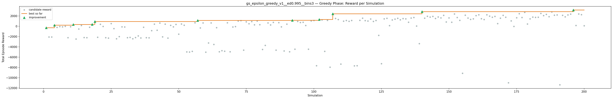
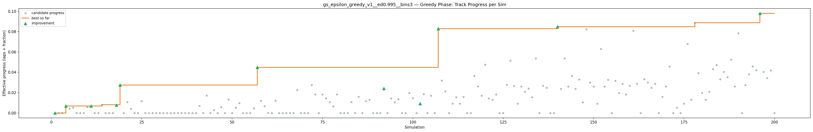
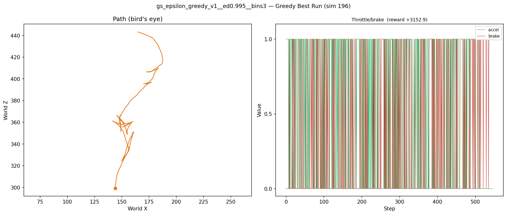
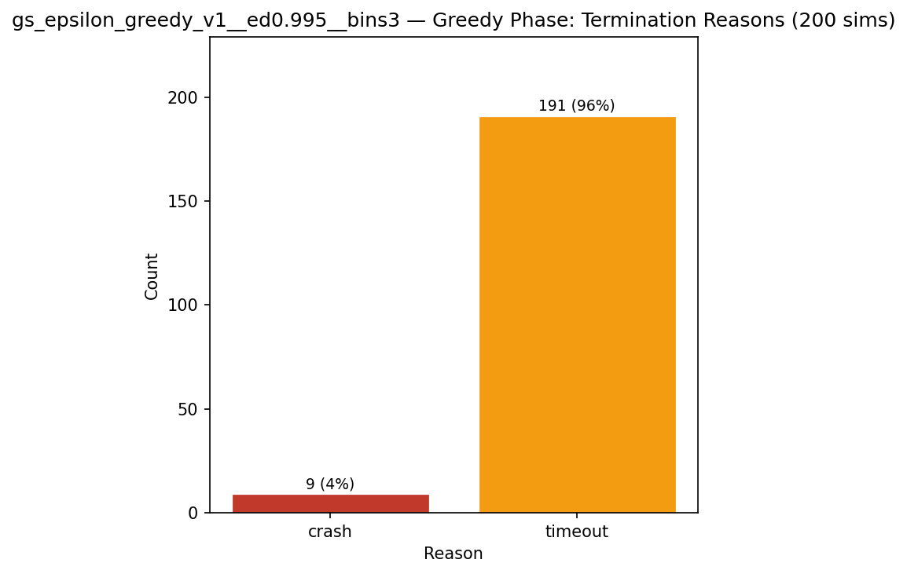
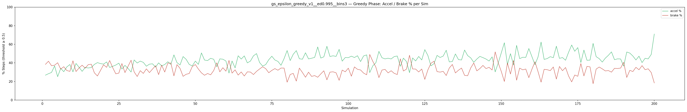
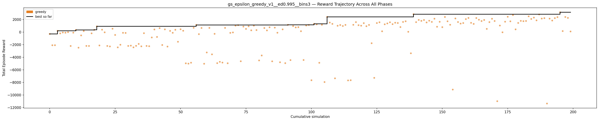

# Experiment: gs_epsilon_greedy_v1__ed0.995__bins3

**Track:** a03_centerline

## Timings

- **Start:** 2026-04-28 18:55:50
- **End:** 2026-04-28 19:36:55
- **Total runtime:** 41m 05.3s

| Phase | Duration |
|-------|----------|
| Greedy | 41m 04.3s |

## Run Parameters

### Training

| Parameter | Value |
|-----------|-------|
| track | a03_centerline |
| speed | 5.0 |
| n_sims | 200 |
| in_game_episode_s | 100.0 |
| mutation_scale | 0.05 |
| probe_s | 8.0 |
| cold_restarts | 1 |
| cold_sims | 1 |
| n_lidar_rays | 8 |
| policy_type | epsilon_greedy |
| alpha | 0.1 |
| gamma | 0.99 |
| epsilon | 0.95 |
| epsilon_min | 0.05 |
| epsilon_decay | 0.995 |
| n_bins | 3 |

### Reward Config

| Parameter | Value |
|-----------|-------|
| progress_weight | 20000.0 |
| centerline_weight | 0.0 |
| centerline_exp | 0.0 |
| speed_weight | 0.05 |
| step_penalty | -0.05 |
| finish_bonus | 5000.0 |
| finish_time_weight | -5.0 |
| par_time_s | 60.0 |
| accel_bonus | 0.5 |
| airborne_penalty | -1.0 |
| lidar_wall_weight | -5.0 |
| crash_threshold_m | 25.0 |
| track_name | a03_centerline |
| centerline_path | games/tmnf/tracks/a03_centerline.npy |

## Greedy Phase

Best reward: **+3152.9**

| Sim  | Reward   | Reason       | Result       |
|------|----------|--------------|-------------|
|    1 |   -300.0 | crash        | **NEW BEST** |
|    2 |  -2094.7 | timeout      |  |
|    3 |  -2088.6 | timeout      |  |
|    4 |   +204.8 | timeout      | **NEW BEST** |
|    5 |   -210.7 | timeout      |  |
|    6 |    -61.7 | timeout      |  |
|    7 |    -99.2 | timeout      |  |
|    8 |    -17.8 | timeout      |  |
|    9 |  -2211.9 | timeout      |  |
|   10 |    -94.5 | timeout      |  |
|   11 |   +343.0 | timeout      | **NEW BEST** |
|   12 |  -2482.3 | timeout      |  |
|   13 |   -529.3 | timeout      |  |
|   14 |   +163.4 | timeout      |  |
|   15 |  -2202.1 | timeout      |  |
|   16 |  -2209.0 | timeout      |  |
|   17 |   -201.8 | timeout      |  |
|   18 |   +351.7 | timeout      | **NEW BEST** |
|   19 |   +907.1 | timeout      | **NEW BEST** |
|   20 |  -2129.4 | timeout      |  |
|   21 |   +380.0 | timeout      |  |
|   22 |    -40.8 | timeout      |  |
|   23 |  -2205.6 | timeout      |  |
|   24 |  -2285.0 | timeout      |  |
|   25 |   +532.4 | timeout      |  |
|   26 |   -457.1 | crash        |  |
|   27 |  -2429.4 | timeout      |  |
|   28 |  -2016.7 | timeout      |  |
|   29 |   -118.4 | crash        |  |
|   30 |   -137.3 | timeout      |  |
|   31 |  -2203.6 | timeout      |  |
|   32 |  -2158.8 | timeout      |  |
|   33 |  -2426.3 | timeout      |  |
|   34 |  -2189.5 | timeout      |  |
|   35 |  -1886.4 | timeout      |  |
|   36 |  -2267.0 | timeout      |  |
|   37 |   -179.6 | timeout      |  |
|   38 |  -2204.0 | timeout      |  |
|   39 |  -2248.5 | timeout      |  |
|   40 |   -857.3 | timeout      |  |
|   41 |   +411.1 | timeout      |  |
|   42 |   -773.5 | timeout      |  |
|   43 |   +628.7 | timeout      |  |
|   44 |  -2056.1 | timeout      |  |
|   45 |   +427.0 | timeout      |  |
|   46 |  -2305.9 | timeout      |  |
|   47 |   +185.3 | timeout      |  |
|   48 |   -113.2 | timeout      |  |
|   49 |   +363.9 | timeout      |  |
|   50 |  -1540.8 | timeout      |  |
|   51 |   +447.0 | timeout      |  |
|   52 |   +211.4 | timeout      |  |
|   53 |  -4969.6 | timeout      |  |
|   54 |  -5020.5 | timeout      |  |
|   55 |  -4875.5 | timeout      |  |
|   56 |   +684.6 | timeout      |  |
|   57 |  +1140.5 | timeout      | **NEW BEST** |
|   58 |   -328.1 | timeout      |  |
|   59 |   +651.3 | timeout      |  |
|   60 |  -5038.7 | timeout      |  |
|   61 |  -3242.2 | timeout      |  |
|   62 |   +664.4 | timeout      |  |
|   63 |  -3545.7 | timeout      |  |
|   64 |   -280.8 | timeout      |  |
|   65 |  -4942.4 | timeout      |  |
|   66 |  -4731.5 | timeout      |  |
|   67 |  -4854.1 | timeout      |  |
|   68 |   +666.8 | timeout      |  |
|   69 |  -4957.7 | timeout      |  |
|   70 |   -126.6 | timeout      |  |
|   71 |    -59.5 | timeout      |  |
|   72 |  +1021.1 | timeout      |  |
|   73 |  +1096.4 | timeout      |  |
|   74 |  -4641.0 | timeout      |  |
|   75 |   +875.6 | timeout      |  |
|   76 |   +503.9 | timeout      |  |
|   77 |   +920.8 | timeout      |  |
|   78 |   +278.4 | timeout      |  |
|   79 |  +1015.9 | timeout      |  |
|   80 |   +320.0 | crash        |  |
|   81 |  -4508.9 | timeout      |  |
|   82 |  -3721.9 | timeout      |  |
|   83 |   +644.3 | timeout      |  |
|   84 |   +261.1 | timeout      |  |
|   85 |   +763.7 | timeout      |  |
|   86 |  -4651.9 | timeout      |  |
|   87 |   +707.7 | timeout      |  |
|   88 |   -103.3 | timeout      |  |
|   89 |  -4800.6 | timeout      |  |
|   90 |   +429.4 | timeout      |  |
|   91 |  -4942.0 | timeout      |  |
|   92 |  +1150.4 | timeout      | **NEW BEST** |
|   93 |  -4458.7 | timeout      |  |
|   94 |   +951.0 | timeout      |  |
|   95 |   +744.0 | timeout      |  |
|   96 |   +784.2 | timeout      |  |
|   97 |   +140.8 | crash        |  |
|   98 |  -4443.7 | timeout      |  |
|   99 |  +1044.5 | timeout      |  |
|  100 |  +1129.6 | timeout      |  |
|  101 |  -7659.9 | timeout      |  |
|  102 |  +1320.1 | timeout      | **NEW BEST** |
|  103 |  +1222.0 | timeout      |  |
|  104 |  -4887.8 | timeout      |  |
|  105 |  +1154.0 | timeout      |  |
|  106 |  -7949.5 | timeout      |  |
|  107 |  +2418.5 | timeout      | **NEW BEST** |
|  108 |  +1515.2 | timeout      |  |
|  109 |  +1302.8 | timeout      |  |
|  110 |  -7358.6 | timeout      |  |
|  111 |  +1003.5 | timeout      |  |
|  112 |  +1125.5 | timeout      |  |
|  113 |   +966.1 | timeout      |  |
|  114 |  +1139.7 | timeout      |  |
|  115 |  -7689.0 | timeout      |  |
|  116 |  -7658.6 | timeout      |  |
|  117 |  +1155.8 | timeout      |  |
|  118 |  +1584.8 | timeout      |  |
|  119 |  +1095.7 | timeout      |  |
|  120 |  +1012.6 | timeout      |  |
|  121 |  +1421.1 | timeout      |  |
|  122 |   +934.7 | timeout      |  |
|  123 |  +1136.9 | timeout      |  |
|  124 |  -1772.9 | timeout      |  |
|  125 |  -7282.8 | timeout      |  |
|  126 |  +1437.2 | timeout      |  |
|  127 |  +1561.5 | timeout      |  |
|  128 |   +127.3 | timeout      |  |
|  129 |  +1236.0 | timeout      |  |
|  130 |  +1379.1 | timeout      |  |
|  131 |  +1559.4 | timeout      |  |
|  132 |  +1259.2 | timeout      |  |
|  133 |  +1487.5 | timeout      |  |
|  134 |  +1443.1 | timeout      |  |
|  135 |   +796.2 | timeout      |  |
|  136 |  +1611.5 | timeout      |  |
|  137 |  +1718.1 | timeout      |  |
|  138 |    +44.7 | crash        |  |
|  139 |  -3375.3 | timeout      |  |
|  140 |  +2850.0 | timeout      | **NEW BEST** |
|  141 |  +1581.0 | timeout      |  |
|  142 |  +1931.5 | timeout      |  |
|  143 |  +1782.9 | timeout      |  |
|  144 |  +1922.2 | timeout      |  |
|  145 |  +1534.7 | timeout      |  |
|  146 |  +1809.0 | timeout      |  |
|  147 |  +1616.9 | timeout      |  |
|  148 |  +2124.2 | timeout      |  |
|  149 |   +844.6 | timeout      |  |
|  150 |  +1634.6 | timeout      |  |
|  151 |   +781.8 | timeout      |  |
|  152 |  +2402.3 | timeout      |  |
|  153 |  +1715.4 | timeout      |  |
|  154 |  +1163.5 | timeout      |  |
|  155 |  -9144.3 | timeout      |  |
|  156 |  +2167.1 | timeout      |  |
|  157 |  +1598.3 | timeout      |  |
|  158 |  +1348.5 | timeout      |  |
|  159 |  +1439.1 | timeout      |  |
|  160 |  +2063.1 | timeout      |  |
|  161 |  +2246.0 | timeout      |  |
|  162 |  +1469.0 | timeout      |  |
|  163 |  +1298.7 | crash        |  |
|  164 |  +2235.4 | timeout      |  |
|  165 |  +1966.3 | timeout      |  |
|  166 |  +1753.0 | timeout      |  |
|  167 |  +1925.9 | timeout      |  |
|  168 |   +509.1 | crash        |  |
|  169 |  +1586.2 | timeout      |  |
|  170 |  +2116.2 | timeout      |  |
|  171 |  +1761.1 | timeout      |  |
|  172 | -10996.5 | timeout      |  |
|  173 |  +1036.6 | timeout      |  |
|  174 |    -37.2 | timeout      |  |
|  175 |  +1648.3 | timeout      |  |
|  176 |  +2435.7 | timeout      |  |
|  177 |  +1709.9 | timeout      |  |
|  178 |  +2699.5 | timeout      |  |
|  179 |   +430.2 | timeout      |  |
|  180 |  +1452.4 | timeout      |  |
|  181 |  +1783.2 | timeout      |  |
|  182 |  +1732.0 | timeout      |  |
|  183 |  +1764.7 | timeout      |  |
|  184 |  +2503.8 | timeout      |  |
|  185 |  +2085.9 | timeout      |  |
|  186 |  +2300.1 | timeout      |  |
|  187 |  +1860.8 | timeout      |  |
|  188 |  +2799.2 | timeout      |  |
|  189 |  +2148.4 | timeout      |  |
|  190 |  +2216.4 | timeout      |  |
|  191 | -11366.6 | timeout      |  |
|  192 |  +2139.6 | timeout      |  |
|  193 |  +1835.2 | timeout      |  |
|  194 |  +2217.9 | timeout      |  |
|  195 |  +2377.8 | timeout      |  |
|  196 |  +3152.9 | timeout      | **NEW BEST** |
|  197 |   +158.0 | timeout      |  |
|  198 |  +2400.5 | timeout      |  |
|  199 |  +2254.0 | timeout      |  |
|  200 |    +98.0 | crash        |  |

## Additional Plots

