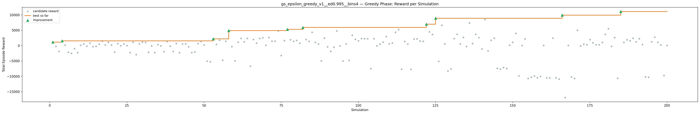
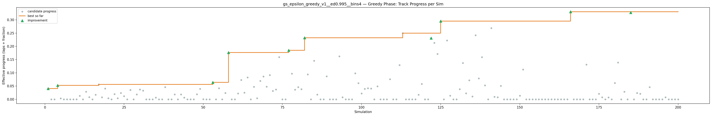
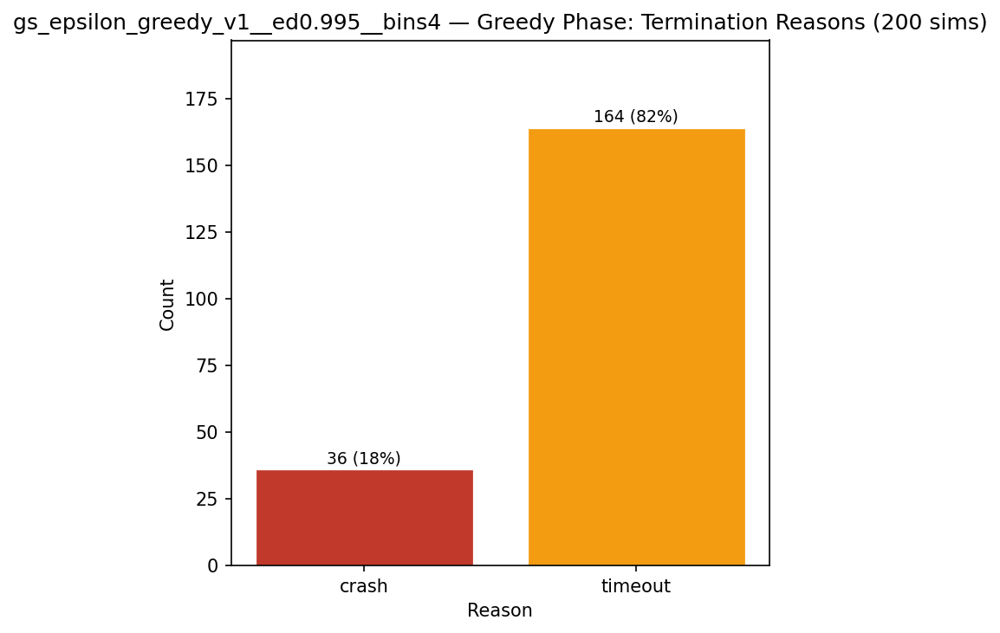
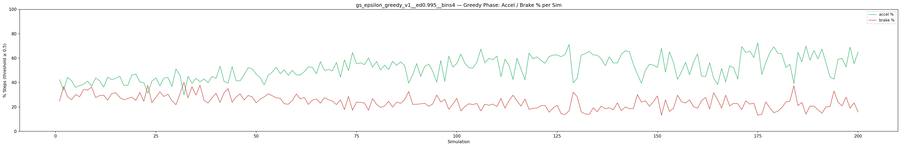

# Experiment: gs_epsilon_greedy_v1__ed0.995__bins4

**Track:** a03_centerline

## Timings

- **Start:** 2026-04-28 19:37:07
- **End:** 2026-04-28 20:13:06
- **Total runtime:** 35m 59.4s

| Phase | Duration |
|-------|----------|
| Greedy | 35m 58.4s |

## Run Parameters

### Training

| Parameter | Value |
|-----------|-------|
| track | a03_centerline |
| speed | 5.0 |
| n_sims | 200 |
| in_game_episode_s | 100.0 |
| mutation_scale | 0.05 |
| probe_s | 8.0 |
| cold_restarts | 1 |
| cold_sims | 1 |
| n_lidar_rays | 8 |
| policy_type | epsilon_greedy |
| alpha | 0.1 |
| gamma | 0.99 |
| epsilon | 0.95 |
| epsilon_min | 0.05 |
| epsilon_decay | 0.995 |
| n_bins | 4 |

### Reward Config

| Parameter | Value |
|-----------|-------|
| progress_weight | 20000.0 |
| centerline_weight | 0.0 |
| centerline_exp | 0.0 |
| speed_weight | 0.05 |
| step_penalty | -0.05 |
| finish_bonus | 5000.0 |
| finish_time_weight | -5.0 |
| par_time_s | 60.0 |
| accel_bonus | 0.5 |
| airborne_penalty | -1.0 |
| lidar_wall_weight | -5.0 |
| crash_threshold_m | 25.0 |
| track_name | a03_centerline |
| centerline_path | games/tmnf/tracks/a03_centerline.npy |

## Greedy Phase

Best reward: **+11094.3**

| Sim  | Reward   | Reason       | Result       |
|------|----------|--------------|-------------|
|    1 |  +1170.7 | timeout      | **NEW BEST** |
|    2 |   -204.6 | timeout      |  |
|    3 |  -1912.1 | timeout      |  |
|    4 |  +1532.9 | timeout      | **NEW BEST** |
|    5 |   +184.5 | timeout      |  |
|    6 |  -2129.5 | timeout      |  |
|    7 |  -2483.2 | timeout      |  |
|    8 |   -989.1 | timeout      |  |
|    9 |  -2239.5 | timeout      |  |
|   10 |   +135.5 | timeout      |  |
|   11 |   +524.5 | timeout      |  |
|   12 |   -189.8 | timeout      |  |
|   13 |   +825.6 | timeout      |  |
|   14 |   -309.4 | timeout      |  |
|   15 |   -196.3 | timeout      |  |
|   16 |   +501.1 | crash        |  |
|   17 |  +1490.9 | timeout      |  |
|   18 |   +246.3 | timeout      |  |
|   19 |  +1109.8 | timeout      |  |
|   20 |   +240.0 | timeout      |  |
|   21 |  -2112.5 | timeout      |  |
|   22 |   +636.2 | timeout      |  |
|   23 |    -13.9 | timeout      |  |
|   24 |   +545.1 | timeout      |  |
|   25 |    +48.9 | timeout      |  |
|   26 |  -2265.9 | timeout      |  |
|   27 |  +1157.4 | timeout      |  |
|   28 |  -2888.1 | timeout      |  |
|   29 |   +574.2 | timeout      |  |
|   30 |  +1172.5 | timeout      |  |
|   31 |  +1055.5 | timeout      |  |
|   32 |  -2142.5 | timeout      |  |
|   33 |    -79.5 | crash        |  |
|   34 |  -2230.3 | timeout      |  |
|   35 |   +349.6 | timeout      |  |
|   36 |    -70.2 | timeout      |  |
|   37 |  -1938.8 | timeout      |  |
|   38 |  +1370.7 | timeout      |  |
|   39 |   -146.7 | timeout      |  |
|   40 |  -1872.9 | timeout      |  |
|   41 |   +735.0 | timeout      |  |
|   42 |  -2283.7 | timeout      |  |
|   43 |   +525.0 | timeout      |  |
|   44 |   +593.6 | timeout      |  |
|   45 |   -360.0 | timeout      |  |
|   46 |  -2243.6 | timeout      |  |
|   47 |  -2057.8 | timeout      |  |
|   48 |   +693.9 | timeout      |  |
|   49 |  +1420.2 | timeout      |  |
|   50 |   +255.3 | timeout      |  |
|   51 |  -5059.2 | timeout      |  |
|   52 |  -5228.8 | timeout      |  |
|   53 |  +2214.1 | timeout      | **NEW BEST** |
|   54 |   +443.9 | timeout      |  |
|   55 |  +1734.0 | timeout      |  |
|   56 |  -4727.8 | timeout      |  |
|   57 |  +1431.7 | timeout      |  |
|   58 |  +4885.7 | timeout      | **NEW BEST** |
|   59 |   -299.5 | crash        |  |
|   60 |  -4954.3 | timeout      |  |
|   61 |  +1151.3 | timeout      |  |
|   62 |  +2377.1 | timeout      |  |
|   63 |  +1229.7 | timeout      |  |
|   64 |  +2355.2 | timeout      |  |
|   65 |  -6664.8 | timeout      |  |
|   66 |  +2026.7 | timeout      |  |
|   67 |   +834.2 | timeout      |  |
|   68 |  +2381.0 | timeout      |  |
|   69 |  +2550.2 | timeout      |  |
|   70 |   +145.4 | timeout      |  |
|   71 |  +2674.7 | timeout      |  |
|   72 |  +1466.9 | timeout      |  |
|   73 |  +1460.1 | timeout      |  |
|   74 |  +4807.7 | timeout      |  |
|   75 |  -3203.6 | crash        |  |
|   76 |  +1664.4 | timeout      |  |
|   77 |  +5309.4 | timeout      | **NEW BEST** |
|   78 |  +1934.4 | timeout      |  |
|   79 |  +1385.0 | timeout      |  |
|   80 |  +1713.3 | timeout      |  |
|   81 |   +808.8 | timeout      |  |
|   82 |  +5905.4 | timeout      | **NEW BEST** |
|   83 |  +2018.9 | timeout      |  |
|   84 |  +1383.5 | crash        |  |
|   85 |  +4334.3 | timeout      |  |
|   86 |  +1102.3 | timeout      |  |
|   87 |   +517.0 | timeout      |  |
|   88 |  -4915.9 | timeout      |  |
|   89 |  +2490.9 | timeout      |  |
|   90 |   -375.9 | crash        |  |
|   91 |  -1859.2 | timeout      |  |
|   92 |   -507.6 | timeout      |  |
|   93 |  +4788.2 | timeout      |  |
|   94 |    -44.5 | timeout      |  |
|   95 |  -4985.6 | timeout      |  |
|   96 |   +584.9 | crash        |  |
|   97 |  -4780.6 | timeout      |  |
|   98 |  +3363.1 | timeout      |  |
|   99 |  +2080.2 | timeout      |  |
|  100 |  +1573.1 | timeout      |  |
|  101 |  +2341.5 | timeout      |  |
|  102 |  +2241.5 | timeout      |  |
|  103 |  +2252.3 | timeout      |  |
|  104 |  -7486.9 | timeout      |  |
|  105 |  +2274.8 | timeout      |  |
|  106 |    -83.0 | crash        |  |
|  107 |   +508.0 | crash        |  |
|  108 |  +1126.7 | crash        |  |
|  109 |  +2964.7 | timeout      |  |
|  110 |   +595.1 | crash        |  |
|  111 |   +862.2 | crash        |  |
|  112 |  +4360.4 | timeout      |  |
|  113 |  +5186.7 | timeout      |  |
|  114 |  -7690.5 | timeout      |  |
|  115 |  +1356.2 | timeout      |  |
|  116 |   +554.6 | timeout      |  |
|  117 |  -7672.5 | timeout      |  |
|  118 |  +2147.8 | timeout      |  |
|  119 |  +2234.2 | timeout      |  |
|  120 |  +1518.6 | crash        |  |
|  121 |  +1425.4 | timeout      |  |
|  122 |  +6969.2 | timeout      | **NEW BEST** |
|  123 |  +4491.2 | timeout      |  |
|  124 |  +3650.2 | timeout      |  |
|  125 |  +8931.0 | timeout      | **NEW BEST** |
|  126 |  -5068.1 | crash        |  |
|  127 |  +6619.5 | timeout      |  |
|  128 |   +600.8 | timeout      |  |
|  129 |  -8246.2 | timeout      |  |
|  130 |  -7577.0 | timeout      |  |
|  131 |  +2319.6 | timeout      |  |
|  132 |  +3703.2 | timeout      |  |
|  133 |   +548.7 | timeout      |  |
|  134 |  +2684.2 | timeout      |  |
|  135 |   -263.9 | timeout      |  |
|  136 |  +7402.1 | timeout      |  |
|  137 |   +681.3 | timeout      |  |
|  138 |  +3701.5 | timeout      |  |
|  139 |  +2645.7 | timeout      |  |
|  140 |  -1089.7 | crash        |  |
|  141 |  +8508.8 | timeout      |  |
|  142 |  -1686.9 | timeout      |  |
|  143 |  +1750.9 | timeout      |  |
|  144 |  +2434.2 | timeout      |  |
|  145 |  -7358.4 | timeout      |  |
|  146 |  -7632.2 | timeout      |  |
|  147 |  -7141.5 | timeout      |  |
|  148 |  -7418.8 | timeout      |  |
|  149 |   +153.8 | crash        |  |
|  150 |  +1098.9 | timeout      |  |
|  151 |  +4007.6 | timeout      |  |
|  152 |  -9833.8 | timeout      |  |
|  153 |    +59.8 | crash        |  |
|  154 |  +2224.8 | crash        |  |
|  155 | -10668.3 | timeout      |  |
|  156 | -10256.5 | timeout      |  |
|  157 |  -9842.9 | timeout      |  |
|  158 | -10402.3 | timeout      |  |
|  159 |  -9995.4 | timeout      |  |
|  160 |    +88.9 | crash        |  |
|  161 | -10450.1 | timeout      |  |
|  162 | -10472.2 | timeout      |  |
|  163 |  +2494.0 | crash        |  |
|  164 | -10460.2 | timeout      |  |
|  165 | -10881.5 | timeout      |  |
|  166 |  +9937.4 | timeout      | **NEW BEST** |
|  167 | -16893.8 | timeout      |  |
|  168 |   +101.6 | crash        |  |
|  169 | -10160.0 | timeout      |  |
|  170 | -10700.5 | timeout      |  |
|  171 |  +4997.8 | timeout      |  |
|  172 |    -62.0 | crash        |  |
|  173 |   +502.1 | crash        |  |
|  174 |   +277.8 | crash        |  |
|  175 |  +1951.8 | timeout      |  |
|  176 |   +958.2 | timeout      |  |
|  177 |   +280.6 | crash        |  |
|  178 |   +301.4 | crash        |  |
|  179 |  +1040.6 | crash        |  |
|  180 |  +3682.9 | timeout      |  |
|  181 |  +5531.6 | timeout      |  |
|  182 |   -221.0 | crash        |  |
|  183 |  +2605.1 | timeout      |  |
|  184 | -10627.5 | timeout      |  |
|  185 | +11094.3 | timeout      | **NEW BEST** |
|  186 |  +1054.9 | crash        |  |
|  187 |  +1925.4 | timeout      |  |
|  188 |  +1628.0 | timeout      |  |
|  189 |  +2405.2 | crash        |  |
|  190 |  +1235.4 | crash        |  |
|  191 |  +2253.6 | timeout      |  |
|  192 |   +407.3 | crash        |  |
|  193 | -10168.3 | timeout      |  |
|  194 | -10244.5 | timeout      |  |
|  195 |  +1257.1 | crash        |  |
|  196 |  +2767.3 | timeout      |  |
|  197 |  +1091.0 | crash        |  |
|  198 |   +245.2 | crash        |  |
|  199 |  -9686.3 | timeout      |  |
|  200 |    +75.2 | crash        |  |

## Additional Plots

