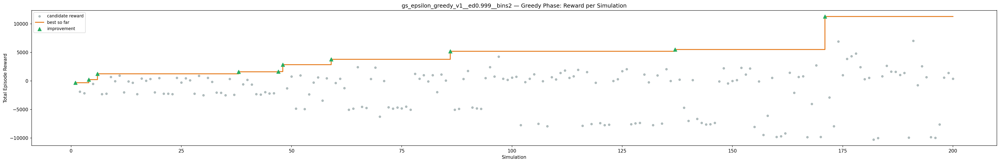
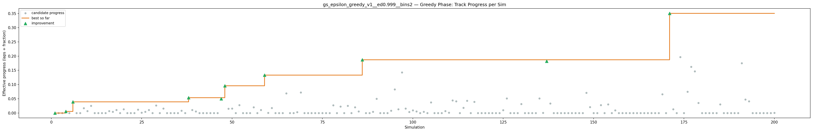
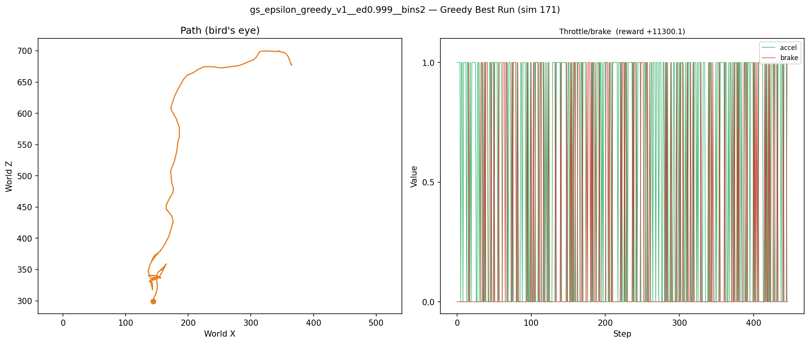
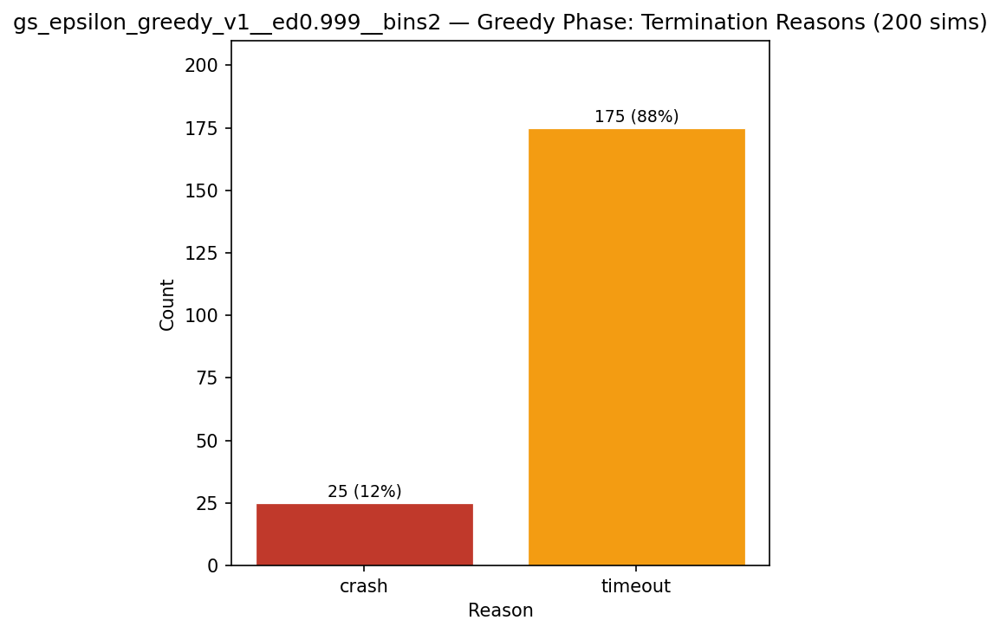
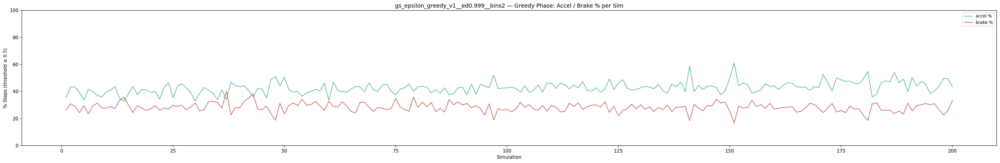
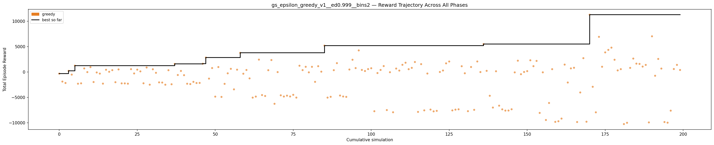

# Experiment: gs_epsilon_greedy_v1__ed0.999__bins2

**Track:** a03_centerline

## Timings

- **Start:** 2026-04-28 20:13:17
- **End:** 2026-04-28 20:51:56
- **Total runtime:** 38m 38.8s

| Phase | Duration |
|-------|----------|
| Greedy | 38m 37.8s |

## Run Parameters

### Training

| Parameter | Value |
|-----------|-------|
| track | a03_centerline |
| speed | 5.0 |
| n_sims | 200 |
| in_game_episode_s | 100.0 |
| mutation_scale | 0.05 |
| probe_s | 8.0 |
| cold_restarts | 1 |
| cold_sims | 1 |
| n_lidar_rays | 8 |
| policy_type | epsilon_greedy |
| alpha | 0.1 |
| gamma | 0.99 |
| epsilon | 0.95 |
| epsilon_min | 0.05 |
| epsilon_decay | 0.999 |
| n_bins | 2 |

### Reward Config

| Parameter | Value |
|-----------|-------|
| progress_weight | 20000.0 |
| centerline_weight | 0.0 |
| centerline_exp | 0.0 |
| speed_weight | 0.05 |
| step_penalty | -0.05 |
| finish_bonus | 5000.0 |
| finish_time_weight | -5.0 |
| par_time_s | 60.0 |
| accel_bonus | 0.5 |
| airborne_penalty | -1.0 |
| lidar_wall_weight | -5.0 |
| crash_threshold_m | 25.0 |
| track_name | a03_centerline |
| centerline_path | games/tmnf/tracks/a03_centerline.npy |

## Greedy Phase

Best reward: **+11300.1**

| Sim  | Reward   | Reason       | Result       |
|------|----------|--------------|-------------|
|    1 |   -314.7 | timeout      | **NEW BEST** |
|    2 |  -1881.1 | timeout      |  |
|    3 |  -2160.4 | timeout      |  |
|    4 |   +237.3 | timeout      | **NEW BEST** |
|    5 |   -509.1 | timeout      |  |
|    6 |  +1261.8 | timeout      | **NEW BEST** |
|    7 |  -2301.6 | timeout      |  |
|    8 |  -2228.2 | timeout      |  |
|    9 |   +710.1 | timeout      |  |
|   10 |    -15.4 | timeout      |  |
|   11 |   +960.7 | timeout      |  |
|   12 |  -1972.1 | timeout      |  |
|   13 |    -87.7 | timeout      |  |
|   14 |   -308.8 | timeout      |  |
|   15 |  -2285.4 | timeout      |  |
|   16 |   +446.1 | timeout      |  |
|   17 |    +48.5 | timeout      |  |
|   18 |   +367.1 | timeout      |  |
|   19 |  -2007.2 | timeout      |  |
|   20 |   +512.9 | timeout      |  |
|   21 |  -2238.4 | timeout      |  |
|   22 |  -2240.7 | timeout      |  |
|   23 |  -2295.8 | timeout      |  |
|   24 |   +564.8 | timeout      |  |
|   25 |   -280.2 | timeout      |  |
|   26 |   +467.3 | timeout      |  |
|   27 |   +127.6 | timeout      |  |
|   28 |  -2220.8 | timeout      |  |
|   29 |   +893.5 | timeout      |  |
|   30 |  -2492.8 | timeout      |  |
|   31 |   +543.8 | timeout      |  |
|   32 |   -154.0 | timeout      |  |
|   33 |  -2038.2 | timeout      |  |
|   34 |  -2073.6 | timeout      |  |
|   35 |  -2497.8 | timeout      |  |
|   36 |   +356.0 | timeout      |  |
|   37 |  -2411.4 | timeout      |  |
|   38 |  +1598.3 | timeout      | **NEW BEST** |
|   39 |   -585.7 | timeout      |  |
|   40 |   +213.0 | timeout      |  |
|   41 |   -621.8 | timeout      |  |
|   42 |  -2304.8 | timeout      |  |
|   43 |  -2373.3 | timeout      |  |
|   44 |  -1934.3 | timeout      |  |
|   45 |  -2166.9 | timeout      |  |
|   46 |  -2146.0 | timeout      |  |
|   47 |  +1636.7 | timeout      | **NEW BEST** |
|   48 |  +2850.6 | timeout      | **NEW BEST** |
|   49 |  -1295.7 | timeout      |  |
|   50 |   +784.9 | timeout      |  |
|   51 |  -4847.3 | timeout      |  |
|   52 |   +982.5 | timeout      |  |
|   53 |  -4905.5 | timeout      |  |
|   54 |  -2328.6 | timeout      |  |
|   55 |   -255.6 | timeout      |  |
|   56 |   +634.1 | timeout      |  |
|   57 |  -3415.9 | timeout      |  |
|   58 |   +465.2 | timeout      |  |
|   59 |  +3786.5 | timeout      | **NEW BEST** |
|   60 |   -333.8 | crash        |  |
|   61 |   +402.0 | crash        |  |
|   62 |  -1253.9 | timeout      |  |
|   63 |  -5041.7 | timeout      |  |
|   64 |  -4837.9 | timeout      |  |
|   65 |  +2446.5 | timeout      |  |
|   66 |  -4538.3 | timeout      |  |
|   67 |  -4726.5 | timeout      |  |
|   68 |   +357.6 | timeout      |  |
|   69 |  +2361.4 | timeout      |  |
|   70 |  -6258.6 | timeout      |  |
|   71 |    -12.3 | crash        |  |
|   72 |  -4590.0 | timeout      |  |
|   73 |  -4828.3 | timeout      |  |
|   74 |  -4653.8 | timeout      |  |
|   75 |  -4817.6 | timeout      |  |
|   76 |  -4493.1 | timeout      |  |
|   77 |  -5038.7 | timeout      |  |
|   78 |  +1242.1 | timeout      |  |
|   79 |   +378.5 | crash        |  |
|   80 |  +1031.4 | timeout      |  |
|   81 |    -62.9 | timeout      |  |
|   82 |  +1029.7 | timeout      |  |
|   83 |  -1935.3 | timeout      |  |
|   84 |  +1148.1 | timeout      |  |
|   85 |    +71.1 | crash        |  |
|   86 |  +5210.5 | timeout      | **NEW BEST** |
|   87 |  -5040.7 | timeout      |  |
|   88 |  -4884.2 | timeout      |  |
|   89 |   +363.3 | timeout      |  |
|   90 |  +1751.4 | timeout      |  |
|   91 |  -4631.5 | timeout      |  |
|   92 |  -4822.3 | timeout      |  |
|   93 |  -4896.9 | timeout      |  |
|   94 |   +495.7 | timeout      |  |
|   95 |  +2419.2 | timeout      |  |
|   96 |   +778.1 | timeout      |  |
|   97 |  +4260.9 | timeout      |  |
|   98 |   +414.0 | timeout      |  |
|   99 |   +198.0 | timeout      |  |
|  100 |   +580.5 | timeout      |  |
|  101 |   +746.0 | timeout      |  |
|  102 |  -7726.3 | timeout      |  |
|  103 |   -200.2 | timeout      |  |
|  104 |   +410.9 | timeout      |  |
|  105 |  +1174.3 | timeout      |  |
|  106 |  -7496.4 | timeout      |  |
|  107 |    -38.2 | crash        |  |
|  108 |  -7930.9 | timeout      |  |
|  109 |   +683.6 | timeout      |  |
|  110 |   +286.6 | timeout      |  |
|  111 |  +1425.2 | timeout      |  |
|  112 |  +1834.9 | timeout      |  |
|  113 |   +558.0 | timeout      |  |
|  114 |   +822.0 | timeout      |  |
|  115 |  +1973.9 | timeout      |  |
|  116 |  -7858.1 | timeout      |  |
|  117 |  +1554.5 | timeout      |  |
|  118 |  -7555.2 | timeout      |  |
|  119 |   -294.7 | timeout      |  |
|  120 |  -7399.4 | timeout      |  |
|  121 |  -7752.5 | timeout      |  |
|  122 |  -7653.6 | timeout      |  |
|  123 |     +9.3 | crash        |  |
|  124 |   +299.7 | timeout      |  |
|  125 |  +1708.8 | timeout      |  |
|  126 |  +2073.1 | timeout      |  |
|  127 |  -7565.5 | timeout      |  |
|  128 |  -7411.1 | timeout      |  |
|  129 |  -7348.2 | timeout      |  |
|  130 |  +1142.3 | timeout      |  |
|  131 |   -246.9 | timeout      |  |
|  132 |  -7716.4 | timeout      |  |
|  133 |   +991.6 | timeout      |  |
|  134 |  -7450.0 | timeout      |  |
|  135 |  +2079.4 | timeout      |  |
|  136 |     -5.9 | timeout      |  |
|  137 |  +5508.7 | timeout      | **NEW BEST** |
|  138 |   +235.4 | timeout      |  |
|  139 |  -4678.4 | timeout      |  |
|  140 |  -7001.2 | timeout      |  |
|  141 |   +151.6 | crash        |  |
|  142 |  -6631.3 | timeout      |  |
|  143 |  -7356.6 | timeout      |  |
|  144 |  -7601.5 | timeout      |  |
|  145 |  -7589.0 | timeout      |  |
|  146 |  -7339.5 | timeout      |  |
|  147 |    -69.9 | crash        |  |
|  148 |  +2236.8 | timeout      |  |
|  149 |   -428.9 | timeout      |  |
|  150 |     +9.9 | crash        |  |
|  151 |   +176.8 | crash        |  |
|  152 |  +2312.0 | timeout      |  |
|  153 |  +1153.4 | crash        |  |
|  154 |  +2190.2 | timeout      |  |
|  155 |  -8058.5 | timeout      |  |
|  156 |    -61.6 | timeout      |  |
|  157 |  -9453.1 | timeout      |  |
|  158 |  -6099.8 | timeout      |  |
|  159 |   +561.5 | crash        |  |
|  160 |  -9822.8 | timeout      |  |
|  161 |  -9702.1 | timeout      |  |
|  162 |  -9173.8 | timeout      |  |
|  163 |  +1463.9 | crash        |  |
|  164 |  -2065.4 | timeout      |  |
|  165 |   +716.2 | crash        |  |
|  166 |   +839.8 | crash        |  |
|  167 |  -9854.2 | timeout      |  |
|  168 |  -4028.9 | timeout      |  |
|  169 |  +2730.5 | timeout      |  |
|  170 |  -9792.4 | timeout      |  |
|  171 | +11300.1 | timeout      | **NEW BEST** |
|  172 |  -2907.2 | timeout      |  |
|  173 |  -7941.9 | timeout      |  |
|  174 |  +6934.8 | timeout      |  |
|  175 |  +1040.8 | crash        |  |
|  176 |  +3871.6 | timeout      |  |
|  177 |  +4361.7 | timeout      |  |
|  178 |  +4808.4 | timeout      |  |
|  179 |  +2419.3 | timeout      |  |
|  180 |   +319.2 | crash        |  |
|  181 |   +567.6 | crash        |  |
|  182 | -10257.5 | timeout      |  |
|  183 | -10003.9 | timeout      |  |
|  184 |   +817.7 | crash        |  |
|  185 |  +2653.5 | timeout      |  |
|  186 |  +1656.4 | crash        |  |
|  187 |  +1598.5 | crash        |  |
|  188 |  +1075.0 | timeout      |  |
|  189 |  +1403.8 | crash        |  |
|  190 |  -9930.8 | timeout      |  |
|  191 |  +7039.5 | timeout      |  |
|  192 |   -733.3 | timeout      |  |
|  193 |  +2580.5 | timeout      |  |
|  194 |   +681.9 | timeout      |  |
|  195 |  -9856.4 | timeout      |  |
|  196 |  -9981.5 | timeout      |  |
|  197 |  -7611.3 | timeout      |  |
|  198 |   +593.0 | crash        |  |
|  199 |  +1409.9 | timeout      |  |
|  200 |   +401.9 | crash        |  |

## Additional Plots

