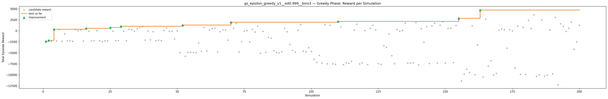
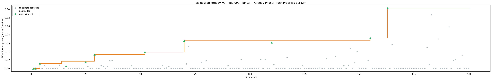
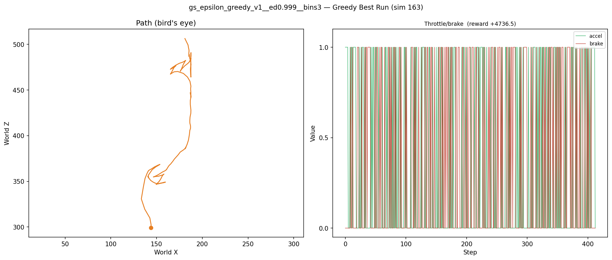
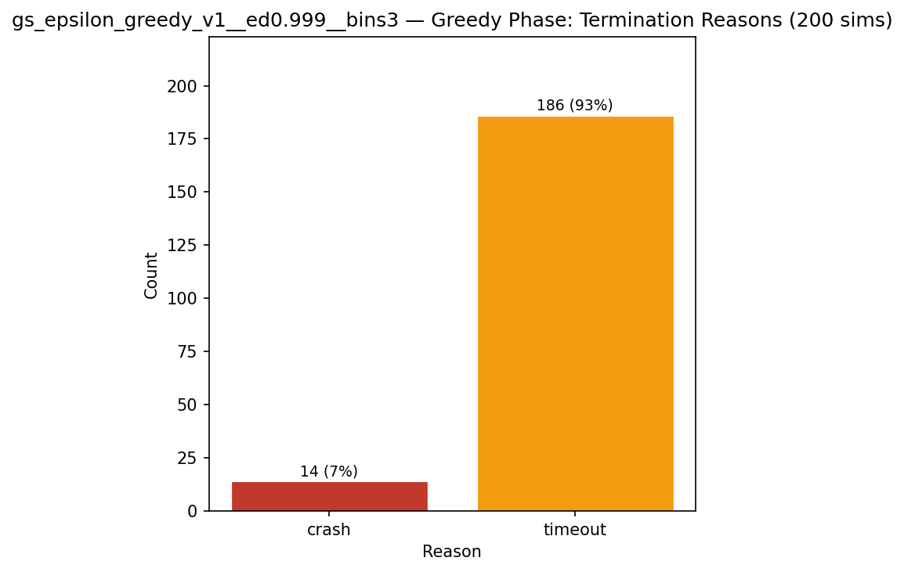
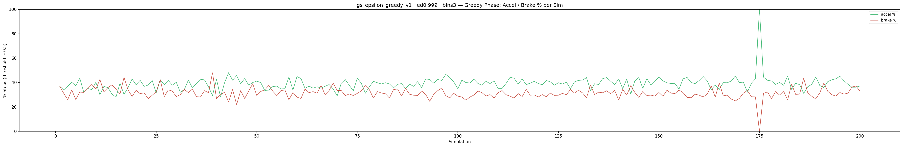
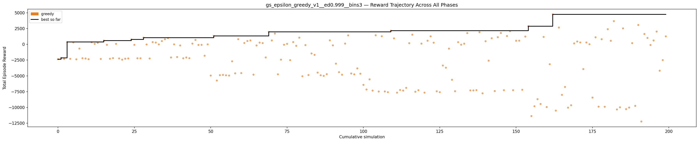

# Experiment: gs_epsilon_greedy_v1__ed0.999__bins3

**Track:** a03_centerline

## Timings

- **Start:** 2026-04-28 20:52:08
- **End:** 2026-04-28 21:32:37
- **Total runtime:** 40m 29.3s

| Phase | Duration |
|-------|----------|
| Greedy | 40m 28.2s |

## Run Parameters

### Training

| Parameter | Value |
|-----------|-------|
| track | a03_centerline |
| speed | 5.0 |
| n_sims | 200 |
| in_game_episode_s | 100.0 |
| mutation_scale | 0.05 |
| probe_s | 8.0 |
| cold_restarts | 1 |
| cold_sims | 1 |
| n_lidar_rays | 8 |
| policy_type | epsilon_greedy |
| alpha | 0.1 |
| gamma | 0.99 |
| epsilon | 0.95 |
| epsilon_min | 0.05 |
| epsilon_decay | 0.999 |
| n_bins | 3 |

### Reward Config

| Parameter | Value |
|-----------|-------|
| progress_weight | 20000.0 |
| centerline_weight | 0.0 |
| centerline_exp | 0.0 |
| speed_weight | 0.05 |
| step_penalty | -0.05 |
| finish_bonus | 5000.0 |
| finish_time_weight | -5.0 |
| par_time_s | 60.0 |
| accel_bonus | 0.5 |
| airborne_penalty | -1.0 |
| lidar_wall_weight | -5.0 |
| crash_threshold_m | 25.0 |
| track_name | a03_centerline |
| centerline_path | games/tmnf/tracks/a03_centerline.npy |

## Greedy Phase

Best reward: **+4736.5**

| Sim  | Reward   | Reason       | Result       |
|------|----------|--------------|-------------|
|    1 |  -2365.1 | timeout      | **NEW BEST** |
|    2 |  -2160.4 | timeout      | **NEW BEST** |
|    3 |  -2331.7 | timeout      |  |
|    4 |   +367.2 | timeout      | **NEW BEST** |
|    5 |  -2302.0 | timeout      |  |
|    6 |   +293.8 | timeout      |  |
|    7 |  -2381.1 | timeout      |  |
|    8 |   -679.9 | timeout      |  |
|    9 |  -2212.5 | timeout      |  |
|   10 |  -2249.6 | timeout      |  |
|   11 |  -2359.3 | timeout      |  |
|   12 |   +317.0 | timeout      |  |
|   13 |    +67.0 | timeout      |  |
|   14 |   +230.5 | timeout      |  |
|   15 |  -2318.5 | timeout      |  |
|   16 |   +577.1 | timeout      | **NEW BEST** |
|   17 |    -77.6 | crash        |  |
|   18 |  -2285.4 | timeout      |  |
|   19 |  -2191.8 | timeout      |  |
|   20 |    +67.7 | timeout      |  |
|   21 |  -2239.2 | timeout      |  |
|   22 |  -2437.6 | timeout      |  |
|   23 |  -2283.8 | timeout      |  |
|   24 |  -2243.1 | timeout      |  |
|   25 |   +755.7 | timeout      | **NEW BEST** |
|   26 |    -81.8 | timeout      |  |
|   27 |  -2218.7 | timeout      |  |
|   28 |  -2218.1 | timeout      |  |
|   29 |  +1059.5 | timeout      | **NEW BEST** |
|   30 |    -30.4 | timeout      |  |
|   31 |  -2250.6 | timeout      |  |
|   32 |   +343.7 | timeout      |  |
|   33 |   +272.1 | timeout      |  |
|   34 |    -19.8 | timeout      |  |
|   35 |   +507.7 | timeout      |  |
|   36 |   +797.7 | timeout      |  |
|   37 |   +979.0 | timeout      |  |
|   38 |  -2085.5 | timeout      |  |
|   39 |    -13.0 | crash        |  |
|   40 |  -2016.1 | timeout      |  |
|   41 |   -185.6 | timeout      |  |
|   42 |  -2219.6 | timeout      |  |
|   43 |  -2091.7 | timeout      |  |
|   44 |  -2205.8 | timeout      |  |
|   45 |   +107.2 | timeout      |  |
|   46 |   +693.5 | timeout      |  |
|   47 |    -98.2 | timeout      |  |
|   48 |    -84.5 | timeout      |  |
|   49 |  -1809.5 | timeout      |  |
|   50 |    -13.2 | timeout      |  |
|   51 |  -4950.1 | timeout      |  |
|   52 |  +1332.9 | timeout      | **NEW BEST** |
|   53 |  -5741.3 | timeout      |  |
|   54 |  -4887.4 | timeout      |  |
|   55 |  -4844.4 | timeout      |  |
|   56 |  -4911.4 | timeout      |  |
|   57 |  -4948.8 | timeout      |  |
|   58 |  -2697.5 | timeout      |  |
|   59 |  -4599.2 | timeout      |  |
|   60 |   +803.4 | timeout      |  |
|   61 |  -4559.8 | timeout      |  |
|   62 |   +208.4 | crash        |  |
|   63 |   +520.0 | timeout      |  |
|   64 |   +605.6 | timeout      |  |
|   65 |  -4807.2 | timeout      |  |
|   66 |   -188.0 | timeout      |  |
|   67 |   +265.6 | timeout      |  |
|   68 |   +190.3 | timeout      |  |
|   69 |  -2085.2 | timeout      |  |
|   70 |  +1970.8 | timeout      | **NEW BEST** |
|   71 |   +608.7 | timeout      |  |
|   72 |  +1702.0 | timeout      |  |
|   73 |  -4752.5 | timeout      |  |
|   74 |  -2431.8 | timeout      |  |
|   75 |    -70.0 | timeout      |  |
|   76 |    +67.7 | timeout      |  |
|   77 |  -2508.7 | timeout      |  |
|   78 |   +349.2 | timeout      |  |
|   79 |   -245.1 | timeout      |  |
|   80 |  +1052.7 | timeout      |  |
|   81 |  -5065.9 | timeout      |  |
|   82 |   -127.6 | timeout      |  |
|   83 |  -4866.9 | timeout      |  |
|   84 |  -1455.8 | timeout      |  |
|   85 |  -1672.8 | timeout      |  |
|   86 |  -4480.3 | timeout      |  |
|   87 |  -4900.2 | timeout      |  |
|   88 |  -5002.1 | timeout      |  |
|   89 |  -4735.4 | timeout      |  |
|   90 |   +623.4 | timeout      |  |
|   91 |   -171.3 | crash        |  |
|   92 |  -3067.3 | timeout      |  |
|   93 |  -4415.2 | timeout      |  |
|   94 |  -4820.2 | timeout      |  |
|   95 |   +112.0 | timeout      |  |
|   96 |  +1410.2 | timeout      |  |
|   97 |  -4621.4 | timeout      |  |
|   98 |  -4759.0 | timeout      |  |
|   99 |  -3818.0 | timeout      |  |
|  100 |  -4659.8 | timeout      |  |
|  101 |  -6426.0 | timeout      |  |
|  102 |  -7158.6 | timeout      |  |
|  103 |  -5553.6 | timeout      |  |
|  104 |  -7332.8 | timeout      |  |
|  105 |  +1428.9 | timeout      |  |
|  106 |  -7479.8 | timeout      |  |
|  107 |  +1271.9 | timeout      |  |
|  108 |  -7470.4 | timeout      |  |
|  109 |  -7588.3 | timeout      |  |
|  110 |  +2155.1 | timeout      | **NEW BEST** |
|  111 |   +937.9 | timeout      |  |
|  112 |  -7656.4 | timeout      |  |
|  113 |  -7238.5 | timeout      |  |
|  114 |  -7330.7 | timeout      |  |
|  115 |  -6899.9 | timeout      |  |
|  116 |   +173.5 | timeout      |  |
|  117 |  +1520.9 | timeout      |  |
|  118 |  -7513.1 | timeout      |  |
|  119 |  -7272.6 | timeout      |  |
|  120 |   +106.3 | timeout      |  |
|  121 |  -7655.2 | timeout      |  |
|  122 |   +563.6 | timeout      |  |
|  123 |  +1258.4 | timeout      |  |
|  124 |   +251.1 | timeout      |  |
|  125 |  -7442.4 | timeout      |  |
|  126 |  -7584.3 | timeout      |  |
|  127 |  -3363.9 | timeout      |  |
|  128 |  -3706.1 | timeout      |  |
|  129 |   -685.9 | timeout      |  |
|  130 |  -5620.1 | timeout      |  |
|  131 |  -7431.1 | timeout      |  |
|  132 |   +336.6 | timeout      |  |
|  133 |    -61.2 | crash        |  |
|  134 |    +94.4 | timeout      |  |
|  135 |  +1773.2 | timeout      |  |
|  136 |  -7305.6 | timeout      |  |
|  137 |  -7304.9 | timeout      |  |
|  138 |  -7262.0 | timeout      |  |
|  139 |  +1909.2 | timeout      |  |
|  140 |  -7765.5 | timeout      |  |
|  141 |   +485.9 | timeout      |  |
|  142 |  -2591.9 | timeout      |  |
|  143 |   +955.5 | timeout      |  |
|  144 |  -7403.0 | timeout      |  |
|  145 |  +1127.4 | timeout      |  |
|  146 |  +1787.9 | timeout      |  |
|  147 |  -7269.4 | timeout      |  |
|  148 |  +1307.0 | timeout      |  |
|  149 |  +2078.8 | timeout      |  |
|  150 |  -7273.5 | timeout      |  |
|  151 |   +558.6 | timeout      |  |
|  152 |   +572.6 | crash        |  |
|  153 |  -7202.6 | timeout      |  |
|  154 |  +1222.2 | crash        |  |
|  155 |  +2861.9 | timeout      | **NEW BEST** |
|  156 | -11368.2 | timeout      |  |
|  157 |  -9809.2 | timeout      |  |
|  158 |  -8688.7 | timeout      |  |
|  159 |  -9452.4 | timeout      |  |
|  160 |  +1168.2 | timeout      |  |
|  161 |  -9936.2 | timeout      |  |
|  162 |  -3159.8 | timeout      |  |
|  163 |  +4736.5 | timeout      | **NEW BEST** |
|  164 | -10502.9 | timeout      |  |
|  165 |  +2650.1 | timeout      |  |
|  166 |  -8006.8 | timeout      |  |
|  167 |  -6755.6 | timeout      |  |
|  168 | -10031.7 | timeout      |  |
|  169 |  -9654.6 | timeout      |  |
|  170 |   +142.7 | timeout      |  |
|  171 |   +439.6 | crash        |  |
|  172 |   +284.7 | crash        |  |
|  173 |  -3925.6 | timeout      |  |
|  174 |   +283.8 | crash        |  |
|  175 |     +7.7 | crash        |  |
|  176 |  -8438.9 | timeout      |  |
|  177 |  +1107.7 | crash        |  |
|  178 |  -9874.9 | timeout      |  |
|  179 |   +800.8 | timeout      |  |
|  180 |  -9889.4 | timeout      |  |
|  181 |  +2390.5 | timeout      |  |
|  182 |   +555.5 | crash        |  |
|  183 |  +3666.0 | timeout      |  |
|  184 | -10320.8 | timeout      |  |
|  185 |  -9976.8 | timeout      |  |
|  186 |  +2516.0 | timeout      |  |
|  187 | -10267.9 | timeout      |  |
|  188 | -10016.2 | timeout      |  |
|  189 |   +181.1 | crash        |  |
|  190 |  -9754.6 | timeout      |  |
|  191 |  +3058.3 | timeout      |  |
|  192 | -12226.4 | timeout      |  |
|  193 |  +1630.7 | timeout      |  |
|  194 |  +1005.6 | timeout      |  |
|  195 |   -112.9 | timeout      |  |
|  196 |   +605.6 | timeout      |  |
|  197 |  +2015.2 | timeout      |  |
|  198 |  -4181.4 | timeout      |  |
|  199 |  -2500.2 | timeout      |  |
|  200 |  +1250.0 | timeout      |  |

## Additional Plots

