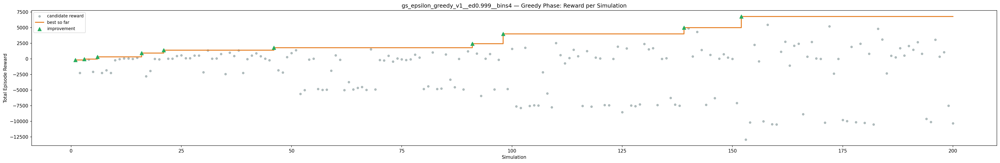
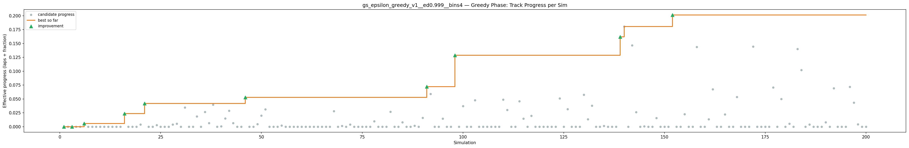
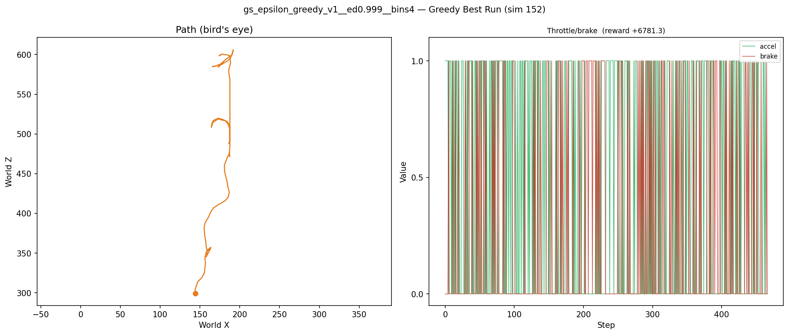
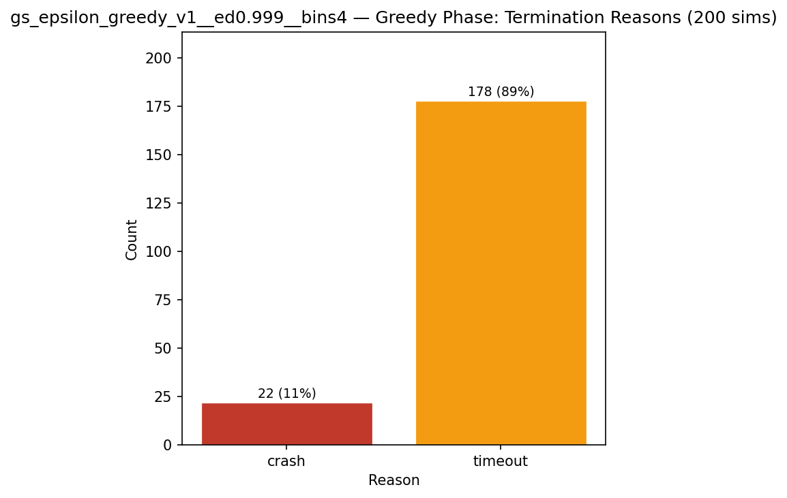
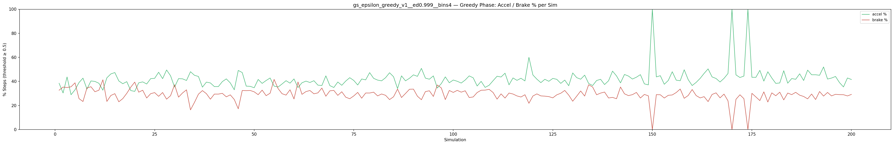
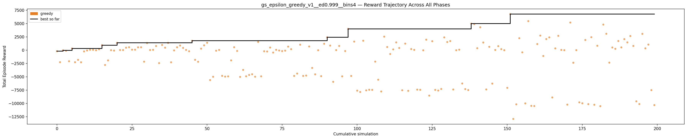

# Experiment: gs_epsilon_greedy_v1__ed0.999__bins4

**Track:** a03_centerline

## Timings

- **Start:** 2026-04-28 21:32:49
- **End:** 2026-04-28 22:11:24
- **Total runtime:** 38m 35.5s

| Phase | Duration |
|-------|----------|
| Greedy | 38m 34.5s |

## Run Parameters

### Training

| Parameter | Value |
|-----------|-------|
| track | a03_centerline |
| speed | 5.0 |
| n_sims | 200 |
| in_game_episode_s | 100.0 |
| mutation_scale | 0.05 |
| probe_s | 8.0 |
| cold_restarts | 1 |
| cold_sims | 1 |
| n_lidar_rays | 8 |
| policy_type | epsilon_greedy |
| alpha | 0.1 |
| gamma | 0.99 |
| epsilon | 0.95 |
| epsilon_min | 0.05 |
| epsilon_decay | 0.999 |
| n_bins | 4 |

### Reward Config

| Parameter | Value |
|-----------|-------|
| progress_weight | 20000.0 |
| centerline_weight | 0.0 |
| centerline_exp | 0.0 |
| speed_weight | 0.05 |
| step_penalty | -0.05 |
| finish_bonus | 5000.0 |
| finish_time_weight | -5.0 |
| par_time_s | 60.0 |
| accel_bonus | 0.5 |
| airborne_penalty | -1.0 |
| lidar_wall_weight | -5.0 |
| crash_threshold_m | 25.0 |
| track_name | a03_centerline |
| centerline_path | games/tmnf/tracks/a03_centerline.npy |

## Greedy Phase

Best reward: **+6781.3**

| Sim  | Reward   | Reason       | Result       |
|------|----------|--------------|-------------|
|    1 |   -194.4 | timeout      | **NEW BEST** |
|    2 |  -2252.4 | timeout      |  |
|    3 |    -28.2 | timeout      | **NEW BEST** |
|    4 |   -119.6 | crash        |  |
|    5 |  -2078.0 | timeout      |  |
|    6 |   +319.1 | timeout      | **NEW BEST** |
|    7 |  -2255.6 | timeout      |  |
|    8 |  -1821.1 | timeout      |  |
|    9 |  -2273.6 | timeout      |  |
|   10 |   -229.1 | timeout      |  |
|   11 |    -53.6 | timeout      |  |
|   12 |    +78.9 | timeout      |  |
|   13 |    +71.6 | timeout      |  |
|   14 |    -12.1 | timeout      |  |
|   15 |   +170.1 | crash        |  |
|   16 |   +940.9 | timeout      | **NEW BEST** |
|   17 |  -2776.8 | timeout      |  |
|   18 |  -1921.0 | timeout      |  |
|   19 |     -1.7 | crash        |  |
|   20 |    -76.2 | timeout      |  |
|   21 |  +1379.7 | timeout      | **NEW BEST** |
|   22 |    +30.1 | timeout      |  |
|   23 |    +23.7 | timeout      |  |
|   24 |   +461.3 | timeout      |  |
|   25 |   +553.3 | timeout      |  |
|   26 |    +96.2 | timeout      |  |
|   27 |    +90.3 | timeout      |  |
|   28 |   +534.4 | timeout      |  |
|   29 |   +547.1 | timeout      |  |
|   30 |  -2155.6 | timeout      |  |
|   31 |  +1343.4 | timeout      |  |
|   32 |    +30.4 | timeout      |  |
|   33 |    +69.3 | timeout      |  |
|   34 |   +778.6 | timeout      |  |
|   35 |  -2431.4 | timeout      |  |
|   36 |   +980.2 | timeout      |  |
|   37 |   +470.6 | timeout      |  |
|   38 |  +1365.9 | timeout      |  |
|   39 |  -2274.1 | timeout      |  |
|   40 |    -42.5 | timeout      |  |
|   41 |   +542.0 | timeout      |  |
|   42 |   +875.1 | timeout      |  |
|   43 |   +425.8 | timeout      |  |
|   44 |    +47.3 | timeout      |  |
|   45 |   -202.0 | timeout      |  |
|   46 |  +1763.5 | timeout      | **NEW BEST** |
|   47 |  -1813.3 | timeout      |  |
|   48 |  -2174.2 | timeout      |  |
|   49 |   +288.9 | timeout      |  |
|   50 |   +911.6 | timeout      |  |
|   51 |  +1389.1 | timeout      |  |
|   52 |  -5616.5 | timeout      |  |
|   53 |  -4998.5 | timeout      |  |
|   54 |    -99.8 | timeout      |  |
|   55 |    +46.4 | crash        |  |
|   56 |  -4825.5 | timeout      |  |
|   57 |  -4965.9 | timeout      |  |
|   58 |  -4920.1 | timeout      |  |
|   59 |  -1913.4 | timeout      |  |
|   60 |   +554.9 | timeout      |  |
|   61 |   -143.0 | crash        |  |
|   62 |  -5020.4 | timeout      |  |
|   63 |  -3705.1 | timeout      |  |
|   64 |  -4908.7 | timeout      |  |
|   65 |  -4657.6 | timeout      |  |
|   66 |  -4517.5 | timeout      |  |
|   67 |  -4986.7 | timeout      |  |
|   68 |  +1545.2 | timeout      |  |
|   69 |  -4916.9 | timeout      |  |
|   70 |   -201.0 | crash        |  |
|   71 |   -245.8 | timeout      |  |
|   72 |   +496.9 | timeout      |  |
|   73 |   -445.2 | timeout      |  |
|   74 |    +68.1 | timeout      |  |
|   75 |    -59.1 | timeout      |  |
|   76 |   -170.5 | timeout      |  |
|   77 |    -88.0 | timeout      |  |
|   78 |   +669.3 | timeout      |  |
|   79 |   +191.3 | crash        |  |
|   80 |  -4834.6 | timeout      |  |
|   81 |  -4394.9 | timeout      |  |
|   82 |  +1032.9 | timeout      |  |
|   83 |  -4837.9 | timeout      |  |
|   84 |  -4767.9 | timeout      |  |
|   85 |   +692.8 | timeout      |  |
|   86 |  -3331.4 | timeout      |  |
|   87 |  -4533.8 | timeout      |  |
|   88 |    -14.5 | timeout      |  |
|   89 |  -4883.5 | timeout      |  |
|   90 |  +1206.8 | timeout      |  |
|   91 |  +2425.8 | timeout      | **NEW BEST** |
|   92 |   +864.7 | timeout      |  |
|   93 |  -5941.0 | timeout      |  |
|   94 |    +16.4 | timeout      |  |
|   95 |   +795.4 | timeout      |  |
|   96 |  -4918.1 | timeout      |  |
|   97 |   -165.2 | timeout      |  |
|   98 |  +4003.9 | timeout      | **NEW BEST** |
|   99 |  -4845.7 | timeout      |  |
|  100 |  +1614.9 | timeout      |  |
|  101 |  -7601.4 | timeout      |  |
|  102 |  -7853.2 | timeout      |  |
|  103 |  +1778.1 | timeout      |  |
|  104 |  -7553.9 | timeout      |  |
|  105 |  -7437.3 | timeout      |  |
|  106 |  -7457.0 | timeout      |  |
|  107 |  -2147.4 | timeout      |  |
|  108 |  -5549.9 | timeout      |  |
|  109 |  -7761.8 | timeout      |  |
|  110 |  +2546.0 | timeout      |  |
|  111 |   +593.6 | timeout      |  |
|  112 |   -718.7 | timeout      |  |
|  113 |   +146.2 | timeout      |  |
|  114 |  +1462.7 | timeout      |  |
|  115 |   +411.8 | timeout      |  |
|  116 |  -7533.7 | timeout      |  |
|  117 |  +1236.6 | timeout      |  |
|  118 |  -7636.5 | timeout      |  |
|  119 |   +212.7 | crash        |  |
|  120 |    +62.8 | timeout      |  |
|  121 |  -7411.0 | timeout      |  |
|  122 |  -7449.8 | timeout      |  |
|  123 |    -21.8 | timeout      |  |
|  124 |  +1970.9 | timeout      |  |
|  125 |  -8533.0 | timeout      |  |
|  126 |  +1686.0 | timeout      |  |
|  127 |  -7462.3 | timeout      |  |
|  128 |  -7585.7 | timeout      |  |
|  129 |  -7291.5 | timeout      |  |
|  130 |  +2404.2 | timeout      |  |
|  131 |  +1529.7 | timeout      |  |
|  132 |  +1711.6 | timeout      |  |
|  133 |  -7390.1 | timeout      |  |
|  134 |    -11.5 | crash        |  |
|  135 |    +94.7 | crash        |  |
|  136 |  -6258.4 | timeout      |  |
|  137 |  -7314.6 | timeout      |  |
|  138 |  -7497.2 | timeout      |  |
|  139 |  +4987.7 | timeout      | **NEW BEST** |
|  140 |  +4905.3 | timeout      |  |
|  141 |   +373.4 | timeout      |  |
|  142 |  +4304.7 | timeout      |  |
|  143 |  +1439.0 | timeout      |  |
|  144 |  -7376.9 | timeout      |  |
|  145 |   +632.3 | timeout      |  |
|  146 |  -6280.5 | timeout      |  |
|  147 |    +41.5 | timeout      |  |
|  148 |   +755.2 | timeout      |  |
|  149 |   +195.2 | crash        |  |
|  150 |     -3.2 | crash        |  |
|  151 |  -7074.7 | timeout      |  |
|  152 |  +6781.3 | timeout      | **NEW BEST** |
|  153 | -12923.2 | timeout      |  |
|  154 | -10175.4 | timeout      |  |
|  155 |  +2249.7 | timeout      |  |
|  156 |   -408.5 | crash        |  |
|  157 | -10000.1 | timeout      |  |
|  158 |  +5460.2 | timeout      |  |
|  159 | -10468.1 | timeout      |  |
|  160 | -10494.8 | timeout      |  |
|  161 |  +1151.6 | timeout      |  |
|  162 |  +2742.1 | timeout      |  |
|  163 |  -1090.6 | crash        |  |
|  164 |  +2091.1 | timeout      |  |
|  165 |  +2407.3 | timeout      |  |
|  166 |  -8881.1 | timeout      |  |
|  167 |   +337.1 | crash        |  |
|  168 |  +2694.6 | timeout      |  |
|  169 |    +52.3 | crash        |  |
|  170 |     -1.8 | crash        |  |
|  171 | -10226.4 | timeout      |  |
|  172 |  +5195.9 | timeout      |  |
|  173 |  -2357.8 | crash        |  |
|  174 |     +3.4 | crash        |  |
|  175 |  -9807.3 | timeout      |  |
|  176 |  -9979.7 | timeout      |  |
|  177 |  +1915.6 | crash        |  |
|  178 | -10140.7 | timeout      |  |
|  179 |  +2440.0 | timeout      |  |
|  180 | -10255.9 | timeout      |  |
|  181 |   +830.5 | timeout      |  |
|  182 | -10522.5 | timeout      |  |
|  183 |  +4810.8 | timeout      |  |
|  184 |  +3086.1 | timeout      |  |
|  185 |  -2340.3 | timeout      |  |
|  186 |   +508.1 | timeout      |  |
|  187 |   +257.6 | timeout      |  |
|  188 |  +1723.8 | crash        |  |
|  189 |   +525.3 | timeout      |  |
|  190 |  +2073.4 | timeout      |  |
|  191 |  +1464.6 | timeout      |  |
|  192 |  +2663.1 | timeout      |  |
|  193 |   +798.8 | crash        |  |
|  194 |  -9609.1 | timeout      |  |
|  195 | -10124.3 | timeout      |  |
|  196 |  +3066.5 | timeout      |  |
|  197 |   +348.3 | timeout      |  |
|  198 |  +1054.7 | timeout      |  |
|  199 |  -7507.3 | timeout      |  |
|  200 | -10320.6 | timeout      |  |

## Additional Plots

