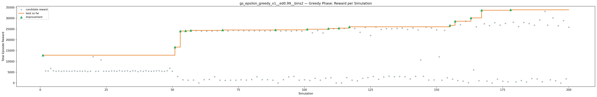
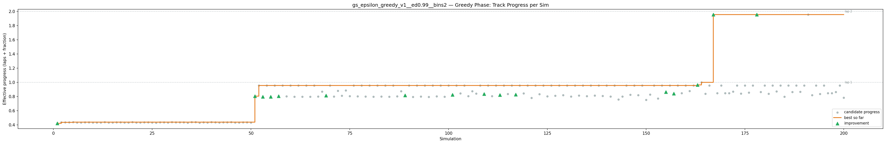
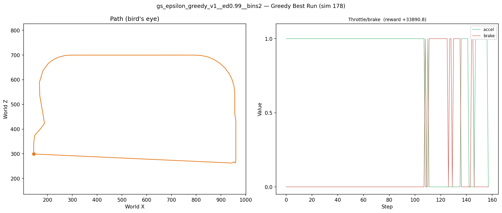
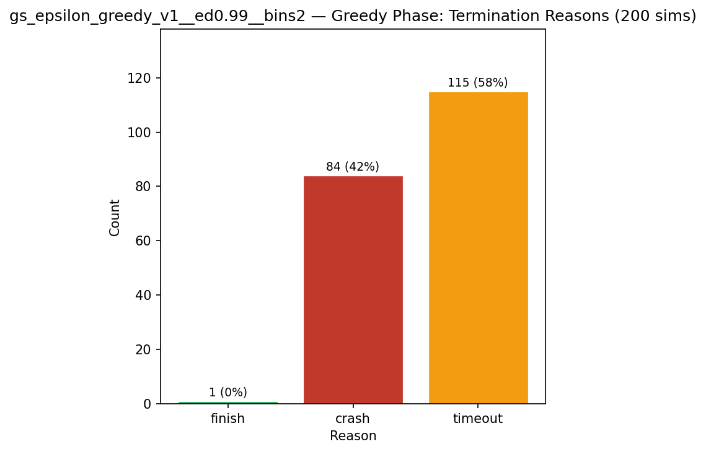
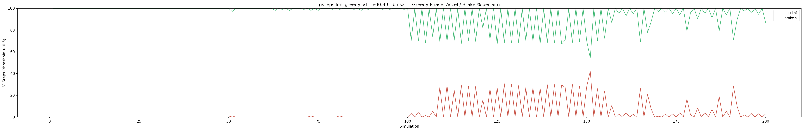
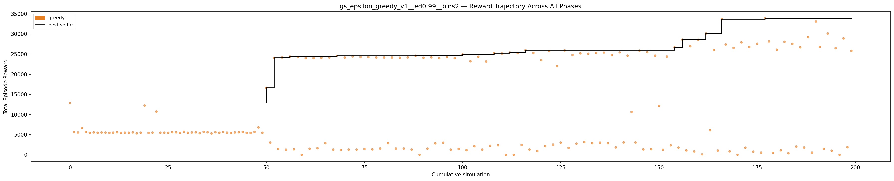

# Experiment: gs_epsilon_greedy_v1__ed0.99__bins2

**Track:** a03_centerline

## Timings

- **Start:** 2026-04-28 13:49:34
- **End:** 2026-04-28 14:01:51
- **Total runtime:** 12m 17.5s

| Phase | Duration |
|-------|----------|
| Greedy | 12m 16.5s |

## Run Parameters

### Training

| Parameter | Value |
|-----------|-------|
| track | a03_centerline |
| speed | 10.0 |
| n_sims | 200 |
| in_game_episode_s | 100.0 |
| mutation_scale | 0.05 |
| probe_s | 8.0 |
| cold_restarts | 1 |
| cold_sims | 1 |
| n_lidar_rays | 8 |
| policy_type | epsilon_greedy |
| alpha | 0.1 |
| gamma | 0.99 |
| epsilon | 0.95 |
| epsilon_min | 0.05 |
| epsilon_decay | 0.99 |
| n_bins | 2 |

### Reward Config

| Parameter | Value |
|-----------|-------|
| progress_weight | 20000.0 |
| centerline_weight | 0.0 |
| centerline_exp | 0.0 |
| speed_weight | 0.05 |
| step_penalty | -0.05 |
| finish_bonus | 5000.0 |
| finish_time_weight | -5.0 |
| par_time_s | 60.0 |
| accel_bonus | 0.5 |
| airborne_penalty | -1.0 |
| lidar_wall_weight | -5.0 |
| crash_threshold_m | 25.0 |
| track_name | a03_centerline |
| centerline_path | games/tmnf/tracks/a03_centerline.npy |

## Greedy Phase

Best reward: **+33890.8**

| Sim  | Reward   | Reason       | Result       |
|------|----------|--------------|-------------|
|    1 | +12855.1 | timeout      | **NEW BEST** |
|    2 |  +5639.7 | timeout      |  |
|    3 |  +5542.5 | timeout      |  |
|    4 |  +6727.3 | timeout      |  |
|    5 |  +5659.0 | timeout      |  |
|    6 |  +5443.0 | timeout      |  |
|    7 |  +5563.9 | timeout      |  |
|    8 |  +5457.6 | timeout      |  |
|    9 |  +5529.0 | timeout      |  |
|   10 |  +5507.6 | timeout      |  |
|   11 |  +5435.8 | timeout      |  |
|   12 |  +5494.7 | timeout      |  |
|   13 |  +5597.1 | timeout      |  |
|   14 |  +5446.5 | timeout      |  |
|   15 |  +5492.0 | timeout      |  |
|   16 |  +5479.6 | timeout      |  |
|   17 |  +5563.9 | timeout      |  |
|   18 |  +5329.2 | timeout      |  |
|   19 |  +5483.2 | timeout      |  |
|   20 | +12222.7 | timeout      |  |
|   21 |  +5417.1 | timeout      |  |
|   22 |  +5501.2 | timeout      |  |
|   23 | +10739.2 | timeout      |  |
|   24 |  +5478.7 | timeout      |  |
|   25 |  +5484.5 | timeout      |  |
|   26 |  +5455.1 | timeout      |  |
|   27 |  +5616.3 | timeout      |  |
|   28 |  +5577.1 | timeout      |  |
|   29 |  +5421.0 | timeout      |  |
|   30 |  +5715.0 | timeout      |  |
|   31 |  +5470.0 | timeout      |  |
|   32 |  +5541.5 | timeout      |  |
|   33 |  +5588.1 | timeout      |  |
|   34 |  +5367.3 | timeout      |  |
|   35 |  +5685.0 | timeout      |  |
|   36 |  +5599.0 | timeout      |  |
|   37 |  +5307.2 | timeout      |  |
|   38 |  +5602.7 | timeout      |  |
|   39 |  +5457.1 | timeout      |  |
|   40 |  +5657.5 | timeout      |  |
|   41 |  +5496.5 | timeout      |  |
|   42 |  +5403.8 | timeout      |  |
|   43 |  +5551.3 | timeout      |  |
|   44 |  +5596.8 | timeout      |  |
|   45 |  +5666.8 | timeout      |  |
|   46 |  +5426.7 | timeout      |  |
|   47 |  +5417.5 | timeout      |  |
|   48 |  +5678.7 | timeout      |  |
|   49 |  +6846.7 | timeout      |  |
|   50 |  +5460.2 | timeout      |  |
|   51 | +16629.8 | timeout      | **NEW BEST** |
|   52 |  +3064.5 | crash        |  |
|   53 | +24082.4 | timeout      | **NEW BEST** |
|   54 |  +1478.8 | crash        |  |
|   55 | +24160.3 | timeout      | **NEW BEST** |
|   56 |  +1313.8 | crash        |  |
|   57 | +24375.8 | timeout      | **NEW BEST** |
|   58 |  +1400.4 | crash        |  |
|   59 | +24269.7 | timeout      |  |
|   60 |    +21.6 | crash        |  |
|   61 | +24020.1 | timeout      |  |
|   62 |  +1536.0 | crash        |  |
|   63 | +24013.1 | timeout      |  |
|   64 |  +1669.8 | crash        |  |
|   65 | +24078.6 | timeout      |  |
|   66 |  +2919.8 | crash        |  |
|   67 | +24156.7 | timeout      |  |
|   68 |  +1329.8 | crash        |  |
|   69 | +24552.5 | timeout      | **NEW BEST** |
|   70 |  +1212.8 | crash        |  |
|   71 | +24147.1 | timeout      |  |
|   72 |  +1337.8 | crash        |  |
|   73 | +24432.3 | timeout      |  |
|   74 |  +1327.5 | crash        |  |
|   75 | +24286.6 | timeout      |  |
|   76 |  +1474.8 | crash        |  |
|   77 | +24252.6 | timeout      |  |
|   78 |  +1377.4 | crash        |  |
|   79 | +24163.0 | timeout      |  |
|   80 |  +1593.2 | crash        |  |
|   81 | +24155.8 | timeout      |  |
|   82 |  +2921.6 | crash        |  |
|   83 | +24153.5 | timeout      |  |
|   84 |  +1580.6 | crash        |  |
|   85 | +24106.6 | timeout      |  |
|   86 |  +1589.1 | crash        |  |
|   87 | +24177.1 | timeout      |  |
|   88 |  +1339.1 | crash        |  |
|   89 | +24594.1 | timeout      | **NEW BEST** |
|   90 |    +20.2 | crash        |  |
|   91 | +24086.5 | timeout      |  |
|   92 |  +1562.5 | crash        |  |
|   93 | +24190.1 | timeout      |  |
|   94 |  +2872.0 | crash        |  |
|   95 | +23995.1 | timeout      |  |
|   96 |  +3024.6 | crash        |  |
|   97 | +24243.6 | timeout      |  |
|   98 |  +1319.6 | crash        |  |
|   99 | +24011.3 | timeout      |  |
|  100 |  +1482.4 | crash        |  |
|  101 | +24913.4 | timeout      | **NEW BEST** |
|  102 |  +1198.5 | crash        |  |
|  103 | +23231.6 | timeout      |  |
|  104 |  +2170.1 | crash        |  |
|  105 | +24339.0 | timeout      |  |
|  106 |  +1328.8 | crash        |  |
|  107 | +23172.9 | timeout      |  |
|  108 |  +2264.6 | crash        |  |
|  109 | +25234.1 | timeout      | **NEW BEST** |
|  110 |  +2406.2 | crash        |  |
|  111 | +25137.1 | timeout      |  |
|  112 |     +9.4 | crash        |  |
|  113 | +25428.5 | timeout      | **NEW BEST** |
|  114 |    +17.5 | crash        |  |
|  115 | +25265.4 | timeout      |  |
|  116 |  +2464.8 | crash        |  |
|  117 | +26021.1 | timeout      | **NEW BEST** |
|  118 |  +1341.1 | crash        |  |
|  119 | +25280.3 | timeout      |  |
|  120 |   +981.2 | crash        |  |
|  121 | +23520.6 | crash        |  |
|  122 |  +2189.1 | crash        |  |
|  123 | +25801.5 | timeout      |  |
|  124 |  +2562.1 | crash        |  |
|  125 | +22049.7 | timeout      |  |
|  126 |  +3050.6 | crash        |  |
|  127 | +25975.3 | timeout      |  |
|  128 |  +1745.5 | crash        |  |
|  129 | +24784.6 | timeout      |  |
|  130 |  +2793.7 | crash        |  |
|  131 | +25183.9 | timeout      |  |
|  132 |  +3180.9 | crash        |  |
|  133 | +25079.2 | timeout      |  |
|  134 |  +2921.2 | crash        |  |
|  135 | +25278.2 | timeout      |  |
|  136 |  +3037.3 | crash        |  |
|  137 | +25399.8 | timeout      |  |
|  138 |  +2906.0 | crash        |  |
|  139 | +24769.8 | timeout      |  |
|  140 |  +1867.7 | crash        |  |
|  141 | +25444.0 | timeout      |  |
|  142 |  +3096.2 | crash        |  |
|  143 | +24609.9 | timeout      |  |
|  144 | +10649.2 | timeout      |  |
|  145 |  +3082.2 | crash        |  |
|  146 | +25924.8 | timeout      |  |
|  147 |  +1375.1 | crash        |  |
|  148 | +25499.7 | timeout      |  |
|  149 |  +1445.4 | crash        |  |
|  150 | +24610.6 | timeout      |  |
|  151 | +12146.5 | timeout      |  |
|  152 |  +1294.7 | crash        |  |
|  153 | +24384.8 | timeout      |  |
|  154 |  +2393.3 | crash        |  |
|  155 | +26701.6 | timeout      | **NEW BEST** |
|  156 |  +1820.0 | crash        |  |
|  157 | +28612.8 | crash        | **NEW BEST** |
|  158 |  +1137.2 | crash        |  |
|  159 | +27003.8 | crash        |  |
|  160 |   +879.3 | crash        |  |
|  161 | +28580.3 | timeout      |  |
|  162 |   +118.0 | crash        |  |
|  163 | +30129.5 | timeout      | **NEW BEST** |
|  164 |  +6098.2 | finish       |  |
|  165 | +26053.2 | crash        |  |
|  166 |  +1093.0 | crash        |  |
|  167 | +33732.8 | crash        | **NEW BEST** |
|  168 | +27424.7 | timeout      |  |
|  169 |   +899.6 | crash        |  |
|  170 | +26568.5 | crash        |  |
|  171 |    +16.1 | crash        |  |
|  172 | +27944.6 | timeout      |  |
|  173 |  +1794.0 | crash        |  |
|  174 | +26806.6 | crash        |  |
|  175 |   +823.0 | crash        |  |
|  176 | +27606.0 | timeout      |  |
|  177 |   +588.2 | crash        |  |
|  178 | +33890.8 | crash        | **NEW BEST** |
|  179 | +28175.0 | timeout      |  |
|  180 |   +519.6 | crash        |  |
|  181 | +26136.1 | crash        |  |
|  182 |  +1160.2 | crash        |  |
|  183 | +28071.2 | timeout      |  |
|  184 |   +433.1 | crash        |  |
|  185 | +27558.8 | crash        |  |
|  186 |  +2079.1 | crash        |  |
|  187 | +26736.0 | timeout      |  |
|  188 |  +1840.5 | crash        |  |
|  189 | +29239.4 | timeout      |  |
|  190 |   +587.7 | crash        |  |
|  191 | +33133.4 | crash        |  |
|  192 | +26806.7 | crash        |  |
|  193 |  +1501.8 | crash        |  |
|  194 | +30125.9 | timeout      |  |
|  195 |  +1056.5 | crash        |  |
|  196 | +26519.5 | crash        |  |
|  197 |     -8.0 | crash        |  |
|  198 | +28924.6 | timeout      |  |
|  199 |  +1917.5 | crash        |  |
|  200 | +25850.6 | timeout      |  |

## Additional Plots

