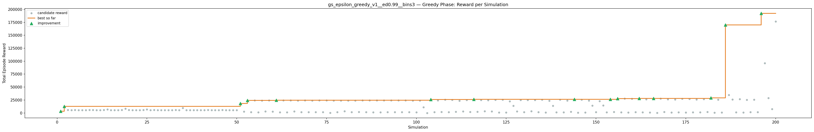
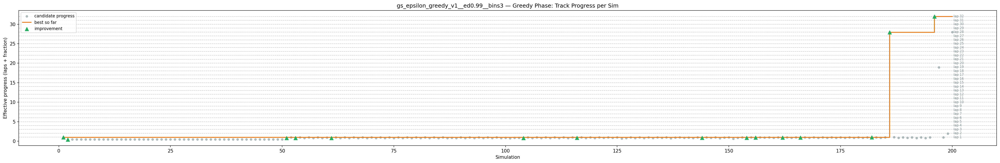
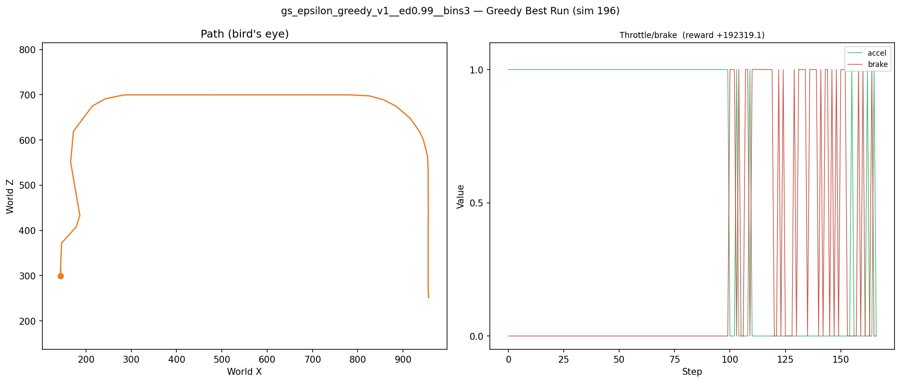
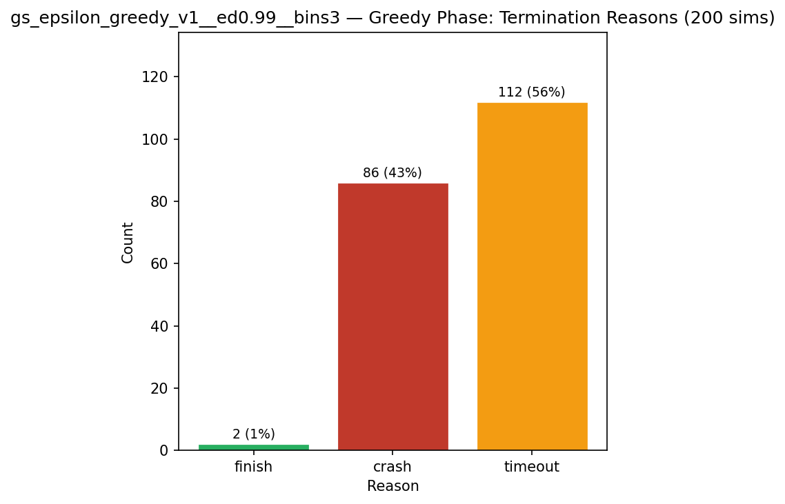
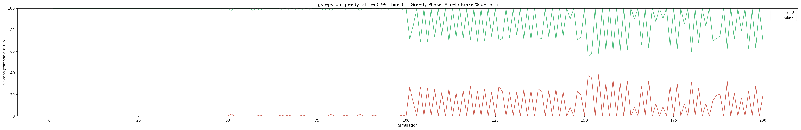
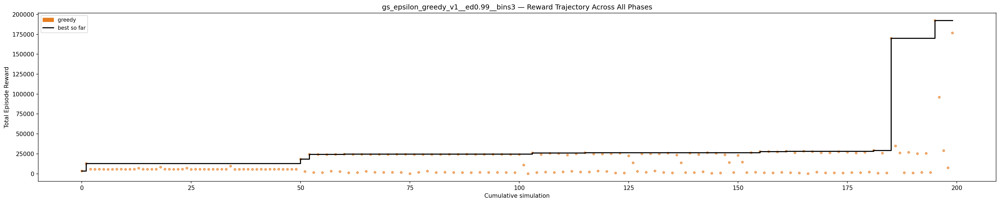

# Experiment: gs_epsilon_greedy_v1__ed0.99__bins3

**Track:** a03_centerline

## Timings

- **Start:** 2026-04-28 14:02:03
- **End:** 2026-04-28 14:16:16
- **Total runtime:** 14m 13.2s

| Phase | Duration |
|-------|----------|
| Greedy | 14m 12.2s |

## Run Parameters

### Training

| Parameter | Value |
|-----------|-------|
| track | a03_centerline |
| speed | 10.0 |
| n_sims | 200 |
| in_game_episode_s | 100.0 |
| mutation_scale | 0.05 |
| probe_s | 8.0 |
| cold_restarts | 1 |
| cold_sims | 1 |
| n_lidar_rays | 8 |
| policy_type | epsilon_greedy |
| alpha | 0.1 |
| gamma | 0.99 |
| epsilon | 0.95 |
| epsilon_min | 0.05 |
| epsilon_decay | 0.99 |
| n_bins | 3 |

### Reward Config

| Parameter | Value |
|-----------|-------|
| progress_weight | 20000.0 |
| centerline_weight | 0.0 |
| centerline_exp | 0.0 |
| speed_weight | 0.05 |
| step_penalty | -0.05 |
| finish_bonus | 5000.0 |
| finish_time_weight | -5.0 |
| par_time_s | 60.0 |
| accel_bonus | 0.5 |
| airborne_penalty | -1.0 |
| lidar_wall_weight | -5.0 |
| crash_threshold_m | 25.0 |
| track_name | a03_centerline |
| centerline_path | games/tmnf/tracks/a03_centerline.npy |

## Greedy Phase

Best reward: **+192319.1**

| Sim  | Reward   | Reason       | Result       |
|------|----------|--------------|-------------|
|    1 |  +3406.5 | crash        | **NEW BEST** |
|    2 | +12751.9 | timeout      | **NEW BEST** |
|    3 |  +5641.4 | timeout      |  |
|    4 |  +5468.5 | timeout      |  |
|    5 |  +5601.1 | timeout      |  |
|    6 |  +5491.9 | timeout      |  |
|    7 |  +5378.9 | timeout      |  |
|    8 |  +5442.5 | timeout      |  |
|    9 |  +5625.4 | timeout      |  |
|   10 |  +5662.2 | timeout      |  |
|   11 |  +5407.2 | timeout      |  |
|   12 |  +5509.8 | timeout      |  |
|   13 |  +5622.3 | timeout      |  |
|   14 |  +6809.1 | timeout      |  |
|   15 |  +5570.3 | timeout      |  |
|   16 |  +5537.9 | timeout      |  |
|   17 |  +5529.6 | timeout      |  |
|   18 |  +5596.5 | timeout      |  |
|   19 |  +8215.4 | timeout      |  |
|   20 |  +5651.3 | timeout      |  |
|   21 |  +5583.5 | timeout      |  |
|   22 |  +5445.4 | timeout      |  |
|   23 |  +5556.4 | timeout      |  |
|   24 |  +5643.8 | timeout      |  |
|   25 |  +6909.8 | timeout      |  |
|   26 |  +5352.5 | timeout      |  |
|   27 |  +5624.6 | timeout      |  |
|   28 |  +5525.2 | timeout      |  |
|   29 |  +5552.2 | timeout      |  |
|   30 |  +5437.6 | timeout      |  |
|   31 |  +5553.5 | timeout      |  |
|   32 |  +5484.7 | timeout      |  |
|   33 |  +5596.0 | timeout      |  |
|   34 |  +5555.8 | timeout      |  |
|   35 |  +9505.8 | timeout      |  |
|   36 |  +5330.9 | timeout      |  |
|   37 |  +5432.3 | timeout      |  |
|   38 |  +5578.9 | timeout      |  |
|   39 |  +5578.4 | timeout      |  |
|   40 |  +5392.2 | timeout      |  |
|   41 |  +5456.3 | timeout      |  |
|   42 |  +5632.2 | timeout      |  |
|   43 |  +5355.1 | timeout      |  |
|   44 |  +5576.2 | timeout      |  |
|   45 |  +5538.7 | timeout      |  |
|   46 |  +5663.2 | timeout      |  |
|   47 |  +5472.7 | timeout      |  |
|   48 |  +5497.0 | timeout      |  |
|   49 |  +5506.2 | timeout      |  |
|   50 |  +5501.0 | timeout      |  |
|   51 | +18269.0 | timeout      | **NEW BEST** |
|   52 |  +2722.3 | crash        |  |
|   53 | +24318.6 | timeout      | **NEW BEST** |
|   54 |  +1456.7 | crash        |  |
|   55 | +24097.3 | timeout      |  |
|   56 |  +1327.3 | crash        |  |
|   57 | +23926.8 | timeout      |  |
|   58 |  +3127.7 | crash        |  |
|   59 | +24223.8 | timeout      |  |
|   60 |  +2630.1 | crash        |  |
|   61 | +24490.8 | timeout      | **NEW BEST** |
|   62 |  +1109.2 | crash        |  |
|   63 | +24084.8 | timeout      |  |
|   64 |  +1372.9 | crash        |  |
|   65 | +24163.4 | timeout      |  |
|   66 |  +2928.5 | crash        |  |
|   67 | +23991.7 | timeout      |  |
|   68 |  +1712.2 | crash        |  |
|   69 | +24132.8 | timeout      |  |
|   70 |  +1582.8 | crash        |  |
|   71 | +24032.5 | timeout      |  |
|   72 |  +1664.0 | crash        |  |
|   73 | +24258.4 | timeout      |  |
|   74 |  +1553.5 | crash        |  |
|   75 | +24232.3 | timeout      |  |
|   76 |    +15.2 | crash        |  |
|   77 | +23978.9 | timeout      |  |
|   78 |  +1668.5 | crash        |  |
|   79 | +23999.7 | timeout      |  |
|   80 |  +3184.9 | crash        |  |
|   81 | +24065.5 | timeout      |  |
|   82 |  +1426.7 | crash        |  |
|   83 | +24057.3 | timeout      |  |
|   84 |  +1764.5 | crash        |  |
|   85 | +24283.1 | timeout      |  |
|   86 |  +1488.3 | crash        |  |
|   87 | +24195.9 | timeout      |  |
|   88 |  +1349.4 | crash        |  |
|   89 | +24394.1 | timeout      |  |
|   90 |  +1278.7 | crash        |  |
|   91 | +24111.7 | timeout      |  |
|   92 |  +1636.9 | crash        |  |
|   93 | +24174.9 | timeout      |  |
|   94 |  +1508.5 | crash        |  |
|   95 | +24237.8 | timeout      |  |
|   96 |  +1561.2 | crash        |  |
|   97 | +24236.8 | timeout      |  |
|   98 |  +1476.1 | crash        |  |
|   99 | +24058.5 | timeout      |  |
|  100 |  +1334.2 | crash        |  |
|  101 | +24008.3 | timeout      |  |
|  102 | +10841.7 | crash        |  |
|  103 |     +5.5 | crash        |  |
|  104 | +26108.8 | timeout      | **NEW BEST** |
|  105 |  +1425.8 | crash        |  |
|  106 | +24117.5 | timeout      |  |
|  107 |  +1999.3 | crash        |  |
|  108 | +25519.9 | timeout      |  |
|  109 |  +1474.3 | crash        |  |
|  110 | +25278.9 | timeout      |  |
|  111 |  +2263.0 | crash        |  |
|  112 | +23391.8 | timeout      |  |
|  113 |  +3022.9 | crash        |  |
|  114 | +24965.2 | timeout      |  |
|  115 |  +2097.6 | crash        |  |
|  116 | +26260.7 | timeout      | **NEW BEST** |
|  117 |  +2110.9 | crash        |  |
|  118 | +24808.3 | timeout      |  |
|  119 |  +3325.1 | crash        |  |
|  120 | +24762.2 | timeout      |  |
|  121 |  +2802.3 | crash        |  |
|  122 | +25132.1 | timeout      |  |
|  123 |   +875.3 | crash        |  |
|  124 | +25682.0 | timeout      |  |
|  125 |   +853.6 | crash        |  |
|  126 | +22435.6 | timeout      |  |
|  127 | +13624.4 | timeout      |  |
|  128 |  +2923.8 | crash        |  |
|  129 | +24984.7 | timeout      |  |
|  130 |  +1714.9 | crash        |  |
|  131 | +25066.5 | timeout      |  |
|  132 |  +3415.9 | crash        |  |
|  133 | +25015.0 | timeout      |  |
|  134 |  +1525.2 | crash        |  |
|  135 | +25796.8 | crash        |  |
|  136 |   +986.2 | crash        |  |
|  137 | +23381.2 | timeout      |  |
|  138 | +13646.7 | timeout      |  |
|  139 |  +1385.6 | crash        |  |
|  140 | +25814.2 | timeout      |  |
|  141 |  +1368.8 | crash        |  |
|  142 | +24037.1 | timeout      |  |
|  143 |  +2396.0 | crash        |  |
|  144 | +26379.9 | timeout      | **NEW BEST** |
|  145 |   +464.6 | crash        |  |
|  146 | +25661.1 | crash        |  |
|  147 |   +846.0 | crash        |  |
|  148 | +23746.5 | timeout      |  |
|  149 | +13996.4 | timeout      |  |
|  150 |  +1469.6 | crash        |  |
|  151 | +22968.0 | timeout      |  |
|  152 | +14548.6 | crash        |  |
|  153 |  +1400.4 | crash        |  |
|  154 | +26381.7 | timeout      | **NEW BEST** |
|  155 |  +1807.0 | crash        |  |
|  156 | +27812.0 | timeout      | **NEW BEST** |
|  157 |  +1130.8 | crash        |  |
|  158 | +27749.4 | timeout      |  |
|  159 |   +966.1 | crash        |  |
|  160 | +27343.2 | timeout      |  |
|  161 |  +1652.1 | crash        |  |
|  162 | +28193.1 | timeout      | **NEW BEST** |
|  163 |  +1207.4 | crash        |  |
|  164 | +26261.4 | crash        |  |
|  165 |   +850.9 | crash        |  |
|  166 | +28249.8 | timeout      | **NEW BEST** |
|  167 |    +17.1 | crash        |  |
|  168 | +27673.9 | timeout      |  |
|  169 |  +1951.5 | crash        |  |
|  170 | +26276.6 | crash        |  |
|  171 |  +1004.2 | crash        |  |
|  172 | +26111.2 | crash        |  |
|  173 |  +1058.3 | crash        |  |
|  174 | +27522.7 | crash        |  |
|  175 |   +825.7 | crash        |  |
|  176 | +27016.0 | timeout      |  |
|  177 |  +1350.1 | crash        |  |
|  178 | +26003.1 | crash        |  |
|  179 |  +1242.6 | crash        |  |
|  180 | +26819.4 | timeout      |  |
|  181 |  +2037.5 | crash        |  |
|  182 | +29259.1 | timeout      | **NEW BEST** |
|  183 |   +580.3 | crash        |  |
|  184 | +25782.0 | crash        |  |
|  185 |   +872.6 | crash        |  |
|  186 | +170038.3 | crash        | **NEW BEST** |
|  187 | +34829.1 | finish       |  |
|  188 | +26051.5 | crash        |  |
|  189 |  +1223.2 | crash        |  |
|  190 | +26793.7 | timeout      |  |
|  191 |   +879.8 | crash        |  |
|  192 | +25152.0 | crash        |  |
|  193 |  +1590.5 | crash        |  |
|  194 | +25520.3 | crash        |  |
|  195 |  +1500.0 | crash        |  |
|  196 | +192319.1 | timeout      | **NEW BEST** |
|  197 | +96000.7 | crash        |  |
|  198 | +28936.4 | timeout      |  |
|  199 |  +7401.1 | crash        |  |
|  200 | +176726.7 | finish       |  |

## Additional Plots

