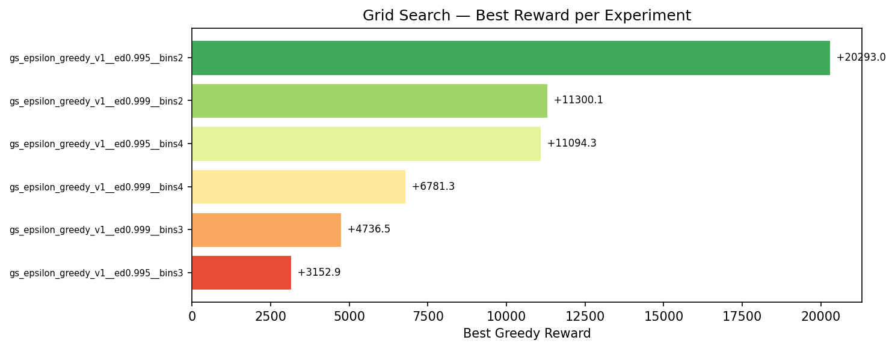
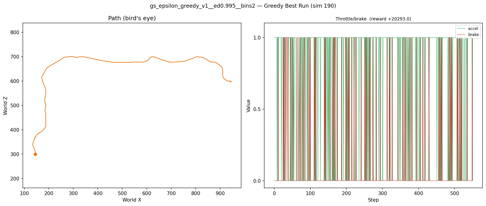
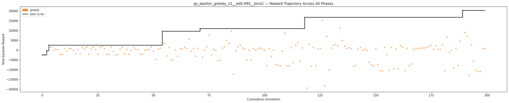
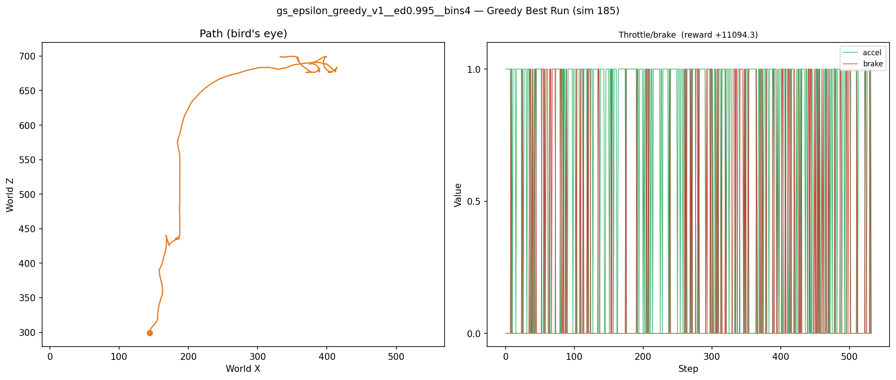
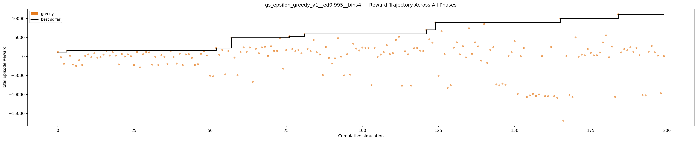

# Grid Search Summary: gs_epsilon_greedy_v1

6 experiments, ranked by best greedy reward.

## Rankings

| Rank | Experiment | Best Reward | Improvements | First Improv. Sim | Accel % | Greedy Time |
|------|-----------|-------------|--------------|-------------------|---------|-------------|
| 1 | gs_epsilon_greedy_v1__ed0.995__bins2 | +20293.0 | 7 | 1 | 71% | 37m 05.7s |
| 2 | gs_epsilon_greedy_v1__ed0.999__bins2 | +11300.1 | 10 | 1 | 53% | 38m 37.8s |
| 3 | gs_epsilon_greedy_v1__ed0.995__bins4 | +11094.3 | 10 | 1 | 65% | 35m 58.4s |
| 4 | gs_epsilon_greedy_v1__ed0.999__bins4 | +6781.3 | 10 | 1 | 45% | 38m 34.5s |
| 5 | gs_epsilon_greedy_v1__ed0.999__bins3 | +4736.5 | 11 | 1 | 34% | 40m 28.2s |
| 6 | gs_epsilon_greedy_v1__ed0.995__bins3 | +3152.9 | 11 | 1 | 40% | 41m 04.3s |

---

## 1. gs_epsilon_greedy_v1__ed0.995__bins2

**Best reward: +20293.0**

| Param | Value |
|---|---|
| `epsilon_decay` | 0.995 |
| `n_bins` | 2 |

| Stat | Value |
|---|---|
| Greedy improvements | 7 |
| First improvement (sim) | 1 |
| Accel % of best run | 71.3% |
| Greedy runtime | 37m 05.7s |

---

## 2. gs_epsilon_greedy_v1__ed0.999__bins2

**Best reward: +11300.1**

| Param | Value |
|---|---|
| `epsilon_decay` | 0.999 |
| `n_bins` | 2 |

| Stat | Value |
|---|---|
| Greedy improvements | 10 |
| First improvement (sim) | 1 |
| Accel % of best run | 52.6% |
| Greedy runtime | 38m 37.8s |

---

## 3. gs_epsilon_greedy_v1__ed0.995__bins4

**Best reward: +11094.3**

| Param | Value |
|---|---|
| `epsilon_decay` | 0.995 |
| `n_bins` | 4 |

| Stat | Value |
|---|---|
| Greedy improvements | 10 |
| First improvement (sim) | 1 |
| Accel % of best run | 64.7% |
| Greedy runtime | 35m 58.4s |

---

## 4. gs_epsilon_greedy_v1__ed0.999__bins4

**Best reward: +6781.3**

| Param | Value |
|---|---|
| `epsilon_decay` | 0.999 |
| `n_bins` | 4 |

| Stat | Value |
|---|---|
| Greedy improvements | 10 |
| First improvement (sim) | 1 |
| Accel % of best run | 44.8% |
| Greedy runtime | 38m 34.5s |

---

## 5. gs_epsilon_greedy_v1__ed0.999__bins3

**Best reward: +4736.5**

| Param | Value |
|---|---|
| `epsilon_decay` | 0.999 |
| `n_bins` | 3 |

| Stat | Value |
|---|---|
| Greedy improvements | 11 |
| First improvement (sim) | 1 |
| Accel % of best run | 34.1% |
| Greedy runtime | 40m 28.2s |

---

## 6. gs_epsilon_greedy_v1__ed0.995__bins3

**Best reward: +3152.9**

| Param | Value |
|---|---|
| `epsilon_decay` | 0.995 |
| `n_bins` | 3 |

| Stat | Value |
|---|---|
| Greedy improvements | 11 |
| First improvement (sim) | 1 |
| Accel % of best run | 40.3% |
| Greedy runtime | 41m 04.3s |

