# Experiment: gs_hill_climbing_v1__ms0.01__mshare0.5__n_lidar_rays0

**Track:** a03_centerline

## Timings

- **Start:** 2026-05-03 13:12:59
- **End:** 2026-05-03 15:36:30
- **Total runtime:** 2h 23m 30.2s

| Phase | Duration |
|-------|----------|
| Probe | 11.4s |
| Cold-start | 8m 01.6s |
| Greedy | 2h 15m 16.3s |

## Run Parameters

### Training

| Parameter | Value |
|-----------|-------|
| track | a03_centerline |
| speed | 5.0 |
| n_sims | 200 |
| in_game_episode_s | 120.0 |
| probe_s | 8.0 |
| cold_sims | 5 |
| cold_restarts | 5 |
| policy_type | hill_climbing |
| mutation_scale | 0.01 |
| mutation_share | 0.5 |
| n_lidar_rays | 0 |
| policy_params | {} |

### Reward Config

| Parameter | Value |
|-----------|-------|
| progress_weight | 10000.0 |
| centerline_weight | 0.0 |
| centerline_exp | 0.0 |
| speed_weight | 0.042 |
| step_penalty | -0.05 |
| finish_bonus | 5000.0 |
| finish_time_weight | -5.0 |
| par_time_s | 60.0 |
| accel_bonus | 0.5 |
| airborne_penalty | -1.0 |
| lidar_wall_weight | -5.0 |
| crash_threshold_m | 25.0 |
| track_name | a03_centerline |
| centerline_path | games/tmnf/tracks/a03_centerline.npy |
| curiosity_type | none |
| curiosity_weight | 0.0 |
| curiosity_feature_dim | 8 |
| curiosity_hidden_size | 32 |
| curiosity_lr | 0.001 |
| curiosity_beta | 0.2 |
| curiosity_seed | 0 |

## Probe Phase

Best probe reward: **+1721.9**

| Action | Name            | Reward   |          |
|--------|-----------------|----------|----------|
|      0 | brake left      |   -862.3 |  |
|      1 | brake           |   -379.5 |  |
|      2 | brake right     |    -34.6 |  |
|      3 | accel left      |   +492.8 |  |
|      4 | accel           |  +1721.9 | ← best |
|      5 | accel right     |   +274.2 |  |

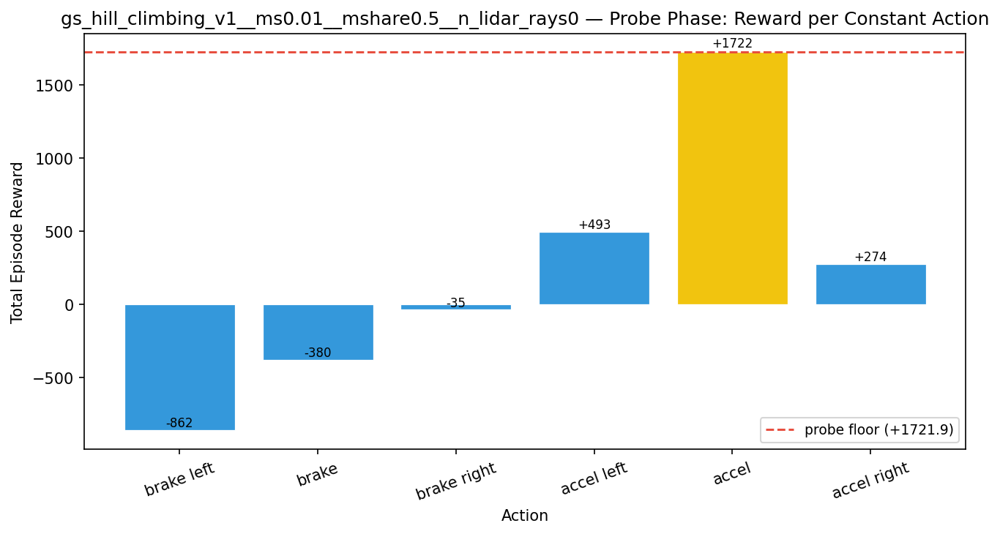

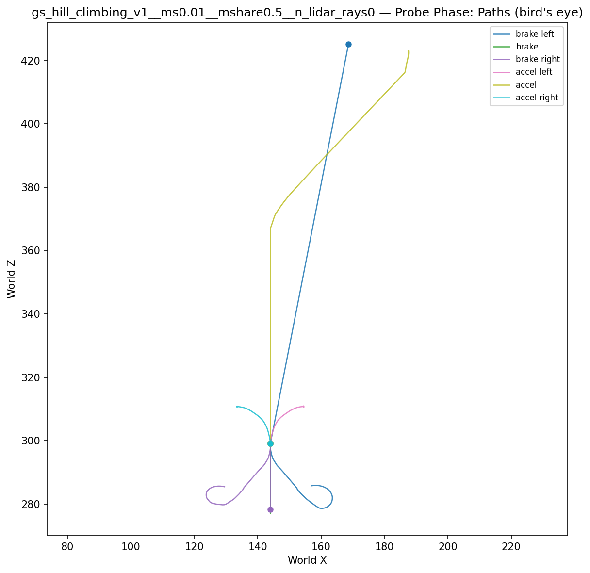

## Cold-Start Search

Best cold-start reward: **+2961.7**
Probe floor: **+1721.9**

| Restart | Best Reward | Beat Probe Floor |          |
|---------|-------------|------------------|----------|
|       1 |      -523.8 | no               |  |
|       2 |      -536.7 | no               |  |
|       3 |      -591.0 | no               |  |
|       4 |     +2961.7 | yes              | ← best |

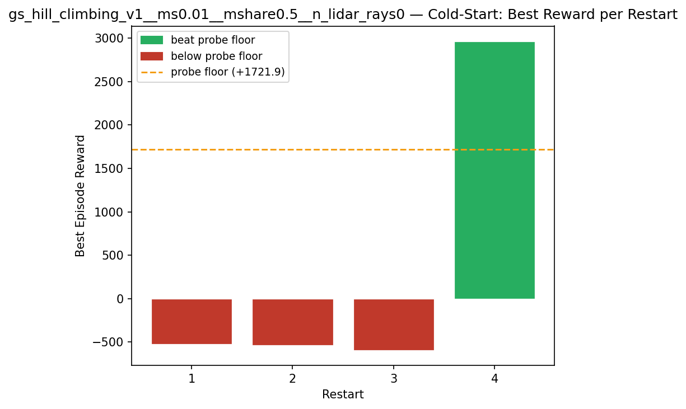

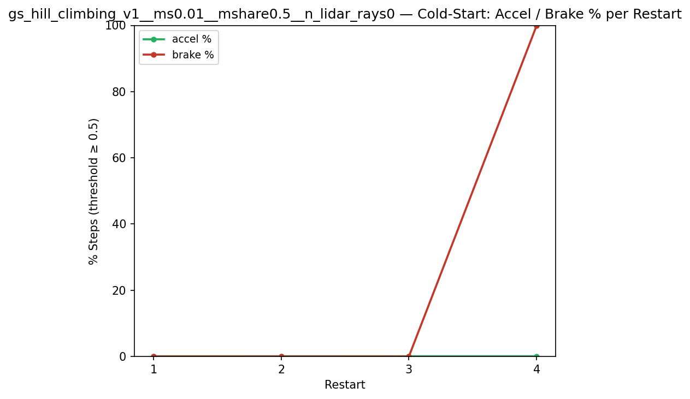

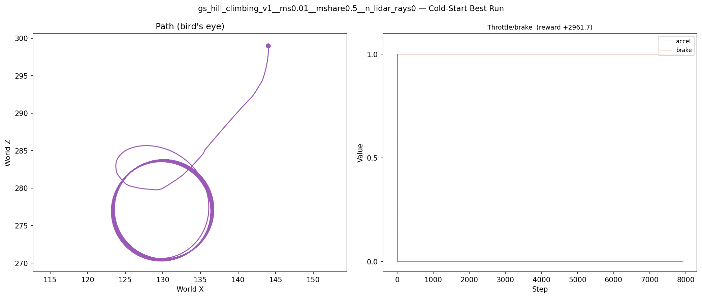

## Greedy Phase

Best reward: **+2964.2**

| Sim  | Reward   | Progress | Finish Time | Mean abs lat | Reason       | Result       |
|------|----------|----------|-------------|--------------|--------------|-------------|
|    1 |   +569.1 | 0.000    | —           | 12.43m  | timeout      |  |
|    2 |   +570.7 | 0.000    | —           | 12.47m  | timeout      |  |
|    3 |   +571.4 | 0.000    | —           | 12.29m  | timeout      |  |
|    4 |   +567.2 | 0.000    | —           | 12.50m  | timeout      |  |
|    5 |   +572.0 | 0.000    | —           | 12.27m  | timeout      |  |
|    6 |   +576.1 | 0.000    | —           | 12.47m  | timeout      |  |
|    7 |   +567.1 | 0.000    | —           | 12.57m  | timeout      |  |
|    8 |   +568.2 | 0.000    | —           | 12.36m  | timeout      |  |
|    9 |   +574.1 | 0.000    | —           | 12.60m  | timeout      |  |
|   10 |   +573.1 | 0.000    | —           | 12.55m  | timeout      |  |
|   11 |   +575.0 | 0.000    | —           | 12.42m  | timeout      |  |
|   12 |   +571.3 | 0.000    | —           | 12.38m  | timeout      |  |
|   13 |   +575.2 | 0.000    | —           | 12.51m  | timeout      |  |
|   14 |   +580.2 | 0.000    | —           | 12.51m  | timeout      |  |
|   15 |   +574.0 | 0.000    | —           | 12.42m  | timeout      |  |
|   16 |   +571.7 | 0.000    | —           | 12.60m  | timeout      |  |
|   17 |   +572.0 | 0.000    | —           | 12.69m  | timeout      |  |
|   18 |   +569.6 | 0.000    | —           | 12.61m  | timeout      |  |
|   19 |   +574.1 | 0.000    | —           | 12.61m  | timeout      |  |
|   20 |   +571.1 | 0.000    | —           | 12.22m  | timeout      |  |
|   21 |   +569.0 | 0.000    | —           | 12.35m  | timeout      |  |
|   22 |   +572.1 | 0.000    | —           | 12.52m  | timeout      |  |
|   23 |   +570.2 | 0.000    | —           | 12.46m  | timeout      |  |
|   24 |   +570.5 | 0.000    | —           | 12.49m  | timeout      |  |
|   25 |   +568.1 | 0.000    | —           | 12.58m  | timeout      |  |
|   26 |   +567.4 | 0.000    | —           | 12.58m  | timeout      |  |
|   27 |   +568.4 | 0.000    | —           | 12.42m  | timeout      |  |
|   28 |   +572.7 | 0.000    | —           | 12.37m  | timeout      |  |
|   29 |   +578.4 | 0.000    | —           | 12.64m  | timeout      |  |
|   30 |   +576.3 | 0.000    | —           | 12.34m  | timeout      |  |
|   31 |   +572.4 | 0.000    | —           | 12.45m  | timeout      |  |
|   32 |   +574.0 | 0.000    | —           | 12.55m  | timeout      |  |
|   33 |   +569.9 | 0.000    | —           | 12.47m  | timeout      |  |
|   34 |   +567.4 | 0.000    | —           | 12.42m  | timeout      |  |
|   35 |   +570.9 | 0.000    | —           | 12.52m  | timeout      |  |
|   36 |   +574.6 | 0.000    | —           | 12.41m  | timeout      |  |
|   37 |   +571.0 | 0.000    | —           | 12.36m  | timeout      |  |
|   38 |   +568.4 | 0.000    | —           | 12.58m  | timeout      |  |
|   39 |   +570.9 | 0.000    | —           | 12.39m  | timeout      |  |
|   40 |   +574.4 | 0.000    | —           | 12.41m  | timeout      |  |
|   41 |   +566.3 | 0.000    | —           | 12.49m  | timeout      |  |
|   42 |   +571.8 | 0.000    | —           | 12.48m  | timeout      |  |
|   43 |   +573.5 | 0.000    | —           | 12.60m  | timeout      |  |
|   44 |   +568.4 | 0.000    | —           | 12.42m  | timeout      |  |
|   45 |   +572.2 | 0.000    | —           | 12.36m  | timeout      |  |
|   46 |   +567.1 | 0.000    | —           | 12.57m  | timeout      |  |
|   47 |   +579.8 | 0.000    | —           | 12.48m  | timeout      |  |
|   48 |   +670.9 | 0.000    | —           | 12.49m  | timeout      |  |
|   49 |   +581.4 | 0.000    | —           | 12.15m  | timeout      |  |
|   50 |   +572.0 | 0.000    | —           | 12.13m  | timeout      |  |
|   51 |  +1365.1 | 0.000    | —           | 13.23m  | timeout      |  |
|   52 |  +1365.1 | 0.000    | —           | 13.03m  | timeout      |  |
|   53 |  +1367.7 | 0.000    | —           | 13.27m  | timeout      |  |
|   54 |  +1367.8 | 0.000    | —           | 13.22m  | timeout      |  |
|   55 |  +1370.2 | 0.000    | —           | 13.17m  | timeout      |  |
|   56 |  +1370.6 | 0.000    | —           | 13.17m  | timeout      |  |
|   57 |  +1369.6 | 0.000    | —           | 13.24m  | timeout      |  |
|   58 |  +1374.8 | 0.000    | —           | 13.25m  | timeout      |  |
|   59 |  +1369.7 | 0.000    | —           | 13.28m  | timeout      |  |
|   60 |  +1365.6 | 0.000    | —           | 13.39m  | timeout      |  |
|   61 |  +1368.0 | 0.000    | —           | 13.20m  | timeout      |  |
|   62 |  +1364.0 | 0.000    | —           | 13.21m  | timeout      |  |
|   63 |  +1389.9 | 0.000    | —           | 13.11m  | timeout      |  |
|   64 |  +1364.9 | 0.000    | —           | 13.20m  | timeout      |  |
|   65 |  +1419.0 | 0.000    | —           | 12.90m  | timeout      |  |
|   66 |  +1378.0 | 0.000    | —           | 13.22m  | timeout      |  |
|   67 |  +1362.2 | 0.000    | —           | 13.14m  | timeout      |  |
|   68 |  +1366.7 | 0.000    | —           | 13.11m  | timeout      |  |
|   69 |  +1376.8 | 0.000    | —           | 13.25m  | timeout      |  |
|   70 |  +1372.9 | 0.000    | —           | 13.12m  | timeout      |  |
|   71 |  +1370.1 | 0.000    | —           | 13.17m  | timeout      |  |
|   72 |  +1369.4 | 0.000    | —           | 13.27m  | timeout      |  |
|   73 |  +1375.7 | 0.000    | —           | 13.21m  | timeout      |  |
|   74 |  +1369.7 | 0.000    | —           | 13.18m  | timeout      |  |
|   75 |  +1368.9 | 0.000    | —           | 13.10m  | timeout      |  |
|   76 |  +1372.1 | 0.000    | —           | 13.21m  | timeout      |  |
|   77 |  +1371.2 | 0.000    | —           | 13.27m  | timeout      |  |
|   78 |  +1367.7 | 0.000    | —           | 13.16m  | timeout      |  |
|   79 |  +1369.0 | 0.000    | —           | 13.15m  | timeout      |  |
|   80 |  +1367.1 | 0.000    | —           | 13.16m  | timeout      |  |
|   81 |  +1365.7 | 0.000    | —           | 13.13m  | timeout      |  |
|   82 |  +1362.5 | 0.000    | —           | 13.17m  | timeout      |  |
|   83 |  +1373.3 | 0.000    | —           | 13.09m  | timeout      |  |
|   84 |  +1365.0 | 0.000    | —           | 13.20m  | timeout      |  |
|   85 |  +1363.9 | 0.000    | —           | 13.06m  | timeout      |  |
|   86 |  +1363.3 | 0.000    | —           | 13.03m  | timeout      |  |
|   87 |  +1365.5 | 0.000    | —           | 13.19m  | timeout      |  |
|   88 |  +1365.5 | 0.000    | —           | 13.11m  | timeout      |  |
|   89 |  +1363.3 | 0.000    | —           | 13.18m  | timeout      |  |
|   90 |  +1363.1 | 0.000    | —           | 13.21m  | timeout      |  |
|   91 |  +1367.4 | 0.000    | —           | 13.11m  | timeout      |  |
|   92 |  +1361.9 | 0.000    | —           | 13.19m  | timeout      |  |
|   93 |  +1365.0 | 0.000    | —           | 13.14m  | timeout      |  |
|   94 |  +1364.4 | 0.000    | —           | 13.10m  | timeout      |  |
|   95 |  +1375.9 | 0.000    | —           | 13.07m  | timeout      |  |
|   96 |  +1364.0 | 0.000    | —           | 13.14m  | timeout      |  |
|   97 |  +1365.3 | 0.000    | —           | 13.06m  | timeout      |  |
|   98 |  +1365.6 | 0.000    | —           | 13.14m  | timeout      |  |
|   99 |  +1368.1 | 0.000    | —           | 13.09m  | timeout      |  |
|  100 |  +1362.4 | 0.000    | —           | 13.20m  | timeout      |  |
|  101 |  +2157.8 | 0.000    | —           | 13.41m  | timeout      |  |
|  102 |  +2156.0 | 0.000    | —           | 13.41m  | timeout      |  |
|  103 |  +2159.1 | 0.000    | —           | 13.39m  | timeout      |  |
|  104 |  +2156.6 | 0.000    | —           | 13.39m  | timeout      |  |
|  105 |  +2162.4 | 0.000    | —           | 13.32m  | timeout      |  |
|  106 |  +2163.3 | 0.000    | —           | 13.42m  | timeout      |  |
|  107 |  +2161.2 | 0.000    | —           | 13.35m  | timeout      |  |
|  108 |  +2159.2 | 0.000    | —           | 13.30m  | timeout      |  |
|  109 |  +2159.1 | 0.000    | —           | 13.45m  | timeout      |  |
|  110 |  +2162.1 | 0.000    | —           | 13.33m  | timeout      |  |
|  111 |  +2157.9 | 0.000    | —           | 13.39m  | timeout      |  |
|  112 |  +2160.9 | 0.000    | —           | 13.39m  | timeout      |  |
|  113 |  +2157.2 | 0.000    | —           | 13.38m  | timeout      |  |
|  114 |  +2160.9 | 0.000    | —           | 13.36m  | timeout      |  |
|  115 |  +2160.5 | 0.000    | —           | 13.35m  | timeout      |  |
|  116 |  +2163.1 | 0.000    | —           | 13.40m  | timeout      |  |
|  117 |  +2162.5 | 0.000    | —           | 13.40m  | timeout      |  |
|  118 |  +2158.2 | 0.000    | —           | 13.34m  | timeout      |  |
|  119 |  +2162.1 | 0.000    | —           | 13.40m  | timeout      |  |
|  120 |  +2161.1 | 0.000    | —           | 13.34m  | timeout      |  |
|  121 |  +2159.8 | 0.000    | —           | 13.34m  | timeout      |  |
|  122 |  +2159.1 | 0.000    | —           | 13.39m  | timeout      |  |
|  123 |  +2163.7 | 0.000    | —           | 13.40m  | timeout      |  |
|  124 |  +2161.1 | 0.000    | —           | 13.41m  | timeout      |  |
|  125 |  +2163.9 | 0.000    | —           | 13.42m  | timeout      |  |
|  126 |  +2163.2 | 0.000    | —           | 13.39m  | timeout      |  |
|  127 |  +2165.4 | 0.000    | —           | 13.40m  | timeout      |  |
|  128 |  +2158.0 | 0.000    | —           | 13.36m  | timeout      |  |
|  129 |  +2161.2 | 0.000    | —           | 13.43m  | timeout      |  |
|  130 |  +2161.8 | 0.000    | —           | 13.36m  | timeout      |  |
|  131 |  +2159.4 | 0.000    | —           | 13.42m  | timeout      |  |
|  132 |  +2163.2 | 0.000    | —           | 13.41m  | timeout      |  |
|  133 |  +2158.7 | 0.000    | —           | 13.31m  | timeout      |  |
|  134 |  +2160.5 | 0.000    | —           | 13.37m  | timeout      |  |
|  135 |  +2161.0 | 0.000    | —           | 13.37m  | timeout      |  |
|  136 |  +2157.2 | 0.000    | —           | 13.38m  | timeout      |  |
|  137 |  +2161.3 | 0.000    | —           | 13.37m  | timeout      |  |
|  138 |  +2160.7 | 0.000    | —           | 13.41m  | timeout      |  |
|  139 |  +2162.4 | 0.000    | —           | 13.41m  | timeout      |  |
|  140 |  +2159.9 | 0.000    | —           | 13.41m  | timeout      |  |
|  141 |  +2162.7 | 0.000    | —           | 13.37m  | timeout      |  |
|  142 |  +2157.4 | 0.000    | —           | 13.40m  | timeout      |  |
|  143 |  +2160.2 | 0.000    | —           | 13.38m  | timeout      |  |
|  144 |  +2158.2 | 0.000    | —           | 13.36m  | timeout      |  |
|  145 |  +2158.2 | 0.000    | —           | 13.43m  | timeout      |  |
|  146 |  +2157.5 | 0.000    | —           | 13.40m  | timeout      |  |
|  147 |  +2158.1 | 0.000    | —           | 13.43m  | timeout      |  |
|  148 |  +2164.5 | 0.000    | —           | 13.44m  | timeout      |  |
|  149 |  +2161.7 | 0.000    | —           | 13.35m  | timeout      |  |
|  150 |  +2160.3 | 0.000    | —           | 13.41m  | timeout      |  |
|  151 |  +2953.2 | 0.000    | —           | 13.63m  | timeout      |  |
|  152 |  +2964.2 | 0.000    | —           | 13.62m  | timeout      | **NEW BEST** |
|  153 |  +2956.3 | 0.000    | —           | 13.67m  | timeout      |  |
|  154 |  +2957.0 | 0.000    | —           | 13.68m  | timeout      |  |
|  155 |  +2958.1 | 0.000    | —           | 13.64m  | timeout      |  |
|  156 |  +2955.1 | 0.000    | —           | 13.68m  | timeout      |  |
|  157 |  +2952.0 | 0.000    | —           | 13.58m  | timeout      |  |
|  158 |  +2960.0 | 0.000    | —           | 13.72m  | timeout      |  |
|  159 |  +2949.7 | 0.000    | —           | 13.63m  | timeout      |  |
|  160 |  +2959.8 | 0.000    | —           | 13.64m  | timeout      |  |
|  161 |  +2961.3 | 0.000    | —           | 13.59m  | timeout      |  |
|  162 |  +2954.2 | 0.000    | —           | 13.69m  | timeout      |  |
|  163 |  +2954.3 | 0.000    | —           | 13.63m  | timeout      |  |
|  164 |  +2954.0 | 0.000    | —           | 13.71m  | timeout      |  |
|  165 |  +2956.6 | 0.000    | —           | 13.69m  | timeout      |  |
|  166 |  +2955.5 | 0.000    | —           | 13.64m  | timeout      |  |
|  167 |  +2956.3 | 0.000    | —           | 13.65m  | timeout      |  |
|  168 |  +2956.5 | 0.000    | —           | 13.60m  | timeout      |  |
|  169 |  +2956.3 | 0.000    | —           | 13.69m  | timeout      |  |
|  170 |  +2954.8 | 0.000    | —           | 13.63m  | timeout      |  |
|  171 |  +2950.5 | 0.000    | —           | 13.70m  | timeout      |  |
|  172 |  +2957.0 | 0.000    | —           | 13.63m  | timeout      |  |
|  173 |  +2955.4 | 0.000    | —           | 13.70m  | timeout      |  |
|  174 |  +2956.7 | 0.000    | —           | 13.72m  | timeout      |  |
|  175 |  +2955.5 | 0.000    | —           | 13.61m  | timeout      |  |
|  176 |  +2961.7 | 0.000    | —           | 13.65m  | timeout      |  |
|  177 |  +2955.0 | 0.000    | —           | 13.67m  | timeout      |  |
|  178 |  +2953.5 | 0.000    | —           | 13.64m  | timeout      |  |
|  179 |  +2955.8 | 0.000    | —           | 13.66m  | timeout      |  |
|  180 |  +2958.2 | 0.000    | —           | 13.70m  | timeout      |  |
|  181 |  +2953.3 | 0.000    | —           | 13.65m  | timeout      |  |
|  182 |  +2952.0 | 0.000    | —           | 13.70m  | timeout      |  |
|  183 |  +2954.1 | 0.000    | —           | 13.64m  | timeout      |  |
|  184 |  +2959.6 | 0.000    | —           | 13.64m  | timeout      |  |
|  185 |  +2957.1 | 0.000    | —           | 13.62m  | timeout      |  |
|  186 |  +2957.9 | 0.000    | —           | 13.68m  | timeout      |  |
|  187 |  +2956.4 | 0.000    | —           | 13.68m  | timeout      |  |
|  188 |  +2959.6 | 0.000    | —           | 13.74m  | timeout      |  |
|  189 |  +2956.6 | 0.000    | —           | 13.66m  | timeout      |  |
|  190 |  +2959.4 | 0.000    | —           | 13.65m  | timeout      |  |
|  191 |  +2951.8 | 0.000    | —           | 13.68m  | timeout      |  |
|  192 |  +2957.1 | 0.000    | —           | 13.68m  | timeout      |  |
|  193 |  +2954.1 | 0.000    | —           | 13.68m  | timeout      |  |
|  194 |  +2957.5 | 0.000    | —           | 13.67m  | timeout      |  |
|  195 |  +2957.7 | 0.000    | —           | 13.69m  | timeout      |  |
|  196 |  +2957.4 | 0.000    | —           | 13.69m  | timeout      |  |
|  197 |  +2957.1 | 0.000    | —           | 13.70m  | timeout      |  |
|  198 |  +2957.0 | 0.000    | —           | 13.68m  | timeout      |  |
|  199 |  +2955.0 | 0.000    | —           | 13.66m  | timeout      |  |
|  200 |  +2953.7 | 0.000    | —           | 13.66m  | timeout      |  |

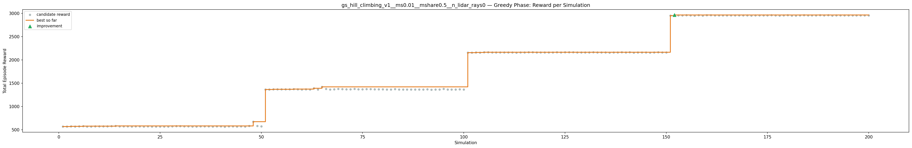

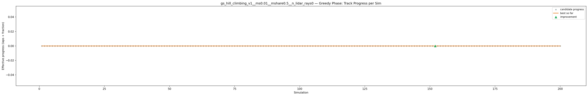

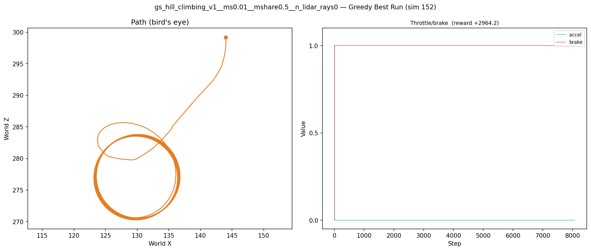

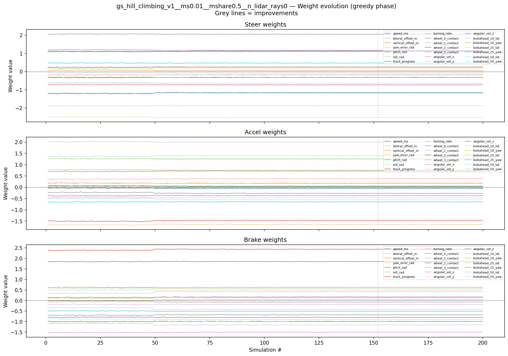

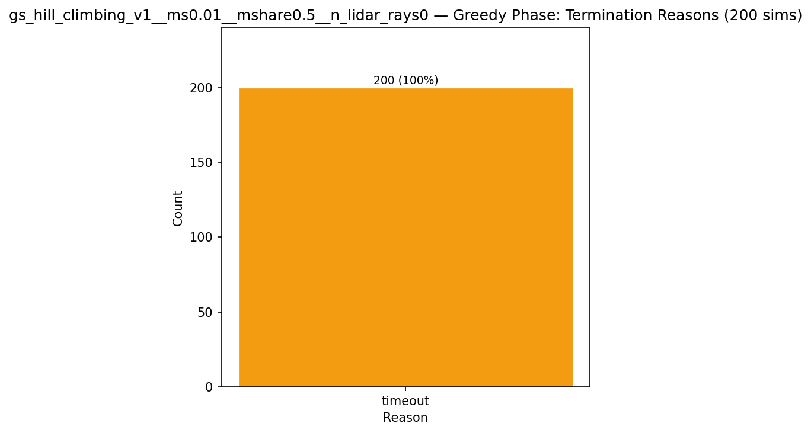

## Task Metrics (config-independent)

| Metric | Value |
|--------|-------|
| Finish rate | 0.0% (0/200 sims) |
| Best track progress | 0.0000 |
| Mean track progress | 0.0000 |
| Mean abs lateral offset | 13.168m |

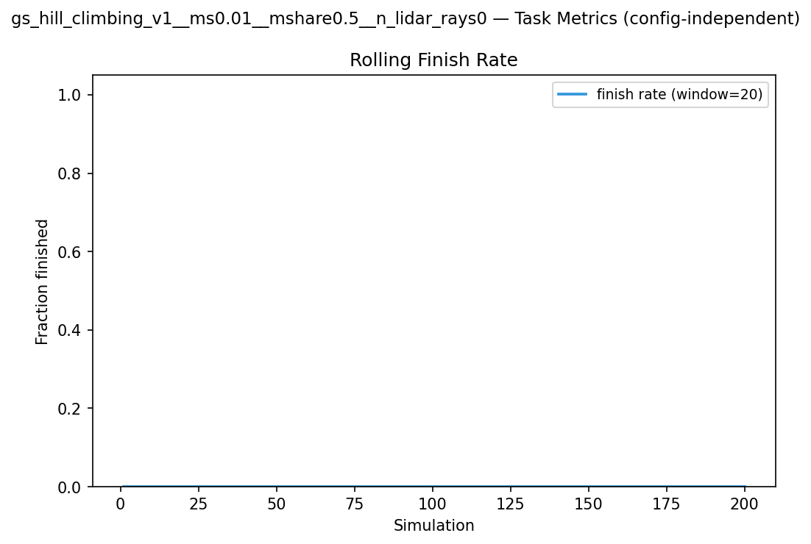

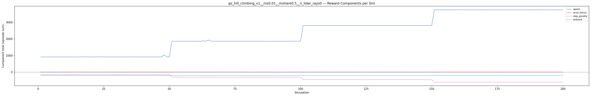

## Additional Plots

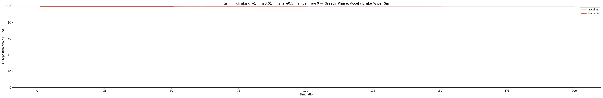

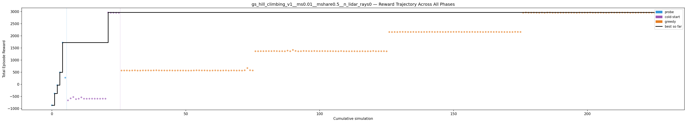

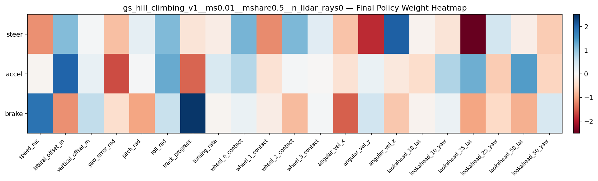

