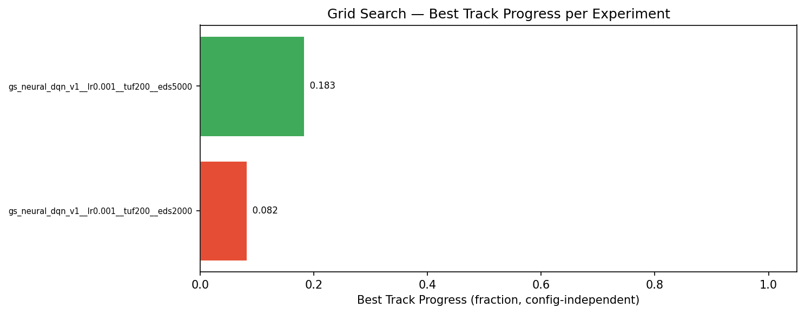
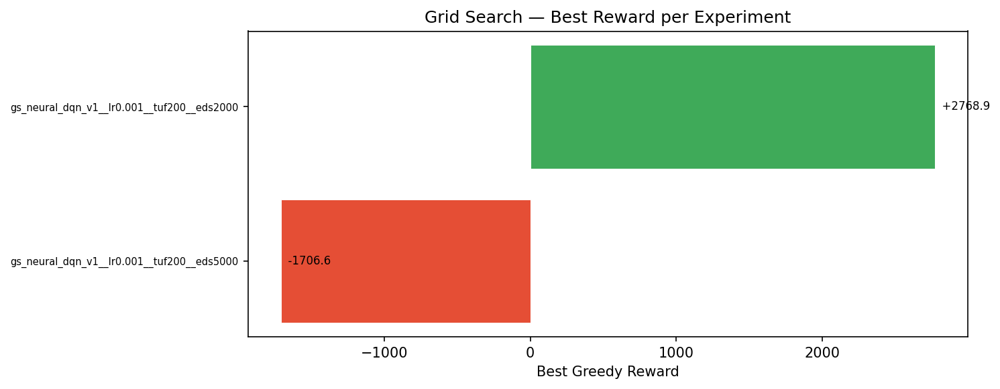
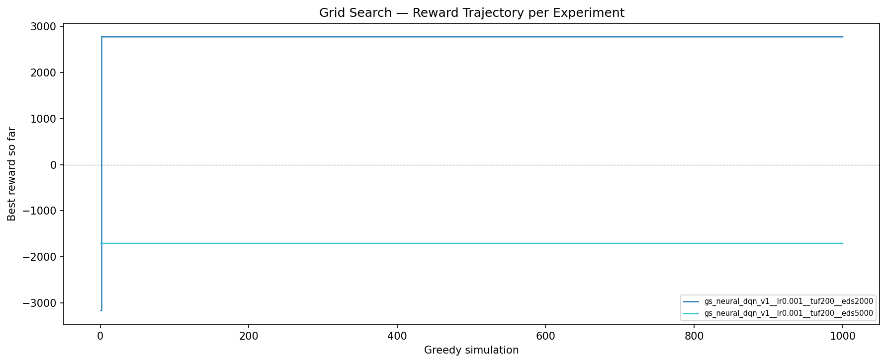

# Grid Search Summary: gs_neural_dqn_v1

2 experiments.

## Code Versions

- `0.2.12+g3b30db5.dirty` (2): gs_neural_dqn_v1__lr0.001__tuf200__eds2000, gs_neural_dqn_v1__lr0.001__tuf200__eds5000

## Rankings by Task Metrics (config-independent)

Ranked by Best Track Progress, then by best reward.

| Rank | Experiment | Best Track Progress | Finish Rate | Best Finish Time | Best Reward |
|------|-----------|---------------|-------------|-----------------|-------------|
| 1 | gs_neural_dqn_v1__lr0.001__tuf200__eds5000 | 0.1830 | 0.0% | — | -1706.6 |
| 2 | gs_neural_dqn_v1__lr0.001__tuf200__eds2000 | 0.0823 | 0.0% | — | +2768.9 |

## Rankings by Reward

| Rank | Experiment | Best Reward | Improvements | First Improv. Sim | Accel % | Greedy Time |
|------|-----------|-------------|--------------|-------------------|---------|-------------|
| 1 | gs_neural_dqn_v1__lr0.001__tuf200__eds2000 | +2768.9 | 2 | 1 | 45% | 1h 40m 41.0s |
| 2 | gs_neural_dqn_v1__lr0.001__tuf200__eds5000 | -1706.6 | 1 | 1 | 27% | 1h 31m 09.3s |

---

## 1. gs_neural_dqn_v1__lr0.001__tuf200__eds5000

**Best reward: -1706.6** | **Best Track Progress: 0.1830** | **Finish rate: 0.0%**

| Param | Value |
|---|---|
| `learning_rate` | 0.001 |
| `target_update_freq` | 200 |
| `epsilon_decay_steps` | 5000 |

| Stat | Value |
|---|---|
| Code version | `0.2.12+g3b30db5.dirty` |
| Best Track Progress | 0.1830 |
| Finish rate | 0.0% |
| Best finish time | — |
| Greedy improvements | 1 |
| First improvement (sim) | 1 |
| Accel % of best run | 27.2% |
| Greedy runtime | 1h 31m 09.3s |

---

## 2. gs_neural_dqn_v1__lr0.001__tuf200__eds2000

**Best reward: +2768.9** | **Best Track Progress: 0.0823** | **Finish rate: 0.0%**

| Param | Value |
|---|---|
| `learning_rate` | 0.001 |
| `target_update_freq` | 200 |
| `epsilon_decay_steps` | 2000 |

| Stat | Value |
|---|---|
| Code version | `0.2.12+g3b30db5.dirty` |
| Best Track Progress | 0.0823 |
| Finish rate | 0.0% |
| Best finish time | — |
| Greedy improvements | 2 |
| First improvement (sim) | 1 |
| Accel % of best run | 45.3% |
| Greedy runtime | 1h 40m 41.0s |

