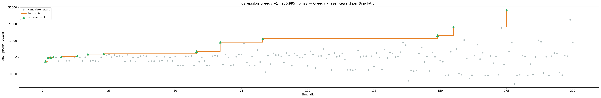
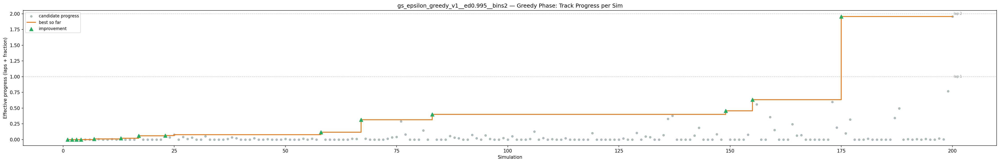
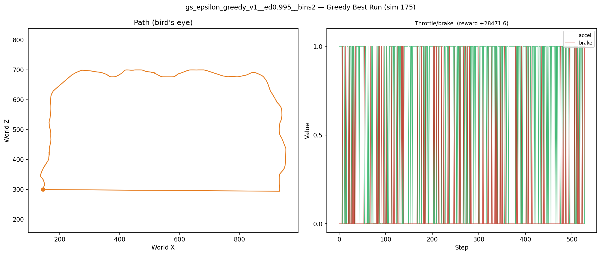
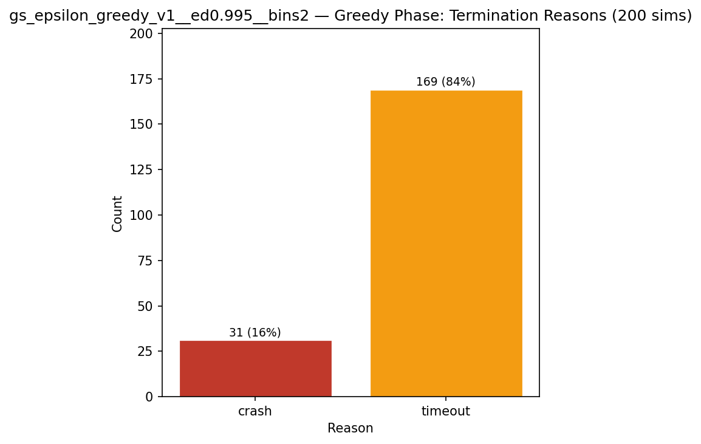
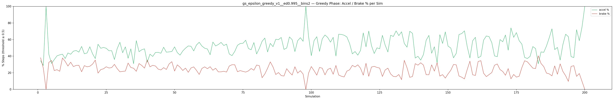
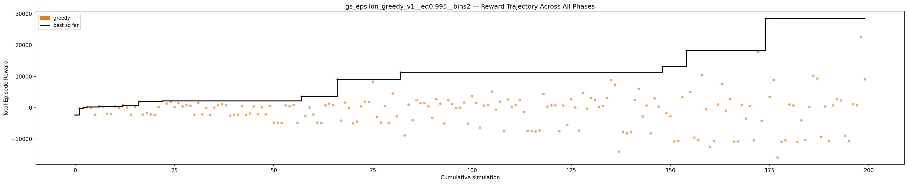

# Experiment: gs_epsilon_greedy_v1__ed0.995__bins2

**Track:** a03_centerline

## Timings

- **Start:** 2026-04-28 14:50:37
- **End:** 2026-04-28 15:28:37
- **Total runtime:** 38m 00.1s

| Phase | Duration |
|-------|----------|
| Greedy | 37m 59.0s |

## Run Parameters

### Training

| Parameter | Value |
|-----------|-------|
| track | a03_centerline |
| speed | 5.0 |
| n_sims | 200 |
| in_game_episode_s | 100.0 |
| mutation_scale | 0.05 |
| probe_s | 8.0 |
| cold_restarts | 1 |
| cold_sims | 1 |
| n_lidar_rays | 8 |
| policy_type | epsilon_greedy |
| alpha | 0.1 |
| gamma | 0.99 |
| epsilon | 0.95 |
| epsilon_min | 0.05 |
| epsilon_decay | 0.995 |
| n_bins | 2 |

### Reward Config

| Parameter | Value |
|-----------|-------|
| progress_weight | 20000.0 |
| centerline_weight | 0.0 |
| centerline_exp | 0.0 |
| speed_weight | 0.05 |
| step_penalty | -0.05 |
| finish_bonus | 5000.0 |
| finish_time_weight | -5.0 |
| par_time_s | 60.0 |
| accel_bonus | 0.5 |
| airborne_penalty | -1.0 |
| lidar_wall_weight | -5.0 |
| crash_threshold_m | 25.0 |
| track_name | a03_centerline |
| centerline_path | games/tmnf/tracks/a03_centerline.npy |

## Greedy Phase

Best reward: **+28471.6**

| Sim  | Reward   | Reason       | Result       |
|------|----------|--------------|-------------|
|    1 |  -2348.5 | timeout      | **NEW BEST** |
|    2 |   -157.5 | crash        | **NEW BEST** |
|    3 |     -4.1 | crash        | **NEW BEST** |
|    4 |   +223.3 | timeout      | **NEW BEST** |
|    5 |   -137.2 | timeout      |  |
|    6 |  -2239.4 | timeout      |  |
|    7 |   +395.3 | timeout      | **NEW BEST** |
|    8 |   +320.7 | timeout      |  |
|    9 |  -2025.0 | timeout      |  |
|   10 |  -2069.5 | timeout      |  |
|   11 |   +383.3 | timeout      |  |
|   12 |   -170.4 | timeout      |  |
|   13 |   +762.6 | timeout      | **NEW BEST** |
|   14 |    +33.5 | timeout      |  |
|   15 |  -2220.9 | timeout      |  |
|   16 |   +170.5 | timeout      |  |
|   17 |  +1921.1 | timeout      | **NEW BEST** |
|   18 |  -2211.4 | timeout      |  |
|   19 |  -1776.9 | timeout      |  |
|   20 |  -2164.6 | timeout      |  |
|   21 |  -2337.3 | timeout      |  |
|   22 |   +141.8 | crash        |  |
|   23 |  +2179.5 | timeout      | **NEW BEST** |
|   24 |  +1273.5 | timeout      |  |
|   25 |  +1896.3 | timeout      |  |
|   26 |   +176.3 | timeout      |  |
|   27 |  +1467.0 | timeout      |  |
|   28 |   +367.3 | timeout      |  |
|   29 |   +927.0 | timeout      |  |
|   30 |   +623.8 | crash        |  |
|   31 |  -2275.8 | timeout      |  |
|   32 |  +1576.1 | timeout      |  |
|   33 |  -2126.1 | timeout      |  |
|   34 |    -78.8 | timeout      |  |
|   35 |  -2348.8 | timeout      |  |
|   36 |    +40.0 | crash        |  |
|   37 |   +765.9 | timeout      |  |
|   38 |  +1074.3 | timeout      |  |
|   39 |   +770.8 | timeout      |  |
|   40 |  -2513.1 | timeout      |  |
|   41 |  -2287.2 | timeout      |  |
|   42 |  -2203.4 | timeout      |  |
|   43 |   +587.7 | timeout      |  |
|   44 |  -2250.1 | timeout      |  |
|   45 |  -1866.8 | timeout      |  |
|   46 |   +398.4 | timeout      |  |
|   47 |  -2031.2 | timeout      |  |
|   48 |   +117.6 | timeout      |  |
|   49 |  -2162.1 | timeout      |  |
|   50 |   +576.8 | timeout      |  |
|   51 |  -4771.5 | timeout      |  |
|   52 |  -4839.8 | timeout      |  |
|   53 |  -4824.2 | timeout      |  |
|   54 |   +738.7 | timeout      |  |
|   55 |   +520.7 | crash        |  |
|   56 |   +838.1 | timeout      |  |
|   57 |  -4831.0 | timeout      |  |
|   58 |  +3517.4 | timeout      | **NEW BEST** |
|   59 |  -2678.4 | timeout      |  |
|   60 |    +46.7 | crash        |  |
|   61 |  -2202.1 | timeout      |  |
|   62 |  -4785.1 | timeout      |  |
|   63 |  -4818.1 | timeout      |  |
|   64 |   +715.6 | timeout      |  |
|   65 |  +1271.1 | timeout      |  |
|   66 |   +899.9 | timeout      |  |
|   67 |  +9073.5 | timeout      | **NEW BEST** |
|   68 |  -4137.5 | timeout      |  |
|   69 |  +1648.7 | timeout      |  |
|   70 |    -99.8 | timeout      |  |
|   71 |  -5015.0 | timeout      |  |
|   72 |  -4466.3 | timeout      |  |
|   73 |   +418.5 | crash        |  |
|   74 |  +1943.9 | timeout      |  |
|   75 |  +1842.0 | timeout      |  |
|   76 |  +8327.9 | timeout      |  |
|   77 |  -2977.9 | timeout      |  |
|   78 |  -4772.9 | timeout      |  |
|   79 |   +451.0 | crash        |  |
|   80 |  -4898.1 | timeout      |  |
|   81 |  +4529.3 | timeout      |  |
|   82 |  -2793.7 | crash        |  |
|   83 | +11338.4 | timeout      | **NEW BEST** |
|   84 |  -8894.8 | timeout      |  |
|   85 |   +963.5 | crash        |  |
|   86 |  -4021.9 | timeout      |  |
|   87 |  +2442.5 | timeout      |  |
|   88 |  +1448.1 | timeout      |  |
|   89 |  +1486.3 | timeout      |  |
|   90 |   +434.3 | crash        |  |
|   91 |  -3274.7 | timeout      |  |
|   92 |  +2746.3 | timeout      |  |
|   93 |  +1296.0 | timeout      |  |
|   94 |  -5039.3 | timeout      |  |
|   95 |  +2367.5 | timeout      |  |
|   96 |  +1226.8 | timeout      |  |
|   97 |   -141.5 | crash        |  |
|   98 |     +3.2 | crash        |  |
|   99 |  +1652.1 | timeout      |  |
|  100 |  -5095.6 | timeout      |  |
|  101 |  +3677.3 | timeout      |  |
|  102 |  +1553.4 | timeout      |  |
|  103 |  -6359.0 | timeout      |  |
|  104 |   +677.3 | crash        |  |
|  105 |   +831.6 | crash        |  |
|  106 |  +5167.9 | timeout      |  |
|  107 |   -653.6 | timeout      |  |
|  108 |  +1935.6 | timeout      |  |
|  109 |  -7596.8 | timeout      |  |
|  110 |  +2632.5 | timeout      |  |
|  111 |   +331.7 | crash        |  |
|  112 |   +900.9 | timeout      |  |
|  113 |  +2445.4 | timeout      |  |
|  114 |  -1326.3 | timeout      |  |
|  115 |  -7454.3 | timeout      |  |
|  116 |  -7538.2 | timeout      |  |
|  117 |  -7626.9 | timeout      |  |
|  118 |  -7295.0 | timeout      |  |
|  119 |  +4348.5 | timeout      |  |
|  120 |   +296.1 | crash        |  |
|  121 |   +706.8 | crash        |  |
|  122 |   +771.9 | timeout      |  |
|  123 |  -7565.0 | timeout      |  |
|  124 |   +670.5 | crash        |  |
|  125 |  -5537.1 | timeout      |  |
|  126 |  +2647.2 | timeout      |  |
|  127 |    +84.2 | crash        |  |
|  128 |  -7327.6 | timeout      |  |
|  129 |  +4628.7 | timeout      |  |
|  130 |   -312.1 | crash        |  |
|  131 |  +3023.9 | timeout      |  |
|  132 |  +2372.4 | timeout      |  |
|  133 |   +242.6 | crash        |  |
|  134 |   +595.5 | crash        |  |
|  135 |  +3144.6 | timeout      |  |
|  136 |  +8796.5 | timeout      |  |
|  137 |  +7358.7 | timeout      |  |
|  138 | -14038.9 | timeout      |  |
|  139 |  -7728.3 | timeout      |  |
|  140 |  -8216.7 | timeout      |  |
|  141 |  -7832.8 | timeout      |  |
|  142 |  +2423.5 | timeout      |  |
|  143 |  +6041.1 | timeout      |  |
|  144 |  -2792.2 | timeout      |  |
|  145 |   +682.3 | timeout      |  |
|  146 |  -8257.9 | timeout      |  |
|  147 |  +2987.7 | timeout      |  |
|  148 |   +325.0 | crash        |  |
|  149 | +13076.1 | timeout      | **NEW BEST** |
|  150 |  -1756.1 | timeout      |  |
|  151 |  -2691.6 | timeout      |  |
|  152 | -10856.1 | timeout      |  |
|  153 | -10610.7 | timeout      |  |
|  154 |  +3329.7 | timeout      |  |
|  155 | +18227.3 | timeout      | **NEW BEST** |
|  156 |  +5022.9 | timeout      |  |
|  157 |  -9576.0 | timeout      |  |
|  158 | -10365.1 | timeout      |  |
|  159 | +10428.5 | timeout      |  |
|  160 |   -554.1 | timeout      |  |
|  161 | -12536.1 | timeout      |  |
|  162 | -10630.5 | timeout      |  |
|  163 |  +1009.6 | crash        |  |
|  164 |  +7592.2 | timeout      |  |
|  165 |   -951.9 | timeout      |  |
|  166 |  +2765.1 | timeout      |  |
|  167 | -10846.3 | timeout      |  |
|  168 | -10805.7 | timeout      |  |
|  169 |   +769.3 | timeout      |  |
|  170 |  -3488.4 | timeout      |  |
|  171 |   +552.5 | crash        |  |
|  172 | -10440.1 | timeout      |  |
|  173 | +17727.1 | timeout      |  |
|  174 |  -4249.9 | timeout      |  |
|  175 | +28471.6 | crash        | **NEW BEST** |
|  176 |  +3423.1 | timeout      |  |
|  177 |  +8876.1 | timeout      |  |
|  178 | -15917.5 | timeout      |  |
|  179 | -10920.6 | timeout      |  |
|  180 | -10428.8 | timeout      |  |
|  181 |  +1000.7 | timeout      |  |
|  182 |   +702.3 | timeout      |  |
|  183 | -10941.7 | timeout      |  |
|  184 |  -4056.0 | timeout      |  |
|  185 | -10287.2 | timeout      |  |
|  186 |   +258.5 | crash        |  |
|  187 | +10248.8 | timeout      |  |
|  188 |  +9309.7 | timeout      |  |
|  189 |  -9395.4 | timeout      |  |
|  190 |   +363.9 | timeout      |  |
|  191 | -10727.7 | timeout      |  |
|  192 |   +738.3 | timeout      |  |
|  193 |  +2672.6 | timeout      |  |
|  194 |  +2291.0 | timeout      |  |
|  195 |  -8996.8 | timeout      |  |
|  196 | -10660.2 | timeout      |  |
|  197 |  +1091.8 | crash        |  |
|  198 |   +734.2 | timeout      |  |
|  199 | +22514.5 | timeout      |  |
|  200 |  +9057.4 | crash        |  |

## Additional Plots

